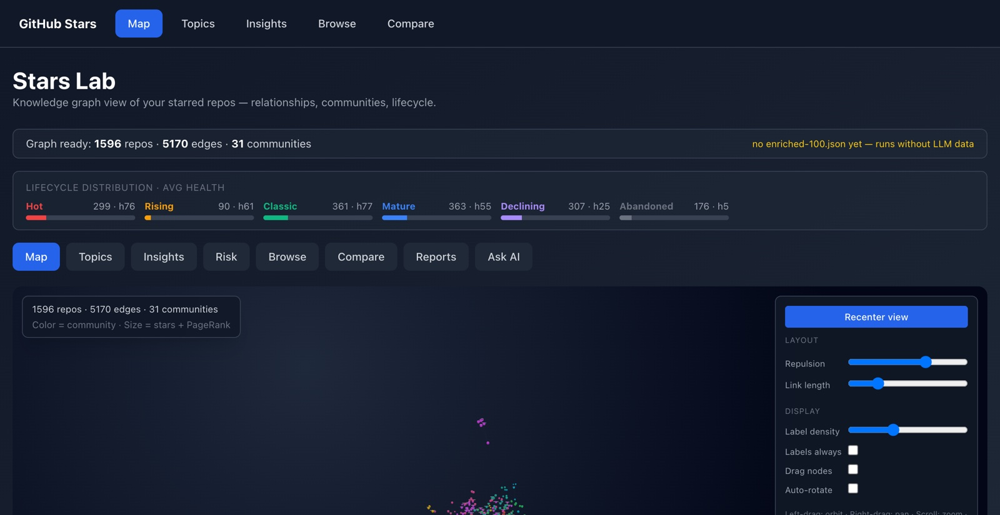
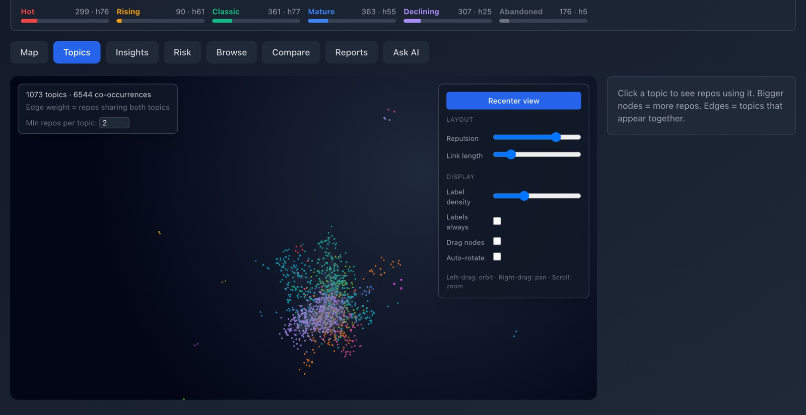
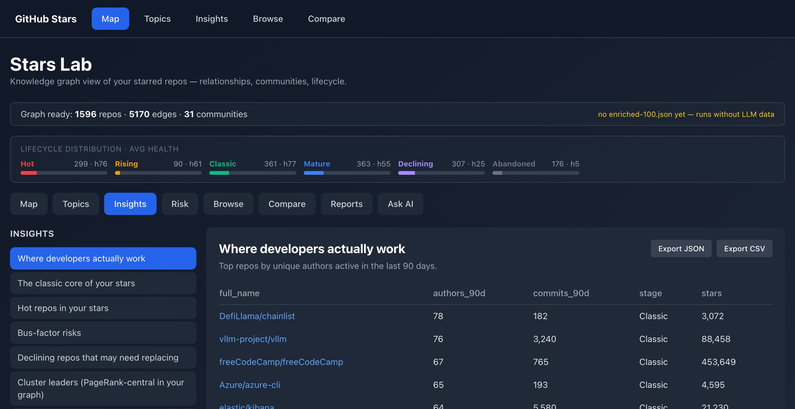
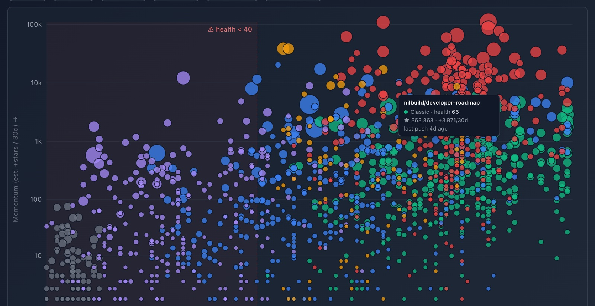
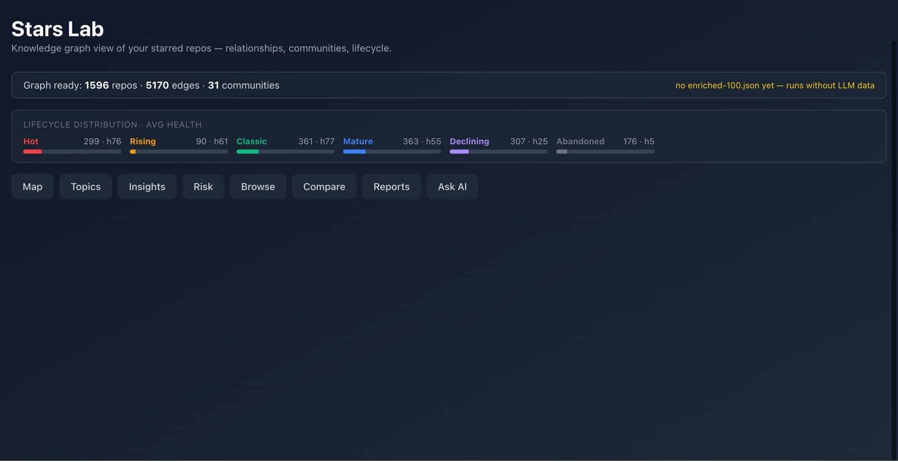
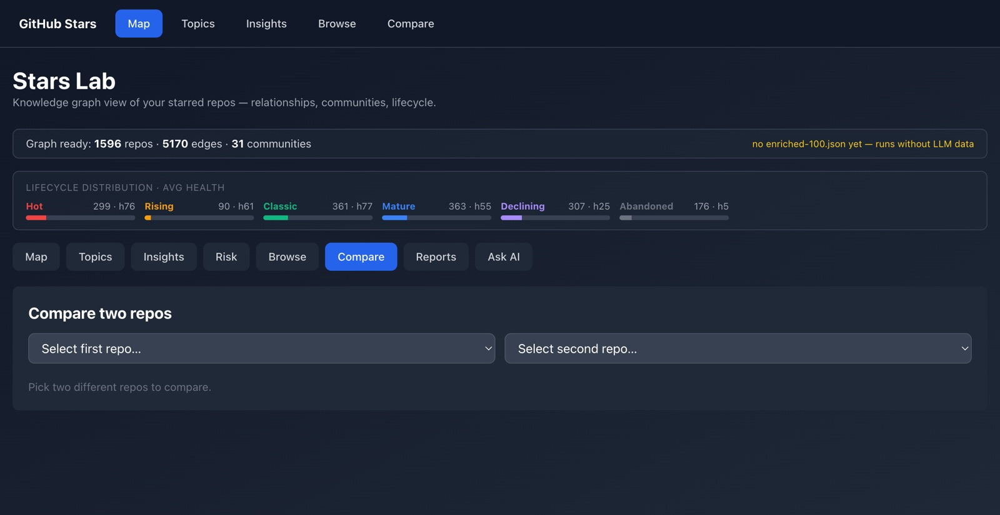
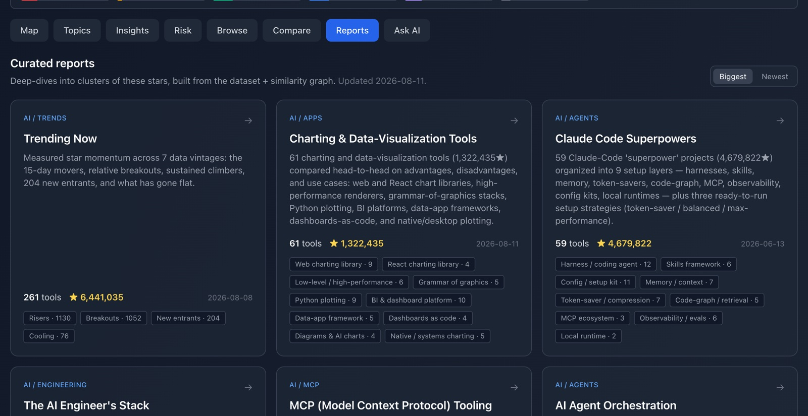
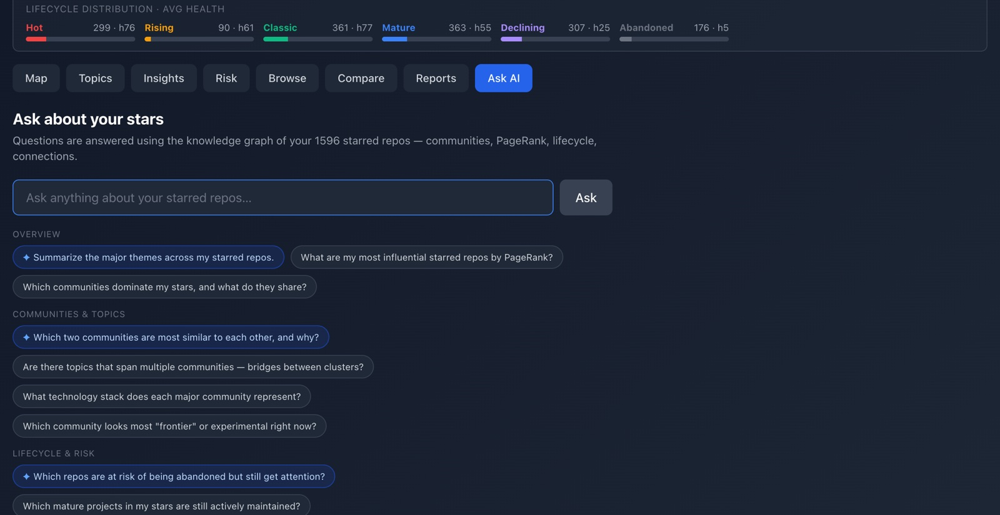

# GitHub Stars Analyzer

Turn a pile of GitHub stars into a navigable map: a 3D knowledge graph of your
starred repositories with communities, lifecycle scoring, risk signals, curated
landscape reports, and natural-language search.

**Live:** [star-astrolab.netlify.app](https://star-astrolab.netlify.app)

Currently mapping **1,596 starred repos** · 5,170 similarity edges · 31 communities · 23 landscape reports.



---

## Why

Star counts on your own account are write-only memory. After a thousand stars you
can't answer basic questions: *what did I actually save about RAG? which of these
is dead? if I need a chart library today, which one do I already know about?*

This builds the answer offline — no LLM in the hot path — and serves it as a graph
you can fly through, a set of reports you can read, and a search box you can ask.

---

## Features

### Map — the 3D knowledge graph

Every star as a node, positioned by a force simulation that runs at build time, not
in your browser. Color is community, size is stars + PageRank. Click to focus, drag
to orbit.


### Topics — what your stars are *about*

A co-occurrence graph of tags across the corpus. Shows the shape of your interests
rather than the individual repos.



### Insights — named questions, answered

Prewritten analytical queries over the dataset: where developers actually work
(by 90-day author counts), the classic core of your stars, hot repos, bus-factor
risks, declining projects worth replacing, and PageRank-central cluster leaders.
Every view exports to JSON or CSV.



### Risk — what's quietly dying

Lifecycle stage, health score, bus factor, and top-author concentration surfaced
together, so single-maintainer and abandoned dependencies stand out before you
adopt them.



### Browse — the whole corpus, filtered

Searchable and sortable across every metric in the dataset: stars, forks, language,
lifecycle, health, activity.



### Compare — two repos, side by side

Full metric comparison plus the **shortest path between them through the graph** —
which shared topics, authors, or intermediaries connect two projects.



### Reports — 23 curated landscape reports

The largest feature. Each report is a **deterministic Python generator** over the
local dataset — hand-curated taxonomies, master comparison tables, per-task
rankings, graph analysis, and maintenance risk. No API calls at generation time,
so they're fully reproducible and cost nothing to rebuild.

Covering RAG tooling, agent harnesses, MCP servers, document extraction, LLM
evaluation, voice agents, fine-tuning stacks, charting libraries, trending
momentum, and more.



### Ask AI — natural language over the graph

Questions answered with the graph's community summary as grounding context, via
any OpenAI-compatible endpoint. Optional — every other tab works without a key.



---

## Architecture

The whole design principle: **do the expensive work at build time, ship a static file.**

```
GitHub API
    ↓
scripts/sample.mjs       # list the stars
scripts/ingest.mjs       # fetch full repo + author data
scripts/classify.mjs     # lifecycle stage + health score (no LLM)
scripts/precompute.mjs   # kNN graph + Louvain communities + PageRank
                         # + 300-tick force simulation → frozen positions
    ↓
public/data/
  graph.json             # ~1.8 MB — nodes/links ready for the browser
  graph-context.json     # compact community summary for LLM grounding
    ↓
scripts/reports/*.py     # 23 generators → reports/*.md + meta sidecars
scripts/reports/build_index.py
                         # snapshots the vintage, regenerates every report,
                         # injects chart SVGs, writes public/reports/index.json

Browser (React + Three.js)
  → loads graph.json and renders immediately (zero graph math in the browser)

Netlify Function /api/ask
  → loads graph-context.json, calls any OpenAI-compatible endpoint
```

Snapshots in `data/snapshots/` (one per vintage) power the ▲/▼ star-trend deltas
and the momentum-based *Trending Now* report.

---

## Quick start

```bash
npm install
cp .env.example .env          # add GITHUB_TOKEN
npm run refresh               # fetch → classify → precompute
npm run dev                   # → http://localhost:5173
```

The repo ships with committed data, so `npm run dev` works before you ever run
`refresh` — you'll just be looking at someone else's stars.

---

## Data pipeline

```bash
npm run refresh               # full chain: sample → ingest → classify → precompute
npm run precompute            # rebuild graph.json from existing classified.json
npm run reports               # regenerate all 23 reports + index
```

`refresh` needs `GITHUB_TOKEN` in `.env` (a classic PAT with no scopes is enough —
it reads public data; the token exists for the 5,000/hr rate limit). Everything
downstream of `ingest` runs entirely offline.

| Script | Input | Output |
|--------|-------|--------|
| `scripts/sample.mjs` | GitHub username | `src/data/sample-all.json` (star list) |
| `scripts/ingest.mjs` | sample + `--max-age` | `src/data/raw-all.json` (full repo data) |
| `scripts/classify.mjs` | raw JSON | `classified-all.json` (lifecycle + health) |
| `scripts/precompute.mjs` | classified JSON | `graph.json` + `graph-context.json` |
| `scripts/reports/build_index.py` | classified + graph | `reports/*.md` + `public/reports/index.json` |

A GitHub Action (`.github/workflows/refresh-data.yml`) runs the whole chain weekly
and pushes the result, which triggers a Netlify redeploy. It needs one repo secret,
`GH_STARS_TOKEN`.

---

## Writing a report

Reports are curated by hand, not generated by an LLM. `scripts/reports/rag_tooling.py`
is the canonical template:

```python
TAXONOMY = {"owner/repo": ("Category", "one-line blurb"), …}
ADJACENT = [(name, "why it's excluded"), …]
```

Then register the file in `GENERATORS` in `build_index.py` and run it. The generator
prints `tools: N / N curated` and warns on any curated name missing from the dataset —
that warning is how you catch upstream repo renames.

`scripts/reports/render_html.py` renders any report as a standalone, fully inlined
HTML page (CSS and chart SVGs embedded, works offline).

---

## Ask AI setup

Provider-agnostic: the Netlify Function talks to any **OpenAI-compatible**
chat-completions endpoint.

| Var            | Required | Default                                      |
|----------------|----------|----------------------------------------------|
| `LLM_API_KEY`  | yes      | —                                            |
| `LLM_BASE_URL` | no       | `https://api.z.ai/api/coding/paas/v4`        |
| `LLM_MODEL`    | no       | `glm-4.6`                                    |

In Netlify: **Site settings → Environment variables → Add**, then redeploy.
Locally, drop them into `.env`. Legacy `ZAI_*` names still work as fallbacks.

<details>
<summary>Provider recipes</summary>

| Provider                | `LLM_BASE_URL`                                | Example `LLM_MODEL`                                  |
|-------------------------|-----------------------------------------------|------------------------------------------------------|
| **Z.AI Coding Plan**    | `https://api.z.ai/api/coding/paas/v4`         | `glm-4.6`                                            |
| Z.AI pay-as-you-go      | `https://api.z.ai/api/paas/v4`                | `glm-4.6`                                            |
| OpenAI                  | `https://api.openai.com/v1`                   | `gpt-4o-mini`                                        |
| Groq                    | `https://api.groq.com/openai/v1`              | `llama-3.3-70b-versatile`                            |
| Together                | `https://api.together.xyz/v1`                 | `meta-llama/Llama-3.3-70B-Instruct-Turbo`            |
| DeepSeek                | `https://api.deepseek.com/v1`                 | `deepseek-chat`                                      |
| Mistral                 | `https://api.mistral.ai/v1`                   | `mistral-small-latest`                               |
| OpenRouter (→ anything) | `https://openrouter.ai/api/v1`                | `anthropic/claude-sonnet-4-5`                        |
| Fireworks               | `https://api.fireworks.ai/inference/v1`       | `accounts/fireworks/models/llama-v3p3-70b-instruct`  |
| Local Ollama            | `http://localhost:11434/v1`                   | `llama3.2`                                           |

</details>

Without `LLM_API_KEY` the tab shows a configuration notice; everything else works
normally. Quota and billing errors are surfaced as a friendly notice, not a stack trace.

---

## Deploy

1. Push to GitHub
2. Connect the repo in Netlify — it auto-detects `netlify.toml`
3. Build: `npm run build` · Publish: `dist`
4. Add `LLM_API_KEY` for Ask AI (optional)

`graph.json` and the reports are committed, so Netlify serves them without running
the pipeline at build time.

---

## Tech stack

| Layer | Libraries |
|-------|-----------|
| UI | React 18, Tailwind CSS, Lucide |
| 3D graph | react-force-graph-3d, Three.js, d3-force-3d |
| Graph algorithms | graphology, graphology-communities-louvain, graphology-metrics |
| Data pipeline | Node.js ESM scripts, GitHub REST API |
| Reports | Python 3.12 (stdlib only — no dependencies) |
| LLM | Any OpenAI-compatible API |
| Hosting | Netlify (static + Functions) |

---

## Project structure

```
scripts/
  sample.mjs          list stars for a user
  ingest.mjs          fetch full repo data from GitHub
  classify.mjs        lifecycle + health scoring
  precompute.mjs      graph build, simulation, LLM context
  reports/
    lib.py            shared formatting + snapshot/trend helpers
    build_index.py    orchestrator: snapshot → generate → charts → index
    render_html.py    markdown report → standalone HTML page
    *.py              23 report generators (one per landscape)

data/
  classified.json     classified dataset (committed)
  snapshots/          one per vintage — powers trend deltas

public/data/
  graph.json          pre-computed graph (committed)
  graph-context.json  LLM grounding context (committed)

src/lab/
  GraphProvider.jsx   loads graph.json, provides nodes/links via context
  MapView.jsx         3D force graph
  TopicMap.jsx        topic co-occurrence graph
  InsightFeed.jsx     named analytical queries
  AllRepos.jsx        searchable repo list
  Comparator.jsx      side-by-side comparison + path finding
  ReportsView.jsx     landscape report reader
  LabApp.jsx          tab routing + Ask AI UI

netlify/functions/
  ask.mjs             POST /api/ask → any OpenAI-compatible endpoint
```

---

## License

MIT © Martin Kaiser
