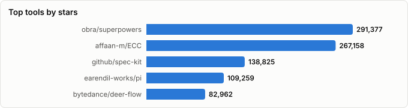
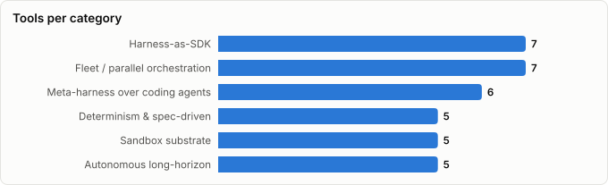

# Agent Harnesses — Six Approaches to Running Autonomous Agents

> Derived from **kaiser-data**'s 1,900 starred repos (snapshot `2026-08-31T12:10:08.018Z`), cross-referenced with the repo-similarity graph (1,900 nodes / 6,181 edges, 37 communities).
>
> Generated 2026-08-31 by `scripts/reports/agent_harnesses.py` (regenerate any time — no API cost).

## Executive summary

- A **harness** is everything around the model: the loop, tools, state, guardrails, and execution environment. **36 harness projects** in your stars (**1,476,551★** combined) cluster into **six distinct approaches** — they disagree about *where the harness lives* and *what the hard problem is*:
  - **Harness-as-SDK** (8): `pi`, `deepagents`, `jcode`, `parlant`, `harness-sdk`, `eve`, `pydantic-ai-harness`, `cheetahclaws`
  - **Meta-harness over coding agents** (6): `superpowers`, `ECC`, `ruflo`, `oh-my-openagent`, `oh-my-claudecode`, `Archon`
  - **Fleet / parallel orchestration** (7): `multica`, `vibe-kanban`, `gastown`, `Aperant`, `agent-orchestrator`, `ccpm`, `container-use`
  - **Determinism & spec-driven** (5): `spec-kit`, `planning-with-files`, `agents.md`, `loop-engineering`, `gsd-2`
  - **Sandbox substrate** (5): `daytona`, `NemoClaw`, `cua`, `OpenSandbox`, `forkd`
  - **Autonomous long-horizon** (5): `deer-flow`, `agent-zero`, `sia`, `agent`, `ClaudeNightsWatch`
- The fault line: **build the loop** (Harness-as-SDK) vs **wrap an existing agent** (meta-harness) vs **multiply agents** (fleet) — with determinism, sandboxing, and long-horizon autonomy as orthogonal bets any of them can adopt.
- Star mass sits with the meta-harnesses (`superpowers`, `ECC`, `ruflo`) — the ecosystem is betting that the inner loop is a solved commodity and the value is in the layer above it.

## The six approaches, compared

| Approach | Core bet | When it wins |
|---|---|---|
| **Harness-as-SDK** | You own the loop in code — tools, state, and control flow are a library you compose. | Building a *product* around an agent; you need custom behavior and testability. |
| **Meta-harness over coding agents** | Claude Code/Codex already won the inner loop — add skills, memory, and orchestration *around* it. | Developer workflows; you want leverage today without rebuilding tool-use. |
| **Fleet / parallel orchestration** | Throughput beats IQ — run many agents in worktrees/sandboxes and manage them like a team. | Large backlogs of separable tasks; PR-shaped work. |
| **Determinism & spec-driven** | Repeatability beats improvisation — specs, plans-on-disk, and standards steer the loop. | Teams that need auditable, resumable, low-variance agent output. |
| **Sandbox substrate** | The hard problem is *where* agents run — isolation, speed, and forking are the product. | Untrusted/generated code, computer-use, or massively parallel execution. |
| **Autonomous long-horizon** | Maximize wall-clock autonomy — agents that plan, persist, and keep going for hours or days. | Research, background maintenance, overnight queues; outcome > oversight. |

## Master comparison

Sorted by stars. `Health`/`Lifecycle` are the dataset's computed metrics; `Activity` is derived from days-since-push + 90-day commits.

| Tool | Approach | Lang | License | ★ Stars | Lifecycle | Health | Activity | Last push | Age | Contrib(90d) |
|---|---|---|---|---|---|---|---|---|---|---|
| [obra/superpowers](https://github.com/obra/superpowers) | Meta-harness over coding agents | Shell | MIT | 279,885 (▲1,224) | Hot | 78 | very active | 2d ago | 10mo | 6 |
| [affaan-m/ECC](https://github.com/affaan-m/ECC) | Meta-harness over coding agents | JavaScript | MIT | 244,938 (▲1,173) | Hot | 79 | very active | 0d ago | 7mo | 19 |
| [github/spec-kit](https://github.com/github/spec-kit) | Determinism & spec-driven | Python | MIT | 132,434 (▲533) | Hot | 84 | very active | 3d ago | 1.0y | 18 |
| [earendil-works/pi](https://github.com/earendil-works/pi) | Harness-as-SDK | TypeScript | MIT | 99,809 (▲1,498) | Hot | 85 | very active | 0d ago | 1.1y | 13 |
| [bytedance/deer-flow](https://github.com/bytedance/deer-flow) | Autonomous long-horizon | Python | MIT | 81,168 (▲150) | Hot | 84 | very active | 0d ago | 1.3y | 51 |
| [daytonaio/daytona](https://github.com/daytonaio/daytona) | Sandbox substrate | — | — | 71,870 (▲12) | Mature | 94 | active | 1mo ago | 2.6y | 21 |
| [ruvnet/ruflo](https://github.com/ruvnet/ruflo) | Meta-harness over coding agents | TypeScript | MIT | 69,923 (▲355) | Hot | 76 | very active | 0d ago | 1.2y | 7 |
| [code-yeongyu/oh-my-openagent](https://github.com/code-yeongyu/oh-my-openagent) | Meta-harness over coding agents | TypeScript | NOASSERTION | 68,547 (▲98) | Hot | 78 | very active | 0d ago | 9mo | 4 |
| [multica-ai/multica](https://github.com/multica-ai/multica) | Fleet / parallel orchestration | Go | NOASSERTION | 48,377 (▲361) | Hot | 87 | very active | 0d ago | 7mo | 34 |
| [Yeachan-Heo/oh-my-claudecode](https://github.com/Yeachan-Heo/oh-my-claudecode) | Meta-harness over coding agents | TypeScript | MIT | 38,913 (▲85) | Hot | 80 | very active | 0d ago | 7mo | 4 |
| [langchain-ai/deepagents](https://github.com/langchain-ai/deepagents) | Harness-as-SDK | Python | MIT | 28,756 (▲146) | Hot | 79 | very active | 0d ago | 1.1y | 8 |
| [BloopAI/vibe-kanban](https://github.com/BloopAI/vibe-kanban) | Fleet / parallel orchestration | Rust | Apache-2.0 | 27,964 (▲21) | Declining | 40 | slowing | 4mo ago | 1.2y | 0 |
| [OthmanAdi/planning-with-files](https://github.com/OthmanAdi/planning-with-files) | Determinism & spec-driven | Shell | MIT | 26,488 (▲101) | Hot | 79 | very active | 0d ago | 8mo | 11 |
| [agentsmd/agents.md](https://github.com/agentsmd/agents.md) | Determinism & spec-driven | TypeScript | MIT | 24,015 (▲62) | Declining | 38 | active | 6d ago | 1.0y | 1 |
| [coleam00/Archon](https://github.com/coleam00/Archon) | Meta-harness over coding agents | TypeScript | MIT | 23,318 (▲24) | Mature | 78 | very active | 0d ago | 1.6y | 2 |
| [NVIDIA/NemoClaw](https://github.com/NVIDIA/NemoClaw) | Sandbox substrate | TypeScript | Apache-2.0 | 22,324 (▲28) | Hot | 74 | very active | 0d ago | 5mo | 19 |
| [trycua/cua](https://github.com/trycua/cua) | Sandbox substrate | HTML | MIT | 22,059 (▲111) | Hot | 81 | very active | 0d ago | 1.6y | 15 |
| [agent0ai/agent-zero](https://github.com/agent0ai/agent-zero) | Autonomous long-horizon | Python | NOASSERTION | 19,043 (▲56) | Mature | 79 | very active | 0d ago | 2.2y | 9 |
| [1jehuang/jcode](https://github.com/1jehuang/jcode) | Harness-as-SDK | Rust | MIT | 18,864 (▲156) | Rising | 76 | very active | 0d ago | 7mo | 2 |
| [emcie-co/parlant](https://github.com/emcie-co/parlant) | Harness-as-SDK | Python | Apache-2.0 | 18,269 | Mature | 62 | active | 1mo ago | 2.5y | 2 |
| [gastownhall/gastown](https://github.com/gastownhall/gastown) | Fleet / parallel orchestration | Go | MIT | 17,863 (▲51) | Hot | 76 | very active | 12d ago | 8mo | 9 |
| [opensandbox-group/OpenSandbox](https://github.com/opensandbox-group/OpenSandbox) | Sandbox substrate | Go | Apache-2.0 | 14,856 (▲86) | Hot | 83 | very active | 0d ago | 8mo | 12 |
| [AndyMik90/Aperant](https://github.com/AndyMik90/Aperant) | Fleet / parallel orchestration | TypeScript | AGPL-3.0 | 14,544 (▲6) | Declining | 54 | slowing | 2mo ago | 9mo | 1 |
| [cobusgreyling/loop-engineering](https://github.com/cobusgreyling/loop-engineering) | Determinism & spec-driven | TypeScript | MIT | 10,766 (▲58) | Hot | 73 | very active | 0d ago | 2mo | 13 |
| [Untrivial-ai/agent-orchestrator](https://github.com/Untrivial-ai/agent-orchestrator) | Fleet / parallel orchestration | Go | Apache-2.0 | 10,752 (▲611) | Hot | 97 | very active | 0d ago | 6mo | 21 |
| [automazeio/ccpm](https://github.com/automazeio/ccpm) | Fleet / parallel orchestration | Shell | MIT | 8,360 (▲10) | Declining | 26 | slowing | 5mo ago | 1.0y | 0 |
| [gsd-build/gsd-2](https://github.com/gsd-build/gsd-2) | Determinism & spec-driven | TypeScript | MIT | 7,771 (▲4) | Declining | 47 | slowing | 3mo ago | 5mo | 0 |
| [strands-agents/harness-sdk](https://github.com/strands-agents/harness-sdk) | Harness-as-SDK | Python | Apache-2.0 | 7,078 (▲45) | Hot | 97 | very active | 0d ago | 1.3y | 35 |
| [vercel/eve](https://github.com/vercel/eve) | Harness-as-SDK | TypeScript | Apache-2.0 | 4,882 (▲44) | Hot | 95 | very active | 0d ago | 2mo | 21 |
| [dagger/container-use](https://github.com/dagger/container-use) | Fleet / parallel orchestration | Go | Apache-2.0 | 4,028 (▲7) | Mature | 46 | active | 14d ago | 1.3y | 3 |
| [deeplethe/forkd](https://github.com/deeplethe/forkd) | Sandbox substrate | Rust | Apache-2.0 | 2,816 (▲44) | Hot | 83 | very active | 9d ago | 3mo | 7 |
| [hexo-ai/sia](https://github.com/hexo-ai/sia) | Autonomous long-horizon | Python | MIT | 2,130 (▲5) | Rising | 55 | very active | 5d ago | 5mo | 10 |
| [stakpak/agent](https://github.com/stakpak/agent) | Autonomous long-horizon | Rust | Apache-2.0 | 1,761 (▲4) | Hot | 64 | active | 1mo ago | 1.7y | 3 |
| [pydantic/pydantic-ai-harness](https://github.com/pydantic/pydantic-ai-harness) | Harness-as-SDK | Python | MIT | 841 (▲13) | Hot | 79 | very active | 0d ago | 5mo | 17 |
| [SafeRL-Lab/cheetahclaws](https://github.com/SafeRL-Lab/cheetahclaws) | Harness-as-SDK | Python | Apache-2.0 | 769 (▲1) | Hot | 75 | very active | 4d ago | 5mo | 7 |
| [aniketkarne/ClaudeNightsWatch](https://github.com/aniketkarne/ClaudeNightsWatch) | Autonomous long-horizon | Shell | MIT | 370 | Declining | 18 | stale | 7mo ago | 1.1y | 0 |

## By approach

### Harness-as-SDK

_The loop as a library: you import the harness, register tools, and own control flow. Maximum flexibility, maximum responsibility — you maintain planning, retries, memory, and safety yourself._

- **[earendil-works/pi](https://github.com/earendil-works/pi)** · 99,809★ · TypeScript · Hot  
  Unified LLM API + agent loop + TUI + coding-agent CLI in one toolkit — the loop as a library.  
  topics: —
- **[langchain-ai/deepagents](https://github.com/langchain-ai/deepagents)** · 28,756★ · Python · Hot  
  The 'batteries-included agent harness' — planning, sub-agents, filesystem, from the LangChain team.  
  topics: deepagents, langchain, langgraph, ai, python, typescript, harness, harness-engineering
- **[1jehuang/jcode](https://github.com/1jehuang/jcode)** · 18,864★ · Rust · Rising  
  Rust-built coding-agent harness — CLI agent loop with MCP support and multi-model wiring.  
  topics: ai, claude, cli, coding-agent, llm, mcp, openai, rust
- **[emcie-co/parlant](https://github.com/emcie-co/parlant)** · 18,269★ · Python · Mature  
  Interaction *control* harness — behavioral guidelines enforced at runtime for customer-facing agents.  
  topics: ai-agents, genai, llm, customer-service, customer-success, gemini, llama3, openai
- **[strands-agents/harness-sdk](https://github.com/strands-agents/harness-sdk)** · 7,078★ · Python · Hot  
  AWS's open SDK to build an agent harness and control it end-to-end in production.  
  topics: agentic, agentic-ai, agents, ai, autonomous-agents, llm, multi-agent-systems, python
- **[vercel/eve](https://github.com/vercel/eve)** · 4,882★ · TypeScript · Hot  
  Vercel's framework for building agents — harness + sandbox as one integrated runtime.  
  topics: agent, framework, harness, javascript, markdown, typescript, vercel, sandbox
- **[pydantic/pydantic-ai-harness](https://github.com/pydantic/pydantic-ai-harness)** · 841★ · Python · Hot  
  'Batteries for your Pydantic AI agent' — the harness as a thin add-on to a typed agent framework.  
  topics: —
- **[SafeRL-Lab/cheetahclaws](https://github.com/SafeRL-Lab/cheetahclaws)** · 769★ · Python · Hot  
  Fast, easy agent-harness infrastructure aimed at long-horizon, multi-model runs.  
  topics: agentic-ai, claude, claude-code, memory, python, skills, openclaw

### Meta-harness over coding agents

_These projects treat Claude Code / Codex as the engine and build the transmission: skills, personas, memory, token discipline, and multi-agent coordination injected via configs, hooks, and subagents._

- **[obra/superpowers](https://github.com/obra/superpowers)** · 279,885★ · Shell · Hot  
  Skills framework + development methodology layered onto the agent you already run.  
  topics: ai, brainstorming, coding, obra, sdlc, skills, superpowers, subagent-driven-development
- **[affaan-m/ECC](https://github.com/affaan-m/ECC)** · 244,938★ · JavaScript · Hot  
  Harness performance optimization: skills, instincts, memory, security, hooks on top of Claude Code.  
  topics: ai-agents, anthropic, claude, claude-code, developer-tools, llm, mcp, productivity
- **[ruvnet/ruflo](https://github.com/ruvnet/ruflo)** · 69,923★ · TypeScript · Hot  
  The leading agent *meta*-harness — swarms, coordination, and autonomy on top of existing agents.  
  topics: claude-code, swarm, agentic-ai, agentic-framework, agentic-workflow, autonomous-agents, codex, mcp-server
- **[code-yeongyu/oh-my-openagent](https://github.com/code-yeongyu/oh-my-openagent)** · 68,547★ · TypeScript · Hot  
  'The one and only agent harness for complex coding' — tokenmaxxer harness wrapping coding agents.  
  topics: opencode, ai, anthropic, claude, claude-skills, cursor, gemini, ide
- **[Yeachan-Heo/oh-my-claudecode](https://github.com/Yeachan-Heo/oh-my-claudecode)** · 38,913★ · TypeScript · Hot  
  Teams-first multi-agent orchestration living entirely inside Claude Code.  
  topics: agentic-coding, ai-agents, claude, claude-code, oh-my-opencode, opencode, vibe-coding, automation
- **[coleam00/Archon](https://github.com/coleam00/Archon)** · 23,318★ · TypeScript · Mature  
  'Harness builder' — make AI coding deterministic and repeatable by generating the harness itself.  
  topics: ai, automation, bun, claude, cli, coding-assistant, developer-tools, typescript

### Fleet / parallel orchestration

_One agent is a tool; a fleet is a team. The harness problem becomes scheduling, isolation (worktrees, containers), review queues, and merge discipline._

- **[multica-ai/multica](https://github.com/multica-ai/multica)** · 48,377★ · Go · Hot  
  Managed-agents platform: assign tasks to coding agents like teammates and supervise them.  
  topics: —
- **[BloopAI/vibe-kanban](https://github.com/BloopAI/vibe-kanban)** · 27,964★ · Rust · Declining  
  A kanban board as the harness — queue, run, and review many agent tasks in parallel.  
  topics: agent, ai-agents, kanban, management, task-manager
- **[gastownhall/gastown](https://github.com/gastownhall/gastown)** · 17,863★ · Go · Hot  
  Multi-agent workspace manager — the 'town' where a fleet of agents live and work.  
  topics: —
- **[AndyMik90/Aperant](https://github.com/AndyMik90/Aperant)** · 14,544★ · TypeScript · Declining  
  Autonomous multi-session AI coding — sessions as the unit of parallelism.  
  topics: —
- **[Untrivial-ai/agent-orchestrator](https://github.com/Untrivial-ai/agent-orchestrator)** · 10,752★ · Go · Hot  
  Plans tasks, spawns parallel coding agents in worktrees, merges autonomously.  
  topics: claude-code, codex-cli, orchestration, orchestrator, skills, agent-fleet, agent-swarm, git-worktrees
- **[automazeio/ccpm](https://github.com/automazeio/ccpm)** · 8,360★ · Shell · Declining  
  GitHub Issues + git worktrees as the coordination fabric for parallel agents.  
  topics: ai-agents, ai-coding, claude, claude-code, project-management, vibe-coding
- **[dagger/container-use](https://github.com/dagger/container-use)** · 4,028★ · Go · Mature  
  Containerized dev environments so multiple agents work safely and independently.  
  topics: —

### Determinism & spec-driven

_The counter-culture: agents drift, so pin them down. Specs, standards files, and plans persisted to disk make runs reproducible, auditable, and resumable after crashes._

- **[github/spec-kit](https://github.com/github/spec-kit)** · 132,434★ · Python · Hot  
  Spec-Driven Development toolkit — the spec, not the prompt, steers the agent.  
  topics: ai, copilot, development, engineering, prd, spec, spec-driven
- **[OthmanAdi/planning-with-files](https://github.com/OthmanAdi/planning-with-files)** · 26,488★ · Shell · Hot  
  Persistent file-based planning — crash-proof, resumable long-running agent tasks.  
  topics: claude, claude-code, claude-skills, manus, agent-skills, planning, autonomous-agents, codex
- **[agentsmd/agents.md](https://github.com/agentsmd/agents.md)** · 24,015★ · TypeScript · Declining  
  The open AGENTS.md standard — a portable contract telling any harness how to behave in a repo.  
  topics: —
- **[cobusgreyling/loop-engineering](https://github.com/cobusgreyling/loop-engineering)** · 10,766★ · TypeScript · Hot  
  Patterns and starters for *loop engineering* — designing the iteration, not just the prompt.  
  topics: agentic-ai, ai-agents, claude-code, codex, devops-automation, github-actions, grok, llm
- **[gsd-build/gsd-2](https://github.com/gsd-build/gsd-2)** · 7,771★ · TypeScript · Declining  
  Meta-prompting + context engineering + spec-driven system for dependable outcomes.  
  topics: context-engineering, meta-prompting, spec-driven-development

### Sandbox substrate

_Infrastructure-first: before you scale agents you need somewhere safe and fast to run them. MicroVMs, container runtimes, and hardened sandboxes are the harness's floor._

- **[daytonaio/daytona](https://github.com/daytonaio/daytona)** · 71,870★ · — · Mature  
  Secure, elastic infrastructure for running AI-generated code — the harness's execution floor.  
  topics: developer-tools, agentic-workflow, ai, ai-agents, ai-runtime, code-execution, code-interpreter, ai-sandboxes
- **[NVIDIA/NemoClaw](https://github.com/NVIDIA/NemoClaw)** · 22,324★ · TypeScript · Hot  
  Run harnesses (Hermes, Deep Agents, OpenClaw) inside hardened NVIDIA sandboxes.  
  topics: ai-agents, nvidia, openclaw, openshell, sandboxing, typescript, hermes
- **[trycua/cua](https://github.com/trycua/cua)** · 22,059★ · HTML · Hot  
  Sandboxes, SDKs, and benchmarks for computer-use agents — full-desktop harnessing.  
  topics: apple, cua, lume, macos, virtualization, virtualization-framework, swift, ai-agent
- **[opensandbox-group/OpenSandbox](https://github.com/opensandbox-group/OpenSandbox)** · 14,856★ · Go · Hot  
  Secure, fast, extensible sandbox runtime purpose-built for AI agents.  
  topics: ai, ai-infra, kubernetes, sandbox, ai-agent
- **[deeplethe/forkd](https://github.com/deeplethe/forkd)** · 2,816★ · Rust · Hot  
  fork() for agent microVMs — spawn 100 children in ~100ms; branch a live VM mid-run.  
  topics: ai-agents, copy-on-write, kvm, microvm, rust, sandbox, snapshot

### Autonomous long-horizon

_Maximum autonomy: agents that run for hours or days, planning and re-planning, sometimes improving their own scaffolding. The harness is a resident process, not a CLI invocation._

- **[bytedance/deer-flow](https://github.com/bytedance/deer-flow)** · 81,168★ · Python · Hot  
  Long-horizon SuperAgent harness that researches, codes, and creates with sub-agents in sandboxes.  
  topics: agent, agentic, agentic-framework, agentic-workflow, ai, ai-agents, deep-research, langchain
- **[agent0ai/agent-zero](https://github.com/agent0ai/agent-zero)** · 19,043★ · Python · Mature  
  General autonomous framework — the agent builds its own tools as it goes.  
  topics: agent, ai, assistant, autonomous, linux, zero
- **[hexo-ai/sia](https://github.com/hexo-ai/sia)** · 2,130★ · Python · Rising  
  Self-Improving AI — a harness whose loop optimizes the underlying system over time.  
  topics: —
- **[stakpak/agent](https://github.com/stakpak/agent)** · 1,761★ · Rust · Hot  
  An agent that lives on your machines 24/7 and keeps shipping — harness as a resident daemon.  
  topics: agent, devops, devtool, generative-ai, hacktoberfest, ai-agent, autonomous-agent, llm-agent
- **[aniketkarne/ClaudeNightsWatch](https://github.com/aniketkarne/ClaudeNightsWatch)** · 370★ · Shell · Declining  
  Watches your Claude usage windows and executes queued tasks autonomously overnight.  
  topics: —

## Graph analysis — how they relate

**Community clustering.** These 36 tools span **17 of the graph's 37 communities**.

- **Community 2** (6): `earendil-works/pi`, `1jehuang/jcode`, `coleam00/Archon`, `gastownhall/gastown`, `trycua/cua`, `opensandbox-group/OpenSandbox`
- **Community 7** (6): `langchain-ai/deepagents`, `strands-agents/harness-sdk`, `SafeRL-Lab/cheetahclaws`, `obra/superpowers`, `BloopAI/vibe-kanban`, `daytonaio/daytona`
- **Community 15** (5): `vercel/eve`, `affaan-m/ECC`, `code-yeongyu/oh-my-openagent`, `cobusgreyling/loop-engineering`, `stakpak/agent`
- **Community 1** (4): `Yeachan-Heo/oh-my-claudecode`, `AndyMik90/Aperant`, `automazeio/ccpm`, `deeplethe/forkd`
- **Community 6** (2): `emcie-co/parlant`, `gsd-build/gsd-2`
- **Community 17** (2): `pydantic/pydantic-ai-harness`, `agentsmd/agents.md`

**Centrality (PageRank in the full 1,900-repo graph)** — most 'hub-like' harnesses in your ecosystem:

- `coleam00/Archon` — PageRank 0.0016
- `affaan-m/ECC` — PageRank 0.0016
- `1jehuang/jcode` — PageRank 0.0015
- `langchain-ai/deepagents` — PageRank 0.0012
- `multica-ai/multica` — PageRank 0.0008
- `cobusgreyling/loop-engineering` — PageRank 0.0007
- `code-yeongyu/oh-my-openagent` — PageRank 0.0007
- `NVIDIA/NemoClaw` — PageRank 0.0006
- `strands-agents/harness-sdk` — PageRank 0.0006
- `vercel/eve` — PageRank 0.0006

**Direct links between harness projects** (top similarity edges where both endpoints are in this report):

- `cobusgreyling/loop-engineering` ⇄ `affaan-m/ECC` (w=0.380) — topics: ai-agents, claude-code, llm, mcp; authors: dependabot[bot]
- `bytedance/deer-flow` ⇄ `langchain-ai/deepagents` (w=0.350) — topics: ai, langchain, langgraph, python
- `Yeachan-Heo/oh-my-claudecode` ⇄ `automazeio/ccpm` (w=0.333) — topics: ai-agents, claude, claude-code, vibe-coding
- `1jehuang/jcode` ⇄ `opensandbox-group/OpenSandbox` (w=0.287) — topics: ai, ai-agent; authors: github-actions[bot]
- `affaan-m/ECC` ⇄ `automazeio/ccpm` (w=0.273) — topics: ai-agents, claude, claude-code
- `cobusgreyling/loop-engineering` ⇄ `Yeachan-Heo/oh-my-claudecode` (w=0.224) — topics: ai-agents, claude-code, automation, claude
- `daytonaio/daytona` ⇄ `coleam00/Archon` (w=0.216) — topics: developer-tools, ai; authors: github-actions[bot]

## Maintenance & risk signal

Bus factor = commit concentration (1 = single-maintainer risk). Harnesses are a young, fast-moving category — expect churn; check lifecycle before betting on one.

| Tool | Health | Lifecycle | Activity | Bus factor | Top-author share | Releases |
|---|---|---|---|---|---|---|
| strands-agents/harness-sdk | 97 | Hot | very active | 6 | 14% | 90 |
| Untrivial-ai/agent-orchestrator | 97 | Hot | very active | 5 | 11% | 164 |
| vercel/eve | 95 | Hot | very active | 5 | 16% | 157 |
| daytonaio/daytona | 94 | Mature | active | 5 | 14% | 205 |
| multica-ai/multica | 87 | Hot | very active | 3 | 29% | 149 |
| earendil-works/pi | 85 | Hot | very active | 2 | 33% | 257 |
| github/spec-kit | 84 | Hot | very active | 2 | 39% | 215 |
| bytedance/deer-flow | 84 | Hot | very active | 12 | 8% | 1 |
| opensandbox-group/OpenSandbox | 83 | Hot | very active | 2 | 28% | 176 |
| deeplethe/forkd | 83 | Hot | very active | 2 | 42% | 24 |
| trycua/cua | 81 | Hot | very active | 2 | 31% | 654 |
| Yeachan-Heo/oh-my-claudecode | 80 | Hot | very active | 1 | 82% | 248 |
| langchain-ai/deepagents | 79 | Hot | very active | 1 | 69% | 271 |
| pydantic/pydantic-ai-harness | 79 | Hot | very active | 2 | 46% | 31 |
| affaan-m/ECC | 79 | Hot | very active | 1 | 58% | 16 |
| OthmanAdi/planning-with-files | 79 | Hot | very active | 1 | 81% | 91 |
| agent0ai/agent-zero | 79 | Mature | very active | 1 | 75% | 73 |
| obra/superpowers | 78 | Hot | very active | 1 | 82% | 12 |
| code-yeongyu/oh-my-openagent | 78 | Hot | very active | 1 | 76% | 254 |
| coleam00/Archon | 78 | Mature | very active | 1 | 98% | 22 |
| 1jehuang/jcode | 76 | Rising | very active | 1 | 93% | 170 |
| ruvnet/ruflo | 76 | Hot | very active | 1 | 76% | 1637 |
| gastownhall/gastown | 76 | Hot | very active | 1 | 53% | 14 |
| SafeRL-Lab/cheetahclaws | 75 | Hot | very active | 1 | 77% | 41 |
| NVIDIA/NemoClaw | 74 | Hot | very active | 3 | 23% | 0 |
| cobusgreyling/loop-engineering | 73 | Hot | very active | 2 | 48% | 2 |
| stakpak/agent | 64 | Hot | active | 1 | 55% | 315 |
| emcie-co/parlant | 62 | Mature | active | 1 | 63% | 33 |
| hexo-ai/sia | 55 | Rising | very active | 2 | 36% | 0 |
| AndyMik90/Aperant | 54 | Declining | slowing | 1 | 100% | 37 |
| gsd-build/gsd-2 | 47 | Declining | slowing | 0 | 0% | 116 |
| dagger/container-use | 46 | Mature | active | 1 | 75% | 14 |
| BloopAI/vibe-kanban | 40 | Declining | slowing | 0 | 0% | 284 |
| agentsmd/agents.md | 38 | Declining | active | 1 | 100% | 0 |
| automazeio/ccpm | 26 | Declining | slowing | 0 | 0% | 0 |
| aniketkarne/ClaudeNightsWatch | 18 | Declining | stale | 0 | 0% | 0 |

## Which one should you use?

| If you want… | Start with | Why |
|---|---|---|
| A harness you fully own, in code | `langchain-ai/deepagents` or `earendil-works/pi` | Batteries-included loops with planning and sub-agents; pi adds a unified LLM API + TUI. |
| More out of the Claude Code you already run | `obra/superpowers` (+ `affaan-m/ECC`) | Skills + methodology layered on today; ECC adds memory, instincts, and hooks. |
| Swarms / heavy multi-agent coordination | `ruvnet/ruflo` | The meta-harness with the deepest swarm tooling in your stars. |
| A team of agents working a backlog | `BloopAI/vibe-kanban` | Kanban-shaped orchestration over Claude Code/Codex; `ccpm` if you prefer GitHub Issues + worktrees. |
| Reproducible, auditable agent output | `github/spec-kit` + `agentsmd/agents.md` | Spec-driven development plus the portable AGENTS.md behavior contract. |
| Crash-proof long tasks | `OthmanAdi/planning-with-files` | Plans persisted to disk — resume after any failure. |
| Safe execution for untrusted agent code | `daytonaio/daytona` | Purpose-built elastic sandbox infra; `forkd` when you need 100 microVMs in 100ms. |
| A 24/7 resident agent | `stakpak/agent` (or `aniketkarne/ClaudeNightsWatch`) | Daemon-style autonomy; NightsWatch exploits idle Claude usage windows overnight. |
| Research-grade long-horizon autonomy | `bytedance/deer-flow` | SuperAgent harness with sub-agents and sandboxes; strongest end-to-end autonomy here. |

## Adjacent (deliberately not listed as harnesses)

- **langchain-ai/langgraph** (40,776★) — agent *framework* (graphs, not harnesses) — see the agent-orchestration report
- **crewAIInc/crewAI** (57,866★) — role-playing agent framework — agent-orchestration report
- **microsoft/autogen** (60,719★) — multi-agent conversation framework — agent-orchestration report
- **eigent-ai/eigent** (15,162★) — cowork desktop product — agent-orchestration report
- **getpaseo/paseo** (15,603★) — desktop/mobile agent orchestrator — agent-orchestration report
- **wshobson/agents** (39,292★) — multi-harness plugin *marketplace* — content for harnesses, not a harness
- **EleutherAI/lm-evaluation-harness** (13,839★) — 'harness' for *model benchmarks*, not agent runtimes — see the LLM-evaluation report
- **anthropics/claude-code** (143,538★) — the coding agent itself — the thing meta-harnesses wrap

## Methodology & caveats

- **Source**: `data/classified.json` + `public/data/graph.json`. No external calls; fully reproducible.
- **Selection**: keyword scan (harness / autonomous / swarm / multi-agent / sandbox / worktree / spec-driven / long-horizon / loop…) + manual curation by *approach*. General agent frameworks and orchestration platforms live in the agent-orchestration report; Claude-Code configuration setups in the claude-code-setups report. A few boundary projects (`deer-flow`, `ruflo`, `oh-my-*`) appear in both, viewed through different lenses.
- **Metrics** (health, lifecycle, bus_factor) are precomputed at snapshot time and may lag GitHub's current state.
- Re-run after a fresh `classified.json` to refresh stars/activity.

Tools covered: 36 · Snapshot: 2026-08-31T12:10:08.018Z
