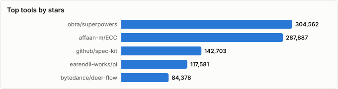
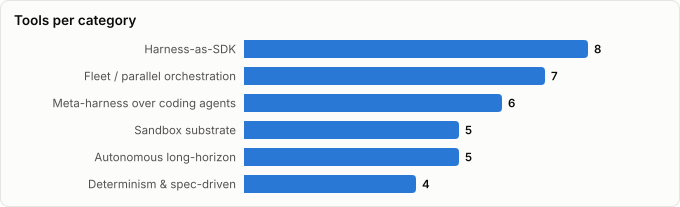

# Agent Harnesses — Six Approaches to Running Autonomous Agents

> Derived from **kaiser-data**'s 2,408 starred repos (snapshot `2026-10-24T18:18:45.023Z`), cross-referenced with the repo-similarity graph (2,408 nodes / 7,966 edges, 39 communities).
>
> Generated 2026-10-24 by `scripts/reports/agent_harnesses.py` (regenerate any time — no API cost).

## Executive summary

- A **harness** is everything around the model: the loop, tools, state, guardrails, and execution environment. **42 harness projects** in your stars (**1,684,797★** combined) cluster into **six distinct approaches** — they disagree about *where the harness lives* and *what the hard problem is*:
  - **Harness-as-SDK** (11): `pi`, `openhuman`, `deepagents`, `jcode`, `parlant`, `harness-sdk`, `eve`, `cheetahclaws`, `dexto`, `yoagent`, `tinyagents`
  - **Meta-harness over coding agents** (7): `superpowers`, `ECC`, `ruflo`, `oh-my-openagent`, `oh-my-claudecode`, `Archon`, `munder-difflin`
  - **Fleet / parallel orchestration** (7): `multica`, `vibe-kanban`, `gastown`, `Aperant`, `agent-orchestrator`, `ccpm`, `container-use`
  - **Determinism & spec-driven** (5): `spec-kit`, `OpenSpec`, `planning-with-files`, `agents.md`, `loop-engineering`
  - **Sandbox substrate** (7): `cua`, `NemoClaw`, `OpenShell`, `OpenSandbox`, `forkd`, `runtime`, `shell`
  - **Autonomous long-horizon** (5): `deer-flow`, `agent-zero`, `sia`, `agent`, `ClaudeNightsWatch`
- The fault line: **build the loop** (Harness-as-SDK) vs **wrap an existing agent** (meta-harness) vs **multiply agents** (fleet) — with determinism, sandboxing, and long-horizon autonomy as orthogonal bets any of them can adopt.
- Star mass sits with the meta-harnesses (`superpowers`, `ECC`, `ruflo`) — the ecosystem is betting that the inner loop is a solved commodity and the value is in the layer above it.

## The six approaches, compared

| Approach | Core bet | When it wins |
|---|---|---|
| **Harness-as-SDK** | You own the loop in code — tools, state, and control flow are a library you compose. | Building a *product* around an agent; you need custom behavior and testability. |
| **Meta-harness over coding agents** | Claude Code/Codex already won the inner loop — add skills, memory, and orchestration *around* it. | Developer workflows; you want leverage today without rebuilding tool-use. |
| **Fleet / parallel orchestration** | Throughput beats IQ — run many agents in worktrees/sandboxes and manage them like a team. | Large backlogs of separable tasks; PR-shaped work. |
| **Determinism & spec-driven** | Repeatability beats improvisation — specs, plans-on-disk, and standards steer the loop. | Teams that need auditable, resumable, low-variance agent output. |
| **Sandbox substrate** | The hard problem is *where* agents run — isolation, speed, and forking are the product. | Untrusted/generated code, computer-use, or massively parallel execution. |
| **Autonomous long-horizon** | Maximize wall-clock autonomy — agents that plan, persist, and keep going for hours or days. | Research, background maintenance, overnight queues; outcome > oversight. |

## Master comparison

Sorted by stars. `Health`/`Lifecycle` are the dataset's computed metrics; `Activity` is derived from days-since-push + 90-day commits.

| Tool | Approach | Lang | License | ★ Stars | Lifecycle | Health | Activity | Last push | Age | Contrib(90d) |
|---|---|---|---|---|---|---|---|---|---|---|
| [obra/superpowers](https://github.com/obra/superpowers) | Meta-harness over coding agents | Shell | MIT | 304,562 (▲2,700) | Mature | 64 | active | 2d ago | 1.0y | 1 |
| [affaan-m/ECC](https://github.com/affaan-m/ECC) | Meta-harness over coding agents | JavaScript | MIT | 287,887 (▲4,271) | Hot | 78 | very active | 4d ago | 9mo | 9 |
| [github/spec-kit](https://github.com/github/spec-kit) | Determinism & spec-driven | Python | MIT | 142,703 (▲821) | Hot | 84 | very active | 1d ago | 1.2y | 22 |
| [earendil-works/pi](https://github.com/earendil-works/pi) | Harness-as-SDK | TypeScript | MIT | 117,581 (▲1,257) | Hot | 90 | very active | 0d ago | 1.2y | 17 |
| [bytedance/deer-flow](https://github.com/bytedance/deer-flow) | Autonomous long-horizon | Python | MIT | 84,378 (▲258) | Hot | 87 | very active | 0d ago | 1.5y | 57 |
| [ruvnet/ruflo](https://github.com/ruvnet/ruflo) | Meta-harness over coding agents | TypeScript | MIT | 78,966 (▲2,138) | Hot | 77 | very active | 0d ago | 1.4y | 15 |
| [Fission-AI/OpenSpec](https://github.com/Fission-AI/OpenSpec) | Determinism & spec-driven | TypeScript | MIT | 72,893 | Hot | 88 | very active | 1d ago | 1.2y | 38 |
| [code-yeongyu/oh-my-openagent](https://github.com/code-yeongyu/oh-my-openagent) | Meta-harness over coding agents | TypeScript | NOASSERTION | 70,309 (▲128) | Rising | 77 | very active | 0d ago | 10mo | 1 |
| [multica-ai/multica](https://github.com/multica-ai/multica) | Fleet / parallel orchestration | Go | NOASSERTION | 53,711 (▲516) | Hot | 86 | very active | 1d ago | 9mo | 34 |
| [tinyhumansai/openhuman](https://github.com/tinyhumansai/openhuman) | Harness-as-SDK | Rust | GPL-3.0 | 42,298 (▲141) | Rising | 79 | very active | 0d ago | 8mo | 1 |
| [Yeachan-Heo/oh-my-claudecode](https://github.com/Yeachan-Heo/oh-my-claudecode) | Meta-harness over coding agents | TypeScript | MIT | 40,231 (▲171) | Hot | 80 | very active | 0d ago | 9mo | 4 |
| [trycua/cua](https://github.com/trycua/cua) | Sandbox substrate | Rust | MIT | 30,861 (▲667) | Hot | 80 | very active | 0d ago | 1.7y | 5 |
| [langchain-ai/deepagents](https://github.com/langchain-ai/deepagents) | Harness-as-SDK | Python | MIT | 30,553 (▲145) | Hot | 79 | very active | 0d ago | 1.2y | 11 |
| [BloopAI/vibe-kanban](https://github.com/BloopAI/vibe-kanban) | Fleet / parallel orchestration | Rust | Apache-2.0 | 28,444 (▲52) | Mature | 60 | active | 1mo ago | 1.4y | 4 |
| [OthmanAdi/planning-with-files](https://github.com/OthmanAdi/planning-with-files) | Determinism & spec-driven | Python | MIT | 27,623 (▲94) | Hot | 80 | very active | 0d ago | 9mo | 17 |
| [agentsmd/agents.md](https://github.com/agentsmd/agents.md) | Determinism & spec-driven | TypeScript | MIT | 25,086 (▲99) | Declining | 36 | active | 1mo ago | 1.2y | 2 |
| [coleam00/Archon](https://github.com/coleam00/Archon) | Meta-harness over coding agents | TypeScript | MIT | 23,755 (▲34) | Mature | 79 | very active | 0d ago | 1.7y | 1 |
| [NVIDIA/NemoClaw](https://github.com/NVIDIA/NemoClaw) | Sandbox substrate | TypeScript | Apache-2.0 | 22,834 (▲66) | Hot | 71 | very active | 0d ago | 7mo | 13 |
| [1jehuang/jcode](https://github.com/1jehuang/jcode) | Harness-as-SDK | Rust | MIT | 21,183 (▲158) | Rising | 76 | very active | 0d ago | 9mo | 2 |
| [agent0ai/agent-zero](https://github.com/agent0ai/agent-zero) | Autonomous long-horizon | Python | NOASSERTION | 19,559 (▲48) | Mature | 79 | very active | 0d ago | 2.4y | 6 |
| [NVIDIA/OpenShell](https://github.com/NVIDIA/OpenShell) | Sandbox substrate | Rust | Apache-2.0 | 19,283 (▲2,614) | Hot | 93 | very active | 1d ago | 8mo | 28 |
| [gastownhall/gastown](https://github.com/gastownhall/gastown) | Fleet / parallel orchestration | Go | MIT | 18,518 (▲94) | Declining | 61 | active | 0d ago | 10mo | 1 |
| [emcie-co/parlant](https://github.com/emcie-co/parlant) | Harness-as-SDK | Python | Apache-2.0 | 18,308 (▲8) | Mature | 53 | active | 1d ago | 2.7y | 0 |
| [opensandbox-group/OpenSandbox](https://github.com/opensandbox-group/OpenSandbox) | Sandbox substrate | Python | Apache-2.0 | 16,131 (▲163) | Hot | 79 | very active | 0d ago | 10mo | 13 |
| [AndyMik90/Aperant](https://github.com/AndyMik90/Aperant) | Fleet / parallel orchestration | TypeScript | AGPL-3.0 | 14,586 (▲9) | Declining | 44 | slowing | 4mo ago | 10mo | 0 |
| [OrchestratorInc/agent-orchestrator](https://github.com/OrchestratorInc/agent-orchestrator) | Fleet / parallel orchestration | Go | Apache-2.0 | 13,571 (▲225) | Hot | 88 | very active | 0d ago | 8mo | 17 |
| [cobusgreyling/loop-engineering](https://github.com/cobusgreyling/loop-engineering) | Determinism & spec-driven | TypeScript | MIT | 11,620 (▲39) | Hot | 68 | very active | 1d ago | 4mo | 11 |
| [HarnessMD/munder-difflin](https://github.com/HarnessMD/munder-difflin) | Meta-harness over coding agents | TypeScript | MIT | 9,018 (▲115) | Rising | 74 | very active | 1d ago | 4mo | 1 |
| [strands-agents/harness-sdk](https://github.com/strands-agents/harness-sdk) | Harness-as-SDK | Python | Apache-2.0 | 8,941 (▲78) | Hot | 87 | very active | 0d ago | 1.4y | 22 |
| [automazeio/ccpm](https://github.com/automazeio/ccpm) | Fleet / parallel orchestration | Shell | MIT | 8,413 (▲2) | Declining | 46 | active | 5d ago | 1.2y | 1 |
| [vercel/eve](https://github.com/vercel/eve) | Harness-as-SDK | TypeScript | Apache-2.0 | 5,666 (▲51) | Hot | 87 | very active | 0d ago | 4mo | 16 |
| [dagger/container-use](https://github.com/dagger/container-use) | Fleet / parallel orchestration | Go | Apache-2.0 | 4,079 (▲7) | Mature | 44 | active | 1mo ago | 1.4y | 2 |
| [deeplethe/forkd](https://github.com/deeplethe/forkd) | Sandbox substrate | Rust | Apache-2.0 | 2,901 (▼20) | Hot | 79 | very active | 0d ago | 5mo | 3 |
| [hexo-ai/sia](https://github.com/hexo-ai/sia) | Autonomous long-horizon | Python | MIT | 2,162 | Mature | 44 | active | 1mo ago | 7mo | 5 |
| [stakpak/agent](https://github.com/stakpak/agent) | Autonomous long-horizon | Rust | Apache-2.0 | 1,832 (▲7) | Declining | 41 | slowing | 3mo ago | 1.9y | 0 |
| [e2b-dev/runtime](https://github.com/e2b-dev/runtime) | Sandbox substrate | Go | Apache-2.0 | 1,765 (▲23) | Classic | 98 | very active | 0d ago | 3.2y | 21 |
| [SAIL-Research-Lab/cheetahclaws](https://github.com/SAIL-Research-Lab/cheetahclaws) | Harness-as-SDK | Python | Apache-2.0 | 791 (▲2) | Rising | 66 | very active | 12d ago | 6mo | 5 |
| [truffle-ai/dexto](https://github.com/truffle-ai/dexto) | Harness-as-SDK | TypeScript | NOASSERTION | 657 (▲5) | Hot | 79 | very active | 1d ago | 1.6y | 4 |
| [aniketkarne/ClaudeNightsWatch](https://github.com/aniketkarne/ClaudeNightsWatch) | Autonomous long-horizon | Shell | MIT | 369 | Declining | 45 | active | 9d ago | 1.3y | 1 |
| [yologdev/yoagent](https://github.com/yologdev/yoagent) | Harness-as-SDK | Rust | MIT | 365 (▲2) | Rising | 79 | very active | 1d ago | 8mo | 2 |
| [strands-agents/shell](https://github.com/strands-agents/shell) | Sandbox substrate | Rust | Apache-2.0 | 279 (▲4) | Hot | 71 | very active | 1d ago | 7mo | 5 |
| [tinyhumansai/tinyagents](https://github.com/tinyhumansai/tinyagents) | Harness-as-SDK | Rust | GPL-3.0 | 125 (▲3) | Hot | 79 | very active | 0d ago | 3mo | 3 |

## By approach

### Harness-as-SDK

_The loop as a library: you import the harness, register tools, and own control flow. Maximum flexibility, maximum responsibility — you maintain planning, retries, memory, and safety yourself._

- **[earendil-works/pi](https://github.com/earendil-works/pi)** · 117,581★ · TypeScript · Hot  
  Unified LLM API + agent loop + TUI + coding-agent CLI in one toolkit — the loop as a library.  
  topics: —
- **[tinyhumansai/openhuman](https://github.com/tinyhumansai/openhuman)** · 42,298★ · Rust · Rising  
  Lean open-source harness built for density — claims 500+ agents on a $10 VPS; the cost-floor end of the field.  
  topics: ai-agents, llm, local-first, rust, agent-orchestration, ai-assistant, desktop, mcp
- **[langchain-ai/deepagents](https://github.com/langchain-ai/deepagents)** · 30,553★ · Python · Hot  
  The 'batteries-included agent harness' — planning, sub-agents, filesystem, from the LangChain team.  
  topics: deepagents, langchain, langgraph, ai, python, typescript, harness, harness-engineering
- **[1jehuang/jcode](https://github.com/1jehuang/jcode)** · 21,183★ · Rust · Rising  
  Rust-built coding-agent harness — CLI agent loop with MCP support and multi-model wiring.  
  topics: ai, claude, cli, coding-agent, llm, mcp, openai, rust
- **[emcie-co/parlant](https://github.com/emcie-co/parlant)** · 18,308★ · Python · Mature  
  Interaction *control* harness — behavioral guidelines enforced at runtime for customer-facing agents.  
  topics: ai-agents, genai, llm, customer-service, customer-success, gemini, llama3, openai
- **[strands-agents/harness-sdk](https://github.com/strands-agents/harness-sdk)** · 8,941★ · Python · Hot  
  AWS's open SDK to build an agent harness and control it end-to-end in production.  
  topics: agentic, agentic-ai, agents, ai, autonomous-agents, llm, multi-agent-systems, python
- **[vercel/eve](https://github.com/vercel/eve)** · 5,666★ · TypeScript · Hot  
  Vercel's framework for building agents — harness + sandbox as one integrated runtime.  
  topics: agent, framework, harness, javascript, markdown, typescript, vercel, sandbox
- **[SAIL-Research-Lab/cheetahclaws](https://github.com/SAIL-Research-Lab/cheetahclaws)** · 791★ · Python · Rising  
  Fast, easy agent-harness infrastructure aimed at long-horizon, multi-model runs.  
  topics: agentic-ai, claude, claude-code, memory, python, skills, openclaw
- **[truffle-ai/dexto](https://github.com/truffle-ai/dexto)** · 657★ · TypeScript · Hot  
  Harness and toolkit for building agent apps — CLI plus SDKs, configured rather than coded.  
  topics: llm, mcp, typescript, ai-agents, ai-tools, modelcontextprotocol, ai, mcp-client
- **[yologdev/yoagent](https://github.com/yologdev/yoagent)** · 365★ · Rust · Rising  
  The agent loop as a Rust crate — streams from seven LLM protocols, runs tools, loops until done.  
  topics: agent, agent-framework, ai, ai-agents, anthropic, claude, coding-agent, gemini
- **[tinyhumansai/tinyagents](https://github.com/tinyhumansai/tinyagents)** · 125★ · Rust · Hot  
  Small, provider-neutral harness in Rust — a readable minimal loop from the openhuman team.  
  topics: agent-framework, ai-agents, llm, rust, artificial-intelligence, automation, developer-tools, multi-agent

### Meta-harness over coding agents

_These projects treat Claude Code / Codex as the engine and build the transmission: skills, personas, memory, token discipline, and multi-agent coordination injected via configs, hooks, and subagents._

- **[obra/superpowers](https://github.com/obra/superpowers)** · 304,562★ · Shell · Mature  
  Skills framework + development methodology layered onto the agent you already run.  
  topics: ai, brainstorming, coding, obra, sdlc, skills, superpowers, subagent-driven-development
- **[affaan-m/ECC](https://github.com/affaan-m/ECC)** · 287,887★ · JavaScript · Hot  
  Harness performance optimization: skills, instincts, memory, security, hooks on top of Claude Code.  
  topics: ai-agents, anthropic, claude, claude-code, developer-tools, llm, mcp, productivity
- **[ruvnet/ruflo](https://github.com/ruvnet/ruflo)** · 78,966★ · TypeScript · Hot  
  The leading agent *meta*-harness — swarms, coordination, and autonomy on top of existing agents.  
  topics: swarm, agentic-ai, agentic-framework, agentic-workflow, autonomous-agents, codex, mcp-server, multi-agent
- **[code-yeongyu/oh-my-openagent](https://github.com/code-yeongyu/oh-my-openagent)** · 70,309★ · TypeScript · Rising  
  'The one and only agent harness for complex coding' — tokenmaxxer harness wrapping coding agents.  
  topics: opencode, ai, anthropic, claude, claude-skills, cursor, gemini, ide
- **[Yeachan-Heo/oh-my-claudecode](https://github.com/Yeachan-Heo/oh-my-claudecode)** · 40,231★ · TypeScript · Hot  
  Teams-first multi-agent orchestration living entirely inside Claude Code.  
  topics: agentic-coding, ai-agents, claude, claude-code, oh-my-opencode, opencode, vibe-coding, automation
- **[coleam00/Archon](https://github.com/coleam00/Archon)** · 23,755★ · TypeScript · Mature  
  'Harness builder' — make AI coding deterministic and repeatable by generating the harness itself.  
  topics: ai, automation, bun, claude, cli, coding-assistant, developer-tools, typescript
- **[HarnessMD/munder-difflin](https://github.com/HarnessMD/munder-difflin)** · 9,018★ · TypeScript · Rising  
  Runs an 'office' of Claude Code / Codex agents with roles — an open alternative to hosted agent-team products.  
  topics: agents, claude-code, harness, harness-engineering, memory, agent-orchestration, ai-agents, autonomous-agents

### Fleet / parallel orchestration

_One agent is a tool; a fleet is a team. The harness problem becomes scheduling, isolation (worktrees, containers), review queues, and merge discipline._

- **[multica-ai/multica](https://github.com/multica-ai/multica)** · 53,711★ · Go · Hot  
  Managed-agents platform: assign tasks to coding agents like teammates and supervise them.  
  topics: —
- **[BloopAI/vibe-kanban](https://github.com/BloopAI/vibe-kanban)** · 28,444★ · Rust · Mature  
  A kanban board as the harness — queue, run, and review many agent tasks in parallel.  
  topics: agent, ai-agents, kanban, management, task-manager
- **[gastownhall/gastown](https://github.com/gastownhall/gastown)** · 18,518★ · Go · Declining  
  Multi-agent workspace manager — the 'town' where a fleet of agents live and work.  
  topics: —
- **[AndyMik90/Aperant](https://github.com/AndyMik90/Aperant)** · 14,586★ · TypeScript · Declining  
  Autonomous multi-session AI coding — sessions as the unit of parallelism.  
  topics: —
- **[OrchestratorInc/agent-orchestrator](https://github.com/OrchestratorInc/agent-orchestrator)** · 13,571★ · Go · Hot  
  Plans tasks, spawns parallel coding agents in worktrees, merges autonomously.  
  topics: claude-code, codex-cli, orchestration, orchestrator, skills, agent-fleet, agent-swarm, git-worktrees
- **[automazeio/ccpm](https://github.com/automazeio/ccpm)** · 8,413★ · Shell · Declining  
  GitHub Issues + git worktrees as the coordination fabric for parallel agents.  
  topics: ai-agents, ai-coding, claude, claude-code, project-management, vibe-coding
- **[dagger/container-use](https://github.com/dagger/container-use)** · 4,079★ · Go · Mature  
  Containerized dev environments so multiple agents work safely and independently.  
  topics: —

### Determinism & spec-driven

_The counter-culture: agents drift, so pin them down. Specs, standards files, and plans persisted to disk make runs reproducible, auditable, and resumable after crashes._

- **[github/spec-kit](https://github.com/github/spec-kit)** · 142,703★ · Python · Hot  
  Spec-Driven Development toolkit — the spec, not the prompt, steers the agent.  
  topics: ai, copilot, development, engineering, prd, spec, spec-driven
- **[Fission-AI/OpenSpec](https://github.com/Fission-AI/OpenSpec)** · 72,893★ · TypeScript · Hot  
  Lightweight spec-driven development — change proposals and specs in the repo that humans and agents agree on before code is written.  
  topics: spec, ai, context-engineering, engineering, planning, prd, sdlc, spec-driven-development
- **[OthmanAdi/planning-with-files](https://github.com/OthmanAdi/planning-with-files)** · 27,623★ · Python · Hot  
  Persistent file-based planning — crash-proof, resumable long-running agent tasks.  
  topics: claude, claude-code, claude-skills, manus, agent-skills, planning, autonomous-agents, codex
- **[agentsmd/agents.md](https://github.com/agentsmd/agents.md)** · 25,086★ · TypeScript · Declining  
  The open AGENTS.md standard — a portable contract telling any harness how to behave in a repo.  
  topics: —
- **[cobusgreyling/loop-engineering](https://github.com/cobusgreyling/loop-engineering)** · 11,620★ · TypeScript · Hot  
  Patterns and starters for *loop engineering* — designing the iteration, not just the prompt.  
  topics: agentic-ai, ai-agents, claude-code, codex, devops-automation, github-actions, grok, llm

### Sandbox substrate

_Infrastructure-first: before you scale agents you need somewhere safe and fast to run them. MicroVMs, container runtimes, and hardened sandboxes are the harness's floor._

- **[trycua/cua](https://github.com/trycua/cua)** · 30,861★ · Rust · Hot  
  Sandboxes, SDKs, and benchmarks for computer-use agents — full-desktop harnessing.  
  topics: apple, cua, lume, macos, virtualization, virtualization-framework, swift, ai-agent
- **[NVIDIA/NemoClaw](https://github.com/NVIDIA/NemoClaw)** · 22,834★ · TypeScript · Hot  
  Run harnesses (Hermes, Deep Agents, OpenClaw) inside hardened NVIDIA sandboxes.  
  topics: ai-agents, nvidia, openclaw, openshell, sandboxing, typescript, hermes, deep-agents
- **[NVIDIA/OpenShell](https://github.com/NVIDIA/OpenShell)** · 19,283★ · Rust · Hot  
  NVIDIA's safe, private runtime for autonomous agents — the substrate NemoClaw runs on.  
  topics: —
- **[opensandbox-group/OpenSandbox](https://github.com/opensandbox-group/OpenSandbox)** · 16,131★ · Python · Hot  
  Secure, fast, extensible sandbox runtime purpose-built for AI agents.  
  topics: ai, ai-infra, kubernetes, sandbox, ai-agent, aaif
- **[deeplethe/forkd](https://github.com/deeplethe/forkd)** · 2,901★ · Rust · Hot  
  fork() for agent microVMs — spawn 100 children in ~100ms; branch a live VM mid-run.  
  topics: ai-agents, copy-on-write, kvm, microvm, rust, sandbox, snapshot
- **[e2b-dev/runtime](https://github.com/e2b-dev/runtime)** · 1,765★ · Go · Classic  
  The runtime behind E2B's cloud and self-hosted sandboxes — isolated microVMs for AI-generated code; the harness's execution floor.  
  topics: ai-agents, code-interpreter, consul, devtools, firecracker, gcp, go, golang
- **[strands-agents/shell](https://github.com/strands-agents/shell)** · 279★ · Rust · Hot  
  A shell for the agent without the keys to your machine — scoped command execution as a library.  
  topics: —

### Autonomous long-horizon

_Maximum autonomy: agents that run for hours or days, planning and re-planning, sometimes improving their own scaffolding. The harness is a resident process, not a CLI invocation._

- **[bytedance/deer-flow](https://github.com/bytedance/deer-flow)** · 84,378★ · Python · Hot  
  Long-horizon SuperAgent harness that researches, codes, and creates with sub-agents in sandboxes.  
  topics: agent, agentic, agentic-framework, agentic-workflow, ai, ai-agents, deep-research, langchain
- **[agent0ai/agent-zero](https://github.com/agent0ai/agent-zero)** · 19,559★ · Python · Mature  
  General autonomous framework — the agent builds its own tools as it goes.  
  topics: agent, ai, assistant, autonomous, linux, zero
- **[hexo-ai/sia](https://github.com/hexo-ai/sia)** · 2,162★ · Python · Mature  
  Self-Improving AI — a harness whose loop optimizes the underlying system over time.  
  topics: —
- **[stakpak/agent](https://github.com/stakpak/agent)** · 1,832★ · Rust · Declining  
  An agent that lives on your machines 24/7 and keeps shipping — harness as a resident daemon.  
  topics: agent, devops, devtool, generative-ai, hacktoberfest, ai-agent, autonomous-agent, llm-agent
- **[aniketkarne/ClaudeNightsWatch](https://github.com/aniketkarne/ClaudeNightsWatch)** · 369★ · Shell · Declining  
  Watches your Claude usage windows and executes queued tasks autonomously overnight.  
  topics: —

## Graph analysis — how they relate

**Community clustering.** These 42 tools span **19 of the graph's 39 communities**.

- **Community 0** (5): `langchain-ai/deepagents`, `code-yeongyu/oh-my-openagent`, `AndyMik90/Aperant`, `Fission-AI/OpenSpec`, `agentsmd/agents.md`
- **Community 23** (5): `strands-agents/harness-sdk`, `SAIL-Research-Lab/cheetahclaws`, `ruvnet/ruflo`, `strands-agents/shell`, `bytedance/deer-flow`
- **Community 2** (4): `yologdev/yoagent`, `Yeachan-Heo/oh-my-claudecode`, `OthmanAdi/planning-with-files`, `stakpak/agent`
- **Community 6** (4): `HarnessMD/munder-difflin`, `gastownhall/gastown`, `OrchestratorInc/agent-orchestrator`, `cobusgreyling/loop-engineering`
- **Community 5** (3): `earendil-works/pi`, `1jehuang/jcode`, `truffle-ai/dexto`
- **Community 3** (3): `emcie-co/parlant`, `tinyhumansai/openhuman`, `tinyhumansai/tinyagents`
- **Community 13** (3): `BloopAI/vibe-kanban`, `opensandbox-group/OpenSandbox`, `deeplethe/forkd`
- **Community 16** (2): `affaan-m/ECC`, `automazeio/ccpm`
- **Community 9** (2): `multica-ai/multica`, `e2b-dev/runtime`
- **Community 22** (2): `NVIDIA/NemoClaw`, `NVIDIA/OpenShell`

**Centrality (PageRank in the full 2,408-repo graph)** — most 'hub-like' harnesses in your ecosystem:

- `Fission-AI/OpenSpec` — PageRank 0.0021
- `1jehuang/jcode` — PageRank 0.0012
- `langchain-ai/deepagents` — PageRank 0.0010
- `affaan-m/ECC` — PageRank 0.0010
- `strands-agents/harness-sdk` — PageRank 0.0009
- `truffle-ai/dexto` — PageRank 0.0009
- `multica-ai/multica` — PageRank 0.0008
- `cobusgreyling/loop-engineering` — PageRank 0.0007
- `tinyhumansai/tinyagents` — PageRank 0.0006
- `NVIDIA/OpenShell` — PageRank 0.0006

**Direct links between harness projects** (top similarity edges where both endpoints are in this report):

- `tinyhumansai/tinyagents` ⇄ `tinyhumansai/openhuman` (w=1.375) — topics: ai-agents, llm, rust; authors: senamakel
- `strands-agents/shell` ⇄ `strands-agents/harness-sdk` (w=0.750) — authors: dependabot[bot], pgrayy, arronbailiss
- `truffle-ai/dexto` ⇄ `1jehuang/jcode` (w=0.611) — topics: llm, mcp, ai, ai-agent; authors: github-actions[bot]
- `NVIDIA/OpenShell` ⇄ `NVIDIA/NemoClaw` (w=0.550) — authors: ericcurtin
- `truffle-ai/dexto` ⇄ `cobusgreyling/loop-engineering` (w=0.478) — topics: llm, mcp, ai-agents; authors: github-actions[bot], georgeatparallel
- `bytedance/deer-flow` ⇄ `langchain-ai/deepagents` (w=0.380) — topics: ai, langchain, langgraph, python; authors: dependabot[bot]
- `Fission-AI/OpenSpec` ⇄ `github/spec-kit` (w=0.377) — topics: spec, ai, engineering, prd; authors: dependabot[bot], Khunjua
- `bytedance/deer-flow` ⇄ `strands-agents/harness-sdk` (w=0.355) — topics: agentic, ai, ai-agents, llm; authors: dependabot[bot], nanhanq1, dakjdakd
- `Yeachan-Heo/oh-my-claudecode` ⇄ `automazeio/ccpm` (w=0.333) — topics: ai-agents, claude, claude-code, vibe-coding
- `yologdev/yoagent` ⇄ `1jehuang/jcode` (w=0.330) — topics: ai, claude, coding-agent, llm
- `affaan-m/ECC` ⇄ `automazeio/ccpm` (w=0.273) — topics: ai-agents, claude, claude-code
- `HarnessMD/munder-difflin` ⇄ `ruvnet/ruflo` (w=0.262) — topics: agents, harness, ai-agents, autonomous-agents
- `HarnessMD/munder-difflin` ⇄ `OrchestratorInc/agent-orchestrator` (w=0.250) — topics: claude-code, agent-orchestration, ai-agents, codex
- `bytedance/deer-flow` ⇄ `ruvnet/ruflo` (w=0.216) — topics: agentic-framework, agentic-workflow, ai-agents, multi-agent; authors: Tong-bit-art
- `e2b-dev/runtime` ⇄ `deeplethe/forkd` (w=0.190) — topics: ai-agents, kvm, microvm, sandbox
- …and 4 more.

## Maintenance & risk signal

Bus factor = commit concentration (1 = single-maintainer risk). Harnesses are a young, fast-moving category — expect churn; check lifecycle before betting on one.

| Tool | Health | Lifecycle | Activity | Bus factor | Top-author share | Releases |
|---|---|---|---|---|---|---|
| e2b-dev/runtime | 98 | Classic | very active | 5 | 13% | 52 |
| NVIDIA/OpenShell | 93 | Hot | very active | 4 | 19% | 102 |
| earendil-works/pi | 90 | Hot | very active | 3 | 21% | 275 |
| OrchestratorInc/agent-orchestrator | 88 | Hot | very active | 3 | 23% | 294 |
| Fission-AI/OpenSpec | 88 | Hot | very active | 3 | 38% | 55 |
| strands-agents/harness-sdk | 87 | Hot | very active | 3 | 26% | 131 |
| vercel/eve | 87 | Hot | very active | 3 | 31% | 270 |
| bytedance/deer-flow | 87 | Hot | very active | 14 | 8% | 2 |
| multica-ai/multica | 86 | Hot | very active | 3 | 32% | 167 |
| github/spec-kit | 84 | Hot | very active | 2 | 30% | 235 |
| Yeachan-Heo/oh-my-claudecode | 80 | Hot | very active | 1 | 82% | 269 |
| OthmanAdi/planning-with-files | 80 | Hot | very active | 1 | 59% | 123 |
| trycua/cua | 80 | Hot | very active | 2 | 34% | 801 |
| langchain-ai/deepagents | 79 | Hot | very active | 1 | 56% | 328 |
| tinyhumansai/openhuman | 79 | Rising | very active | 1 | 100% | 63 |
| yologdev/yoagent | 79 | Rising | very active | 1 | 99% | 66 |
| tinyhumansai/tinyagents | 79 | Hot | very active | 1 | 62% | 10 |
| truffle-ai/dexto | 79 | Hot | very active | 2 | 49% | 1664 |
| coleam00/Archon | 79 | Mature | very active | 1 | 100% | 26 |
| opensandbox-group/OpenSandbox | 79 | Hot | very active | 1 | 68% | 182 |
| deeplethe/forkd | 79 | Hot | very active | 1 | 61% | 24 |
| agent0ai/agent-zero | 79 | Mature | very active | 1 | 94% | 76 |
| affaan-m/ECC | 78 | Hot | very active | 1 | 63% | 19 |
| code-yeongyu/oh-my-openagent | 77 | Rising | very active | 1 | 100% | 349 |
| ruvnet/ruflo | 77 | Hot | very active | 1 | 55% | 1708 |
| 1jehuang/jcode | 76 | Rising | very active | 1 | 98% | 196 |
| HarnessMD/munder-difflin | 74 | Rising | very active | 1 | 100% | 42 |
| NVIDIA/NemoClaw | 71 | Hot | very active | 2 | 34% | 1 |
| strands-agents/shell | 71 | Hot | very active | 1 | 59% | 8 |
| cobusgreyling/loop-engineering | 68 | Hot | very active | 1 | 71% | 2 |
| SAIL-Research-Lab/cheetahclaws | 66 | Rising | very active | 1 | 80% | 43 |
| obra/superpowers | 64 | Mature | active | 1 | 100% | 16 |
| gastownhall/gastown | 61 | Declining | active | 1 | 100% | 14 |
| BloopAI/vibe-kanban | 60 | Mature | active | 1 | 50% | 284 |
| emcie-co/parlant | 53 | Mature | active | 0 | 0% | 33 |
| automazeio/ccpm | 46 | Declining | active | 1 | 100% | 0 |
| aniketkarne/ClaudeNightsWatch | 45 | Declining | active | 1 | 100% | 0 |
| AndyMik90/Aperant | 44 | Declining | slowing | 0 | 0% | 37 |
| dagger/container-use | 44 | Mature | active | 1 | 86% | 14 |
| hexo-ai/sia | 44 | Mature | active | 2 | 43% | 0 |
| stakpak/agent | 41 | Declining | slowing | 0 | 0% | 315 |
| agentsmd/agents.md | 36 | Declining | active | 1 | 67% | 0 |

## Which one should you use?

| If you want… | Start with | Why |
|---|---|---|
| A harness you fully own, in code | `langchain-ai/deepagents` or `earendil-works/pi` | Batteries-included loops with planning and sub-agents; pi adds a unified LLM API + TUI. |
| More out of the Claude Code you already run | `obra/superpowers` (+ `affaan-m/ECC`) | Skills + methodology layered on today; ECC adds memory, instincts, and hooks. |
| Swarms / heavy multi-agent coordination | `ruvnet/ruflo` | The meta-harness with the deepest swarm tooling in your stars. |
| A team of agents working a backlog | `BloopAI/vibe-kanban` | Kanban-shaped orchestration over Claude Code/Codex; `ccpm` if you prefer GitHub Issues + worktrees. |
| Reproducible, auditable agent output | `github/spec-kit` + `agentsmd/agents.md` | Spec-driven development plus the portable AGENTS.md behavior contract; `Fission-AI/OpenSpec` if you want a lighter, change-by-change spec workflow. |
| Crash-proof long tasks | `OthmanAdi/planning-with-files` | Plans persisted to disk — resume after any failure. |
| Safe execution for untrusted agent code | `e2b-dev/runtime` | Purpose-built sandbox runtime (cloud or self-hosted); `forkd` when you need 100 microVMs in 100ms. |
| A 24/7 resident agent | `stakpak/agent` (or `aniketkarne/ClaudeNightsWatch`) | Daemon-style autonomy; NightsWatch exploits idle Claude usage windows overnight. |
| Research-grade long-horizon autonomy | `bytedance/deer-flow` | SuperAgent harness with sub-agents and sandboxes; strongest end-to-end autonomy here. |

## Adjacent (deliberately not listed as harnesses)

- **daytonaio/daytona** — archived upstream (2026-10) — replaced by `e2b-dev/runtime` as the sandbox substrate
- **gsd-build/gsd-2** — archived upstream (2026-10) — spec-driven control is still covered by `github/spec-kit`
- **langchain-ai/langgraph** (43,831★) — agent *framework* (graphs, not harnesses) — see the agent-orchestration report
- **crewAIInc/crewAI** (60,064★) — role-playing agent framework — agent-orchestration report
- **microsoft/autogen** (61,548★) — multi-agent conversation framework — agent-orchestration report
- **eigent-ai/eigent** (15,653★) — cowork desktop product — agent-orchestration report
- **getpaseo/paseo** (21,873★) — desktop/mobile agent orchestrator — agent-orchestration report
- **wshobson/agents** (41,629★) — multi-harness plugin *marketplace* — content for harnesses, not a harness
- **EleutherAI/lm-evaluation-harness** (14,306★) — 'harness' for *model benchmarks*, not agent runtimes — see the LLM-evaluation report
- **anthropics/claude-code** (153,265★) — the coding agent itself — the thing meta-harnesses wrap

## Methodology & caveats

- **Source**: `data/classified.json` + `public/data/graph.json`. No external calls; fully reproducible.
- **Selection**: keyword scan (harness / autonomous / swarm / multi-agent / sandbox / worktree / spec-driven / long-horizon / loop…) + manual curation by *approach*. General agent frameworks and orchestration platforms live in the agent-orchestration report; Claude-Code configuration setups in the claude-code-setups report. A few boundary projects (`deer-flow`, `ruflo`, `oh-my-*`) appear in both, viewed through different lenses.
- **Metrics** (health, lifecycle, bus_factor) are precomputed at snapshot time and may lag GitHub's current state.
- Re-run after a fresh `classified.json` to refresh stars/activity.

Tools covered: 42 · Snapshot: 2026-10-24T18:18:45.023Z
