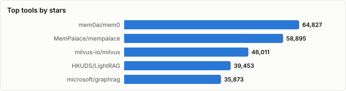
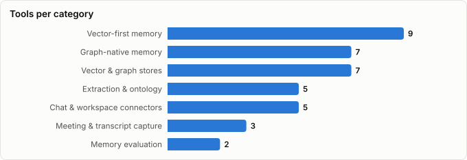

# Agent Memory & Conversational Knowledge Graphs

> Derived from **kaiser-data**'s 1,596 starred repos (snapshot `2026-08-11T18:59:16.380Z`), cross-referenced with the repo-similarity graph (1,596 nodes / 5,170 edges, 31 communities). The primitive-coverage matrix is additionally backed by documentation and source-code evidence gathered 2026-08-12 — see Methodology.
>
> Generated 2026-08-12 by `scripts/reports/agent_memory.py` (regenerate any time — no API cost).

## Executive summary

- **38 tools** across the memory stack (**703,842★** combined):
  - **Graph-native memory** (7): `cognee`, `graphiti`, `MemMachine`, `trustgraph`, `semantica`, `mcp-knowledge-graph`, `MGP`
  - **Vector-first memory** (9): `mem0`, `mempalace`, `letta`, `hindsight`, `TencentDB-Agent-Memory`, `memvid`, `Memori`, `honcho`, `memsearch`
  - **Vector & graph stores** (7): `milvus`, `qdrant`, `pgvector`, `weaviate`, `lancedb`, `helix-db`, `FalkorDB`
  - **Extraction & ontology** (5): `LightRAG`, `graphrag`, `cocoindex`, `GraphRAG-SDK`, `open-ontologies`
  - **Chat & workspace connectors** (5): `onyx`, `nanoclaw`, `eliza`, `airweave`, `cyrus`
  - **Meeting & transcript capture** (3): `meetily`, `screenpipe`, `vexa`
  - **Memory evaluation** (2): `promptfoo`, `opik`
- The category has split into two bets. **Vector-first** memory (`mem0`, `mempalace`, `letta`) optimises *recall* — get the relevant fact back. **Graph-native** memory (`cognee`, `graphiti`, `trustgraph`) optimises *structure* — represent how facts relate. Your Cognee + Qdrant stack deliberately spans both, which is the right call: the interesting queries over a Slack corpus are relational, but the retrieval still has to be fuzzy.
- **`graphiti` is the only tool here with a serious temporal model** (bi-temporal: event time *and* ingestion time, with edge invalidation instead of deletion). Everything else treats time as a sortable field. If your hackathon thesis is temporal, that is the prior art to read.
- The connector tier and the memory tier barely overlap. Tools that *reach* Slack (`onyx`, `airweave`) do not build memory; tools that *are* memory (`mem0`, `cognee`) treat Slack as one undifferentiated text source. **The gap between them is where the chat primitives get dropped.**
- The matrix below tests the hypothesis that tools consume little beyond text, author and timestamp. **It largely holds, with two corrections** — thread structure and ACL are better covered than expected (the connector tier does real work there), and one tool carries reaction identity *and* timing for Microsoft Teams. Details in the two sections that follow.
- Memory **evaluation is nearly absent**. `promptfoo` and `opik` are general LLM/RAG harnesses, not memory benchmarks; only `mempalace` competes explicitly on memory benchmark scores. Nobody in your set can tell you whether a memory layer got *better*.

## The memory pipeline at a glance

Where each tier sits between a Slack message and an agent's answer.

| Stage | What happens | Tools in your stars |
|---|---|---|
| **Capture** | Get the conversation out of the platform | `onyx`, `airweave`, `nanoclaw`, `eliza`, `cyrus`, `meetily`, `vexa`, `screenpipe` |
| **Extraction** | Text → entities, relationships, atomic facts | `graphrag`, `LightRAG`, `GraphRAG-SDK`, `cocoindex`, `open-ontologies` |
| **Structure** | Facts → a graph with types, time and provenance | `cognee`, `graphiti`, `MemMachine`, `trustgraph`, `semantica`, `mcp-knowledge-graph` |
| **Recall** | Query-time retrieval into the context window | `mem0`, `mempalace`, `letta`, `hindsight`, `Memori`, `honcho`, `memvid`, `memsearch` |
| **Storage** | The substrate underneath both | `qdrant`, `milvus`, `weaviate`, `pgvector`, `lancedb`, `FalkorDB`, `helix-db` |
| **Governance** | What is retained, promoted, forgotten | `MGP`, and partially `trustgraph` |
| **Evaluation** | Did any of it work? | `promptfoo`, `opik` |

## Master comparison

Sorted by stars. `Health`/`Lifecycle` are the dataset's computed metrics; `Activity` is derived from days-since-push + 90-day commits.

| Tool | Category | Lang | License | ★ Stars | Lifecycle | Health | Activity | Last push | Age | Contrib(90d) |
|---|---|---|---|---|---|---|---|---|---|---|
| [mem0ai/mem0](https://github.com/mem0ai/mem0) | Vector-first memory | Python | Apache-2.0 | 62,779 | Classic | 88 | very active | 4d ago | 3.1y | 34 |
| [MemPalace/mempalace](https://github.com/MemPalace/mempalace) | Vector-first memory | Python | MIT | 58,192 | Hot | 76 | very active | 4d ago | 4mo | 8 |
| [milvus-io/milvus](https://github.com/milvus-io/milvus) | Vector & graph stores | Go | Apache-2.0 | 45,553 | Classic | 99 | very active | 4d ago | 6.9y | 29 |
| [HKUDS/LightRAG](https://github.com/HKUDS/LightRAG) | Extraction & ontology | Python | MIT | 38,620 | Hot | 78 | very active | 5d ago | 1.9y | 5 |
| [microsoft/graphrag](https://github.com/microsoft/graphrag) | Extraction & ontology | Python | MIT | 35,319 | Mature | 68 | active | 6d ago | 2.4y | 4 |
| [qdrant/qdrant](https://github.com/qdrant/qdrant) | Vector & graph stores | Rust | Apache-2.0 | 33,835 | Classic | 87 | very active | 4d ago | 6.2y | 15 |
| [onyx-dot-app/onyx](https://github.com/onyx-dot-app/onyx) | Chat & workspace connectors | Python | NOASSERTION | 31,488 | Classic | 89 | very active | 4d ago | 3.3y | 12 |
| [nanocoai/nanoclaw](https://github.com/nanocoai/nanoclaw) | Chat & workspace connectors | TypeScript | MIT | 30,468 | Hot | 76 | very active | 5d ago | 6mo | 8 |
| [topoteretes/cognee](https://github.com/topoteretes/cognee) | Graph-native memory | Python | Apache-2.0 | 29,847 | Mature | 83 | very active | 4d ago | 3.0y | 11 |
| [getzep/graphiti](https://github.com/getzep/graphiti) | Graph-native memory | Python | Apache-2.0 | 29,659 | Mature | 78 | very active | 4d ago | 2.0y | 22 |
| [Zackriya-Solutions/meetily](https://github.com/Zackriya-Solutions/meetily) | Meeting & transcript capture | Rust | MIT | 28,439 | Hot | 59 | slowing | 2mo ago | 1.6y | 3 |
| [letta-ai/letta](https://github.com/letta-ai/letta) | Vector-first memory | Python | Apache-2.0 | 24,148 | Mature | 65 | active | 10d ago | 2.8y | 2 |
| [promptfoo/promptfoo](https://github.com/promptfoo/promptfoo) | Memory evaluation | TypeScript | MIT | 24,056 | Classic | 79 | very active | 4d ago | 3.3y | 14 |
| [pgvector/pgvector](https://github.com/pgvector/pgvector) | Vector & graph stores | C | NOASSERTION | 22,529 | Classic | 65 | very active | 4d ago | 5.3y | 4 |
| [comet-ml/opik](https://github.com/comet-ml/opik) | Memory evaluation | Python | Apache-2.0 | 21,197 | Classic | 93 | very active | 4d ago | 3.3y | 17 |
| [screenpipe/screenpipe](https://github.com/screenpipe/screenpipe) | Meeting & transcript capture | Rust | NOASSERTION | 20,810 | Mature | 84 | very active | 4d ago | 2.1y | 11 |
| [vectorize-io/hindsight](https://github.com/vectorize-io/hindsight) | Vector-first memory | Python | MIT | 19,237 | Hot | 79 | very active | 4d ago | 9mo | 14 |
| [elizaOS/eliza](https://github.com/elizaOS/eliza) | Chat & workspace connectors | TypeScript | MIT | 18,927 | Mature | 84 | very active | 4d ago | 2.1y | 20 |
| [TencentCloud/TencentDB-Agent-Memory](https://github.com/TencentCloud/TencentDB-Agent-Memory) | Vector-first memory | TypeScript | NOASSERTION | 17,450 | Mature | 67 | active | 5d ago | 4mo | 4 |
| [weaviate/weaviate](https://github.com/weaviate/weaviate) | Vector & graph stores | Go | BSD-3-Clause | 16,703 | Classic | 83 | very active | 4d ago | 10.4y | 8 |
| [memvid/memvid](https://github.com/memvid/memvid) | Vector-first memory | Rust | Apache-2.0 | 16,189 | Declining | 61 | active | 28d ago | 1.2y | 2 |
| [MemoriLabs/Memori](https://github.com/MemoriLabs/Memori) | Vector-first memory | Python | NOASSERTION | 15,693 | Hot | 80 | very active | 11d ago | 1.0y | 13 |
| [cocoindex-io/cocoindex](https://github.com/cocoindex-io/cocoindex) | Extraction & ontology | Rust | Apache-2.0 | 11,203 | Hot | 83 | very active | 5d ago | 1.4y | 18 |
| [lancedb/lancedb](https://github.com/lancedb/lancedb) | Vector & graph stores | Rust | Apache-2.0 | 11,089 | Classic | 86 | very active | 4d ago | 3.5y | 30 |
| [airweave-ai/airweave](https://github.com/airweave-ai/airweave) | Chat & workspace connectors | Python | MIT | 6,541 | Mature | 57 | slowing | 2mo ago | 1.6y | 2 |
| [plastic-labs/honcho](https://github.com/plastic-labs/honcho) | Vector-first memory | Python | AGPL-3.0 | 6,502 | Mature | 69 | very active | 4d ago | 2.9y | 26 |
| [HelixDB/helix-db](https://github.com/HelixDB/helix-db) | Vector & graph stores | Rust | Apache-2.0 | 5,710 | Mature | 78 | very active | 4d ago | 1.7y | 2 |
| [FalkorDB/FalkorDB](https://github.com/FalkorDB/FalkorDB) | Vector & graph stores | Rust | NOASSERTION | 5,413 | Classic | 83 | very active | 4d ago | 3.1y | 11 |
| [MemMachine/MemMachine](https://github.com/MemMachine/MemMachine) | Graph-native memory | Python | Apache-2.0 | 3,350 | Hot | 82 | very active | 4d ago | 12mo | 12 |
| [Vexa-ai/vexa](https://github.com/Vexa-ai/vexa) | Meeting & transcript capture | Python | Apache-2.0 | 2,660 | Hot | 77 | very active | 4d ago | 1.5y | 3 |
| [trustgraph-ai/trustgraph](https://github.com/trustgraph-ai/trustgraph) | Graph-native memory | Python | Apache-2.0 | 2,482 | Mature | 63 | very active | 6d ago | 2.1y | 10 |
| [zilliztech/memsearch](https://github.com/zilliztech/memsearch) | Vector-first memory | Python | MIT | 2,433 | Hot | 74 | very active | 11d ago | 6mo | 11 |
| [semantica-agi/semantica](https://github.com/semantica-agi/semantica) | Graph-native memory | Python | MIT | 2,294 | Hot | 79 | very active | 4d ago | 1.1y | 6 |
| [FalkorDB/GraphRAG-SDK](https://github.com/FalkorDB/GraphRAG-SDK) | Extraction & ontology | Python | Apache-2.0 | 983 | Mature | 75 | very active | 5d ago | 2.5y | 3 |
| [shaneholloman/mcp-knowledge-graph](https://github.com/shaneholloman/mcp-knowledge-graph) | Graph-native memory | JavaScript | MIT | 882 | Declining | 57 | slowing | 2mo ago | 1.7y | 1 |
| [cyrusagents/cyrus](https://github.com/cyrusagents/cyrus) | Chat & workspace connectors | TypeScript | Apache-2.0 | 749 | Hot | 73 | very active | 6d ago | 1.3y | 9 |
| [fabio-rovai/open-ontologies](https://github.com/fabio-rovai/open-ontologies) | Extraction & ontology | Rust | MIT | 355 | Hot | 76 | very active | 6d ago | 5mo | 3 |
| [HKUDS/MGP](https://github.com/HKUDS/MGP) | Graph-native memory | Python | MIT | 58 | Declining | 30 | active | 22d ago | 4mo | 0 |

## Primitive coverage matrix

**The question:** of everything a chat platform knows about a conversation, how much does each tool actually consume? Rows are the tools that ingest conversational data — stores, extraction libraries and evaluation harnesses are excluded because they consume whatever schema you hand them and so cannot be scored.

Legend: ✅ consumed · ◐ partial / transported but not modelled · ✖ not consumed · ? undetermined

| Col | Primitive | What it means |
|---|---|---|
| `txt` | message text | The message body itself. |
| `who` | author identity | Which human said it, as a stable id. |
| `ts` | timestamp | When it was said. |
| `thr` | thread / reply structure | Parent-child nesting (Slack `thread_ts`). |
| `→who` | who-replies-to-whom | The directed interaction graph between people. |
| `lat` | response latency | How long a reply took to arrive. |
| `edit` | edits & deletions | Message revisions and retractions. |
| `rx` | reaction presence/count | That a message was reacted to, and how often. |
| `rx-who` | REACTION IDENTITY | *Which* person added each reaction. |
| `rx-when` | REACTION ORDER & TIMING | The sequence and timing in which reactions accumulated. |
| `@` | @-mention type | User vs group vs @here/@channel. |
| `acl` | channel membership / ACL | Who can see the channel; permission sync. |
| `j/l` | joins & leaves | Membership changes over time. |
| `pin` | pins & saved | Human-curated importance markers. |
| `link` | shared links | URLs and attachments as first-class objects. |
| `call` | huddles & calls | Voice/huddle events and their participants. |
| `bot` | bot & workflow events | Non-human messages and workflow triggers. |

**Basis** distinguishes what was verified from what was reasoned: `code` = read in the project's source or entity schema; `docs` = stated in official documentation; `arch` = inferred from the tool's architecture, and therefore an inference rather than a documented fact.

| Tool | Basis | `txt` | `who` | `ts` | `thr` | `→who` | `lat` | `edit` | `rx` | `rx-who` | `rx-when` | `@` | `acl` | `j/l` | `pin` | `link` | `call` | `bot` |
|---|---|---|---|---|---|---|---|---|---|---|---|---|---|---|---|---|---|---|
| `cognee` | docs+arch | ✅ | ◐ | ✅ | ? | ✖ | ✖ | ✖ | ✖ | ✖ | ✖ | ? | ✅ | ✖ | ✖ | ? | ✖ | ✖ |
| `graphiti` | code+docs | ✅ | ✅ | ✅ | ✖ | ✖ | ✖ | ◐ | ✖ | ✖ | ✖ | ✖ | ◐ | ✖ | ✖ | ✖ | ✖ | ✖ |
| `MemMachine` | arch | ✅ | ✅ | ✅ | ? | ✖ | ✖ | ✖ | ✖ | ✖ | ✖ | ✖ | ? | ✖ | ✖ | ✖ | ✖ | ✖ |
| `trustgraph` | arch | ✅ | ? | ? | ✖ | ✖ | ✖ | ✖ | ✖ | ✖ | ✖ | ✖ | ◐ | ✖ | ✖ | ✖ | ✖ | ✖ |
| `mem0` | code+docs | ✅ | ✅ | ✅ | ✖ | ✖ | ✖ | ✖ | ✖ | ✖ | ✖ | ✖ | ✖ | ✖ | ✖ | ✖ | ✖ | ✖ |
| `letta` | docs+arch | ✅ | ✅ | ✅ | ✖ | ✖ | ✖ | ✖ | ✖ | ✖ | ✖ | ✖ | ✖ | ✖ | ✖ | ✖ | ✖ | ✖ |
| `Memori` | arch | ✅ | ✅ | ✅ | ✖ | ✖ | ✖ | ✖ | ✖ | ✖ | ✖ | ✖ | ✖ | ✖ | ✖ | ✖ | ✖ | ✖ |
| `honcho` | arch | ✅ | ✅ | ✅ | ◐ | ◐ | ✖ | ✖ | ✖ | ✖ | ✖ | ✖ | ✖ | ✖ | ✖ | ✖ | ✖ | ✖ |
| `onyx` | code+docs | ✅ | ✅ | ✅ | ✅ | ✖ | ✖ | ◐ | ✖ | ✖ | ✖ | ◐ | ✅ | ✖ | ✖ | ◐ | ✖ | ◐ |
| `airweave` | code | ✅ | ✅ | ✅ | ✅ | ✖ | ✖ | ✖ | ◐ | ◐ | ◐ | ✖ | ◐ | ✖ | ✖ | ◐ | ✖ | ✖ |
| `nanoclaw` | arch | ✅ | ✅ | ✅ | ◐ | ✖ | ✖ | ✖ | ? | ✖ | ✖ | ✅ | ✖ | ✖ | ✖ | ✖ | ✖ | ◐ |
| `eliza` | arch | ✅ | ✅ | ✅ | ◐ | ✖ | ✖ | ✖ | ? | ✖ | ✖ | ✅ | ✖ | ? | ✖ | ✖ | ✖ | ✅ |
| `cyrus` | arch | ✅ | ✅ | ✅ | ◐ | ✖ | ✖ | ✖ | ✖ | ✖ | ✖ | ✅ | ✖ | ✖ | ✖ | ✖ | ✖ | ◐ |
| `meetily` | docs+arch | ✅ | ✅ | ✅ | ✖ | ✖ | ◐ | ✖ | ✖ | ✖ | ✖ | ✖ | ✖ | ✖ | ✖ | ✖ | ✅ | ✖ |
| `vexa` | docs+arch | ✅ | ✅ | ✅ | ✖ | ✖ | ◐ | ✖ | ✖ | ✖ | ✖ | ✖ | ✖ | ◐ | ✖ | ✖ | ✅ | ✖ |
| `screenpipe` | arch | ◐ | ✖ | ✅ | ✖ | ✖ | ✖ | ✖ | ✖ | ✖ | ✖ | ✖ | ✖ | ✖ | ✖ | ✖ | ◐ | ✖ |

### Per-tool notes

- **`topoteretes/cognee`** — Slack is one of 30+ connectors; the pipeline is batch extract→cognify→load with custom ontologies and permission controls. Batch ingestion is the load-bearing detail: Slack's history API cannot supply reaction timing at all (see below).
- **`getzep/graphiti`** — Bi-temporal by design — episodes carry event time *and* ingestion time, and edges are invalidated rather than deleted, which is why `edit` scores partial. Caution: its extraction prompt praises 'reactions' in the *psychological* sense (a person's reaction to news), not emoji reactions — an easy false positive when grepping.
- **`MemMachine/MemMachine`** — Profile + episodic memory over agent conversations; no chat-platform connector tier.
- **`trustgraph-ai/trustgraph`** — Ontology-driven context graphs over documents; conversation is not a modelled source type.
- **`mem0ai/mem0`** — Consumes `{role, content}` message lists plus a user id. Its triage prompts explicitly *discard* 'acknowledgments and emotional reactions' as low-value — the one place reactions appear, they are filtered out.
- **`letta-ai/letta`** — Memory blocks over a single agent-user dialogue; multi-party chat structure is out of scope.
- **`MemoriLabs/Memori`** — Conversation → structured state. No reaction handling anywhere in the repository.
- **`plastic-labs/honcho`** — Models *peers* and sessions, so it gets closest to a social representation — but the edges it infers come from dialogue content, not from platform interaction metadata.
- **`onyx-dot-app/onyx`** — The most complete Slack ingestion in the set — threads and document-level permission sync are both real. Reactions are *not* ingested: the only `reactions_add`/`_remove` calls are its bot posting emoji as UI. Its **Zulip** connector does carry a `has_reactions` boolean — presence-only, and on the wrong platform.
- **`airweave-ai/airweave`** — **The one exception in the entire set.** Its `SlackMessageEntity` has no reaction field at all, but its **Teams** entity carries `reactions: List[Dict[str, Any]]` — and Microsoft Graph's `chatMessageReaction` includes both `user` and `createdDateTime`. So airweave *transports* reaction identity and timing for Teams. It does not model, index or reason over them: the payload is an opaque dict. Partial, not yes.
- **`nanocoai/nanoclaw`** — Lives inside chat platforms as an agent; consumes what it needs to respond, not to model.
- **`elizaOS/eliza`** — Discord/Slack clients are first-class, and @-mentions drive activation — but the platform's social metadata is a trigger, never a stored signal.
- **`cyrusagents/cyrus`** — Threads are task containers, not memory. Nothing is retained after the task closes.
- **`Zackriya-Solutions/meetily`** — Speaker diarization gives real author identity, and turn timestamps make response latency *implicitly* available — nobody computes it, but the data is right there.
- **`Vexa-ai/vexa`** — Auto-join bots see participant join/leave events for the meeting itself — the only place membership dynamics are observed anywhere in this set.
- **`screenpipe/screenpipe`** — Captures pixels, so it is the only tool that could *see* reactions appear in order — and the only one that models none of it. Everything arrives as undifferentiated OCR text.

### Verdict on the hypothesis

The hypothesis was: *almost every tool consumes only text, author and timestamp, and the right-hand columns are nearly empty.*

- **Confirmed on the left.** 13 of 16 tools consume all three core primitives — the floor is universal.
- **Confirmed on the right.** Across the other 14 primitives × 16 tools = 224 cells, only **10 are a full ✅ (4%)**, with 23 partial. The right-hand side of this matrix is mostly empty, exactly as predicted.
- **Correction 1 — you underrated the connector tier.** `thr` (thread structure) and `acl` (permissions) are genuinely well covered by `onyx` and `airweave`. Slack's reply graph is not unexploited territory; its *social* metadata is.
- **Correction 2 — one tool does carry reaction timing, and you should know about it.** `airweave`'s Microsoft Teams entity stores raw `chatMessageReaction` dicts, and Microsoft Graph includes `createdDateTime` and `user` on every reaction. So reaction identity and timing *are* being transported today — on Teams, as an opaque payload, by a tool that never reads them. Nobody **reasons** over reaction ordering anywhere in this set.

**The platform asymmetry is the finding that matters for your build:**

| Platform | Reaction identity | Reaction timing | Available in backfill? |
|---|---|---|---|
| **Slack** | `users[]` array, may be incomplete | **not exposed at all** | No — history returns `{name, users, count}` with no timestamps |
| **Microsoft Teams** | `user` per reaction | `createdDateTime` per reaction | Yes — via Microsoft Graph `chatMessageReaction` |

Slack's message payload carries `reactions: [{name, users, count}]` and nothing more — no per-reaction timestamp exists in the history API, and the docs warn the `users` array *'might not always contain all users that have reacted'*, with no documented ordering. The only place Slack emits reaction timing is the **`reaction_added` event**, which carries `event_ts`, `user` and the target `item`.

**Consequence, stated plainly:** on Slack, reaction ordering is a *live-capture-only* signal. No batch ingestion — including Cognee's — can ever reconstruct it from history. If you want it, you must be subscribed to `reaction_added` before the reactions happen. That is also the structural reason nobody has built on it: the data does not exist in the corpus everyone starts from.

## The unbuilt column

Primitives that **no tool in the set fully consumes** — 9 of 14:

| Primitive | Best any tool manages | Why it is unexploited | 3-hour prototype |
|---|---|---|---|
| **Pins & saved** | Nothing — zero coverage | **Overlooked.** Trivially available (`pins.list`), tiny volume, and the single highest-precision relevance label a workspace produces: a human explicitly said *this matters*. | Weight graph nodes by pin status. Pinned messages become high-confidence seed entities; compare retrieval quality against an unweighted graph on the same queries. |
| **Who-replies-to-whom** | ◐ — `honcho` infers social structure from content only | **Overlooked.** `thread_ts` is already ingested by half the connector tier; nobody aggregates it into a directed person→person graph. It is a `GROUP BY` away. | Build the reply graph from data you already ingest, run PageRank per channel, and use 'who does this person actually talk to' as a retrieval prior. |
| **Reaction identity** | ◐ — `airweave` transports it for Teams only | **Overlooked.** Slack gives you `users[]` for free in the same payload as the message. Beever Atlas requests `reactions:read`, then discards identity at the adapter boundary by typing reactions as `{name, count}`. | Treat a 👍 as a typed edge `person -[endorsed]-> message`. Consensus and dissent become queryable: *which decisions did nobody endorse?* |
| **Joins & leaves** | ◐ — `vexa` sees it for meetings, never for channels | **Overlooked.** Membership events are in the same history stream as messages. They tell you who was *present* for a decision — the difference between 'we agreed' and 'the three people still here agreed'. | Reconstruct channel membership over time; answer 'who was in the room' for any past decision node in the graph. |
| **Edits & deletions** | ◐ — `graphiti` invalidates edges, but not from edit events | **Overlooked, and cheap.** A retraction is the strongest possible negative signal about a stored fact, and every memory layer here will happily keep serving the deleted version. | Subscribe to `message_changed`/`message_deleted` and invalidate the derived facts. This is a correctness bug in every batch memory layer, demoed in an afternoon. |
| **Response latency** | ◐ — implicit in `meetily`/`vexa` turn timestamps, never computed | **Half-overlooked.** Trivial to compute from two timestamps you already store. Nobody does. Signals urgency, escalation, and informal authority. | Compute reply latency per thread; flag the threads where latency collapsed as candidate incidents, and use it to rank decision-bearing conversations. |
| **Reaction ordering & timing** | ◐ — `airweave` transports it for Teams only | **Technically hard on Slack, and that is the whole story.** Not overlooked: structurally unavailable. History gives no per-reaction timestamps, so only a live `reaction_added` subscription can capture it. Every batch-first architecture in this category is *locked out* of this column by construction. | Run a listener that stamps `reaction_added` events. Even one afternoon of live capture yields ordering nobody else has: first-reactor as an authority signal, and the accumulation curve as a proxy for how contested a message was. |
| **Huddles & calls** | ◐ — `meetily`/`vexa` capture call *content*, not call *events* | **Commercially thin.** The huddle event says two people talked; the interesting content is audio that a different tool already handles. Low information per unit of integration work. | Probably skip. If anything, use huddle events only as edges — 'these two spoke' — to densify an otherwise text-only social graph. |
| **Bot & workflow events** | ◐ — `eliza` reacts to them; nobody stores them | **Mostly correct to ignore.** High volume, low semantic density — CI noise. But deploy/alert bots are precisely the timeline anchors that make 'what happened when' answerable. | Ingest bot messages as *event* nodes only, never as facts. They become the temporal spine the human conversation hangs off. |

**Ranked by actionability for a three-hour build**, which is what you asked for:

1. **Pins** — highest signal-to-effort ratio in the entire matrix. One API call, and it is a human-labelled relevance set you can evaluate against.
2. **Reaction identity as typed edges** — the data is already in the message payload you are ingesting. This is the cheapest thing here that nobody has done.
3. **The reply graph** — pure aggregation over `thread_ts` you already have.
4. **Live `reaction_added` capture** — the only one that is genuinely novel rather than merely unbuilt, because the corpus everyone else uses cannot contain it. Highest ceiling, and the one worth starting the clock on first since it only accumulates while running.

The honest framing for a demo: items 1–3 are *overlooked*, so the story is "this was always available and the field walked past it". Item 4 is *structurally excluded*, so the story is "this cannot be retrofitted — you had to be listening". The second is the more defensible claim, and it is also the one that decays if you start capturing late.

## By category

### Graph-native memory

_Structure-first memory: extract entities and relationships, store them as a graph, and answer relational questions. Costs more to build, pays off when the question is 'how do these connect' rather than 'what did we say'._

- **[topoteretes/cognee](https://github.com/topoteretes/cognee)** · 29,847★ · Python · Mature  
  ECL pipelines (extract → cognify → load) turning documents and chats into a queryable graph+vector memory; 30+ connectors, custom ontologies, permission controls.  
  topics: ai, cognitive-architecture, vector-database, ai-agents, graph-database, ai-memory, cognitive-memory, knowledge
- **[getzep/graphiti](https://github.com/getzep/graphiti)** · 29,659★ · Python · Mature  
  Zep's bi-temporal knowledge graph — episodes carry both event time and ingestion time, so the graph can answer 'what did we believe, when'. The strongest temporal model in the set.  
  topics: agents, graph, llms, rag
- **[MemMachine/MemMachine](https://github.com/MemMachine/MemMachine)** · 3,350★ · Python · Hot  
  Universal memory layer with graph-backed storage and profile memory; positions on interoperability across agent frameworks.  
  topics: ai, memory, memory-management, python, agent, agentic-ai, agents, agents-sdk
- **[trustgraph-ai/trustgraph](https://github.com/trustgraph-ai/trustgraph)** · 2,482★ · Python · Mature  
  Deterministic context engineering — ontology-driven context graphs rather than similarity search, aimed at auditability.  
  topics: open-source, ontology, agent, graph, rdf, sparql, context, knowledge-graph
- **[semantica-agi/semantica](https://github.com/semantica-agi/semantica)** · 2,294★ · Python · Hot  
  Graph-native infrastructure for context and accountable AI; ontology-first, provenance as a first-class concern.  
  topics: ai, ai-governance, artificial-intelligence, context-engineering, context-graphs, decision-intelligence, explainable-ai, generative-ai
- **[shaneholloman/mcp-knowledge-graph](https://github.com/shaneholloman/mcp-knowledge-graph)** · 882★ · JavaScript · Declining  
  Persistent memory for MCP clients as a local knowledge graph — the minimal, hackable end of graph memory.  
  topics: ai-memory, claude-ai, knowledge-graph, mcp, memory-server, typescript
- **[HKUDS/MGP](https://github.com/HKUDS/MGP)** · 58★ · Python · Declining  
  Memory Governance Protocol — early work on *rules* for memory (what is retained, promoted, forgotten) rather than storage.  
  topics: —

### Vector-first memory

_Recall-first memory: embed, store, retrieve the top-k. Simpler to operate and hard to beat on latency; weak whenever the answer is a path rather than a passage._

- **[mem0ai/mem0](https://github.com/mem0ai/mem0)** · 62,779★ · Python · Classic  
  The most deployed memory layer: message lists in, extracted facts out, with add/search/update/delete semantics over a vector store.  
  topics: ai, chatgpt, llm, python, chatbots, rag, application, long-term-memory
- **[MemPalace/mempalace](https://github.com/MemPalace/mempalace)** · 58,192★ · Python · Hot  
  Benchmark-led open memory system — competes explicitly on published memory-benchmark scores.  
  topics: ai, chromadb, llm, mcp, memory, python
- **[letta-ai/letta](https://github.com/letta-ai/letta)** · 24,148★ · Python · Mature  
  The MemGPT lineage: stateful agents with self-editing memory blocks and an explicit context-window manager.  
  topics: llm, llm-agent, ai, ai-agents
- **[vectorize-io/hindsight](https://github.com/vectorize-io/hindsight)** · 19,237★ · Python · Hot  
  Agent memory framed as *learning* — distilling repeated experience into reusable guidance rather than storing transcripts.  
  topics: agentic-ai, memory, agents, ai-memory
- **[TencentCloud/TencentDB-Agent-Memory](https://github.com/TencentCloud/TencentDB-Agent-Memory)** · 17,450★ · TypeScript · Mature  
  Team-level memory hub turning conversations, docs and code into reusable memory types — one of the few explicitly org-scoped rather than user-scoped.  
  topics: agent, llm, memory, openclaw-plugin, ai-agent, embedding, local-first, long-term-memory
- **[memvid/memvid](https://github.com/memvid/memvid)** · 16,189★ · Rust · Declining  
  Serverless single-file memory layer — trades pipeline complexity for a portable artifact.  
  topics: ai, context, embedded, faiss, knowledge-base, knowledge-graph, llm, machine-learning
- **[MemoriLabs/Memori](https://github.com/MemoriLabs/Memori)** · 15,693★ · Python · Hot  
  LLM-agnostic memory infrastructure that turns agent execution and conversation into structured, queryable state.  
  topics: agent, ai, long-short-term-memory, memory, python, rag, state-management, memory-management
- **[plastic-labs/honcho](https://github.com/plastic-labs/honcho)** · 6,502★ · Python · Mature  
  Memory as *user modelling* — builds a theory-of-mind representation of each peer from dialogue, not just a fact store.  
  topics: ai, llm, memory, personalization, embeddings, rag, agent-memory, ai-agents
- **[zilliztech/memsearch](https://github.com/zilliztech/memsearch)** · 2,433★ · Python · Hot  
  Unified memory across coding agents, backed by Markdown + Milvus — plain-text substrate, vector recall.  
  topics: agent-memory, claude-code, claude-code-plugin, memory, openclaw, progressive-disclosure, rag, agent

### Vector & graph stores

_The substrate. Note `helix-db` and `FalkorDB` betting that the graph/vector split is an implementation artifact rather than a real architectural boundary._

- **[milvus-io/milvus](https://github.com/milvus-io/milvus)** · 45,553★ · Go · Classic  
  Cloud-native vector database built for scale; the heavyweight of the category.  
  topics: anns, nearest-neighbor-search, faiss, vector-search, image-search, hnsw, vector-database, embedding-database
- **[qdrant/qdrant](https://github.com/qdrant/qdrant)** · 33,835★ · Rust · Classic  
  High-performance vector database with rich payload filtering — the default self-hosted choice when metadata filters matter as much as similarity.  
  topics: neural-network, search-engine, knn-algorithm, hnsw, vector-search, nearest-neighbor-search, image-search, embeddings-similarity
- **[pgvector/pgvector](https://github.com/pgvector/pgvector)** · 22,529★ · C · Classic  
  Vector similarity inside Postgres — the pragmatic pick when the relational data already lives there.  
  topics: nearest-neighbor-search, approximate-nearest-neighbor-search
- **[weaviate/weaviate](https://github.com/weaviate/weaviate)** · 16,703★ · Go · Classic  
  Vector database storing objects *and* vectors, with hybrid search and a schema/class model.  
  topics: search-engine, semantic-search, semantic-search-engine, vector-search, vector-search-engine, vector-database, approximate-nearest-neighbor-search, image-search
- **[lancedb/lancedb](https://github.com/lancedb/lancedb)** · 11,089★ · Rust · Classic  
  Embedded, developer-friendly multimodal retrieval library — no server to operate.  
  topics: approximate-nearest-neighbor-search, image-search, nearest-neighbor-search, recommender-system, search-engine, semantic-search, similarity-search, vector-database
- **[HelixDB/helix-db](https://github.com/HelixDB/helix-db)** · 5,710★ · Rust · Mature  
  OLTP graph *and* vector database in one engine — the architectural bet that the graph/vector split is an artifact, not a requirement.  
  topics: ai, cli, database, databases, graph-database, helix, rag, rust
- **[FalkorDB/FalkorDB](https://github.com/FalkorDB/FalkorDB)** · 5,413★ · Rust · Classic  
  Sparse-matrix (GraphBLAS) graph database marketed directly at GraphRAG workloads.  
  topics: graph-database, knowledge-graph, database-as-a-service, cloud-database, database, developer-tools, devtools, realtime-database

### Extraction & ontology

_The layer that turns unstructured conversation into typed structure — the step that actually determines what your graph can answer._

- **[HKUDS/LightRAG](https://github.com/HKUDS/LightRAG)** · 38,620★ · Python · Hot  
  Simple, fast graph-augmented retrieval — the lightweight answer to GraphRAG's indexing cost.  
  topics: knowledge-graph, large-language-models, retrieval-augmented-generation, genai, graphrag, llm, rag, gpt
- **[microsoft/graphrag](https://github.com/microsoft/graphrag)** · 35,319★ · Python · Mature  
  The reference graph-RAG implementation: entity/relationship extraction plus community summarisation over a corpus.  
  topics: graphrag, rag, llm, llms, gpt, gpt-4, gpt4
- **[cocoindex-io/cocoindex](https://github.com/cocoindex-io/cocoindex)** · 11,203★ · Rust · Hot  
  Incremental indexing engine — recomputes only what changed, which is the right shape for continuously-arriving chat.  
  topics: ai, change-data-capture, data-indexing, etl, indexing, python, rag, real-time
- **[FalkorDB/GraphRAG-SDK](https://github.com/FalkorDB/GraphRAG-SDK)** · 983★ · Python · Mature  
  Ontology-driven GraphRAG toolkit — schema first, extraction second.  
  topics: falkordb, graphrag, knowledge-graph, rag, graph-database, open-source, sdk, genai
- **[fabio-rovai/open-ontologies](https://github.com/fabio-rovai/open-ontologies)** · 355★ · Rust · Hot  
  Rust MCP server for building, validating and reasoning over RDF/OWL ontologies — formal semantics as agent tooling.  
  topics: ai-native, claude, description-logics, knowledge-graph, linked-data, mcp, mcp-server, ontology

### Chat & workspace connectors

_The tier that touches Slack. Mature on content and permissions, indifferent to social metadata — which is precisely where this report's gap analysis lives._

- **[onyx-dot-app/onyx](https://github.com/onyx-dot-app/onyx)** · 31,488★ · Python · Classic  
  Enterprise search over 40+ sources with a mature Slack connector — notably syncs Slack *permissions*, not just content.  
  topics: enterprise-search, rag, ai-chat, chatgpt, gen-ai, nextjs, python, information-retrieval
- **[nanocoai/nanoclaw](https://github.com/nanocoai/nanoclaw)** · 30,468★ · TypeScript · Hot  
  Containerised personal agent that connects to WhatsApp, Telegram, Slack and Discord — chat as the agent's primary surface.  
  topics: ai-agents, ai-assistant, claude-code, claude-skills, openclaw
- **[elizaOS/eliza](https://github.com/elizaOS/eliza)** · 18,927★ · TypeScript · Mature  
  Agent OS with first-class Discord/Slack/Telegram clients — built to *live in* chat rather than index it.  
  topics: agent, agentic, ai, autonomous, chatbot, crypto, discord, eliza
- **[airweave-ai/airweave](https://github.com/airweave-ai/airweave)** · 6,541★ · Python · Mature  
  Context retrieval layer with typed per-source entity schemas; the only tool in the set whose message entities carry reaction payloads (Teams, ClickUp).  
  topics: llm, rag, search, agent-infrastructure, ai, ai-agents, ai-infrastructure, api
- **[cyrusagents/cyrus](https://github.com/cyrusagents/cyrus)** · 749★ · TypeScript · Hot  
  Background coding agent driven from Linear/Slack/GitHub threads — chat as the task queue.  
  topics: agent, ai, claude, linear, engineer, claudecode, codex, cursor

### Meeting & transcript capture

_Conversation that never passes through a chat API: meetings, calls, screens. Different acquisition problem, same memory problem downstream._

- **[Zackriya-Solutions/meetily](https://github.com/Zackriya-Solutions/meetily)** · 28,439★ · Rust · Hot  
  Privacy-first meeting assistant: live Parakeet/Whisper transcription with speaker diarization, fully local.  
  topics: meeting-minutes, meeting-notes, llm, mac, windows, rust, whisper, whisper-cpp
- **[screenpipe/screenpipe](https://github.com/screenpipe/screenpipe)** · 20,810★ · Rust · Mature  
  24/7 screen and audio capture piped into agents — captures conversation as *pixels*, sidestepping every platform API.  
  topics: ai, computer-vision, llm, machine-learning, multimodal, agents, agi, audio-recording
- **[Vexa-ai/vexa](https://github.com/Vexa-ai/vexa)** · 2,660★ · Python · Hot  
  Meeting transcription API with auto-join bots for Meet/Teams/Zoom and real-time WebSocket streams.  
  topics: google-meet, meeting-assistant, meeting-minutes, meeting-notes, ms-teams, notetaker, zoom, ms-teams-app

### Memory evaluation

_Thin, and general-purpose rather than memory-specific. The category's weakest link._

- **[promptfoo/promptfoo](https://github.com/promptfoo/promptfoo)** · 24,056★ · TypeScript · Classic  
  Prompt/agent/RAG testing and red-teaming — the closest thing here to a harness for regression-testing recall.  
  topics: llm, prompt-engineering, prompts, llmops, prompt-testing, testing, rag, evaluation
- **[comet-ml/opik](https://github.com/comet-ml/opik)** · 21,197★ · Python · Classic  
  Tracing and evaluation for LLM and agentic workflows, including RAG-quality metrics.  
  topics: open-source, langchain, openai, playground, prompt-engineering, llama-index, llm, llm-evaluation

## Graph analysis — how they relate

**Community clustering.** These 38 tools span **11 of the graph's 31 communities** — a wide spread for one report, which is itself the finding: 'agent memory' is not one community in your stars, it is a theme cutting across several.

- **Community 11** (11): `topoteretes/cognee`, `trustgraph-ai/trustgraph`, `semantica-agi/semantica`, `memvid/memvid`, `qdrant/qdrant`, `milvus-io/milvus`, `weaviate/weaviate`, `pgvector/pgvector`, `lancedb/lancedb`, `cocoindex-io/cocoindex`, `airweave-ai/airweave`
- **Community 12** (8): `getzep/graphiti`, `shaneholloman/mcp-knowledge-graph`, `MemPalace/mempalace`, `letta-ai/letta`, `vectorize-io/hindsight`, `TencentCloud/TencentDB-Agent-Memory`, `HelixDB/helix-db`, `screenpipe/screenpipe`
- **Community 24** (6): `MemMachine/MemMachine`, `mem0ai/mem0`, `MemoriLabs/Memori`, `plastic-labs/honcho`, `zilliztech/memsearch`, `onyx-dot-app/onyx`
- **Community 17** (2): `HKUDS/MGP`, `HKUDS/LightRAG`
- **Community 13** (2): `FalkorDB/FalkorDB`, `FalkorDB/GraphRAG-SDK`
- **Community 15** (2): `elizaOS/eliza`, `cyrusagents/cyrus`
- **Community 8** (2): `Zackriya-Solutions/meetily`, `Vexa-ai/vexa`
- **Community 7** (2): `promptfoo/promptfoo`, `comet-ml/opik`

**Centrality (PageRank in the full 1,596-repo graph)** — the most hub-like memory tools in your ecosystem:

- `letta-ai/letta` — PageRank 0.0016
- `FalkorDB/GraphRAG-SDK` — PageRank 0.0013
- `comet-ml/opik` — PageRank 0.0012
- `HKUDS/MGP` — PageRank 0.0012
- `weaviate/weaviate` — PageRank 0.0009
- `nanocoai/nanoclaw` — PageRank 0.0009
- `MemPalace/mempalace` — PageRank 0.0009
- `MemMachine/MemMachine` — PageRank 0.0009
- `microsoft/graphrag` — PageRank 0.0008
- `FalkorDB/FalkorDB` — PageRank 0.0008

**Direct links between these tools** (top similarity edges where both endpoints are in this report):

- `FalkorDB/GraphRAG-SDK` ⇄ `FalkorDB/FalkorDB` (w=0.854) — topics: graphrag, knowledge-graph, graph-database; authors: dependabot[bot]
- `weaviate/weaviate` ⇄ `qdrant/qdrant` (w=0.429) — topics: search-engine, vector-search, vector-search-engine, vector-database
- `MemMachine/MemMachine` ⇄ `mem0ai/mem0` (w=0.425) — topics: ai, memory, memory-management, python
- `lancedb/lancedb` ⇄ `weaviate/weaviate` (w=0.400) — topics: approximate-nearest-neighbor-search, image-search, nearest-neighbor-search, recommender-system
- `lancedb/lancedb` ⇄ `qdrant/qdrant` (w=0.368) — topics: image-search, nearest-neighbor-search, recommender-system, search-engine; authors: dependabot[bot]
- `MemMachine/MemMachine` ⇄ `MemoriLabs/Memori` (w=0.367) — topics: ai, memory, memory-management, python; authors: RheagalFire
- `plastic-labs/honcho` ⇄ `MemoriLabs/Memori` (w=0.360) — topics: ai, llm, memory, rag
- `plastic-labs/honcho` ⇄ `mem0ai/mem0` (w=0.358) — topics: ai, llm, memory, rag
- `MemoriLabs/Memori` ⇄ `mem0ai/mem0` (w=0.330) — topics: ai, memory, python, rag
- `MemMachine/MemMachine` ⇄ `vectorize-io/hindsight` (w=0.280) — topics: memory, agentic-ai, agents; authors: github-actions[bot]
- `promptfoo/promptfoo` ⇄ `comet-ml/opik` (w=0.259) — topics: llm, prompt-engineering, llmops, evaluation; authors: dependabot[bot]
- `cyrusagents/cyrus` ⇄ `elizaOS/eliza` (w=0.252) — topics: agent, ai, slack; authors: dependabot[bot]
- `lancedb/lancedb` ⇄ `pgvector/pgvector` (w=0.250) — topics: approximate-nearest-neighbor-search, nearest-neighbor-search
- `zilliztech/memsearch` ⇄ `MemoriLabs/Memori` (w=0.237) — topics: agent-memory, claude-code, memory, openclaw
- `plastic-labs/honcho` ⇄ `topoteretes/cognee` (w=0.232) — topics: ai, agent-memory, ai-agents, ai-memory
- …and 12 more.

**Isolation.** 12 of 38 tools have *no* similarity edge to any other tool in this report. Isolation is only meaningful in the tiers that are supposed to cluster — a database sharing no vocabulary with a memory framework says nothing, so the stores tier is discounted below. For the rest, the call is mine, based on isolation × activity:

| Isolated tool | ★ | Tier | Activity | Edges in full graph | Read |
|---|---|---|---|---|---|
| `MemPalace/mempalace` | 58,192 | Vector-first memory | very active | 10 | **Artifact, not a signal** — well connected in the wider graph, just not to these 38. Different neighbourhood, not a dead end. |
| `HKUDS/LightRAG` | 38,620 | Extraction & ontology | very active | 6 | **Artifact, not a signal** — well connected in the wider graph, just not to these 38. Different neighbourhood, not a dead end. |
| `microsoft/graphrag` | 35,319 | Extraction & ontology | active | 8 | **Artifact, not a signal** — well connected in the wider graph, just not to these 38. Different neighbourhood, not a dead end. |
| `onyx-dot-app/onyx` | 31,488 | Chat & workspace connectors | very active | 5 | **Artifact, not a signal** — well connected in the wider graph, just not to these 38. Different neighbourhood, not a dead end. |
| `nanocoai/nanoclaw` | 30,468 | Chat & workspace connectors | very active | 12 | **Artifact, not a signal** — well connected in the wider graph, just not to these 38. Different neighbourhood, not a dead end. |
| `getzep/graphiti` | 29,659 | Graph-native memory | very active | 6 | **Artifact, not a signal** — well connected in the wider graph, just not to these 38. Different neighbourhood, not a dead end. |
| `letta-ai/letta` | 24,148 | Vector-first memory | active | 18 | **Watch** — connected elsewhere, but its own activity is fading. The risk is maintenance, not obscurity. |
| `TencentCloud/TencentDB-Agent-Memory` | 17,450 | Vector-first memory | active | 6 | **Watch** — connected elsewhere, but its own activity is fading. The risk is maintenance, not obscurity. |
| `airweave-ai/airweave` | 6,541 | Chat & workspace connectors | slowing | 5 | **Watch** — connected elsewhere, but its own activity is fading. The risk is maintenance, not obscurity. |
| `HelixDB/helix-db` | 5,710 | Vector & graph stores | very active | 4 | **Genuinely peripheral, still moving** — few edges anywhere but actively developed. Early or idiosyncratic; the one shape worth a look. |
| `shaneholloman/mcp-knowledge-graph` | 882 | Graph-native memory | slowing | 5 | **Watch** — connected elsewhere, but its own activity is fading. The risk is maintenance, not obscurity. |
| `HKUDS/MGP` | 58 | Graph-native memory | active | 11 | **Watch** — connected elsewhere, but its own activity is fading. The risk is maintenance, not obscurity. |

**My read, and a correction to the obvious one.** The tempting story — *isolated in a crowded category means unexploited angle* — does not survive contact with the data here. Every isolated tool above still has 4–18 edges in the full graph. They are not isolated in the ecosystem; they are isolated *in this report's slice of it*, because this graph's edges come from shared topics and shared contributors, and a Microsoft research repo simply does not share either with a single-maintainer MCP server. `microsoft/graphrag` is the proof: the most-copied approach in the whole category, and it shows up here with zero in-report edges. Calling that an unexploited angle would be a metric artifact dressed up as an insight.

What the column *can* support is the narrower claim: isolation only becomes evidence when it coincides with fading activity. On that test the names that matter are `letta-ai/letta`, `TencentCloud/TencentDB-Agent-Memory`, `airweave-ai/airweave`, `shaneholloman/mcp-knowledge-graph`, `HKUDS/MGP` — and of those, only the ones you would actually depend on are worth acting on (see the maintenance table below).

## Maintenance & risk — alive or abandoned

A memory tool that stopped shipping is a warning about the category, not just the repo. Bus factor = commit concentration (1 = single-maintainer risk).

| Tool | Category | Health | Lifecycle | Activity | Last push | Bus factor | Top-author share |
|---|---|---|---|---|---|---|---|
| `HKUDS/MGP` | Graph-native memory | 30 | Declining | active | 22d ago | 0 | 0% |
| `shaneholloman/mcp-knowledge-graph` | Graph-native memory | 57 | Declining | slowing | 2mo ago | 1 | 100% |
| `airweave-ai/airweave` | Chat & workspace connectors | 57 | Mature | slowing | 2mo ago | 1 | 67% |
| `Zackriya-Solutions/meetily` | Meeting & transcript capture | 59 | Hot | slowing | 2mo ago | 1 | 70% |
| `memvid/memvid` | Vector-first memory | 61 | Declining | active | 28d ago | 1 | 50% |
| `trustgraph-ai/trustgraph` | Graph-native memory | 63 | Mature | very active | 6d ago | 1 | 64% |
| `pgvector/pgvector` | Vector & graph stores | 65 | Classic | very active | 4d ago | 1 | 97% |
| `letta-ai/letta` | Vector-first memory | 65 | Mature | active | 10d ago | 1 | 83% |
| `TencentCloud/TencentDB-Agent-Memory` | Vector-first memory | 67 | Mature | active | 5d ago | 2 | 38% |
| `microsoft/graphrag` | Extraction & ontology | 68 | Mature | active | 6d ago | 1 | 50% |
| `plastic-labs/honcho` | Vector-first memory | 69 | Mature | very active | 4d ago | 3 | 26% |
| `cyrusagents/cyrus` | Chat & workspace connectors | 73 | Hot | very active | 6d ago | 1 | 82% |
| `zilliztech/memsearch` | Vector-first memory | 74 | Hot | very active | 11d ago | 1 | 80% |
| `FalkorDB/GraphRAG-SDK` | Extraction & ontology | 75 | Mature | very active | 5d ago | 1 | 82% |
| `fabio-rovai/open-ontologies` | Extraction & ontology | 76 | Hot | very active | 6d ago | 1 | 91% |
| `nanocoai/nanoclaw` | Chat & workspace connectors | 76 | Hot | very active | 5d ago | 2 | 39% |
| `MemPalace/mempalace` | Vector-first memory | 76 | Hot | very active | 4d ago | 1 | 63% |
| `Vexa-ai/vexa` | Meeting & transcript capture | 77 | Hot | very active | 4d ago | 1 | 98% |
| `HelixDB/helix-db` | Vector & graph stores | 78 | Mature | very active | 4d ago | 1 | 98% |
| `getzep/graphiti` | Graph-native memory | 78 | Mature | very active | 4d ago | 2 | 43% |
| `HKUDS/LightRAG` | Extraction & ontology | 78 | Hot | very active | 5d ago | 1 | 86% |
| `semantica-agi/semantica` | Graph-native memory | 79 | Hot | very active | 4d ago | 1 | 53% |
| `vectorize-io/hindsight` | Vector-first memory | 79 | Hot | very active | 4d ago | 1 | 71% |
| `promptfoo/promptfoo` | Memory evaluation | 79 | Classic | very active | 4d ago | 1 | 53% |
| `MemoriLabs/Memori` | Vector-first memory | 80 | Hot | very active | 11d ago | 2 | 41% |
| `MemMachine/MemMachine` | Graph-native memory | 82 | Hot | very active | 4d ago | 3 | 21% |
| `FalkorDB/FalkorDB` | Vector & graph stores | 83 | Classic | very active | 4d ago | 3 | 21% |
| `cocoindex-io/cocoindex` | Extraction & ontology | 83 | Hot | very active | 5d ago | 2 | 27% |
| `weaviate/weaviate` | Vector & graph stores | 83 | Classic | very active | 4d ago | 2 | 33% |
| `topoteretes/cognee` | Graph-native memory | 83 | Mature | very active | 4d ago | 2 | 42% |
| `elizaOS/eliza` | Chat & workspace connectors | 84 | Mature | very active | 4d ago | 2 | 42% |
| `screenpipe/screenpipe` | Meeting & transcript capture | 84 | Mature | very active | 4d ago | 2 | 41% |
| `lancedb/lancedb` | Vector & graph stores | 86 | Classic | very active | 4d ago | 3 | 40% |
| `qdrant/qdrant` | Vector & graph stores | 87 | Classic | very active | 4d ago | 3 | 34% |
| `mem0ai/mem0` | Vector-first memory | 88 | Classic | very active | 4d ago | 3 | 38% |
| `onyx-dot-app/onyx` | Chat & workspace connectors | 89 | Classic | very active | 4d ago | 3 | 27% |
| `comet-ml/opik` | Memory evaluation | 93 | Classic | very active | 4d ago | 4 | 23% |
| `milvus-io/milvus` | Vector & graph stores | 99 | Classic | very active | 4d ago | 6 | 21% |

**Slowing or stale (3):** `Zackriya-Solutions/meetily`, `airweave-ai/airweave`, `shaneholloman/mcp-knowledge-graph`. 
**Single-maintainer risk (15 above 1k★):** `HKUDS/LightRAG`, `HelixDB/helix-db`, `MemPalace/mempalace`, `Vexa-ai/vexa`, `Zackriya-Solutions/meetily`, `airweave-ai/airweave`, `letta-ai/letta`, `memvid/memvid`, `microsoft/graphrag`, `pgvector/pgvector`, `promptfoo/promptfoo`, `semantica-agi/semantica`, `trustgraph-ai/trustgraph`, `vectorize-io/hindsight`, `zilliztech/memsearch`.

Read the stale list as a statement about the category: agent memory has had a high launch rate and a high abandonment rate since 2025. Anything you build on here should treat the memory layer as replaceable — keep extraction and storage separable so a dead dependency costs you a rewrite of one module, not the graph.

## Which one should you use?

| If you are… | Use | Why |
|---|---|---|
| Building a Slack memory layer in three hours | **`cognee` + `qdrant`** | Your existing pick, and correct: Cognee gives ontology-shaped extraction with a Slack connector, Qdrant gives payload filtering you will need for per-channel scoping. |
| Needing 'what did we believe, and when' | **`graphiti`** | The only bi-temporal model here. If your demo hinges on time, read it before building. |
| Wanting recall with minimum ceremony | **`mem0`** | Message list in, facts out. Shallow, fast, and it will not model your reply graph. |
| Needing ACL-correct retrieval over Slack | **`onyx`** | Genuine Slack permission sync. The only tool here that treats access control as real. |
| Needing typed per-source entity schemas | **`airweave`**, with a caveat | Its entity definitions are the best documentation of what each SaaS API actually exposes — but it is the slowest-moving tool in this report (67 days since last push, 6 commits in 90 days, 2 authors). Read its schemas; do not depend on it. |
| Capturing conversation off-platform | **`meetily`** or **`vexa`** | Local-first vs API-first respectively; both give speaker identity, which chat rarely does better. |
| Evaluating whether memory improved | **nothing here is sufficient** | `promptfoo` can regression-test prompts; no tool in your set benchmarks memory quality. Build a fixed question set by hand and diff answers. |

**For the hackathon specifically:** start the `reaction_added` listener before you write anything else. It is the only signal in this report that cannot be backfilled — every minute it is not running is data you cannot recover, and it is also the only column where you would be demonstrably first.

## Competitors not in your stars

A gap analysis that only looks at starred repos will hallucinate open space. These were checked against the dataset and are **not** in it:

### Beever Atlas

_github.com/Beever-AI/beever-atlas · Apache-2.0, open source_

- **What it is:** Votee AI (HK) + Beever AI (Toronto), open-sourced May 2026. Telegram/Discord/Mattermost/Teams/Slack → Neo4j knowledge graph + auto-generated wiki + MCP memory layer. A 6-stage pipeline distilling messages into atomic facts, entities and relationships.
- **Why it matters to you:** **The closest thing to your build that already exists, and it is not in your stars.** Its Slack docs list `Reactions | ✅ Metadata captured` and it requests the `reactions:read` scope — but its bridge types them as `{name, count}`, dropping identity, and its fact-extractor prompt lists reactions under **skip criteria** alongside greetings and acknowledgments. It captures the signal and then throws it away.

### Untangle

_getuntangle.app · closed SaaS_

- **What it is:** Memory layer over Slack, Teams, GitHub, Jira, Linear, Zoom and Confluence; chronological work history, urgency detection, automated summaries, bring-your-own-model.
- **Why it matters to you:** Competes on *consolidation and recall*, not on structure — no public knowledge-graph claim. Urgency detection is the one place a timing signal shows up commercially.

### Glean

_glean.com · closed enterprise_

- **What it is:** Enterprise search and assistant across workspace tools, with permission-aware retrieval.
- **Why it matters to you:** Only `gleanwork/glean-agent-toolkit` (64★) is in your stars — the client shim, not the platform. Sets the enterprise bar for ACL-correct retrieval.

### Zep

_getzep.com · commercial, OSS core_

- **What it is:** The hosted product behind `getzep/graphiti`, which *is* in your stars.
- **Why it matters to you:** Effectively already covered: the interesting engineering — the bi-temporal model — is in the open-source core you have starred.

### Scientia

_— · unverified_

- **What it is:** Named as a competitor but not identifiable from public sources on the evidence date.
- **Why it matters to you:** **Could not verify this exists** as a product in this space. Searches surfaced only generic agent-memory listicles. Treat the name as unconfirmed until you have a URL — it is not evidence of anything either way.

**The actionable one is Beever Atlas.** It is Apache-2.0, ships the chat→knowledge-graph pipeline you are planning, and — per its own docs and source — captures reactions as `{name, count}` while instructing its extractor to skip reaction-only messages. That is simultaneously the strongest evidence that your gap is real *and* the clearest warning that someone else is one small change away from closing it. Worth starring and reading before you start.

## Adjacent (deliberately not listed as memory tools)

- **vllm-project/vllm** (88,458★) — 'memory-efficient' inference — a pure keyword collision, nothing to do with agent memory
- **redis/redis** (75,922★) — a general datastore frequently used *as* a memory backend, but not itself a memory system
- **Memento-Teams/Memento** (2,560★) — 'teams' here means agent teams, not Microsoft Teams — collision
- **infiniflow/ragflow** (87,034★) — general-purpose RAG engine — covered by the RAG tooling report
- **deepset-ai/haystack** (26,142★) — orchestration framework; memory is one component among many — see RAG tooling
- **run-llama/llama_index** (51,447★) — document/RAG platform rather than a conversational memory layer
- **thedotmack/claude-mem** (89,998★) — coding-agent *session* memory — see the Memory Frameworks report
- **gastownhall/beads** (26,117★) — coding-agent memory upgrade, not conversational
- **ctxrs/ctx** (1,013★) — searches local coding-agent history — adjacent, but the corpus is agent transcripts, not human chat
- **colbymchenry/codegraph** (65,312★) — code knowledge graph — same technique, entirely different corpus
- **vitali87/code-graph-rag** (2,561★) — GraphRAG over monorepos, not conversations
- **DeusData/codebase-memory-mcp** (38,040★) — codebase intelligence graph, not chat
- **Graphify-Labs/graphify** (103,983★) — codebase → knowledge graph (and the tooling this very repo is indexed with)
- **usememos/memos** (62,084★) — human note-taking, no agent memory API
- **eugeniughelbur/obsidian-second-brain** (3,887★) — PKM-backed agent memory over an Obsidian vault — close, but the substrate is notes, not conversation
- **agentscope-ai/ReMe** (3,278★) — memory management kit; overlaps the vector-first tier without adding a distinct conversational angle
- **mudler/LocalRecall** (962★) — local memory/knowledge base for agents — generic document recall rather than chat-native
- **HKUDS/CatchMe** (457★) — agent personalisation; memory is implicit rather than the product
- **matrixorigin/Memoria** (549★) — secure memory management — security framing, thin conversational story
- **supermemoryai/openclaw-supermemory** (792★) — long-term memory for one specific agent harness
- **rishikanthc/Scriberr** (2,896★) — self-hosted transcription — see the Meeting Transcription report
- **gleanwork/glean-agent-toolkit** (64★) — client toolkit for the closed-source Glean platform — the platform itself is off-dataset (see Competitors)

## Methodology & caveats

- **Source**: `data/classified.json` + `public/data/graph.json` for all repo metrics and graph structure. No API calls at generation time; fully reproducible.
- **Selection**: keyword scan over `full_name` + `description` + `topics` for memory, knowledge graph, graph rag, temporal graph, entity extraction, ontology, retrieval, rag, vector, embedding, semantic search, conversation, chat history, slack, discord, teams, transcript, meeting notes, second brain, pkm, note-taking, context engineering, episodic and recall — 225 candidates, hand-curated to 38. Matches were checked against descriptions, not just names: `vllm` ('memory-efficient'), `sudo-rs` ('memory safe'), `Graphite`/`PixiEditor` ('vector' graphics) and `Memento`/`NeMo-Agent-Toolkit` ('agent teams', not Microsoft Teams) are keyword collisions and were excluded.
- **Primitive matrix evidence** was gathered on 2026-08-12 from official documentation and GitHub code search, and is frozen as literal data in the generator so regeneration stays deterministic and offline. Primary sources:
  - Slack: [`reactions.get`](https://docs.slack.dev/reference/methods/reactions.get/) (reaction objects are `{name, users, count}` — no timestamps; the docs state the `users` array *'might not always contain all users that have reacted'*) and [`reaction_added`](https://docs.slack.dev/reference/events/reaction_added/) (carries `event_ts`, `user`, `item`).
  - Microsoft: [`chatMessageReaction`](https://learn.microsoft.com/en-us/graph/api/resources/chatmessagereaction) (carries `createdDateTime` and `user` per reaction).
  - Source-level checks via GitHub code search across `cognee`, `graphiti`, `mem0`, `onyx`, `airweave`, `letta`, `Memori`, `honcho` and `Beever-AI/beever-atlas`.
- **Basis markers are load-bearing.** Rows marked `arch` are inferences from architecture, not documented facts, and are the most likely to be wrong. A `✖` on an `arch` row means 'no evidence found', which is weaker than 'confirmed absent'. Rows marked `code` were read in the project's own source or entity schemas and are the strongest claims here.
- **Known limits of this evidence.** Absence of a keyword in a repository is not proof a feature is missing; several tools could consume a primitive through a generic metadata passthrough without ever naming it. The three reaction columns were checked most carefully because they carry the report's central claim; the long tail (`pin`, `j/l`, `call`) was checked less exhaustively and is more likely to contain a false `✖`.
- **Metrics** (health, lifecycle, bus_factor) are precomputed at snapshot time and may lag GitHub's current state.
- Re-run after a fresh `classified.json` to refresh stars and activity; the matrix and the competitor section are frozen text and need manual review when these tools ship connector changes.

Tools covered: 38 · Matrix rows: 16 · Evidence date: 2026-08-12 · Snapshot: 2026-08-11T18:59:16.380Z
