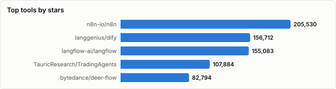
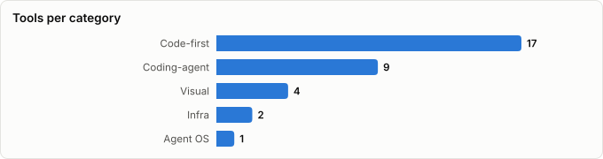

# AI Agent Orchestration — Landscape Report

> Derived from **kaiser-data**'s 1,752 starred repos (snapshot `2026-08-28T01:21:50.535Z`), cross-referenced with the repo-similarity graph (1,752 nodes / 5,707 edges, 35 communities).
>
> Generated 2026-08-28 by `scripts/reports/agent_orchestration.py` (regenerate any time — no API cost).

> **Orchestration** = coordinating multiple agents / tools / steps toward a goal: routing, planning, parallelism, hand-offs, state and recovery. The tools below differ mostly in **how you express that coordination** — in code, on a visual canvas, across coding agents, or as durable production infra.

## Executive summary

- **38 agent-orchestration tools** in your stars (**1,544,193★**), organized by *how you express coordination*:
  - **Code-first agent frameworks** (17): `MetaGPT`, `autogen`, `crewAI`, `agno`, `langgraph`, `dspy`, `agentscope`, `smolagents`, `openai-agents-python`, `semantic-kernel`, `adk-python`, `camel`, `agent-framework`, `voltagent`, `harness-sdk`, `beeai-framework`, `AutoAgents`
  - **Visual / low-code platforms** (4): `n8n`, `langflow`, `dify`, `sim`
  - **Coding-agent orchestration** (9): `deer-flow`, `ruflo`, `oh-my-openagent`, `agents`, `oh-my-claudecode`, `paseo`, `eigent`, `agent-orchestrator`, `coding-agent-template`
  - **Agent OS / long-horizon harness** (1): `eliza`
  - **Durable / production infra** (2): `flyte`, `agent-kit`
  - **Vertical / domain systems** (2): `TradingAgents`, `gpt-researcher`
  - **Protocols & meta-frameworks** (3): `ROMA`, `tinyagi`, `agent-workflow-protocol`
- **The split that matters:** *code-first frameworks* (langgraph, openai-agents, semantic-kernel) give you fine control in a programming language; *visual platforms* (n8n, dify, Flowise) trade control for speed and non-engineer access; *coding-agent orchestration* (ruflo, agent-orchestrator) is a newer niche that runs **swarms of coding agents** in parallel.
- **Big-tech has entered:** Microsoft (agent-framework, semantic-kernel), Google (adk-python), OpenAI (openai-agents-python), AWS (strands-agents) all ship first-party frameworks — a strong maturity signal.
- **Highest-health picks:** `n8n`/`dify` (100), `strands-agents` (96), `microsoft/agent-framework` & `semantic-kernel` & `Flowise` (92).

## Pick by how you want to express coordination

| You want… | Use this approach | Top picks |
|---|---|---|
| Fine-grained control, in code | Code-first framework | `langgraph`, `openai-agents-python` |
| Fast builds / non-engineers | Visual / low-code | `n8n`, `dify`, `Flowise` |
| Parallel **coding** agents | Coding-agent orchestration | `ruflo`, `Untrivial-ai/agent-orchestrator` |
| Always-on autonomous agents | Agent OS / harness | `elizaOS/eliza`, `deer-flow` |
| Durable, fault-tolerant prod | Production infra | `flyte`, `inngest/agent-kit` |
| A standard, not a library | Protocol / meta | `agent-workflow-protocol` |

## Comparison by approach

### Code-first agent frameworks

| Tool | ★ | Lang | Health | Activity | Lifecycle | Bus factor |
|---|---|---|---|---|---|---|
| [FoundationAgents/MetaGPT](https://github.com/FoundationAgents/MetaGPT) | 70,071 (▲370) | Python | 22 | stale | Declining | 0 |
| [microsoft/autogen](https://github.com/microsoft/autogen) | 60,659 (▲360) | Python | 29 | slowing | Mature | 0 |
| [crewAIInc/crewAI](https://github.com/crewAIInc/crewAI) | 57,688 (▲936) | Python | 85 | very active | Mature | 2 |
| [agno-agi/agno](https://github.com/agno-agi/agno) | 41,945 (▲326) | Python | 98 | very active | Classic | 5 |
| [langchain-ai/langgraph](https://github.com/langchain-ai/langgraph) | 40,570 (▲1,427) | Python | 77 | very active | Classic | 1 |
| [stanfordnlp/dspy](https://github.com/stanfordnlp/dspy) | 37,627 (▲943) | Python | 83 | very active | Classic | 2 |
| [agentscope-ai/agentscope](https://github.com/agentscope-ai/agentscope) | 29,831 (▲1,121) | Python | 82 | very active | Mature | 2 |
| [huggingface/smolagents](https://github.com/huggingface/smolagents) | 29,022 (▲303) | Python | 60 | active | Mature | 1 |
| [openai/openai-agents-python](https://github.com/openai/openai-agents-python) | 29,014 (▲543) | Python | 85 | very active | Hot | 2 |
| [microsoft/semantic-kernel](https://github.com/microsoft/semantic-kernel) | 28,507 (▲81) | C# | 82 | very active | Classic | 2 |
| [google/adk-python](https://github.com/google/adk-python) | 21,310 (▲275) | Python | 79 | very active | Hot | 1 |
| [camel-ai/camel](https://github.com/camel-ai/camel) | 17,650 (▲88) | Python | 85 | very active | Classic | 3 |
| [microsoft/agent-framework](https://github.com/microsoft/agent-framework) | 13,155 (▲491) | Python | 98 | very active | Hot | 7 |
| [VoltAgent/voltagent](https://github.com/VoltAgent/voltagent) | 10,433 (▲124) | TypeScript | 77 | very active | Hot | 2 |
| [strands-agents/harness-sdk](https://github.com/strands-agents/harness-sdk) | 7,033 (▲201) | Python | 97 | very active | Hot | 5 |
| [i-am-bee/beeai-framework](https://github.com/i-am-bee/beeai-framework) | 3,384 (▲6) | Python | 96 | very active | Mature | 5 |
| [liquidos-ai/AutoAgents](https://github.com/liquidos-ai/AutoAgents) | 745 (▲18) | Rust | 70 | very active | Hot | 1 |

### Visual / low-code platforms

| Tool | ★ | Lang | Health | Activity | Lifecycle | Bus factor |
|---|---|---|---|---|---|---|
| [n8n-io/n8n](https://github.com/n8n-io/n8n) | 202,638 (▲2,910) | TypeScript | 100 | very active | Classic | 12 |
| [langflow-ai/langflow](https://github.com/langflow-ai/langflow) | 153,747 (▲820) | Python | 79 | very active | Classic | 1 |
| [langgenius/dify](https://github.com/langgenius/dify) | 153,692 (▲1,975) | TypeScript | 95 | very active | Classic | 4 |
| [simstudioai/sim](https://github.com/simstudioai/sim) | 29,479 (▲113) | TypeScript | 78 | very active | Hot | 1 |

### Coding-agent orchestration

| Tool | ★ | Lang | Health | Activity | Lifecycle | Bus factor |
|---|---|---|---|---|---|---|
| [bytedance/deer-flow](https://github.com/bytedance/deer-flow) | 81,018 (▲1,506) | Python | 84 | very active | Hot | 12 |
| [ruvnet/ruflo](https://github.com/ruvnet/ruflo) | 69,568 (▲2,289) | TypeScript | 76 | very active | Hot | 1 |
| [code-yeongyu/oh-my-openagent](https://github.com/code-yeongyu/oh-my-openagent) | 68,449 (▲997) | TypeScript | 78 | very active | Hot | 1 |
| [wshobson/agents](https://github.com/wshobson/agents) | 39,201 (▲606) | Python | 64 | very active | Hot | 1 |
| [Yeachan-Heo/oh-my-claudecode](https://github.com/Yeachan-Heo/oh-my-claudecode) | 38,828 (▲406) | TypeScript | 80 | very active | Rising | 1 |
| [getpaseo/paseo](https://github.com/getpaseo/paseo) | 15,264 (▲2,624) | TypeScript | 77 | very active | Hot | 1 |
| [eigent-ai/eigent](https://github.com/eigent-ai/eigent) | 15,145 (▲337) | TypeScript | 83 | very active | Hot | 3 |
| [Untrivial-ai/agent-orchestrator](https://github.com/Untrivial-ai/agent-orchestrator) | 10,141 (▲1,289) | Go | 97 | very active | Hot | 5 |
| [vercel-labs/coding-agent-template](https://github.com/vercel-labs/coding-agent-template) | 1,771 (▲13) | TypeScript | 34 | active | Declining | 0 |

### Agent OS / long-horizon harness

| Tool | ★ | Lang | Health | Activity | Lifecycle | Bus factor |
|---|---|---|---|---|---|---|
| [elizaOS/eliza](https://github.com/elizaOS/eliza) | 19,190 (▲263) | TypeScript | 89 | very active | Mature | 3 |

### Durable / production infra

| Tool | ★ | Lang | Health | Activity | Lifecycle | Bus factor |
|---|---|---|---|---|---|---|
| [flyteorg/flyte](https://github.com/flyteorg/flyte) | 7,281 (▲99) | Go | 90 | very active | Classic | 3 |
| [inngest/agent-kit](https://github.com/inngest/agent-kit) | 924 (▲6) | TypeScript | 40 | slowing | Declining | 0 |

### Vertical / domain systems

| Tool | ★ | Lang | Health | Activity | Lifecycle | Bus factor |
|---|---|---|---|---|---|---|
| [TauricResearch/TradingAgents](https://github.com/TauricResearch/TradingAgents) | 101,235 (▲5,162) | Python | 69 | active | Mature | 1 |
| [assafelovic/gpt-researcher](https://github.com/assafelovic/gpt-researcher) | 29,175 (▲294) | Python | 84 | very active | Classic | 2 |

### Protocols & meta-frameworks

| Tool | ★ | Lang | Health | Activity | Lifecycle | Bus factor |
|---|---|---|---|---|---|---|
| [sentient-agi/ROMA](https://github.com/sentient-agi/ROMA) | 5,174 (▲72) | Python | 26 | stale | Declining | 0 |
| [TinyAGI/tinyagi](https://github.com/TinyAGI/tinyagi) | 3,610 (▲2) | TypeScript | 37 | slowing | Declining | 0 |
| [veegee82/agent-workflow-protocol](https://github.com/veegee82/agent-workflow-protocol) | 19 (▲1) | Python | 26 | slowing | Declining | 0 |

## Details

### Code-first agent frameworks

_SDKs you write agents in — maximum control over routing, state and hand-offs; the engineer's default._

- **[FoundationAgents/MetaGPT](https://github.com/FoundationAgents/MetaGPT)** · 70,071★ · Python · Declining · health 22  
  Multi-agent 'software company' — assigns SOPs/roles (PM, architect, engineer).  
  topics: agent, gpt, llm, metagpt, multi-agent
- **[microsoft/autogen](https://github.com/microsoft/autogen)** · 60,659★ · Python · Mature · health 29  
  Microsoft's conversational multi-agent framework; agents talk to solve tasks.  
  topics: chatgpt, llm-agent, llm-framework, agentic, agentic-agi, agents
- **[crewAIInc/crewAI](https://github.com/crewAIInc/crewAI)** · 57,688★ · Python · Mature · health 85  
  Role-based 'crew' multi-agent framework — agents with roles, goals & tools collaborate.  
  topics: agents, ai, ai-agents, llms, aiagentframework
- **[agno-agi/agno](https://github.com/agno-agi/agno)** · 41,945★ · Python · Classic · health 98  
  Fast multimodal agent framework (ex-phidata) with memory/tools/teams.  
  topics: developer-tools, python, agents, ai, ai-agents
- **[langchain-ai/langgraph](https://github.com/langchain-ai/langgraph)** · 40,570★ · Python · Classic · health 77  
  Graph-based agent runtime — explicit nodes/edges/state; the de-facto control-flow framework.  
  topics: agents, ai, ai-agents, chatgpt, deepagents, enterprise
- **[stanfordnlp/dspy](https://github.com/stanfordnlp/dspy)** · 37,627★ · Python · Classic · health 83  
  Programmatic prompt/pipeline optimization — compile agent behavior instead of hand-prompting.  
  topics: —
- **[agentscope-ai/agentscope](https://github.com/agentscope-ai/agentscope)** · 29,831★ · Python · Mature · health 82  
  Build agents you can see/understand/trust; strong observability + multi-agent.  
  topics: agent, chatbot, large-language-models, llm, llm-agent, multi-agent
- **[huggingface/smolagents](https://github.com/huggingface/smolagents)** · 29,022★ · Python · Mature · health 60  
  Minimalist code-agent framework — agents that write & run Python to act.  
  topics: —
- **[openai/openai-agents-python](https://github.com/openai/openai-agents-python)** · 29,014★ · Python · Hot · health 85  
  Lightweight, powerful framework for multi-agent workflows; handoffs + guardrails + tracing.  
  topics: agents, ai, framework, llm, python, openai
- **[microsoft/semantic-kernel](https://github.com/microsoft/semantic-kernel)** · 28,507★ · C# · Classic · health 82  
  Microsoft's enterprise SDK (C#/Python) for plugging LLMs + planning into apps.  
  topics: ai, artificial-intelligence, llm, openai, sdk
- **[google/adk-python](https://github.com/google/adk-python)** · 21,310★ · Python · Hot · health 79  
  Google's code-first Agent Development Kit — build, evaluate & deploy agents.  
  topics: agent, agents, agents-sdk, ai, ai-agents, multi-agent-systems
- **[camel-ai/camel](https://github.com/camel-ai/camel)** · 17,650★ · Python · Classic · health 85  
  Large multi-agent 'society' framework for studying agent cooperation at scale.  
  topics: ai-societies, artificial-intelligence, deep-learning, large-language-models, multi-agent-systems, natural-language-processing
- **[microsoft/agent-framework](https://github.com/microsoft/agent-framework)** · 13,155★ · Python · Hot · health 98  
  Microsoft's framework to build, orchestrate & deploy multi-agent workflows (health 92).  
  topics: agent-framework, agentic-ai, agents, ai, multi-agent, orchestration
- **[VoltAgent/voltagent](https://github.com/VoltAgent/voltagent)** · 10,433★ · TypeScript · Hot · health 77  
  TypeScript agent-engineering platform + open-source framework.  
  topics: agents, ai, chatbots, llm, mcp, nodejs
- **[strands-agents/harness-sdk](https://github.com/strands-agents/harness-sdk)** · 7,033★ · Python · Hot · health 97  
  Model-driven agents in a few lines; very high health (96) and bus factor 7.  
  topics: agentic, agentic-ai, agents, ai, autonomous-agents, llm
- **[i-am-bee/beeai-framework](https://github.com/i-am-bee/beeai-framework)** · 3,384★ · Python · Mature · health 96  
  Production-ready agents in both Python and TypeScript.  
  topics: agents, ai, framework, ai-agent, llm, multiagent
- **[liquidos-ai/AutoAgents](https://github.com/liquidos-ai/AutoAgents)** · 745★ · Rust · Hot · health 70  
  Rust multi-agent framework to build, deploy & coordinate agents.  
  topics: agents, ai, ai-agents, ai-agents-framework, llm

### Visual / low-code platforms

_Drag-and-drop canvases — fastest to a working flow, accessible to non-engineers, less granular control._

- **[n8n-io/n8n](https://github.com/n8n-io/n8n)** · 202,638★ · TypeScript · Classic · health 100  
  Fair-code workflow automation with native AI nodes — the giant (189k★, health 100).  
  topics: automation, ipaas, n8n, workflow, typescript, self-hosted
- **[langflow-ai/langflow](https://github.com/langflow-ai/langflow)** · 153,747★ · Python · Classic · health 79  
  Popular drag-and-drop builder for agents & flows; visual graph of components.  
  topics: react-flow, chatgpt, large-language-models, generative-ai, agents, multiagent
- **[langgenius/dify](https://github.com/langgenius/dify)** · 153,692★ · TypeScript · Classic · health 95  
  Production-ready platform for agentic workflow development (health 100).  
  topics: ai, gpt, llm, openai, python, agent
- **[simstudioai/sim](https://github.com/simstudioai/sim)** · 29,479★ · TypeScript · Hot · health 78  
  Build, deploy & orchestrate agents — 'central intelligence layer for your AI workforce'.  
  topics: agentic-workflow, agents, ai, nextjs, typescript, agent-workflow

### Coding-agent orchestration

_Coordinate *swarms of coding agents* (Claude Code, Codex, Cursor…) on a codebase — plan, spawn, run in parallel, handle CI._

- **[bytedance/deer-flow](https://github.com/bytedance/deer-flow)** · 81,018★ · Python · Hot · health 84  
  Long-horizon SuperAgent harness that researches, codes & creates with sandboxes (bf6).  
  topics: agent, agentic, agentic-framework, agentic-workflow, ai, ai-agents
- **[ruvnet/ruflo](https://github.com/ruvnet/ruflo)** · 69,568★ · TypeScript · Hot · health 76  
  Agent-orchestration platform for Claude — multi-agent swarms coordinating autonomous coding.  
  topics: claude-code, swarm, agentic-ai, agentic-framework, agentic-workflow, autonomous-agents
- **[code-yeongyu/oh-my-openagent](https://github.com/code-yeongyu/oh-my-openagent)** · 68,449★ · TypeScript · Hot · health 78  
  'omo' — agent harness (formerly oh-my-opencode) for coding workflows.  
  topics: opencode, ai, anthropic, claude, claude-skills, cursor
- **[wshobson/agents](https://github.com/wshobson/agents)** · 39,201★ · Python · Hot · health 64  
  Multi-harness agentic plugin marketplace (Claude Code, Codex, Cursor, OpenCode, Gemini).  
  topics: agents, anthropic, agent-skills, agentic-ai, ai-agents, cursor
- **[Yeachan-Heo/oh-my-claudecode](https://github.com/Yeachan-Heo/oh-my-claudecode)** · 38,828★ · TypeScript · Rising · health 80  
  Teams-first multi-agent orchestration for Claude Code.  
  topics: agentic-coding, ai-agents, claude, claude-code, oh-my-opencode, opencode
- **[getpaseo/paseo](https://github.com/getpaseo/paseo)** · 15,264★ · TypeScript · Hot · health 77  
  Run & coordinate coding agents from phone, desktop and CLI.  
  topics: agents, claude-code, codex, opencode, ade, copilot
- **[eigent-ai/eigent](https://github.com/eigent-ai/eigent)** · 15,145★ · TypeScript · Hot · health 83  
  Open-source cowork desktop — local/free multi-agent productivity workspace.  
  topics: agent-framework, agent-skills, agentic-ai, agentic-workflow, claude-cowork, claude-cowork-alternative
- **[Untrivial-ai/agent-orchestrator](https://github.com/Untrivial-ai/agent-orchestrator)** · 10,141★ · Go · Hot · health 97  
  Orchestrates parallel coding agents — plans tasks, spawns agents, handles CI autonomously.  
  topics: claude-code, codex-cli, orchestration, orchestrator, skills, agent-fleet
- **[vercel-labs/coding-agent-template](https://github.com/vercel-labs/coding-agent-template)** · 1,771★ · TypeScript · Declining · health 34  
  Multi-agent coding platform on Vercel Sandbox + AI Gateway; declining, verify first.  
  topics: —

### Agent OS / long-horizon harness

_Runtimes for always-on, long-running autonomous agents._

- **[elizaOS/eliza](https://github.com/elizaOS/eliza)** · 19,190★ · TypeScript · Mature · health 89  
  Open-source 'agentic operating system' — long-running autonomous agents.  
  topics: agent, agentic, ai, autonomous, chatbot, crypto

### Durable / production infra

_Fault-tolerant execution — retries, checkpointing, deterministic routing for production._

- **[flyteorg/flyte](https://github.com/flyteorg/flyte)** · 7,281★ · Go · Classic · health 90  
  Dynamic, resilient orchestration (Go/K8s) — coordinate data, models & compute durably.  
  topics: flyte, machine-learning, golang, scale, workflow, data-science
- **[inngest/agent-kit](https://github.com/inngest/agent-kit)** · 924★ · TypeScript · Declining · health 40  
  Build multi-agent networks in TS with deterministic routing + durable execution via MCP.  
  topics: agent, ai, ai-agent-framework, ai-agents, llm

### Vertical / domain systems

_Reference multi-agent architectures for a specific domain._

- **[TauricResearch/TradingAgents](https://github.com/TauricResearch/TradingAgents)** · 101,235★ · Python · Mature · health 69  
  Multi-agent LLM framework for financial trading — a vertical reference architecture (79k★).  
  topics: agent, finance, llm, multiagent, trading
- **[assafelovic/gpt-researcher](https://github.com/assafelovic/gpt-researcher)** · 29,175★ · Python · Classic · health 84  
  Autonomous research agent that plans, searches & writes cited reports.  
  topics: ai, python, agent, automation, research, search

### Protocols & meta-frameworks

_Standards and meta-layers above any single framework._

- **[sentient-agi/ROMA](https://github.com/sentient-agi/ROMA)** · 5,174★ · Python · Declining · health 26  
  Recursive meta-agent framework to build multi-agent systems; declining/low health.  
  topics: —
- **[TinyAGI/tinyagi](https://github.com/TinyAGI/tinyagi)** · 3,610★ · TypeScript · Declining · health 37  
  Agent-teams orchestrator aimed at one-person companies.  
  topics: —
- **[veegee82/agent-workflow-protocol](https://github.com/veegee82/agent-workflow-protocol)** · 19★ · Python · Declining · health 26  
  Open standard for multi-agent workflows — scripted pipelines to self-organizing teams.  
  topics: agentic, agentic-ai, agentic-ai-development, agentic-engineering, agentic-framework, agentic-workflow

## Graph analysis — how they relate

**Community clustering.** These 38 tools span **16 of the graph's 35 communities**.

- **Community 6** (7): `liquidos-ai/AutoAgents`, `crewAIInc/crewAI`, `agno-agi/agno`, `assafelovic/gpt-researcher`, `n8n-io/n8n`, `inngest/agent-kit`, `veegee82/agent-workflow-protocol`
- **Community 8** (4): `langchain-ai/langgraph`, `strands-agents/harness-sdk`, `i-am-bee/beeai-framework`, `langflow-ai/langflow`
- **Community 28** (4): `agentscope-ai/agentscope`, `FoundationAgents/MetaGPT`, `bytedance/deer-flow`, `TauricResearch/TradingAgents`
- **Community 15** (3): `microsoft/semantic-kernel`, `microsoft/agent-framework`, `microsoft/autogen`
- **Community 14** (3): `google/adk-python`, `langgenius/dify`, `simstudioai/sim`
- **Community 18** (3): `camel-ai/camel`, `eigent-ai/eigent`, `flyteorg/flyte`
- **Community 11** (3): `code-yeongyu/oh-my-openagent`, `Yeachan-Heo/oh-my-claudecode`, `getpaseo/paseo`
- **Community 2** (2): `VoltAgent/voltagent`, `wshobson/agents`
- **Community 16** (2): `vercel-labs/coding-agent-template`, `elizaOS/eliza`

**Centrality (PageRank in the full 1,071-repo graph)** — most 'hub-like' orchestration tools in your ecosystem:

- `langchain-ai/langgraph` — PageRank 0.0019
- `agno-agi/agno` — PageRank 0.0018
- `liquidos-ai/AutoAgents` — PageRank 0.0016
- `microsoft/semantic-kernel` — PageRank 0.0015
- `crewAIInc/crewAI` — PageRank 0.0014
- `openai/openai-agents-python` — PageRank 0.0013
- `code-yeongyu/oh-my-openagent` — PageRank 0.0012
- `wshobson/agents` — PageRank 0.0012
- `huggingface/smolagents` — PageRank 0.0011
- `inngest/agent-kit` — PageRank 0.0010

**Direct links between orchestration tools** (top similarity edges where both endpoints are in this report):

- `microsoft/agent-framework` ⇄ `microsoft/semantic-kernel` (w=1.178) — topics: ai, sdk; authors: dependabot[bot], SergeyMenshykh, moonbox3
- `microsoft/autogen` ⇄ `microsoft/agent-framework` (w=0.661) — topics: agents, ai
- `i-am-bee/beeai-framework` ⇄ `openai/openai-agents-python` (w=0.505) — topics: agents, ai, framework, llm
- `agno-agi/agno` ⇄ `crewAIInc/crewAI` (w=0.479) — topics: agents, ai, ai-agents
- `agno-agi/agno` ⇄ `liquidos-ai/AutoAgents` (w=0.429) — topics: agents, ai, ai-agents
- `crewAIInc/crewAI` ⇄ `liquidos-ai/AutoAgents` (w=0.429) — topics: agents, ai, ai-agents
- `liquidos-ai/AutoAgents` ⇄ `inngest/agent-kit` (w=0.429) — topics: ai, ai-agents, llm
- `langchain-ai/langgraph` ⇄ `i-am-bee/beeai-framework` (w=0.384) — topics: agents, ai, framework, llm; authors: dependabot[bot]
- `strands-agents/harness-sdk` ⇄ `openai/openai-agents-python` (w=0.369) — topics: agents, ai, llm, python; authors: saime428
- `simstudioai/sim` ⇄ `langgenius/dify` (w=0.326) — topics: agentic-workflow, ai, nextjs, deepseek
- `FoundationAgents/MetaGPT` ⇄ `agentscope-ai/agentscope` (w=0.323) — topics: agent, llm, multi-agent
- `FoundationAgents/MetaGPT` ⇄ `TauricResearch/TradingAgents` (w=0.300) — topics: agent, llm
- `bytedance/deer-flow` ⇄ `openai/openai-agents-python` (w=0.293) — topics: ai, llm, python, harness; authors: simpleqt, green3sf
- `langflow-ai/langflow` ⇄ `langchain-ai/langgraph` (w=0.250) — topics: chatgpt, generative-ai, agents, multiagent
- `camel-ai/camel` ⇄ `agentscope-ai/agentscope` (w=0.248) — topics: large-language-models, agent; authors: nuthalapativarun, helloJamest
- …and 7 more.

## Maintenance & risk signal

Bus factor = commit concentration (1 = single-maintainer risk). Orchestration is load-bearing — weigh this heavily before standardizing on one.

| Tool | Approach | Health | Lifecycle | Activity | Bus factor |
|---|---|---|---|---|---|
| n8n-io/n8n | Visual / low-code platforms | 100 | Classic | very active | 12 |
| microsoft/agent-framework | Code-first agent frameworks | 98 | Hot | very active | 7 |
| agno-agi/agno | Code-first agent frameworks | 98 | Classic | very active | 5 |
| strands-agents/harness-sdk | Code-first agent frameworks | 97 | Hot | very active | 5 |
| Untrivial-ai/agent-orchestrator | Coding-agent orchestration | 97 | Hot | very active | 5 |
| i-am-bee/beeai-framework | Code-first agent frameworks | 96 | Mature | very active | 5 |
| langgenius/dify | Visual / low-code platforms | 95 | Classic | very active | 4 |
| flyteorg/flyte | Durable / production infra | 90 | Classic | very active | 3 |
| elizaOS/eliza | Agent OS / long-horizon harness | 89 | Mature | very active | 3 |
| openai/openai-agents-python | Code-first agent frameworks | 85 | Hot | very active | 2 |
| crewAIInc/crewAI | Code-first agent frameworks | 85 | Mature | very active | 2 |
| camel-ai/camel | Code-first agent frameworks | 85 | Classic | very active | 3 |
| assafelovic/gpt-researcher | Vertical / domain systems | 84 | Classic | very active | 2 |
| bytedance/deer-flow | Coding-agent orchestration | 84 | Hot | very active | 12 |
| stanfordnlp/dspy | Code-first agent frameworks | 83 | Classic | very active | 2 |
| eigent-ai/eigent | Coding-agent orchestration | 83 | Hot | very active | 3 |
| microsoft/semantic-kernel | Code-first agent frameworks | 82 | Classic | very active | 2 |
| agentscope-ai/agentscope | Code-first agent frameworks | 82 | Mature | very active | 2 |
| Yeachan-Heo/oh-my-claudecode | Coding-agent orchestration | 80 | Rising | very active | 1 |
| google/adk-python | Code-first agent frameworks | 79 | Hot | very active | 1 |
| langflow-ai/langflow | Visual / low-code platforms | 79 | Classic | very active | 1 |
| simstudioai/sim | Visual / low-code platforms | 78 | Hot | very active | 1 |
| code-yeongyu/oh-my-openagent | Coding-agent orchestration | 78 | Hot | very active | 1 |
| langchain-ai/langgraph | Code-first agent frameworks | 77 | Classic | very active | 1 |
| VoltAgent/voltagent | Code-first agent frameworks | 77 | Hot | very active | 2 |
| getpaseo/paseo | Coding-agent orchestration | 77 | Hot | very active | 1 |
| ruvnet/ruflo | Coding-agent orchestration | 76 | Hot | very active | 1 |
| liquidos-ai/AutoAgents | Code-first agent frameworks | 70 | Hot | very active | 1 |
| TauricResearch/TradingAgents | Vertical / domain systems | 69 | Mature | active | 1 |
| wshobson/agents | Coding-agent orchestration | 64 | Hot | very active | 1 |
| huggingface/smolagents | Code-first agent frameworks | 60 | Mature | active | 1 |
| inngest/agent-kit | Durable / production infra | 40 | Declining | slowing | 0 |
| TinyAGI/tinyagi | Protocols & meta-frameworks | 37 | Declining | slowing | 0 |
| vercel-labs/coding-agent-template | Coding-agent orchestration | 34 | Declining | active | 0 |
| microsoft/autogen | Code-first agent frameworks | 29 | Mature | slowing | 0 |
| veegee82/agent-workflow-protocol | Protocols & meta-frameworks | 26 | Declining | slowing | 0 |
| sentient-agi/ROMA | Protocols & meta-frameworks | 26 | Declining | stale | 0 |
| FoundationAgents/MetaGPT | Code-first agent frameworks | 22 | Declining | stale | 0 |

⚠️ **Adopt with caution** (low health and/or declining): `FoundationAgents/MetaGPT`, `veegee82/agent-workflow-protocol`, `sentient-agi/ROMA`, `microsoft/autogen`, `vercel-labs/coding-agent-template`, `TinyAGI/tinyagi`, `inngest/agent-kit`.

## Coverage

Your stars now cover the canonical orchestration frameworks (crewAI, AutoGen, LangGraph, langflow, semantic-kernel, ADK, agentscope, …) — no major gaps left in this category.

## Methodology & caveats

- **Source**: `data/classified.json` + `public/data/graph.json`. No external calls; fully reproducible.
- **Selection**: scan for orchestration / multi-agent / swarm / workflow / agent-framework signals, then manual curation by approach. RAG frameworks, eval/observability platforms, and single-purpose agents were routed to their own reports or excluded; only tools whose *primary* job is coordinating agents/steps appear here.
- **Metrics** (health, lifecycle, bus_factor) are precomputed at snapshot time and may lag GitHub. Re-run after a fresh `classified.json` to refresh.

Tools covered: 38 across 7 approaches · Snapshot: 2026-08-28T01:21:50.535Z
