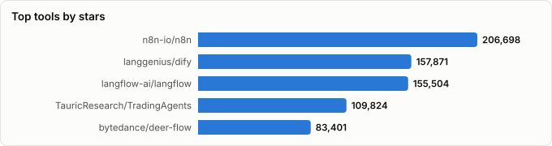
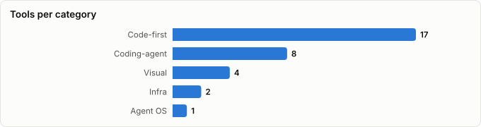

# AI Agent Orchestration — Landscape Report

> Derived from **kaiser-data**'s 2,304 starred repos (snapshot `2026-10-05T13:01:39.533Z`), cross-referenced with the repo-similarity graph (2,304 nodes / 7,632 edges, 40 communities).
>
> Generated 2026-10-05 by `scripts/reports/agent_orchestration.py` (regenerate any time — no API cost).

> **Orchestration** = coordinating multiple agents / tools / steps toward a goal: routing, planning, parallelism, hand-offs, state and recovery. The tools below differ mostly in **how you express that coordination** — in code, on a visual canvas, across coding agents, or as durable production infra.

## Executive summary

- **37 agent-orchestration tools** in your stars (**1,583,336★**), organized by *how you express coordination*:
  - **Code-first agent frameworks** (17): `MetaGPT`, `autogen`, `crewAI`, `langgraph`, `agno`, `dspy`, `agentscope`, `openai-agents-python`, `smolagents`, `semantic-kernel`, `adk-python`, `camel`, `agent-framework`, `voltagent`, `harness-sdk`, `beeai-framework`, `AutoAgents`
  - **Visual / low-code platforms** (4): `n8n`, `dify`, `langflow`, `sim`
  - **Coding-agent orchestration** (8): `deer-flow`, `ruflo`, `oh-my-openagent`, `agents`, `oh-my-claudecode`, `paseo`, `eigent`, `coding-agent-template`
  - **Agent OS / long-horizon harness** (1): `eliza`
  - **Durable / production infra** (2): `flyte`, `agent-kit`
  - **Vertical / domain systems** (2): `TradingAgents`, `gpt-researcher`
  - **Protocols & meta-frameworks** (3): `ROMA`, `tinyagi`, `agent-workflow-protocol`
- **The split that matters:** *code-first frameworks* (langgraph, openai-agents, semantic-kernel) give you fine control in a programming language; *visual platforms* (n8n, dify) trade control for speed and non-engineer access; *coding-agent orchestration* (ruflo, agent-orchestrator) is a newer niche that runs **swarms of coding agents** in parallel.
- **Big-tech has entered:** Microsoft (agent-framework, semantic-kernel), Google (adk-python), OpenAI (openai-agents-python), AWS (strands-agents) all ship first-party frameworks — a strong maturity signal.
- **Highest-health picks:** `n8n`/`dify` (100), `strands-agents` (96), `microsoft/agent-framework` & `semantic-kernel` (92). `Flowise` used to sit in this band and was **archived upstream** in August 2026 — see *Retired from the scored set*.

## Pick by how you want to express coordination

| You want… | Use this approach | Top picks |
|---|---|---|
| Fine-grained control, in code | Code-first framework | `langgraph`, `openai-agents-python` |
| Fast builds / non-engineers | Visual / low-code | `n8n`, `dify` |
| Parallel **coding** agents | Coding-agent orchestration | `ruflo`, `Untrivial-ai/agent-orchestrator` |
| Always-on autonomous agents | Agent OS / harness | `elizaOS/eliza`, `deer-flow` |
| Durable, fault-tolerant prod | Production infra | `flyte`, `inngest/agent-kit` |
| A standard, not a library | Protocol / meta | `agent-workflow-protocol` |

## Comparison by approach

### Code-first agent frameworks

| Tool | ★ | Lang | Health | Activity | Lifecycle | Bus factor |
|---|---|---|---|---|---|---|
| [FoundationAgents/MetaGPT](https://github.com/FoundationAgents/MetaGPT) | 70,745 (▲142) | Python | 18 | stale | Declining | 0 |
| [microsoft/autogen](https://github.com/microsoft/autogen) | 61,256 (▲105) | Python | 24 | slowing | Mature | 0 |
| [crewAIInc/crewAI](https://github.com/crewAIInc/crewAI) | 59,356 (▲351) | Python | 89 | very active | Mature | 3 |
| [langchain-ai/langgraph](https://github.com/langchain-ai/langgraph) | 42,730 (▲476) | Python | 76 | very active | Classic | 1 |
| [agno-agi/agno](https://github.com/agno-agi/agno) | 42,559 (▲224) | Python | 97 | very active | Classic | 8 |
| [stanfordnlp/dspy](https://github.com/stanfordnlp/dspy) | 38,503 (▲233) | Python | 83 | very active | Classic | 2 |
| [agentscope-ai/agentscope](https://github.com/agentscope-ai/agentscope) | 32,773 (▲437) | Python | 97 | very active | Mature | 7 |
| [openai/openai-agents-python](https://github.com/openai/openai-agents-python) | 29,840 (▲150) | Python | 80 | very active | Hot | 1 |
| [huggingface/smolagents](https://github.com/huggingface/smolagents) | 29,680 (▲196) | Python | 56 | active | Mature | 1 |
| [microsoft/semantic-kernel](https://github.com/microsoft/semantic-kernel) | 28,628 (▲27) | C# | 80 | very active | Classic | 2 |
| [google/adk-python](https://github.com/google/adk-python) | 21,708 (▲71) | Python | 99 | very active | Hot | 5 |
| [camel-ai/camel](https://github.com/camel-ai/camel) | 17,810 (▲39) | Python | 84 | very active | Classic | 3 |
| [microsoft/agent-framework](https://github.com/microsoft/agent-framework) | 13,946 (▲159) | Python | 93 | very active | Hot | 4 |
| [VoltAgent/voltagent](https://github.com/VoltAgent/voltagent) | 10,725 (▲53) | TypeScript | 74 | very active | Mature | 2 |
| [strands-agents/harness-sdk](https://github.com/strands-agents/harness-sdk) | 8,671 (▲300) | Python | 92 | very active | Hot | 4 |
| [i-am-bee/beeai-framework](https://github.com/i-am-bee/beeai-framework) | 3,427 (▲14) | Python | 97 | very active | Mature | 6 |
| [liquidos-ai/AutoAgents](https://github.com/liquidos-ai/AutoAgents) | 761 (▲2) | Rust | 67 | active | Mature | 2 |

### Visual / low-code platforms

| Tool | ★ | Lang | Health | Activity | Lifecycle | Bus factor |
|---|---|---|---|---|---|---|
| [n8n-io/n8n](https://github.com/n8n-io/n8n) | 206,698 (▲786) | TypeScript | 100 | very active | Classic | 9 |
| [langgenius/dify](https://github.com/langgenius/dify) | 157,871 (▲701) | TypeScript | 80 | very active | Classic | 1 |
| [langflow-ai/langflow](https://github.com/langflow-ai/langflow) | 155,504 (▲273) | Python | 79 | very active | Classic | 1 |
| [simstudioai/sim](https://github.com/simstudioai/sim) | 29,778 (▲60) | TypeScript | 77 | very active | Hot | 1 |

### Coding-agent orchestration

| Tool | ★ | Lang | Health | Activity | Lifecycle | Bus factor |
|---|---|---|---|---|---|---|
| [bytedance/deer-flow](https://github.com/bytedance/deer-flow) | 83,401 (▲439) | Python | 87 | very active | Hot | 8 |
| [ruvnet/ruflo](https://github.com/ruvnet/ruflo) | 73,892 (▲654) | TypeScript | 76 | very active | Mature | 1 |
| [code-yeongyu/oh-my-openagent](https://github.com/code-yeongyu/oh-my-openagent) | 69,807 (▲412) | TypeScript | 78 | very active | Hot | 1 |
| [wshobson/agents](https://github.com/wshobson/agents) | 40,208 (▲275) | Python | 63 | very active | Hot | 1 |
| [Yeachan-Heo/oh-my-claudecode](https://github.com/Yeachan-Heo/oh-my-claudecode) | 39,585 (▲237) | TypeScript | 85 | very active | Hot | 2 |
| [getpaseo/paseo](https://github.com/getpaseo/paseo) | 19,571 (▲1,041) | TypeScript | 83 | very active | Hot | 2 |
| [eigent-ai/eigent](https://github.com/eigent-ai/eigent) | 15,453 (▲29) | TypeScript | 78 | very active | Hot | 1 |
| [vercel-labs/coding-agent-template](https://github.com/vercel-labs/coding-agent-template) | 1,791 (▲1) | TypeScript | 31 | active | Declining | 0 |

### Agent OS / long-horizon harness

| Tool | ★ | Lang | Health | Activity | Lifecycle | Bus factor |
|---|---|---|---|---|---|---|
| [elizaOS/eliza](https://github.com/elizaOS/eliza) | 19,538 (▲39) | TypeScript | 80 | very active | Mature | 1 |

### Durable / production infra

| Tool | ★ | Lang | Health | Activity | Lifecycle | Bus factor |
|---|---|---|---|---|---|---|
| [flyteorg/flyte](https://github.com/flyteorg/flyte) | 7,626 (▲61) | Go | 79 | very active | Classic | 1 |
| [inngest/agent-kit](https://github.com/inngest/agent-kit) | 939 (▲1) | TypeScript | 25 | slowing | Declining | 0 |

### Vertical / domain systems

| Tool | ★ | Lang | Health | Activity | Lifecycle | Bus factor |
|---|---|---|---|---|---|---|
| [TauricResearch/TradingAgents](https://github.com/TauricResearch/TradingAgents) | 109,824 (▲1,284) | Python | 79 | very active | Hot | 1 |
| [assafelovic/gpt-researcher](https://github.com/assafelovic/gpt-researcher) | 29,919 (▲304) | Python | 80 | very active | Classic | 1 |

### Protocols & meta-frameworks

| Tool | ★ | Lang | Health | Activity | Lifecycle | Bus factor |
|---|---|---|---|---|---|---|
| [sentient-agi/ROMA](https://github.com/sentient-agi/ROMA) | 5,176 (▼5) | Python | 20 | stale | Declining | 0 |
| [TinyAGI/tinyagi](https://github.com/TinyAGI/tinyagi) | 3,618 (▼3) | TypeScript | 34 | stale | Declining | 0 |
| [veegee82/agent-workflow-protocol](https://github.com/veegee82/agent-workflow-protocol) | 19 | Python | 23 | slowing | Declining | 0 |

## Details

### Code-first agent frameworks

_SDKs you write agents in — maximum control over routing, state and hand-offs; the engineer's default._

- **[FoundationAgents/MetaGPT](https://github.com/FoundationAgents/MetaGPT)** · 70,745★ · Python · Declining · health 18  
  Multi-agent 'software company' — assigns SOPs/roles (PM, architect, engineer).  
  topics: agent, gpt, llm, metagpt, multi-agent
- **[microsoft/autogen](https://github.com/microsoft/autogen)** · 61,256★ · Python · Mature · health 24  
  Microsoft's conversational multi-agent framework; agents talk to solve tasks.  
  topics: chatgpt, llm-agent, llm-framework, agentic, agentic-agi, agents
- **[crewAIInc/crewAI](https://github.com/crewAIInc/crewAI)** · 59,356★ · Python · Mature · health 89  
  Role-based 'crew' multi-agent framework — agents with roles, goals & tools collaborate.  
  topics: agents, ai, ai-agents, llms, aiagentframework
- **[langchain-ai/langgraph](https://github.com/langchain-ai/langgraph)** · 42,730★ · Python · Classic · health 76  
  Graph-based agent runtime — explicit nodes/edges/state; the de-facto control-flow framework.  
  topics: agents, ai, ai-agents, chatgpt, deepagents, enterprise
- **[agno-agi/agno](https://github.com/agno-agi/agno)** · 42,559★ · Python · Classic · health 97  
  Fast multimodal agent framework (ex-phidata) with memory/tools/teams.  
  topics: developer-tools, python, agents, ai, ai-agents
- **[stanfordnlp/dspy](https://github.com/stanfordnlp/dspy)** · 38,503★ · Python · Classic · health 83  
  Programmatic prompt/pipeline optimization — compile agent behavior instead of hand-prompting.  
  topics: —
- **[agentscope-ai/agentscope](https://github.com/agentscope-ai/agentscope)** · 32,773★ · Python · Mature · health 97  
  Build agents you can see/understand/trust; strong observability + multi-agent.  
  topics: agent, chatbot, large-language-models, llm, llm-agent, multi-agent
- **[openai/openai-agents-python](https://github.com/openai/openai-agents-python)** · 29,840★ · Python · Hot · health 80  
  Lightweight, powerful framework for multi-agent workflows; handoffs + guardrails + tracing.  
  topics: agents, ai, framework, llm, python, openai
- **[huggingface/smolagents](https://github.com/huggingface/smolagents)** · 29,680★ · Python · Mature · health 56  
  Minimalist code-agent framework — agents that write & run Python to act.  
  topics: —
- **[microsoft/semantic-kernel](https://github.com/microsoft/semantic-kernel)** · 28,628★ · C# · Classic · health 80  
  Microsoft's enterprise SDK (C#/Python) for plugging LLMs + planning into apps.  
  topics: ai, artificial-intelligence, llm, openai, sdk
- **[google/adk-python](https://github.com/google/adk-python)** · 21,708★ · Python · Hot · health 99  
  Google's code-first Agent Development Kit — build, evaluate & deploy agents.  
  topics: agent, agents, agents-sdk, ai, ai-agents, multi-agent-systems
- **[camel-ai/camel](https://github.com/camel-ai/camel)** · 17,810★ · Python · Classic · health 84  
  Large multi-agent 'society' framework for studying agent cooperation at scale.  
  topics: ai-societies, artificial-intelligence, deep-learning, large-language-models, multi-agent-systems, natural-language-processing
- **[microsoft/agent-framework](https://github.com/microsoft/agent-framework)** · 13,946★ · Python · Hot · health 93  
  Microsoft's framework to build, orchestrate & deploy multi-agent workflows (health 92).  
  topics: agent-framework, agentic-ai, agents, ai, multi-agent, orchestration
- **[VoltAgent/voltagent](https://github.com/VoltAgent/voltagent)** · 10,725★ · TypeScript · Mature · health 74  
  TypeScript agent-engineering platform + open-source framework.  
  topics: agents, ai, chatbots, llm, mcp, nodejs
- **[strands-agents/harness-sdk](https://github.com/strands-agents/harness-sdk)** · 8,671★ · Python · Hot · health 92  
  Model-driven agents in a few lines; very high health (96) and bus factor 7.  
  topics: agentic, agentic-ai, agents, ai, autonomous-agents, llm
- **[i-am-bee/beeai-framework](https://github.com/i-am-bee/beeai-framework)** · 3,427★ · Python · Mature · health 97  
  Production-ready agents in both Python and TypeScript.  
  topics: agents, ai, framework, ai-agent, llm, multiagent
- **[liquidos-ai/AutoAgents](https://github.com/liquidos-ai/AutoAgents)** · 761★ · Rust · Mature · health 67  
  Rust multi-agent framework to build, deploy & coordinate agents.  
  topics: agents, ai, ai-agents, ai-agents-framework, llm

### Visual / low-code platforms

_Drag-and-drop canvases — fastest to a working flow, accessible to non-engineers, less granular control._

- **[n8n-io/n8n](https://github.com/n8n-io/n8n)** · 206,698★ · TypeScript · Classic · health 100  
  Fair-code workflow automation with native AI nodes — the giant (189k★, health 100).  
  topics: automation, ipaas, n8n, workflow, typescript, self-hosted
- **[langgenius/dify](https://github.com/langgenius/dify)** · 157,871★ · TypeScript · Classic · health 80  
  Production-ready platform for agentic workflow development (health 100).  
  topics: ai, gpt, llm, openai, python, agent
- **[langflow-ai/langflow](https://github.com/langflow-ai/langflow)** · 155,504★ · Python · Classic · health 79  
  Popular drag-and-drop builder for agents & flows; visual graph of components.  
  topics: react-flow, chatgpt, large-language-models, generative-ai, agents, multiagent
- **[simstudioai/sim](https://github.com/simstudioai/sim)** · 29,778★ · TypeScript · Hot · health 77  
  Build, deploy & orchestrate agents — 'central intelligence layer for your AI workforce'.  
  topics: agentic-workflow, agents, ai, nextjs, typescript, agent-workflow

### Coding-agent orchestration

_Coordinate *swarms of coding agents* (Claude Code, Codex, Cursor…) on a codebase — plan, spawn, run in parallel, handle CI._

- **[bytedance/deer-flow](https://github.com/bytedance/deer-flow)** · 83,401★ · Python · Hot · health 87  
  Long-horizon SuperAgent harness that researches, codes & creates with sandboxes (bf6).  
  topics: agent, agentic, agentic-framework, agentic-workflow, ai, ai-agents
- **[ruvnet/ruflo](https://github.com/ruvnet/ruflo)** · 73,892★ · TypeScript · Mature · health 76  
  Agent-orchestration platform for Claude — multi-agent swarms coordinating autonomous coding.  
  topics: swarm, agentic-ai, agentic-framework, agentic-workflow, autonomous-agents, codex
- **[code-yeongyu/oh-my-openagent](https://github.com/code-yeongyu/oh-my-openagent)** · 69,807★ · TypeScript · Hot · health 78  
  'omo' — agent harness (formerly oh-my-opencode) for coding workflows.  
  topics: opencode, ai, anthropic, claude, claude-skills, cursor
- **[wshobson/agents](https://github.com/wshobson/agents)** · 40,208★ · Python · Hot · health 63  
  Multi-harness agentic plugin marketplace (Claude Code, Codex, Cursor, OpenCode, Gemini).  
  topics: anthropic, agent-skills, agentic-ai, ai-agents, cursor, cursor-rules
- **[Yeachan-Heo/oh-my-claudecode](https://github.com/Yeachan-Heo/oh-my-claudecode)** · 39,585★ · TypeScript · Hot · health 85  
  Teams-first multi-agent orchestration for Claude Code.  
  topics: agentic-coding, ai-agents, claude, claude-code, oh-my-opencode, opencode
- **[getpaseo/paseo](https://github.com/getpaseo/paseo)** · 19,571★ · TypeScript · Hot · health 83  
  Run & coordinate coding agents from phone, desktop and CLI.  
  topics: agents, claude-code, codex, opencode, ade, copilot
- **[eigent-ai/eigent](https://github.com/eigent-ai/eigent)** · 15,453★ · TypeScript · Hot · health 78  
  Open-source cowork desktop — local/free multi-agent productivity workspace.  
  topics: agent-framework, agent-skills, agentic-ai, agentic-workflow, claude-cowork, claude-cowork-alternative
- **[vercel-labs/coding-agent-template](https://github.com/vercel-labs/coding-agent-template)** · 1,791★ · TypeScript · Declining · health 31  
  Multi-agent coding platform on Vercel Sandbox + AI Gateway; declining, verify first.  
  topics: —

### Agent OS / long-horizon harness

_Runtimes for always-on, long-running autonomous agents._

- **[elizaOS/eliza](https://github.com/elizaOS/eliza)** · 19,538★ · TypeScript · Mature · health 80  
  Open-source 'agentic operating system' — long-running autonomous agents.  
  topics: agent, agentic, ai, autonomous, chatbot, crypto

### Durable / production infra

_Fault-tolerant execution — retries, checkpointing, deterministic routing for production._

- **[flyteorg/flyte](https://github.com/flyteorg/flyte)** · 7,626★ · Go · Classic · health 79  
  Dynamic, resilient orchestration (Go/K8s) — coordinate data, models & compute durably.  
  topics: flyte, machine-learning, golang, scale, workflow, data-science
- **[inngest/agent-kit](https://github.com/inngest/agent-kit)** · 939★ · TypeScript · Declining · health 25  
  Build multi-agent networks in TS with deterministic routing + durable execution via MCP.  
  topics: agent, ai, ai-agent-framework, ai-agents, llm

### Vertical / domain systems

_Reference multi-agent architectures for a specific domain._

- **[TauricResearch/TradingAgents](https://github.com/TauricResearch/TradingAgents)** · 109,824★ · Python · Hot · health 79  
  Multi-agent LLM framework for financial trading — a vertical reference architecture (79k★).  
  topics: agent, finance, llm, multiagent, trading
- **[assafelovic/gpt-researcher](https://github.com/assafelovic/gpt-researcher)** · 29,919★ · Python · Classic · health 80  
  Autonomous research agent that plans, searches & writes cited reports.  
  topics: ai, python, agent, automation, research, search

### Protocols & meta-frameworks

_Standards and meta-layers above any single framework._

- **[sentient-agi/ROMA](https://github.com/sentient-agi/ROMA)** · 5,176★ · Python · Declining · health 20  
  Recursive meta-agent framework to build multi-agent systems; declining/low health.  
  topics: —
- **[TinyAGI/tinyagi](https://github.com/TinyAGI/tinyagi)** · 3,618★ · TypeScript · Declining · health 34  
  Agent-teams orchestrator aimed at one-person companies.  
  topics: —
- **[veegee82/agent-workflow-protocol](https://github.com/veegee82/agent-workflow-protocol)** · 19★ · Python · Declining · health 23  
  Open standard for multi-agent workflows — scripted pipelines to self-organizing teams.  
  topics: agentic, agentic-ai, agentic-ai-development, agentic-engineering, agentic-framework, agentic-workflow

## Graph analysis — how they relate

**Community clustering.** These 37 tools span **16 of the graph's 40 communities**.

- **Community 0** (11): `langchain-ai/langgraph`, `VoltAgent/voltagent`, `strands-agents/harness-sdk`, `i-am-bee/beeai-framework`, `liquidos-ai/AutoAgents`, `crewAIInc/crewAI`, `agno-agi/agno`, `assafelovic/gpt-researcher`, `langflow-ai/langflow`, `flyteorg/flyte`, `inngest/agent-kit`
- **Community 5** (5): `code-yeongyu/oh-my-openagent`, `ruvnet/ruflo`, `wshobson/agents`, `eigent-ai/eigent`, `getpaseo/paseo`
- **Community 15** (4): `agentscope-ai/agentscope`, `FoundationAgents/MetaGPT`, `bytedance/deer-flow`, `TauricResearch/TradingAgents`
- **Community 9** (3): `microsoft/semantic-kernel`, `microsoft/agent-framework`, `microsoft/autogen`
- **Community 22** (3): `langgenius/dify`, `simstudioai/sim`, `elizaOS/eliza`

**Centrality (PageRank in the full 1,071-repo graph)** — most 'hub-like' orchestration tools in your ecosystem:

- `openai/openai-agents-python` — PageRank 0.0013
- `langchain-ai/langgraph` — PageRank 0.0013
- `huggingface/smolagents` — PageRank 0.0012
- `agno-agi/agno` — PageRank 0.0012
- `liquidos-ai/AutoAgents` — PageRank 0.0012
- `microsoft/semantic-kernel` — PageRank 0.0010
- `microsoft/agent-framework` — PageRank 0.0009
- `inngest/agent-kit` — PageRank 0.0008
- `crewAIInc/crewAI` — PageRank 0.0008
- `code-yeongyu/oh-my-openagent` — PageRank 0.0008

**Direct links between orchestration tools** (top similarity edges where both endpoints are in this report):

- `microsoft/agent-framework` ⇄ `microsoft/semantic-kernel` (w=1.013) — topics: ai, sdk; authors: eavanvalkenburg, dependabot[bot], baywet
- `microsoft/autogen` ⇄ `microsoft/agent-framework` (w=0.661) — topics: agents, ai
- `agno-agi/agno` ⇄ `crewAIInc/crewAI` (w=0.649) — topics: agents, ai, ai-agents; authors: simpleqt, BlueX888, Ghraven
- `i-am-bee/beeai-framework` ⇄ `openai/openai-agents-python` (w=0.588) — topics: agents, ai, framework, llm; authors: dependabot[bot], mittalpk
- `agno-agi/agno` ⇄ `liquidos-ai/AutoAgents` (w=0.429) — topics: agents, ai, ai-agents
- `crewAIInc/crewAI` ⇄ `liquidos-ai/AutoAgents` (w=0.429) — topics: agents, ai, ai-agents
- `liquidos-ai/AutoAgents` ⇄ `inngest/agent-kit` (w=0.429) — topics: ai, ai-agents, llm
- `langchain-ai/langgraph` ⇄ `i-am-bee/beeai-framework` (w=0.379) — topics: agents, ai, framework, llm; authors: dependabot[bot]
- `strands-agents/harness-sdk` ⇄ `openai/openai-agents-python` (w=0.377) — topics: agents, ai, llm, python; authors: dependabot[bot]
- `agno-agi/agno` ⇄ `i-am-bee/beeai-framework` (w=0.372) — topics: python, agents, ai; authors: icearia0219, baba9811
- `simstudioai/sim` ⇄ `langgenius/dify` (w=0.326) — topics: agentic-workflow, ai, nextjs, deepseek
- `FoundationAgents/MetaGPT` ⇄ `TauricResearch/TradingAgents` (w=0.300) — topics: agent, llm
- `agno-agi/agno` ⇄ `bytedance/deer-flow` (w=0.295) — topics: python, ai, ai-agents; authors: yetuge, Shxiao101, Xx-173
- `bytedance/deer-flow` ⇄ `agentscope-ai/agentscope` (w=0.274) — topics: agent, llm, multi-agent; authors: Lesereingrape, sxh313, lihongyuan99
- `FoundationAgents/MetaGPT` ⇄ `agentscope-ai/agentscope` (w=0.264) — topics: agent, llm, multi-agent
- …and 5 more.

## Maintenance & risk signal

Bus factor = commit concentration (1 = single-maintainer risk). Orchestration is load-bearing — weigh this heavily before standardizing on one.

| Tool | Approach | Health | Lifecycle | Activity | Bus factor |
|---|---|---|---|---|---|
| n8n-io/n8n | Visual / low-code platforms | 100 | Classic | very active | 9 |
| google/adk-python | Code-first agent frameworks | 99 | Hot | very active | 5 |
| agentscope-ai/agentscope | Code-first agent frameworks | 97 | Mature | very active | 7 |
| i-am-bee/beeai-framework | Code-first agent frameworks | 97 | Mature | very active | 6 |
| agno-agi/agno | Code-first agent frameworks | 97 | Classic | very active | 8 |
| microsoft/agent-framework | Code-first agent frameworks | 93 | Hot | very active | 4 |
| strands-agents/harness-sdk | Code-first agent frameworks | 92 | Hot | very active | 4 |
| crewAIInc/crewAI | Code-first agent frameworks | 89 | Mature | very active | 3 |
| bytedance/deer-flow | Coding-agent orchestration | 87 | Hot | very active | 8 |
| Yeachan-Heo/oh-my-claudecode | Coding-agent orchestration | 85 | Hot | very active | 2 |
| camel-ai/camel | Code-first agent frameworks | 84 | Classic | very active | 3 |
| stanfordnlp/dspy | Code-first agent frameworks | 83 | Classic | very active | 2 |
| getpaseo/paseo | Coding-agent orchestration | 83 | Hot | very active | 2 |
| microsoft/semantic-kernel | Code-first agent frameworks | 80 | Classic | very active | 2 |
| openai/openai-agents-python | Code-first agent frameworks | 80 | Hot | very active | 1 |
| assafelovic/gpt-researcher | Vertical / domain systems | 80 | Classic | very active | 1 |
| langgenius/dify | Visual / low-code platforms | 80 | Classic | very active | 1 |
| elizaOS/eliza | Agent OS / long-horizon harness | 80 | Mature | very active | 1 |
| langflow-ai/langflow | Visual / low-code platforms | 79 | Classic | very active | 1 |
| flyteorg/flyte | Durable / production infra | 79 | Classic | very active | 1 |
| TauricResearch/TradingAgents | Vertical / domain systems | 79 | Hot | very active | 1 |
| code-yeongyu/oh-my-openagent | Coding-agent orchestration | 78 | Hot | very active | 1 |
| eigent-ai/eigent | Coding-agent orchestration | 78 | Hot | very active | 1 |
| simstudioai/sim | Visual / low-code platforms | 77 | Hot | very active | 1 |
| langchain-ai/langgraph | Code-first agent frameworks | 76 | Classic | very active | 1 |
| ruvnet/ruflo | Coding-agent orchestration | 76 | Mature | very active | 1 |
| VoltAgent/voltagent | Code-first agent frameworks | 74 | Mature | very active | 2 |
| liquidos-ai/AutoAgents | Code-first agent frameworks | 67 | Mature | active | 2 |
| wshobson/agents | Coding-agent orchestration | 63 | Hot | very active | 1 |
| huggingface/smolagents | Code-first agent frameworks | 56 | Mature | active | 1 |
| TinyAGI/tinyagi | Protocols & meta-frameworks | 34 | Declining | stale | 0 |
| vercel-labs/coding-agent-template | Coding-agent orchestration | 31 | Declining | active | 0 |
| inngest/agent-kit | Durable / production infra | 25 | Declining | slowing | 0 |
| microsoft/autogen | Code-first agent frameworks | 24 | Mature | slowing | 0 |
| veegee82/agent-workflow-protocol | Protocols & meta-frameworks | 23 | Declining | slowing | 0 |
| sentient-agi/ROMA | Protocols & meta-frameworks | 20 | Declining | stale | 0 |
| FoundationAgents/MetaGPT | Code-first agent frameworks | 18 | Declining | stale | 0 |

⚠️ **Adopt with caution** (low health and/or declining): `FoundationAgents/MetaGPT`, `sentient-agi/ROMA`, `veegee82/agent-workflow-protocol`, `microsoft/autogen`, `inngest/agent-kit`, `vercel-labs/coding-agent-template`, `TinyAGI/tinyagi`.

## Coverage

Your stars now cover the canonical orchestration frameworks (crewAI, AutoGen, LangGraph, langflow, semantic-kernel, ADK, agentscope, …) — no major gaps left in this category.

## Methodology & caveats

- **Source**: `data/classified.json` + `public/data/graph.json`. No external calls; fully reproducible.
- **Selection**: scan for orchestration / multi-agent / swarm / workflow / agent-framework signals, then manual curation by approach. RAG frameworks, eval/observability platforms, and single-purpose agents were routed to their own reports or excluded; only tools whose *primary* job is coordinating agents/steps appear here.
- **Metrics** (health, lifecycle, bus_factor) are precomputed at snapshot time and may lag GitHub. Re-run after a fresh `classified.json` to refresh.

### Retired from the scored set

Archived upstream, so they no longer appear in this report's tables — `sample.mjs` excludes archived repos. Metrics are frozen at the date shown and are not refreshed.

| Project | Category | Why it left | Metrics as of |
|---|---|---|---|
| [`FlowiseAI/Flowise`](https://github.com/FlowiseAI/Flowise) | Visual / low-code platforms | Archived upstream; last in the dataset 2026-08-11. Build AI agents visually; popular drag-and-drop builder. | 2026-08-11 |

Tools covered: 37 across 7 approaches · Snapshot: 2026-10-05T13:01:39.533Z
