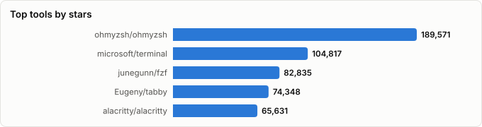
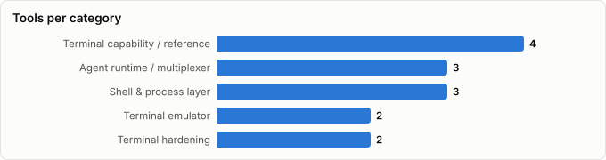

# Terminals for Agentic Programming — Which Terminal App, on Which OS, for How Many Sessions?

> Derived from **kaiser-data**'s 1,752 starred repos (snapshot `2026-08-28T01:21:50.535Z`), cross-referenced with the repo-similarity graph (1,752 nodes / 5,707 edges, 35 communities). The OS matrix, gap table, and scorecard are backed by external evidence gathered 2026-08-23 (GitHub API + 2026 head-to-head comparisons) — see Methodology.
>
> Generated 2026-08-28 by `scripts/reports/agentic_terminals.py` (regenerate any time — no API cost).






## Executive summary

- **Two questions decide this, in order: which OS, and how many concurrent sessions.** Feature comparisons come third, and render benchmarks barely matter at all. The best tool for the job on macOS does not exist on Windows.
- **Best terminal for agentic coding, by OS:** macOS → **`cmux`** past one agent, **Ghostty** for a single session. Linux → **Ghostty** or **Kitty** as the emulator with **tmux** underneath and **`herdr`** or **`claude-squad`** for agent state. Windows → **Windows Terminal + WSL**, or **WezTerm** if you want one emulator everywhere. Remote → **tmux**, always.
- **The break point is roughly four agents.** Below it, any terminal works and panes are fine. Above it, undifferentiated panes actively hurt — you scroll to find the one that crashed — and you need per-session identity (branch, worktree, status) plus notifications that come to you.
- **One worktree per agent is the step people skip and regret.** Several agents in panes against a single working directory conflict or overwrite each other's edits. Claude Code ships `-w` / `--worktree` and `--tmux` to do exactly this — verified against the installed binary, not a blog post.
- **The agent already integrates with one terminal by name.** `claude --worktree --tmux` "uses iTerm2 native panes when available; use `--tmux=classic` for traditional tmux". On macOS that makes `iTerm2` — already in your stars — the zero-install multi-session answer, and it is a first-party signal worth more than any render benchmark in this report.
- **The gap in your stars is structural.** Coding *agents* are covered exhaustively — 31 tools, 1.2M★ in `ai-coding-tuis` — but the *terminal they live in* is only **14 repos (201,163★)**, against **45 relevant terminal apps (1,235,000★) missing entirely**.
- **You have zero agent-aware terminals.** The category that 2026 actually produced — terminals that know an agent is running and surface its state — is unrepresented: no `cmux` (26,373★), no `warp` (64,466★), no `waveterm` (22,088★). You star `ghostty-org/ghostling` (1,091★, declining) but not `ghostty-org/ghostty` (60,102★).
- **What you do have** breaks down as:
  - **Terminal emulator** (2): `iTerm2`, `ghostling`
  - **Agent runtime / multiplexer** (3): `tmux`, `herdr`, `agent-orchestrator`
  - **Terminal hardening** (2): `container-use`, `tirith`
  - **Shell & process layer** (3): `witr`, `x-cmd`, `dotfiles`
  - **Terminal capability / reference** (4): `iTerm2-Color-Schemes`, `awesome-tuis`, `chafa`, `lsix`
- **Nothing in your stars covers this layer editorially.** `tmux`, `iTerm2`, `herdr`, `chafa`, `x-cmd`, `witr`, and `awesome-tuis` appear in **no other report** in this suite — `herdr` alone is 25,579★ and Hot.

## Choosing by operating system

Platform availability eliminates more candidates than any feature does. The agent-aware terminals — the ones actually built for this — are macOS-first, and two of the three best emulators have no Windows build at all.

| OS | Emulator | Session layer | Multi-agent layer | The constraint |
|---|---|---|---|---|
| **macOS** | cmux (agent-aware) or Ghostty (fastest) | tmux, or cmux's own tabs — or iTerm2 native panes via `claude -w --tmux` | cmux, herdr, claude-squad | The richest options by a wide margin — and the only place cmux runs. Also the only place Claude Code's own `--tmux` gets native panes, since that path is iTerm2-specific. |
| **Linux** | Ghostty (GTK4/libadwaita) or Kitty | tmux or Zellij | herdr, claude-squad, agent-orchestrator | No cmux. Ghostty is native and excellent, but you build the agent-awareness layer yourself out of tmux + an orchestrator. |
| **Windows** | WezTerm, or Windows Terminal + WSL | tmux inside WSL | Warp (beta), waveterm, dekit | The weakest story. Ghostty, Kitty, and cmux have no Windows build at all. WSL is not a nicety here — most agent tooling assumes POSIX. |
| **Remote / headless box** | irrelevant — the emulator is local | tmux (+ mosh or Eternal Terminal) | herdr, claude-squad over SSH | The emulator stops mattering; persistence and reconnection are everything. This is where tmux's 2007 design is still unbeaten. |
| **Phone / away from desk** | Blink (iOS) attaching to tmux, or ttyd in a browser | tmux on the host | nimbalyst (iPhone app), omnara | Supervision, not authoring: you want to see which agent is blocked and approve or kill it in ten seconds. |

**Platform reality, stated plainly:**

- **`cmux` is macOS-only** — the single best tool for multi-agent supervision is unavailable to Linux and Windows users, with no announced plans otherwise.
- **Ghostty runs on macOS and Linux, not Windows.** Windows is planned post-1.0 with no timeline; WSL2 works but is explicitly unsupported by the maintainer. A community fork (`Codavo/ghostinthewsl`, 56★) exists precisely because of this.
- **Kitty has no Windows build.** WSL only.
- **WezTerm is the only first-tier emulator equally at home on all three** — which is why it's the right default for a mixed-OS team even though its renderer is the slowest of the GPU-accelerated set.
- **On Windows, WSL is the platform, not an accessory.** Agent tooling overwhelmingly assumes POSIX; `microsoft/WSL` (33,494★) belongs in your stars before any emulator does.
- **On a remote box the emulator stops mattering entirely.** Only persistence and reconnection do — tmux plus `mosh` or Eternal Terminal.

## Running multiple sessions — where each approach breaks

Agent count is the variable that changes the answer. Each row is where the previous setup stops working.

| Concurrent agents | What breaks | What to run |
|---|---|---|
| **1 agent** | Nothing. Any terminal works. | Ghostty (or whatever you already use). Don't over-engineer this. |
| **2–3 agents** | You start losing track of which pane finished. | `claude -w --tmux` — one worktree per session, in iTerm2 native panes on macOS or classic tmux elsewhere. Add `starship` so each pane shows its branch. |
| **4–6 agents** | Panes stop being self-describing; you scroll to find the crashed one. File collisions appear if they share a working directory. | One git worktree per agent — `claude --worktree` — plus one tmux session per worktree, managed with `sesh`. This is the step most people skip and regret. |
| **7–12 agents** | Human polling fails entirely. You need to be *told*, not to look. | An agent-aware surface: `cmux` notification rings (macOS), `herdr`, or `claude-squad`. Push notifications via `omnara`/`nimbalyst` if you leave the desk. |
| **12+ agents** | Supervision itself is the bottleneck; review capacity, not compute, is the limit. | Queue-and-review rather than watch: agents open PRs, you review asynchronously. `agent-orchestrator` handles CI fixes and merge conflicts without you. |

### The isolation question comes before the terminal question

Before choosing where sessions *appear*, decide how they're *isolated*. Four levels, cheapest first:

1. **Shared working directory, separate panes** — fine for read-only or genuinely unrelated tasks, fragile otherwise. Two agents editing the same file conflict or silently overwrite. This is the default people fall into and the source of most "parallel agents don't work" complaints.
2. **One git worktree per agent** — each session gets its own filesystem scope and branch, at near-zero cost. `claude -w` / `--worktree` creates it, and `--tmux` puts each session in its own tmux environment (iTerm2 native panes where available). **This is the right default past two agents.**
3. **One container per agent** — `container-use` (in your stars, though declining) when agents install packages or run services that would collide on ports.
4. **One machine per agent** — remote boxes, supervised over tmux + mosh. Only when the work is genuinely heavy.

A caveat worth internalising: **parallel sessions pay off for independent tasks, not for splitting one task.** Fanning a single feature across agents creates merge conflicts and coordination overhead that erases the speedup.

### Session persistence is a separate problem from session isolation

Isolation stops agents corrupting each other. Persistence stops a closed lid or a dropped connection killing an hour of work. They need different tools:

- **Detach/reattach**: tmux (or Zellij). Non-negotiable for anything long-running.
- **Network roaming**: `mosh` (UDP, survives IP changes and sleep, but has no scrollback of its own) or `EternalTerminal` (reconnecting, keeps scrollback).
- **Across a reboot**: within tmux, `tmux-resurrect` is still the well-trodden path — and it hasn't been pushed since August 2024. `herdr` claims this natively (its README promises agents survive a machine restart), which if it holds is the strongest reason in this report to prefer it over a tmux + plugin stack. Zellij's native persistence remains roadmap.
- **Away from the desk**: `nimbalyst` (agent kanban + iPhone app) or `omnara` for push notifications; `Blink` or `ttyd` if you'd rather attach to the real session.

## Master comparison — the terminal layer in your stars

Sorted by stars. `Health`/`Lifecycle` are the dataset's computed metrics; `Activity` is derived from days-since-push + 90-day commits.

| Tool | Layer | Lang | License | ★ Stars | Lifecycle | Health | Activity | Last push | Age | Contrib(90d) |
|---|---|---|---|---|---|---|---|---|---|---|
| [tmux/tmux](https://github.com/tmux/tmux) | Agent runtime / multiplexer | C | ISC | 48,868 (▲397) | Classic | 79 | very active | 2d ago | 11.2y | 5 |
| [herdrdev/herdr](https://github.com/herdrdev/herdr) | Agent runtime / multiplexer | Rust | Apache  2.0 | 32,948 (▲7,369) | Hot | 79 | very active | 0d ago | 5mo | 12 |
| [mbadolato/iTerm2-Color-Schemes](https://github.com/mbadolato/iTerm2-Color-Schemes) | Terminal capability / reference | Shell | Other | 27,159 (▲43) | Classic | 89 | very active | 3d ago | 15.4y | 31 |
| [pranshuparmar/witr](https://github.com/pranshuparmar/witr) | Shell & process layer | Go | Apache  2.0 | 21,719 (▲2,063) | Hot | 76 | very active | 12d ago | 8mo | 6 |
| [rothgar/awesome-tuis](https://github.com/rothgar/awesome-tuis) | Terminal capability / reference | — | — | 20,364 (▲276) | Classic | 72 | very active | 16d ago | 7.4y | 30 |
| [gnachman/iTerm2](https://github.com/gnachman/iTerm2) | Terminal emulator | Objective-C | GNU General Public  v2.0 | 17,980 (▲68) | Classic | 60 | very active | 0d ago | 15.4y | 8 |
| [Untrivial-ai/agent-orchestrator](https://github.com/Untrivial-ai/agent-orchestrator) | Agent runtime / multiplexer | Go | Apache  2.0 | 10,141 (▲1,289) | Hot | 97 | very active | 0d ago | 6mo | 22 |
| [hpjansson/chafa](https://github.com/hpjansson/chafa) | Terminal capability / reference | C | GNU Lesser General Public  v3.0 | 5,182 (▲73) | Classic | 66 | very active | 0d ago | 8.3y | 3 |
| [x-cmd/x-cmd](https://github.com/x-cmd/x-cmd) | Shell & process layer | Awk | Apache  2.0 | 4,600 (▲36) | Classic | 72 | very active | 1d ago | 3.9y | 3 |
| [hackerb9/lsix](https://github.com/hackerb9/lsix) | Terminal capability / reference | Shell | GNU General Public  v3.0 | 4,175 (▲3) | Abandoned | 5 | stale | 2.2y ago | 9.2y | 0 |
| [dagger/container-use](https://github.com/dagger/container-use) | Terminal hardening | Go | Apache  2.0 | 4,021 (▲24) | Mature | 46 | active | 10d ago | 1.3y | 3 |
| [sheeki03/tirith](https://github.com/sheeki03/tirith) | Terminal hardening | Rust | GNU Affero General Public  v3.0 | 2,684 (▲40) | Rising | 80 | very active | 0d ago | 6mo | 2 |
| [ghostty-org/ghostling](https://github.com/ghostty-org/ghostling) | Terminal emulator | C | MIT | 1,102 (▲11) | Declining | 43 | active | 18d ago | 5mo | 2 |
| [caarlos0/dotfiles](https://github.com/caarlos0/dotfiles) | Shell & process layer | Shell | MIT | 220 (▲2) | Mature | 80 | very active | 1d ago | 3.4y | 1 |

**Terminal emulator**

- **gnachman/iTerm2** (17,980★) — The long-standing macOS emulator — and the one Claude Code integrates with by name: `claude --worktree --tmux` uses iTerm2 native panes when available. Objective-C, single-maintainer, macOS only.
- **ghostty-org/ghostling** (1,102★) — A minimum-viable emulator demonstrating the libghostty C API — a reference consumer of Ghostty's embeddable core, not the core and not Ghostty itself.

**Agent runtime / multiplexer**

- **tmux/tmux** (48,868★) — The 2007 multiplexer that became agent infrastructure — process isolation, detach/reattach, and a stable `send-keys` API orchestrators target. Runs anywhere POSIX.
- **herdrdev/herdr** (32,948★) — A background server the terminals live inside: agents survive a closed lid, a dropped network, and a reboot, and reattach from any terminal or over SSH. Marks every pane working/blocked/idle, and its socket API is the same surface agents drive. One Rust binary, macOS/Linux with Windows in beta.
- **Untrivial-ai/agent-orchestrator** (10,141★) — Agent IDE over tmux + git worktrees — plans tasks, spawns fleets, handles CI fixes and merge conflicts autonomously.

**Terminal hardening**

- **dagger/container-use** (4,021★) — Containerized dev environments so parallel agents can't collide — the isolation half of running fleets safely.
- **sheeki03/tirith** (2,684★) — Terminal security for devs and agents — intercepts homograph URLs, pipe-to-shell, ANSI injection, and exfiltration before execution.

**Shell & process layer**

- **pranshuparmar/witr** (21,719★) — 'Why is this running?' — traces any process, port, container, or file back to its origin; the triage tool for a pane you no longer recognise.
- **x-cmd/x-cmd** (4,600★) — 'Shell superpowers for AI agents' — POSIX-portable command toolkit agents can call without installing a language runtime.
- **caarlos0/dotfiles** (220★) — A maintained real-world `$HOME/.config` (fish + tmux + nix) — the reference for making a terminal reproducible across machines.

**Terminal capability / reference**

- **mbadolato/iTerm2-Color-Schemes** (27,159★) — 450+ schemes ported across iTerm2, Kitty, Alacritty, Ghostty, Windows Terminal — the de-facto emulator compatibility matrix.
- **rothgar/awesome-tuis** (20,364★) — The canonical index of terminal user interfaces — the discovery surface for the layer this report says you're under-invested in.
- **hpjansson/chafa** (5,182★) — Terminal graphics for any emulator (sixel, Kitty, iTerm2 protocols) — how agent-generated images render where no native protocol exists.
- **hackerb9/lsix** (4,175★) — `ls` for images via sixel — the minimal proof that inline graphics work in your stack.

## The gap — terminal apps missing from your stars

45 repos, **1,235,000★** combined. Metrics verified against the GitHub API on **2026-08-23** and frozen into the generator — they are *not* dataset metrics and do **not** refresh when the pipeline re-runs. The **OS** column is the first filter to apply.

### Agent-aware terminal — 3 missing, 112,927★

| Repo | ★ | OS | Lang | License | Freshness | Why it matters for agents | Verdict |
|---|---|---|---|---|---|---|---|
| [warpdotdev/warp](https://github.com/warpdotdev/warp) | 64,466 | macOS, Linux, Windows (beta) | Rust | AGPL-3.0 | pushed same-day | Markets itself as an 'agentic development environment': per-tab git/PR metadata, reusable `.toml` tab configs, unified agent notifications. Proprietary rendering engine, opinionated conventions, reported CJK IME issues. | **Star it** — the only agent-aware terminal with a Windows story at all. |
| [manaflow-ai/cmux](https://github.com/manaflow-ai/cmux) | 26,373 | macOS only | Swift | NOASSERTION | created 2026-01-28, pushed same-day, 1,751 open issues + 2,668 open PRs | Purpose-built for running several coding agents in parallel: Ghostty rendering engine, vertical tabs with per-tab git branch / worktree / PR status, notification rings and unread badges per pane, session restore, embedded browser, and a Unix-socket API agents can call to drive the UI. Codex CLI's sandbox can block the socket. | **Star it — the biggest single gap in your stars**, if you're on macOS. |
| [wavetermdev/waveterm](https://github.com/wavetermdev/waveterm) | 22,088 | macOS, Linux, Windows | Go | Apache-2.0 | pushed 12d | Open-source, cross-platform, AI-integrated terminal with graphical blocks — the non-proprietary answer to Warp, and the only genuinely tri-platform option in this layer. | **Star it** — the open, cross-OS pick in this layer. |

### Emulator — 11 missing, 384,250★

| Repo | ★ | OS | Lang | License | Freshness | Why it matters for agents | Verdict |
|---|---|---|---|---|---|---|---|
| [microsoft/terminal](https://github.com/microsoft/terminal) | 104,674 | Windows | C++ | MIT | pushed 2d | The default answer on Windows, where Ghostty and cmux simply don't run. Pairs with WSL for a POSIX agent environment. | Star only if Windows is in scope. |
| [Eugeny/tabby](https://github.com/Eugeny/tabby) | 74,084 | macOS, Linux, Windows | TypeScript | MIT | pushed 2d | Cross-platform with first-class SSH/serial profile management — useful when agents live on several remote boxes and you want saved profiles per host. | Optional — WezTerm covers most of this. |
| [alacritty/alacritty](https://github.com/alacritty/alacritty) | 65,469 | macOS, Linux, Windows | Rust | Apache-2.0 | pushed 6d | ~30 MB resident vs 60–100 MB for Kitty/Ghostty — the pick when the agent fleet, not the terminal, should own the RAM. No tabs or splits by design (pair with tmux). | Star if you run many panes on constrained hardware. |
| [ghostty-org/ghostty](https://github.com/ghostty-org/ghostty) | 60,102 | macOS, Linux (no Windows) | Zig | MIT | v1.3.1; 1.0 Dec 2024, 1.3.0 Mar 2026 stability release | Fastest sustained-output rendering on macOS in published 2026 comparisons; native Shift+Enter; `macos-option-as-alt = true` needed for Alt+, / Alt+. reasoning controls. On Linux it's GTK4 + optional libadwaita. Windows is planned post-1.0 with no timeline; WSL2 works but is explicitly unsupported. | **Star it.** You already star `ghostling` (its libghostty shell) but not the terminal. |
| [kovidgoyal/kitty](https://github.com/kovidgoyal/kitty) | 34,563 | macOS, Linux | Python | GPL-3.0 | pushed same-day | The Kitty graphics protocol is the de-facto standard for inline images from agent output; built-in multiplexing; deep keyboard control. No Windows build. | **Star it** if agents emit charts, diagrams, or screenshots. |
| [wezterm/wezterm](https://github.com/wezterm/wezterm) | 28,509 | macOS, Linux, Windows | Rust | NOASSERTION | pushed 3d | Broadest graphics-protocol support (Kitty + sixel + iTerm2), built-in multiplexer with its own persistence, Lua config. The only first-tier emulator that is genuinely equal on all three desktop OSes. Rendering trails Ghostty. | **Star it** — the cross-OS default, and the answer if any teammate is on Windows. |
| [raphamorim/rio](https://github.com/raphamorim/rio) | 7,391 | macOS, Linux, Windows, web | Rust | MIT | pushed same-day | Newer GPU emulator that also targets the browser — interesting for agent sessions surfaced over the web. | Watch, don't adopt. |
| [gnunn1/tilix](https://github.com/gnunn1/tilix) | 5,713 | Linux | D | MPL-2.0 | pushed 2026-07-01 | GTK3 tiling emulator with saved session layouts — the Linux-native way to get a fixed multi-agent pane grid without a multiplexer. | Optional on Linux; tmux is more portable. |
| [contour-terminal/contour](https://github.com/contour-terminal/contour) | 2,997 | macOS, Linux, Windows | C++ | Apache-2.0 | pushed 1d | Standards-focused emulator; a reference implementation for VT and sixel behaviour. | Reference only. |
| [KDE/konsole](https://github.com/KDE/konsole) | 692 | Linux | C++ | NOASSERTION | pushed 2d (GitHub mirror; dev on KDE Invent) | The KDE default — split views and profiles, deeply integrated on Plasma. Low GitHub star count reflects the mirror, not adoption. | Reference only — you get it with the desktop. |
| [Codavo/ghostinthewsl](https://github.com/Codavo/ghostinthewsl) | 56 | Windows (WSL2) | Zig | MIT | pushed 2026-08-02 | A Ghostty fork that bypasses Windows terminal infrastructure and talks directly to the WSL2 VM, keeping Kitty graphics. Tiny project; the honest read is that it exists because Ghostty has no Windows support. | Reference only — evidence of the gap, not a dependency. |

### Multiplexer / session — 6 missing, 92,398★

| Repo | ★ | OS | Lang | License | Freshness | Why it matters for agents | Verdict |
|---|---|---|---|---|---|---|---|
| [zellij-org/zellij](https://github.com/zellij-org/zellij) | 35,067 | macOS, Linux (WSL on Windows) | Rust | MIT | v0.45.0 (2026-08-20) | Better out-of-the-box UX than tmux (floating panes, visible keybindings) but no `send-keys`-equivalent with comparable API stability, and native session persistence is still roadmap — which is why orchestrators keep targeting tmux. | Star for interactive work; don't build orchestration on it yet. |
| [gpakosz/.tmux](https://github.com/gpakosz/.tmux) | 25,320 | any POSIX | Shell | MIT | pushed 15d | The widely-used opinionated tmux config — the fastest path from bare tmux to a usable multi-agent cockpit. | **Star it** — you star `tmux` with no config layer. |
| [tmux-plugins/tpm](https://github.com/tmux-plugins/tpm) | 15,014 | any POSIX | Shell | MIT | pushed 2026-05-17 | tmux plugin manager — the prerequisite for everything below. | Star it. |
| [tmux-plugins/tmux-resurrect](https://github.com/tmux-plugins/tmux-resurrect) | 13,014 | any POSIX | Shell | MIT | ⚠ pushed 2024-08-13 — ~2y stale | Still the standard way to survive a reboot with agent panes intact, but effectively unmaintained. Neither tmux nor Zellij persists across reboots by default. | Star with eyes open; the staleness is a real risk. |
| [joshmedeski/sesh](https://github.com/joshmedeski/sesh) | 2,780 | macOS, Linux | Go | MIT | pushed 2d | Smart tmux session manager — one keystroke from repo to a named agent session, which is the actual bottleneck once you run one session per worktree. | **Star it** — high leverage for the price. |
| [tmux-python/libtmux](https://github.com/tmux-python/libtmux) | 1,203 | any POSIX | Python | MIT | pushed same-day | Typed Python API over tmux — what you write against instead of shelling out to `send-keys` when you build your own agent supervisor. | Star it if you'll ever script the multiplexer. |

### Parallel-agent orchestration — 5 missing, 18,471★

| Repo | ★ | OS | Lang | License | Freshness | Why it matters for agents | Verdict |
|---|---|---|---|---|---|---|---|
| [smtg-ai/claude-squad](https://github.com/smtg-ai/claude-squad) | 8,356 | macOS, Linux | Go | AGPL-3.0 | pushed 3d | Manages multiple terminal agents (Claude Code, Codex, OpenCode, Amp) in isolated worktrees from one TUI — the cheapest way to get past four concurrent agents without adopting a new terminal. | **Star it.** |
| [stravu/crystal](https://github.com/stravu/crystal) | 3,106 | desktop | TypeScript | MIT | ⚠ pushed 2026-02-26, renamed to Nimbalyst | Parallel Codex/Claude Code sessions in git worktrees as a desktop app — but the repo has been idle ~6 months and the project moved. | **Skip** — star `nimbalyst/nimbalyst` instead. |
| [omnara-ai/omnara](https://github.com/omnara-ai/omnara) | 2,758 | any + mobile | Go | Apache-2.0 | pushed same-day | Command-centre view over agents running elsewhere, including from a phone — the answer to 'which agent is stuck' when you're away from the machine. | **Star it** — the mobile-supervision gap is otherwise unfilled. |
| [pvolok/dekit](https://github.com/pvolok/dekit) | 2,699 | macOS, Linux, Windows | Rust | MIT | pushed 2026-07-20, renamed from `mprocs` | Runs many commands in parallel with per-process panes — the generic, OS-portable version of agent multiplexing. | Optional. |
| [nimbalyst/nimbalyst](https://github.com/nimbalyst/nimbalyst) | 1,552 | desktop + iPhone app | TypeScript | MIT | pushed same-day (successor to `stravu/crystal`) | Visual workspace for Claude Code/Codex/OpenCode: an agent kanban where each card is a task, branch, or running session showing active / blocked / awaiting-review / ready-to-merge — plus a native iPhone app for reviewing and resuming. | **Star it** — this is the live project; `stravu/crystal` is the dead name. |

### Remote & web sessions — 10 missing, 81,185★

| Repo | ★ | OS | Lang | License | Freshness | Why it matters for agents | Verdict |
|---|---|---|---|---|---|---|---|
| [xtermjs/xterm.js](https://github.com/xtermjs/xterm.js) | 21,084 | browser | TypeScript | MIT | pushed 1d | The terminal component inside browsers and Electron apps — what you'd build on to give an agent fleet a web UI. | Star it if you'd ever ship an agent terminal. |
| [mobile-shell/mosh](https://github.com/mobile-shell/mosh) | 14,390 | macOS, Linux (client anywhere) | C++ | GPL-3.0 | pushed 2026-03-22 | UDP-based roaming shell that survives IP changes and sleep — the layer that stops a laptop lid closing from killing an SSH-attached agent run. Pair with tmux; mosh has no scrollback of its own. | **Star it** — directly relevant to long agent runs. |
| [tsl0922/ttyd](https://github.com/tsl0922/ttyd) | 12,248 | any (serves to browser) | C | MIT | pushed 11d | Shares a terminal over the web — the simplest way to look in on a long agent run from a phone or another machine without an app. | **Star it** — cheap mobile supervision. |
| [ekzhang/sshx](https://github.com/ekzhang/sshx) | 7,649 | any (serves to browser) | Rust | MIT | ⚠ pushed 2025-06-19 — >1y stale | Collaborative web terminal with multiplayer cursors; elegant, but the repo has been quiet for over a year. | Watch only — the staleness matters for anything you expose to a network. |
| [blinksh/blink](https://github.com/blinksh/blink) | 6,909 | iOS/iPadOS | Swift | GPL-3.0 | pushed 2026-06-29 | Mosh + SSH client for iOS with a real keyboard story — the way to attach to a tmux session full of agents from a phone or iPad. | **Star it** if you ever supervise agents away from the desk. |
| [tmate-io/tmate](https://github.com/tmate-io/tmate) | 6,113 | macOS, Linux | C | NOASSERTION | pushed 25d | Instant shared tmux session over a relay — useful for pairing a colleague into a running agent session. | Star it. |
| [butlerx/wetty](https://github.com/butlerx/wetty) | 5,411 | any (serves to browser) | TypeScript | MIT | pushed 2d | Terminal over HTTP/HTTPS with auth — the self-hosted variant of the same idea as ttyd. | Optional — pick one of ttyd/wetty. |
| [MisterTea/EternalTerminal](https://github.com/MisterTea/EternalTerminal) | 3,859 | macOS, Linux | C++ | Apache-2.0 | pushed 16d | Reconnecting SSH replacement that keeps the session alive across network changes, with native scrollback (unlike mosh). | Star it — the mosh alternative worth comparing. |
| [sorenisanerd/gotty](https://github.com/sorenisanerd/gotty) | 2,539 | any (serves to browser) | Go | MIT | pushed 18d | The maintained fork of the original gotty — share a command's output as a web page. | Optional. |
| [martanne/abduco](https://github.com/martanne/abduco) | 983 | Linux, BSD | C | ISC | ⚠ pushed 2023-01-18 — 3y stale | Session detach/attach with no multiplexing — the minimal alternative when you want persistence without tmux's surface area. | Reference only. |

### Windows & shells — 3 missing, 69,731★

| Repo | ★ | OS | Lang | License | Freshness | Why it matters for agents | Verdict |
|---|---|---|---|---|---|---|---|
| [microsoft/WSL](https://github.com/microsoft/WSL) | 33,494 | Windows | C++ | MIT | pushed same-day | The thing that actually makes agentic coding viable on Windows — a real Linux userland for the agent's shell commands. Most agent tooling assumes POSIX. | **Star it** if Windows is in scope — it's the platform, not an accessory. |
| [cmderdev/cmder](https://github.com/cmderdev/cmder) | 26,990 | Windows | PowerShell | MIT | pushed 2d | Portable console emulator bundle for Windows — the pre-WSL answer, still widely used. | Optional — Windows Terminal + WSL supersedes it. |
| [ConEmu/ConEmu](https://github.com/ConEmu/ConEmu) | 9,247 | Windows | C++ | BSD-3-Clause | ⚠ pushed 2025-04-07 — >1y stale | The console host cmder is built on; historically important, now slowing. | Skip — Windows Terminal is the maintained path. |

### Shell & history — 7 missing, 476,038★

| Repo | ★ | OS | Lang | License | Freshness | Why it matters for agents | Verdict |
|---|---|---|---|---|---|---|---|
| [ohmyzsh/ohmyzsh](https://github.com/ohmyzsh/ohmyzsh) | 189,322 | any POSIX | Shell | MIT | pushed same-day | The default zsh framework; mostly ergonomics, some startup-time cost — which multiplies when you spawn a shell per agent pane. | Optional. |
| [junegunn/fzf](https://github.com/junegunn/fzf) | 82,619 | any | Go | MIT | pushed same-day | Fuzzy selection is what makes 'jump to the right session/worktree/file' cheap for a human supervising agents. | **Star it.** |
| [starship/starship](https://github.com/starship/starship) | 59,550 | any | Rust | ISC | pushed same-day | Cross-shell prompt; carries git/worktree/branch state that tells you which agent's pane you're looking at — genuinely useful at 6+ sessions. | **Star it** — it's per-pane identity, cheaply. |
| [nushell/nushell](https://github.com/nushell/nushell) | 40,319 | macOS, Linux, Windows | Rust | MIT | pushed same-day | Structured-data shell — pipelines return tables, which is markedly easier for an agent to parse than ad-hoc text. Also one of the few shells equally native on Windows. | Star it if you want agents parsing shell output reliably. |
| [ajeetdsouza/zoxide](https://github.com/ajeetdsouza/zoxide) | 38,789 | any | Rust | MIT | pushed 1d | Frecency-based `cd` — trivial, and saves real time across many worktrees. | Star it. |
| [fish-shell/fish-shell](https://github.com/fish-shell/fish-shell) | 34,055 | macOS, Linux | Rust | NOASSERTION | pushed 2d | Best interactive defaults; non-POSIX, so agent-generated shell snippets can break. | Optional — note the POSIX caveat for agents. |
| [atuinsh/atuin](https://github.com/atuinsh/atuin) | 31,384 | any | Rust | MIT | pushed 1d | Searchable, synced shell history — the audit trail for what an agent actually ran, and the only practical way to reconstruct it across many machines and sessions. | **Star it** — genuinely agent-relevant. |

**Priority shortlist.** If you only add a handful, add these 18 — each closes a structural hole rather than adding another variant of something you already have:

- `junegunn/fzf` (82,619★, any) — Shell & history
- `warpdotdev/warp` (64,466★, macOS, Linux, Windows (beta)) — Agent-aware terminal
- `ghostty-org/ghostty` (60,102★, macOS, Linux (no Windows)) — Emulator
- `starship/starship` (59,550★, any) — Shell & history
- `kovidgoyal/kitty` (34,563★, macOS, Linux) — Emulator
- `microsoft/WSL` (33,494★, Windows) — Windows & shells
- `atuinsh/atuin` (31,384★, any) — Shell & history
- `wezterm/wezterm` (28,509★, macOS, Linux, Windows) — Emulator
- `manaflow-ai/cmux` (26,373★, macOS only) — Agent-aware terminal
- `gpakosz/.tmux` (25,320★, any POSIX) — Multiplexer / session
- `wavetermdev/waveterm` (22,088★, macOS, Linux, Windows) — Agent-aware terminal
- `mobile-shell/mosh` (14,390★, macOS, Linux (client anywhere)) — Remote & web sessions
- `tsl0922/ttyd` (12,248★, any (serves to browser)) — Remote & web sessions
- `smtg-ai/claude-squad` (8,356★, macOS, Linux) — Parallel-agent orchestration
- `blinksh/blink` (6,909★, iOS/iPadOS) — Remote & web sessions
- `joshmedeski/sesh` (2,780★, macOS, Linux) — Multiplexer / session
- `omnara-ai/omnara` (2,758★, any + mobile) — Parallel-agent orchestration
- `nimbalyst/nimbalyst` (1,552★, desktop + iPhone app) — Parallel-agent orchestration

**Named in the evidence but not starrable** (closed source, or the public repo is only an issue tracker) — worth knowing the category is bigger than the table:

- **Otty** — agent-aware terminal; only themes/plugins are on GitHub
- **Termdock** — AI-native terminal — public repo is an issue tracker only
- **amux** — agent multiplexer with a self-healing watchdog and push notifications
- **Paseo** — mobile-first agent supervision with worktrees and voice input

## What actually matters for agentic programming

Eight criteria, ordered by how often they bite. The last column is how to test a candidate in under a minute.

| Criterion | Why it matters with agents | How to test it |
|---|---|---|
| **Sustained-output throughput** | Agents emit thousands of lines per task; a slow renderer turns a refactor into visible stutter and makes the pane unreadable while it streams. | `yes \| head -5000000` and watch for tearing; time a large `git log -p`. |
| **Agent notifications** | The scarce resource with more than one agent is your attention. The terminal must tell you when an agent finished or is blocked on input. | Check for OSC 9 / OSC 99 / OSC 777 (bell + desktop notification) and OSC 133;C/D prompt marking. |
| **Parallel-session state at a glance** | Past ~4 agents, undifferentiated panes actively hurt — you scroll to find the crashed one. Per-pane branch/worktree/status metadata is the fix. | Open 6 agents; can you name which is waiting without reading scrollback? |
| **Session persistence** | Long-running agents must survive a dropped SSH connection, a closed lid, and ideally a reboot. | Detach, kill the client, reattach. Then reboot and try again. |
| **Key & escape-sequence fidelity** | Shift+Enter for newlines, Alt+, / Alt+. for reasoning controls, OSC 52 for clipboard, OSC 8 for clickable `file:line` — all agent-facing UX. | Type a multi-line prompt; click a `path.py:42` link; copy from a remote session. |
| **Graphics protocol** | Agents increasingly return plots, diagrams, and screenshots. Without a protocol you get a file path instead of an image. | `chafa image.png` vs native Kitty/sixel rendering. |
| **Scriptable control surface** | Every orchestrator on top of a terminal needs to inject keystrokes and read pane state programmatically. | Is there a stable `send-keys` equivalent or a socket/IPC API? |
| **OS coverage** | The best tool you cannot install is worth nothing. This eliminates more candidates than any feature comparison. | Does it run on every machine you and your team actually use? |

### Scorecard

Columns follow the criteria above in order — throughput · notifications · parallel state · persistence · key fidelity · graphics · scriptability — with OS coverage broken out as its own column since it's a hard filter, not a score. ● strong · ◐ partial · ○ absent.

| Tool | OS | Thr | Notif | State | Persist | Keys | Gfx | Script | Note |
|---|---|---|---|---|---|---|---|---|---|
| **cmux (Ghostty core)** | macOS | ● | ● | ● | ● | ● | ○ | ● | Only tool designed for the parallel-agent case; macOS-only, very young. |
| **Warp** | mac/Linux/Win beta | ● | ● | ● | ● | ◐ | ○ | ◐ | Strongest notifications after cmux; proprietary engine, opinionated. |
| **waveterm** | mac/Linux/Win | ◐ | ◐ | ◐ | ◐ | ◐ | ◐ | ◐ | The only open, tri-platform agent-aware option — nothing best-in-class, nothing missing. |
| **Ghostty** | macOS, Linux | ● | ○ | ○ | ○ | ● | ○ | ○ | Best raw renderer, zero agent awareness — pair with tmux. No Windows. |
| **Kitty** | macOS, Linux | ● | ○ | ◐ | ○ | ● | ● | ● | Graphics protocol leader; remote-control socket, but no detach-to-daemon so nothing survives a dropped connection. No Windows. |
| **WezTerm** | mac/Linux/Win | ◐ | ○ | ◐ | ● | ● | ● | ● | Built-in multiplexer + persistence + widest graphics; slowest of the GPU set, and the only cross-OS emulator here. |
| **iTerm2** | macOS | ◐ | ◐ | ◐ | ○ | ● | ◐ | ◐ | Mature and scriptable, but the oldest engine in the set. |
| **Alacritty** | mac/Linux/Win | ● | ○ | ○ | ○ | ◐ | ○ | ○ | Deliberately minimal — no tabs, no splits, no notifications. |
| **Windows Terminal** | Windows | ◐ | ○ | ◐ | ○ | ◐ | ○ | ◐ | The only real choice on Windows; pair with WSL. |
| **tmux** | any POSIX | ◐ | ◐ | ○ | ● | ◐ | ○ | ● | Weak UI, unbeatable persistence and the reference automation API. |
| **Zellij** | mac/Linux | ◐ | ◐ | ◐ | ◐ | ◐ | ○ | ◐ | Nicer UX than tmux; persistence and scripting API both still weaker. |
| **herdr** | mac/Linux/Win beta | ● | ◐ | ● | ● | ● | ○ | ● | Agent-native multiplexer, terminal-agnostic single Rust binary. Marks panes working/blocked/idle and survives reboot natively; desktop-push notification unconfirmed. |

Read the scorecard as a shape, not a total. `Ghostty` and `tmux` are near-opposites and are routinely used *together* — which is the real recommendation for anyone who can't or won't adopt a macOS-only agent terminal.

## Best pick per scenario

| Scenario | 🥇 First pick | 🥈 Second | 🥉 Third | Evidence / note |
|---|---|---|---|---|
| One agent, one Mac, want the best default | **Ghostty** — fastest renderer, native Shift+Enter, one-line 25M scrollback | **cmux** — same engine plus agent notifications — worth it the moment you add a second agent | **iTerm2** — already in your stars; mature, slower engine | Ghostty benchmarked ~4× iTerm2/Kitty throughput on sustained output; ~2 ms vs 3 ms input latency vs Kitty. |
| One agent on Linux | **Ghostty** — GTK4 + libadwaita, native on GNOME and KDE | **Kitty** — graphics protocol and built-in multiplexing | **Tilix** — if you want saved tiling layouts without a multiplexer | Ghostty ships a first-class Linux build; cmux does not exist here, so the agent-awareness layer must come from tmux + an orchestrator. |
| Agentic coding on Windows | **Windows Terminal + WSL** — WSL is the platform — most agent tooling assumes POSIX | **WezTerm** — the one first-tier emulator equally at home on Windows | **Warp** — agent-aware, but Windows support is still beta | Ghostty has no Windows support (planned post-1.0, no timeline; WSL2 works but is explicitly unsupported). Kitty and cmux have no Windows build at all. |
| Four or more agents in parallel on one machine | **cmux** — notification rings, per-tab branch/PR/worktree metadata, unread badges — macOS only | **herdr** — agent-native multiplexer, already in your stars, not macOS-locked | **claude-squad** — TUI over isolated worktrees on tmux you already trust | Multiple 2026 comparisons converge: past four agents the binding constraint is knowing which one needs you, not render speed. |
| Keeping many sessions from corrupting each other | **git worktree per agent** — `claude -w` / `--worktree`, built into the CLI — verified against the installed binary | **claude --worktree --tmux** — each session in its own tmux environment — iTerm2 native panes when available, `--tmux=classic` otherwise | **container-use** — in your stars — full container isolation when worktrees aren't enough | Running several agents in panes against one working directory is fragile: two sessions editing the same file conflict or overwrite. Worktrees give each session its own filesystem scope at near-zero cost. |
| Agents on a remote box, or over flaky SSH | **tmux** — detach/reattach is non-negotiable and nothing beats it | **mosh or Eternal Terminal** — survives IP changes and sleep; mosh has no scrollback, ET does | **Zellij** — same job as tmux, friendlier UI, weaker scripting | Process isolation, session persistence, real-time output, and remote attach — tmux's 2007 feature set is exactly the agent-orchestration requirement list. |
| Surviving a reboot with agent state intact | **herdr** — a background server that claims native survival of lid-close, network drop and restart — no plugin needed | **tmux + tmux-resurrect** — the well-trodden path *within tmux*, but resurrect is ~2 years stale | **cmux** — session restore built in, macOS only | Neither tmux nor Zellij persists across reboots by default; Zellij's native persistence is still roadmap. herdr's reboot claim is from its own README and is not independently verified here. |
| Supervising agents from a phone | **nimbalyst** — agent kanban — active / blocked / awaiting review / ready to merge — with a native iPhone app | **omnara** — command centre over agents running elsewhere, push notifications | **Blink + tmux, or ttyd** — the DIY route: attach to the real session from iOS or a browser | The mobile pattern is tap-notification, review, approve or reject in ~10 seconds — not authoring on a phone. Agents in 2026 are autonomous enough to work alone but not to go unsupervised. |
| Building an orchestrator on top of a terminal | **tmux** — `send-keys` is the stable reference backend orchestrators target | **libtmux** — typed Python API so you're not string-building shell commands | **cmux socket API** — if macOS-only is acceptable | Zellij lacks a `send-keys` equivalent with comparable API stability, which is why multi-agent projects keep targeting tmux. |
| Agents that return images, plots, or screenshots | **Kitty** — the graphics protocol everyone else implements | **WezTerm** — Kitty + sixel + iTerm2 protocols, the widest support | **chafa** — in your stars already — makes almost any emulator render something | Ghostty and cmux both score zero on native graphics protocols in the agent-aware terminal scorecards. |
| Letting an autonomous agent drive the shell | **tirith** — in your stars — intercepts pipe-to-shell, ANSI injection, homograph URLs | **container-use** — in your stars — container isolation per agent, though declining upstream | **Alacritty or Ghostty + tmux** — small, boring, auditable surface | Terminal-layer attacks (ANSI injection, homograph URLs, malicious skill configs) are the agent-specific threat model; `tirith` is the only tool in your stars aimed at it. |
| Auditing what an agent actually ran | **atuin** — searchable, synced shell history across machines and sessions | **witr** — in your stars — trace any process/port/container back to its origin | **OSC 133 prompt marking** — gives the terminal per-command boundaries to record | OSC 133;C/D mark command start/end, which is what lets a terminal time, notify on, and record individual agent commands. |

## Graph analysis — how the terminal layer sits in your ecosystem

**Community clustering.** These 14 tools span **7 of the graph's 35 communities** — a scatter, not a cluster, which is itself the finding: the terminal layer has no centre of gravity in your stars the way the agent layer does.

- **Community 5** (5): `ghostty-org/ghostling`, `x-cmd/x-cmd`, `hpjansson/chafa`, `hackerb9/lsix`, `mbadolato/iTerm2-Color-Schemes`
- **Community 11** (3): `herdrdev/herdr`, `sheeki03/tirith`, `pranshuparmar/witr`
- **Community 1** (2): `tmux/tmux`, `Untrivial-ai/agent-orchestrator`

**Centrality (PageRank in the full 1,752-repo graph)** — the most hub-like terminal-layer repos you hold:

- `sheeki03/tirith` — PageRank 0.0011
- `hpjansson/chafa` — PageRank 0.0006
- `pranshuparmar/witr` — PageRank 0.0005
- `herdrdev/herdr` — PageRank 0.0005
- `x-cmd/x-cmd` — PageRank 0.0005
- `caarlos0/dotfiles` — PageRank 0.0004
- `tmux/tmux` — PageRank 0.0003
- `hackerb9/lsix` — PageRank 0.0003
- `dagger/container-use` — PageRank 0.0003
- `Untrivial-ai/agent-orchestrator` — PageRank 0.0003

**Direct links between these tools** (similarity edges where both endpoints are in this report):

- `herdrdev/herdr` ⇄ `sheeki03/tirith` (w=0.371) — topics: cli, devtools, rust, terminal; authors: github-actions[bot]
- `hackerb9/lsix` ⇄ `hpjansson/chafa` (w=0.136) — topics: graphics, terminal, terminal-graphics
- `hackerb9/lsix` ⇄ `mbadolato/iTerm2-Color-Schemes` (w=0.083) — topics: terminal
- `hpjansson/chafa` ⇄ `ghostty-org/ghostling` (w=0.050)

## Maintenance & risk signal

Bus factor = commit concentration (1 = single-maintainer risk). Pair with lifecycle + activity before adopting.

| Tool | Health | Lifecycle | Activity | Bus factor | Top-author share | Releases |
|---|---|---|---|---|---|---|
| Untrivial-ai/agent-orchestrator | 97 | Hot | very active | 5 | 13% | 156 |
| mbadolato/iTerm2-Color-Schemes | 89 | Classic | very active | 4 | 27% | 26 |
| sheeki03/tirith | 80 | Rising | very active | 1 | 94% | 88 |
| caarlos0/dotfiles | 80 | Mature | very active | 1 | 100% | 41 |
| tmux/tmux | 79 | Classic | very active | 1 | 63% | 44 |
| herdrdev/herdr | 79 | Hot | very active | 1 | 53% | 83 |
| pranshuparmar/witr | 76 | Hot | very active | 1 | 68% | 21 |
| x-cmd/x-cmd | 72 | Classic | very active | 1 | 91% | 143 |
| rothgar/awesome-tuis | 72 | Classic | very active | 14 | 6% | 0 |
| hpjansson/chafa | 66 | Classic | very active | 1 | 94% | 33 |
| gnachman/iTerm2 | 60 | Classic | very active | 1 | 91% | 0 |
| dagger/container-use | 46 | Mature | active | 1 | 75% | 14 |
| ghostty-org/ghostling | 43 | Declining | active | 1 | 50% | 0 |
| hackerb9/lsix | 5 | Abandoned | stale | 0 | 0% | 10 |

Watch items:

- **`ghostty-org/ghostling`** is Declining (78d since push, 4 commits in 90d, bus factor 1) — it is a libghostty demo, not a terminal to depend on. The project you want starred is `ghostty-org/ghostty`.
- **`dagger/container-use`** is Declining (60d since push, 1 commit in 90d) despite being the isolation story for parallel agents — there is no maintained replacement in your stars.
- **`gnachman/iTerm2`** and **`tmux/tmux`** are both healthy but bus-factor 1, with top-author shares of 93% and 67%. Decade-old projects with one hand on the wheel.
- **`herdrdev/herdr`** is the interesting risk: 25,579★ in 137 days, 994 commits in 90d, 26 contributors — but bus factor 1 and a category (agent multiplexers) with a dozen competitors. High upside, high churn. Its scorecard marks here come from its own README (background server, pane state marking, socket API, Windows beta), not from hands-on testing or a third-party review — the weakest evidence base of any headline recommendation in this report.
- **Outside the dataset**, four load-bearing pieces are stale: `tmux-plugins/tmux-resurrect` (~2y, and it's the reboot-persistence story), `ekzhang/sshx` (>1y, and it's network-exposed), `ConEmu/ConEmu` (>1y), and `martanne/abduco` (3y). `stravu/crystal` has gone idle and moved to `nimbalyst/nimbalyst`.

## Which one should you use?

```
1. What OS?
   ├─ Windows ──► Windows Terminal + WSL   (or WezTerm for one emulator everywhere)
   │              cmux, Ghostty and Kitty do not run here.
   ├─ Linux ────► Ghostty or Kitty + tmux
   │              No cmux; get agent-awareness from herdr or claude-squad.
   └─ macOS ────► continue to 2.

2. How many agents at once?
   ├─ 1 ────────► Ghostty. Stop here; don't over-engineer.
   ├─ 2–3 ──────► Ghostty + tmux panes + starship (per-pane branch identity).
   ├─ 4–12 ─────► cmux — notification rings, per-tab branch/PR/worktree state.
   │              One git worktree per agent (claude --worktree).
   └─ 12+ ──────► Stop watching. agent-orchestrator + PR review queue,
                  nimbalyst or omnara for push notifications.

3. Is any of it remote, or do you leave the desk?
   ├─ Remote ───► tmux is mandatory. Add mosh or EternalTerminal.
   └─ Mobile ───► nimbalyst (iPhone) or omnara; Blink/ttyd for the raw session.
```

**The pragmatic stack if you change nothing else:** keep `tmux` as the substrate (persistence + scriptability, and it's the one layer that works identically on every OS), add `Ghostty` as the emulator on macOS or Linux — `WezTerm` if Windows is in the mix — and add exactly one state-aware layer on top: `herdr` if you want it terminal-agnostic and already in your stars, `cmux` if you're macOS-only and want notifications from the terminal itself. Run one git worktree per agent. Add `atuin` so you can reconstruct what the agents actually ran.

**What not to do:** don't pick on render benchmarks. Every GPU-accelerated terminal here is fast enough that the difference is imperceptible in normal use; the throughput column only matters when an agent dumps a very large diff. And don't run four agents in one working directory — isolation is a bigger win than any terminal feature in this report.

## Adjacent (deliberately not counted as terminal-layer tools)

- **anthropics/claude-code** (143,202★) — The agent, not the terminal — see the `ai-coding-tuis` report.
- **openai/codex** (119,207★) — Same: agent layer. This report is about what it runs inside.
- **Untrivial-ai/agent-orchestrator** (10,141★) — Also covered by `agent-orchestration` and `agent-harnesses`; listed here for its tmux dependency.
- **sheeki03/tirith** (2,684★) — Also in `ai-coding-tuis` as a safety tool; kept here because the attack surface is the terminal itself.
- **BloopAI/vibe-kanban** (27,943★) — Parallel-agent management, but a web UI rather than a terminal surface.
- **getagentseal/codeburn** (9,691★) — Token/cost tracking — `token-savings` and `ai-coding-tuis` cover it.
- **charmbracelet/bubbletea** (44,604★) — How TUIs are built, not where agents run — `ai-coding-tuis`.
- **zed-industries/zed** (89,332★) — Has a terminal, but it's an editor; out of scope.
- **gravitational/teleport** (20,856★) — Access control for infrastructure — relevant to remote agents, but an infra product, not a terminal.

## Methodology & caveats

- **In-dataset metrics**: `data/classified.json` + `public/data/graph.json`. No API calls at generation time; fully reproducible.
- **Selection**: keyword scan over `full_name + description + topics` for terminal / emulator / multiplexer / tmux / shell / pty / tui, plus the specific names of every major terminal app across macOS, Linux and Windows, then manual curation. Agent TUIs themselves were routed to `ai-coding-tuis`; fleet orchestrators with web UIs to `agent-orchestration`.
- **Gap analysis**: 45 candidate repos were checked by exact `owner/name` against the dataset and confirmed absent, then their stars, language, license, and last-push date were read from the GitHub API on 2026-08-23. Three identity problems surfaced in that check and are reflected above: `pvolok/mprocs` → `pvolok/dekit`, `stravu/crystal` → `nimbalyst/nimbalyst`, and `KDE/konsole` being a read-only mirror whose star count understates adoption. Products with no starrable repo (Otty, Termdock, amux, Paseo) are listed separately rather than fabricated into the table.
- **OS claims** come from the projects' own platform support: Ghostty on macOS + Linux with Windows planned post-1.0 and WSL2 unsupported ([discussion](https://github.com/ghostty-org/ghostty/discussions/2563)); cmux macOS-only; Kitty with no Windows build; WezTerm and waveterm tri-platform.
- **Multi-session claims are first-party.** `-w, --worktree [name]` and `--tmux` ("Create a tmux session for the worktree (requires --worktree). Uses iTerm2 native panes when available; use --tmux=classic for traditional tmux.") were read from `claude --help` on the installed binary, **v2.1.241**, on 2026-08-23. Secondary write-ups date the feature to v2.1.49 (February 2026); that date is *not* verified here and is omitted from the body.
- **Scorecard and rankings** are judgement calls informed by external evidence gathered 2026-08-23: agent-aware terminal comparisons ([codex.danielvaughan.com](https://codex.danielvaughan.com/2026/04/29/agent-aware-terminals-codex-cli-warp-cmux-ghostty-choosing-terminal-emulator/), [agentsroom.dev](https://agentsroom.dev/blog/best-terminal-for-agentic-coding)), emulator benchmarks and multiplexer head-to-heads ([dasroot.net](https://dasroot.net/posts/2026/03/linux-terminal-emulators-alacritty-kitty-wezterm/), [pistack.xyz](https://www.pistack.xyz/posts/2026-08-10-ghostty-vs-alacritty-vs-wezterm-terminal-emulator-guide/), [commandinline.com](https://www.commandinline.com/tmux-vs-zellij-comparison/)), and OSC-sequence documentation for agent notifications ([cmux docs](https://manaflow-ai-cmux.mintlify.app/features/notifications)).
- **Several sources have a commercial stake in their own conclusions.** `agentsroom.dev` ranks its own product first for multi-machine use; `amux.io` publishes the multiplexer ranking it appears in; `termdock.com` authors tmux comparisons. Their factual claims (platform support, feature presence) were cross-checked against the GitHub API and project docs where they mattered; their *verdicts* were not adopted wholesale. The recurring framing that survives across unrelated sources — attention management beats render speed past ~4 agents — is the one this report leans on.
- **Numbers are point-in-time and partly third-party.** Render-throughput and latency figures ("~4× iTerm2", "2 ms vs 3 ms", "~30 MB vs 60–100 MB") come from published 2026 comparisons, not from measurements taken here; treat them as directional. Independent sources also disagree on how much any of it matters in practice, and this report sides with the view that it mostly doesn't.
- **The gap table does not refresh.** Re-running the pipeline updates every in-dataset metric; the missing-repo stars and the frozen citations need a manual pass. Re-verify after any major terminal release.
- **`cmux` is very young** (created 2026-01-28; 1,751 open issues and 2,668 open PRs at check time — GitHub's `open_issues_count` of 4,419 conflates the two, and several published write-ups repeat it as an issue count). It is the top recommendation for the parallel-agent case on merit, not on stability — weigh that if you'd rather not be an early adopter.

<sub>In-dataset tools: 14 · Missing tools catalogued: 45 · Snapshot: 2026-08-28T01:21:50.535Z</sub>
