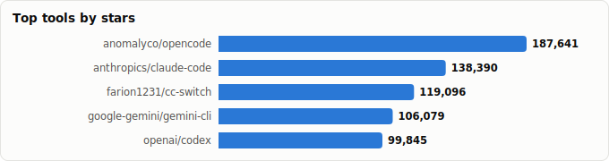
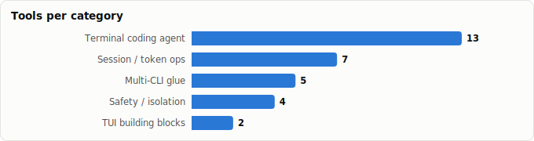

# Terminal AI Coding Agents (TUIs) — Best Picks, Advantages & Disadvantages

> Derived from **kaiser-data**'s 1,350 starred repos (snapshot `2026-07-20T08:33:57.852Z`), cross-referenced with the repo-similarity graph (1,350 nodes / 4,379 edges, 28 communities). Pros/cons and task rankings are additionally backed by external evidence (Terminal-Bench 2.1, 2026 head-to-head comparisons) — see Methodology.
>
> Generated 2026-07-22 by `scripts/reports/ai_coding_tuis.py` (regenerate any time — no API cost).

## Executive summary

- **31 terminal-AI-coding tools** in your stars (**1,172,269★** combined), split into the agents themselves and the terminal ecosystem around them:
  - **Terminal coding agent** (13): `opencode`, `claude-code`, `gemini-cli`, `codex`, `pi`, `oh-my-openagent`, `goose`, `aider`, `crush`, `qwen-code`, `copilot-cli`, `codebuff`, `tig`
  - **Session / token ops** (7): `rtk`, `context-mode`, `codeburn`, `ctx`, `claude-auto-resume`, `ClaudeNightsWatch`, `rudel`
  - **Safety / isolation** (4): `container-use`, `tirith`, `cc-safety-net`, `agentshield`
  - **Multi-CLI glue** (5): `cc-switch`, `free-claude-code`, `zcf`, `langchain-code`, `terminal-jarvis`
  - **TUI building blocks** (2): `bubbletea`, `bubbles`
- **Short answer to 'which TUI is best':** `claude-code` for reasoning depth and the richest extension ecosystem, `codex` for the highest benchmark ceiling, `opencode` if you want open source and model freedom. `aider` remains the best *pair programmer* (as opposed to autonomous agent); `goose` the best MCP-native generalist; `crush` the best-looking.
- **The harness matters more than the model**: the same GPT-5.5 scores 83.4% on Terminal-Bench 2.1 inside Codex CLI but 76.4% inside a generic harness — a 7-point gap that is pure agent-loop engineering.
- **Platform risk is real**: Gemini CLI was deprecated for a closed-source replacement in June 2026 with the free tier cut ~50×, and qwen-code's OAuth free tier ended in April — open-source-ness and provider neutrality (`opencode`, `goose`) are hedges, not ideology.

## The terminal-agent stack at a glance

| Layer | What it does | Tools in your stars |
|---|---|---|
| **The agent (TUI)** | Plan, edit, run, iterate in your terminal | `claude-code`, `opencode`, `gemini-cli`, `codex`, `goose`, `aider`, `crush`, `qwen-code`, `copilot-cli`, `pi`, `oh-my-openagent`, `codebuff` |
| **Token / session ops** | Cut cost, track spend, recall history | `rtk`, `context-mode`, `codeburn`, `ctx`, `rudel`, `claude-auto-resume`, `ClaudeNightsWatch` |
| **Safety** | Guard the shell the agent drives | `tirith`, `cc-safety-net`, `container-use`, `agentshield` |
| **Glue / launchers** | Switch, combine, and provision the CLIs | `cc-switch`, `free-claude-code`, `zcf`, `terminal-jarvis`, `langchain-code` |
| **Build-your-own** | Frameworks the TUIs are made of | `bubbletea`, `bubbles`, `pi` |

## Master comparison

Sorted by stars. `Health`/`Lifecycle` are the dataset's computed metrics; `Activity` is derived from days-since-push + 90-day commits.

| Tool | Category | Lang | License | ★ Stars | Lifecycle | Health | Activity | Last push | Age | Contrib(90d) |
|---|---|---|---|---|---|---|---|---|---|---|
| [anomalyco/opencode](https://github.com/anomalyco/opencode) | Terminal coding agent | TypeScript | MIT | 187,641 (▲139) | Hot | 83 | very active | 0d ago | 1.2y | 17 |
| [anthropics/claude-code](https://github.com/anthropics/claude-code) | Terminal coding agent | Python | — | 138,390 (▲60) | Hot | 77 | very active | 0d ago | 1.4y | 9 |
| [farion1231/cc-switch](https://github.com/farion1231/cc-switch) | Multi-CLI glue | Rust | MIT | 119,096 (▲158) | Hot | 76 | very active | 1d ago | 11mo | 25 |
| [google-gemini/gemini-cli](https://github.com/google-gemini/gemini-cli) | Terminal coding agent | TypeScript | Apache-2.0 | 106,079 (▲6) | Hot | 99 | very active | 0d ago | 1.3y | 29 |
| [openai/codex](https://github.com/openai/codex) | Terminal coding agent | Rust | Apache-2.0 | 99,845 (▲173) | Hot | 90 | very active | 0d ago | 1.3y | 35 |
| [earendil-works/pi](https://github.com/earendil-works/pi) | Terminal coding agent | TypeScript | MIT | 72,998 (▲250) | Hot | 85 | very active | 0d ago | 11mo | 13 |
| [rtk-ai/rtk](https://github.com/rtk-ai/rtk) | Session / token ops | Rust | Apache-2.0 | 71,938 (▲71) | Hot | 78 | very active | 1d ago | 5mo | 12 |
| [code-yeongyu/oh-my-openagent](https://github.com/code-yeongyu/oh-my-openagent) | Terminal coding agent | TypeScript | NOASSERTION | 66,217 (▲44) | Hot | 78 | very active | 0d ago | 7mo | 5 |
| [aaif-goose/goose](https://github.com/aaif-goose/goose) | Terminal coding agent | Rust | Apache-2.0 | 51,313 (▲18) | Hot | 99 | very active | 0d ago | 1.9y | 42 |
| [Aider-AI/aider](https://github.com/Aider-AI/aider) | Terminal coding agent | Python | Apache-2.0 | 47,529 (▲15) | Classic | 49 | active | 1mo ago | 3.2y | 3 |
| [charmbracelet/bubbletea](https://github.com/charmbracelet/bubbletea) | TUI building blocks | Go | MIT | 43,841 (▲8) | Mature | 64 | active | 7d ago | 6.5y | 3 |
| [Alishahryar1/free-claude-code](https://github.com/Alishahryar1/free-claude-code) | Multi-CLI glue | Python | MIT | 41,067 (▲147) | Hot | 61 | very active | 0d ago | 5mo | 8 |
| [charmbracelet/crush](https://github.com/charmbracelet/crush) | Terminal coding agent | Go | NOASSERTION | 26,659 (▲22) | Hot | 77 | very active | 0d ago | 1.2y | 12 |
| [QwenLM/qwen-code](https://github.com/QwenLM/qwen-code) | Terminal coding agent | TypeScript | Apache-2.0 | 26,140 (▲21) | Hot | 88 | very active | 0d ago | 1.1y | 21 |
| [mksglu/context-mode](https://github.com/mksglu/context-mode) | Session / token ops | TypeScript | NOASSERTION | 19,110 (▲16) | Hot | 79 | very active | 0d ago | 4mo | 5 |
| [github/copilot-cli](https://github.com/github/copilot-cli) | Terminal coding agent | Shell | NOASSERTION | 10,987 (▲2) | Mature | 68 | very active | 3d ago | 3.5y | 1 |
| [getagentseal/codeburn](https://github.com/getagentseal/codeburn) | Session / token ops | TypeScript | MIT | 8,766 (▲10) | Hot | 79 | very active | 0d ago | 3mo | 5 |
| [charmbracelet/bubbles](https://github.com/charmbracelet/bubbles) | TUI building blocks | Go | MIT | 8,689 (▲2) | Mature | 58 | active | 8d ago | 6.5y | 3 |
| [CodebuffAI/codebuff](https://github.com/CodebuffAI/codebuff) | Terminal coding agent | TypeScript | Apache-2.0 | 7,825 (▲9) | Mature | 74 | very active | 0d ago | 2.0y | 1 |
| [UfoMiao/zcf](https://github.com/UfoMiao/zcf) | Multi-CLI glue | TypeScript | MIT | 6,080 | Hot | 71 | very active | 0d ago | 11mo | 5 |
| [dagger/container-use](https://github.com/dagger/container-use) | Safety / isolation | Go | Apache-2.0 | 3,914 | Declining | 44 | active | 1mo ago | 1.2y | 1 |
| [sheeki03/tirith](https://github.com/sheeki03/tirith) | Safety / isolation | Rust | AGPL-3.0 | 2,608 | Rising | 80 | very active | 0d ago | 5mo | 2 |
| [kenryu42/cc-safety-net](https://github.com/kenryu42/cc-safety-net) | Safety / isolation | TypeScript | MIT | 1,452 | Hot | 77 | very active | 20d ago | 6mo | 3 |
| [affaan-m/agentshield](https://github.com/affaan-m/agentshield) | Safety / isolation | TypeScript | MIT | 999 (▲1) | Hot | 65 | very active | 27d ago | 5mo | 4 |
| [ctxrs/ctx](https://github.com/ctxrs/ctx) | Session / token ops | Rust | Apache-2.0 | 907 (▲1) | Hot | 78 | very active | 2d ago | 4mo | 3 |
| [terryso/claude-auto-resume](https://github.com/terryso/claude-auto-resume) | Session / token ops | Shell | MIT | 797 | Declining | 36 | slowing | 2mo ago | 1.0y | 2 |
| [zamalali/langchain-code](https://github.com/zamalali/langchain-code) | Multi-CLI glue | Python | Apache-2.0 | 440 | Declining | 13 | stale | 8mo ago | 11mo | 0 |
| [aniketkarne/ClaudeNightsWatch](https://github.com/aniketkarne/ClaudeNightsWatch) | Session / token ops | Shell | MIT | 368 | Declining | 21 | stale | 6mo ago | 1.0y | 0 |
| [evrendom/rudel](https://github.com/evrendom/rudel) | Session / token ops | TypeScript | MIT | 288 | Hot | 68 | slowing | 2mo ago | 5mo | 5 |
| [rsrohan99/tig](https://github.com/rsrohan99/tig) | Terminal coding agent | Python | — | 153 | Abandoned | 5 | stale | 1.2y ago | 1.2y | 0 |
| [BA-CalderonMorales/terminal-jarvis](https://github.com/BA-CalderonMorales/terminal-jarvis) | Multi-CLI glue | Rust | MIT | 133 | Rising | 79 | very active | 1d ago | 11mo | 2 |

## Advantages & disadvantages — agent by agent

The core comparison. Sourced from 2026 head-to-head reviews, Terminal-Bench results, and this dataset's health/lifecycle metrics (sources in Methodology).

| Agent | ★ Stars | Advantages | Disadvantages |
|---|---|---|---|
| **[claude-code](https://github.com/anthropics/claude-code)** | 138,390 | Best-in-class multi-file refactoring and reasoning depth (SWE-bench Pro 69.2%); asks clarifying questions; subagents/hooks/skills/MCP ecosystem is the deepest; 83.1% Terminal-Bench 2.1 with Fable 5 | Not open source (no OSS license in repo); Anthropic-models only; subscription/usage costs add up on heavy agentic use |
| **[opencode](https://github.com/anomalyco/opencode)** | 187,641 | Most-starred OSS agent, MIT license; provider-neutral — 75+ endpoints incl. Bedrock, OpenRouter, local Ollama; strong TUI; no vendor lock-in | Bring-your-own-model means quality varies with the model you pick; harness benchmark scores trail the vendor-tuned agents |
| **[codex](https://github.com/openai/codex)** | 99,845 | #1 named CLI agent on Terminal-Bench 2.1 (83.4% w/ GPT-5.5); fast single-binary Rust TUI; excels at intent-driven, pattern-following edits | OpenAI-models only; less transparent reasoning than Claude Code on big refactors; ecosystem (hooks/plugins) thinner |
| **[gemini-cli](https://github.com/google-gemini/gemini-cli)** | 106,079 | 1M-token context — holds a monorepo in one window; Apache-2.0; was the best free tier in the field | Deprecated June 2026: replaced by closed-source Antigravity CLI (agy), free tier cut from ~1,000 to ~20 requests/day — adopt with exit plan |
| **[goose](https://github.com/aaif-goose/goose)** | 51,313 | MCP-first and extensible beyond coding (install/execute/test); any-LLM incl. local; Block-backed, health 99 in this snapshot | Less specialized for pure code-editing loops; leaderboard results modest — team optimizes for failure-pattern fixes, not benchmark rank |
| **[aider](https://github.com/Aider-AI/aider)** | 47,529 | Best git discipline (clean auto-commits); precise file-scoped edits; provider-resilient; the safest 'pair programmer' rather than autonomous agent | Not autonomous — no system-wide orchestration; no MCP support; momentum slowing (52d since push, health 50 in snapshot) |
| **[crush](https://github.com/charmbracelet/crush)** | 26,659 | The most polished TUI aesthetics in the field; multi-model; Charm's Bubble Tea expertise shows in UX | Youngest of the majors — no public benchmark record; non-standard license; smaller ecosystem |
| **[qwen-code](https://github.com/QwenLM/qwen-code)** | 26,140 | Competitive Qwen3-Coder models; best-in-class on Chinese-language briefs and Alibaba-cloud ecosystem; Apache-2.0 | OAuth free tier discontinued 2026-04 — headline value now requires paid API; less strong outside the Qwen model family |
| **[copilot-cli](https://github.com/github/copilot-cli)** | 10,987 | Copilot agent with native GitHub integration (issues, PRs, Actions); familiar billing for Copilot shops | Premium-request pricing — one debugging session can eat a week's free allocation; value collapses off-GitHub (GitLab/Bitbucket) |
| **[pi](https://github.com/earendil-works/pi)** | 72,998 | Minimal, hackable toolkit (API + agent loop + TUI + CLI) — ideal base for building your own agent; MIT | A toolkit, not a turnkey product — you assemble the workflow yourself; smaller community than the big four |
| **[oh-my-openagent](https://github.com/code-yeongyu/oh-my-openagent)** | 66,217 | Token-efficiency-first harness (the 'tokenmaxxer' pick) layered on Codex/OpenCode for complex codebases | Depends on underlying agents; opinionated workflow; no OSS license declared |
| **[codebuff](https://github.com/CodebuffAI/codebuff)** | 7,825 | Simple terminal codegen with low setup friction; Apache-2.0 | Far smaller scope and community than the majors; fewer agentic features (no deep hooks/MCP story) |
| **[tig](https://github.com/rsrohan99/tig)** | 153 | Historic multi-LLM flexibility (Gemini, Groq, Deepseek) before the majors had it | Abandoned (437d since push, health 5) — do not adopt; kept here to show the category's churn |

## Task rankings — which TUI for which job

| Task | 🥇 First pick | 🥈 Second | 🥉 Third | Evidence / note |
|---|---|---|---|---|
| **Complex multi-file refactors in a large repo** | `claude-code` — reasoning depth + style consistency | `codex` — pattern-faithful edits, benchmark leader | `opencode` — same job, any model, MIT | Claude Code leads SWE-bench Pro (69.2%); Codex CLI leads Terminal-Bench 2.1 (83.4%). |
| **Best raw agentic benchmark ceiling** | `codex` — 83.4% Terminal-Bench 2.1 (GPT-5.5) | `claude-code` — 83.1% with Fable 5; 78.9% with Opus 4.8 | `goose` — solid but optimizes failure patterns over rank | Terminal-Bench 2.1 public leaderboard, June 2026 snapshot. |
| **Model freedom / local LLMs (no vendor lock-in)** | `opencode` — 75+ endpoints incl. Ollama | `goose` — any LLM, MCP-first | `crush` — multi-model with the nicest TUI | opencode is the most-starred OSS agent and the de-facto neutral choice. |
| **Monorepo-scale context in one window** | `gemini-cli` — 1M-token context — but see deprecation caveat | `claude-code` — subagents fan out instead of one big window | `opencode` — pair with a long-context model of your choice | Gemini's 1M context is unmatched, but the OSS CLI was frozen June 2026 (Antigravity). |
| **Careful pair-programming with git discipline** | `aider` — clean scoped diffs, auto-commits | `claude-code` — plan mode + hooks for guarded edits | `codex` — tight, reviewable single-file changes | Aider remains the reference for git-native, human-in-the-loop editing. |
| **Token- and cost-conscious agentic coding** | `oh-my-openagent` — built for tokenmaxxers | `opencode` — route to cheap/local models; add rtk proxy | `qwen-code` — cheap capable models — free tier gone though | Pair any pick with `rtk` (60–90% token cut) and `codeburn` (cost tracking). |
| **GitHub-centric team workflows** | `copilot-cli` — native issues/PR/Actions integration | `claude-code` — gh CLI + hooks cover most of it | `codex` — cloud-task handoff to the Codex platform | Copilot CLI's value is the GitHub integration; it collapses off-platform. |
| **Building your own agent / custom TUI** | `pi` — toolkit: LLM API + loop + TUI ready-made | `bubbletea` — the TUI framework everything's built on | `opencode` — fork-friendly MIT reference implementation | pi gives the agent loop; Bubble Tea gives the terminal UI substrate. |

## By category

### Terminal coding agent

_The TUIs themselves — full agentic loops (plan → edit → run → iterate) living in your terminal. Differ in model access, autonomy level, ecosystem depth, and openness._

- **[anomalyco/opencode](https://github.com/anomalyco/opencode)** · 187,641★ · TypeScript · Hot  
  The most-starred open-source coding agent — provider-neutral (75+ LLM endpoints incl. local), MIT.  
  topics: —
- **[anthropics/claude-code](https://github.com/anthropics/claude-code)** · 138,390★ · Python · Hot  
  Anthropic's agentic coding TUI — deep codebase understanding, subagents, hooks, skills, MCP.  
  topics: —
- **[google-gemini/gemini-cli](https://github.com/google-gemini/gemini-cli)** · 106,079★ · TypeScript · Hot  
  Gemini in the terminal with a 1M-token context window — but deprecated June 2026 in favor of closed-source Antigravity CLI.  
  topics: gemini, gemini-api, ai, ai-agents, cli, mcp-client, mcp-server
- **[openai/codex](https://github.com/openai/codex)** · 99,845★ · Rust · Hot  
  OpenAI's lightweight Rust terminal agent — tops Terminal-Bench 2.1 among named CLI agents (83.4% with GPT-5.5).  
  topics: —
- **[earendil-works/pi](https://github.com/earendil-works/pi)** · 72,998★ · TypeScript · Hot  
  Minimal AI toolkit: unified LLM API + agent loop + TUI + coding CLI — the hackable build-your-own base.  
  topics: —
- **[code-yeongyu/oh-my-openagent](https://github.com/code-yeongyu/oh-my-openagent)** · 66,217★ · TypeScript · Hot  
  omo/lazycodex — token-obsessed harness layered on Codex/OpenCode for complex codebases.  
  topics: opencode, ai, anthropic, claude, claude-skills, cursor, gemini, ide
- **[aaif-goose/goose](https://github.com/aaif-goose/goose)** · 51,313★ · Rust · Hot  
  Block's extensible on-machine agent — MCP-first, goes beyond code (install, execute, test) with any LLM.  
  topics: mcp, acp, ai, ai-agents
- **[Aider-AI/aider](https://github.com/Aider-AI/aider)** · 47,529★ · Python · Classic  
  The original AI pair programmer in the terminal — git-native, focused file-level edits, not an autonomous agent.  
  topics: chatgpt, cli, command-line, gpt-4, openai, gpt-3, gpt-35-turbo, claude-3
- **[charmbracelet/crush](https://github.com/charmbracelet/crush)** · 26,659★ · Go · Hot  
  Charm's glamorous multi-model coding agent — the best-looking TUI in the field (Bubble Tea pedigree).  
  topics: agentic-ai, ai, llms, ravishing
- **[QwenLM/qwen-code](https://github.com/QwenLM/qwen-code)** · 26,140★ · TypeScript · Hot  
  Qwen team's terminal agent — strong with Qwen3-Coder and Chinese-language briefs; OAuth free tier ended 2026-04.  
  topics: —
- **[github/copilot-cli](https://github.com/github/copilot-cli)** · 10,987★ · Shell · Mature  
  Copilot coding agent in the terminal — deep GitHub integration, premium-request pricing model.  
  topics: —
- **[CodebuffAI/codebuff](https://github.com/CodebuffAI/codebuff)** · 7,825★ · TypeScript · Mature  
  Codegen from the terminal — smaller, focused alternative.  
  topics: —
- **[rsrohan99/tig](https://github.com/rsrohan99/tig)** · 153★ · Python · Abandoned  
  Multi-LLM Claude-Code-alike — abandoned; listed as a cautionary tale of the category's churn.  
  topics: —

### Session / token ops

_The cost layer: agentic coding burns tokens, and these tools cut, track, and recycle them across sessions._

- **[rtk-ai/rtk](https://github.com/rtk-ai/rtk)** · 71,938★ · Rust · Hot  
  CLI proxy that cuts LLM token use 60–90% on common dev commands — single Rust binary.  
  topics: agentic-coding, ai-coding, anthropic, claude-code, cli, command-line-tool, cost-reduction, developer-tools
- **[mksglu/context-mode](https://github.com/mksglu/context-mode)** · 19,110★ · TypeScript · Hot  
  Context-window optimizer for coding agents — sandboxes tool output (~98% reduction), persists session memory.  
  topics: claude, claude-code, claude-code-plugins, mcp, skills, codex, copilot, opencode
- **[getagentseal/codeburn](https://github.com/getagentseal/codeburn)** · 8,766★ · TypeScript · Hot  
  Local token/cost tracker across 31 coding tools and agents, by model, project, and tool.  
  topics: ai-coding, claude-code, cli, codex, cost-tracking, developer-tools, observability, terminal-ui
- **[ctxrs/ctx](https://github.com/ctxrs/ctx)** · 907★ · Rust · Hot  
  Search the coding-agent history already on your machine — cross-agent transcript recall.  
  topics: agents, ai, claude, codex, coding-agents, cursor, developer-tools, rust
- **[terryso/claude-auto-resume](https://github.com/terryso/claude-auto-resume)** · 797★ · Shell · Declining  
  Shell utility that resumes Claude CLI tasks when usage limits lift.  
  topics: auto-resume, claude, claude-ai, claude-code, shell-script
- **[aniketkarne/ClaudeNightsWatch](https://github.com/aniketkarne/ClaudeNightsWatch)** · 368★ · Shell · Declining  
  Autonomous task runner that watches Claude usage windows and executes queued tasks.  
  topics: —
- **[evrendom/rudel](https://github.com/evrendom/rudel)** · 288★ · TypeScript · Hot  
  Claude Code & Codex session analytics.  
  topics: —

### Safety / isolation

_An agent driving your shell is a security surface — these guard commands, sandbox environments, and audit configurations._

- **[dagger/container-use](https://github.com/dagger/container-use)** · 3,914★ · Go · Declining  
  Containerized dev environments so multiple agents work safely and independently.  
  topics: —
- **[sheeki03/tirith](https://github.com/sheeki03/tirith)** · 2,608★ · Rust · Rising  
  Terminal security for devs and agents — intercepts homograph URLs, pipe-to-shell, ANSI injection, exfiltration.  
  topics: cli, devtools, homograph-attack, rust, security, shell, supply-chain-security, terminal
- **[kenryu42/cc-safety-net](https://github.com/kenryu42/cc-safety-net)** · 1,452★ · TypeScript · Hot  
  Hook that catches destructive git/filesystem commands before they execute (Codex, Claude Code, more).  
  topics: claude, claude-code, claude-code-plugin, security, destructive-commands, codex, pi-extension, kimi-code
- **[affaan-m/agentshield](https://github.com/affaan-m/agentshield)** · 999★ · TypeScript · Hot  
  Scanner for agent configs, MCP servers, and tool permissions — CLI and CI modes.  
  topics: ai-agent, anthropic, claude-code, hackathon, mcp, opus, security

### Multi-CLI glue

_Most people end up running several agents; these switch between, combine, and provision them._

- **[farion1231/cc-switch](https://github.com/farion1231/cc-switch)** · 119,096★ · Rust · Hot  
  All-in-one switcher for Claude Code, Codex, OpenCode, OpenClaw, Gemini CLI & Hermes Agent.  
  topics: ai-tools, claude-code, desktop-app, open-source, rust, tauri, typescript, codex
- **[Alishahryar1/free-claude-code](https://github.com/Alishahryar1/free-claude-code)** · 41,067★ · Python · Hot  
  Run claude code, codex or pi free in terminal/VSCode/discord — proxy-style access layer.  
  topics: —
- **[UfoMiao/zcf](https://github.com/UfoMiao/zcf)** · 6,080★ · TypeScript · Hot  
  Zero-Config Code Flow — one-command setup for Claude Code & Codex.  
  topics: ai, ccr, claude, claude-ai, claude-code, cli, nodejs, typescript
- **[zamalali/langchain-code](https://github.com/zamalali/langchain-code)** · 440★ · Python · Declining  
  LangCode — combines gemini-cli and claude-code capabilities under one CLI; now declining.  
  topics: —
- **[BA-CalderonMorales/terminal-jarvis](https://github.com/BA-CalderonMorales/terminal-jarvis)** · 133★ · Rust · Rising  
  A 'shovel' to install and try every terminal coding tool from one place.  
  topics: claude-code, cli, gemini-cli, opencode, terminal, qwen-code, rust, typescript

### TUI building blocks

_The frameworks the agents' interfaces are built from — relevant if you build rather than buy._

- **[charmbracelet/bubbletea](https://github.com/charmbracelet/bubbletea)** · 43,841★ · Go · Mature  
  The Go TUI framework — the substrate under crush and much of the modern terminal-app wave.  
  topics: cli, framework, elm-architecture, tui, functional, golang, go, hacktoberfest
- **[charmbracelet/bubbles](https://github.com/charmbracelet/bubbles)** · 8,689★ · Go · Mature  
  Ready-made TUI components for Bubble Tea.  
  topics: elm-architecture, tui, terminal, cli, hacktoberfest

## Spotlight: the harness matters more than the model

The June 2026 Terminal-Bench 2.1 snapshot makes one thing unambiguous — the agent loop wrapping the model is worth real percentage points:

- Same GPT-5.5 model: **83.4%** inside Codex CLI vs **76.4%** inside the generic Terminus 2 harness — a 7-point gap that is pure harness engineering.
- Claude Code posts **83.1%** with Fable 5 and **78.9%** with Opus 4.8 — the model swap moves it more than most competitor-harness swaps do.
- Consequence for choosing: pick the *harness* whose ecosystem you can invest in (hooks, skills, MCP servers, safety nets), because vendor-tuned harness+model pairs beat mix-and-match on agentic work — while `opencode`/`goose` hedge the platform risk the Gemini CLI deprecation just demonstrated.

## Graph analysis — how they relate

**Community clustering.** These 31 tools span **12 of the graph's 28 communities**.

- **Community 2** (9): `github/copilot-cli`, `earendil-works/pi`, `code-yeongyu/oh-my-openagent`, `CodebuffAI/codebuff`, `mksglu/context-mode`, `evrendom/rudel`, `sheeki03/tirith`, `kenryu42/cc-safety-net`, `UfoMiao/zcf`
- **Community 14** (6): `charmbracelet/crush`, `affaan-m/agentshield`, `Alishahryar1/free-claude-code`, `zamalali/langchain-code`, `charmbracelet/bubbletea`, `charmbracelet/bubbles`
- **Community 1** (5): `anomalyco/opencode`, `rtk-ai/rtk`, `getagentseal/codeburn`, `ctxrs/ctx`, `terryso/claude-auto-resume`
- **Community 9** (2): `Aider-AI/aider`, `aniketkarne/ClaudeNightsWatch`
- **Community 4** (2): `farion1231/cc-switch`, `BA-CalderonMorales/terminal-jarvis`

**Centrality (PageRank in the full 1,350-repo graph)** — most 'hub-like' terminal-coding tools in your ecosystem:

- `CodebuffAI/codebuff` — PageRank 0.0057
- `github/copilot-cli` — PageRank 0.0056
- `charmbracelet/bubbles` — PageRank 0.0018
- `sheeki03/tirith` — PageRank 0.0014
- `code-yeongyu/oh-my-openagent` — PageRank 0.0014
- `kenryu42/cc-safety-net` — PageRank 0.0014
- `mksglu/context-mode` — PageRank 0.0013
- `charmbracelet/bubbletea` — PageRank 0.0011
- `affaan-m/agentshield` — PageRank 0.0010
- `UfoMiao/zcf` — PageRank 0.0009

**Direct links between these tools** (top similarity edges where both endpoints are in this report):

- `github/copilot-cli` ⇄ `CodebuffAI/codebuff` (w=2.000) — authors: github-actions[bot]
- `charmbracelet/bubbles` ⇄ `charmbracelet/bubbletea` (w=1.994) — topics: elm-architecture, tui, cli, hacktoberfest; authors: meowgorithm, andreynering
- `sheeki03/tirith` ⇄ `github/copilot-cli` (w=1.000) — authors: github-actions[bot]
- `sheeki03/tirith` ⇄ `CodebuffAI/codebuff` (w=1.000) — authors: github-actions[bot]
- `charmbracelet/bubbles` ⇄ `charmbracelet/crush` (w=0.858) — authors: meowgorithm, andreynering
- `charmbracelet/bubbletea` ⇄ `charmbracelet/crush` (w=0.858) — authors: meowgorithm, andreynering
- `kenryu42/cc-safety-net` ⇄ `CodebuffAI/codebuff` (w=0.717) — authors: github-actions[bot]
- `kenryu42/cc-safety-net` ⇄ `github/copilot-cli` (w=0.667) — authors: github-actions[bot]
- `mksglu/context-mode` ⇄ `kenryu42/cc-safety-net` (w=0.456) — topics: claude, claude-code, codex; authors: github-actions[bot]
- `evrendom/rudel` ⇄ `CodebuffAI/codebuff` (w=0.450) — authors: github-actions[bot]
- `mksglu/context-mode` ⇄ `CodebuffAI/codebuff` (w=0.450) — authors: github-actions[bot]
- `code-yeongyu/oh-my-openagent` ⇄ `CodebuffAI/codebuff` (w=0.450) — authors: github-actions[bot]
- `evrendom/rudel` ⇄ `github/copilot-cli` (w=0.400) — authors: github-actions[bot]
- `earendil-works/pi` ⇄ `CodebuffAI/codebuff` (w=0.204) — authors: github-actions[bot]
- `farion1231/cc-switch` ⇄ `BA-CalderonMorales/terminal-jarvis` (w=0.193) — topics: claude-code, rust, typescript, codex
- …and 2 more.

## Maintenance & risk signal

Bus factor = commit concentration (1 = single-maintainer risk). Pair with lifecycle + activity before adopting.

| Tool | Health | Lifecycle | Activity | Bus factor | Top-author share | Releases |
|---|---|---|---|---|---|---|
| google-gemini/gemini-cli | 99 | Hot | very active | 5 | 18% | 551 |
| aaif-goose/goose | 99 | Hot | very active | 7 | 12% | 143 |
| openai/codex | 90 | Hot | very active | 4 | 21% | 929 |
| QwenLM/qwen-code | 88 | Hot | very active | 3 | 36% | 546 |
| earendil-works/pi | 85 | Hot | very active | 2 | 40% | 247 |
| anomalyco/opencode | 83 | Hot | very active | 2 | 40% | 841 |
| sheeki03/tirith | 80 | Rising | very active | 1 | 64% | 86 |
| mksglu/context-mode | 79 | Hot | very active | 1 | 50% | 195 |
| getagentseal/codeburn | 79 | Hot | very active | 1 | 80% | 45 |
| BA-CalderonMorales/terminal-jarvis | 79 | Rising | very active | 1 | 58% | 46 |
| code-yeongyu/oh-my-openagent | 78 | Hot | very active | 1 | 93% | 221 |
| rtk-ai/rtk | 78 | Hot | very active | 2 | 35% | 244 |
| ctxrs/ctx | 78 | Hot | very active | 1 | 91% | 23 |
| anthropics/claude-code | 77 | Hot | very active | 1 | 84% | 172 |
| charmbracelet/crush | 77 | Hot | very active | 1 | 52% | 175 |
| kenryu42/cc-safety-net | 77 | Hot | very active | 1 | 92% | 24 |
| farion1231/cc-switch | 76 | Hot | very active | 1 | 70% | 46 |
| CodebuffAI/codebuff | 74 | Mature | very active | 1 | 100% | 9 |
| UfoMiao/zcf | 71 | Hot | very active | 1 | 65% | 94 |
| github/copilot-cli | 68 | Mature | very active | 1 | 100% | 355 |
| evrendom/rudel | 68 | Hot | slowing | 1 | 75% | 6 |
| affaan-m/agentshield | 65 | Hot | very active | 1 | 95% | 4 |
| charmbracelet/bubbletea | 64 | Mature | active | 1 | 78% | 79 |
| Alishahryar1/free-claude-code | 61 | Hot | very active | 1 | 89% | 0 |
| charmbracelet/bubbles | 58 | Mature | active | 1 | 71% | 36 |
| Aider-AI/aider | 49 | Classic | active | 1 | 82% | 93 |
| dagger/container-use | 44 | Declining | active | 1 | 100% | 14 |
| terryso/claude-auto-resume | 36 | Declining | slowing | 1 | 50% | 0 |
| aniketkarne/ClaudeNightsWatch | 21 | Declining | stale | 0 | 0% | 0 |
| zamalali/langchain-code | 13 | Declining | stale | 0 | 0% | 0 |
| rsrohan99/tig | 5 | Abandoned | stale | 0 | 0% | 0 |

Watch items: `gemini-cli` is deprecated upstream (Antigravity CLI replaced it, June 2026) despite healthy-looking repo metrics; `aider` is slowing (52d since push in this snapshot); `tig` and `langchain-code` are effectively dead; `claude-auto-resume` and `ClaudeNightsWatch` are declining single-maintainer shell utilities.

## Adjacent (deliberately not listed as terminal coding agents)

- **cline/cline** (64,821★) — primarily an IDE extension (CLI mode is secondary) — not a TUI-first agent
- **continuedev/continue** (34,981★) — same: IDE-first open-source coding agent
- **OpenHands/OpenHands** (81,363★) — AI-dev *platform* (web/headless), not a terminal UI
- **langchain-ai/open-swe** (10,358★) — asynchronous *cloud* coding agent — no terminal in the loop
- **NousResearch/hermes-agent** (217,444★) — covered in the *hermes-vs-openclaw* and *agent-harnesses* reports
- **affaan-m/ECC** (231,351★) — harness/config framework on top of coding TUIs — see *claude-code-setups*
- **SuperClaude-Org/SuperClaude_Framework** (23,578★) — config framework — see *claude-code-setups* (retired upstream 2026-07)
- **BloopAI/vibe-kanban** (27,455★) — GUI orchestrator *over* coding agents, not a TUI
- **iOfficeAI/AionUi** (30,489★) — GUI wrapper over the CLIs, not a TUI
- **winfunc/opcode** (22,189★) — GUI toolkit for Claude Code
- **jesseduffield/lazygit** (80,536★) — beloved git TUI, but no AI

## Methodology & caveats

- **Source**: `data/classified.json` + `public/data/graph.json` for all repo metrics and graph structure. No API calls at generation time; fully reproducible.
- **Selection**: keyword scan (terminal / tui / cli / coding agent / pair programming) + manual curation. IDE-first agents, GUI wrappers, cloud agents, and config frameworks were routed to adjacent reports (see above).
- **Pros/cons & task rankings** cite external evidence gathered 2026-07: the [Terminal-Bench](https://www.tbench.ai/) 2.1 public leaderboard (June 2026 snapshot: Codex CLI 83.4% w/ GPT-5.5, Claude Code 83.1% w/ Fable 5 / 78.9% w/ Opus 4.8; same GPT-5.5 at 76.4% in the Terminus 2 harness), 2026 head-to-head comparisons ([tembo.io](https://www.tembo.io/blog/coding-cli-tools-comparison), [morphllm.com](https://www.morphllm.com/ai-coding-agent), [kilo.ai](https://kilo.ai/articles/best-cli-coding-agents)), and vendor announcements (Gemini CLI → Antigravity deprecation, qwen-code free-tier retirement). Benchmark numbers are point-in-time — treat rankings as defaults, not verdicts.
- **Metrics** (health, lifecycle, bus_factor) are precomputed at snapshot time and may lag GitHub's current state.
- Re-run after a fresh `classified.json` to refresh stars/activity; frozen benchmark citations need manual review as new models/agents ship.

Tools covered: 31 · Snapshot: 2026-07-20T08:33:57.852Z
