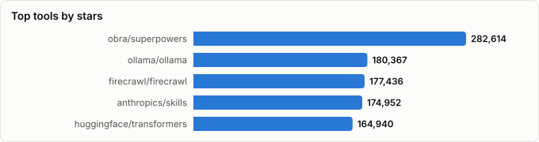

# The AI Engineer's Stack — What's Fundamental, Must-Have, and Trending

> Derived from **kaiser-data**'s 2,211 starred repos (snapshot `2026-09-21T11:17:33.969Z`), cross-referenced with the repo-similarity graph (2,211 nodes / 7,301 edges, 35 communities) and the 2026 AI-engineering landscape.
>
> Generated 2026-09-21 by `scripts/reports/ai_engineer_stack.py` (regenerate any time — no API cost).

## The one thing to understand first

In 2026 the **model layer is commoditizing** — model differences matter less each quarter, and the infrastructure beneath your app (serving, vector search, basic RAG, tracing) is **largely solved**. The value has moved *up the stack*: to **reliability, evaluation, context engineering, and memory** for agentic systems. So this report does two jobs at once — it tells you **which repos to know** (Fundamental / Must-have / Trending) *and* **which problems are already solved** (integrate, don't rebuild) **vs. still frontier** (where you actually add value).

> **Rule of thumb:** if a capability is ✅ *Solved* below, your job is to *integrate the best repo well*. If it's 🔴 *Frontier*, that's where a portfolio project or a job actually gets you noticed.

## The three tiers

### Fundamental (13)

**Bedrock you must understand.** Long-lived base libraries and learning resources. Tools change; these don't. If you can't explain these, you're assembling black boxes.

- **[huggingface/transformers](https://github.com/huggingface/transformers)** · 166,455★ · _Base & training_  
  The model-definition framework — the de-facto way to load/run almost any open model. Know it cold.
- **[ggml-org/llama.cpp](https://github.com/ggml-org/llama.cpp)** · 129,028★ · _Inference & serving_  
  Inference in C/C++ — the primitive behind on-device/edge LLMs; teaches you what quantization actually costs.
- **[microsoft/generative-ai-for-beginners](https://github.com/microsoft/generative-ai-for-beginners)** · 120,172★ · _Learning_  
  21-lesson on-ramp to building with generative AI — the gentle starting point.
- **[openai/whisper](https://github.com/openai/whisper)** · 109,424★ · _Voice & multimodal_  
  The reference open ASR model — the baseline for any speech-in pipeline.
- **[rasbt/LLMs-from-scratch](https://github.com/rasbt/LLMs-from-scratch)** · 105,329★ · _Learning_  
  Build a GPT in PyTorch step by step — the single best way to actually understand what you're orchestrating.
- **[mlabonne/llm-course](https://github.com/mlabonne/llm-course)** · 83,057★ · _Learning_  
  Roadmap + notebooks from fundamentals to deployment — the structured curriculum.
- **[dair-ai/Prompt-Engineering-Guide](https://github.com/dair-ai/Prompt-Engineering-Guide)** · 78,521★ · _Learning_  
  The canonical prompt-engineering reference — still load-bearing in an agentic world.
- **[labmlai/annotated_deep_learning_paper_implementations](https://github.com/labmlai/annotated_deep_learning_paper_implementations)** · 67,477★ · _Learning_  
  60+ annotated paper implementations — read the architectures, don't just import them.
- **[deepspeedai/DeepSpeed](https://github.com/deepspeedai/DeepSpeed)** · 43,144★ · _Base & training_  
  Training-optimization library (ZeRO, offload) — how large models actually get trained on real hardware.
- **[facebookresearch/faiss](https://github.com/facebookresearch/faiss)** · 40,948★ · _Vector store_  
  The original similarity-search library — the math under every vector DB; understand it before reaching for one.
- **[Lightning-AI/pytorch-lightning](https://github.com/Lightning-AI/pytorch-lightning)** · 31,355★ · _Base & training_  
  Structured PyTorch training — the bridge between research code and reproducible training runs.
- **[karpathy/llm.c](https://github.com/karpathy/llm.c)** · 31,040★ · _Learning_  
  LLM training in raw C/CUDA — strips away the framework to show the actual compute.
- **[NirDiamant/RAG_Techniques](https://github.com/NirDiamant/RAG_Techniques)** · 29,564★ · _RAG & retrieval_  
  A catalog of advanced RAG techniques with code — the reference when naive RAG isn't enough.

### Must-have (20)

**Your default production toolkit.** The repos you reach for on basically every project — the boring, load-bearing choices. Master integration, not novelty.

- **[firecrawl/firecrawl](https://github.com/firecrawl/firecrawl)** · 182,753★ · _Data & ingestion_  
  Search/scrape/crawl the web into LLM-ready data — the ingestion default for RAG & agents.
- **[ollama/ollama](https://github.com/ollama/ollama)** · 181,358★ · _Inference & serving_  
  One command to run open models locally — the dev-loop and prototyping default.
- **[langchain-ai/langchain](https://github.com/langchain-ai/langchain)** · 146,782★ · _Orchestration & agents_  
  The most-deployed agent/LLM framework — the lingua franca; you'll read code that uses it even if you don't.
- **[vllm-project/vllm](https://github.com/vllm-project/vllm)** · 92,317★ · _Inference & serving_  
  High-throughput serving engine (PagedAttention) — the production answer for self-hosting at scale.
- **[infiniflow/ragflow](https://github.com/infiniflow/ragflow)** · 91,092★ · _RAG & retrieval_  
  Batteries-included RAG engine with deep document understanding — RAG as a deployable product.
- **[unclecode/crawl4ai](https://github.com/unclecode/crawl4ai)** · 84,014★ · _Data & ingestion_  
  LLM-friendly open crawler/scraper — self-hosted ingestion when you don't want an API.
- **[unslothai/unsloth](https://github.com/unslothai/unsloth)** · 76,526★ · _Fine-tuning_  
  2× faster, lower-memory LoRA/QLoRA fine-tuning — the practical fine-tuning default.
- **[hiyouga/LlamaFactory](https://github.com/hiyouga/LlamaFactory)** · 74,952★ · _Fine-tuning_  
  Unified fine-tuning UI/CLI for 100+ models — the no-code-ish path to a tuned model.
- **[BerriAI/litellm](https://github.com/BerriAI/litellm)** · 59,308★ · _Inference & serving_  
  OpenAI-compatible gateway to 100+ LLMs — swap/route/budget models from one endpoint. Non-negotiable glue.
- **[crewAIInc/crewAI](https://github.com/crewAIInc/crewAI)** · 58,850★ · _Orchestration & agents_  
  Role-playing multi-agent orchestration — the popular 'team of agents' framework.
- **[run-llama/llama_index](https://github.com/run-llama/llama_index)** · 52,257★ · _RAG & retrieval_  
  The leading data/RAG framework — connectors, indexing, query engines; the RAG default alongside LangChain.
- **[mudler/LocalAI](https://github.com/mudler/LocalAI)** · 49,203★ · _Inference & serving_  
  OpenAI-compatible local engine (LLM/vision/voice) — self-host the whole API surface.
- **[milvus-io/milvus](https://github.com/milvus-io/milvus)** · 46,189★ · _Vector store_  
  Cloud-native vector DB built for massive scale — when you outgrow a single box.
- **[langchain-ai/langgraph](https://github.com/langchain-ai/langgraph)** · 42,063★ · _Orchestration & agents_  
  Explicit graphs over implicit chains — the 2026 standard for *production-grade* agent control flow.
- **[stanfordnlp/dspy](https://github.com/stanfordnlp/dspy)** · 38,176★ · _Orchestration & agents_  
  Program — don't prompt — LLMs; compile prompts against metrics. The antidote to prompt-spaghetti.
- **[sgl-project/sglang](https://github.com/sgl-project/sglang)** · 36,251★ · _Inference & serving_  
  Fast serving with structured-output + prefix-cache wins — vLLM's main rival; learn both.
- **[langfuse/langfuse](https://github.com/langfuse/langfuse)** · 34,883★ · _Eval & observability_  
  Open-source LLM tracing/evals/prompts — you can't ship what you can't see (you run this).
- **[qdrant/qdrant](https://github.com/qdrant/qdrant)** · 34,726★ · _Vector store_  
  High-performance Rust vector DB — the popular standalone choice; great filtering.
- **[huggingface/smolagents](https://github.com/huggingface/smolagents)** · 29,425★ · _Orchestration & agents_  
  Barebones code-writing agents — the minimal mental model of what an agent loop *is*.
- **[chroma-core/chroma](https://github.com/chroma-core/chroma)** · 29,348★ · _Vector store_  
  The 'just works' embedded vector store — fastest path from zero to a working RAG.

### Trending (23)

**Where the energy is right now (2026).** Fast-moving, high-upside, often unstable. Learn these to stay current and to find differentiated things to build.

- **[obra/superpowers](https://github.com/obra/superpowers)** · 289,511★ · _Coding agents & MCP_  
  The headline agentic-skills framework — the most-starred repo in this whole set.
- **[anthropics/skills](https://github.com/anthropics/skills)** · 177,403★ · _Coding agents & MCP_  
  Agent Skills — on-demand capability that's displacing always-on prompt bloat.
- **[anthropics/claude-code](https://github.com/anthropics/claude-code)** · 147,379★ · _Coding agents & MCP_  
  The agentic coding CLI — the flagship of the coding-agent wave (full ecosystem in the cc-setups report).
- **[github/spec-kit](https://github.com/github/spec-kit)** · 138,139★ · _Coding agents & MCP_  
  Spec-driven development toolkit — the 'write the spec, let the agent build' workflow.
- **[browser-use/browser-use](https://github.com/browser-use/browser-use)** · 115,688★ · _Orchestration & agents_  
  Let agents drive real browsers — the computer-use frontier; high promise, still flaky.
- **[TauricResearch/TradingAgents](https://github.com/TauricResearch/TradingAgents)** · 107,884★ · _Orchestration & agents_  
  Multi-agent trading framework — the template for *vertical* agent systems with real domain logic.
- **[google-gemini/gemini-cli](https://github.com/google-gemini/gemini-cli)** · 107,106★ · _Coding agents & MCP_  
  Gemini's terminal agent — the third major CLI harness; useful for model-shopping.
- **[punkpeye/awesome-mcp-servers](https://github.com/punkpeye/awesome-mcp-servers)** · 95,377★ · _Coding agents & MCP_  
  The community MCP index — discovery for the fastest-growing integration ecosystem.
- **[modelcontextprotocol/servers](https://github.com/modelcontextprotocol/servers)** · 90,519★ · _Coding agents & MCP_  
  Reference MCP servers — MCP is the emerging standard for wiring tools/data into any agent.
- **[OpenHands/OpenHands](https://github.com/OpenHands/OpenHands)** · 88,697★ · _Coding agents & MCP_  
  Open autonomous software-engineering agent — the OSS face of the SWE-agent race.
- **[bytedance/deer-flow](https://github.com/bytedance/deer-flow)** · 82,794★ · _Orchestration & agents_  
  Long-horizon research+code SuperAgent — the 'deep research' pattern as a harness.
- **[mem0ai/mem0](https://github.com/mem0ai/mem0)** · 65,757★ · _Memory_  
  Universal memory layer for agents — the most-adopted bet on the unsolved memory problem.
- **[MemPalace/mempalace](https://github.com/MemPalace/mempalace)** · 59,192★ · _Memory_  
  Best-benchmarked open memory system — a strong contender in a still-open race.
- **[Aider-AI/aider](https://github.com/Aider-AI/aider)** · 49,092★ · _Coding agents & MCP_  
  AI pair-programming in the terminal with tight git integration — a beloved daily driver.
- **[vercel-labs/agent-browser](https://github.com/vercel-labs/agent-browser)** · 42,977★ · _Orchestration & agents_  
  Browser-automation CLI for agents — the lighter, scriptable take on web agents.
- **[agno-agi/agno](https://github.com/agno-agi/agno)** · 42,277★ · _Orchestration & agents_  
  Build/run/manage agent platforms — a fast-rising full-stack agent framework.
- **[HKUDS/LightRAG](https://github.com/HKUDS/LightRAG)** · 39,796★ · _RAG & retrieval_  
  Graph-augmented RAG that's simple and fast — the practical face of 'RAG beyond chunks'.
- **[google/langextract](https://github.com/google/langextract)** · 38,637★ · _Data & ingestion_  
  Structured extraction from unstructured text — turning documents into typed data.
- **[microsoft/playwright-mcp](https://github.com/microsoft/playwright-mcp)** · 37,424★ · _Coding agents & MCP_  
  Playwright as an MCP server — reliable, structured web control for agents.
- **[microsoft/graphrag](https://github.com/microsoft/graphrag)** · 36,050★ · _RAG & retrieval_  
  Graph-based RAG — structure-aware retrieval for global/whole-corpus questions.
- **[VectifyAI/PageIndex](https://github.com/VectifyAI/PageIndex)** · 35,787★ · _RAG & retrieval_  
  Vectorless, reasoning-based retrieval — a bet that reasoning can replace embeddings.
- **[comet-ml/opik](https://github.com/comet-ml/opik)** · 22,179★ · _Eval & observability_  
  Eval-first LLM/agent observability — measuring agents, not just logging them.
- **[Arize-ai/phoenix](https://github.com/Arize-ai/phoenix)** · 11,561★ · _Eval & observability_  
  OpenTelemetry-based AI observability & eval — standards-based tracing for agents.

## What's solved vs. what's still frontier

The most useful map an AI engineer can carry: where to **stop building and integrate**, and where **building is still worth it**.

| Layer | Status | What that means for you | Your repos here |
|---|---|---|---|
| **Base & training** | ✅ Solved (for users) | HF Transformers + PyTorch are the substrate. Training *frontier* models isn't your job; using them is. | `transformers`, `DeepSpeed`, `pytorch-lightning` |
| **Inference & serving** | ✅ Solved | vLLM / SGLang / Ollama / llama.cpp cover edge→datacenter. Never write your own serving layer; pick by scale. | `ollama`, `llama.cpp`, `vllm`, `litellm`, `LocalAI` |
| **Vector store** | ✅ Solved | faiss/qdrant/milvus/chroma (+pgvector) are mature. Choose on ops + filtering needs, not capability. | `milvus`, `faiss`, `qdrant`, `chroma` |
| **RAG & retrieval** | 🟡 Split | Naive RAG (chunk→embed→retrieve→stuff) is commoditized. Advanced/agentic/graph retrieval (LightRAG, graphrag, PageIndex) is still frontier. | `ragflow`, `llama_index`, `LightRAG`, `graphrag`, `PageIndex` |
| **Orchestration & agents** | 🔴 Frontier | Frameworks are mature (langgraph). Reliable long-horizon autonomy is NOT — open agents trail humans badly on real workflows. | `langchain`, `browser-use`, `TradingAgents`, `deer-flow`, `crewAI` |
| **Memory** | 🔴 Open problem | mem0/mempalace are bets, not settled answers. Durable, selective, cheap long-term memory is unsolved. | `mem0`, `mempalace` |
| **Eval & observability** | 🟡 Split | Tracing is solved (langfuse/phoenix). Agent *evaluation* is frontier — SWE-bench is saturated; reliable eval harnesses are unsolved. | `langfuse`, `opik`, `phoenix` |
| **Fine-tuning** | 🟢 Mechanics solved | LoRA/QLoRA via unsloth/LlamaFactory is push-button. The real skill is knowing *when* to fine-tune vs RAG vs prompt. | `unsloth`, `LlamaFactory` |
| **Data & ingestion** | 🟡 Tooling solved | Crawling/OCR/extraction (firecrawl, crawl4ai, langextract) is solved. *Clean domain data* is still the real bottleneck. | `firecrawl`, `crawl4ai`, `langextract` |
| **Coding agents & MCP** | 🔴 Trending / unstable | Exploding fast; MCP is becoming the integration standard but the surface changes monthly. Learn now, expect churn. | `superpowers`, `skills`, `claude-code`, `spec-kit`, `gemini-cli` |
| **Voice & multimodal** | 🟡 Split | STT/TTS are solved (whisper et al.). Low-latency full-duplex voice agents are still hard — see the voice-agents report. | `whisper` |
| **Learning** | 📚 Reference | Bedrock knowledge — these don't go stale the way tools do. | `generative-ai-for-beginners`, `LLMs-from-scratch`, `llm-course`, `Prompt-Engineering-Guide`, `annotated_deep_learning_paper_implementations` |

**The short version:**

- ✅ **Solved — integrate, never rebuild:** inference & serving, vector search, the base model/runtime layer. Picking *well* is the skill; building it yourself is wasted effort.
- 🟡 **Split — solved at the bottom, frontier at the top:** RAG (naive=solved, graph/agentic=open), evaluation (tracing=solved, agent-evals=open), data (tools=solved, clean domain data=hard).
- 🔴 **Frontier — where to actually add value:** agent reliability & long-horizon autonomy, durable memory, trustworthy agent evaluation, and the still-churning coding-agent / MCP ecosystem. Open agents still trail humans badly on real-world workflows — that gap *is* the opportunity.

## What people are actually building right now

By 2026 a majority of organizations have agents in production. The application types that dominate, most-built first:

1. **RAG over private/domain data** — still the single most common production pattern. The bar has risen from 'it answers' to 'it answers *with good retrieval + evals*'.
2. **Task & research agents** — `langgraph`-style explicit-graph agents with tools, web access (`browser-use`/`firecrawl`), and memory (`mem0`).
3. **Coding agents & dev tools** — `claude-code`/`aider`/`OpenHands` + **MCP** servers; the fastest-growing category (full breakdown in the Claude-Code-setups report).
4. **Voice agents** — speech-in/speech-out; low latency is the moat (see voice-agents report).
5. **Vertical agent systems** — domain logic + multi-agent (e.g. `TradingAgents`); the highest-value, highest-difficulty class.

### Trending right now (by dataset momentum)

Ranked by a momentum signal (Hot/Rising lifecycle + recent age + 90-day commit velocity). This is *velocity*, not size — small fast-movers beat large mature repos here.

| Repo | Tier | ★ Stars | Age | 90d commits | Last push | Momentum |
|---|---|---|---|---|---|---|
| [obra/superpowers](https://github.com/obra/superpowers) | Trending | 289,511 | 11mo | 73 | 1d ago | 7 |
| [github/spec-kit](https://github.com/github/spec-kit) | Trending | 138,139 | 1.1y | 810 | 3d ago | 7 |
| [MemPalace/mempalace](https://github.com/MemPalace/mempalace) | Trending | 59,192 | 5mo | 622 | 1d ago | 7 |
| [vercel-labs/agent-browser](https://github.com/vercel-labs/agent-browser) | Trending | 42,977 | 8mo | 88 | 0d ago | 7 |
| [browser-use/browser-use](https://github.com/browser-use/browser-use) | Trending | 115,688 | 1.9y | 561 | 3d ago | 5 |
| [google-gemini/gemini-cli](https://github.com/google-gemini/gemini-cli) | Trending | 107,106 | 1.4y | 157 | 0d ago | 5 |
| [punkpeye/awesome-mcp-servers](https://github.com/punkpeye/awesome-mcp-servers) | Trending | 95,377 | 1.8y | 4212 | 0d ago | 5 |
| [bytedance/deer-flow](https://github.com/bytedance/deer-flow) | Trending | 82,794 | 1.4y | 1031 | 0d ago | 5 |
| [HKUDS/LightRAG](https://github.com/HKUDS/LightRAG) | Trending | 39,796 | 2.0y | 2257 | 0d ago | 5 |
| [VectifyAI/PageIndex](https://github.com/VectifyAI/PageIndex) | Trending | 35,787 | 1.5y | 172 | 0d ago | 5 |
| [anthropics/skills](https://github.com/anthropics/skills) | Trending | 177,403 | 12mo | 14 | 11d ago | 4 |
| [modelcontextprotocol/servers](https://github.com/modelcontextprotocol/servers) | Trending | 90,519 | 1.8y | 71 | 18d ago | 4 |
| [microsoft/playwright-mcp](https://github.com/microsoft/playwright-mcp) | Trending | 37,424 | 1.5y | 32 | 2d ago | 4 |
| [firecrawl/firecrawl](https://github.com/firecrawl/firecrawl) | Must-have | 182,753 | 2.4y | 582 | 0d ago | 2 |
| [ollama/ollama](https://github.com/ollama/ollama) | Must-have | 181,358 | 3.2y | 301 | 2d ago | 2 |

## Projects to build (with the repos)

Tagged by *territory* — **Solved** = ship fast, low risk, great for a portfolio; **Frontier** = harder, but where you differentiate.

| Project | Stack | Territory | Level | Notes |
|---|---|---|---|---|
| **RAG assistant over your own docs** | llama_index + qdrant + litellm + langfuse (+ a reranker) | Solved territory | Beginner | Best first portfolio project. Everything exists — the value is doing retrieval quality + evals properly. |
| **Local-first private ChatGPT** | ollama + open-webui + chroma + whisper | Solved territory | Beginner | Cost/privacy play. 100% offline. Great for learning the full loop with zero API spend. |
| **Document → structured data pipeline** | firecrawl/MinerU + langextract + a vector store | Solved territory | Intermediate | High business value, low novelty risk. Turns messy PDFs/web into typed records. |
| **Agentic research assistant** | langgraph + browser-use + firecrawl + mem0 + langfuse | Frontier | Intermediate | The hard part is *reliability*, not wiring. This is where you differentiate. |
| **Graph-RAG knowledge base** | microsoft/graphrag or LightRAG + qdrant | Frontier | Intermediate | For global/whole-corpus questions naive RAG fails. Active research — a real edge if you nail it. |
| **Domain copilot with a tuned model** | unsloth (QLoRA) + llama_index RAG + opik evals | Mixed | Advanced | Decide fine-tune-vs-RAG with evidence (opik). The decision *is* the skill. |
| **Vertical multi-agent system** | crewAI/langgraph + TauricResearch/TradingAgents as a template + langfuse | Frontier | Advanced | Real domain logic + many agents = the highest-value, highest-difficulty class of project. |
| **Coding agent / dev tool** | claude-code + MCP servers (playwright-mcp, github-mcp) + codegraph | Trending | Intermediate | Build a tool for your own workflow. See the Claude-Code-setups report for the full ecosystem. |
| **Your own agent-eval harness** | phoenix/opik + a task suite + langgraph runner | Frontier | Advanced | Few good ones exist. Building trustworthy agent evals is genuinely unsolved — and very employable. |

## Master comparison

Sorted by stars. `Health`/`Lifecycle` are the dataset's computed metrics; `Activity` is derived from days-since-push + 90-day commits.

| Repo | Tier | Layer | Lang | ★ Stars | Lifecycle | Health | Activity | Last push | Age |
|---|---|---|---|---|---|---|---|---|---|
| [obra/superpowers](https://github.com/obra/superpowers) | Trending | Coding agents & MCP | Shell | 289,511 (▲3,068) | Hot | 75 | very active | 1d ago | 11mo |
| [firecrawl/firecrawl](https://github.com/firecrawl/firecrawl) | Must-have | Data & ingestion | TypeScript | 182,753 (▲2,564) | Mature | 84 | very active | 0d ago | 2.4y |
| [ollama/ollama](https://github.com/ollama/ollama) | Must-have | Inference & serving | Go | 181,358 (▲481) | Classic | 83 | very active | 2d ago | 3.2y |
| [anthropics/skills](https://github.com/anthropics/skills) | Trending | Coding agents & MCP | Python | 177,403 (▲1,187) | Rising | 49 | active | 11d ago | 12mo |
| [huggingface/transformers](https://github.com/huggingface/transformers) | Fundamental | Base & training | Python | 166,455 (▲672) | Classic | 100 | very active | 0d ago | 7.9y |
| [anthropics/claude-code](https://github.com/anthropics/claude-code) | Trending | Coding agents & MCP | TypeScript | 147,379 (▲2,408) | Mature | 79 | very active | 1d ago | 1.6y |
| [langchain-ai/langchain](https://github.com/langchain-ai/langchain) | Must-have | Orchestration & agents | Python | 146,782 (▲494) | Classic | 85 | very active | 0d ago | 3.9y |
| [github/spec-kit](https://github.com/github/spec-kit) | Trending | Coding agents & MCP | Python | 138,139 (▲1,521) | Hot | 89 | very active | 3d ago | 1.1y |
| [ggml-org/llama.cpp](https://github.com/ggml-org/llama.cpp) | Fundamental | Inference & serving | C++ | 129,028 (▲857) | Classic | 99 | very active | 0d ago | 3.5y |
| [microsoft/generative-ai-for-beginners](https://github.com/microsoft/generative-ai-for-beginners) | Fundamental | Learning | Jupyter Notebook | 120,172 (▲479) | Classic | 70 | very active | 3d ago | 3.3y |
| [browser-use/browser-use](https://github.com/browser-use/browser-use) | Trending | Orchestration & agents | Python | 115,688 (▲1,116) | Hot | 79 | very active | 3d ago | 1.9y |
| [openai/whisper](https://github.com/openai/whisper) | Fundamental | Voice & multimodal | Python | 109,424 (▲355) | Mature | 47 | active | 21d ago | 4.0y |
| [TauricResearch/TradingAgents](https://github.com/TauricResearch/TradingAgents) | Trending | Orchestration & agents | Python | 107,884 (▲2,255) | Mature | 77 | very active | 3d ago | 1.7y |
| [google-gemini/gemini-cli](https://github.com/google-gemini/gemini-cli) | Trending | Coding agents & MCP | TypeScript | 107,106 (▲137) | Hot | 95 | very active | 0d ago | 1.4y |
| [rasbt/LLMs-from-scratch](https://github.com/rasbt/LLMs-from-scratch) | Fundamental | Learning | Jupyter Notebook | 105,329 (▲393) | Classic | 54 | active | 4d ago | 3.2y |
| [punkpeye/awesome-mcp-servers](https://github.com/punkpeye/awesome-mcp-servers) | Trending | Coding agents & MCP | — | 95,377 (▲425) | Hot | 60 | very active | 0d ago | 1.8y |
| [vllm-project/vllm](https://github.com/vllm-project/vllm) | Must-have | Inference & serving | Python | 92,317 (▲605) | Classic | 99 | very active | 0d ago | 3.6y |
| [infiniflow/ragflow](https://github.com/infiniflow/ragflow) | Must-have | RAG & retrieval | Go | 91,092 (▲425) | Mature | 99 | very active | 0d ago | 2.8y |
| [modelcontextprotocol/servers](https://github.com/modelcontextprotocol/servers) | Trending | Coding agents & MCP | TypeScript | 90,519 (▲210) | Hot | 88 | very active | 18d ago | 1.8y |
| [OpenHands/OpenHands](https://github.com/OpenHands/OpenHands) | Trending | Coding agents & MCP | TypeScript | 88,697 (▲852) | Mature | 79 | very active | 0d ago | 2.5y |
| [unclecode/crawl4ai](https://github.com/unclecode/crawl4ai) | Must-have | Data & ingestion | Python | 84,014 (▲581) | Mature | 78 | very active | 3d ago | 2.4y |
| [mlabonne/llm-course](https://github.com/mlabonne/llm-course) | Fundamental | Learning | — | 83,057 (▲319) | Declining | 14 | stale | 7mo ago | 3.3y |
| [bytedance/deer-flow](https://github.com/bytedance/deer-flow) | Trending | Orchestration & agents | Python | 82,794 (▲386) | Hot | 84 | very active | 0d ago | 1.4y |
| [dair-ai/Prompt-Engineering-Guide](https://github.com/dair-ai/Prompt-Engineering-Guide) | Fundamental | Learning | MDX | 78,521 (▲215) | Declining | 17 | stale | 6mo ago | 3.8y |
| [unslothai/unsloth](https://github.com/unslothai/unsloth) | Must-have | Fine-tuning | Python | 76,526 (▲385) | Mature | 78 | very active | 0d ago | 2.8y |
| [hiyouga/LlamaFactory](https://github.com/hiyouga/LlamaFactory) | Must-have | Fine-tuning | Python | 74,952 (▲190) | Classic | 82 | very active | 7d ago | 3.3y |
| [labmlai/annotated_deep_learning_paper_implementations](https://github.com/labmlai/annotated_deep_learning_paper_implementations) | Fundamental | Learning | Python | 67,477 (▲38) | Declining | 18 | stale | 8mo ago | 6.1y |
| [mem0ai/mem0](https://github.com/mem0ai/mem0) | Trending | Memory | Python | 65,757 (▲492) | Classic | 78 | very active | 2d ago | 3.3y |
| [BerriAI/litellm](https://github.com/BerriAI/litellm) | Must-have | Inference & serving | Python | 59,308 (▲623) | Classic | 84 | very active | 0d ago | 3.2y |
| [MemPalace/mempalace](https://github.com/MemPalace/mempalace) | Trending | Memory | Python | 59,192 (▲149) | Hot | 76 | very active | 1d ago | 5mo |
| [crewAIInc/crewAI](https://github.com/crewAIInc/crewAI) | Must-have | Orchestration & agents | Python | 58,850 (▲336) | Mature | 94 | very active | 0d ago | 2.9y |
| [run-llama/llama_index](https://github.com/run-llama/llama_index) | Must-have | RAG & retrieval | Python | 52,257 (▲102) | Classic | 98 | very active | 2d ago | 3.9y |
| [mudler/LocalAI](https://github.com/mudler/LocalAI) | Must-have | Inference & serving | Go | 49,203 (▲98) | Classic | 79 | very active | 0d ago | 3.5y |
| [Aider-AI/aider](https://github.com/Aider-AI/aider) | Trending | Coding agents & MCP | Python | 49,092 (▲143) | Mature | 27 | slowing | 4mo ago | 3.4y |
| [milvus-io/milvus](https://github.com/milvus-io/milvus) | Must-have | Vector store | Go | 46,189 (▲88) | Classic | 99 | very active | 0d ago | 7.0y |
| [deepspeedai/DeepSpeed](https://github.com/deepspeedai/DeepSpeed) | Fundamental | Base & training | Python | 43,144 (▲39) | Classic | 97 | very active | 0d ago | 6.7y |
| [vercel-labs/agent-browser](https://github.com/vercel-labs/agent-browser) | Trending | Orchestration & agents | Rust | 42,977 (▲440) | Hot | 72 | very active | 0d ago | 8mo |
| [agno-agi/agno](https://github.com/agno-agi/agno) | Trending | Orchestration & agents | Python | 42,277 (▲114) | Classic | 97 | very active | 0d ago | 4.4y |
| [langchain-ai/langgraph](https://github.com/langchain-ai/langgraph) | Must-have | Orchestration & agents | Python | 42,063 (▲452) | Classic | 76 | very active | 1d ago | 3.1y |
| [facebookresearch/faiss](https://github.com/facebookresearch/faiss) | Fundamental | Vector store | C++ | 40,948 (▲45) | Classic | 99 | very active | 2d ago | 9.6y |
| [HKUDS/LightRAG](https://github.com/HKUDS/LightRAG) | Trending | RAG & retrieval | Python | 39,796 (▲163) | Hot | 79 | very active | 0d ago | 2.0y |
| [google/langextract](https://github.com/google/langextract) | Trending | Data & ingestion | Python | 38,637 (▲58) | Mature | 66 | active | 0d ago | 1.2y |
| [stanfordnlp/dspy](https://github.com/stanfordnlp/dspy) | Must-have | Orchestration & agents | Python | 38,176 (▲170) | Classic | 83 | very active | 1d ago | 3.7y |
| [microsoft/playwright-mcp](https://github.com/microsoft/playwright-mcp) | Trending | Coding agents & MCP | TypeScript | 37,424 (▲339) | Hot | 73 | very active | 2d ago | 1.5y |
| [sgl-project/sglang](https://github.com/sgl-project/sglang) | Must-have | Inference & serving | Python | 36,251 (▲314) | Mature | 99 | very active | 0d ago | 2.7y |
| [microsoft/graphrag](https://github.com/microsoft/graphrag) | Trending | RAG & retrieval | Python | 36,050 (▲78) | Mature | 71 | very active | 0d ago | 2.5y |
| [VectifyAI/PageIndex](https://github.com/VectifyAI/PageIndex) | Trending | RAG & retrieval | Python | 35,787 (▲144) | Hot | 77 | very active | 0d ago | 1.5y |
| [langfuse/langfuse](https://github.com/langfuse/langfuse) | Must-have | Eval & observability | TypeScript | 34,883 (▲304) | Classic | 94 | very active | 0d ago | 3.3y |
| [qdrant/qdrant](https://github.com/qdrant/qdrant) | Must-have | Vector store | Rust | 34,726 (▲190) | Classic | 93 | very active | 0d ago | 6.3y |
| [Lightning-AI/pytorch-lightning](https://github.com/Lightning-AI/pytorch-lightning) | Fundamental | Base & training | Python | 31,355 (▲15) | Classic | 69 | very active | 4d ago | 7.5y |
| [karpathy/llm.c](https://github.com/karpathy/llm.c) | Fundamental | Learning | Cuda | 31,040 (▲47) | Abandoned | 4 | stale | 1.2y ago | 2.5y |
| [NirDiamant/RAG_Techniques](https://github.com/NirDiamant/RAG_Techniques) | Fundamental | RAG & retrieval | Jupyter Notebook | 29,564 (▲83) | Mature | 60 | very active | 0d ago | 2.2y |
| [huggingface/smolagents](https://github.com/huggingface/smolagents) | Must-have | Orchestration & agents | Python | 29,425 (▲105) | Mature | 55 | active | 27d ago | 1.8y |
| [chroma-core/chroma](https://github.com/chroma-core/chroma) | Must-have | Vector store | Rust | 29,348 (▲54) | Classic | 83 | very active | 3d ago | 4.0y |
| [comet-ml/opik](https://github.com/comet-ml/opik) | Trending | Eval & observability | Python | 22,179 (▲169) | Classic | 88 | very active | 0d ago | 3.4y |
| [Arize-ai/phoenix](https://github.com/Arize-ai/phoenix) | Trending | Eval & observability | Python | 11,561 (▲109) | Classic | 84 | very active | 0d ago | 3.9y |

## Graph analysis — how they relate

**Community clustering.** These 56 repos span **18 of the graph's 35 communities** — the AI-engineering stack is genuinely cross-cutting, not one tidy neighborhood.

- **Community 11** (15): `obra/superpowers`, `langchain-ai/langchain`, `google-gemini/gemini-cli`, `punkpeye/awesome-mcp-servers`, `bytedance/deer-flow`, `dair-ai/Prompt-Engineering-Guide`, `unslothai/unsloth`, `mem0ai/mem0`, `MemPalace/mempalace`, `crewAIInc/crewAI`
- **Community 8** (7): `ollama/ollama`, `huggingface/transformers`, `TauricResearch/TradingAgents`, `vllm-project/vllm`, `hiyouga/LlamaFactory`, `sgl-project/sglang`, `huggingface/smolagents`
- **Community 2** (5): `rasbt/LLMs-from-scratch`, `labmlai/annotated_deep_learning_paper_implementations`, `deepspeedai/DeepSpeed`, `facebookresearch/faiss`, `Lightning-AI/pytorch-lightning`
- **Community 17** (3): `anthropics/skills`, `anthropics/claude-code`, `ggml-org/llama.cpp`
- **Community 16** (3): `microsoft/generative-ai-for-beginners`, `microsoft/playwright-mcp`, `microsoft/graphrag`
- **Community 14** (3): `infiniflow/ragflow`, `milvus-io/milvus`, `qdrant/qdrant`
- **Community 19** (3): `langfuse/langfuse`, `comet-ml/opik`, `Arize-ai/phoenix`

**Centrality (PageRank in the full 2,211-repo graph)** — the most 'hub-like' AI-eng repos in your stars (good signal for *foundational*):

- `microsoft/generative-ai-for-beginners` — PageRank 0.0017 (Fundamental)
- `Lightning-AI/pytorch-lightning` — PageRank 0.0016 (Fundamental)
- `agno-agi/agno` — PageRank 0.0014 (Trending)
- `langchain-ai/langchain` — PageRank 0.0014 (Must-have)
- `langchain-ai/langgraph` — PageRank 0.0013 (Must-have)
- `huggingface/smolagents` — PageRank 0.0012 (Must-have)
- `VectifyAI/PageIndex` — PageRank 0.0012 (Trending)
- `browser-use/browser-use` — PageRank 0.0011 (Trending)
- `NirDiamant/RAG_Techniques` — PageRank 0.0010 (Fundamental)
- `comet-ml/opik` — PageRank 0.0010 (Trending)

## Maintenance & risk signal

Bus factor = commit concentration (1 = single-maintainer risk). For *production* picks, prefer mature lifecycle + low single-author share; for *trending* picks, expect churn.

| Repo | Tier | Health | Lifecycle | Activity | Bus factor | Top-author share |
|---|---|---|---|---|---|---|
| huggingface/transformers | Fundamental | 100 | Classic | very active | 12 | 13% |
| ggml-org/llama.cpp | Fundamental | 99 | Classic | very active | 20 | 7% |
| facebookresearch/faiss | Fundamental | 99 | Classic | very active | 6 | 23% |
| vllm-project/vllm | Must-have | 99 | Classic | very active | 17 | 7% |
| sgl-project/sglang | Must-have | 99 | Mature | very active | 12 | 11% |
| milvus-io/milvus | Must-have | 99 | Classic | very active | 7 | 12% |
| infiniflow/ragflow | Must-have | 99 | Mature | very active | 6 | 12% |
| run-llama/llama_index | Must-have | 98 | Classic | very active | 13 | 13% |
| deepspeedai/DeepSpeed | Fundamental | 97 | Classic | very active | 5 | 15% |
| agno-agi/agno | Trending | 97 | Classic | very active | 5 | 26% |
| google-gemini/gemini-cli | Trending | 95 | Hot | very active | 4 | 19% |
| langfuse/langfuse | Must-have | 94 | Classic | very active | 4 | 20% |
| crewAIInc/crewAI | Must-have | 94 | Mature | very active | 4 | 22% |
| qdrant/qdrant | Must-have | 93 | Classic | very active | 4 | 18% |
| github/spec-kit | Trending | 89 | Hot | very active | 3 | 28% |
| modelcontextprotocol/servers | Trending | 88 | Hot | very active | 4 | 20% |
| comet-ml/opik | Trending | 88 | Classic | very active | 3 | 36% |
| langchain-ai/langchain | Must-have | 85 | Classic | very active | 2 | 43% |
| BerriAI/litellm | Must-have | 84 | Classic | very active | 2 | 38% |
| firecrawl/firecrawl | Must-have | 84 | Mature | very active | 2 | 32% |
| bytedance/deer-flow | Trending | 84 | Hot | very active | 10 | 12% |
| Arize-ai/phoenix | Trending | 84 | Classic | very active | 2 | 49% |
| ollama/ollama | Must-have | 83 | Classic | very active | 2 | 31% |
| chroma-core/chroma | Must-have | 83 | Classic | very active | 2 | 35% |
| stanfordnlp/dspy | Must-have | 83 | Classic | very active | 2 | 41% |
| hiyouga/LlamaFactory | Must-have | 82 | Classic | very active | 7 | 11% |
| mudler/LocalAI | Must-have | 79 | Classic | very active | 1 | 83% |
| anthropics/claude-code | Trending | 79 | Mature | very active | 1 | 88% |
| browser-use/browser-use | Trending | 79 | Hot | very active | 1 | 79% |
| OpenHands/OpenHands | Trending | 79 | Mature | very active | 1 | 78% |
| HKUDS/LightRAG | Trending | 79 | Hot | very active | 1 | 60% |
| unslothai/unsloth | Must-have | 78 | Mature | very active | 1 | 50% |
| unclecode/crawl4ai | Must-have | 78 | Mature | very active | 1 | 60% |
| mem0ai/mem0 | Trending | 78 | Classic | very active | 1 | 51% |
| VectifyAI/PageIndex | Trending | 77 | Hot | very active | 1 | 51% |
| TauricResearch/TradingAgents | Trending | 77 | Mature | very active | 1 | 99% |
| langchain-ai/langgraph | Must-have | 76 | Classic | very active | 1 | 60% |
| MemPalace/mempalace | Trending | 76 | Hot | very active | 1 | 51% |
| obra/superpowers | Trending | 75 | Hot | very active | 1 | 79% |
| microsoft/playwright-mcp | Trending | 73 | Hot | very active | 1 | 50% |
| vercel-labs/agent-browser | Trending | 72 | Hot | very active | 1 | 50% |
| microsoft/graphrag | Trending | 71 | Mature | very active | 1 | 63% |
| microsoft/generative-ai-for-beginners | Fundamental | 70 | Classic | very active | 2 | 36% |
| Lightning-AI/pytorch-lightning | Fundamental | 69 | Classic | very active | 1 | 53% |
| google/langextract | Trending | 66 | Mature | active | 1 | 78% |
| NirDiamant/RAG_Techniques | Fundamental | 60 | Mature | very active | 1 | 88% |
| punkpeye/awesome-mcp-servers | Trending | 60 | Hot | very active | 1 | 93% |
| huggingface/smolagents | Must-have | 55 | Mature | active | 1 | 83% |
| rasbt/LLMs-from-scratch | Fundamental | 54 | Classic | active | 1 | 57% |
| anthropics/skills | Trending | 49 | Rising | active | 2 | 36% |
| openai/whisper | Fundamental | 47 | Mature | active | 2 | 33% |
| Aider-AI/aider | Trending | 27 | Mature | slowing | 0 | 0% |
| labmlai/annotated_deep_learning_paper_implementations | Fundamental | 18 | Declining | stale | 0 | 0% |
| dair-ai/Prompt-Engineering-Guide | Fundamental | 17 | Declining | stale | 0 | 0% |
| mlabonne/llm-course | Fundamental | 14 | Declining | stale | 0 | 0% |
| karpathy/llm.c | Fundamental | 4 | Abandoned | stale | 0 | 0% |

## Adjacent (deliberately not in the core list)

- **Comfy-Org/ComfyUI** (134,220★) — image/diffusion tooling — a different (creative) AI discipline, out of scope here
- **PaddlePaddle/PaddleOCR** (89,924★) — OCR engine — a data-ingestion building block, folded into 'Data & ingestion'
- **n8n-io/n8n** (205,530★) — workflow automation — orchestrates agents but isn't core AI-eng tooling (see agent-orchestration report)
- **microsoft/autogen** (61,091★) — multi-agent framework — slipping in activity; crewAI/langgraph lead the must-have slot now
- **nomic-ai/gpt4all** (77,390★) — local-LLM app — superseded for most by ollama; kept off the must-have list

## Methodology & caveats

- **Source**: `data/classified.json` + `public/data/graph.json`, cross-checked against 2026 AI-engineering landscape reporting. No private calls; fully reproducible.
- **Tiers and the solved/frontier verdicts are opinionated** — a synthesis of dataset signal (stars, lifecycle, commit velocity) and the current state of the field, not a benchmark. Treat 'Trending' as *volatile by definition*.
- **Selection** favors recognizable, broadly-applicable AI-engineering tooling. The coding-agent/harness ecosystem and voice stack are summarized here but detailed in the Claude-Code-setups and voice-agents reports respectively.
- **Metrics** (health, lifecycle, bus_factor) are precomputed at snapshot time and may lag GitHub's current state.

Repos covered: 56 · Snapshot: 2026-09-21T11:17:33.969Z
