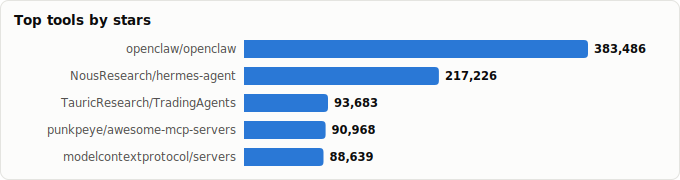
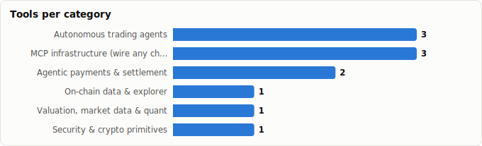

# Which Claw for the Blockchain World? — Claws & Skills for On-Chain / DeFi

> Derived from **kaiser-data**'s 1,327 starred repos (snapshot `2026-07-13T08:42:30.177Z`).
>
> Generated 2026-07-13 by `scripts/reports/blockchain_claws.py` (regenerate any time — no API cost).

> **Key idea.** No claw analyzes chains by itself — a claw is the *orchestrator*; it needs on-chain **skills/tools** wired in. So this report has two halves: which **claw** to run, and which **skills** are superb for which purpose. Both are drawn only from tools already in your stars.

## Verdict

- **Analyzing / monitoring DeFi positions (read & reason)** → **`openclaw`**. It's MCP-native (plug a blockscout MCP for on-chain reads + OpenBB for valuation) and its ecosystem already settles on-chain (`ClawRouter`, USDC on Base & Solana via x402). TypeScript — fits a web3 stack.
- **A crypto-native agent that *acts* on-chain** → **`elizaOS/eliza`**. The only claw built for web3 (wallet/chain plugins, autonomous on-chain agents).
- **Everything else is the skills layer** — blockscout (data), OpenBB (valuation), TradingAgents/AI-Trader (trading), ClawRouter/x402scan (payments) — orchestrated *by* the claw.

## Claws rated for blockchain-fitness

Flags are concrete, checkable attributes — *crypto-native* (built-in web3 plugins), *MCP* (can plug chain-data MCP servers), *on-chain pay* (settles in stablecoin).

| Claw | Fit | Crypto-native | MCP | On-chain pay | ★ | Lang | Health | Why |
|---|---|---|---|---|---|---|---|---|
| [openclaw](https://github.com/openclaw/openclaw) | 🟢 High | — | ✅ | ✅ | 382,751 (▲4,536) | TypeScript | 79 | Not crypto-native itself, but **MCP-native + on-chain-settled ecosystem**: wire in a blockscout MCP for reads, and `ClawRouter` already does USDC payments on Base & Solana (x402). The pragmatic DeFi *analysis* hub, and it's TypeScript. |
| [eliza](https://github.com/elizaOS/eliza) | 🟢 High | ✅ | ✅ | — | 18,736 (▲178) | TypeScript | 72 | The **only crypto-native claw** — `crypto`/web3 topics, wallet & chain plugins, autonomous on-chain agents. Best when the agent should *act* on-chain, not just read. |
| [nanoclaw](https://github.com/nanocoai/nanoclaw) | 🟡 Medium | — | ✅ | — | 30,215 (▲406) | TypeScript | 69 | Containerised + chat connectors — good for a **sandboxed wallet/alert bot** on Telegram/Discord that watches positions and pings you. |
| [openfang](https://github.com/RightNow-AI/openfang) | 🟡 Medium | — | ✅ | — | 18,001 (▲192) | Rust | 78 | **MCP-native Agent-OS** (Rust) — a clean backbone for plugging chain-data MCP servers, if you don't need crypto-specific plugins out of the box. |
| [ironclaw](https://github.com/nearai/ironclaw) | 🟡 Medium | — | ✅ | — | 12,519 (▲77) | Rust | 80 | Privacy/security agent-OS with **WASM-sandboxed CodeAct** — valuable when the agent executes untrusted contract code or keys must stay isolated. |
| [hermes-agent](https://github.com/NousResearch/hermes-agent) | ⚪ Low | — | ✅ | — | 213,952 (▲23,019) | Python | 79 | General Python agent; no crypto specialisation, but the strongest functional claw if you'd build the chain integration yourself in Python. |
| [zeroclaw](https://github.com/zeroclaw-labs/zeroclaw) | ⚪ Low | — | — | — | 32,241 (▲360) | Rust | 99 | Highest-quality general claw, but no crypto/MCP affordances — you'd wire everything by hand. |

## Skills & tools — superb for which purpose

The capability layer a claw orchestrates. Pick per job; most stacks combine 2–3.

### On-chain data & explorer

- **[blockscout](https://github.com/blockscout/blockscout)** · 4,597 (▲32)★ · Elixir · health 85 — Read positions, txs, token balances across EVM chains; exposes an MCP server → plugs straight into a claw.

### Valuation, market data & quant

- **[OpenBB](https://github.com/OpenBB-finance/OpenBB)** · 70,503 (▲1,544)★ · Python · health 71 — Financial data platform explicitly 'for analysts, quants and **AI agents**' — crypto + derivatives coverage to price and value positions.

### Autonomous trading agents

- **[TradingAgents](https://github.com/TauricResearch/TradingAgents)** · 92,695 (▲7,465)★ · Python · health 75 — Multi-agent LLM trading framework — orchestrate it *from* a claw for strategy/execution.
- **[AI-Trader](https://github.com/HKUDS/AI-Trader)** · 20,752 (▲1,174)★ · Python · health 57 — Fully-automated agent-native trading loop.
- **[valuecell](https://github.com/ValueCell-ai/valuecell)** · 10,935 (▲144)★ · Python · health 42 — Community multi-agent platform for finance (crypto + equity); MCP-enabled.

### Agentic payments & settlement

- **[ClawRouter](https://github.com/BlockRunAI/ClawRouter)** · 6,652 (▲91)★ · TypeScript · health 77 — Agent-native LLM router with **USDC payments on Base & Solana via x402** — settle agent spend on-chain. Built for OpenClaw.
- **[x402scan](https://github.com/Merit-Systems/x402scan)** · 357 (▲11)★ · TypeScript · health 78 — x402 ecosystem explorer — inspect agentic stablecoin payment flows.

### MCP infrastructure (wire any chain in)

- **[servers](https://github.com/modelcontextprotocol/servers)** · 88,390 (▲1,320)★ · TypeScript · health 77 — Official MCP server collection — the integration layer for chain-data tools.
- **[awesome-mcp-servers](https://github.com/punkpeye/awesome-mcp-servers)** · 90,672 (▲1,785)★ · — · health 65 — Directory of MCP servers (incl. blockchain/explorer servers).
- **[awesome-claude-skills](https://github.com/ComposioHQ/awesome-claude-skills)** · 67,583 (▲3,390)★ · Python · health 62 — Curated Claude skills — reusable capabilities to bolt onto a claw.

### Security & crypto primitives

- **[awesome-cryptography](https://github.com/sobolevn/awesome-cryptography)** · 7,024 (▲42)★ · — · health 44 — Reference for cryptography primitives — key handling, signing, hashing.

## Recommended stacks

Claw + skills, assembled by goal:

- **Analyze / monitor DeFi positions (read & reason)**  
  `openclaw` + `blockscout` + `OpenBB`  
  Read-and-reason job. openclaw (MCP) pulls on-chain state via a blockscout MCP, OpenBB values it. Add `ClawRouter` if you want agent spend settled in USDC.
- **Crypto-native agent that acts on-chain**  
  `eliza` + `blockscout`  
  eliza is purpose-built for web3 — wallet/chain plugins to execute, blockscout to verify.
- **Autonomous trading on positions**  
  `openclaw` + `TradingAgents` + `OpenBB`  
  Claw orchestrates a dedicated trading framework; OpenBB supplies market/quant data.
- **Agentic payments / x402 settlement**  
  `openclaw` + `ClawRouter` + `x402scan`  
  USDC settlement on Base/Solana via x402, with x402scan for flow inspection.

## Caveats

- **Snapshot-bound** to the May-2026 dataset; crypto tooling moves weekly. Re-verify before wiring anything that touches funds.
- **Skills ≠ audited.** `awesome-*` lists and MCP servers are starting points, not vetted dependencies — review any tool that signs transactions or holds keys.
- **A claw orchestrates; it doesn't custody.** Keep signing/keys in a sandboxed, least-privilege layer (see ironclaw/nanoclaw) — never hand raw keys to a general assistant.
- Fit ratings are editorial (based on each repo's own topics/description); stars/health/bus factor are precomputed dataset metrics.

Snapshot: 2026-07-13T08:42:30.177Z · regenerate via scripts/reports/blockchain_claws.py
