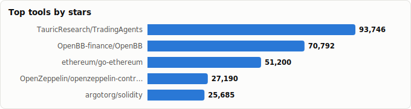
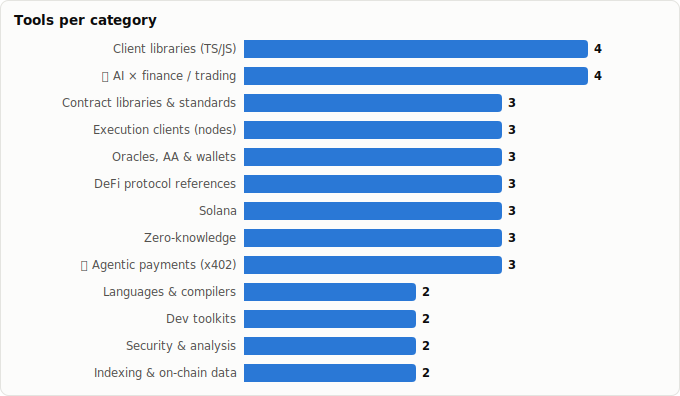

# Blockchain Repos You Need to Know — A Field Guide

> Derived from **kaiser-data**'s 1,327 starred repos (snapshot `2026-07-13T08:42:30.177Z`), cross-referenced with the repo-similarity graph (1,327 nodes / 4,302 edges).
>
> Generated 2026-07-13 by `scripts/reports/blockchain_essentials.py` (regenerate any time — no API cost).

> **What this is.** The essential blockchain/web3/DeFi repos worth knowing, organized by **layer** (language → toolchain → libraries → clients → protocols → ZK → the AI×crypto edge), with live metrics. Start at the top of each layer and work down.

## 🔥 What's hot right now

Ranked by a composite of momentum, 90-day commit velocity, lifecycle stage and recency. The heat in blockchain today is **AI agents transacting on-chain**, not the (mature, stable) base toolchain.

| Repo | Layer-fit | ★ | Lifecycle | Momentum (★/30d) | Commits (90d) |
|---|---|---|---|---|---|
| [eliza](https://github.com/elizaOS/eliza) | 🔥 AI × finance / trading | 18,736 | 🟢 Mature | 1,340 | 9,998 |
| [x402scan](https://github.com/Merit-Systems/x402scan) | 🔥 Agentic payments (x402) | 357 | 🔥 Hot | 91 | 534 |
| [ClawRouter](https://github.com/BlockRunAI/ClawRouter) | 🔥 Agentic payments (x402) | 6,652 | 🔥 Hot | 3,125 | 143 |
| [hardhat](https://github.com/NomicFoundation/hardhat) | Dev toolkits | 8,494 | 🔵 Classic | 106 | 1,008 |
| [viem](https://github.com/wevm/viem) | Client libraries (TS/JS) | 3,515 | 🔵 Classic | 91 | 279 |
| [TradingAgents](https://github.com/TauricResearch/TradingAgents) | 🔥 AI × finance / trading | 92,695 | 🟢 Mature | 6,727 | 110 |
| [blockscout](https://github.com/blockscout/blockscout) | Indexing & on-chain data | 4,597 | 🔵 Classic | 56 | 199 |
| [openzeppelin-contracts](https://github.com/OpenZeppelin/openzeppelin-contracts) | Contract libraries & standards | 27,184 | 🔵 Classic | 281 | 37 |

**Two trends to watch:**

1. **Agentic payments (x402).** `coinbase/x402` (payments over HTTP) + `ClawRouter` (USDC on Base & Solana) + `x402scan` — agent-to-agent stablecoin settlement, brand-new and accelerating. The most genuinely *novel* movement here.
2. **Autonomous AI trading.** `TauricResearch/TradingAgents` (82k★) and `HKUDS/AI-Trader` are high-momentum, and `elizaOS/eliza` ships at enormous velocity (9,998 commits/90d).

**Quiet but foundational:** Rust is taking over the client/tooling layer — `agave`, `reth`, `foundry` all show very high 90-day commit counts despite mature/low momentum. High build activity, not hype.

## The field guide, by layer

### Languages & compilers
_What you write contracts in._

| Repo | ★ | Lifecycle | Health | Lang | Role |
|---|---|---|---|---|---|
| [solidity](https://github.com/argotorg/solidity) | 25,674 (▲16) | 🔵 Classic | 84 | C++ | The Solidity compiler & language (ex ethereum/solidity). |
| [vyper](https://github.com/vyperlang/vyper) | 5,175 (▼9) | 🔵 Classic | 71 | Python | Pythonic contract language; security-minded alternative. |

### Dev toolkits
_Build, test, fuzz, deploy._

| Repo | ★ | Lifecycle | Health | Lang | Role |
|---|---|---|---|---|---|
| [foundry](https://github.com/foundry-rs/foundry) | 10,486 (▲74) | 🔵 Classic | 89 | Rust | Forge/Cast/Anvil — the dominant Rust-based Solidity toolchain. |
| [hardhat](https://github.com/NomicFoundation/hardhat) | 8,494 (▲16) | 🔵 Classic | 83 | TypeScript | The established JS/TS dev environment. |

### Contract libraries & standards
_Don't reinvent ERC-20/721; reuse audited code._

| Repo | ★ | Lifecycle | Health | Lang | Role |
|---|---|---|---|---|---|
| [openzeppelin-contracts](https://github.com/OpenZeppelin/openzeppelin-contracts) | 27,184 (▲46) | 🔵 Classic | 77 | Solidity | The standard audited token/access/proxy library. |
| [solmate](https://github.com/transmissions11/solmate) | 4,290 (▲15) | 🟠 Declining | 7 | Solidity | Minimalist, modern contract primitives. |
| [solady](https://github.com/Vectorized/solady) | 3,343 (▲28) | 🟢 Mature | 54 | Solidity | Gas-optimized Solidity building blocks. |

### Security & analysis
_Catch bugs before mainnet._

| Repo | ★ | Lifecycle | Health | Lang | Role |
|---|---|---|---|---|---|
| [slither](https://github.com/crytic/slither) | 6,314 (▲24) | 🟢 Mature | 51 | Python | The go-to static analyzer for contract vulnerabilities. |
| [echidna](https://github.com/crytic/echidna) | 3,160 (▲11) | 🔵 Classic | 72 | Haskell | Property-based fuzzer for smart contracts. |

### Client libraries (TS/JS)
_Talk to chains from apps._

| Repo | ★ | Lifecycle | Health | Lang | Role |
|---|---|---|---|---|---|
| [ethers.js](https://github.com/ethers-io/ethers.js) | 8,702 (▲18) | 🟢 Mature | 57 | TypeScript | The long-time standard JS/TS library. |
| [wagmi](https://github.com/wevm/wagmi) | 6,735 (▲14) | 🔵 Classic | 83 | TypeScript | React hooks for Ethereum (pairs with viem). |
| [viem](https://github.com/wevm/viem) | 3,515 (▲19) | 🔵 Classic | 80 | TypeScript | Modern, type-safe Ethereum client — default for new TS apps. |
| [rainbowkit](https://github.com/rainbow-me/rainbowkit) | 2,831 (▲8) | 🔵 Classic | 66 | MDX | Drop-in wallet-connection UX for dApps. |

### Execution clients (nodes)
_The chain itself._

| Repo | ★ | Lifecycle | Health | Lang | Role |
|---|---|---|---|---|---|
| [go-ethereum](https://github.com/ethereum/go-ethereum) | 51,342 (▲215) | 🔵 Classic | 85 | Go | geth — the reference Ethereum node (Go). |
| [reth](https://github.com/paradigmxyz/reth) | 5,691 (▲62) | 🔵 Classic | 85 | Rust | Modern, fast Rust client (rising alternative). |
| [nethermind](https://github.com/NethermindEth/nethermind) | 1,575 (▲9) | 🔵 Classic | 94 | C# | High-perf .NET client, strong on tooling. |

### Oracles, AA & wallets
_Price feeds, smart accounts, custody._

| Repo | ★ | Lifecycle | Health | Lang | Role |
|---|---|---|---|---|---|
| [chainlink](https://github.com/smartcontractkit/chainlink) | 8,218 (▲6) | 🔵 Classic | 98 | Go | Price feeds you need to value positions. |
| [safe-smart-account](https://github.com/safe-fndn/safe-smart-account) | 2,167 (▲10) | 🟢 Mature | 51 | TypeScript | Safe multisig — treasury/custody standard. |
| [account-abstraction](https://github.com/eth-infinitism/account-abstraction) | 1,921 (▲10) | 🟢 Mature | 28 | TypeScript | Reference ERC-4337 account-abstraction. |

### Indexing & on-chain data
_Turn raw chain state into queries._

| Repo | ★ | Lifecycle | Health | Lang | Role |
|---|---|---|---|---|---|
| [blockscout](https://github.com/blockscout/blockscout) | 4,597 (▲32) | 🔵 Classic | 85 | Elixir | Open EVM explorer; exposes an MCP server for agents. |
| [graph-node](https://github.com/graphprotocol/graph-node) | 3,147 (▲11) | 🔵 Classic | 78 | Rust | The Graph — index chains into queryable subgraphs. |

### DeFi protocol references
_Read the canonical contracts._

| Repo | ★ | Lifecycle | Health | Lang | Role |
|---|---|---|---|---|---|
| [v3-core](https://github.com/Uniswap/v3-core) | 5,015 (▲19) | 🟢 Mature | 38 | TypeScript | The concentrated-liquidity AMM still everywhere. |
| [v4-core](https://github.com/Uniswap/v4-core) | 2,525 (▲21) | 🟢 Mature | 32 | Solidity | Latest AMM/DEX core (hooks). |
| [comet](https://github.com/compound-finance/comet) | 312 (▲3) | 🟢 Mature | 44 | TypeScript | Compound III lending. |

### Solana
_The largest non-EVM L1._

| Repo | ★ | Lifecycle | Health | Lang | Role |
|---|---|---|---|---|---|
| [anchor](https://github.com/otter-sec/anchor) | 5,100 (▲17) | 🔵 Classic | 89 | Rust | The standard Solana smart-contract framework. |
| [solana-web3.js](https://github.com/solana-foundation/solana-web3.js) | 2,748 (▲16) | 🟢 Mature | 55 | TypeScript | JS SDK for Solana. |
| [agave](https://github.com/anza-xyz/agave) | 1,840 (▲29) | 🟢 Mature | 97 | Rust | The Solana validator client. |

### Zero-knowledge
_Proofs, privacy, scaling._

| Repo | ★ | Lifecycle | Health | Lang | Role |
|---|---|---|---|---|---|
| [risc0](https://github.com/risc0/risc0) | 2,163 (▲12) | 🟢 Mature | 59 | C++ | General-purpose zkVM. |
| [sp1](https://github.com/succinctlabs/sp1) | 1,707 (▲15) | 🟢 Mature | 83 | Rust | Performant RISC-V zkVM. |
| [circom](https://github.com/iden3/circom) | 1,678 (▲5) | 🟢 Mature | 37 | WebAssembly | Circuit compiler for zk-SNARKs. |

### 🔥 Agentic payments (x402)
_AI agents settling on-chain — the breakout trend._

| Repo | ★ | Lifecycle | Health | Lang | Role |
|---|---|---|---|---|---|
| [ClawRouter](https://github.com/BlockRunAI/ClawRouter) | 6,652 (▲91) | 🔥 Hot | 77 | TypeScript | Agent LLM router with USDC payments on Base & Solana via x402. |
| [x402scan](https://github.com/Merit-Systems/x402scan) | 357 (▲11) | 🔥 Hot | 78 | TypeScript | x402 ecosystem explorer. |
| [x402](https://github.com/coinbase/x402) | 119 (▲29) | 🟠 Declining | 40 | TypeScript | The payments-over-HTTP protocol everyone's building on. |

### 🔥 AI × finance / trading
_Where crypto meets the agent stack._

| Repo | ★ | Lifecycle | Health | Lang | Role |
|---|---|---|---|---|---|
| [TradingAgents](https://github.com/TauricResearch/TradingAgents) | 92,695 (▲7,465) | 🟢 Mature | 75 | Python | Multi-agent LLM trading framework. |
| [OpenBB](https://github.com/OpenBB-finance/OpenBB) | 70,503 (▲1,544) | 🔵 Classic | 71 | Python | Financial data platform 'for analysts, quants & AI agents'. |
| [AI-Trader](https://github.com/HKUDS/AI-Trader) | 20,752 (▲1,174) | 🔥 Hot | 57 | Python | Fully-automated agent-native trading. |
| [eliza](https://github.com/elizaOS/eliza) | 18,736 (▲178) | 🟢 Mature | 72 | TypeScript | Crypto-native agent OS (wallet/chain plugins). |

### Referenced but not in the live dataset

- **[aave/aave-v3-core](https://github.com/aave/aave-v3-core)** — Leading lending protocol — but the v3-core repo is **archived** upstream (active dev moved on), so it's not in the live dataset. Still the canonical reference for lending/health-factor logic.

## Where to start (a learning path)

If you're ramping on EVM/DeFi development, in order:

1. **Language** → `solidity` (read the docs, write a token).
2. **Toolchain** → `foundry` (Forge for build/test/fuzz; Anvil for a local node).
3. **Stand on giants** → `openzeppelin-contracts` (inherit audited standards).
4. **Make it safe** → `slither` + `echidna` (static analysis + fuzzing) before you ship.
5. **Build the app** → `viem` + `wagmi` (+ `rainbowkit` for wallet UX).
6. **Read real DeFi** → `Uniswap/v4-core`, `compound/comet` to see production patterns.
7. **Get the data** → `graph-node` (subgraphs) + `blockscout` (explorer/MCP) to analyze positions.
8. **The frontier** → `coinbase/x402` + `ClawRouter` if you're wiring agents to move value.

> For **analyzing DeFi positions specifically**, the practical stack is `openclaw + blockscout (MCP reads) + OpenBB (valuation)` — see the **Blockchain Claws** report. For **what's still missing**, see **Recommended to Star — Blockchain / DeFi Gaps**.

## Caveats

- **Snapshot-bound** to the dataset; crypto moves weekly. Metrics (stars, lifecycle, health, momentum) are precomputed by the analyzer pipeline.
- **Curation is editorial** — the layer map is hand-built; inclusion means 'worth knowing', not 'exhaustive'. Repo names reflect post-redirect owners (e.g. `argotorg/solidity`, `otter-sec/anchor`, `safe-fndn/...`).
- **Stars ≠ endorsement to run in production**, especially anything touching funds — audit first.

Essential repos mapped: 37 across 13 layers · Snapshot: 2026-07-13T08:42:30.177Z · regenerate via scripts/reports/blockchain_essentials.py
