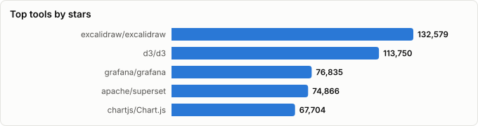
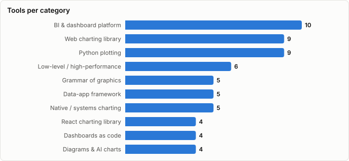

# Charting & Data-Visualization Tools — Advantages, Disadvantages & Use Cases

> Derived from **kaiser-data**'s 1,861 starred repos (snapshot `2026-08-29T14:32:27.250Z`), cross-referenced with the repo-similarity graph (1,861 nodes / 6,077 edges, 39 communities). The advantages/disadvantages column is editorial judgement grounded in the dataset's own health metrics plus external comparisons — see Methodology.
>
> Generated 2026-08-29 by `scripts/reports/charting_stack.py` (regenerate any time — no API cost).

## Executive summary

- **61 charting and visualization tools** in your stars (**1,330,589★** combined), grouped into 10 layers:
  - **Web charting library** (9): `Chart.js`, `echarts`, `plotly.js`, `apexcharts.js`, `frappe/charts`, `G2`, `highcharts`, `c3`, `observablehq/plot`
  - **React charting library** (4): `recharts`, `visx`, `nivo`, `tremor`
  - **Low-level / high-performance** (6): `d3`, `lightweight-charts`, `deck.gl`, `kepler.gl`, `perspective`, `uPlot`
  - **Grammar of graphics** (5): `vega`, `altair`, `vega-lite`, `plotnine`, `lets-plot`
  - **Python plotting** (9): `matplotlib`, `bokeh`, `plotly.py`, `pygwalker`, `panel`, `dtale`, `holoviews`, `great-tables`, `xy`
  - **BI & dashboard platform** (10): `grafana`, `superset`, `metabase`, `ToolJet`, `redash`, `openobserve`, `kibana`, `WrenAI`, `evidence`, `rill`
  - **Data-app framework** (5): `streamlit`, `gradio`, `reflex`, `dash`, `taipy`
  - **Dashboards as code** (4): `grafanalib`, `grabana`, `grafana-foundation-sdk`, `grafyaml`
  - **Diagrams & AI charts** (4): `excalidraw`, `drawio-desktop`, `beautiful-mermaid`, `mcp-mermaid`
  - **Native / systems charting** (5): `ScottPlot`, `matplotplusplus`, `AAChartKit`, `gonum/plot`, `core-plot`
- **There is no 'best chart app' — there are six different questions.** *Who writes the chart* (developer / analyst / business user / agent), *where it renders* (browser / notebook / desktop / static site), *how much data* (hundreds / millions), *how bespoke* (library defaults / pixel-exact), *who operates it* (a dependency vs. a platform to run), and *what licence* you can live with. Every row in the advantages/disadvantages table below is really one of those trade-offs.
- The single most common mistake this landscape produces: **picking an SVG library for a canvas-sized problem**. Recharts, ApexCharts, and Chart.js degrade noticeably past ~10k points; ECharts, uPlot, Perspective, and deck.gl exist precisely for what lies beyond that line.
- **Licence is a real constraint, not a footnote.** `highcharts` is proprietary for commercial use — and `AAChartKit` inherits that licence by wrapping it. `grafana`, `metabase`, and `superset` differ sharply in what they gate behind an enterprise edition.
- The dashboards-as-code corner is consolidating: `grafanalib` is **declining** and `grabana` reads as **abandoned** in this snapshot, both superseded by Grafana's first-party `grafana-foundation-sdk`.
- New in this landscape: **charts as an agent output**. `vega-lite`'s JSON specs, `mcp-mermaid`'s MCP tool, and `WrenAI`/`rill`'s explicit agent framing all point the same way — the chart is becoming something a model emits, not something a human draws.

## Choosing: the six questions

| Question | If the answer is… | Look at |
|---|---|---|
| **Who authors the chart?** | a developer, in code | charting libraries (ECharts, Recharts, D3) |
| | an analyst, in SQL | Superset, Redash, Evidence, Rill |
| | a business user, clicking | Metabase, ToolJet |
| | an LLM / agent | Vega-Lite specs, mcp-mermaid, WrenAI |
| **Where does it render?** | browser app | web + React charting libraries |
| | notebook | Plotly.py, Altair, HoloViews, PyGWalker |
| | desktop / native | ScottPlot, AAChartKit, Core Plot |
| | a static site / PDF | Evidence, matplotlib, plotnine |
| **How much data?** | < 10k points | any SVG library |
| | 10k–1M | ECharts, uPlot, ScottPlot |
| | > 1M / streaming | Perspective, deck.gl, Datashader-backed HoloViews |
| **How bespoke?** | library defaults are fine | Chart.js, Recharts, ApexCharts |
| | must match a design system | visx, D3, G2 |
| **Who operates it?** | it's a dependency | every library here |
| | it's a platform you run | Grafana, Superset, Metabase, Kibana |
| **Licence tolerance?** | permissive only | avoid Highcharts (and AAChartKit) |
| | AGPL/open-core acceptable | Grafana, Metabase |

## Advantages, disadvantages & use cases

The core of this report. Grouped by layer, sorted by stars within each layer.

### Web charting library

| Tool | ★ | ✅ Advantages | ⚠️ Disadvantages | 🎯 Best for |
|---|---|---|---|---|
| **[chartjs/Chart.js](https://github.com/chartjs/Chart.js)** | 67,668 | Trivial learning curve; small (~60 KB, ~14 KB tree-shaken for basic charts); huge plugin ecosystem; framework-agnostic with well-maintained React/Vue bindings; MIT. | Only ~8 core chart types; performance degrades noticeably past ~10k points; canvas output isn't selectable/exportable as vector; deep customisation means writing plugins. | Standard business charts (line/bar/pie/doughnut) at typical data volumes. |
| **[apache/echarts](https://github.com/apache/echarts)** | 67,166 | Enormous chart catalogue (incl. sankey, treemap, graph, geo); canvas renderer handles hundreds of thousands to millions of points; built-in dataZoom/toolbox/theming; strong i18n and accessibility work; Apache governance. | Large bundle (~1 MB full build) unless you hand-assemble tree-shaken imports; imperative `setOption` config object is verbose and weakly typed; docs and issues skew Chinese-first; React/Vue wrappers are third-party. | Dense enterprise dashboards and any chart type the small libraries don't have. |
| **[plotly/plotly.js](https://github.com/plotly/plotly.js)** | 18,303 | 40+ chart types including 3D, contour, and statistical plots; zoom/pan/hover/export toolbar out of the box; identical JSON figure spec across JS/Python/R. | Very heavy bundle (bundles D3 + gl-vis internally); the JSON figure format is verbose; styling fights you if you want a bespoke look; MIT core but commercial upsell around Dash. | Scientific and engineering charts, and anything already using Plotly in Python/R. |
| **[apexcharts/apexcharts.js](https://github.com/apexcharts/apexcharts.js)** | 15,140 | Attractive out-of-the-box styling and animations; good annotation and mixed-chart support; official React/Vue/Angular wrappers; MIT. | SVG rendering caps practical dataset size well below canvas libraries; less flexible than D3 for custom marks; some advanced features are documented only by example. | Product dashboards that must look good with little design work. |
| **[frappe/charts](https://github.com/frappe/charts)** | 15,079 | Tiny footprint and no dependencies; genuinely pleasant defaults; heatmap (GitHub-contribution style) built in; MIT. | Small chart catalogue; sparse maintenance; no serious large-dataset story; limited interactivity beyond tooltips. | Weight-sensitive pages and simple embedded charts. |
| **[antvis/G2](https://github.com/antvis/G2)** | 12,596 | Grammar-of-graphics composability without leaving JS; strong statistical transforms; part of the wider AntV suite (G6 graphs, L7 geo, S2 tables); good animation primitives. | Documentation and community are largely Chinese-language; API churned hard across v4→v5; smaller Western ecosystem means fewer StackOverflow answers. | Teams that want ggplot-style composition in a TypeScript frontend. |
| **[highcharts/highcharts](https://github.com/highcharts/highcharts)** | 12,481 | Best-in-class accessibility module (screen-reader sonification, keyboard nav); mature stock/maps/gantt packages; export server; enterprise support and long-term API stability. | **Not free for commercial use** — proprietary licence with per-developer pricing; large bundle; the licence alone disqualifies it for many OSS/SaaS teams. | Regulated or accessibility-mandated products with budget for a licence. |
| **[c3js/c3](https://github.com/c3js/c3)** | 9,349 | Simple declarative config over real D3 output; stable, small, easy to theme with CSS; still receiving maintenance commits. | Effectively feature-frozen; built on D3 v5-era patterns; limited chart types; the problem it solved is now solved better by Observable Plot and ECharts. | Legacy codebases already on C3 — not a new-project choice. |
| **[observablehq/plot](https://github.com/observablehq/plot)** | 5,361 | Extremely terse for exploratory charts; sensible statistical defaults (bins, stacks, facets); built on and interoperable with D3; ISC licence. | Deliberately exploratory-first — less suited to pixel-exact product charts; interaction model is thinner than ECharts/Highcharts; smaller plugin ecosystem. | Fast exploratory charts in notebooks and internal tools. |

### React charting library

| Tool | ★ | ✅ Advantages | ⚠️ Disadvantages | 🎯 Best for |
|---|---|---|---|---|
| **[recharts/recharts](https://github.com/recharts/recharts)** | 27,519 | Idiomatic React composition (`<LineChart><XAxis/><Tooltip/>`); declarative and easy to reason about; responsive container built in; MIT; the most-recommended React default. | SVG-only — struggles well before 10k points; animation and layout bugs surface in complex compositions; customisation beyond the component props gets awkward fast. | The default choice for typical React dashboards with modest data volumes. |
| **[airbnb/visx](https://github.com/airbnb/visx)** | 21,027 | You own the DOM and the design entirely; tree-shakes to only what you import; no chart abstraction to fight; excellent for design-system-native charts. | Not a chart library — you assemble axes, scales, and tooltips yourself; substantially more code per chart; steeper ramp; you inherit D3's mental model anyway. | Bespoke, design-system-consistent charts in React where control beats speed. |
| **[plouc/nivo](https://github.com/plouc/nivo)** | 14,092 | Beautiful defaults and a superb interactive docs/playground; canvas variants for larger datasets; SSR support; motion via react-spring. | Heavy dependency footprint; each chart family has its own prop vocabulary to learn; theming is powerful but verbose; bundle size adds up quickly. | Design-led React dashboards where visual polish matters more than bundle size. |
| **[tremorlabs/tremor](https://github.com/tremorlabs/tremor)** | 3,583 | Fastest path to a competent-looking dashboard; Tailwind-native; components are copied into your repo so you can edit them; KPI/stat tiles included, not just charts. | Requires Tailwind; inherits every Recharts performance limit; shifted to a copy-paste model which complicates upgrades; opinionated visual style is hard to fully escape. | Tailwind/Next.js dashboards that need to look finished this week. |

### Low-level / high-performance

| Tool | ★ | ✅ Advantages | ⚠️ Disadvantages | 🎯 Best for |
|---|---|---|---|---|
| **[d3/d3](https://github.com/d3/d3)** | 113,572 | Total expressive freedom; the scales/shape/geo/force modules are the reference implementations; modular (import only `d3-scale` if that's all you need); unmatched learning material. | Very steep learning curve; you write and maintain everything including axes, legends, and accessibility; direct DOM manipulation clashes with React's model; slow to ship simple charts. | Custom, one-of-a-kind visualizations — and as a dependency of everything else. |
| **[tradingview/lightweight-charts](https://github.com/tradingview/lightweight-charts)** | 17,097 | Purpose-built for financial series: candlestick/OHLC, real-time streaming updates, professional pan/zoom feel; tiny; Apache-2.0. | Financial charts only — no general chart types; indicator library is not included (that's the paid Charting Library); attribution notice required. | Trading, crypto, and any price/time chart that must feel native. |
| **[visgl/deck.gl](https://github.com/visgl/deck.gl)** | 14,530 | GPU rendering of millions of points/arcs/hexbins; composable layer model; integrates with MapLibre/Mapbox/Google Maps; battle-tested at Uber scale. | GPU-only mental model with real memory/driver pitfalls; heavy bundle; overkill for anything under ~100k features; documentation assumes graphics familiarity. | Large-scale geospatial visualization and GPU-accelerated point clouds. |
| **[keplergl/kepler.gl](https://github.com/keplergl/kepler.gl)** | 11,989 | No-code map analysis for large datasets; layer/filter/time-playback UI included; embeddable as a React component; exports configs as JSON. | Opinionated app, not a library — customisation means forking behaviour; Redux-coupled embedding is awkward; maintenance has slowed since the Uber era. | Ad-hoc geospatial exploration without building a mapping app. |
| **[perspective-dev/perspective](https://github.com/perspective-dev/perspective)** | 11,136 | Handles millions of rows client-side via WASM + Apache Arrow; pivots, filters, and charts over streaming updates; works in the browser, Jupyter, and as a server. | Heavy, unusual architecture (WASM binary + web components); steep conceptual ramp; overkill for static datasets; smaller community than mainstream charting. | Real-time, million-row analytical grids that must stay interactive in the browser. |
| **[leeoniya/uPlot](https://github.com/leeoniya/uPlot)** | 10,454 | Renders hundreds of thousands of points in milliseconds; ~50 KB with zero dependencies; memory-frugal; the benchmark other libraries are measured against. | Deliberately narrow — time-series shapes only, no pie/treemap/geo; terse, low-level API; minimal built-in interactivity; you build the polish yourself. | Dense time-series panels and anything where render latency is the requirement. |

### Grammar of graphics

| Tool | ★ | ✅ Advantages | ⚠️ Disadvantages | 🎯 Best for |
|---|---|---|---|---|
| **[vega/vega](https://github.com/vega/vega)** | 11,977 | Far more expressive than Vega-Lite (custom interaction, layouts, transforms) while staying declarative; renders to canvas or SVG; strong academic pedigree (UW IDL). | Verbose specs that get unwieldy fast; steeper than both Vega-Lite and most imperative libraries; debugging a large spec is genuinely painful. | Custom interactive graphics that must still be declarative and serializable. |
| **[vega/altair](https://github.com/vega/altair)** | 10,460 | Very concise, highly readable chart code; interactive selections and linked brushing come free; native pandas/Polars support; output is a portable Vega-Lite spec. | Historically awkward with large data (data is embedded in the spec unless you use `vegafusion`/URLs); customisation ceiling is Vega-Lite's; static export needs extra deps. | Exploratory statistical charts in notebooks, especially with linked interaction. |
| **[vega/vega-lite](https://github.com/vega/vega-lite)** | 5,463 | Charts are portable JSON, which makes them diffable, generatable, and **the most LLM-friendly chart format**; sensible defaults infer scales and legends; excellent faceting/layering; BSD-3. | Escaping the grammar for a bespoke design means dropping to Vega or another library; rendering performance is modest; error messages on malformed specs are cryptic. | Spec-driven charts, embedded analytics, and charts generated by agents or LLMs. |
| **[has2k1/plotnine](https://github.com/has2k1/plotnine)** | 4,757 | If you know ggplot2, you already know it; excellent faceting and statistical layers; publication-grade static output via matplotlib; consistent, principled API. | Static only — no interactivity; matplotlib backend means matplotlib's speed and styling constraints; smaller ecosystem than matplotlib/seaborn; slower on large frames. | Publication figures for anyone coming from R/ggplot2. |
| **[JetBrains/lets-plot](https://github.com/JetBrains/lets-plot)** | 1,778 | Same grammar from Python and Kotlin/JVM; genuinely good geospatial support; renders in Jupyter, Datalore, and Kotlin notebooks; actively developed by a funded team. | Much smaller community than ggplot2/matplotlib; Kotlin-first documentation in places; fewer third-party extensions; another rendering stack to learn. | JVM/Kotlin data teams, and Python users who want ggplot without the R baggage. |

### Python plotting

| Tool | ★ | ✅ Advantages | ⚠️ Disadvantages | 🎯 Best for |
|---|---|---|---|---|
| **[matplotlib/matplotlib](https://github.com/matplotlib/matplotlib)** | 23,117 | Can draw literally anything; the publication standard for scientific figures; vector output (PDF/SVG/EPS); enormous documentation and 20 years of StackOverflow answers; PSF-style licence. | Two competing APIs (pyplot state machine vs. object-oriented) confuse newcomers; verbose for anything non-trivial; dated defaults; no real interactivity; slow on large datasets. | Publication figures and any plot that must be exactly right. |
| **[bokeh/bokeh](https://github.com/bokeh/bokeh)** | 20,436 | Python callbacks can run server-side (no JS required) via `bokeh serve`; strong streaming and large-data story (with Datashader); composable widgets; BSD-3. | Heavier concepts than Plotly for simple charts; the server model adds deployment burden; smaller community and slower momentum than Plotly/Altair. | Streaming/live Python dashboards that need server-side callbacks. |
| **[plotly/plotly.py](https://github.com/plotly/plotly.py)** | 18,755 | Interactivity (hover/zoom/select) for free in notebooks and web; Plotly Express is genuinely concise; 3D and statistical chart types; the same figure object powers Dash. | Large output payloads bloat notebooks and slow rendering; styling defaults are hard to override cleanly; the free/enterprise boundary around Dash causes confusion. | Interactive exploration in notebooks, and any chart destined for a Dash app. |
| **[Kanaries/pygwalker](https://github.com/Kanaries/pygwalker)** | 15,949 | `pyg.walk(df)` and you have pivot + chart exploration; no chart code at all; works in Jupyter/Streamlit/Colab; exports the resulting spec. | Exploration tool, not a production chart library; struggles on very large frames without a compute backend; the free tier nudges toward the commercial Kanaries cloud. | Fast visual EDA on a DataFrame before writing any chart code. |
| **[holoviz/panel](https://github.com/holoviz/panel)** | 5,763 | Backend-agnostic: embeds matplotlib, Plotly, Bokeh, Altair, Vega, and DataFrames alike; works inside notebooks *and* as a served app; mature templating. | Large API surface with several overlapping ways to do things; documentation sprawl; smaller community than Streamlit; more concepts before the first app runs. | Python dashboards that must mix plotting libraries rather than commit to one. |
| **[man-group/dtale](https://github.com/man-group/dtale)** | 5,214 | Deep pandas-specific tooling (correlations, missing-value analysis, code export); shows the pandas code for each operation; runs from notebook, CLI, or Flask. | Purely an inspection/EDA tool; heavy Flask app for what is often a quick look; not embeddable as a component; pandas-centric. | Interrogating an unfamiliar DataFrame in depth. |
| **[holoviz/holoviews](https://github.com/holoviz/holoviews)** | 2,907 | Extremely concise for exploratory work; backend-agnostic (same code → Bokeh or matplotlib); composes plots with `+` and `*`; pairs with Datashader for billion-point rendering. | Heavy abstraction — debugging means understanding the backend anyway; sparse error messages; steep conceptual learning curve; small community. | Iterative exploratory analysis where you re-plot constantly. |
| **[posit-dev/great-tables](https://github.com/posit-dev/great-tables)** | 2,723 | Turns DataFrames into genuinely presentable tables (spanners, footnotes, formatting, nanoplots); the missing piece in most reporting stacks; Posit maintenance. | Display only — not interactive, not sortable, not a data grid; young API; another dependency for something teams often hand-roll. | Report and dashboard tables that need to look designed rather than dumped. |
| **[reflex-dev/xy](https://github.com/reflex-dev/xy)** | 1,792 | Very fast rendering; clean modern API; first-class inside Reflex apps; hot development pace with a funded team behind it. | Young and small — API stability, chart coverage, and ecosystem are all unproven; documentation is thin; effectively single-vendor. | Reflex apps, and experiments where speed matters more than maturity. |

### BI & dashboard platform

| Tool | ★ | ✅ Advantages | ⚠️ Disadvantages | 🎯 Best for |
|---|---|---|---|---|
| **[grafana/grafana](https://github.com/grafana/grafana)** | 76,458 | Best-in-class time-series dashboards and alerting; plugs into anything (Prometheus, Loki, SQL, Elasticsearch, cloud); huge dashboard library; excellent health/activity metrics in this dataset (see comparison table). | Awkward for non-time-series BI (joins, drill-downs, pivots); dashboard JSON is painful to review in git without a codegen layer; AGPL core with enterprise features gated; query-language burden shifts to the data source. | Infrastructure, metrics, and any alert-driven operational dashboard. |
| **[apache/superset](https://github.com/apache/superset)** | 74,491 | Rich visualization catalogue; genuine multi-tenant BI (roles, row-level security, caching); warehouse-scale via SQLAlchemy; Apache-2.0 with no feature gating. | Heavy to deploy and operate (Celery, Redis, metadata DB); upgrades are notoriously involved; the semantic layer is weaker than commercial BI; steeper for business users. | Technical data teams that want warehouse-scale, self-hosted BI. |
| **[metabase/metabase](https://github.com/metabase/metabase)** | 48,967 | Fastest setup of any BI platform here; the notebook/question builder genuinely works for business users; good embedding story; sane defaults. | Visualization catalogue is comparatively basic; complex analytical modelling hits a ceiling quickly; the useful embedding/SSO features sit behind the commercial edition (AGPL core). | Self-service BI where adoption by non-technical users is the deciding factor. |
| **[ToolJet/ToolJet](https://github.com/ToolJet/ToolJet)** | 40,785 | Builds full CRUD internal tools, not just read-only dashboards; 50+ connectors; self-hostable; very healthy maintenance signal. | A low-code app builder first and a charting tool second — visualization options are basic; vendor lock-in to its app model; complex logic in a visual builder ages badly. | Internal tools that need charts *and* write actions in one place. |
| **[getredash/redash](https://github.com/getredash/redash)** | 28,766 | Extremely simple model (query → visualization → dashboard); 50+ data sources; low operational weight; good for SQL-fluent teams. | Development has been slow since the Databricks acquisition; visualization options are thin; no semantic layer or modelling; effectively in maintenance mode. | SQL-fluent teams that want dashboards without a BI platform. |
| **[openobserve/openobserve](https://github.com/openobserve/openobserve)** | 21,512 | Claims order-of-magnitude storage savings vs. Elasticsearch; single binary, trivial to run; logs + metrics + traces + dashboards in one product; very healthy activity in this dataset. | Much younger and smaller ecosystem than Grafana/Kibana; fewer integrations and community dashboards; open-core with features reserved for the enterprise tier. | Small teams that want an all-in-one observability stack without Elastic's bill. |
| **[elastic/kibana](https://github.com/elastic/kibana)** | 21,265 | Unmatched for log/search exploration (Discover, Lens, ES\|QL); tight security/APM/observability integration; mature alerting and ML jobs. | Only really useful with Elasticsearch behind it; heavy resource footprint; the SSPL/Elastic licence change still rules it out for some; the UI sprawls across many overlapping apps. | Log-centric troubleshooting in an Elastic-based stack. |
| **[Canner/WrenAI](https://github.com/Canner/WrenAI)** | 17,409 | Semantic/context layer keeps LLM-generated SQL grounded and governed; answers arrive as charts, not just tables; MCP-friendly for agent workflows; very active. | Accuracy still depends on modelling discipline — a bad semantic layer produces confidently wrong charts; requires an LLM provider (cost + data-egress questions); young category. | Letting non-analysts (or agents) ask questions of a governed warehouse. |
| **[evidence-dev/evidence](https://github.com/evidence-dev/evidence)** | 6,886 | Dashboards live in version control and review like code; markdown+SQL is fast to author; static output deploys anywhere; excellent for reproducible reporting. | No point-and-click authoring — non-technical users can't self-serve; static build model doesn't fit ad-hoc exploration; smaller component library than mature BI tools. | Engineering-led reporting where dashboards should be reviewed like code. |
| **[rilldata/rill](https://github.com/rilldata/rill)** | 2,848 | Genuinely fast exploratory slicing (embedded DuckDB); dashboards-as-YAML; local-first development loop; deliberately designed to be driven by agents as well as humans. | Young project with a narrower feature set than Superset/Metabase; opinionated metrics-layer model; open-source core alongside a commercial cloud. | Fast metric exploration for teams comfortable defining dashboards in code. |

### Data-app framework

| Tool | ★ | ✅ Advantages | ⚠️ Disadvantages | 🎯 Best for |
|---|---|---|---|---|
| **[streamlit/streamlit](https://github.com/streamlit/streamlit)** | 45,624 | Lowest possible friction (a script becomes an app); enormous component ecosystem; free Community Cloud hosting; renders matplotlib/Plotly/Altair/Vega directly. | The rerun-on-every-interaction model becomes a correctness and performance problem as apps grow; state management is bolted on; limited layout control; not built for high traffic or multi-user production. | Internal prototypes and demos that will stay simple. |
| **[gradio-app/gradio](https://github.com/gradio-app/gradio)** | 43,432 | Purpose-built for model demos (image/audio/chat components are excellent); instant public share links; deep Hugging Face Spaces integration; auto-generated REST API. | Charting is an afterthought compared to Streamlit; not designed for traffic or complex multi-page apps; layout control is limited; app structure gets messy past a few screens. | ML model demos, chat UIs, and Hugging Face Spaces. |
| **[reflex-dev/reflex](https://github.com/reflex-dev/reflex)** | 28,858 | Real web-app architecture (components, routing, state) without writing JS; compiles to React/Next.js so the output is a normal SPA; excellent health/activity in this dataset. | Much larger conceptual surface than Streamlit; the Python→React compilation leaks when you need custom JS; younger ecosystem; debugging spans two runtimes. | Python teams shipping a real web app, not a script with widgets. |
| **[plotly/dash](https://github.com/plotly/dash)** | 24,388 | Explicit callback graph scales to genuinely complex apps; runs on Flask so it deploys like any WSGI app; the most 'production' of the Python options; mature enterprise story. | Far more boilerplate than Streamlit; callback chains get hard to reason about; tied to Plotly for charting; the good enterprise features (auth, scaling) are commercial. | Production Python dashboards that outgrew Streamlit. |
| **[Avaiga/taipy](https://github.com/Avaiga/taipy)** | 19,434 | Per-user state isolation and an async backend (unlike Streamlit's rerun model); built-in scenario/pipeline management for what-if analysis; designed for business-facing apps. | More code and more concepts than Streamlit for a simple app; smaller community and component ecosystem; the orchestration half is wasted if you only want a dashboard. | Business-facing Python apps with scenario/what-if workflows. |

### Dashboards as code

| Tool | ★ | ✅ Advantages | ⚠️ Disadvantages | 🎯 Best for |
|---|---|---|---|---|
| **[weaveworks/grafanalib](https://github.com/weaveworks/grafanalib)** | 1,971 | Pythonic dashboard construction with reusable functions; large body of existing examples; simple to integrate into Python CI. | **Declining in this dataset** — Weaveworks shut down and maintenance has stalled; lags current Grafana panel schemas; superseded by grafana-foundation-sdk. | Legacy Python dashboard pipelines — migrate new work to the Foundation SDK. |
| **[K-Phoen/grabana](https://github.com/K-Phoen/grabana)** | 728 | Pleasant Go builder API and a YAML DSL; good fit for Go-based platform tooling; supports alerts as code. | **Reads as abandoned in this snapshot** (no pushes in well over a year); trails current Grafana schema; the official Go Foundation SDK now covers the same ground. | Existing Go dashboard pipelines only — not a new-project choice. |
| **[grafana/grafana-foundation-sdk](https://github.com/grafana/grafana-foundation-sdk)** | 255 | First-party and versioned against Grafana schemas; strong typing catches invalid dashboards at compile time; multi-language; actively maintained. | Still maturing, with API churn between Grafana versions; more verbose than writing JSON for simple dashboards; you must track schema versions. | Teams standardising Grafana dashboards as reviewed, typed code. |
| **[deliveryhero/grafyaml](https://github.com/deliveryhero/grafyaml)** | 44 | YAML is far more reviewable than Grafana's dashboard JSON; minimal tooling; easy to slot into existing CI; still maintained. | Thin abstraction — you still need to know the underlying JSON model; small community; no type checking; limited to what the YAML mapping exposes. | Small teams wanting reviewable dashboards without adopting an SDK. |

### Diagrams & AI charts

| Tool | ★ | ✅ Advantages | ⚠️ Disadvantages | 🎯 Best for |
|---|---|---|---|---|
| **[excalidraw/excalidraw](https://github.com/excalidraw/excalidraw)** | 130,660 | Effortless, genuinely fast sketching; hand-drawn style reads as 'draft' which encourages iteration; local-first with an open file format; embeddable library; huge adoption. | Not a data-charting tool — no data binding whatsoever; the sketch aesthetic is wrong for formal documentation; collaboration/storage features push toward Excalidraw+. | Architecture sketches, whiteboarding, and diagrams-in-docs. |
| **[jgraph/drawio-desktop](https://github.com/jgraph/drawio-desktop)** | 62,829 | Exhaustive shape libraries (AWS/Azure/GCP/UML/BPMN/network); fully offline and local-file based; no account required; stable and battle-tested. | Dated Electron UI; XML file format is unpleasant to diff; no data binding — diagrams are drawn, not generated from data; manual layout work. | Formal architecture, network, and process diagrams that must follow a notation. |
| **[lukilabs/beautiful-mermaid](https://github.com/lukilabs/beautiful-mermaid)** | 10,980 | Text-defined diagrams mean git-diffable, LLM-generatable output; substantially better looking than stock Mermaid; drops into docs pipelines. | Bound to Mermaid's syntax and layout engine (auto-layout is often mediocre); **declining maintenance signal** in this snapshot; presentation layer only. | Diagrams in docs and READMEs that should look designed. |
| **[hustcc/mcp-mermaid](https://github.com/hustcc/mcp-mermaid)** | 628 | Gives agents a real diagramming capability over MCP; text-in/diagram-out fits LLMs perfectly; trivial to wire into Claude Code or any MCP client. | Inherits every Mermaid limitation (layout quality, chart-type range); thin wrapper with **declining maintenance**; single-maintainer risk. | Letting an agent produce diagrams inside a conversation or doc pipeline. |

### Native / systems charting

| Tool | ★ | ✅ Advantages | ⚠️ Disadvantages | 🎯 Best for |
|---|---|---|---|---|
| **[ScottPlot/ScottPlot](https://github.com/ScottPlot/ScottPlot)** | 6,720 | By far the strongest .NET plotting option; renders millions of points interactively; supports every major .NET UI framework; MIT; excellent docs and cookbook. | .NET-only; desktop-oriented (no first-class web story); smaller community than the web libraries; single primary maintainer. | Desktop .NET applications that need real interactive plots. |
| **[alandefreitas/matplotplusplus](https://github.com/alandefreitas/matplotplusplus)** | 4,923 | Familiar matplotlib-like API from C++; wide chart coverage for a C++ library; multiple backends and export formats; header-friendly CMake integration. | Depends on gnuplot for rendering in the common setup; heavy build; **low health / slow maintenance** in this snapshot; small community. | C++ scientific and simulation code that must plot without leaving the process. |
| **[AAChartModel/AAChartKit](https://github.com/AAChartModel/AAChartKit)** | 4,767 | Highcharts' chart quality inside a native app; declarative, chainable API; broad chart coverage; long-lived project. | **Wraps Highcharts — inherits its commercial licence for commercial apps**; web-view rendering costs memory and startup time; slowing maintenance; Swift Charts now covers many cases natively. | Apple-platform apps needing chart types Swift Charts doesn't cover — check the licence first. |
| **[gonum/plot](https://github.com/gonum/plot)** | 2,966 | Idiomatic Go with no CGo or browser needed; vector output (SVG/PDF/EPS); integrates with the Gonum numeric libraries; BSD-3. | Static images only, no interactivity; limited chart types and styling; **low health and slow maintenance** in this snapshot; API is spartan. | Server-side chart image generation from Go without a JS runtime. |
| **[core-plot/core-plot](https://github.com/core-plot/core-plot)** | 2,762 | Genuinely native rendering (no JS bridge); fine-grained drawing control; BSD licence; long track record. | Dated API from the pre-Swift era; slow maintenance; steep learning curve; largely superseded by Apple's Swift Charts for new work. | Legacy Apple codebases already using it. |

## Use-case rankings — which tool for which job

Ranked picks per job. Dataset metrics say who is *healthy*; the notes and evidence column say who is *right for the job*.

| Use case | 🥇 First pick | 🥈 Second | 🥉 Third | Evidence / note |
|---|---|---|---|---|
| **Standard business charts in a web app (line/bar/pie)** | `Chart.js` — smallest sane default, trivial API | `apexcharts.js` — better-looking defaults, still simple | `frappe/charts` — ~14 KB when weight is the constraint | Chart.js is ~60 KB (≈14 KB tree-shaken for basic charts) and covers the common types; reach further only when it fails you. |
| **Charts in a React app with minimal effort** | `recharts` — the idiomatic React default | `nivo` — nicer defaults, canvas variants available | `tremor` — whole dashboard UI, not just charts | Consensus 2026 guidance: Recharts as the practical React default; switch to canvas-based libs when volume bites. |
| **Dense dashboards / 10k+ points in the browser** | `echarts` — canvas renderer, millions of points | `uPlot` — ~50 KB, fastest time-series render | `perspective` — WASM engine for millions of streaming rows | Chart.js and SVG libraries (Recharts, ApexCharts) degrade noticeably above ~10k points; ECharts is documented at 10M+. |
| **Fully bespoke, one-of-a-kind visualization** | `d3` — total control, the reference implementation | `visx` — D3 maths with React rendering | `G2` — grammar-based composition in TS | D3 is a toolkit, not a chart library — budget for building axes, legends, and accessibility yourself. |
| **Financial / trading charts** | `lightweight-charts` — purpose-built, ~45 KB, streaming | `highcharts` — Highstock package, commercial licence | `echarts` — candlestick support, free | Lightweight-charts gives trading-desk interaction feel; indicators are in TradingView's paid Charting Library, not this one. |
| **Large-scale geospatial visualization** | `deck.gl` — GPU layers, millions of features | `kepler.gl` — ready-made app on top of deck.gl | `echarts` — adequate for modest geo overlays | deck.gl is the library; kepler.gl is the app — pick by whether you're building or exploring. |
| **Publication-quality static figures (Python)** | `matplotlib` — the publication standard, vector output | `plotnine` — ggplot2 grammar, matplotlib backend | `lets-plot` — grammar + good geospatial | Journals expect vector PDF/EPS; all three deliver it. Choose by API taste, not capability. |
| **Exploratory analysis in a notebook** | `plotly.py` — Plotly Express, one-line interactive charts | `altair` — concise grammar with linked selections | `holoviews` — re-plot repeatedly with minimal code | Altair embeds data in the spec — use vegafusion or URL data for large frames. |
| **Zero-code exploration of a DataFrame** | `pygwalker` — Tableau-style drag-and-drop in one line | `dtale` — deep pandas inspection + code export | `panel` — when it needs to become an app | EDA tools, not production charting — expect to rewrite the final chart properly. |
| **Charts described as data (spec-driven / LLM-generated)** | `vega-lite` — portable JSON spec, the LLM-friendly format | `vega` — when Vega-Lite's ceiling is reached | `mcp-mermaid` — agent-callable diagram/chart tool over MCP | Vega-Lite specs are diffable JSON, which makes them the most reliable target for model-generated charts. |
| **ML model demo with a UI in an afternoon** | `gradio` — purpose-built for model demos + Spaces | `streamlit` — more general, better charting | `dash` — if it will outlive the demo | Gradio's image/audio/chat components are why it wins here; its charting is weaker than Streamlit's. |
| **Python data app that must survive production** | `dash` — explicit callbacks, Flask deployment | `reflex` — compiles to React, real app architecture | `taipy` — per-user state + scenario orchestration | Streamlit's rerun-everything model is the documented pain point at scale; all three fix it differently. |
| **Self-service BI for non-technical users** | `metabase` — easiest adoption, question builder | `superset` — richer viz, heavier to run | `redash` — simplest if everyone writes SQL | 2026 comparisons converge on Metabase for usability, Superset for depth — Redash is effectively in maintenance mode. |
| **Warehouse-scale BI for a technical data team** | `superset` — 40+ viz types, RLS, caching | `rill` — DuckDB speed, dashboards as code | `WrenAI` — governed text-to-SQL on top | Superset is the deepest self-hosted option; budget real operational effort for Celery/Redis/upgrades. |
| **Dashboards reviewed in git (BI as code)** | `evidence` — SQL + markdown → static data site | `rill` — dashboards as YAML, local-first | `grafana-foundation-sdk` — typed Grafana dashboards in 5 languages | All three trade point-and-click authoring for reviewability — non-technical self-service is the cost. |
| **Infrastructure metrics & alerting** | `grafana` — the standard; ~200 data sources | `openobserve` — single binary, logs+metrics+traces | `kibana` — if the data already lives in Elastic | Grafana remains the leading choice for live metrics and alert-driven dashboards. |
| **Log-centric troubleshooting** | `kibana` — Discover/Lens/ES\|QL over Elasticsearch | `openobserve` — much cheaper storage, younger | `grafana` — via Loki, if already on Grafana | Kibana is strongest when logs and search are central — and only really useful with Elastic behind it. |
| **Natural-language questions → charts (for people or agents)** | `WrenAI` — governed semantic layer over text-to-SQL | `rill` — explicitly designed for agent-driven BI | `metabase` — safest fallback: a guided question builder | The failure mode is confidently wrong SQL — the semantic layer, not the model, is what makes this safe. |
| **Internal tool with charts *and* write actions** | `ToolJet` — low-code CRUD + charts + 50 connectors | `reflex` — code-first alternative, full control | `taipy` — when scenarios/what-if are involved | Dashboards are read-only; if users must also edit data, a BI tool is the wrong shape. |
| **Charts in a desktop .NET application** | `ScottPlot` — the clear .NET winner, millions of points | — | — | No serious open-source competition in .NET desktop plotting; ScottPlot supports WinForms/WPF/Avalonia. |
| **Charts in a native iOS / macOS app** | `AAChartKit` — broad chart coverage — check the Highcharts licence | `core-plot` — truly native Core Graphics, dated API | — | Apple's own Swift Charts now covers most common cases natively — reach for these only for chart types it lacks. |
| **Charts from a Go or C++ service (no browser)** | `gonum/plot` — Go, vector output, no CGo | `matplotplusplus` — C++17, matplotlib-shaped API | — | Both are static-image generators with low maintenance signal in this snapshot — vendor or pin them. |
| **Presentable tables (not charts) in a report** | `great-tables` — publication-quality display tables in Python | — | — | Frequently the actual requirement behind 'make me a chart' — a table that reads well beats a weak chart. |
| **Architecture & flow diagrams (not data charts)** | `excalidraw` — fastest sketching, hand-drawn feel | `drawio-desktop` — formal notations, exhaustive shape libraries | `beautiful-mermaid` — text-defined, git-diffable diagrams | Diagrams are drawn, not data-bound — a different job from every other row in this table. |

## Master comparison — dataset metrics

Sorted by stars. `Health`/`Lifecycle` are the dataset's computed metrics; `Activity` is derived from days-since-push + 90-day commits.

| Tool | Layer | Lang | License | ★ Stars | Lifecycle | Health | Activity | Last push | Age | Contrib(90d) |
|---|---|---|---|---|---|---|---|---|---|---|
| [excalidraw/excalidraw](https://github.com/excalidraw/excalidraw) | Diagrams & AI charts | TypeScript | MIT | 130,660 | Classic | 60 | very active | 2d ago | 6.7y | 18 |
| [d3/d3](https://github.com/d3/d3) | Low-level / high-performance | Shell | ISC | 113,572 | Mature | 32 | slowing | 3mo ago | 15.9y | 0 |
| [grafana/grafana](https://github.com/grafana/grafana) | BI & dashboard platform | TypeScript | AGPL-3.0 | 76,458 | Classic | 99 | very active | 2d ago | 12.7y | 54 |
| [apache/superset](https://github.com/apache/superset) | BI & dashboard platform | Python | Apache-2.0 | 74,491 | Classic | 85 | very active | 2d ago | 11.1y | 30 |
| [chartjs/Chart.js](https://github.com/chartjs/Chart.js) | Web charting library | JavaScript | MIT | 67,668 | Mature | 34 | slowing | 3mo ago | 13.5y | 0 |
| [apache/echarts](https://github.com/apache/echarts) | Web charting library | TypeScript | Apache-2.0 | 67,166 | Classic | 62 | active | 25d ago | 13.4y | 5 |
| [jgraph/drawio-desktop](https://github.com/jgraph/drawio-desktop) | Diagrams & AI charts | JavaScript | Apache-2.0 | 62,829 | Classic | 77 | very active | 3d ago | 9.3y | 3 |
| [metabase/metabase](https://github.com/metabase/metabase) | BI & dashboard platform | Clojure | NOASSERTION | 48,967 | Classic | 98 | very active | 2d ago | 11.6y | 35 |
| [streamlit/streamlit](https://github.com/streamlit/streamlit) | Data-app framework | Python | Apache-2.0 | 45,624 | Classic | 83 | very active | 2d ago | 7.0y | 8 |
| [gradio-app/gradio](https://github.com/gradio-app/gradio) | Data-app framework | Python | Apache-2.0 | 43,432 | Classic | 85 | very active | 2d ago | 7.7y | 5 |
| [ToolJet/ToolJet](https://github.com/ToolJet/ToolJet) | BI & dashboard platform | JavaScript | AGPL-3.0 | 40,785 | Classic | 99 | very active | 2d ago | 5.4y | 20 |
| [reflex-dev/reflex](https://github.com/reflex-dev/reflex) | Data-app framework | Python | Apache-2.0 | 28,858 | Classic | 89 | very active | 2d ago | 3.8y | 14 |
| [getredash/redash](https://github.com/getredash/redash) | BI & dashboard platform | Python | BSD-2-Clause | 28,766 | Classic | 63 | active | 11d ago | 12.8y | 8 |
| [recharts/recharts](https://github.com/recharts/recharts) | React charting library | TypeScript | MIT | 27,519 | Classic | 79 | very active | 2d ago | 11.1y | 17 |
| [plotly/dash](https://github.com/plotly/dash) | Data-app framework | Python | MIT | 24,388 | Classic | 78 | very active | 2d ago | 11.4y | 10 |
| [matplotlib/matplotlib](https://github.com/matplotlib/matplotlib) | Python plotting | Python | — | 23,117 | Classic | 94 | very active | 2d ago | 15.5y | 27 |
| [openobserve/openobserve](https://github.com/openobserve/openobserve) | BI & dashboard platform | TypeScript | AGPL-3.0 | 21,512 | Classic | 93 | very active | 2d ago | 3.6y | 23 |
| [elastic/kibana](https://github.com/elastic/kibana) | BI & dashboard platform | TypeScript | NOASSERTION | 21,265 | Classic | 99 | very active | 2d ago | 13.6y | 64 |
| [airbnb/visx](https://github.com/airbnb/visx) | React charting library | TypeScript | MIT | 21,027 | Classic | 53 | slowing | 2mo ago | 9.5y | 3 |
| [bokeh/bokeh](https://github.com/bokeh/bokeh) | Python plotting | Python | BSD-3-Clause | 20,436 | Classic | 68 | very active | 2d ago | 14.4y | 19 |
| [Avaiga/taipy](https://github.com/Avaiga/taipy) | Data-app framework | Python | Apache-2.0 | 19,434 | Mature | 52 | active | 19d ago | 4.5y | 0 |
| [plotly/plotly.py](https://github.com/plotly/plotly.py) | Python plotting | Python | MIT | 18,755 | Classic | 78 | very active | 2d ago | 12.8y | 8 |
| [plotly/plotly.js](https://github.com/plotly/plotly.js) | Web charting library | JavaScript | MIT | 18,303 | Classic | 78 | very active | 2d ago | 10.8y | 3 |
| [Canner/WrenAI](https://github.com/Canner/WrenAI) | BI & dashboard platform | Python | NOASSERTION | 17,409 | Mature | 80 | very active | 2d ago | 2.5y | 13 |
| [tradingview/lightweight-charts](https://github.com/tradingview/lightweight-charts) | Low-level / high-performance | TypeScript | Apache-2.0 | 17,097 | Classic | 68 | very active | 8d ago | 7.3y | 8 |
| [Kanaries/pygwalker](https://github.com/Kanaries/pygwalker) | Python plotting | Python | Apache-2.0 | 15,949 | Classic | 63 | very active | 19d ago | 3.5y | 2 |
| [apexcharts/apexcharts.js](https://github.com/apexcharts/apexcharts.js) | Web charting library | JavaScript | NOASSERTION | 15,140 | Classic | 79 | very active | 2d ago | 8.1y | 2 |
| [frappe/charts](https://github.com/frappe/charts) | Web charting library | JavaScript | MIT | 15,079 | Abandoned | 5 | stale | 1.2y ago | 8.8y | 0 |
| [visgl/deck.gl](https://github.com/visgl/deck.gl) | Low-level / high-performance | TypeScript | MIT | 14,530 | Classic | 83 | very active | 2d ago | 10.7y | 13 |
| [plouc/nivo](https://github.com/plouc/nivo) | React charting library | TypeScript | MIT | 14,092 | Classic | 49 | active | 1mo ago | 10.4y | 4 |
| [antvis/G2](https://github.com/antvis/G2) | Web charting library | TypeScript | MIT | 12,596 | Mature | 58 | active | 1mo ago | 10.3y | 2 |
| [highcharts/highcharts](https://github.com/highcharts/highcharts) | Web charting library | TypeScript | NOASSERTION | 12,481 | Classic | 70 | very active | 2d ago | 16.2y | 9 |
| [keplergl/kepler.gl](https://github.com/keplergl/kepler.gl) | Low-level / high-performance | TypeScript | MIT | 11,989 | Classic | 77 | very active | 2d ago | 8.5y | 3 |
| [vega/vega](https://github.com/vega/vega) | Grammar of graphics | JavaScript | BSD-3-Clause | 11,977 | Classic | 71 | very active | 7d ago | 13.6y | 13 |
| [perspective-dev/perspective](https://github.com/perspective-dev/perspective) | Low-level / high-performance | Rust | Apache-2.0 | 11,136 | Classic | 77 | very active | 3d ago | 8.8y | 3 |
| [lukilabs/beautiful-mermaid](https://github.com/lukilabs/beautiful-mermaid) | Diagrams & AI charts | TypeScript | MIT | 10,980 | Declining | 35 | slowing | 3mo ago | 7mo | 0 |
| [vega/altair](https://github.com/vega/altair) | Grammar of graphics | Python | BSD-3-Clause | 10,460 | Classic | 69 | very active | 13d ago | 11.0y | 15 |
| [leeoniya/uPlot](https://github.com/leeoniya/uPlot) | Low-level / high-performance | JavaScript | MIT | 10,454 | Mature | 28 | slowing | 4mo ago | 6.9y | 0 |
| [c3js/c3](https://github.com/c3js/c3) | Web charting library | JavaScript | MIT | 9,349 | Classic | 49 | active | 24d ago | 13.1y | 2 |
| [evidence-dev/evidence](https://github.com/evidence-dev/evidence) | BI & dashboard platform | TypeScript | MIT | 6,886 | Classic | 71 | very active | 3d ago | 5.3y | 4 |
| [ScottPlot/ScottPlot](https://github.com/ScottPlot/ScottPlot) | Native / systems charting | C# | MIT | 6,720 | Classic | 62 | very active | 14d ago | 8.7y | 8 |
| [holoviz/panel](https://github.com/holoviz/panel) | Python plotting | Python | BSD-3-Clause | 5,763 | Classic | 85 | very active | 3d ago | 8.0y | 18 |
| [vega/vega-lite](https://github.com/vega/vega-lite) | Grammar of graphics | TypeScript | BSD-3-Clause | 5,463 | Classic | 66 | very active | 5d ago | 11.8y | 7 |
| [observablehq/plot](https://github.com/observablehq/plot) | Web charting library | HTML | ISC | 5,361 | Mature | 34 | active | 1mo ago | 5.8y | 0 |
| [man-group/dtale](https://github.com/man-group/dtale) | Python plotting | TypeScript | LGPL-2.1 | 5,214 | Mature | 42 | active | 1mo ago | 7.1y | 0 |
| [alandefreitas/matplotplusplus](https://github.com/alandefreitas/matplotplusplus) | Native / systems charting | C++ | MIT | 4,923 | Mature | 22 | slowing | 4mo ago | 6.0y | 0 |
| [AAChartModel/AAChartKit](https://github.com/AAChartModel/AAChartKit) | Native / systems charting | Objective-C | MIT | 4,767 | Mature | 31 | slowing | 3mo ago | 9.5y | 0 |
| [has2k1/plotnine](https://github.com/has2k1/plotnine) | Grammar of graphics | Python | MIT | 4,757 | Mature | 78 | very active | 14d ago | 9.4y | 1 |
| [tremorlabs/tremor](https://github.com/tremorlabs/tremor) | React charting library | TypeScript | Apache-2.0 | 3,583 | Declining | 10 | stale | 10mo ago | 2.4y | 0 |
| [gonum/plot](https://github.com/gonum/plot) | Native / systems charting | Go | BSD-3-Clause | 2,966 | Mature | 27 | slowing | 4mo ago | 13.1y | 0 |
| [holoviz/holoviews](https://github.com/holoviz/holoviews) | Python plotting | Python | BSD-3-Clause | 2,907 | Classic | 70 | very active | 2d ago | 12.3y | 12 |
| [rilldata/rill](https://github.com/rilldata/rill) | BI & dashboard platform | Go | Apache-2.0 | 2,848 | Classic | 84 | very active | 2d ago | 4.7y | 12 |
| [core-plot/core-plot](https://github.com/core-plot/core-plot) | Native / systems charting | Objective-C | BSD-3-Clause | 2,762 | Mature | 29 | slowing | 3mo ago | 12.7y | 0 |
| [posit-dev/great-tables](https://github.com/posit-dev/great-tables) | Python plotting | Python | MIT | 2,723 | Classic | 74 | very active | 5d ago | 4.3y | 2 |
| [weaveworks/grafanalib](https://github.com/weaveworks/grafanalib) | Dashboards as code | Python | Apache-2.0 | 1,971 | Declining | 15 | stale | 8mo ago | 9.7y | 0 |
| [reflex-dev/xy](https://github.com/reflex-dev/xy) | Python plotting | Python | Apache-2.0 | 1,792 | Hot | 74 | very active | 2d ago | 1mo | 11 |
| [JetBrains/lets-plot](https://github.com/JetBrains/lets-plot) | Grammar of graphics | Kotlin | MIT | 1,778 | Classic | 71 | active | 1mo ago | 7.4y | 5 |
| [K-Phoen/grabana](https://github.com/K-Phoen/grabana) | Dashboards as code | Go | MIT | 728 | Abandoned | 6 | stale | 1.3y ago | 6.6y | 0 |
| [hustcc/mcp-mermaid](https://github.com/hustcc/mcp-mermaid) | Diagrams & AI charts | TypeScript | MIT | 628 | Declining | 41 | slowing | 3mo ago | 1.3y | 0 |
| [grafana/grafana-foundation-sdk](https://github.com/grafana/grafana-foundation-sdk) | Dashboards as code | PHP | Apache-2.0 | 255 | Mature | 59 | very active | 2d ago | 2.8y | 6 |
| [deliveryhero/grafyaml](https://github.com/deliveryhero/grafyaml) | Dashboards as code | Python | Apache-2.0 | 44 | Mature | 51 | active | 12d ago | 6.1y | 3 |

## By layer

### Web charting library

_General-purpose JS/TS chart engines. The choice here is mostly bundle size vs. chart-type breadth vs. how many points you need to draw._

- **[chartjs/Chart.js](https://github.com/chartjs/Chart.js)** · 67,668★ · JavaScript · Mature  
  The default 'just draw me a bar chart' library — canvas-based, tiny API surface, everywhere in tutorials and CMS plugins.  
  topics: javascript, chart, html5, canvas, graph, html5-charts
- **[apache/echarts](https://github.com/apache/echarts)** · 67,166★ · TypeScript · Classic  
  Apache's batteries-included canvas/SVG charting engine — the widest chart-type catalogue in open source, with a mature big-data rendering path.  
  topics: echarts, data-visualization, charts, charting-library, visualization, apache, data-viz, canvas
- **[plotly/plotly.js](https://github.com/plotly/plotly.js)** · 18,303★ · JavaScript · Classic  
  The JS engine underneath Plotly's Python/R/Julia libraries and Dash — scientific chart types plus an interaction toolbar you get for free.  
  topics: data-visualization, d3, webgl, plotly, charting-library, charts, visualization, plotly-dash
- **[apexcharts/apexcharts.js](https://github.com/apexcharts/apexcharts.js)** · 15,140★ · JavaScript · Classic  
  SVG charting with polished defaults — the pragmatic middle ground between Chart.js's simplicity and ECharts's breadth.  
  topics: charts, graphs, javascript, svg, data-visualization, visualization, interactive
- **[frappe/charts](https://github.com/frappe/charts)** · 15,079★ · JavaScript · Abandoned  
  Zero-dependency SVG charts, ~14 KB gzipped — the minimalist option, extracted from the Frappe/ERPNext stack.  
  topics: chart, javascript, svg, svg-chart, graph, zero-dependency, hacktoberfest
- **[antvis/G2](https://github.com/antvis/G2)** · 12,596★ · TypeScript · Mature  
  AntV's 'concise and progressive visualization grammar' — a grammar-of-graphics layer that compiles to canvas/SVG, from Ant Group's data-viz team.  
  topics: visualization, grammar, graphics, canvas, svg, interaction, animation, webgl
- **[highcharts/highcharts](https://github.com/highcharts/highcharts)** · 12,481★ · TypeScript · Classic  
  The long-running commercial charting suite — extremely complete, with accessibility and export modules that most open-source libraries lack.  
  topics: —
- **[c3js/c3](https://github.com/c3js/c3)** · 9,349★ · JavaScript · Classic  
  A D3-based reusable chart wrapper — the 2015-era way to get D3 output without writing D3.  
  topics: chart, d3, graphics, data-visualization, svg, graph, interactive-visualizations
- **[observablehq/plot](https://github.com/observablehq/plot)** · 5,361★ · HTML · Mature  
  Observable's concise layered grammar of graphics for JavaScript — from the authors of D3, as the answer to 'D3 is too low-level for a scatterplot'.  
  topics: visualization, data-visualization, charts, d3, svg

### React charting library

_Charts as React components. Convenience scales inversely with control — and all of them inherit SVG's data-volume ceiling unless noted._

- **[recharts/recharts](https://github.com/recharts/recharts)** · 27,519★ · TypeScript · Classic  
  Charts as React components, composed from D3 primitives — the default answer to 'chart library for React'.  
  topics: react, charting-library, recharts, d3, chart, components, javascript, ui
- **[airbnb/visx](https://github.com/airbnb/visx)** · 21,027★ · TypeScript · Classic  
  Airbnb's *unopinionated* collection of low-level visualization primitives — D3 maths with React rendering, not a chart library.  
  topics: vx, react, d3, visualization, chart, svg, data-visualization, visx
- **[plouc/nivo](https://github.com/plouc/nivo)** · 14,092★ · TypeScript · Classic  
  A rich, opinionated set of dataviz React components on top of D3 — with SVG, canvas, and server-side rendering variants of most charts.  
  topics: dataviz, react, d3js, isomorphic, svg, charts, components, canvas
- **[tremorlabs/tremor](https://github.com/tremorlabs/tremor)** · 3,583★ · TypeScript · Declining  
  Copy-paste React + Tailwind dashboard components (KPI cards, bars, area charts) built on Recharts — a dashboard UI kit rather than a charting engine.  
  topics: components, dashboard, radix-ui, react, tailwindcss, typescript, ui

### Low-level / high-performance

_Toolkits and renderers rather than chart libraries: maximum control (D3, visx) or maximum throughput (uPlot, Perspective, deck.gl)._

- **[d3/d3](https://github.com/d3/d3)** · 113,572★ · Shell · Mature  
  Not a chart library — the data-binding, scales, shapes, and layout toolkit that most other libraries are built on.  
  topics: visualization, data-visualization, charts, svg, chart, d3
- **[tradingview/lightweight-charts](https://github.com/tradingview/lightweight-charts)** · 17,097★ · TypeScript · Classic  
  TradingView's ~45 KB financial charting engine — candlesticks, volume, and crosshairs with trading-desk-grade interaction.  
  topics: financial-charting-library, charting-library, html5-charts, canvas, typescript, charting, charts, finance
- **[visgl/deck.gl](https://github.com/visgl/deck.gl)** · 14,530★ · TypeScript · Classic  
  Uber/vis.gl's WebGL2 layer framework for very large geospatial and scientific datasets.  
  topics: webgl, data-visualization, javascript, visualization, python, geospatial-analysis, maps
- **[keplergl/kepler.gl](https://github.com/keplergl/kepler.gl)** · 11,989★ · TypeScript · Classic  
  A ready-made geospatial analysis application built on deck.gl — drag a CSV in and explore it on a map.  
  topics: data-visualization, geospatial, visualization, mapbox, kepler
- **[perspective-dev/perspective](https://github.com/perspective-dev/perspective)** · 11,136★ · Rust · Classic  
  A C++/WASM streaming analytics engine with a chart+pivot UI — originally built at J.P. Morgan for real-time trading data.  
  topics: webassembly, data-visualization, real-time, analytics, javascript, python, bi, jupyter
- **[leeoniya/uPlot](https://github.com/leeoniya/uPlot)** · 10,454★ · JavaScript · Mature  
  A ~50 KB canvas chart for time series, lines, areas, OHLC, and bars — built around one constraint: render fast.  
  topics: time-series, ohlc, line-chart, performance, lightweight, plotting, graphs, charts

### Grammar of graphics

_Describe the chart declaratively and let the library draw it. The most portable, diffable, and LLM-generatable way to specify a chart._

- **[vega/vega](https://github.com/vega/vega)** · 11,977★ · JavaScript · Classic  
  The full visualization grammar Vega-Lite compiles down to — a declarative runtime with signals, event streams, and custom transforms.  
  topics: visualization-grammar, visualization, canvas, svg, vega, d3
- **[vega/altair](https://github.com/vega/altair)** · 10,460★ · Python · Classic  
  The Python API over Vega-Lite — statistical charts as method chains on a DataFrame.  
  topics: —
- **[vega/vega-lite](https://github.com/vega/vega-lite)** · 5,463★ · TypeScript · Classic  
  A concise JSON grammar for interactive graphics — describe the chart, not the drawing code. The pragmatic layer over Vega.  
  topics: visual-analysis, visualization-grammar, visualization, vega, charts, declarative-language, vega-lite, plot
- **[has2k1/plotnine](https://github.com/has2k1/plotnine)** · 4,757★ · Python · Mature  
  A faithful port of R's ggplot2 to Python — `+` operator, aesthetics, geoms, facets, the whole grammar.  
  topics: plotting, grammar, graphics, python, data-analysis
- **[JetBrains/lets-plot](https://github.com/JetBrains/lets-plot)** · 1,778★ · Kotlin · Classic  
  JetBrains's multiplatform grammar-of-graphics library — one ggplot-style API across Python, Kotlin, and JVM notebooks.  
  topics: python, kotlin, plot, data-visualization, jupyter, jupyter-notebooks, ggplot, plot-library

### Python plotting

_The notebook and scientific-computing side: static publication figures, interactive exploration, and zero-code DataFrame inspection._

- **[matplotlib/matplotlib](https://github.com/matplotlib/matplotlib)** · 23,117★ · Python · Classic  
  The foundation of Python plotting — every other Python viz library either builds on it or defines itself against it.  
  topics: matplotlib, data-visualization, data-science, python, qt, wx, gtk, plotting
- **[bokeh/bokeh](https://github.com/bokeh/bokeh)** · 20,436★ · Python · Classic  
  Interactive browser visualization from Python with a real server component for streaming and Python-side callbacks.  
  topics: bokeh, python, interactive-plots, javascript, visualization, plotting, plots, data-visualisation
- **[plotly/plotly.py](https://github.com/plotly/plotly.py)** · 18,755★ · Python · Classic  
  Interactive charts from Python, rendering through plotly.js — Plotly Express makes most charts one line.  
  topics: python, d3, plotly, plotlyjs, webgl, dashboard, visualization, graph-library
- **[Kanaries/pygwalker](https://github.com/Kanaries/pygwalker)** · 15,949★ · Python · Classic  
  Turns a DataFrame into a drag-and-drop Tableau-style exploration UI with one line in a notebook.  
  topics: data-analysis, pandas, tableau, tableau-alternative, visualization, data-exploration, dataframe, matplotlib
- **[holoviz/panel](https://github.com/holoviz/panel)** · 5,763★ · Python · Classic  
  HoloViz's app/dashboard framework — the layout and widget layer that turns any Python plot into an app.  
  topics: holoviz, panel, dashboards, control-panels, gui, dataapp, dataviz, bokeh
- **[man-group/dtale](https://github.com/man-group/dtale)** · 5,214★ · TypeScript · Mature  
  Man Group's DataFrame inspector — a full web UI for filtering, describing, and charting pandas objects.  
  topics: python27, python3, react, flask, pandas, ipython, jupyter-notebook, react-virtualized
- **[holoviz/holoviews](https://github.com/holoviz/holoviews)** · 2,907★ · Python · Classic  
  Declare *what* the data means and let it render itself — an annotation layer over Bokeh, matplotlib, and Plotly.  
  topics: holoviz, holoviews, plotting
- **[posit-dev/great-tables](https://github.com/posit-dev/great-tables)** · 2,723★ · Python · Classic  
  Not charts — *tables*. Posit's library for publication-quality display tables in Python (the gt package's Python sibling).  
  topics: easy-to-use, formatting-data, pandas-dataframe, polars-dataframe, python, styling, summary-tables, tables
- **[reflex-dev/xy](https://github.com/reflex-dev/xy)** · 1,792★ · Python · Hot  
  Reflex's fast, customizable Python charting library — a young, actively developed entrant aimed at Reflex apps and beyond.  
  topics: charts, data-analysis, data-science, data-visualization, graphs, python

### BI & dashboard platform

_Products you deploy and operate, not dependencies you import. Differ by audience (business vs. technical) and by data shape (metrics vs. warehouse vs. logs)._

- **[grafana/grafana](https://github.com/grafana/grafana)** · 76,458★ · TypeScript · Classic  
  The observability dashboard standard — time-series panels over ~200 data sources, with alerting as a first-class citizen.  
  topics: grafana, monitoring, analytics, metrics, influxdb, prometheus, elasticsearch, alerting
- **[apache/superset](https://github.com/apache/superset)** · 74,491★ · Python · Classic  
  Apache's SQL-first BI platform — 40+ visualization types, a semantic layer, and a proper SQL Lab for technical analysts.  
  topics: superset, apache, apache-superset, data-visualization, data-viz, analytics, business-intelligence, data-science
- **[metabase/metabase](https://github.com/metabase/metabase)** · 48,967★ · Clojure · Classic  
  The friendliest open-source BI tool — a question builder that non-SQL users actually use.  
  topics: analytics, businessintelligence, dashboard, reporting, slack, clojure, database, metabase
- **[ToolJet/ToolJet](https://github.com/ToolJet/ToolJet)** · 40,785★ · JavaScript · Classic  
  A low-code internal-tool builder — drag-and-drop apps with charts, tables, and forms wired to databases and APIs.  
  topics: javascript, internal-tools, self-hosted, reactjs, no-code, typescript, low-code, low-code-framework
- **[getredash/redash](https://github.com/getredash/redash)** · 28,766★ · Python · Classic  
  Query-first BI: write SQL, save it, chart it, dashboard it — the simplest mental model of the BI tools here.  
  topics: redash, python, visualization, analytics, bi, redshift, bigquery, athena
- **[openobserve/openobserve](https://github.com/openobserve/openobserve)** · 21,512★ · TypeScript · Classic  
  A Rust-based observability platform (logs, metrics, traces, RUM) that positions itself as a lighter, cheaper Elastic/Grafana-stack replacement.  
  topics: logs, metrics, traces, analytics, elasticsearch, jaeger, log-analytics, log-management
- **[elastic/kibana](https://github.com/elastic/kibana)** · 21,265★ · TypeScript · Classic  
  Elastic's window into Elasticsearch — log exploration, search analytics, and dashboards over the Elastic stack.  
  topics: kibana, elasticsearch, visualizations, metrics, observability, dashboards, hacktoberfest
- **[Canner/WrenAI](https://github.com/Canner/WrenAI)** · 17,409★ · Python · Mature  
  Generative BI — a governed text-to-SQL layer that turns natural-language questions into queries and charts for humans and agents.  
  topics: bigquery, duckdb, llm, postgresql, rag, text-to-sql, sql, text2sql
- **[evidence-dev/evidence](https://github.com/evidence-dev/evidence)** · 6,886★ · TypeScript · Classic  
  BI as code — write SQL and markdown, get a static interactive data site. Git is the source of truth, not a dashboard editor.  
  topics: analytics, sql, business-intelligence, data-visualization, dbt, duckdb, tailwindcss, self-hosted
- **[rilldata/rill](https://github.com/rilldata/rill)** · 2,848★ · Go · Classic  
  A DuckDB-backed BI tool built for speed — dashboards defined as code, with sub-second exploration and an explicit agent/LLM story.  
  topics: duckdb, sveltekit, dataviz, csv, parquet, parquet-tools, golang, s3

### Data-app framework

_Turn Python into a UI. The axis that matters is how far each one scales past a prototype._

- **[streamlit/streamlit](https://github.com/streamlit/streamlit)** · 45,624★ · Python · Classic  
  The default way to turn a Python script into a shareable data app — rerun-the-script execution model, widgets, and charts in a few lines.  
  topics: python, machine-learning, data-science, deep-learning, data-visualization, streamlit, data-analysis, developer-tools
- **[gradio-app/gradio](https://github.com/gradio-app/gradio)** · 43,432★ · Python · Classic  
  Hugging Face's framework for ML model demos — inputs, outputs, and a shareable link in under ten lines.  
  topics: machine-learning, models, ui, ui-components, interface, python, data-science, data-visualization
- **[reflex-dev/reflex](https://github.com/reflex-dev/reflex)** · 28,858★ · Python · Classic  
  Pure-Python web apps that compile to a React frontend — full-stack, with routing, auth, and state in Python.  
  topics: python, framework, open-source, gui, dashboard, fullstack, webapp, data-analysis
- **[plotly/dash](https://github.com/plotly/dash)** · 24,388★ · Python · Classic  
  The production-oriented Python dashboard framework — explicit reactive callbacks, Flask underneath, Plotly figures on top.  
  topics: dash, plotly, data-visualization, data-science, gui-framework, flask, react, python
- **[Avaiga/taipy](https://github.com/Avaiga/taipy)** · 19,434★ · Python · Mature  
  A Python framework with two halves: a GUI layer and a genuine scenario/pipeline orchestration engine for data and what-if workflows.  
  topics: automation, data-engineering, data-ops, data-visualization, datascience, developer-tools, mlops, orchestration

### Dashboards as code

_Generate Grafana dashboards from typed code or YAML so they can be reviewed and versioned. Consolidating fast around Grafana's first-party SDK._

- **[weaveworks/grafanalib](https://github.com/weaveworks/grafanalib)** · 1,971★ · Python · Declining  
  The original Python library for generating Grafana dashboards — historically the standard before Grafana shipped its own SDK.  
  topics: grafana, monitoring, edsl, dashboards
- **[K-Phoen/grabana](https://github.com/K-Phoen/grabana)** · 728★ · Go · Abandoned  
  A Go library and DSL for building Grafana dashboards — the Go-ecosystem counterpart to grafanalib.  
  topics: grafana, grafana-dashboard, library, golang, builder, grafana-dashboards, dashboards, dashboard-configuration
- **[grafana/grafana-foundation-sdk](https://github.com/grafana/grafana-foundation-sdk)** · 255★ · PHP · Mature  
  Grafana's own typed builders for dashboards and alerts across Go, Java, PHP, Python, and TypeScript — the official successor to the community codegen tools.  
  topics: grafana, logs, metrics, observability, sdk, traces
- **[deliveryhero/grafyaml](https://github.com/deliveryhero/grafyaml)** · 44★ · Python · Mature  
  Grafana dashboards defined in YAML instead of JSON — the lightest-weight dashboards-as-code option here.  
  topics: —

### Diagrams & AI charts

_Drawn diagrams rather than data-bound charts — plus the text-defined formats that agents can generate._

- **[excalidraw/excalidraw](https://github.com/excalidraw/excalidraw)** · 130,660★ · TypeScript · Classic  
  A virtual whiteboard with a hand-drawn aesthetic — the default tool for sketching architecture and flow diagrams.  
  topics: productivity, collaboration, diagrams, drawing, whiteboard, canvas, hacktoberfest
- **[jgraph/drawio-desktop](https://github.com/jgraph/drawio-desktop)** · 62,829★ · JavaScript · Classic  
  The offline Electron build of draw.io — the most complete free diagramming application, with the shape libraries enterprises actually need.  
  topics: javascript-applications, electron-app, graphics, diagram-editor
- **[lukilabs/beautiful-mermaid](https://github.com/lukilabs/beautiful-mermaid)** · 10,980★ · TypeScript · Declining  
  A polished renderer for Mermaid diagrams — Mermaid's text-to-diagram syntax with far better typography and theming.  
  topics: —
- **[hustcc/mcp-mermaid](https://github.com/hustcc/mcp-mermaid)** · 628★ · TypeScript · Declining  
  An MCP server that lets an AI agent generate Mermaid diagrams and charts on demand — charting as an agent tool.  
  topics: mcp, mcp-server, mermaid, mermaidjs

### Native / systems charting

_Plotting inside desktop and systems applications, where a browser runtime isn't available or isn't wanted._

- **[ScottPlot/ScottPlot](https://github.com/ScottPlot/ScottPlot)** · 6,720★ · C# · Classic  
  Interactive plotting for .NET — WinForms, WPF, Avalonia, and console, with a genuinely simple API.  
  topics: plot, plotting, visualization, data-visualization, charts, chart, charting, graphics
- **[alandefreitas/matplotplusplus](https://github.com/alandefreitas/matplotplusplus)** · 4,923★ · C++ · Mature  
  Matplot++ — a C++17 graphics library with a matplotlib-shaped API for scientific plotting.  
  topics: plot-categories, data-visualization, contour-plots, polar-plots, matplot, data-analysis, charts, charting-library
- **[AAChartModel/AAChartKit](https://github.com/AAChartModel/AAChartKit)** · 4,767★ · Objective-C · Mature  
  Declarative charts for iOS/iPadOS/macOS — an Objective-C/Swift wrapper around Highcharts rendered in a web view.  
  topics: chart, column-chart, line-charts, pie-chart, bubble-chart, area-chart, radar-chart, polar-chart
- **[gonum/plot](https://github.com/gonum/plot)** · 2,966★ · Go · Mature  
  Plotting for Go, part of the Gonum numerical stack — generate chart images from a Go service.  
  topics: —
- **[core-plot/core-plot](https://github.com/core-plot/core-plot)** · 2,762★ · Objective-C · Mature  
  The veteran native Core Graphics plotting framework for macOS and iOS — no web view involved.  
  topics: —

## Spotlight: the SVG/canvas line, and why most chart choices go wrong

Almost every 'our dashboard got slow' story in this landscape is the same story: an SVG-based library asked to draw more marks than the DOM can carry.

- **SVG libraries** (`Recharts`, `ApexCharts`, `nivo`'s SVG variants, `frappe/charts`, `c3`) create one DOM node per mark. That is wonderful for styling, CSS transitions, and accessibility — and it falls over somewhere between 5k and 10k points.
- **Canvas libraries** (`Chart.js`, `ECharts`, `uPlot`, `nivo`'s canvas variants, `ScottPlot`) draw pixels. You lose per-element CSS and easy hit-testing; you gain one to two orders of magnitude of headroom. `ECharts` documents rendering at 10M+ points.
- **GPU/WASM** (`deck.gl`, `perspective`) move the work off the main thread entirely. This is the only tier that survives millions of *streaming* rows, and it costs real architectural complexity.

The practical rule: **decide the data volume before the library.** Retrofitting a canvas renderer into a component tree built around SVG charts is close to a rewrite. The second rule: **downsample before you upgrade** — `uPlot`-class performance on aggregated data usually beats GPU rendering on raw data, and it's far less code.

## Graph analysis — how they relate

**Community clustering.** These 61 tools span **11 of the graph's 39 communities** — a wide spread, because charting cuts across the frontend, Python-data, and observability clusters rather than forming one of its own.

- **Community 15** (23): `plotly/plotly.js`, `apexcharts/apexcharts.js`, `observablehq/plot`, `airbnb/visx`, `d3/d3`, `leeoniya/uPlot`, `has2k1/plotnine`, `matplotlib/matplotlib`, `plotly/plotly.py`, `bokeh/bokeh`, `holoviz/holoviews`, `holoviz/panel`, `Kanaries/pygwalker`, `man-group/dtale`, `reflex-dev/xy`, `streamlit/streamlit`, `gradio-app/gradio`, `plotly/dash`, `reflex-dev/reflex`, `Avaiga/taipy`, `ScottPlot/ScottPlot`, `AAChartModel/AAChartKit`, `alandefreitas/matplotplusplus`
- **Community 3** (10): `highcharts/highcharts`, `antvis/G2`, `perspective-dev/perspective`, `visgl/deck.gl`, `keplergl/kepler.gl`, `vega/vega-lite`, `vega/vega`, `vega/altair`, `JetBrains/lets-plot`, `excalidraw/excalidraw`
- **Community 2** (9): `chartjs/Chart.js`, `c3js/c3`, `frappe/charts`, `recharts/recharts`, `tremorlabs/tremor`, `tradingview/lightweight-charts`, `ToolJet/ToolJet`, `deliveryhero/grafyaml`, `gonum/plot`
- **Community 4** (6): `grafana/grafana`, `elastic/kibana`, `openobserve/openobserve`, `evidence-dev/evidence`, `grafana/grafana-foundation-sdk`, `lukilabs/beautiful-mermaid`
- **Community 0** (5): `apache/echarts`, `plouc/nivo`, `apache/superset`, `metabase/metabase`, `rilldata/rill`
- **Community 8** (3): `getredash/redash`, `Canner/WrenAI`, `jgraph/drawio-desktop`

**Centrality (PageRank in the full 1,861-repo graph)** — most 'hub-like' visualization tools in your ecosystem:

- `keplergl/kepler.gl` — PageRank 0.0019
- `c3js/c3` — PageRank 0.0018
- `streamlit/streamlit` — PageRank 0.0015
- `antvis/G2` — PageRank 0.0014
- `apache/echarts` — PageRank 0.0013
- `reflex-dev/xy` — PageRank 0.0012
- `apache/superset` — PageRank 0.0011
- `observablehq/plot` — PageRank 0.0010
- `d3/d3` — PageRank 0.0010
- `vega/vega` — PageRank 0.0009

**Direct links between charting tools** (top similarity edges where both endpoints are in this report):

- `reflex-dev/xy` ⇄ `reflex-dev/reflex` (w=1.489) — topics: data-analysis, data-science, data-visualization, python; authors: Alek99, masenf, FarhanAliRaza
- `plotly/plotly.py` ⇄ `plotly/plotly.js` (w=1.297) — topics: d3, plotly, webgl, visualization; authors: emilykl, camdecoster
- `holoviz/panel` ⇄ `holoviz/holoviews` (w=1.292) — topics: holoviz, holoviews; authors: philippjfr, hoxbro, Kkkakania
- `vega/vega-lite` ⇄ `vega/vega` (w=1.273) — topics: visualization-grammar, visualization, vega; authors: domoritz, dependabot[bot], joelostblom
- `observablehq/plot` ⇄ `d3/d3` (w=0.833) — topics: visualization, data-visualization, charts, d3
- `plotly/dash` ⇄ `plotly/plotly.js` (w=0.792) — topics: plotly, data-visualization, plotly-dash; authors: camdecoster
- `plotly/dash` ⇄ `plotly/plotly.py` (w=0.771) — topics: plotly, python, plotly-dash; authors: camdecoster
- `vega/altair` ⇄ `vega/vega-lite` (w=0.700) — authors: joelostblom, dependabot[bot]
- `apache/superset` ⇄ `apache/echarts` (w=0.684) — topics: apache, data-visualization, data-viz; authors: dependabot[bot]
- `vega/altair` ⇄ `vega/vega` (w=0.654) — authors: joelostblom, dependabot[bot]
- `keplergl/kepler.gl` ⇄ `antvis/G2` (w=0.621) — topics: visualization; authors: Copilot
- `grafana/grafana-foundation-sdk` ⇄ `grafana/grafana` (w=0.605) — topics: grafana, metrics
- `reflex-dev/xy` ⇄ `streamlit/streamlit` (w=0.561) — topics: data-analysis, data-science, data-visualization, python; authors: github-actions[bot]
- `airbnb/visx` ⇄ `d3/d3` (w=0.556) — topics: d3, visualization, chart, svg
- `keplergl/kepler.gl` ⇄ `visgl/deck.gl` (w=0.536) — topics: data-visualization, visualization; authors: dependabot[bot], Copilot
- …and 93 more.

## Maintenance & risk signal

Bus factor = commit concentration (1 = single-maintainer risk). Pair with lifecycle + activity before adopting.

| Tool | Health | Lifecycle | Activity | Bus factor | Top-author share | Releases |
|---|---|---|---|---|---|---|
| grafana/grafana | 99 | Classic | very active | 14 | 6% | 640 |
| elastic/kibana | 99 | Classic | very active | 16 | 10% | 262 |
| ToolJet/ToolJet | 99 | Classic | very active | 5 | 18% | 601 |
| metabase/metabase | 98 | Classic | very active | 6 | 13% | 827 |
| matplotlib/matplotlib | 94 | Classic | very active | 4 | 20% | 102 |
| openobserve/openobserve | 93 | Classic | very active | 4 | 23% | 218 |
| reflex-dev/reflex | 89 | Classic | very active | 3 | 26% | 236 |
| holoviz/panel | 85 | Classic | very active | 3 | 32% | 102 |
| apache/superset | 85 | Classic | very active | 2 | 32% | 267 |
| gradio-app/gradio | 85 | Classic | very active | 2 | 40% | 5095 |
| rilldata/rill | 84 | Classic | very active | 2 | 40% | 330 |
| visgl/deck.gl | 83 | Classic | very active | 2 | 30% | 307 |
| streamlit/streamlit | 83 | Classic | very active | 2 | 43% | 126 |
| Canner/WrenAI | 80 | Mature | very active | 2 | 39% | 193 |
| apexcharts/apexcharts.js | 79 | Classic | very active | 1 | 98% | 155 |
| recharts/recharts | 79 | Classic | very active | 1 | 52% | 93 |
| plotly/plotly.js | 78 | Classic | very active | 1 | 51% | 278 |
| has2k1/plotnine | 78 | Mature | very active | 1 | 100% | 40 |
| plotly/plotly.py | 78 | Classic | very active | 1 | 67% | 108 |
| plotly/dash | 78 | Classic | very active | 1 | 59% | 109 |
| perspective-dev/perspective | 77 | Classic | very active | 1 | 96% | 63 |
| keplergl/kepler.gl | 77 | Classic | very active | 1 | 67% | 58 |
| jgraph/drawio-desktop | 77 | Classic | very active | 1 | 78% | 189 |
| reflex-dev/xy | 74 | Hot | very active | 1 | 52% | 15 |
| posit-dev/great-tables | 74 | Classic | very active | 1 | 99% | 36 |
| vega/vega | 71 | Classic | very active | 1 | 55% | 154 |
| JetBrains/lets-plot | 71 | Classic | active | 2 | 38% | 109 |
| evidence-dev/evidence | 71 | Classic | very active | 1 | 63% | 949 |
| highcharts/highcharts | 70 | Classic | very active | 2 | 45% | 0 |
| holoviz/holoviews | 70 | Classic | very active | 1 | 52% | 90 |
| vega/altair | 69 | Classic | very active | 1 | 68% | 36 |
| tradingview/lightweight-charts | 68 | Classic | very active | 2 | 46% | 48 |
| bokeh/bokeh | 68 | Classic | very active | 2 | 36% | 0 |
| vega/vega-lite | 66 | Classic | very active | 1 | 53% | 214 |
| Kanaries/pygwalker | 63 | Classic | very active | 1 | 98% | 66 |
| getredash/redash | 63 | Classic | active | 3 | 29% | 101 |
| apache/echarts | 62 | Classic | active | 2 | 38% | 125 |
| ScottPlot/ScottPlot | 62 | Classic | very active | 1 | 59% | 179 |
| excalidraw/excalidraw | 60 | Classic | very active | 1 | 51% | 15 |
| grafana/grafana-foundation-sdk | 59 | Mature | very active | 1 | 53% | 0 |
| antvis/G2 | 58 | Mature | active | 1 | 50% | 155 |
| airbnb/visx | 53 | Classic | slowing | 1 | 50% | 107 |
| Avaiga/taipy | 52 | Mature | active | 0 | 0% | 127 |
| deliveryhero/grafyaml | 51 | Mature | active | 1 | 50% | 8 |
| c3js/c3 | 49 | Classic | active | 1 | 67% | 94 |
| plouc/nivo | 49 | Classic | active | 1 | 50% | 65 |
| man-group/dtale | 42 | Mature | active | 0 | 0% | 183 |
| hustcc/mcp-mermaid | 41 | Declining | slowing | 0 | 0% | 6 |
| lukilabs/beautiful-mermaid | 35 | Declining | slowing | 0 | 0% | 6 |
| chartjs/Chart.js | 34 | Mature | slowing | 0 | 0% | 117 |
| observablehq/plot | 34 | Mature | active | 0 | 0% | 39 |
| d3/d3 | 32 | Mature | slowing | 0 | 0% | 194 |
| AAChartModel/AAChartKit | 31 | Mature | slowing | 0 | 0% | 18 |
| core-plot/core-plot | 29 | Mature | slowing | 0 | 0% | 19 |
| leeoniya/uPlot | 28 | Mature | slowing | 0 | 0% | 63 |
| gonum/plot | 27 | Mature | slowing | 0 | 0% | 8 |
| alandefreitas/matplotplusplus | 22 | Mature | slowing | 0 | 0% | 6 |
| weaveworks/grafanalib | 15 | Declining | stale | 0 | 0% | 16 |
| tremorlabs/tremor | 10 | Declining | stale | 0 | 0% | 0 |
| K-Phoen/grabana | 6 | Abandoned | stale | 0 | 0% | 105 |
| frappe/charts | 5 | Abandoned | stale | 0 | 0% | 18 |

Watch items: `grafanalib` is **declining** (Weaveworks is gone) and `grabana` reads as **abandoned** — migrate Grafana codegen to `grafana-foundation-sdk`. `c3` is effectively feature-frozen; `Observable Plot` or `ECharts` covers new work. `core-plot`, `gonum/plot`, and `matplotplusplus` all show low health and slow maintenance — pin or vendor them. `beautiful-mermaid` and `mcp-mermaid` are declining single-maintainer projects; the underlying Mermaid syntax is the durable part, not these wrappers. `redash` is effectively in maintenance mode post-acquisition.

## Licensing traps

The one dimension that silently disqualifies an otherwise-correct choice:

- **`highcharts` is proprietary for commercial use.** It is genuinely excellent — especially its accessibility module — but it is a per-developer paid licence, not an open-source dependency.
- **`AAChartKit` wraps Highcharts**, and therefore inherits that licence for commercial apps. This is the most commonly missed trap in the table above.
- **`grafana` (AGPL) and `metabase` (AGPL)** are open-core: self-hosting is free, but SSO, fine-grained permissions, and some embedding features are enterprise-only.
- **`kibana`** is under the Elastic Licence / SSPL, which is not OSI-approved and is rejected by some corporate policies outright.
- **`apache/echarts` and `apache/superset`** are Apache-2.0 with no feature gating — the safest picks in their respective rows if licensing is the binding constraint.

## Adjacent (deliberately not listed as charting tools)

- **prometheus/prometheus** (65,865★) — a time-series *database* and the data source behind most Grafana panels — storage, not charting
- **plausible/analytics** (28,775★) — a fixed-purpose web-analytics product; its dashboard isn't reusable for your own data
- **bluewave-labs/Checkmate** (10,758★) — uptime/infrastructure monitoring with built-in status charts — a monitoring product, not a charting tool
- **voxel51/fiftyone** (11,044★) — visualizes *datasets and model predictions* for computer vision — a data-curation app, not a chart library
- **jessevig/bertviz** (8,160★) — visualizes transformer attention specifically — a model-interpretability tool
- **OpenSpace/OpenSpace** (1,234★) — astrovisualization of space data — scientific rendering, not general charting
- **originalankur/maptoposter** (14,041★) — turns city maps into poster art — cartographic design, not data visualization
- **unhappychoice/gitlogue** (4,939★) — animated replay of git history in the terminal — a novelty visualizer
- **patoles/agent-flow** (1,607★) — real-time visualization of agent orchestration — see the *Agent orchestration* report
- **vivekchand/clawmetry** (401★) — agent-runtime observability dashboards — routed to the agent reports
- **williamngan/pts** (5,341★) — creative-coding and generative visuals rather than charts; reads as abandoned in this snapshot
- **GraphiteEditor/Graphite** (26,949★) — a 2D vector graphics editor — design tooling, not data charting
- **mosra/magnum** (5,195★) — C++ graphics middleware used *for* visualization, but a rendering engine at heart
- **deliveryhero/helm-charts** (566★) — name collision — Kubernetes Helm charts, nothing to do with data charts
- **ultraworkers/hermes-agent-helm-chart** (134★) — same collision: a Helm chart, not a data chart
- **jakevdp/PythonDataScienceHandbook** (49,716★) — a book (notebooks) that teaches matplotlib — learning material, not a tool
- **GeostatsGuy/DataScienceInteractivePython** (2,588★) — teaching notebooks with interactive dashboards — course material

## Methodology & caveats

- **Source**: `data/classified.json` + `public/data/graph.json` for all repo metrics and graph structure. No API calls at generation time; fully reproducible.
- **Selection**: keyword scan (chart / plot / visuali[sz] / dashboard / graphing / BI / diagram) over `full_name + description + topics`, then manual curation into layers. Domain-specific visualizers (model interpretability, geospatial art, agent observability) and rendering engines were routed to the adjacent list.
- **Name collisions were checked**: `deliveryhero/helm-charts` and `ultraworkers/hermes-agent-helm-chart` are Kubernetes Helm charts, not data charts, and are excluded.
- **Advantages/disadvantages are editorial**, not measured. They combine the dataset's own health/lifecycle/activity signals (which *are* measured) with external comparisons gathered 2026-08 covering JS charting libraries (bundle sizes, data-volume ceilings), BI platforms (Grafana/Kibana/Metabase/Superset), and Python data-app frameworks (Streamlit/Gradio/Reflex/Taipy). Bundle-size and performance figures are point-in-time and version-dependent — verify against the version you are pinning.
- **Licence fields** come from the snapshot's GitHub metadata and can be wrong for dual-licensed projects. `highcharts` in particular is not usable commercially under an open-source licence regardless of what the repo metadata says. Verify before shipping.
- **Metrics** (health, lifecycle, bus_factor) are precomputed at snapshot time and may lag GitHub's current state.
- Re-run after a fresh `classified.json` to refresh stars/activity; the editorial columns are frozen text and need manual review when major versions land.

Tools covered: 61 · Snapshot: 2026-08-29T14:32:27.250Z
