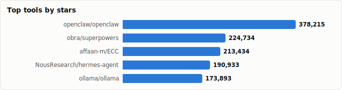
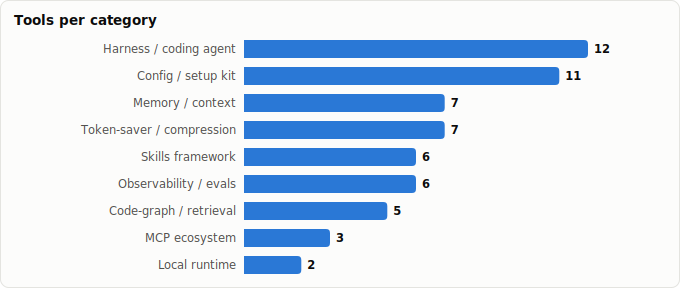

# Claude Code Superpowers — Setup Strategies from Your Stars

> Derived from **kaiser-data**'s 1,327 starred repos (snapshot `2026-07-13T08:42:30.177Z`), cross-referenced with the repo-similarity graph (1,327 nodes / 4,302 edges, 26 communities).
>
> Generated 2026-07-19 by `scripts/reports/claude_code_setups.py` (regenerate any time — no API cost).

## The big idea

A modern Claude Code setup is **layered**, and the 2026 superpower is *on-demand context*, not a big always-loaded instruction blob. A harness runs the loop; **skills** and config shape behavior only when triggered; **memory** persists context across sessions; **token-savers** compress what the model sees; **code-graph/retrieval** feeds it the right code; **MCP** adds reach; **observability** measures it; **local runtimes** cut cost. Your stars already contain a best-in-class tool for every one of those layers — this report assembles them into three ready-to-run strategies.

## Three setup strategies (built from your stars)

| Layer | 🟢 Token-saver | 🟡 Balanced (recommended) | 🔴 Max-performance |
|---|---|---|---|
| **Harness** | `claude-code` (Sonnet) | `claude-code` (Sonnet→Opus on hard tasks) | `claude-code` (Opus) + `cc-switch` to model-shop |
| **Skills** | `caveman` (trim) + 1–2 essentials | `obra/superpowers` + `anthropics/skills` | `superpowers` + `wshobson/agents` + vertical packs |
| **Config** | one lean `CLAUDE.md` (karpathy-skills) | `claude-code-templates` (configure+monitor) | `gstack` / `centminmod` full kit |
| **Memory** | off / minimal | `claude-mem` (you run this) | `claude-mem` + `mem0` backend |
| **Token-saver** | `rtk` proxy + `semble` search + `headroom` | `semble` for code search; `codeburn` to watch spend | `codeburn` dashboard; spend where it pays |
| **Code-graph** | `graphify` (AST, no API) | `graphify` / `codegraph` | `codegraph` + `codebase-memory-mcp` |
| **MCP** | none global | `context7` (live docs) | `context7` + curated from `awesome-mcp-servers` |
| **Observability** | skip | `langfuse` (you wire this) | `langfuse` + `opik`/`phoenix` evals |
| **Local runtime** | `ollama` for grunt work | `litellm` gateway, escalate to cloud | cloud frontier; `litellm` for fallback |

**One-line verdict:** the *token-saver* and *max-performance* columns share the same backbone — a lean harness, on-demand skills, and a clean context. They differ mainly in *model tier* and *how many measurement/eval layers* you bolt on. The expensive mistake is the same in both: front-loading instructions the model only half-reads.

## Executive summary

- **55 Claude-Code 'superpower' projects** in your stars (**4,326,462★** combined), spanning 9 setup layers:
  - **Harness / coding agent** (12): `openclaw`, `hermes-agent`, `opencode`, `claude-code`, `gemini-cli`, `codex`, `deer-flow`, `pi`, `cline`, `ruflo`, `goose`, `oh-my-claudecode`
  - **Skills framework** (6): `superpowers`, `ECC`, `skills`, `awesome-claude-skills`, `agents`, `scientific-agent-skills`
  - **Config / setup kit** (11): `andrej-karpathy-skills`, `system-prompts-and-models-of-ai-tools`, `gstack`, `cc-switch`, `claude-code-best-practice`, `awesome-claude-code`, `claude-cookbooks`, `claude-howto`, `claude-code-templates`, `claude-code-system-prompts`, `my-claude-code-setup`
  - **Memory / context** (7): `claude-mem`, `mem0`, `mempalace`, `memvid`, `engram`, `byterover-cli`, `Acontext`
  - **Token-saver / compression** (6): `caveman`, `rtk`, `oh-my-openagent`, `toon`, `codeburn`, `semble`
  - **Code-graph / retrieval** (4): `Understand-Anything`, `codegraph`, `GitNexus`, `codebase-memory-mcp`
  - **MCP ecosystem** (3): `awesome-mcp-servers`, `servers`, `context7`
  - **Observability / evals** (4): `langfuse`, `opik`, `phoenix`, `openllmetry`
  - **Local runtime** (2): `ollama`, `litellm`
- **Skills are the leverage point.** `obra/superpowers` (the most-starred repo in this whole set) and `anthropics/skills` replace most always-on `CLAUDE.md` prose with on-demand expertise — cheaper *and* sharper.
- **Token-saving is now a stack, not a setting.** A proxy (`rtk`), a leaner code-search (`semble`, ~98% fewer tokens than reading files), output compression (`headroom`), and a spend dashboard (`codeburn`) compose into 60–90% reductions on real dev loops.
- **You already run three layers well** — `claude-mem` (memory), `graphify` (code-graph), and `langfuse` (observability) — plus `context7` over MCP. The gap is a **skills framework** and a deliberate **model-tier policy**.

## The setup, layer by layer

| Layer | What it buys you | Your starred picks |
|---|---|---|
| **Harness / coding agent** | The agent loop itself | `openclaw`, `hermes-agent`, `opencode`, `claude-code`, `gemini-cli`, `codex` |
| **Skills framework** | On-demand expertise (the modern superpower) | `superpowers`, `ECC`, `skills`, `awesome-claude-skills`, `agents`, `scientific-agent-skills` |
| **Config / setup kit** | Shape behavior up front, cheaply | `andrej-karpathy-skills`, `system-prompts-and-models-of-ai-tools`, `gstack`, `cc-switch`, `claude-code-best-practice`, `awesome-claude-code` |
| **Memory / context** | Persist context across sessions | `claude-mem`, `mem0`, `mempalace`, `memvid`, `engram`, `byterover-cli` |
| **Token-saver / compression** | Shrink what the model has to read | `caveman`, `rtk`, `oh-my-openagent`, `toon`, `codeburn`, `semble` |
| **Code-graph / retrieval** | Feed the *right* code, not all of it | `Understand-Anything`, `codegraph`, `GitNexus`, `codebase-memory-mcp` |
| **MCP ecosystem** | External reach (docs, tools, data) | `awesome-mcp-servers`, `servers`, `context7` |
| **Observability / evals** | Measure cost & quality | `langfuse`, `opik`, `phoenix`, `openllmetry` |
| **Local runtime** | Cut cost / go offline | `ollama`, `litellm` |

## Master comparison

Sorted by stars. `Health`/`Lifecycle` are the dataset's computed metrics; `Activity` is derived from days-since-push + 90-day commits.

| Tool | Layer | Lang | License | ★ Stars | Lifecycle | Health | Activity | Last push | Age | Contrib(90d) |
|---|---|---|---|---|---|---|---|---|---|---|
| [openclaw/openclaw](https://github.com/openclaw/openclaw) | Harness / coding agent | TypeScript | NOASSERTION | 382,751 (▲4,536) | Hot | 79 | very active | 0d ago | 7mo | 10 |
| [obra/superpowers](https://github.com/obra/superpowers) | Skills framework | Shell | MIT | 253,346 (▲28,612) | Hot | 78 | very active | 3d ago | 9mo | 3 |
| [affaan-m/ECC](https://github.com/affaan-m/ECC) | Skills framework | JavaScript | MIT | 229,056 (▲15,622) | Hot | 90 | very active | 0d ago | 5mo | 35 |
| [NousResearch/hermes-agent](https://github.com/NousResearch/hermes-agent) | Harness / coding agent | Python | MIT | 213,952 (▲23,019) | Hot | 79 | very active | 0d ago | 11mo | 20 |
| [multica-ai/andrej-karpathy-skills](https://github.com/multica-ai/andrej-karpathy-skills) | Config / setup kit | — | — | 191,371 (▲17,891) | Mature | 39 | slowing | 2mo ago | 5mo | 3 |
| [anomalyco/opencode](https://github.com/anomalyco/opencode) | Harness / coding agent | TypeScript | MIT | 185,240 (▲12,040) | Hot | 88 | very active | 0d ago | 1.2y | 13 |
| [ollama/ollama](https://github.com/ollama/ollama) | Local runtime | Go | MIT | 176,020 (▲2,127) | Classic | 88 | very active | 3d ago | 3.0y | 17 |
| [anthropics/skills](https://github.com/anthropics/skills) | Skills framework | Python | — | 160,695 (▲11,208) | Rising | 45 | active | 12d ago | 9mo | 4 |
| [x1xhlol/system-prompts-and-models-of-ai-tools](https://github.com/x1xhlol/system-prompts-and-models-of-ai-tools) | Config / setup kit | — | GPL-3.0 | 141,862 (▲2,023) | Mature | 52 | very active | 1d ago | 1.4y | 4 |
| [anthropics/claude-code](https://github.com/anthropics/claude-code) | Harness / coding agent | Python | — | 137,635 (▲5,839) | Hot | 77 | very active | 2d ago | 1.4y | 11 |
| [garrytan/gstack](https://github.com/garrytan/gstack) | Config / setup kit | TypeScript | MIT | 121,545 (▲12,334) | Rising | 59 | very active | 3d ago | 4mo | 1 |
| [farion1231/cc-switch](https://github.com/farion1231/cc-switch) | Config / setup kit | Rust | MIT | 116,545 (▲18,066) | Hot | 76 | very active | 1d ago | 11mo | 23 |
| [google-gemini/gemini-cli](https://github.com/google-gemini/gemini-cli) | Harness / coding agent | TypeScript | Apache-2.0 | 105,947 (▲776) | Hot | 99 | very active | 0d ago | 1.2y | 33 |
| [openai/codex](https://github.com/openai/codex) | Harness / coding agent | Rust | Apache-2.0 | 97,544 (▲7,086) | Hot | 95 | very active | 0d ago | 1.2y | 30 |
| [punkpeye/awesome-mcp-servers](https://github.com/punkpeye/awesome-mcp-servers) | MCP ecosystem | — | MIT | 90,672 (▲1,785) | Hot | 65 | very active | 0d ago | 1.6y | 3 |
| [JuliusBrussee/caveman](https://github.com/JuliusBrussee/caveman) | Token-saver / compression | JavaScript | MIT | 88,727 (▲17,212) | Hot | 73 | very active | 10d ago | 3mo | 10 |
| [modelcontextprotocol/servers](https://github.com/modelcontextprotocol/servers) | MCP ecosystem | TypeScript | NOASSERTION | 88,390 (▲1,320) | Hot | 77 | very active | 3d ago | 1.6y | 15 |
| [thedotmack/claude-mem](https://github.com/thedotmack/claude-mem) | Memory / context | JavaScript | Apache-2.0 | 87,012 (▲5,194) | Rising | 79 | very active | 0d ago | 10mo | 1 |
| [bytedance/deer-flow](https://github.com/bytedance/deer-flow) | Harness / coding agent | Python | MIT | 76,889 (▲5,901) | Hot | 79 | very active | 0d ago | 1.2y | 24 |
| [Egonex-AI/Understand-Anything](https://github.com/Egonex-AI/Understand-Anything) | Code-graph / retrieval | TypeScript | MIT | 73,707 (▲16,362) | Hot | 81 | very active | 0d ago | 4mo | 16 |
| [rtk-ai/rtk](https://github.com/rtk-ai/rtk) | Token-saver / compression | Rust | Apache-2.0 | 70,662 (▲9,191) | Hot | 78 | very active | 4d ago | 5mo | 11 |
| [earendil-works/pi](https://github.com/earendil-works/pi) | Harness / coding agent | TypeScript | MIT | 70,188 (▲8,410) | Hot | 85 | very active | 0d ago | 11mo | 16 |
| [ComposioHQ/awesome-claude-skills](https://github.com/ComposioHQ/awesome-claude-skills) | Skills framework | Python | — | 67,583 (▲3,390) | Rising | 62 | active | 1mo ago | 8mo | 17 |
| [code-yeongyu/oh-my-openagent](https://github.com/code-yeongyu/oh-my-openagent) | Token-saver / compression | TypeScript | NOASSERTION | 65,655 (▲3,730) | Hot | 78 | very active | 0d ago | 7mo | 4 |
| [cline/cline](https://github.com/cline/cline) | Harness / coding agent | TypeScript | Apache-2.0 | 64,590 (▲1,531) | Mature | 83 | very active | 0d ago | 2.0y | 15 |
| [ruvnet/ruflo](https://github.com/ruvnet/ruflo) | Harness / coding agent | TypeScript | MIT | 64,230 (▲5,237) | Mature | 76 | very active | 0d ago | 1.1y | 2 |
| [shanraisshan/claude-code-best-practice](https://github.com/shanraisshan/claude-code-best-practice) | Config / setup kit | HTML | MIT | 62,502 (▲5,056) | Rising | 65 | very active | 0d ago | 8mo | 2 |
| [mem0ai/mem0](https://github.com/mem0ai/mem0) | Memory / context | TypeScript | Apache-2.0 | 60,706 (▲2,345) | Classic | 89 | very active | 2d ago | 3.1y | 37 |
| [colbymchenry/codegraph](https://github.com/colbymchenry/codegraph) | Code-graph / retrieval | TypeScript | MIT | 59,541 (▲12,119) | Hot | 78 | very active | 0d ago | 5mo | 4 |
| [upstash/context7](https://github.com/upstash/context7) | MCP ecosystem | TypeScript | MIT | 59,013 (▲1,824) | Hot | 84 | very active | 3d ago | 1.3y | 17 |
| [MemPalace/mempalace](https://github.com/MemPalace/mempalace) | Memory / context | Python | MIT | 57,268 (▲1,884) | Hot | 81 | very active | 3d ago | 3mo | 22 |
| [BerriAI/litellm](https://github.com/BerriAI/litellm) | Local runtime | Python | NOASSERTION | 53,406 (▲3,324) | Mature | 84 | very active | 0d ago | 3.0y | 11 |
| [aaif-goose/goose](https://github.com/aaif-goose/goose) | Harness / coding agent | Rust | Apache-2.0 | 51,138 (▲2,251) | Hot | 99 | very active | 0d ago | 1.9y | 40 |
| [hesreallyhim/awesome-claude-code](https://github.com/hesreallyhim/awesome-claude-code) | Config / setup kit | Python | NOASSERTION | 49,901 (▲3,692) | Mature | 61 | very active | 0d ago | 1.2y | 2 |
| [anthropics/claude-cookbooks](https://github.com/anthropics/claude-cookbooks) | Config / setup kit | Jupyter Notebook | MIT | 48,633 (▲3,328) | Mature | 72 | very active | 3d ago | 2.9y | 18 |
| [abhigyanpatwari/GitNexus](https://github.com/abhigyanpatwari/GitNexus) | Code-graph / retrieval | TypeScript | NOASSERTION | 44,046 (▲2,086) | Hot | 83 | very active | 1d ago | 11mo | 18 |
| [luongnv89/claude-howto](https://github.com/luongnv89/claude-howto) | Config / setup kit | Python | MIT | 39,753 (▲2,883) | Hot | 72 | very active | 2d ago | 8mo | 12 |
| [wshobson/agents](https://github.com/wshobson/agents) | Skills framework | Python | MIT | 37,852 (▲1,215) | Hot | 65 | very active | 0d ago | 11mo | 17 |
| [Yeachan-Heo/oh-my-claudecode](https://github.com/Yeachan-Heo/oh-my-claudecode) | Harness / coding agent | TypeScript | MIT | 37,719 (▲1,498) | Hot | 80 | very active | 0d ago | 6mo | 18 |
| [langfuse/langfuse](https://github.com/langfuse/langfuse) | Observability / evals | TypeScript | NOASSERTION | 31,012 (▲2,083) | Classic | 94 | very active | 0d ago | 3.2y | 19 |
| [DeusData/codebase-memory-mcp](https://github.com/DeusData/codebase-memory-mcp) | Code-graph / retrieval | C | MIT | 30,797 (▲27,480) | Hot | 77 | very active | 0d ago | 4mo | 3 |
| [K-Dense-AI/scientific-agent-skills](https://github.com/K-Dense-AI/scientific-agent-skills) | Skills framework | Python | MIT | 30,793 (▲2,820) | Hot | 77 | very active | 4d ago | 8mo | 9 |
| [davila7/claude-code-templates](https://github.com/davila7/claude-code-templates) | Config / setup kit | Python | MIT | 29,325 (▲1,365) | Hot | 80 | very active | 0d ago | 1.0y | 14 |
| [toon-format/toon](https://github.com/toon-format/toon) | Token-saver / compression | TypeScript | MIT | 24,844 (▲310) | Hot | 70 | active | 1mo ago | 8mo | 6 |
| [comet-ml/opik](https://github.com/comet-ml/opik) | Observability / evals | Python | Apache-2.0 | 20,575 (▲996) | Classic | 94 | very active | 0d ago | 3.2y | 22 |
| [memvid/memvid](https://github.com/memvid/memvid) | Memory / context | Rust | Apache-2.0 | 15,750 (▲108) | Declining | 63 | active | 2d ago | 1.1y | 2 |
| [Piebald-AI/claude-code-system-prompts](https://github.com/Piebald-AI/claude-code-system-prompts) | Config / setup kit | JavaScript | MIT | 11,790 (▲838) | Rising | 77 | very active | 2d ago | 7mo | 1 |
| [Arize-ai/phoenix](https://github.com/Arize-ai/phoenix) | Observability / evals | Python | NOASSERTION | 10,528 (▲428) | Classic | 79 | very active | 0d ago | 3.7y | 13 |
| [getagentseal/codeburn](https://github.com/getagentseal/codeburn) | Token-saver / compression | TypeScript | MIT | 8,636 (▲757) | Hot | 78 | very active | 3d ago | 3mo | 12 |
| [traceloop/openllmetry](https://github.com/traceloop/openllmetry) | Observability / evals | Python | Apache-2.0 | 7,293 (▲103) | Mature | 72 | very active | 2d ago | 2.9y | 11 |
| [MinishLab/semble](https://github.com/MinishLab/semble) | Token-saver / compression | Python | MIT | 5,595 (▲525) | Hot | 78 | very active | 5d ago | 3mo | 7 |
| [Gentleman-Programming/engram](https://github.com/Gentleman-Programming/engram) | Memory / context | Go | MIT | 5,237 (▲945) | Hot | 77 | very active | 5d ago | 4mo | 6 |
| [campfirein/byterover-cli](https://github.com/campfirein/byterover-cli) | Memory / context | TypeScript | NOASSERTION | 4,916 (▲72) | Hot | 83 | very active | 18d ago | 1.1y | 8 |
| [memodb-io/Acontext](https://github.com/memodb-io/Acontext) | Memory / context | JavaScript | Apache-2.0 | 3,575 (▲51) | Declining | 60 | active | 13d ago | 12mo | 1 |
| [centminmod/my-claude-code-setup](https://github.com/centminmod/my-claude-code-setup) | Config / setup kit | Python | MIT | 2,504 (▲93) | Mature | 60 | very active | 0d ago | 1.0y | 1 |

## By layer

### Harness / coding agent

_The loop that reads, plans, edits, and runs. Pick one as your daily driver; keep a second installed to diff behavior and model-shop._

- **[openclaw/openclaw](https://github.com/openclaw/openclaw)** · 382,751★ · TypeScript · Hot  
  Cross-platform personal-assistant harness — an 'any OS, any platform' agent runtime.  
  topics: ai, assistant, own-your-data, personal, crustacean, molty, openclaw
- **[NousResearch/hermes-agent](https://github.com/NousResearch/hermes-agent)** · 213,952★ · Python · Hot  
  Long-lived 'agent that grows with you' harness — persistent, personalized agent loop.  
  topics: ai, ai-agent, ai-agents, llm, anthropic, chatgpt, claude, claude-code
- **[anomalyco/opencode](https://github.com/anomalyco/opencode)** · 185,240★ · TypeScript · Hot  
  Open-source terminal coding agent — a provider-agnostic alternative harness.  
  topics: —
- **[anthropics/claude-code](https://github.com/anthropics/claude-code)** · 137,635★ · Python · Hot  
  Claude Code itself — the agentic CLI that lives in your terminal; the baseline every setup here extends.  
  topics: —
- **[google-gemini/gemini-cli](https://github.com/google-gemini/gemini-cli)** · 105,947★ · TypeScript · Hot  
  Gemini's open-source terminal agent — the third major CLI harness; handy for model-shopping.  
  topics: gemini, gemini-api, ai, ai-agents, cli, mcp-client, mcp-server
- **[openai/codex](https://github.com/openai/codex)** · 97,544★ · Rust · Hot  
  OpenAI's lightweight terminal coding agent — useful as a second harness to diff behavior against Claude Code.  
  topics: —
- **[bytedance/deer-flow](https://github.com/bytedance/deer-flow)** · 76,889★ · Python · Hot  
  Long-horizon SuperAgent harness that researches, codes, and writes — multi-step autonomy.  
  topics: agent, agentic, agentic-framework, agentic-workflow, ai, ai-agents, deep-research, langchain
- **[earendil-works/pi](https://github.com/earendil-works/pi)** · 70,188★ · TypeScript · Hot  
  Unified LLM-API + agent-loop + TUI toolkit — a kit for rolling your own coding agent.  
  topics: —
- **[cline/cline](https://github.com/cline/cline)** · 64,590★ · TypeScript · Mature  
  Autonomous coding agent as SDK / IDE extension / CLI — strong for in-editor agentic workflows.  
  topics: —
- **[ruvnet/ruflo](https://github.com/ruvnet/ruflo)** · 64,230★ · TypeScript · Mature  
  Agent meta-harness for Claude — deploys multi-agent swarms with coordination.  
  topics: claude-code, swarm, agentic-ai, agentic-framework, agentic-workflow, autonomous-agents, codex, mcp-server
- **[aaif-goose/goose](https://github.com/aaif-goose/goose)** · 51,138★ · Rust · Hot  
  Extensible open agent that installs and runs tools, not just suggestions — MCP-native.  
  topics: mcp, acp, ai, ai-agents
- **[Yeachan-Heo/oh-my-claudecode](https://github.com/Yeachan-Heo/oh-my-claudecode)** · 37,719★ · TypeScript · Hot  
  Teams-first multi-agent orchestration layer for Claude Code.  
  topics: agentic-coding, ai-agents, claude, claude-code, oh-my-opencode, opencode, vibe-coding, automation

### Skills framework

_The biggest 2026 upgrade. Skills load only when triggered, so they add capability without taxing every session — the opposite of a big always-on CLAUDE.md._

- **[obra/superpowers](https://github.com/obra/superpowers)** · 253,346★ · Shell · Hot  
  Agentic skills framework + dev methodology — the headline 'give your agent superpowers' skill collection.  
  topics: ai, brainstorming, coding, obra, sdlc, skills, superpowers, subagent-driven-development
- **[affaan-m/ECC](https://github.com/affaan-m/ECC)** · 229,056★ · JavaScript · Hot  
  Agent-harness performance system bundling skills, instincts, and memory into one optimization layer.  
  topics: ai-agents, anthropic, claude, claude-code, developer-tools, llm, mcp, productivity
- **[anthropics/skills](https://github.com/anthropics/skills)** · 160,695★ · Python · Rising  
  Anthropic's official Agent Skills repo — canonical examples of the skills format.  
  topics: agent-skills
- **[ComposioHQ/awesome-claude-skills](https://github.com/ComposioHQ/awesome-claude-skills)** · 67,583★ · Python · Rising  
  Curated index of Claude Skills + tooling — the discovery hub for what's worth installing.  
  topics: claude, claude-code, agent-skills, ai-agents, antigravity, automation, codex, composio
- **[wshobson/agents](https://github.com/wshobson/agents)** · 37,852★ · Python · Hot  
  Multi-harness agentic plugin marketplace (Claude Code, Codex, Cursor) — subagents & commands.  
  topics: agents, anthropic, automation, workflows, orchestration, agent-skills, agentic-ai, ai-agents
- **[K-Dense-AI/scientific-agent-skills](https://github.com/K-Dense-AI/scientific-agent-skills)** · 30,793★ · Python · Hot  
  Domain skill pack that turns an agent into a research scientist — example of vertical skills.  
  topics: ai-scientist, bioinformatics, chemoinformatics, claude, claude-skills, claudecode, clinical-research, computational-biology

### Config / setup kit

_Turnkey CLAUDE.md / command / hook bundles. Steal a good one, then trim to what you actually use — bloat here is paid on every prompt._

- **[multica-ai/andrej-karpathy-skills](https://github.com/multica-ai/andrej-karpathy-skills)** · 191,371★ · — · Mature  
  A single CLAUDE.md derived from Karpathy's habits — the 'one good config file' approach.  
  topics: —
- **[x1xhlol/system-prompts-and-models-of-ai-tools](https://github.com/x1xhlol/system-prompts-and-models-of-ai-tools)** · 141,862★ · — · Mature  
  Leaked/collected system prompts of major AI coding tools — prompt-engineering reference.  
  topics: ai, cursor, lovable, system-prompts, v0, cursorai, devin, replit
- **[garrytan/gstack](https://github.com/garrytan/gstack)** · 121,545★ · TypeScript · Rising  
  Garry Tan's exact Claude Code setup — 23 opinionated tools as a turnkey starting point.  
  topics: —
- **[farion1231/cc-switch](https://github.com/farion1231/cc-switch)** · 116,545★ · Rust · Hot  
  Desktop all-in-one for managing Claude Code/Codex/OpenClaw — swap providers & configs fast.  
  topics: ai-tools, claude-code, desktop-app, open-source, rust, tauri, typescript, codex
- **[shanraisshan/claude-code-best-practice](https://github.com/shanraisshan/claude-code-best-practice)** · 62,502★ · HTML · Rising  
  Best-practices collection: vibe-coding → agentic engineering.  
  topics: claude-ai, claude-code, best-practices, claude, claude-code-best-practices, agentic-engineering, anthropic, claude-code-agents
- **[hesreallyhim/awesome-claude-code](https://github.com/hesreallyhim/awesome-claude-code)** · 49,901★ · Python · Mature  
  The awesome-list for Claude Code skills, hooks, slash-commands, and orchestrators.  
  topics: anthropic, anthropic-claude, awesome, awesome-list, awesome-lists, awesome-resources, claude, claude-code
- **[anthropics/claude-cookbooks](https://github.com/anthropics/claude-cookbooks)** · 48,633★ · Jupyter Notebook · Mature  
  Official recipes/notebooks for effective Claude usage patterns.  
  topics: —
- **[luongnv89/claude-howto](https://github.com/luongnv89/claude-howto)** · 39,753★ · Python · Hot  
  Visual, example-driven guide to Claude Code from basics to advanced — the learning path.  
  topics: claude-code, guide, tutorial
- **[davila7/claude-code-templates](https://github.com/davila7/claude-code-templates)** · 29,325★ · Python · Hot  
  CLI to configure AND monitor Claude Code — installs commands/agents/hooks and watches usage.  
  topics: anthropic, anthropic-claude, claude, claude-code
- **[Piebald-AI/claude-code-system-prompts](https://github.com/Piebald-AI/claude-code-system-prompts)** · 11,790★ · JavaScript · Rising  
  Claude Code's full system prompt + 27 builtin tool descriptions — know what you're configuring.  
  topics: claude-code, claude-code-system-prompts, system-prompts
- **[centminmod/my-claude-code-setup](https://github.com/centminmod/my-claude-code-setup)** · 2,504★ · Python · Mature  
  A shared starter CLAUDE.md + memory-bank configuration template you can fork.  
  topics: claude, claude-ai, claude-code, subagents, claudecode-config, claudecode-hooks, claudecode-subagents

### Memory / context

_Persist decisions and context across sessions so the agent doesn't re-derive what it already learned. The backend is swappable._

- **[thedotmack/claude-mem](https://github.com/thedotmack/claude-mem)** · 87,012★ · JavaScript · Rising  
  Persistent context across sessions for every agent — captures work and re-injects it (you run this).  
  topics: ai, ai-agents, ai-memory, anthropic, artificial-intelligence, claude, claude-agent-sdk, claude-agents
- **[mem0ai/mem0](https://github.com/mem0ai/mem0)** · 60,706★ · TypeScript · Classic  
  Universal memory layer for AI agents — the most-adopted general memory backend.  
  topics: ai, chatgpt, llm, python, chatbots, rag, application, long-term-memory
- **[MemPalace/mempalace](https://github.com/MemPalace/mempalace)** · 57,268★ · Python · Hot  
  Best-benchmarked open-source AI memory system — drop-in long-term memory.  
  topics: ai, chromadb, llm, mcp, memory, python
- **[memvid/memvid](https://github.com/memvid/memvid)** · 15,750★ · Rust · Declining  
  Memory layer that replaces RAG pipelines with a compact server — novel storage approach.  
  topics: ai, context, embedded, faiss, knowledge-base, knowledge-graph, llm, machine-learning
- **[Gentleman-Programming/engram](https://github.com/Gentleman-Programming/engram)** · 5,237★ · Go · Hot  
  Agent-agnostic Go binary giving coding agents persistent memory.  
  topics: —
- **[campfirein/byterover-cli](https://github.com/campfirein/byterover-cli)** · 4,916★ · TypeScript · Hot  
  Portable memory layer (brv) for autonomous coding agents — agent-agnostic.  
  topics: agent, llm, mcp, memory, vibe-coding, ai, autonomous-agents, cli
- **[memodb-io/Acontext](https://github.com/memodb-io/Acontext)** · 3,575★ · JavaScript · Declining  
  Treats Agent Skills as a memory layer — skills-as-memory hybrid.  
  topics: agent, context-engineering, data-platform, self-learning, agent-development-kit, ai-agent, llm, memory

### Token-saver / compression

_Measure first (`codeburn`), then compress: leaner code search, output trimming, and a front proxy stack to 60–90% on common loops._

- **[JuliusBrussee/caveman](https://github.com/JuliusBrussee/caveman)** · 88,727★ · JavaScript · Hot  
  'Why use many token when few token do trick' — a Claude Code skill that aggressively trims tokens.  
  topics: ai, anthropic, caveman, claude, claude-code, llm, meme, prompt-engineering
- **[rtk-ai/rtk](https://github.com/rtk-ai/rtk)** · 70,662★ · Rust · Hot  
  CLI proxy that cuts LLM token consumption 60–90% on common dev commands — sits in front of the agent.  
  topics: agentic-coding, ai-coding, anthropic, claude-code, cli, command-line-tool, cost-reduction, developer-tools
- **[code-yeongyu/oh-my-openagent](https://github.com/code-yeongyu/oh-my-openagent)** · 65,655★ · TypeScript · Hot  
  omo/lazycodex — a coding agent built for 'tokenmaxxers'; efficiency-first harness.  
  topics: opencode, ai, anthropic, claude, claude-skills, cursor, gemini, ide
- **[toon-format/toon](https://github.com/toon-format/toon)** · 24,844★ · TypeScript · Hot  
  Token-Oriented Object Notation — compact schema-aware encoding to shrink structured payloads.  
  topics: data-format, llm, serialization, tokenization
- **[getagentseal/codeburn](https://github.com/getagentseal/codeburn)** · 8,636★ · TypeScript · Hot  
  TUI dashboard showing where your AI coding tokens go — measure before you optimize.  
  topics: ai-coding, claude-code, cli, codex, cost-tracking, developer-tools, observability, terminal-ui
- **[MinishLab/semble](https://github.com/MinishLab/semble)** · 5,595★ · Python · Hot  
  Fast, accurate code search for agents using ~98% fewer tokens than reading files.  
  topics: agents, code-search, embeddings, mcp, mcp-server, model-context-protocol, retrieval

### Code-graph / retrieval

_Give the agent structure instead of raw files — graphs and indexes answer 'how does X relate to Y' without scanning the repo._

- **[Egonex-AI/Understand-Anything](https://github.com/Egonex-AI/Understand-Anything)** · 73,707★ · TypeScript · Hot  
  Turns any code into an interactive teaching graph — comprehension over impression.  
  topics: claude-code, claude-skills, understandcode, codex, codex-skills, knowledge-graph, opencode-skills, antigravity-skills
- **[colbymchenry/codegraph](https://github.com/colbymchenry/codegraph)** · 59,541★ · TypeScript · Hot  
  Pre-indexed code knowledge graph for Claude Code/Codex/Cursor — structural retrieval.  
  topics: —
- **[abhigyanpatwari/GitNexus](https://github.com/abhigyanpatwari/GitNexus)** · 44,046★ · TypeScript · Hot  
  Zero-server code-intelligence engine — client-side code graph.  
  topics: —
- **[DeusData/codebase-memory-mcp](https://github.com/DeusData/codebase-memory-mcp)** · 30,797★ · C · Hot  
  High-performance code-intelligence MCP server — indexes codebases for retrieval.  
  topics: claude-code, code-analysis, code-intelligence, developer-tools, knowledge-graph, mcp, mcp-server, model-context-protocol

### MCP ecosystem

_External capabilities via a standard protocol. Each connected server costs context, so connect deliberately — `context7` (live docs) is the highest-ROI default._

- **[punkpeye/awesome-mcp-servers](https://github.com/punkpeye/awesome-mcp-servers)** · 90,672★ · — · Hot  
  The big community index of MCP servers — discovery for what to connect.  
  topics: ai, mcp
- **[modelcontextprotocol/servers](https://github.com/modelcontextprotocol/servers)** · 88,390★ · TypeScript · Hot  
  The official reference MCP servers — the canonical catalog of capabilities to plug in.  
  topics: —
- **[upstash/context7](https://github.com/upstash/context7)** · 59,013★ · TypeScript · Hot  
  Up-to-date library docs for LLMs via MCP — kills 'hallucinated API' errors (you have this wired).  
  topics: llm, mcp, mcp-server, vibe-coding

### Observability / evals

_You can't optimize what you can't see. Trace runs, watch spend, and score outputs before trusting an autonomous setup._

- **[langfuse/langfuse](https://github.com/langfuse/langfuse)** · 31,012★ · TypeScript · Classic  
  Open-source LLM engineering platform: traces, evals, metrics, prompts (you trace Claude Code into this).  
  topics: analytics, llm, llmops, large-language-models, openai, self-hosted, ycombinator, monitoring
- **[comet-ml/opik](https://github.com/comet-ml/opik)** · 20,575★ · Python · Classic  
  Debug/evaluate/monitor LLM apps, RAG, and agents — eval-first observability.  
  topics: open-source, langchain, openai, playground, prompt-engineering, llama-index, llm, llm-evaluation
- **[Arize-ai/phoenix](https://github.com/Arize-ai/phoenix)** · 10,528★ · Python · Classic  
  AI observability & evaluation — OpenTelemetry-based tracing for agents.  
  topics: llmops, ai-monitoring, ai-observability, llm-eval, aiengineering, datasets, agents, llms
- **[traceloop/openllmetry](https://github.com/traceloop/openllmetry)** · 7,293★ · Python · Mature  
  Open-source OpenTelemetry-based observability for LLM apps — standards-based traces.  
  topics: llmops, observability, open-telemetry, metrics, monitoring, opentelemetry, datascience, ml

### Local runtime

_Run open models locally or proxy many models behind one endpoint — the cost floor for grunt work and the fallback when the cloud is down._

- **[ollama/ollama](https://github.com/ollama/ollama)** · 176,020★ · Go · Classic  
  Run open models locally with one command — point an agent at it to slash API cost or go offline.  
  topics: llama, llm, llms, go, golang, ollama, mistral, gemma
- **[BerriAI/litellm](https://github.com/BerriAI/litellm)** · 53,406★ · Python · Mature  
  OpenAI-compatible proxy/gateway to 100+ LLMs — swap models under any harness from one endpoint.  
  topics: anthropic, langchain, llm, llmops, openai, ai-gateway, azure-openai, bedrock

## Graph analysis — how they relate

**Community clustering.** These 55 tools span **16 of the graph's 26 communities** — the Claude-Code ecosystem is spread across agent-framework, memory, retrieval, and observability neighborhoods rather than forming one tidy cluster.

- **Community 18** (10): `openclaw/openclaw`, `cline/cline`, `NousResearch/hermes-agent`, `Yeachan-Heo/oh-my-claudecode`, `centminmod/my-claude-code-setup`, `davila7/claude-code-templates`, `langfuse/langfuse`, `comet-ml/opik`, `Arize-ai/phoenix`, `BerriAI/litellm`
- **Community 8** (10): `affaan-m/ECC`, `ComposioHQ/awesome-claude-skills`, `wshobson/agents`, `garrytan/gstack`, `thedotmack/claude-mem`, `campfirein/byterover-cli`, `JuliusBrussee/caveman`, `rtk-ai/rtk`, `getagentseal/codeburn`, `DeusData/codebase-memory-mcp`
- **Community 16** (9): `earendil-works/pi`, `ruvnet/ruflo`, `K-Dense-AI/scientific-agent-skills`, `luongnv89/claude-howto`, `hesreallyhim/awesome-claude-code`, `Piebald-AI/claude-code-system-prompts`, `code-yeongyu/oh-my-openagent`, `colbymchenry/codegraph`, `Egonex-AI/Understand-Anything`
- **Community 1** (6): `google-gemini/gemini-cli`, `aaif-goose/goose`, `obra/superpowers`, `x1xhlol/system-prompts-and-models-of-ai-tools`, `MemPalace/mempalace`, `punkpeye/awesome-mcp-servers`
- **Community 3** (4): `anthropics/claude-code`, `anthropics/skills`, `multica-ai/andrej-karpathy-skills`, `anthropics/claude-cookbooks`
- **Community 7** (3): `bytedance/deer-flow`, `mem0ai/mem0`, `memodb-io/Acontext`
- **Community 4** (2): `Gentleman-Programming/engram`, `traceloop/openllmetry`
- **Community 20** (2): `toon-format/toon`, `ollama/ollama`
- **Community 15** (2): `MinishLab/semble`, `upstash/context7`

**Centrality (PageRank in the full 1,327-repo graph)** — the most 'hub-like' setup tools in your ecosystem:

- `affaan-m/ECC` — PageRank 0.0022
- `davila7/claude-code-templates` — PageRank 0.0016
- `MemPalace/mempalace` — PageRank 0.0015
- `comet-ml/opik` — PageRank 0.0015
- `hesreallyhim/awesome-claude-code` — PageRank 0.0015
- `punkpeye/awesome-mcp-servers` — PageRank 0.0014
- `wshobson/agents` — PageRank 0.0013
- `code-yeongyu/oh-my-openagent` — PageRank 0.0012
- `ComposioHQ/awesome-claude-skills` — PageRank 0.0012
- `upstash/context7` — PageRank 0.0010

**Direct links between these tools** (top similarity edges where both endpoints are in this report):

- `anthropics/skills` ⇄ `anthropics/claude-code` (w=0.693) — authors: williamqian12
- `anthropics/claude-cookbooks` ⇄ `anthropics/claude-code` (w=0.648) — authors: claude, jportner-ant
- `anthropics/claude-cookbooks` ⇄ `anthropics/skills` (w=0.595) — authors: rlancemartin
- `langfuse/langfuse` ⇄ `comet-ml/opik` (w=0.574) — topics: llm, llmops, openai, open-source; authors: dependabot[bot]
- `aaif-goose/goose` ⇄ `punkpeye/awesome-mcp-servers` (w=0.500) — topics: mcp, ai
- `hesreallyhim/awesome-claude-code` ⇄ `davila7/claude-code-templates` (w=0.394) — topics: anthropic, anthropic-claude, claude, claude-code; authors: github-actions[bot]
- `JuliusBrussee/caveman` ⇄ `davila7/claude-code-templates` (w=0.360) — topics: anthropic, claude, claude-code; authors: github-actions[bot]
- `JuliusBrussee/caveman` ⇄ `hesreallyhim/awesome-claude-code` (w=0.342) — topics: anthropic, claude, claude-code, llm; authors: github-actions[bot]
- `MemPalace/mempalace` ⇄ `punkpeye/awesome-mcp-servers` (w=0.333) — topics: ai, mcp
- `wshobson/agents` ⇄ `ComposioHQ/awesome-claude-skills` (w=0.326) — topics: automation, agent-skills, ai-agents, cursor
- `rtk-ai/rtk` ⇄ `affaan-m/ECC` (w=0.313) — topics: anthropic, claude-code, developer-tools, llm
- `hesreallyhim/awesome-claude-code` ⇄ `K-Dense-AI/scientific-agent-skills` (w=0.309) — topics: claude, agent-skills; authors: github-actions[bot]
- `NousResearch/hermes-agent` ⇄ `code-yeongyu/oh-my-openagent` (w=0.292) — topics: ai, ai-agents, anthropic, chatgpt
- `davila7/claude-code-templates` ⇄ `centminmod/my-claude-code-setup` (w=0.272) — topics: claude, claude-code
- `MemPalace/mempalace` ⇄ `campfirein/byterover-cli` (w=0.267) — topics: ai, llm, mcp, memory
- …and 12 more.

## Maintenance & risk signal

Bus factor = commit concentration (1 = single-maintainer risk). This ecosystem moves fast and a lot of it is one-person projects — check before wiring one into your daily loop.

| Tool | Health | Lifecycle | Activity | Bus factor | Top-author share | Releases |
|---|---|---|---|---|---|---|
| google-gemini/gemini-cli | 99 | Hot | very active | 6 | 17% | 543 |
| aaif-goose/goose | 99 | Hot | very active | 6 | 18% | 141 |
| openai/codex | 95 | Hot | very active | 5 | 23% | 910 |
| langfuse/langfuse | 94 | Classic | very active | 4 | 17% | 614 |
| comet-ml/opik | 94 | Classic | very active | 4 | 19% | 517 |
| affaan-m/ECC | 90 | Hot | very active | 3 | 35% | 14 |
| mem0ai/mem0 | 89 | Classic | very active | 3 | 32% | 356 |
| anomalyco/opencode | 88 | Hot | very active | 3 | 31% | 835 |
| ollama/ollama | 88 | Classic | very active | 3 | 28% | 231 |
| earendil-works/pi | 85 | Hot | very active | 2 | 44% | 243 |
| upstash/context7 | 84 | Hot | very active | 2 | 39% | 93 |
| BerriAI/litellm | 84 | Mature | very active | 2 | 31% | 1398 |
| cline/cline | 83 | Mature | very active | 2 | 46% | 312 |
| campfirein/byterover-cli | 83 | Hot | very active | 2 | 27% | 27 |
| abhigyanpatwari/GitNexus | 83 | Hot | very active | 2 | 36% | 560 |
| MemPalace/mempalace | 81 | Hot | very active | 2 | 46% | 12 |
| Egonex-AI/Understand-Anything | 81 | Hot | very active | 2 | 46% | 8 |
| Yeachan-Heo/oh-my-claudecode | 80 | Hot | very active | 1 | 52% | 238 |
| davila7/claude-code-templates | 80 | Hot | very active | 2 | 44% | 19 |
| openclaw/openclaw | 79 | Hot | very active | 1 | 82% | 222 |
| NousResearch/hermes-agent | 79 | Hot | very active | 2 | 44% | 21 |
| bytedance/deer-flow | 79 | Hot | very active | 4 | 20% | 1 |
| thedotmack/claude-mem | 79 | Rising | very active | 1 | 100% | 297 |
| Arize-ai/phoenix | 79 | Classic | very active | 1 | 68% | 745 |
| obra/superpowers | 78 | Hot | very active | 1 | 69% | 10 |
| rtk-ai/rtk | 78 | Hot | very active | 2 | 36% | 242 |
| code-yeongyu/oh-my-openagent | 78 | Hot | very active | 1 | 95% | 217 |
| getagentseal/codeburn | 78 | Hot | very active | 1 | 72% | 40 |
| MinishLab/semble | 78 | Hot | very active | 1 | 66% | 21 |
| colbymchenry/codegraph | 78 | Hot | very active | 1 | 84% | 29 |
| anthropics/claude-code | 77 | Hot | very active | 1 | 82% | 165 |
| K-Dense-AI/scientific-agent-skills | 77 | Hot | very active | 1 | 79% | 91 |
| Piebald-AI/claude-code-system-prompts | 77 | Rising | very active | 1 | 100% | 182 |
| Gentleman-Programming/engram | 77 | Hot | very active | 1 | 91% | 97 |
| DeusData/codebase-memory-mcp | 77 | Hot | very active | 1 | 81% | 36 |
| modelcontextprotocol/servers | 77 | Hot | very active | 2 | 47% | 26 |
| ruvnet/ruflo | 76 | Mature | very active | 1 | 98% | 1571 |
| farion1231/cc-switch | 76 | Hot | very active | 1 | 74% | 45 |
| JuliusBrussee/caveman | 73 | Hot | very active | 1 | 78% | 16 |
| luongnv89/claude-howto | 72 | Hot | very active | 1 | 68% | 10 |
| anthropics/claude-cookbooks | 72 | Mature | very active | 4 | 18% | 0 |
| traceloop/openllmetry | 72 | Mature | very active | 1 | 50% | 260 |
| toon-format/toon | 70 | Hot | active | 1 | 86% | 27 |
| wshobson/agents | 65 | Hot | very active | 1 | 54% | 0 |
| shanraisshan/claude-code-best-practice | 65 | Rising | very active | 1 | 93% | 0 |
| punkpeye/awesome-mcp-servers | 65 | Hot | very active | 1 | 98% | 0 |
| memvid/memvid | 63 | Declining | active | 1 | 75% | 12 |
| ComposioHQ/awesome-claude-skills | 62 | Rising | active | 6 | 27% | 0 |
| hesreallyhim/awesome-claude-code | 61 | Mature | very active | 1 | 93% | 0 |
| centminmod/my-claude-code-setup | 60 | Mature | very active | 1 | 100% | 0 |
| memodb-io/Acontext | 60 | Declining | active | 1 | 100% | 279 |
| garrytan/gstack | 59 | Rising | very active | 1 | 100% | 0 |
| x1xhlol/system-prompts-and-models-of-ai-tools | 52 | Mature | very active | 1 | 58% | 0 |
| anthropics/skills | 45 | Rising | active | 1 | 80% | 0 |
| multica-ai/andrej-karpathy-skills | 39 | Mature | slowing | 1 | 50% | 0 |

## Adjacent (deliberately not listed here)

- **n8n-io/n8n** (196,233★) — workflow-automation platform — orchestrates agents but isn't a Claude-Code setup layer
- **langgenius/dify** (148,658★) — agentic-workflow platform — covered by the agent-orchestration report
- **langchain-ai/langchain** (141,640★) — agent-engineering library — app framework, not a CC setup tool
- **open-webui/open-webui** (145,220★) — chat UI for local models — a frontend, not an agent setup
- **ultraworkers/claw-code** (194,748★) — art/exhibit harness — not a practical setup layer
- **multica-ai/multica** (40,056★) — managed-agents platform — team product, see agent-orchestration report

## Methodology & caveats

- **Source**: `data/classified.json` + `public/data/graph.json`. No external calls; fully reproducible.
- **Selection**: keyword scan (claude-code / skill / agent harness / mcp / memory / token / observability / code-graph / setup) across name+description+topics, then manual curation into the nine setup layers. General agent *application* frameworks, chat UIs, and broad platforms were routed to adjacent reports or excluded (see above).
- **The three-strategy table is opinionated**, built only from repos in your stars — it is a starting point, not a benchmark. Validate model-tier and token-saver claims against your own `langfuse`/`codeburn` traces.
- **Metrics** (health, lifecycle, bus_factor) are precomputed at snapshot time and may lag GitHub's current state.

Tools covered: 55 · Snapshot: 2026-07-13T08:42:30.177Z
