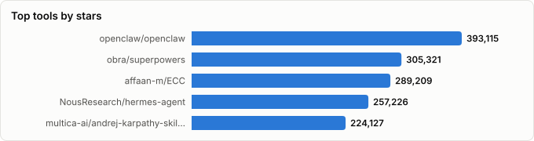
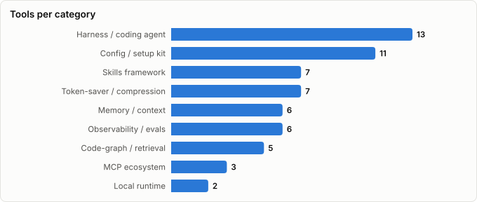

# Claude Code Superpowers — Setup Strategies from Your Stars

> Derived from **kaiser-data**'s 2,415 starred repos (snapshot `2026-10-26T11:46:04.025Z`), cross-referenced with the repo-similarity graph (2,415 nodes / 8,024 edges, 43 communities).
>
> Generated 2026-10-26 by `scripts/reports/claude_code_setups.py` (regenerate any time — no API cost).

## The big idea

A modern Claude Code setup is **layered**, and the 2026 superpower is *on-demand context*, not a big always-loaded instruction blob. A harness runs the loop; **skills** and config shape behavior only when triggered; **memory** persists context across sessions; **token-savers** compress what the model sees; **code-graph/retrieval** feeds it the right code; **MCP** adds reach; **observability** measures it; **local runtimes** cut cost. Your stars already contain a best-in-class tool for every one of those layers — this report assembles them into three ready-to-run strategies.

## Three setup strategies (built from your stars)

| Layer | 🟢 Token-saver | 🟡 Balanced (recommended) | 🔴 Max-performance |
|---|---|---|---|
| **Harness** | `claude-code` (Sonnet) | `claude-code` (Sonnet→Opus on hard tasks) | `claude-code` (Opus) + `cc-switch` to model-shop |
| **Skills** | `caveman` (trim) + 1–2 essentials | `obra/superpowers` + `anthropics/skills` | `superpowers` + `wshobson/agents` + vertical packs |
| **Config** | one lean `CLAUDE.md` (karpathy-skills) | `claude-code-templates` (configure+monitor) | `gstack` / `centminmod` full kit |
| **Memory** | off / minimal | `claude-mem` (you run this) | `claude-mem` + `mem0` backend |
| **Token-saver** | `rtk` proxy + `semble` search + `headroom` | `semble` for code search; `codeburn` to watch spend | `codeburn` dashboard; spend where it pays |
| **Code-graph** | `graphify` (AST, no API) | `graphify` / `codegraph` | `codegraph` + `codebase-memory-mcp` |
| **MCP** | none global | `context7` (live docs) | `context7` + curated from `awesome-mcp-servers` |
| **Observability** | skip | `langfuse` (you wire this) | `langfuse` + `opik`/`phoenix` evals |
| **Local runtime** | `ollama` for grunt work | `litellm` gateway, escalate to cloud | cloud frontier; `litellm` for fallback |

**One-line verdict:** the *token-saver* and *max-performance* columns share the same backbone — a lean harness, on-demand skills, and a clean context. They differ mainly in *model tier* and *how many measurement/eval layers* you bolt on. The expensive mistake is the same in both: front-loading instructions the model only half-reads.

## Executive summary

- **60 Claude-Code 'superpower' projects** in your stars (**5,327,272★** combined), spanning 9 setup layers:
  - **Harness / coding agent** (13): `openclaw`, `hermes-agent`, `opencode`, `claude-code`, `codex`, `pi`, `gemini-cli`, `deer-flow`, `ruflo`, `learn-claude-code`, `cline`, `goose`, `oh-my-claudecode`
  - **Skills framework** (7): `superpowers`, `ECC`, `skills`, `awesome-claude-skills`, `scientific-agent-skills`, `agents`, `claude-skills`
  - **Config / setup kit** (11): `andrej-karpathy-skills`, `cc-switch`, `system-prompts-and-models-of-ai-tools`, `gstack`, `claude-code-best-practice`, `awesome-claude-code`, `claude-cookbooks`, `claude-howto`, `claude-code-templates`, `claude-code-system-prompts`, `my-claude-code-setup`
  - **Memory / context** (6): `claude-mem`, `mem0`, `mempalace`, `memvid`, `engram`, `basic-memory`
  - **Token-saver / compression** (7): `caveman`, `rtk`, `headroom`, `oh-my-openagent`, `toon`, `codeburn`, `semble`
  - **Code-graph / retrieval** (5): `graphify`, `Understand-Anything`, `codegraph`, `GitNexus`, `codebase-memory-mcp`
  - **MCP ecosystem** (3): `awesome-mcp-servers`, `servers`, `context7`
  - **Observability / evals** (6): `langfuse`, `opik`, `phoenix`, `openllmetry`, `agent-flow`, `Irrlicht`
  - **Local runtime** (2): `ollama`, `litellm`
- **Skills are the leverage point.** `obra/superpowers` (the most-starred repo in this whole set) and `anthropics/skills` replace most always-on `CLAUDE.md` prose with on-demand expertise — cheaper *and* sharper.
- **Token-saving is now a stack, not a setting.** A proxy (`rtk`), a leaner code-search (`semble`, ~98% fewer tokens than reading files), output compression (`headroom`), and a spend dashboard (`codeburn`) compose into 60–90% reductions on real dev loops.
- **You already run three layers well** — `claude-mem` (memory), `graphify` (code-graph), and `langfuse` (observability) — plus `context7` over MCP. The gap is a **skills framework** and a deliberate **model-tier policy**.

## The setup, layer by layer

| Layer | What it buys you | Your starred picks |
|---|---|---|
| **Harness / coding agent** | The agent loop itself | `openclaw`, `hermes-agent`, `opencode`, `claude-code`, `codex`, `pi` |
| **Skills framework** | On-demand expertise (the modern superpower) | `superpowers`, `ECC`, `skills`, `awesome-claude-skills`, `scientific-agent-skills`, `agents` |
| **Config / setup kit** | Shape behavior up front, cheaply | `andrej-karpathy-skills`, `cc-switch`, `system-prompts-and-models-of-ai-tools`, `gstack`, `claude-code-best-practice`, `awesome-claude-code` |
| **Memory / context** | Persist context across sessions | `claude-mem`, `mem0`, `mempalace`, `memvid`, `engram`, `basic-memory` |
| **Token-saver / compression** | Shrink what the model has to read | `caveman`, `rtk`, `headroom`, `oh-my-openagent`, `toon`, `codeburn` |
| **Code-graph / retrieval** | Feed the *right* code, not all of it | `graphify`, `Understand-Anything`, `codegraph`, `GitNexus`, `codebase-memory-mcp` |
| **MCP ecosystem** | External reach (docs, tools, data) | `awesome-mcp-servers`, `servers`, `context7` |
| **Observability / evals** | Measure cost & quality | `langfuse`, `opik`, `phoenix`, `openllmetry`, `agent-flow`, `Irrlicht` |
| **Local runtime** | Cut cost / go offline | `ollama`, `litellm` |

## Master comparison

Sorted by stars. `Health`/`Lifecycle` are the dataset's computed metrics; `Activity` is derived from days-since-push + 90-day commits.

| Tool | Layer | Lang | License | ★ Stars | Lifecycle | Health | Activity | Last push | Age | Contrib(90d) |
|---|---|---|---|---|---|---|---|---|---|---|
| [openclaw/openclaw](https://github.com/openclaw/openclaw) | Harness / coding agent | TypeScript | MIT | 393,115 (▲175) | Hot | 79 | very active | 0d ago | 11mo | 13 |
| [obra/superpowers](https://github.com/obra/superpowers) | Skills framework | Shell | MIT | 305,321 (▲759) | Mature | 64 | active | 3d ago | 1.0y | 1 |
| [affaan-m/ECC](https://github.com/affaan-m/ECC) | Skills framework | JavaScript | MIT | 289,209 (▲1,322) | Hot | 84 | very active | 0d ago | 9mo | 12 |
| [NousResearch/hermes-agent](https://github.com/NousResearch/hermes-agent) | Harness / coding agent | Python | MIT | 257,226 (▲483) | Hot | 75 | very active | 0d ago | 1.3y | 4 |
| [multica-ai/andrej-karpathy-skills](https://github.com/multica-ai/andrej-karpathy-skills) | Config / setup kit | — | — | 224,127 (▲855) | Declining | 19 | stale | 6mo ago | 9mo | 0 |
| [anomalyco/opencode](https://github.com/anomalyco/opencode) | Harness / coding agent | TypeScript | MIT | 221,732 (▲722) | Hot | 84 | very active | 0d ago | 1.5y | 7 |
| [ollama/ollama](https://github.com/ollama/ollama) | Local runtime | Go | MIT | 184,829 (▲190) | Classic | 88 | very active | 0d ago | 3.3y | 12 |
| [anthropics/skills](https://github.com/anthropics/skills) | Skills framework | Python | — | 183,877 (▲412) | Mature | 44 | active | 17d ago | 1.1y | 4 |
| [anthropics/claude-code](https://github.com/anthropics/claude-code) | Harness / coding agent | TypeScript | — | 153,420 (▲155) | Hot | 78 | very active | 1d ago | 1.7y | 8 |
| [farion1231/cc-switch](https://github.com/farion1231/cc-switch) | Config / setup kit | Rust | MIT | 148,850 (▲548) | Hot | 79 | very active | 0d ago | 1.2y | 17 |
| [x1xhlol/system-prompts-and-models-of-ai-tools](https://github.com/x1xhlol/system-prompts-and-models-of-ai-tools) | Config / setup kit | — | GPL-3.0 | 144,265 (▲42) | Mature | 46 | active | 14d ago | 1.6y | 2 |
| [garrytan/gstack](https://github.com/garrytan/gstack) | Config / setup kit | TypeScript | MIT | 137,775 (▲283) | Hot | 64 | very active | 0d ago | 7mo | 3 |
| [Graphify-Labs/graphify](https://github.com/Graphify-Labs/graphify) | Code-graph / retrieval | Python | Apache-2.0 | 135,698 (▲1,401) | Hot | 86 | very active | 3d ago | 6mo | 27 |
| [openai/codex](https://github.com/openai/codex) | Harness / coding agent | Rust | Apache-2.0 | 130,982 (▲191) | Hot | 93 | very active | 3d ago | 1.5y | 33 |
| [earendil-works/pi](https://github.com/earendil-works/pi) | Harness / coding agent | TypeScript | MIT | 117,920 (▲339) | Hot | 90 | very active | 0d ago | 1.2y | 16 |
| [JuliusBrussee/caveman](https://github.com/JuliusBrussee/caveman) | Token-saver / compression | Go | Apache-2.0 | 115,162 (▲382) | Hot | 84 | very active | 0d ago | 6mo | 18 |
| [google-gemini/gemini-cli](https://github.com/google-gemini/gemini-cli) | Harness / coding agent | TypeScript | Apache-2.0 | 108,398 (▲544) | Hot | 95 | very active | 0d ago | 1.5y | 13 |
| [thedotmack/claude-mem](https://github.com/thedotmack/claude-mem) | Memory / context | TypeScript | Apache-2.0 | 103,258 (▲502) | Hot | 80 | very active | 0d ago | 1.2y | 17 |
| [punkpeye/awesome-mcp-servers](https://github.com/punkpeye/awesome-mcp-servers) | MCP ecosystem | — | MIT | 96,884 (▲59) | Mature | 60 | very active | 3d ago | 1.9y | 2 |
| [modelcontextprotocol/servers](https://github.com/modelcontextprotocol/servers) | MCP ecosystem | TypeScript | NOASSERTION | 91,575 (▲31) | Mature | 79 | very active | 1d ago | 1.9y | 2 |
| [Egonex-AI/Understand-Anything](https://github.com/Egonex-AI/Understand-Anything) | Code-graph / retrieval | TypeScript | MIT | 88,341 (▲294) | Hot | 74 | very active | 0d ago | 7mo | 13 |
| [rtk-ai/rtk](https://github.com/rtk-ai/rtk) | Token-saver / compression | Rust | Apache-2.0 | 84,595 (▲144) | Hot | 80 | very active | 0d ago | 9mo | 17 |
| [bytedance/deer-flow](https://github.com/bytedance/deer-flow) | Harness / coding agent | Python | MIT | 84,439 (▲61) | Hot | 87 | very active | 0d ago | 1.5y | 56 |
| [ruvnet/ruflo](https://github.com/ruvnet/ruflo) | Harness / coding agent | TypeScript | MIT | 79,392 (▲426) | Hot | 77 | very active | 0d ago | 1.4y | 15 |
| [shareAI-lab/learn-claude-code](https://github.com/shareAI-lab/learn-claude-code) | Harness / coding agent | Python | MIT | 79,249 (▲96) | Hot | 58 | very active | 28d ago | 1.3y | 13 |
| [ComposioHQ/awesome-claude-skills](https://github.com/ComposioHQ/awesome-claude-skills) | Skills framework | Python | — | 77,974 (▲146) | Declining | 28 | active | 1mo ago | 1.0y | 0 |
| [headroomlabs-ai/headroom](https://github.com/headroomlabs-ai/headroom) | Token-saver / compression | Python | Apache-2.0 | 77,872 (▲161) | Hot | 93 | very active | 2d ago | 9mo | 29 |
| [colbymchenry/codegraph](https://github.com/colbymchenry/codegraph) | Code-graph / retrieval | C | MIT | 75,383 (▲176) | Hot | 78 | very active | 2d ago | 9mo | 5 |
| [cline/cline](https://github.com/cline/cline) | Harness / coding agent | TypeScript | Apache-2.0 | 70,864 (▲49) | Mature | 78 | very active | 0d ago | 2.3y | 11 |
| [code-yeongyu/oh-my-openagent](https://github.com/code-yeongyu/oh-my-openagent) | Token-saver / compression | TypeScript | NOASSERTION | 70,345 (▲36) | Rising | 77 | very active | 0d ago | 10mo | 2 |
| [shanraisshan/claude-code-best-practice](https://github.com/shanraisshan/claude-code-best-practice) | Config / setup kit | HTML | MIT | 68,133 (▲167) | Rising | 64 | very active | 0d ago | 12mo | 1 |
| [mem0ai/mem0](https://github.com/mem0ai/mem0) | Memory / context | Python | Apache-2.0 | 67,839 (▲91) | Classic | 83 | very active | 3d ago | 3.4y | 30 |
| [upstash/context7](https://github.com/upstash/context7) | MCP ecosystem | TypeScript | MIT | 63,707 (▲110) | Hot | 85 | very active | 0d ago | 1.6y | 16 |
| [BerriAI/litellm](https://github.com/BerriAI/litellm) | Local runtime | Python | NOASSERTION | 62,055 (▲88) | Classic | 99 | very active | 0d ago | 3.3y | 25 |
| [MemPalace/mempalace](https://github.com/MemPalace/mempalace) | Memory / context | Python | MIT | 59,744 (▲18) | Rising | 76 | very active | 1d ago | 6mo | 2 |
| [hesreallyhim/awesome-claude-code](https://github.com/hesreallyhim/awesome-claude-code) | Config / setup kit | Python | NOASSERTION | 56,574 (▲156) | Mature | 61 | very active | 0d ago | 1.5y | 2 |
| [aaif-goose/goose](https://github.com/aaif-goose/goose) | Harness / coding agent | Rust | Apache-2.0 | 55,736 (▲101) | Mature | 89 | very active | 0d ago | 2.2y | 29 |
| [K-Dense-AI/scientific-agent-skills](https://github.com/K-Dense-AI/scientific-agent-skills) | Skills framework | Python | MIT | 54,691 (▲284) | Hot | 78 | very active | 0d ago | 1.0y | 17 |
| [anthropics/claude-cookbooks](https://github.com/anthropics/claude-cookbooks) | Config / setup kit | Jupyter Notebook | MIT | 53,787 (▲53) | Classic | 59 | very active | 2d ago | 3.2y | 8 |
| [abhigyanpatwari/GitNexus](https://github.com/abhigyanpatwari/GitNexus) | Code-graph / retrieval | TypeScript | NOASSERTION | 48,044 (▲27) | Hot | 78 | very active | 0d ago | 1.2y | 12 |
| [DeusData/codebase-memory-mcp](https://github.com/DeusData/codebase-memory-mcp) | Code-graph / retrieval | C | MIT | 47,517 (▲120) | Hot | 76 | very active | 0d ago | 8mo | 11 |
| [luongnv89/claude-howto](https://github.com/luongnv89/claude-howto) | Config / setup kit | Python | MIT | 45,185 (▲833) | Rising | 67 | very active | 6d ago | 11mo | 3 |
| [wshobson/agents](https://github.com/wshobson/agents) | Skills framework | Python | MIT | 41,740 (▲111) | Hot | 62 | very active | 0d ago | 1.3y | 19 |
| [Yeachan-Heo/oh-my-claudecode](https://github.com/Yeachan-Heo/oh-my-claudecode) | Harness / coding agent | TypeScript | MIT | 40,280 (▲49) | Hot | 80 | very active | 0d ago | 9mo | 3 |
| [langfuse/langfuse](https://github.com/langfuse/langfuse) | Observability / evals | TypeScript | NOASSERTION | 36,512 (▲164) | Classic | 89 | very active | 0d ago | 3.4y | 15 |
| [davila7/claude-code-templates](https://github.com/davila7/claude-code-templates) | Config / setup kit | Python | MIT | 32,911 (▲39) | Hot | 80 | very active | 0d ago | 1.3y | 5 |
| [alirezarezvani/claude-skills](https://github.com/alirezarezvani/claude-skills) | Skills framework | Python | MIT | 28,743 (▲107) | Hot | 80 | very active | 3d ago | 1.0y | 14 |
| [toon-format/toon](https://github.com/toon-format/toon) | Token-saver / compression | TypeScript | MIT | 25,563 (▲10) | Hot | 74 | very active | 17d ago | 1.0y | 3 |
| [comet-ml/opik](https://github.com/comet-ml/opik) | Observability / evals | Python | Apache-2.0 | 22,932 (▲50) | Classic | 89 | very active | 0d ago | 3.5y | 27 |
| [memvid/memvid](https://github.com/memvid/memvid) | Memory / context | Rust | Apache-2.0 | 16,610 (▲5) | Declining | 45 | slowing | 3mo ago | 1.4y | 0 |
| [Piebald-AI/claude-code-system-prompts](https://github.com/Piebald-AI/claude-code-system-prompts) | Config / setup kit | JavaScript | MIT | 13,001 (▲13) | Rising | 77 | very active | 2d ago | 11mo | 1 |
| [Arize-ai/phoenix](https://github.com/Arize-ai/phoenix) | Observability / evals | Python | NOASSERTION | 12,007 (▲22) | Classic | 78 | very active | 0d ago | 4.0y | 18 |
| [getagentseal/codeburn](https://github.com/getagentseal/codeburn) | Token-saver / compression | TypeScript | MIT | 11,580 (▲11) | Hot | 79 | very active | 0d ago | 6mo | 7 |
| [Gentleman-Programming/engram](https://github.com/Gentleman-Programming/engram) | Memory / context | Go | MIT | 7,617 (▲29) | Hot | 79 | very active | 0d ago | 8mo | 10 |
| [traceloop/openllmetry](https://github.com/traceloop/openllmetry) | Observability / evals | Python | Apache-2.0 | 7,508 (▲4) | Classic | 72 | very active | 7d ago | 3.2y | 10 |
| [MinishLab/semble](https://github.com/MinishLab/semble) | Token-saver / compression | Python | MIT | 6,298 (▲13) | Hot | 73 | very active | 1d ago | 6mo | 5 |
| [basicmachines-co/basic-memory](https://github.com/basicmachines-co/basic-memory) | Memory / context | Python | AGPL-3.0 | 4,357 (▲21) | Hot | 79 | very active | 0d ago | 1.9y | 5 |
| [centminmod/my-claude-code-setup](https://github.com/centminmod/my-claude-code-setup) | Config / setup kit | Python | MIT | 2,681 (▲4) | Mature | 48 | active | 18d ago | 1.3y | 1 |
| [patoles/agent-flow](https://github.com/patoles/agent-flow) | Observability / evals | TypeScript | Apache-2.0 | 1,742 (▲7) | Mature | 53 | active | 16d ago | 7mo | 2 |
| [ingo-eichhorst/Irrlicht](https://github.com/ingo-eichhorst/Irrlicht) | Observability / evals | Go | MIT | 101 | Hot | 80 | very active | 0d ago | 1.1y | 4 |

## By layer

### Harness / coding agent

_The loop that reads, plans, edits, and runs. Pick one as your daily driver; keep a second installed to diff behavior and model-shop._

- **[openclaw/openclaw](https://github.com/openclaw/openclaw)** · 393,115★ · TypeScript · Hot  
  Cross-platform personal-assistant harness — an 'any OS, any platform' agent runtime.  
  topics: ai, assistant, own-your-data, personal, crustacean, molty, openclaw
- **[NousResearch/hermes-agent](https://github.com/NousResearch/hermes-agent)** · 257,226★ · Python · Hot  
  Long-lived 'agent that grows with you' harness — persistent, personalized agent loop.  
  topics: ai, ai-agent, ai-agents, llm, anthropic, chatgpt, claude, claude-code
- **[anomalyco/opencode](https://github.com/anomalyco/opencode)** · 221,732★ · TypeScript · Hot  
  Open-source terminal coding agent — a provider-agnostic alternative harness.  
  topics: —
- **[anthropics/claude-code](https://github.com/anthropics/claude-code)** · 153,420★ · TypeScript · Hot  
  Claude Code itself — the agentic CLI that lives in your terminal; the baseline every setup here extends.  
  topics: —
- **[openai/codex](https://github.com/openai/codex)** · 130,982★ · Rust · Hot  
  OpenAI's lightweight terminal coding agent — useful as a second harness to diff behavior against Claude Code.  
  topics: —
- **[earendil-works/pi](https://github.com/earendil-works/pi)** · 117,920★ · TypeScript · Hot  
  Unified LLM-API + agent-loop + TUI toolkit — a kit for rolling your own coding agent.  
  topics: —
- **[google-gemini/gemini-cli](https://github.com/google-gemini/gemini-cli)** · 108,398★ · TypeScript · Hot  
  Gemini's open-source terminal agent — the third major CLI harness; handy for model-shopping.  
  topics: gemini, gemini-api, ai, ai-agents, cli, mcp-client, mcp-server
- **[bytedance/deer-flow](https://github.com/bytedance/deer-flow)** · 84,439★ · Python · Hot  
  Long-horizon SuperAgent harness that researches, codes, and writes — multi-step autonomy.  
  topics: agent, agentic, agentic-framework, agentic-workflow, ai, ai-agents, deep-research, langchain
- **[ruvnet/ruflo](https://github.com/ruvnet/ruflo)** · 79,392★ · TypeScript · Hot  
  Agent meta-harness for Claude — deploys multi-agent swarms with coordination.  
  topics: swarm, agentic-ai, agentic-framework, agentic-workflow, autonomous-agents, codex, mcp-server, multi-agent
- **[shareAI-lab/learn-claude-code](https://github.com/shareAI-lab/learn-claude-code)** · 79,249★ · Python · Hot  
  Builds a nano Claude Code-like harness from zero — the best teaching walkthrough of how the loop works.  
  topics: agent, claude-code, teaching, agent-development, ai-agent, claude, educational, llm
- **[cline/cline](https://github.com/cline/cline)** · 70,864★ · TypeScript · Mature  
  Autonomous coding agent as SDK / IDE extension / CLI — strong for in-editor agentic workflows.  
  topics: —
- **[aaif-goose/goose](https://github.com/aaif-goose/goose)** · 55,736★ · Rust · Mature  
  Extensible open agent that installs and runs tools, not just suggestions — MCP-native.  
  topics: mcp, acp, ai, ai-agents
- **[Yeachan-Heo/oh-my-claudecode](https://github.com/Yeachan-Heo/oh-my-claudecode)** · 40,280★ · TypeScript · Hot  
  Teams-first multi-agent orchestration layer for Claude Code.  
  topics: agentic-coding, ai-agents, claude, claude-code, oh-my-opencode, opencode, vibe-coding, automation

### Skills framework

_The biggest 2026 upgrade. Skills load only when triggered, so they add capability without taxing every session — the opposite of a big always-on CLAUDE.md._

- **[obra/superpowers](https://github.com/obra/superpowers)** · 305,321★ · Shell · Mature  
  Agentic skills framework + dev methodology — the headline 'give your agent superpowers' skill collection.  
  topics: ai, brainstorming, coding, obra, sdlc, skills, superpowers, subagent-driven-development
- **[affaan-m/ECC](https://github.com/affaan-m/ECC)** · 289,209★ · JavaScript · Hot  
  Agent-harness performance system bundling skills, instincts, and memory into one optimization layer.  
  topics: ai-agents, anthropic, claude, claude-code, developer-tools, llm, mcp, productivity
- **[anthropics/skills](https://github.com/anthropics/skills)** · 183,877★ · Python · Mature  
  Anthropic's official Agent Skills repo — canonical examples of the skills format.  
  topics: agent-skills
- **[ComposioHQ/awesome-claude-skills](https://github.com/ComposioHQ/awesome-claude-skills)** · 77,974★ · Python · Declining  
  Curated index of Claude Skills + tooling — the discovery hub for what's worth installing.  
  topics: claude, claude-code, agent-skills, ai-agents, antigravity, automation, codex, composio
- **[K-Dense-AI/scientific-agent-skills](https://github.com/K-Dense-AI/scientific-agent-skills)** · 54,691★ · Python · Hot  
  Domain skill pack that turns an agent into a research scientist — example of vertical skills.  
  topics: ai-scientist, bioinformatics, chemoinformatics, claude, claude-skills, claudecode, clinical-research, computational-biology
- **[wshobson/agents](https://github.com/wshobson/agents)** · 41,740★ · Python · Hot  
  Multi-harness agentic plugin marketplace (Claude Code, Codex, Cursor) — subagents & commands.  
  topics: anthropic, agent-skills, agentic-ai, ai-agents, cursor, cursor-rules, mcp, multi-agent
- **[alirezarezvani/claude-skills](https://github.com/alirezarezvani/claude-skills)** · 28,743★ · Python · Hot  
  Very large skill/agent/command collection (380+ skills) — browse it for patterns, don't install it wholesale.  
  topics: agentic-ai, anthropic-claude, claude-ai, claude-code, claude-skills, claude-code-skills, ai-coding-agent, claude-code-plugins

### Config / setup kit

_Turnkey CLAUDE.md / command / hook bundles. Steal a good one, then trim to what you actually use — bloat here is paid on every prompt._

- **[multica-ai/andrej-karpathy-skills](https://github.com/multica-ai/andrej-karpathy-skills)** · 224,127★ · — · Declining  
  A single CLAUDE.md derived from Karpathy's habits — the 'one good config file' approach.  
  topics: —
- **[farion1231/cc-switch](https://github.com/farion1231/cc-switch)** · 148,850★ · Rust · Hot  
  Desktop all-in-one for managing Claude Code/Codex/OpenClaw — swap providers & configs fast.  
  topics: ai-tools, claude-code, desktop-app, open-source, rust, tauri, codex, mcp
- **[x1xhlol/system-prompts-and-models-of-ai-tools](https://github.com/x1xhlol/system-prompts-and-models-of-ai-tools)** · 144,265★ · — · Mature  
  Leaked/collected system prompts of major AI coding tools — prompt-engineering reference.  
  topics: ai, cursor, lovable, system-prompts, v0, cursorai, devin, replit
- **[garrytan/gstack](https://github.com/garrytan/gstack)** · 137,775★ · TypeScript · Hot  
  Garry Tan's exact Claude Code setup — 23 opinionated tools as a turnkey starting point.  
  topics: —
- **[shanraisshan/claude-code-best-practice](https://github.com/shanraisshan/claude-code-best-practice)** · 68,133★ · HTML · Rising  
  Best-practices collection: vibe-coding → agentic engineering.  
  topics: claude-ai, claude-code, best-practices, claude, claude-code-best-practices, agentic-engineering, anthropic, claude-code-agents
- **[hesreallyhim/awesome-claude-code](https://github.com/hesreallyhim/awesome-claude-code)** · 56,574★ · Python · Mature  
  The awesome-list for Claude Code skills, hooks, slash-commands, and orchestrators.  
  topics: anthropic, anthropic-claude, awesome, awesome-list, awesome-lists, awesome-resources, claude, claude-code
- **[anthropics/claude-cookbooks](https://github.com/anthropics/claude-cookbooks)** · 53,787★ · Jupyter Notebook · Classic  
  Official recipes/notebooks for effective Claude usage patterns.  
  topics: —
- **[luongnv89/claude-howto](https://github.com/luongnv89/claude-howto)** · 45,185★ · Python · Rising  
  Visual, example-driven guide to Claude Code from basics to advanced — the learning path.  
  topics: claude-code, guide, tutorial
- **[davila7/claude-code-templates](https://github.com/davila7/claude-code-templates)** · 32,911★ · Python · Hot  
  CLI to configure AND monitor Claude Code — installs commands/agents/hooks and watches usage.  
  topics: anthropic, anthropic-claude, claude, claude-code
- **[Piebald-AI/claude-code-system-prompts](https://github.com/Piebald-AI/claude-code-system-prompts)** · 13,001★ · JavaScript · Rising  
  Claude Code's full system prompt + 27 builtin tool descriptions — know what you're configuring.  
  topics: claude-code, claude-code-system-prompts, system-prompts
- **[centminmod/my-claude-code-setup](https://github.com/centminmod/my-claude-code-setup)** · 2,681★ · Python · Mature  
  A shared starter CLAUDE.md + memory-bank configuration template you can fork.  
  topics: claude, claude-ai, claude-code, subagents, claudecode-config, claudecode-hooks, claudecode-subagents

### Memory / context

_Persist decisions and context across sessions so the agent doesn't re-derive what it already learned. The backend is swappable._

- **[thedotmack/claude-mem](https://github.com/thedotmack/claude-mem)** · 103,258★ · TypeScript · Hot  
  Persistent context across sessions for every agent — captures work and re-injects it (you run this).  
  topics: ai, ai-agents, ai-memory, anthropic, artificial-intelligence, claude, claude-agent-sdk, claude-agents
- **[mem0ai/mem0](https://github.com/mem0ai/mem0)** · 67,839★ · Python · Classic  
  Universal memory layer for AI agents — the most-adopted general memory backend.  
  topics: ai, chatgpt, llm, python, rag, long-term-memory, memory, memory-management
- **[MemPalace/mempalace](https://github.com/MemPalace/mempalace)** · 59,744★ · Python · Rising  
  Best-benchmarked open-source AI memory system — drop-in long-term memory.  
  topics: ai, chromadb, llm, mcp, memory, python
- **[memvid/memvid](https://github.com/memvid/memvid)** · 16,610★ · Rust · Declining  
  Memory layer that replaces RAG pipelines with a compact server — novel storage approach.  
  topics: ai, context, embedded, faiss, knowledge-base, knowledge-graph, llm, machine-learning
- **[Gentleman-Programming/engram](https://github.com/Gentleman-Programming/engram)** · 7,617★ · Go · Hot  
  Agent-agnostic Go binary giving coding agents persistent memory.  
  topics: —
- **[basicmachines-co/basic-memory](https://github.com/basicmachines-co/basic-memory)** · 4,357★ · Python · Hot  
  Local Markdown knowledge base exposed over MCP — the agent reads and writes plain notes you can also edit by hand.  
  topics: ai, claude, llm, mcp, open-source, python, obsidian, obsidian-md

### Token-saver / compression

_Measure first (`codeburn`), then compress: leaner code search, output trimming, and a front proxy stack to 60–90% on common loops._

- **[JuliusBrussee/caveman](https://github.com/JuliusBrussee/caveman)** · 115,162★ · Go · Hot  
  'Why use many token when few token do trick' — a Claude Code skill that aggressively trims tokens.  
  topics: ai, anthropic, caveman, claude, claude-code, llm, meme, prompt-engineering
- **[rtk-ai/rtk](https://github.com/rtk-ai/rtk)** · 84,595★ · Rust · Hot  
  CLI proxy that cuts LLM token consumption 60–90% on common dev commands — sits in front of the agent.  
  topics: agentic-coding, ai-coding, anthropic, claude-code, cli, command-line-tool, cost-reduction, developer-tools
- **[headroomlabs-ai/headroom](https://github.com/headroomlabs-ai/headroom)** · 77,872★ · Python · Hot  
  Compresses tool outputs, logs, files, and RAG chunks before they hit the model's context.  
  topics: agent, ai, anthropic, compression, context-engineering, context-window, fastapi, langchain
- **[code-yeongyu/oh-my-openagent](https://github.com/code-yeongyu/oh-my-openagent)** · 70,345★ · TypeScript · Rising  
  omo/lazycodex — a coding agent built for 'tokenmaxxers'; efficiency-first harness.  
  topics: opencode, ai, anthropic, claude, claude-skills, cursor, gemini, ide
- **[toon-format/toon](https://github.com/toon-format/toon)** · 25,563★ · TypeScript · Hot  
  Token-Oriented Object Notation — compact schema-aware encoding to shrink structured payloads.  
  topics: data-format, llm, serialization, tokenization
- **[getagentseal/codeburn](https://github.com/getagentseal/codeburn)** · 11,580★ · TypeScript · Hot  
  TUI dashboard showing where your AI coding tokens go — measure before you optimize.  
  topics: ai-coding, claude-code, cli, codex, cost-tracking, developer-tools, observability, terminal-ui
- **[MinishLab/semble](https://github.com/MinishLab/semble)** · 6,298★ · Python · Hot  
  Fast, accurate code search for agents using ~98% fewer tokens than reading files.  
  topics: agents, code-search, embeddings, mcp, mcp-server, model-context-protocol, retrieval

### Code-graph / retrieval

_Give the agent structure instead of raw files — graphs and indexes answer 'how does X relate to Y' without scanning the repo._

- **[Graphify-Labs/graphify](https://github.com/Graphify-Labs/graphify)** · 135,698★ · Python · Hot  
  Coding-assistant skill that turns a repo into a knowledge graph (you use this on this project).  
  topics: claude-code, graphrag, knowledge-graph, codex, openclaw, skills, antigravity, gemini
- **[Egonex-AI/Understand-Anything](https://github.com/Egonex-AI/Understand-Anything)** · 88,341★ · TypeScript · Hot  
  Turns any code into an interactive teaching graph — comprehension over impression.  
  topics: claude-code, claude-skills, understandcode, codex, codex-skills, knowledge-graph, opencode-skills, antigravity-skills
- **[colbymchenry/codegraph](https://github.com/colbymchenry/codegraph)** · 75,383★ · C · Hot  
  Pre-indexed code knowledge graph for Claude Code/Codex/Cursor — structural retrieval.  
  topics: —
- **[abhigyanpatwari/GitNexus](https://github.com/abhigyanpatwari/GitNexus)** · 48,044★ · TypeScript · Hot  
  Zero-server code-intelligence engine — client-side code graph.  
  topics: —
- **[DeusData/codebase-memory-mcp](https://github.com/DeusData/codebase-memory-mcp)** · 47,517★ · C · Hot  
  High-performance code-intelligence MCP server — indexes codebases for retrieval.  
  topics: claude-code, code-analysis, code-intelligence, developer-tools, knowledge-graph, mcp, mcp-server, model-context-protocol

### MCP ecosystem

_External capabilities via a standard protocol. Each connected server costs context, so connect deliberately — `context7` (live docs) is the highest-ROI default._

- **[punkpeye/awesome-mcp-servers](https://github.com/punkpeye/awesome-mcp-servers)** · 96,884★ · — · Mature  
  The big community index of MCP servers — discovery for what to connect.  
  topics: ai, mcp
- **[modelcontextprotocol/servers](https://github.com/modelcontextprotocol/servers)** · 91,575★ · TypeScript · Mature  
  The official reference MCP servers — the canonical catalog of capabilities to plug in.  
  topics: —
- **[upstash/context7](https://github.com/upstash/context7)** · 63,707★ · TypeScript · Hot  
  Up-to-date library docs for LLMs via MCP — kills 'hallucinated API' errors (you have this wired).  
  topics: llm, mcp, mcp-server, vibe-coding

### Observability / evals

_You can't optimize what you can't see. Trace runs, watch spend, and score outputs before trusting an autonomous setup._

- **[langfuse/langfuse](https://github.com/langfuse/langfuse)** · 36,512★ · TypeScript · Classic  
  Open-source LLM engineering platform: traces, evals, metrics, prompts (you trace Claude Code into this).  
  topics: analytics, llm, llmops, large-language-models, openai, self-hosted, ycombinator, monitoring
- **[comet-ml/opik](https://github.com/comet-ml/opik)** · 22,932★ · Python · Classic  
  Debug/evaluate/monitor LLM apps, RAG, and agents — eval-first observability.  
  topics: open-source, langchain, openai, playground, prompt-engineering, llama-index, llm, llm-evaluation
- **[Arize-ai/phoenix](https://github.com/Arize-ai/phoenix)** · 12,007★ · Python · Classic  
  AI observability & evaluation — OpenTelemetry-based tracing for agents.  
  topics: llmops, ai-monitoring, ai-observability, llm-eval, aiengineering, datasets, agents, llms
- **[traceloop/openllmetry](https://github.com/traceloop/openllmetry)** · 7,508★ · Python · Classic  
  Open-source OpenTelemetry-based observability for LLM apps — standards-based traces.  
  topics: llmops, observability, open-telemetry, metrics, monitoring, opentelemetry, datascience, ml
- **[patoles/agent-flow](https://github.com/patoles/agent-flow)** · 1,742★ · TypeScript · Mature  
  Real-time visualization of Claude Code agent orchestration — watch agents think, branch, coordinate.  
  topics: agent-visualization, ai-agents, claude-code, developer-tools, llm, vscode-extension
- **[ingo-eichhorst/Irrlicht](https://github.com/ingo-eichhorst/Irrlicht)** · 101★ · Go · Hot  
  Claude Code session lights in the macOS menu bar — at-a-glance session state.  
  topics: —

### Local runtime

_Run open models locally or proxy many models behind one endpoint — the cost floor for grunt work and the fallback when the cloud is down._

- **[ollama/ollama](https://github.com/ollama/ollama)** · 184,829★ · Go · Classic  
  Run open models locally with one command — point an agent at it to slash API cost or go offline.  
  topics: llama, llm, llms, go, golang, ollama, mistral, gemma
- **[BerriAI/litellm](https://github.com/BerriAI/litellm)** · 62,055★ · Python · Classic  
  OpenAI-compatible proxy/gateway to 100+ LLMs — swap models under any harness from one endpoint.  
  topics: anthropic, langchain, llm, llmops, openai, ai-gateway, azure-openai, bedrock

## Graph analysis — how they relate

**Community clustering.** These 60 tools span **17 of the graph's 43 communities** — the Claude-Code ecosystem is spread across agent-framework, memory, retrieval, and observability neighborhoods rather than forming one tidy cluster.

- **Community 9** (11): `earendil-works/pi`, `shareAI-lab/learn-claude-code`, `K-Dense-AI/scientific-agent-skills`, `centminmod/my-claude-code-setup`, `davila7/claude-code-templates`, `farion1231/cc-switch`, `hesreallyhim/awesome-claude-code`, `Gentleman-Programming/engram`, `JuliusBrussee/caveman`, `modelcontextprotocol/servers`, `traceloop/openllmetry`
- **Community 2** (9): `Yeachan-Heo/oh-my-claudecode`, `affaan-m/ECC`, `ComposioHQ/awesome-claude-skills`, `wshobson/agents`, `thedotmack/claude-mem`, `Graphify-Labs/graphify`, `Egonex-AI/Understand-Anything`, `DeusData/codebase-memory-mcp`, `patoles/agent-flow`
- **Community 0** (8): `anthropics/claude-code`, `anomalyco/opencode`, `anthropics/skills`, `alirezarezvani/claude-skills`, `luongnv89/claude-howto`, `shanraisshan/claude-code-best-practice`, `Piebald-AI/claude-code-system-prompts`, `anthropics/claude-cookbooks`
- **Community 11** (8): `aaif-goose/goose`, `NousResearch/hermes-agent`, `ruvnet/ruflo`, `mem0ai/mem0`, `MemPalace/mempalace`, `memvid/memvid`, `basicmachines-co/basic-memory`, `code-yeongyu/oh-my-openagent`
- **Community 25** (4): `x1xhlol/system-prompts-and-models-of-ai-tools`, `langfuse/langfuse`, `comet-ml/opik`, `Arize-ai/phoenix`
- **Community 13** (3): `getagentseal/codeburn`, `abhigyanpatwari/GitNexus`, `ingo-eichhorst/Irrlicht`
- **Community 8** (3): `MinishLab/semble`, `punkpeye/awesome-mcp-servers`, `upstash/context7`
- **Community 7** (2): `openai/codex`, `BerriAI/litellm`
- **Community 1** (2): `google-gemini/gemini-cli`, `colbymchenry/codegraph`
- **Community 6** (2): `rtk-ai/rtk`, `ollama/ollama`
- **Community 36** (2): `toon-format/toon`, `headroomlabs-ai/headroom`

**Centrality (PageRank in the full 2,415-repo graph)** — the most 'hub-like' setup tools in your ecosystem:

- `shanraisshan/claude-code-best-practice` — PageRank 0.0015
- `multica-ai/andrej-karpathy-skills` — PageRank 0.0014
- `garrytan/gstack` — PageRank 0.0010
- `affaan-m/ECC` — PageRank 0.0010
- `davila7/claude-code-templates` — PageRank 0.0008
- `anthropics/skills` — PageRank 0.0008
- `anthropics/claude-code` — PageRank 0.0008
- `hesreallyhim/awesome-claude-code` — PageRank 0.0008
- `punkpeye/awesome-mcp-servers` — PageRank 0.0008
- `upstash/context7` — PageRank 0.0007

**Direct links between these tools** (top similarity edges where both endpoints are in this report):

- `anthropics/claude-cookbooks` ⇄ `anthropics/skills` (w=0.682) — authors: cj-ant
- `hesreallyhim/awesome-claude-code` ⇄ `davila7/claude-code-templates` (w=0.594) — topics: anthropic, anthropic-claude, claude, claude-code; authors: github-actions[bot]
- `langfuse/langfuse` ⇄ `comet-ml/opik` (w=0.524) — topics: llm, llmops, openai, open-source
- `aaif-goose/goose` ⇄ `punkpeye/awesome-mcp-servers` (w=0.500) — topics: mcp, ai
- `patoles/agent-flow` ⇄ `affaan-m/ECC` (w=0.400) — topics: ai-agents, claude-code, developer-tools, llm
- `JuliusBrussee/caveman` ⇄ `davila7/claude-code-templates` (w=0.364) — topics: anthropic, claude, claude-code; authors: github-actions[bot]
- `shareAI-lab/learn-claude-code` ⇄ `davila7/claude-code-templates` (w=0.334) — topics: claude-code, claude; authors: github-actions[bot]
- `NousResearch/hermes-agent` ⇄ `code-yeongyu/oh-my-openagent` (w=0.333) — topics: ai, ai-agents, anthropic, chatgpt
- `wshobson/agents` ⇄ `ComposioHQ/awesome-claude-skills` (w=0.326) — topics: agent-skills, ai-agents, cursor, mcp
- `rtk-ai/rtk` ⇄ `affaan-m/ECC` (w=0.313) — topics: anthropic, claude-code, developer-tools, llm
- `shareAI-lab/learn-claude-code` ⇄ `hesreallyhim/awesome-claude-code` (w=0.308) — topics: claude-code, claude, llm; authors: github-actions[bot]
- `Arize-ai/phoenix` ⇄ `comet-ml/opik` (w=0.304) — topics: llmops, prompt-engineering, llm-evaluation, openai; authors: pcbeingused333
- `toon-format/toon` ⇄ `upstash/context7` (w=0.304) — topics: llm; authors: Iams4kura
- `basicmachines-co/basic-memory` ⇄ `MemPalace/mempalace` (w=0.285) — topics: ai, llm, mcp, python
- `davila7/claude-code-templates` ⇄ `centminmod/my-claude-code-setup` (w=0.272) — topics: claude, claude-code
- …and 10 more.

## Maintenance & risk signal

Bus factor = commit concentration (1 = single-maintainer risk). This ecosystem moves fast and a lot of it is one-person projects — check before wiring one into your daily loop.

| Tool | Health | Lifecycle | Activity | Bus factor | Top-author share | Releases |
|---|---|---|---|---|---|---|
| BerriAI/litellm | 99 | Classic | very active | 5 | 13% | 1534 |
| google-gemini/gemini-cli | 95 | Hot | very active | 4 | 17% | 673 |
| openai/codex | 93 | Hot | very active | 6 | 15% | 1245 |
| headroomlabs-ai/headroom | 93 | Hot | very active | 4 | 19% | 174 |
| earendil-works/pi | 90 | Hot | very active | 3 | 23% | 275 |
| aaif-goose/goose | 89 | Mature | very active | 3 | 24% | 157 |
| langfuse/langfuse | 89 | Classic | very active | 3 | 23% | 728 |
| comet-ml/opik | 89 | Classic | very active | 3 | 20% | 636 |
| ollama/ollama | 88 | Classic | very active | 3 | 31% | 269 |
| bytedance/deer-flow | 87 | Hot | very active | 15 | 8% | 2 |
| Graphify-Labs/graphify | 86 | Hot | very active | 3 | 28% | 241 |
| upstash/context7 | 85 | Hot | very active | 2 | 38% | 163 |
| anomalyco/opencode | 84 | Hot | very active | 2 | 35% | 882 |
| affaan-m/ECC | 84 | Hot | very active | 2 | 37% | 19 |
| JuliusBrussee/caveman | 84 | Hot | very active | 2 | 35% | 52 |
| mem0ai/mem0 | 83 | Classic | very active | 2 | 45% | 416 |
| Yeachan-Heo/oh-my-claudecode | 80 | Hot | very active | 1 | 82% | 272 |
| alirezarezvani/claude-skills | 80 | Hot | very active | 1 | 62% | 9 |
| davila7/claude-code-templates | 80 | Hot | very active | 2 | 49% | 22 |
| thedotmack/claude-mem | 80 | Hot | very active | 1 | 59% | 376 |
| rtk-ai/rtk | 80 | Hot | very active | 2 | 44% | 441 |
| ingo-eichhorst/Irrlicht | 80 | Hot | very active | 1 | 83% | 47 |
| openclaw/openclaw | 79 | Hot | very active | 1 | 68% | 271 |
| farion1231/cc-switch | 79 | Hot | very active | 1 | 79% | 76 |
| Gentleman-Programming/engram | 79 | Hot | very active | 1 | 86% | 127 |
| basicmachines-co/basic-memory | 79 | Hot | very active | 1 | 94% | 92 |
| getagentseal/codeburn | 79 | Hot | very active | 1 | 82% | 80 |
| modelcontextprotocol/servers | 79 | Mature | very active | 1 | 97% | 31 |
| anthropics/claude-code | 78 | Hot | very active | 1 | 57% | 253 |
| cline/cline | 78 | Mature | very active | 1 | 58% | 468 |
| K-Dense-AI/scientific-agent-skills | 78 | Hot | very active | 1 | 68% | 109 |
| colbymchenry/codegraph | 78 | Hot | very active | 1 | 80% | 33 |
| abhigyanpatwari/GitNexus | 78 | Hot | very active | 1 | 52% | 1024 |
| Arize-ai/phoenix | 78 | Classic | very active | 1 | 54% | 882 |
| ruvnet/ruflo | 77 | Hot | very active | 1 | 56% | 1711 |
| Piebald-AI/claude-code-system-prompts | 77 | Rising | very active | 1 | 100% | 273 |
| code-yeongyu/oh-my-openagent | 77 | Rising | very active | 1 | 99% | 352 |
| MemPalace/mempalace | 76 | Rising | very active | 1 | 99% | 19 |
| DeusData/codebase-memory-mcp | 76 | Hot | very active | 1 | 88% | 49 |
| NousResearch/hermes-agent | 75 | Hot | very active | 1 | 69% | 44 |
| toon-format/toon | 74 | Hot | very active | 1 | 93% | 32 |
| Egonex-AI/Understand-Anything | 74 | Hot | very active | 1 | 86% | 8 |
| MinishLab/semble | 73 | Hot | very active | 1 | 83% | 31 |
| traceloop/openllmetry | 72 | Classic | very active | 2 | 35% | 263 |
| luongnv89/claude-howto | 67 | Rising | very active | 1 | 85% | 10 |
| obra/superpowers | 64 | Mature | active | 1 | 100% | 16 |
| garrytan/gstack | 64 | Hot | very active | 1 | 97% | 0 |
| shanraisshan/claude-code-best-practice | 64 | Rising | very active | 1 | 100% | 0 |
| wshobson/agents | 62 | Hot | very active | 1 | 52% | 0 |
| hesreallyhim/awesome-claude-code | 61 | Mature | very active | 1 | 98% | 0 |
| punkpeye/awesome-mcp-servers | 60 | Mature | very active | 1 | 99% | 0 |
| anthropics/claude-cookbooks | 59 | Classic | very active | 2 | 35% | 0 |
| shareAI-lab/learn-claude-code | 58 | Hot | very active | 1 | 71% | 0 |
| patoles/agent-flow | 53 | Mature | active | 1 | 80% | 4 |
| centminmod/my-claude-code-setup | 48 | Mature | active | 1 | 100% | 0 |
| x1xhlol/system-prompts-and-models-of-ai-tools | 46 | Mature | active | 1 | 88% | 0 |
| memvid/memvid | 45 | Declining | slowing | 0 | 0% | 12 |
| anthropics/skills | 44 | Mature | active | 1 | 50% | 0 |
| ComposioHQ/awesome-claude-skills | 28 | Declining | active | 0 | 0% | 0 |
| multica-ai/andrej-karpathy-skills | 19 | Declining | stale | 0 | 0% | 0 |

## Adjacent (deliberately not listed here)

- **campfirein/byterover-cli** — archived upstream — the portable `brv` memory layer is no longer maintained
- **memodb-io/Acontext** — archived upstream (2026-10) — the skills-as-memory hybrid is no longer maintained
- **n8n-io/n8n** (208,626★) — workflow-automation platform — orchestrates agents but isn't a Claude-Code setup layer
- **langgenius/dify** (159,587★) — agentic-workflow platform — covered by the agent-orchestration report
- **langchain-ai/langchain** (148,485★) — agent-engineering library — app framework, not a CC setup tool
- **open-webui/open-webui** (156,796★) — chat UI for local models — a frontend, not an agent setup
- **ultraworkers/claw-code** (194,988★) — art/exhibit harness — not a practical setup layer
- **multica-ai/multica** (53,841★) — managed-agents platform — team product, see agent-orchestration report

## Methodology & caveats

- **Source**: `data/classified.json` + `public/data/graph.json`. No external calls; fully reproducible.
- **Selection**: keyword scan (claude-code / skill / agent harness / mcp / memory / token / observability / code-graph / setup) across name+description+topics, then manual curation into the nine setup layers. General agent *application* frameworks, chat UIs, and broad platforms were routed to adjacent reports or excluded (see above).
- **The three-strategy table is opinionated**, built only from repos in your stars — it is a starting point, not a benchmark. Validate model-tier and token-saver claims against your own `langfuse`/`codeburn` traces.
- **Metrics** (health, lifecycle, bus_factor) are precomputed at snapshot time and may lag GitHub's current state.

Tools covered: 60 · Snapshot: 2026-10-26T11:46:04.025Z
