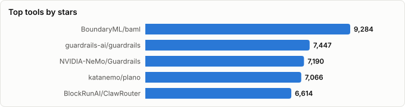
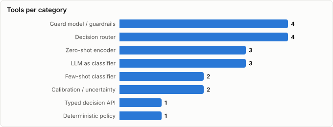

# Decision Classifiers & Guard Models — Landscape Report

> Derived from **kaiser-data**'s 2,243 starred repos (snapshot `2026-09-25T10:37:19.717Z`), cross-referenced with the repo-similarity graph (2,243 nodes / 7,393 edges, 35 communities).
>
> Generated 2026-09-25 by `scripts/reports/decision_classifiers.py` (regenerate any time — no API cost).

## Executive summary

- **20 tools** (**65,879★** combined) that turn text into a decision software can act on — a label, a yes/no, a score, a route — instead of prose:
  - **Typed decision API** (1): `jev-code`
  - **Zero-shot encoder** (3): `GLiNER`, `GLiNER2`, `GLiClass`
  - **Few-shot classifier** (2): `setfit`, `lingua-py`
  - **Guard model / guardrails** (4): `guardrails-ai/guardrails`, `NVIDIA-NeMo/Guardrails`, `granite-guardian`, `GLiGuard`
  - **Deterministic policy** (1): `cc-safety-net`
  - **Decision router** (4): `plano`, `ClawRouter`, `vllm-project/semantic-router`, `aurelio-labs/semantic-router`
  - **Calibration / uncertainty** (2): `MAPIE`, `uqlm`
  - **LLM as classifier** (3): `baml`, `spacy-llm`, `tally`
- The newcomer is **Jev** (TypeSafe, launched 2026-09-15): a hosted model that answers typed questions with probabilities in one pass. It competes with small open encoders (GLiClass, GLiNER2) on price and latency, and with prompted LLMs (BAML-style) on consistency.
- Evidence from the incident sprint: **no classifier replaces policy for authorization** — rules scored 48/48, the best model 42/48, and every model fell to 24/48 without the grant. Classifiers earn their place as triage in front of rules and humans.
- **Calibration is the claim to check.** The unofficial Jev-Omni measured ECE 0.161 against a claimed 0.040. `MAPIE` puts a coverage guarantee on any of these scores.

## Where each layer sits in a decision

| Step | What happens | Tools in your stars |
|---|---|---|
| **Extract** | Pull the resource, argument or entity out of the text | `GLiNER2`, `GLiNER`, `spacy-llm` |
| **Classify** | Answer a typed question: label, yes/no, score | `jev-code`, `GLiClass`, `setfit`, `lingua-py`, `baml` |
| **Guard** | Flag risky prompts, outputs or tool calls | `granite-guardian`, `GLiGuard`, `NVIDIA-NeMo/Guardrails`, `guardrails-ai/guardrails` |
| **Decide by rule** | Deterministic allow/deny on resolved facts | `cc-safety-net` |
| **Route** | Pick the model, agent or path | `aurelio-labs/semantic-router`, `vllm-project/semantic-router`, `plano`, `ClawRouter` |
| **Calibrate** | Turn scores into thresholds with known error rates | `MAPIE`, `uqlm` |

## Master comparison

Sorted by stars. `Health`/`Lifecycle` are the dataset's computed metrics; `Activity` is derived from days-since-push + 90-day commits.

| Tool | Category | Lang | License | ★ Stars | Lifecycle | Health | Activity | Last push | Age | Contrib(90d) |
|---|---|---|---|---|---|---|---|---|---|---|
| [BoundaryML/baml](https://github.com/BoundaryML/baml) | LLM as classifier | Rust | Apache-2.0 | 9,284 (▲143) | Mature | 82 | very active | 0d ago | 3.0y | 11 |
| [guardrails-ai/guardrails](https://github.com/guardrails-ai/guardrails) | Guard model / guardrails | Python | Apache-2.0 | 7,447 (▲85) | Classic | 73 | very active | 0d ago | 3.7y | 3 |
| [NVIDIA-NeMo/Guardrails](https://github.com/NVIDIA-NeMo/Guardrails) | Guard model / guardrails | Python | NOASSERTION | 7,190 (▲118) | Classic | 83 | very active | 1d ago | 3.4y | 11 |
| [katanemo/plano](https://github.com/katanemo/plano) | Decision router | Rust | Apache-2.0 | 7,066 | Mature | 68 | very active | 1d ago | 2.2y | 11 |
| [BlockRunAI/ClawRouter](https://github.com/BlockRunAI/ClawRouter) | Decision router | TypeScript | MIT | 6,614 (▲33) | Hot | 80 | very active | 0d ago | 7mo | 12 |
| [vllm-project/semantic-router](https://github.com/vllm-project/semantic-router) | Decision router | Go | Apache-2.0 | 5,913 (▲309) | Hot | 69 | very active | 0d ago | 1.1y | 21 |
| [urchade/GLiNER](https://github.com/urchade/GLiNER) | Zero-shot encoder | Python | Apache-2.0 | 3,942 (▲331) | Mature | 73 | very active | 2d ago | 2.9y | 8 |
| [aurelio-labs/semantic-router](https://github.com/aurelio-labs/semantic-router) | Decision router | Python | MIT | 3,923 | Mature | 68 | very active | 13d ago | 2.9y | 6 |
| [huggingface/setfit](https://github.com/huggingface/setfit) | Few-shot classifier | Jupyter Notebook | Apache-2.0 | 2,823 | Mature | 55 | active | 2d ago | 4.2y | 4 |
| [fastino-ai/GLiNER2](https://github.com/fastino-ai/GLiNER2) | Zero-shot encoder | Python | Apache-2.0 | 2,176 (▲329) | Hot | 71 | very active | 0d ago | 1.2y | 8 |
| [pemistahl/lingua-py](https://github.com/pemistahl/lingua-py) | Few-shot classifier | Python | Apache-2.0 | 1,802 (▲14) | Mature | 33 | slowing | 2mo ago | 5.2y | 0 |
| [scikit-learn-contrib/MAPIE](https://github.com/scikit-learn-contrib/MAPIE) | Calibration / uncertainty | Jupyter Notebook | BSD-3-Clause | 1,595 | Classic | 68 | very active | 17d ago | 5.5y | 6 |
| [kenryu42/cc-safety-net](https://github.com/kenryu42/cc-safety-net) | Deterministic policy | TypeScript | MIT | 1,555 (▲31) | Hot | 80 | very active | 0d ago | 9mo | 3 |
| [explosion/spacy-llm](https://github.com/explosion/spacy-llm) | LLM as classifier | Python | MIT | 1,393 (▼1) | Declining | 22 | stale | 6mo ago | 3.5y | 0 |
| [cvs-health/uqlm](https://github.com/cvs-health/uqlm) | Calibration / uncertainty | Python | Apache-2.0 | 1,202 (▲6) | Hot | 76 | very active | 4d ago | 1.4y | 7 |
| [davidfowl/tally](https://github.com/davidfowl/tally) | LLM as classifier | Python | MIT | 1,161 (▲1) | Declining | 42 | slowing | 4mo ago | 9mo | 0 |
| [Knowledgator/GLiClass](https://github.com/Knowledgator/GLiClass) | Zero-shot encoder | Python | Apache-2.0 | 534 | Mature | 57 | very active | 1d ago | 2.3y | 3 |
| [ibm-granite/granite-guardian](https://github.com/ibm-granite/granite-guardian) | Guard model / guardrails | Jupyter Notebook | Apache-2.0 | 179 | Mature | 39 | active | 1mo ago | 2.0y | 4 |
| [fastino-ai/GLiGuard](https://github.com/fastino-ai/GLiGuard) | Guard model / guardrails | — | Apache-2.0 | 60 (▲9) | Declining | 19 | slowing | 4mo ago | 4mo | 0 |
| [FrancoisChastel/jev-code](https://github.com/FrancoisChastel/jev-code) | Typed decision API | TypeScript | MIT | 20 | Declining | 43 | active | 6d ago | 6d | 1 |

## Ranked by task

Evidence frozen 2026-09-25. Sprint numbers come from runs on 48 synthetic authority fixtures and 30 message-kind cases; vendor and secondary figures are marked. Hosted Jev itself has not been run on these fixtures yet.

| Task | 🥇 First pick | 🥈 Second | 🥉 Third | Evidence / note |
|---|---|---|---|---|
| **Allow/block an agent tool call** | `cc-safety-net` — rules on resolved resources; the final say | `granite-guardian` — open function-call risk model with probabilities (untested here) | `jev-code` — triage and decomposition, not the oracle | Sprint: deterministic policy 48/48; Llama 3.3 70B 42/48; Jev-Omni 39/48 with 7 overblocks (cap ≤4); Qwen3 30B 37/48; GLiNER2 24/48. Without the grant every model sits at 24/48. |
| **High-volume closed-label triage (inbox, tickets, spam)** | `jev-code` — hosted, $0.042/M input, calibrated probabilities (vendor) | `GLiClass` — local zero-shot, private data stays on-box | `setfit` — best once you have 8–64 labels per class | eesel: 93% triage accuracy, 0 spam false positives on 284 chats (secondary). Not yet measured on your data. |
| **Tell an action from a quoted action** | `baml` — typed prompt to a 30B-class LLM | `GLiNER2` — catches actions, misses quotations | `GLiClass` — untested; same encoder family | Sprint, 30 cases: quotations recognised — Qwen3 30B 6/7, GLiNER2 2/7, Jev-Omni 2/7. Small classifiers read form, not intent. |
| **Route a request to a model or agent** | `semantic-router` — embedding routes, near-free, local | `semantic-router` — classifier-based Mixture-of-Models inside vLLM | `plano` — router models at the proxy layer | Jev routing decisions reported at 145–271 ms (KDnuggets, secondary); must beat embedding routes on criteria-defined routes to earn its API call. |
| **Put a guarantee on a classifier's threshold** | `MAPIE` — conformal coverage over any score | `uqlm` — confidence for LLM outputs | `jev-code` — claims built-in calibration | Jev-Omni ECE 0.161 (author claims 0.040); wrong answers at 0.82–0.99 confidence. Calibration claims need a reliability diagram on your own data. |
| **Extract the resource before deciding** | `GLiNER2` — schema extraction in one pass | `GLiNER` — runtime entity types | `spacy-llm` — LLM-backed NER in a pipeline | Sprint: authority needs the resolved resource and the grant — extraction feeds the decision, it cannot replace it. |

## By category

### Typed decision API

_Hosted models built for decisions rather than text: typed questions in, probabilities out, many questions per pass. Early access; 32k-token context (per review)._

- **[FrancoisChastel/jev-code](https://github.com/FrancoisChastel/jev-code)** · 20★ · TypeScript · Declining  
  Jev (TypeSafe's System One model) as classify / check / score / rank / ask tools inside Claude Code, Codex, Pi, OpenCode.  
  topics: agent-skills, classifier, claude-code, codex, coding-agents, jev, mcp, opencode

### Zero-shot encoder

_Small bidirectional encoders that take label or entity names at runtime. Local, cheap, fast — but they read surface form, so intent-level distinctions slip._

- **[urchade/GLiNER](https://github.com/urchade/GLiNER)** · 3,942★ · Python · Mature  
  Generalist lightweight NER — any entity type named at runtime; the GLiNER family's origin.  
  topics: information-extraction, large-language-models, named-entity-recognition, natural-language-processing, prompt-tuning
- **[fastino-ai/GLiNER2](https://github.com/fastino-ai/GLiNER2)** · 2,176★ · Python · Hot  
  Unified schema-based extraction (entities, classification, structure) in one small encoder.  
  topics: —
- **[Knowledgator/GLiClass](https://github.com/Knowledgator/GLiClass)** · 534★ · Python · Mature  
  GLiNER-family zero-shot text classifier — labels supplied at runtime, CPU-friendly; closest open analogue to Jev.  
  topics: —

### Few-shot classifier

_Train on a handful of your own labels. The baseline any hosted model has to beat once labelled data exists._

- **[huggingface/setfit](https://github.com/huggingface/setfit)** · 2,823★ · Jupyter Notebook · Mature  
  Few-shot classification on Sentence Transformers — 8–64 labelled examples, no prompts, fast CPU inference.  
  topics: few-shot-learning, nlp, sentence-transformers
- **[pemistahl/lingua-py](https://github.com/pemistahl/lingua-py)** · 1,802★ · Python · Mature  
  Language detection that stays accurate on short and mixed-language text — a narrow, dependable classifier.  
  topics: nlp, natural-language-processing, language-detection, language-recognition, language-identification, language-classification, python-library

### Guard model / guardrails

_Models that flag risk, and the frameworks that wire checks around an LLM app. Frameworks are model-agnostic: any classifier here can be the check._

- **[guardrails-ai/guardrails](https://github.com/guardrails-ai/guardrails)** · 7,447★ · Python · Classic  
  Validator framework for LLM I/O — a hub of checks composed into input/output guards.  
  topics: ai, foundation-model, gpt-3, llm, openai
- **[NVIDIA-NeMo/Guardrails](https://github.com/NVIDIA-NeMo/Guardrails)** · 7,190★ · Python · Classic  
  Programmable rails (Colang) around LLM apps; calls a model or classifier to do each check.  
  topics: agents, guardrails, python, safety, generative-ai, llms, nvidia, llm-safety
- **[ibm-granite/granite-guardian](https://github.com/ibm-granite/granite-guardian)** · 179★ · Jupyter Notebook · Mature  
  Open risk-detection models for prompts, responses, RAG groundedness and function calls, with probabilities.  
  topics: —
- **[fastino-ai/GLiGuard](https://github.com/fastino-ai/GLiGuard)** · 60★ · — · Declining  
  Fastino's small-encoder LLM guardrail (GLiNER lineage).  
  topics: —

### Deterministic policy

_Rules over resolved facts. Exact where the facts are available, blind where they are not._

- **[kenryu42/cc-safety-net](https://github.com/kenryu42/cc-safety-net)** · 1,555★ · TypeScript · Hot  
  Pre-execution guard for coding agents: blocks destructive git/filesystem commands by rule, before they run.  
  topics: claude, claude-code, claude-code-plugin, security, codex, pi-extension, ai-agents, ai-safety

### Decision router

_Choose the model, agent or path for a request — by embedding similarity, a routing classifier, or a proxy-level model._

- **[katanemo/plano](https://github.com/katanemo/plano)** · 7,066★ · Rust · Mature  
  AI-native proxy (formerly archgw) with small built-in router and guard models at the data plane.  
  topics: gateway, generative-ai, llm-inference, llms, prompt, proxy, proxy-server, llmops
- **[BlockRunAI/ClawRouter](https://github.com/BlockRunAI/ClawRouter)** · 6,614★ · TypeScript · Hot  
  Agent-native LLM router with <1 ms local routing across frontier models.  
  topics: ai, ai-agents, anthropic, cost-optimization, deepseek, gemini, llm, llm-router
- **[vllm-project/semantic-router](https://github.com/vllm-project/semantic-router)** · 5,913★ · Go · Hot  
  Mixture-of-Models router for vLLM: classifies each request to pick a model, with safety filters.  
  topics: mixture-of-models, semantic-router, vllm, ai-gateway, kubernetes, llmrouter, llm, guardrails
- **[aurelio-labs/semantic-router](https://github.com/aurelio-labs/semantic-router)** · 3,923★ · Python · Mature  
  Embedding-based decision layer — route by utterance similarity instead of an LLM call.  
  topics: ai, artificial-intelligence, chatbot, computer-vision, generative-ai, machine-learning, nlp

### Calibration / uncertainty

_Make scores mean something: coverage guarantees, reliability, and confidence for LLM outputs._

- **[scikit-learn-contrib/MAPIE](https://github.com/scikit-learn-contrib/MAPIE)** · 1,595★ · Jupyter Notebook · Classic  
  Conformal prediction and risk control — wraps any classifier's scores in coverage guarantees.  
  topics: regression, confidence-intervals, data-science, python, sklearn, classification, conformal-prediction, risk-control
- **[cvs-health/uqlm](https://github.com/cvs-health/uqlm)** · 1,202★ · Python · Hot  
  Uncertainty quantification for LLM outputs — confidence scores for hallucination detection.  
  topics: ai-evaluation, ai-safety, hallucination, hallucination-detection, hallucination-evaluation, hallucination-mitigation, llm, llm-evaluation

### LLM as classifier

_The incumbent: prompt a general LLM into a typed answer. Flexible and strong on intent, but slower, costlier and less self-consistent._

- **[BoundaryML/baml](https://github.com/BoundaryML/baml)** · 9,284★ · Rust · Mature  
  Typed prompt functions — the cleanest way to force an LLM into an enum/bool/score answer.  
  topics: llm, boundaryml, guardrails, structured-data, programming-language
- **[explosion/spacy-llm](https://github.com/explosion/spacy-llm)** · 1,393★ · Python · Declining  
  LLM-backed components inside spaCy pipelines (textcat, NER) — LLM classification in an NLP framework.  
  topics: large-language-models, llm, openai, spacy, dolly, gpt-3, gpt-4, machine-learning
- **[davidfowl/tally](https://github.com/davidfowl/tally)** · 1,161★ · Python · Declining  
  Agents classify bank transactions — a concrete closed-label LLM-classification app.  
  topics: —

## Spotlight: where a System One model has the edge

Jev's advantage is volume × closed labels × a tunable threshold, with humans or an LLM handling the uncertain middle band. Applications ranked by fit:

| Application | Fit | Beats | Watch out for |
|---|---|---|---|
| Landscape relevance in this repo (`discover.mjs`) | strong | keyword-overlap scoring (`dotnet/runtime` scored 60+ on "runtime") | ~1M tokens per pass over all stars ≈ $0.04 at list price |
| Inbox / reply triage | strong | prompted LLM on cost per 1,000 mails | German text, GDPR for a US API |
| Coding-agent micro-decisions (CI failures, finding severity) | strong | frontier-model calls | 32k context |
| Model / agent routing | plausible | embedding routes only on criteria-defined routes | embedding routes are near-free |
| Tool-call guard | triage only | fast guards on latency and determinism | overblocks; quotations; needs the grant |
| Private data on the Jetson | weak | — | hosted API; Jev-Omni needs ~24 GB |

## Graph analysis — how they relate

**Community clustering.** These 20 tools span **11 of the graph's 35 communities** — decision tooling is scattered across the agent, gateway and NLP neighbourhoods rather than forming its own cluster.

- **Community 10** (5): `fastino-ai/GLiNER2`, `urchade/GLiNER`, `pemistahl/lingua-py`, `fastino-ai/GLiGuard`, `explosion/spacy-llm`
- **Community 2** (3): `Knowledgator/GLiClass`, `aurelio-labs/semantic-router`, `davidfowl/tally`
- **Community 0** (3): `huggingface/setfit`, `ibm-granite/granite-guardian`, `scikit-learn-contrib/MAPIE`
- **Community 13** (2): `guardrails-ai/guardrails`, `cvs-health/uqlm`

**Centrality (PageRank in the full 2,243-repo graph):**

- `aurelio-labs/semantic-router` — PageRank 0.0050
- `Knowledgator/GLiClass` — PageRank 0.0048
- `huggingface/setfit` — PageRank 0.0022
- `FrancoisChastel/jev-code` — PageRank 0.0020
- `kenryu42/cc-safety-net` — PageRank 0.0012
- `ibm-granite/granite-guardian` — PageRank 0.0011
- `scikit-learn-contrib/MAPIE` — PageRank 0.0010
- `guardrails-ai/guardrails` — PageRank 0.0009
- `urchade/GLiNER` — PageRank 0.0006
- `NVIDIA-NeMo/Guardrails` — PageRank 0.0006

**Direct links between tools in this report:**

- `fastino-ai/GLiNER2` ⇄ `fastino-ai/GLiGuard` (w=0.500)
- `guardrails-ai/guardrails` ⇄ `cvs-health/uqlm` (w=0.328) — topics: llm; authors: dependabot[bot]
- `Knowledgator/GLiClass` ⇄ `urchade/GLiNER` (w=0.250) — authors: Ingvarstep
- `fastino-ai/GLiNER2` ⇄ `urchade/GLiNER` (w=0.183) — authors: urchade
- `ibm-granite/granite-guardian` ⇄ `scikit-learn-contrib/MAPIE` (w=0.050)
- `ibm-granite/granite-guardian` ⇄ `huggingface/setfit` (w=0.050)
- `aurelio-labs/semantic-router` ⇄ `fastino-ai/GLiNER2` (w=0.050)
- `aurelio-labs/semantic-router` ⇄ `davidfowl/tally` (w=0.050)
- `Knowledgator/GLiClass` ⇄ `fastino-ai/GLiNER2` (w=0.050)
- `Knowledgator/GLiClass` ⇄ `davidfowl/tally` (w=0.050)

## Maintenance & risk signal

Bus factor = commit concentration (1 = single-maintainer risk). Pair with lifecycle + activity before adopting.

| Tool | Health | Lifecycle | Activity | Bus factor | Top-author share | Releases |
|---|---|---|---|---|---|---|
| NVIDIA-NeMo/Guardrails | 83 | Classic | very active | 2 | 43% | 34 |
| BoundaryML/baml | 82 | Mature | very active | 2 | 45% | 650 |
| kenryu42/cc-safety-net | 80 | Hot | very active | 1 | 92% | 52 |
| BlockRunAI/ClawRouter | 80 | Hot | very active | 1 | 59% | 147 |
| cvs-health/uqlm | 76 | Hot | very active | 1 | 52% | 45 |
| urchade/GLiNER | 73 | Mature | very active | 1 | 83% | 42 |
| guardrails-ai/guardrails | 73 | Classic | very active | 1 | 65% | 69 |
| fastino-ai/GLiNER2 | 71 | Hot | very active | 1 | 68% | 12 |
| vllm-project/semantic-router | 69 | Hot | very active | 1 | 56% | 3 |
| aurelio-labs/semantic-router | 68 | Mature | very active | 1 | 69% | 96 |
| katanemo/plano | 68 | Mature | very active | 1 | 64% | 79 |
| scikit-learn-contrib/MAPIE | 68 | Classic | very active | 1 | 82% | 39 |
| Knowledgator/GLiClass | 57 | Mature | very active | 1 | 69% | 3 |
| huggingface/setfit | 55 | Mature | active | 2 | 44% | 18 |
| FrancoisChastel/jev-code | 43 | Declining | active | 1 | 100% | 0 |
| davidfowl/tally | 42 | Declining | slowing | 0 | 0% | 23 |
| ibm-granite/granite-guardian | 39 | Mature | active | 1 | 50% | 0 |
| pemistahl/lingua-py | 33 | Mature | slowing | 0 | 0% | 23 |
| explosion/spacy-llm | 22 | Declining | stale | 0 | 0% | 28 |
| fastino-ai/GLiGuard | 19 | Declining | slowing | 0 | 0% | 0 |

Watch items: `jev-code` is a days-old wrapper around a closed, early-access API — the repo's health says little about the model. `GLiGuard` and `spacy-llm` read as Declining.

## Which one should you use?

| If you want… | Start with | Why |
|---|---|---|
| To block dangerous agent actions | `kenryu42/cc-safety-net` + your own policy | Rules on resolved facts were the only 48/48 in the sprint. |
| Cheap, fast labels on text you can send out | `FrancoisChastel/jev-code` | Typed answers with probabilities; output tokens free. |
| The same, but data must stay local | `Knowledgator/GLiClass` | Zero-shot on CPU; no API. |
| A classifier trained on your own labels | `huggingface/setfit` | Few-shot, no prompts, strong baseline. |
| Intent-level distinctions (quoted vs real actions) | `BoundaryML/baml` with a capable LLM | Small classifiers read form; a 30B LLM got 6/7 quotations vs 2/7. |
| Routing between models | `aurelio-labs/semantic-router` | Local, near-free; escalate to a classifier only where routes need criteria. |
| A threshold with a known error rate | `scikit-learn-contrib/MAPIE` | Conformal coverage over any classifier's score. |
| Guard checks wired around an LLM app | `NVIDIA-NeMo/Guardrails` | Model-agnostic rails; plug in any classifier above. |

## Adjacent (deliberately not listed)

- **BerriAI/litellm** (59,598★) — gateway; can pass through to Jev but routes by config, not by decision — see *local-vs-infra-stack*
- **Portkey-AI/gateway** (13,081★) — gateway with guardrail hooks — see *local-vs-infra-stack*
- **maximhq/bifrost** (8,351★) — gateway with guardrails; infrastructure rather than a decision model
- **confident-ai/deepteam** (2,949★) — red-teaming framework that *attacks* guards — see *llm-evaluation-tooling*
- **KRLabsOrg/LettuceDetect** (611★) — grounding verification for RAG outputs — see *llm-evaluation-tooling*
- **NVIDIA/SkillSpector** (18,256★) — static scanner for agent skills — audits configuration, makes no runtime decisions
- **affaan-m/agentshield** (1,219★) — static scanner for agent configs / MCP permissions — see *ai-coding-tuis*
- **huggingface/sentence-transformers** (19,121★) — the encoder under SetFit and semantic-router — see *rag-tooling*
- **catboost/catboost** (9,116★) — tabular classifier — decisions over features, not over text
- **google-research/tabfm** (2,674★) — tabular foundation model — same reason
- **explosion/spaCy** (33,919★) — general NLP framework; its textcat is one component among many
- **haizelabs/verdict** (348★) — LLM-as-judge scaling; evaluation rather than runtime decisions

## Methodology & caveats

- **Source**: `data/classified.json` + `public/data/graph.json`. No external calls at generation time; fully reproducible.
- **Selection**: keyword scan (classif / guard / router / calibrat / zero-shot / moderation / policy) + manual curation. Gateways, red-teaming, static scanners and tabular models were routed to adjacent reports or excluded.
- **Evidence (frozen 2026-09-25)**: sprint batteries and the Jev-Omni run (`jev-studies/results/jev-omni-20260925-102614.md`; unofficial model, not TypeSafe's). Vendor: TypeSafe launch post (typesafe.ai/blog/introducing-system-one-models-and-jev) — price, latency, calibration claims. Secondary: eesel review (eesel.ai/blog/typesafe-jev-review) — 93% triage, 32k context; KDnuggets (kdnuggets.com/what-everyone-is-getting-wrong-about-typesafe-ais-jev) — 145–271 ms routing. Retrieved 2026-09-25.
- Frozen evidence does **not** refresh with `build_index.py`; re-verify when hosted Jev results land or new guard models ship.
- **Metrics** (health, lifecycle, bus_factor) are precomputed at snapshot time and may lag GitHub's current state.

Tools covered: 20 · Snapshot: 2026-09-25T10:37:19.717Z
