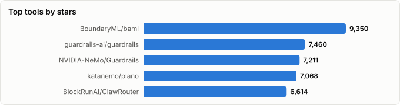
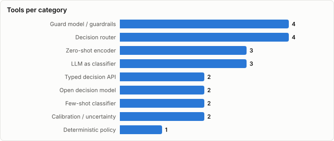

# Decision Classifiers & Guard Models — Landscape Report

> Derived from **kaiser-data**'s 2,304 starred repos (snapshot `2026-10-05T13:01:39.533Z`), cross-referenced with the repo-similarity graph (2,304 nodes / 7,632 edges, 40 communities).
>
> Generated 2026-10-05 by `scripts/reports/decision_classifiers.py` (regenerate any time — no API cost).

## Executive summary

- **23 tools** (**66,623★** combined) that turn text into a decision software can act on — a label, a yes/no, a score, a route — instead of prose:
  - **Typed decision API** (2): `jev-code`, `super-jev`
  - **Open decision model** (2): `dohnuts`, `dohnuts.cpp`
  - **Zero-shot encoder** (3): `GLiNER`, `GLiNER2`, `GLiClass`
  - **Few-shot classifier** (2): `setfit`, `lingua-py`
  - **Guard model / guardrails** (4): `guardrails-ai/guardrails`, `NVIDIA-NeMo/Guardrails`, `granite-guardian`, `GLiGuard`
  - **Deterministic policy** (1): `cc-safety-net`
  - **Decision router** (4): `plano`, `ClawRouter`, `vllm-project/semantic-router`, `aurelio-labs/semantic-router`
  - **Calibration / uncertainty** (2): `MAPIE`, `uqlm`
  - **LLM as classifier** (3): `baml`, `spacy-llm`, `tally`
- The newcomer is **Jev** (TypeSafe, launched 2026-09-15): a hosted model that answers typed questions with probabilities in one pass, reachable through TypeSafe, OpenRouter and Vercel AI Gateway. It competes with small open encoders (GLiClass, GLiNER2) on price and latency, and with prompted LLMs (BAML-style) on consistency. Open copies followed within two weeks (`dohnuts`, on CPU).
- Evidence from the incident sprint: **no classifier replaces policy for authorization** — rules scored 48/48, the best model 42/48, and every model fell to 24/48 without the grant. Classifiers earn their place as triage in front of rules and humans.
- Hosted Jev, measured (jev-studies, via OpenRouter): **45–47/48 on the permission check** — above every open copy and most LLM baselines — but **0/13 real incident actions at 5% FPR**. Triage, not the guard.
- **Calibration is the claim to check.** Hosted Jev's ECE (0.115, n=29) can't be told apart from calibrated or not; the unofficial Jev-Omni measured 0.161 against a claimed 0.040. `MAPIE` puts a coverage guarantee on any of these scores.

## Where each layer sits in a decision

| Step | What happens | Tools in your stars |
|---|---|---|
| **Extract** | Pull the resource, argument or entity out of the text | `GLiNER2`, `GLiNER`, `spacy-llm` |
| **Classify** | Answer a typed question: label, yes/no, score | `jev-code`, `dohnuts`, `GLiClass`, `setfit`, `lingua-py`, `baml` |
| **Guard** | Flag risky prompts, outputs or tool calls | `granite-guardian`, `GLiGuard`, `NVIDIA-NeMo/Guardrails`, `guardrails-ai/guardrails` |
| **Decide by rule** | Deterministic allow/deny on resolved facts | `cc-safety-net` |
| **Route** | Pick the model, agent or path | `aurelio-labs/semantic-router`, `vllm-project/semantic-router`, `plano`, `ClawRouter` |
| **Calibrate** | Turn scores into thresholds with known error rates | `MAPIE`, `uqlm` |

## Master comparison

Sorted by stars. `Health`/`Lifecycle` are the dataset's computed metrics; `Activity` is derived from days-since-push + 90-day commits.

| Tool | Category | Lang | License | ★ Stars | Lifecycle | Health | Activity | Last push | Age | Contrib(90d) |
|---|---|---|---|---|---|---|---|---|---|---|
| [BoundaryML/baml](https://github.com/BoundaryML/baml) | LLM as classifier | Rust | Apache-2.0 | 9,381 (▲97) | Mature | 82 | very active | 0d ago | 3.0y | 10 |
| [guardrails-ai/guardrails](https://github.com/guardrails-ai/guardrails) | Guard model / guardrails | Python | Apache-2.0 | 7,486 (▲39) | Classic | 73 | very active | 4d ago | 3.7y | 3 |
| [NVIDIA-NeMo/Guardrails](https://github.com/NVIDIA-NeMo/Guardrails) | Guard model / guardrails | Python | NOASSERTION | 7,244 (▲54) | Classic | 82 | very active | 3d ago | 3.5y | 10 |
| [katanemo/plano](https://github.com/katanemo/plano) | Decision router | Rust | Apache-2.0 | 7,075 (▲9) | Mature | 67 | very active | 7d ago | 2.2y | 10 |
| [BlockRunAI/ClawRouter](https://github.com/BlockRunAI/ClawRouter) | Decision router | TypeScript | MIT | 6,612 (▼2) | Hot | 80 | very active | 0d ago | 8mo | 8 |
| [vllm-project/semantic-router](https://github.com/vllm-project/semantic-router) | Decision router | Go | Apache-2.0 | 6,036 (▲123) | Hot | 91 | very active | 0d ago | 1.1y | 34 |
| [urchade/GLiNER](https://github.com/urchade/GLiNER) | Zero-shot encoder | Python | Apache-2.0 | 4,041 (▲99) | Mature | 73 | very active | 0d ago | 2.9y | 7 |
| [aurelio-labs/semantic-router](https://github.com/aurelio-labs/semantic-router) | Decision router | Python | MIT | 3,938 (▲15) | Mature | 70 | very active | 6d ago | 2.9y | 10 |
| [huggingface/setfit](https://github.com/huggingface/setfit) | Few-shot classifier | Jupyter Notebook | Apache-2.0 | 2,830 (▲7) | Mature | 55 | active | 6d ago | 4.3y | 4 |
| [fastino-ai/GLiNER2](https://github.com/fastino-ai/GLiNER2) | Zero-shot encoder | Python | Apache-2.0 | 2,336 (▲160) | Hot | 70 | very active | 11d ago | 1.2y | 8 |
| [pemistahl/lingua-py](https://github.com/pemistahl/lingua-py) | Few-shot classifier | Python | Apache-2.0 | 1,806 (▲4) | Mature | 32 | slowing | 2mo ago | 5.2y | 0 |
| [scikit-learn-contrib/MAPIE](https://github.com/scikit-learn-contrib/MAPIE) | Calibration / uncertainty | Jupyter Notebook | BSD-3-Clause | 1,602 (▲7) | Classic | 68 | very active | 5d ago | 5.5y | 6 |
| [kenryu42/cc-safety-net](https://github.com/kenryu42/cc-safety-net) | Deterministic policy | TypeScript | MIT | 1,574 (▲19) | Rising | 80 | very active | 0d ago | 9mo | 2 |
| [explosion/spacy-llm](https://github.com/explosion/spacy-llm) | LLM as classifier | Python | MIT | 1,394 (▲1) | Mature | 48 | active | 8d ago | 3.6y | 1 |
| [cvs-health/uqlm](https://github.com/cvs-health/uqlm) | Calibration / uncertainty | Python | Apache-2.0 | 1,207 (▲5) | Hot | 76 | very active | 2d ago | 1.5y | 6 |
| [davidfowl/tally](https://github.com/davidfowl/tally) | LLM as classifier | Python | MIT | 1,164 (▲3) | Declining | 41 | slowing | 4mo ago | 9mo | 0 |
| [Knowledgator/GLiClass](https://github.com/Knowledgator/GLiClass) | Zero-shot encoder | Python | Apache-2.0 | 552 (▲18) | Mature | 57 | very active | 2d ago | 2.3y | 3 |
| [ibm-granite/granite-guardian](https://github.com/ibm-granite/granite-guardian) | Guard model / guardrails | Jupyter Notebook | Apache-2.0 | 181 (▲2) | Mature | 38 | active | 1mo ago | 2.0y | 4 |
| [fastino-ai/GLiGuard](https://github.com/fastino-ai/GLiGuard) | Guard model / guardrails | — | Apache-2.0 | 64 (▲4) | Declining | 18 | slowing | 4mo ago | 5mo | 0 |
| [FrancoisChastel/jev-code](https://github.com/FrancoisChastel/jev-code) | Typed decision API | TypeScript | MIT | 40 (▲20) | Rising | 63 | very active | 1d ago | 16d | 2 |
| [PsiACE/dohnuts](https://github.com/PsiACE/dohnuts) | Open decision model | Python | Apache-2.0 | 35 (▲1) | Mature | 45 | active | 14d ago | 14d | 1 |
| [Kevthetech143/super-jev](https://github.com/Kevthetech143/super-jev) | Typed decision API | Python | MIT | 14 | Rising | 75 | very active | 0d ago | 18d | 2 |
| [DreamBlooms/dohnuts.cpp](https://github.com/DreamBlooms/dohnuts.cpp) | Open decision model | C++ | Apache-2.0 | 11 (▲2) | Hot | 52 | very active | 1d ago | 14d | 3 |

## Ranked by task

Evidence frozen 2026-09-25; hosted-Jev and open-encoder figures updated 2026-09-29. Sprint numbers come from runs on 48 synthetic authority fixtures and 30 message-kind cases; hosted Jev 1.13 was run on the same fixtures through OpenRouter, and on the real incident data (13 escape actions, 102 benign). Vendor and secondary figures are marked.

| Task | 🥇 First pick | 🥈 Second | 🥉 Third | Evidence / note |
|---|---|---|---|---|
| **Allow/block an agent tool call** | `cc-safety-net` — rules on resolved resources; the final say | `granite-guardian` — open function-call risk model with probabilities (untested here) | `jev-code` — triage and decomposition, not the oracle | Sprint fixtures: deterministic policy 48/48; hosted Jev 45–47/48 (3 runs, jev-studies); Llama 3.3 70B 42/48; best open Jev copy (JevK5) 44/48; Jev-Omni 39/48 with 7 overblocks (cap ≤4); Qwen3 30B 37/48; GLiNER2 24/48. Without the grant every model sits at 24/48. Open System-1 encoders (GLiNER2.5-Decide, Laya) score 9–25/48, at or below chance. On the real incident hosted Jev caught 0/13 actions at 5% FPR. |
| **High-volume closed-label triage (inbox, tickets, spam)** | `jev-code` — hosted, $0.042/M input, graded scores; set thresholds on labelled data | `GLiClass` — local zero-shot, private data stays on-box | `setfit` — best once you have 8–64 labels per class | Hosted Jev 28/30 on the sprint's message-kind set. eesel: 93% triage accuracy, 0 spam false positives on 284 chats (secondary). Not yet measured on your data. |
| **Tell an action from a quoted action** | `baml` — typed prompt to a 30B-class LLM | `GLiNER2` — catches actions, misses quotations | `GLiClass` — untested; same encoder family | Sprint, 30 cases: quotations recognised — Qwen3 30B 6/7, GLiNER2 2/7, Jev-Omni 2/7. Small classifiers read form, not intent. |
| **Route a request to a model or agent** | `semantic-router` — embedding routes, near-free, local | `semantic-router` — classifier-based Mixture-of-Models inside vLLM | `plano` — router models at the proxy layer | Jev routing decisions reported at 145–271 ms (KDnuggets, secondary); must beat embedding routes on criteria-defined routes to earn its API call. |
| **Put a guarantee on a classifier's threshold** | `MAPIE` — conformal coverage over any score | `uqlm` — confidence for LLM outputs | `jev-code` — claims built-in calibration | Hosted Jev ECE 0.115 on 29 items — within the noise floor, so neither confirmed nor refuted (vendor claims 0.040). Jev-Omni ECE 0.161, wrong answers at 0.82–0.99 confidence. Calibration claims need a reliability diagram on your own data. |
| **Extract the resource before deciding** | `GLiNER2` — schema extraction in one pass | `GLiNER` — runtime entity types | `spacy-llm` — LLM-backed NER in a pipeline | Sprint: authority needs the resolved resource and the grant — extraction feeds the decision, it cannot replace it. |

## By category

### Typed decision API

_Hosted models built for decisions rather than text: typed questions in, probabilities out, many questions per pass. Early access; 32k-token context (per review)._

- **[FrancoisChastel/jev-code](https://github.com/FrancoisChastel/jev-code)** · 40★ · TypeScript · Rising  
  Jev (TypeSafe's System One model) as classify / check / score / rank / ask tools inside Claude Code, Codex, Pi, OpenCode; reaches Jev through TypeSafe, OpenRouter or Vercel AI Gateway (v0.2).  
  topics: agent-skills, classifier, claude-code, codex, coding-agents, jev, mcp, opencode
- **[Kevthetech143/super-jev](https://github.com/Kevthetech143/super-jev)** · 14★ · Python · Rising  
  Small, extensible decision-to-action harness for hosted Jev — typed answer in, action out.  
  topics: —

### Open decision model

_Open-weight models built to the same System One shape — typed questions, probabilities, one forward pass — small enough for a laptop CPU. Days old and not yet measured here._

- **[PsiACE/dohnuts](https://github.com/PsiACE/dohnuts)** · 35★ · Python · Mature  
  Open System One-style multimodal decision models (0.8B): choose / judge / score with probabilities in one forward pass.  
  topics: jev, laya, llm, lora, system-one, rlcd, decision-model, typesafe
- **[DreamBlooms/dohnuts.cpp](https://github.com/DreamBlooms/dohnuts.cpp)** · 11★ · C++ · Hot  
  llama.cpp inference for Dohnuts on CPU, no GPU — serves a Jev-like `/v1/systemone` endpoint.  
  topics: jev, laya, llama-cpp, system-one, system-one-model, dohnuts, decider, kev

### Zero-shot encoder

_Small bidirectional encoders that take label or entity names at runtime. Local, cheap, fast — but they read surface form, so intent-level distinctions slip._

- **[urchade/GLiNER](https://github.com/urchade/GLiNER)** · 4,041★ · Python · Mature  
  Generalist lightweight NER — any entity type named at runtime; the GLiNER family's origin.  
  topics: information-extraction, large-language-models, named-entity-recognition, natural-language-processing, prompt-tuning
- **[fastino-ai/GLiNER2](https://github.com/fastino-ai/GLiNER2)** · 2,336★ · Python · Hot  
  Unified schema-based extraction (entities, classification, structure) in one small encoder.  
  topics: —
- **[Knowledgator/GLiClass](https://github.com/Knowledgator/GLiClass)** · 552★ · Python · Mature  
  GLiNER-family zero-shot text classifier — labels supplied at runtime, CPU-friendly; closest open analogue to Jev.  
  topics: —

### Few-shot classifier

_Train on a handful of your own labels. The baseline any hosted model has to beat once labelled data exists._

- **[huggingface/setfit](https://github.com/huggingface/setfit)** · 2,830★ · Jupyter Notebook · Mature  
  Few-shot classification on Sentence Transformers — 8–64 labelled examples, no prompts, fast CPU inference.  
  topics: few-shot-learning, nlp, sentence-transformers
- **[pemistahl/lingua-py](https://github.com/pemistahl/lingua-py)** · 1,806★ · Python · Mature  
  Language detection that stays accurate on short and mixed-language text — a narrow, dependable classifier.  
  topics: nlp, natural-language-processing, language-detection, language-recognition, language-identification, language-classification, python-library

### Guard model / guardrails

_Models that flag risk, and the frameworks that wire checks around an LLM app. Frameworks are model-agnostic: any classifier here can be the check._

- **[guardrails-ai/guardrails](https://github.com/guardrails-ai/guardrails)** · 7,486★ · Python · Classic  
  Validator framework for LLM I/O — a hub of checks composed into input/output guards.  
  topics: ai, foundation-model, gpt-3, llm, openai
- **[NVIDIA-NeMo/Guardrails](https://github.com/NVIDIA-NeMo/Guardrails)** · 7,244★ · Python · Classic  
  Programmable rails (Colang) around LLM apps; calls a model or classifier to do each check.  
  topics: agents, guardrails, python, safety, generative-ai, llms, nvidia, llm-safety
- **[ibm-granite/granite-guardian](https://github.com/ibm-granite/granite-guardian)** · 181★ · Jupyter Notebook · Mature  
  Open risk-detection models for prompts, responses, RAG groundedness and function calls, with probabilities.  
  topics: —
- **[fastino-ai/GLiGuard](https://github.com/fastino-ai/GLiGuard)** · 64★ · — · Declining  
  Fastino's small-encoder LLM guardrail (GLiNER lineage).  
  topics: —

### Deterministic policy

_Rules over resolved facts. Exact where the facts are available, blind where they are not._

- **[kenryu42/cc-safety-net](https://github.com/kenryu42/cc-safety-net)** · 1,574★ · TypeScript · Rising  
  Pre-execution guard for coding agents: blocks destructive git/filesystem commands by rule, before they run.  
  topics: claude, claude-code, claude-code-plugin, security, codex, pi-extension, ai-agents, ai-safety

### Decision router

_Choose the model, agent or path for a request — by embedding similarity, a routing classifier, or a proxy-level model._

- **[katanemo/plano](https://github.com/katanemo/plano)** · 7,075★ · Rust · Mature  
  AI-native proxy (formerly archgw) with small built-in router and guard models at the data plane.  
  topics: gateway, generative-ai, llm-inference, llms, prompt, proxy, proxy-server, llmops
- **[BlockRunAI/ClawRouter](https://github.com/BlockRunAI/ClawRouter)** · 6,612★ · TypeScript · Hot  
  Agent-native LLM router with <1 ms local routing across frontier models.  
  topics: ai, ai-agents, anthropic, cost-optimization, deepseek, gemini, llm, llm-router
- **[vllm-project/semantic-router](https://github.com/vllm-project/semantic-router)** · 6,036★ · Go · Hot  
  Mixture-of-Models router for vLLM: classifies each request to pick a model, with safety filters.  
  topics: mixture-of-models, semantic-router, vllm, ai-gateway, kubernetes, llmrouter, llm, guardrails
- **[aurelio-labs/semantic-router](https://github.com/aurelio-labs/semantic-router)** · 3,938★ · Python · Mature  
  Embedding-based decision layer — route by utterance similarity instead of an LLM call.  
  topics: ai, artificial-intelligence, chatbot, computer-vision, generative-ai, machine-learning, nlp

### Calibration / uncertainty

_Make scores mean something: coverage guarantees, reliability, and confidence for LLM outputs._

- **[scikit-learn-contrib/MAPIE](https://github.com/scikit-learn-contrib/MAPIE)** · 1,602★ · Jupyter Notebook · Classic  
  Conformal prediction and risk control — wraps any classifier's scores in coverage guarantees.  
  topics: regression, confidence-intervals, data-science, python, sklearn, classification, conformal-prediction, risk-control
- **[cvs-health/uqlm](https://github.com/cvs-health/uqlm)** · 1,207★ · Python · Hot  
  Uncertainty quantification for LLM outputs — confidence scores for hallucination detection.  
  topics: ai-evaluation, ai-safety, hallucination, hallucination-detection, hallucination-evaluation, hallucination-mitigation, llm, llm-evaluation

### LLM as classifier

_The incumbent: prompt a general LLM into a typed answer. Flexible and strong on intent, but slower, costlier and less self-consistent._

- **[BoundaryML/baml](https://github.com/BoundaryML/baml)** · 9,381★ · Rust · Mature  
  Typed prompt functions — the cleanest way to force an LLM into an enum/bool/score answer.  
  topics: llm, boundaryml, guardrails, structured-data, programming-language
- **[explosion/spacy-llm](https://github.com/explosion/spacy-llm)** · 1,394★ · Python · Mature  
  LLM-backed components inside spaCy pipelines (textcat, NER) — LLM classification in an NLP framework.  
  topics: large-language-models, llm, openai, spacy, dolly, gpt-3, gpt-4, machine-learning
- **[davidfowl/tally](https://github.com/davidfowl/tally)** · 1,164★ · Python · Declining  
  Agents classify bank transactions — a concrete closed-label LLM-classification app.  
  topics: —

## Spotlight: where a System One model has the edge

Jev's advantage is volume × closed labels × a tunable threshold, with humans or an LLM handling the uncertain middle band. Applications ranked by fit:

| Application | Fit | Beats | Watch out for |
|---|---|---|---|
| Landscape relevance in this repo (`discover.mjs`) | strong | keyword-overlap scoring (`dotnet/runtime` scored 60+ on "runtime") | ~1M tokens per pass over all stars ≈ $0.04 at list price |
| Inbox / reply triage | strong | prompted LLM on cost per 1,000 mails | German text, GDPR for a US API |
| Coding-agent micro-decisions (CI failures, finding severity) | strong | frontier-model calls | 32k context |
| Model / agent routing | plausible | embedding routes only on criteria-defined routes | embedding routes are near-free |
| Tool-call guard | triage only | fast guards on latency and determinism | 0/13 real incident actions @5% FPR; quotations; needs the grant |
| Private data on the Jetson | plausible | a hosted call | Jev itself is hosted-only; `dohnuts.cpp` runs a 0.8B copy on CPU (untested here) |

## Graph analysis — how they relate

**Community clustering.** These 23 tools span **12 of the graph's 40 communities** — decision tooling is scattered across the agent, gateway and NLP neighbourhoods rather than forming its own cluster.

- **Community 2** (4): `Knowledgator/GLiClass`, `fastino-ai/GLiNER2`, `urchade/GLiNER`, `fastino-ai/GLiGuard`
- **Community 7** (3): `FrancoisChastel/jev-code`, `guardrails-ai/guardrails`, `cvs-health/uqlm`
- **Community 18** (3): `huggingface/setfit`, `vllm-project/semantic-router`, `BoundaryML/baml`
- **Community 3** (2): `Kevthetech143/super-jev`, `davidfowl/tally`
- **Community 1** (2): `PsiACE/dohnuts`, `DreamBlooms/dohnuts.cpp`
- **Community 14** (2): `pemistahl/lingua-py`, `explosion/spacy-llm`
- **Community 5** (2): `ibm-granite/granite-guardian`, `scikit-learn-contrib/MAPIE`

**Centrality (PageRank in the full 2,304-repo graph):**

- `FrancoisChastel/jev-code` — PageRank 0.0016
- `ibm-granite/granite-guardian` — PageRank 0.0011
- `huggingface/setfit` — PageRank 0.0011
- `kenryu42/cc-safety-net` — PageRank 0.0010
- `scikit-learn-contrib/MAPIE` — PageRank 0.0009
- `guardrails-ai/guardrails` — PageRank 0.0007
- `Knowledgator/GLiClass` — PageRank 0.0007
- `urchade/GLiNER` — PageRank 0.0007
- `aurelio-labs/semantic-router` — PageRank 0.0006
- `vllm-project/semantic-router` — PageRank 0.0006

**Direct links between tools in this report:**

- `Knowledgator/GLiClass` ⇄ `urchade/GLiNER` (w=0.550) — authors: Ingvarstep, dajiaohuang
- `fastino-ai/GLiNER2` ⇄ `fastino-ai/GLiGuard` (w=0.500)
- `guardrails-ai/guardrails` ⇄ `cvs-health/uqlm` (w=0.356) — topics: llm; authors: dependabot[bot]
- `DreamBlooms/dohnuts.cpp` ⇄ `PsiACE/dohnuts` (w=0.231) — topics: jev, laya, system-one
- `fastino-ai/GLiNER2` ⇄ `urchade/GLiNER` (w=0.193) — authors: urchade
- `DreamBlooms/dohnuts.cpp` ⇄ `FrancoisChastel/jev-code` (w=0.118) — topics: jev, system-one
- `ibm-granite/granite-guardian` ⇄ `scikit-learn-contrib/MAPIE` (w=0.050)

## Maintenance & risk signal

Bus factor = commit concentration (1 = single-maintainer risk). Pair with lifecycle + activity before adopting.

| Tool | Health | Lifecycle | Activity | Bus factor | Top-author share | Releases |
|---|---|---|---|---|---|---|
| vllm-project/semantic-router | 91 | Hot | very active | 6 | 17% | 4 |
| NVIDIA-NeMo/Guardrails | 82 | Classic | very active | 2 | 42% | 34 |
| BoundaryML/baml | 82 | Mature | very active | 2 | 41% | 656 |
| kenryu42/cc-safety-net | 80 | Rising | very active | 1 | 93% | 65 |
| BlockRunAI/ClawRouter | 80 | Hot | very active | 1 | 60% | 150 |
| cvs-health/uqlm | 76 | Hot | very active | 1 | 51% | 45 |
| Kevthetech143/super-jev | 75 | Rising | very active | 1 | 93% | 19 |
| urchade/GLiNER | 73 | Mature | very active | 1 | 85% | 42 |
| guardrails-ai/guardrails | 73 | Classic | very active | 1 | 65% | 69 |
| fastino-ai/GLiNER2 | 70 | Hot | very active | 1 | 64% | 12 |
| aurelio-labs/semantic-router | 70 | Mature | very active | 1 | 71% | 96 |
| scikit-learn-contrib/MAPIE | 68 | Classic | very active | 1 | 80% | 39 |
| katanemo/plano | 67 | Mature | very active | 1 | 68% | 80 |
| FrancoisChastel/jev-code | 63 | Rising | very active | 1 | 84% | 5 |
| Knowledgator/GLiClass | 57 | Mature | very active | 1 | 69% | 3 |
| huggingface/setfit | 55 | Mature | active | 2 | 44% | 18 |
| DreamBlooms/dohnuts.cpp | 52 | Hot | very active | 1 | 82% | 2 |
| explosion/spacy-llm | 48 | Mature | active | 1 | 100% | 28 |
| PsiACE/dohnuts | 45 | Mature | active | 1 | 100% | 0 |
| davidfowl/tally | 41 | Declining | slowing | 0 | 0% | 23 |
| ibm-granite/granite-guardian | 38 | Mature | active | 1 | 50% | 0 |
| pemistahl/lingua-py | 32 | Mature | slowing | 0 | 0% | 23 |
| fastino-ai/GLiGuard | 18 | Declining | slowing | 0 | 0% | 0 |

Watch items: `jev-code` (v0.2.1 on npm, three hosts) and `super-jev` are wrappers around a closed, early-access API — the repos' health says little about the model. `dohnuts` and `dohnuts.cpp` are about a week old. `GLiGuard` and `spacy-llm` read as Declining.

## Which one should you use?

| If you want… | Start with | Why |
|---|---|---|
| To block dangerous agent actions | `kenryu42/cc-safety-net` + your own policy | Rules on resolved facts were the only 48/48 in the sprint. |
| Cheap, fast labels on text you can send out | `FrancoisChastel/jev-code` | Typed answers with probabilities; output tokens free. |
| The same, but data must stay local | `Knowledgator/GLiClass` | Zero-shot on CPU; no API. `dohnuts.cpp` is the Jev-shaped alternative, unmeasured. |
| A classifier trained on your own labels | `huggingface/setfit` | Few-shot, no prompts, strong baseline. |
| Intent-level distinctions (quoted vs real actions) | `BoundaryML/baml` with a capable LLM | Small classifiers read form; a 30B LLM got 6/7 quotations vs 2/7. |
| Routing between models | `aurelio-labs/semantic-router` | Local, near-free; escalate to a classifier only where routes need criteria. |
| A threshold with a known error rate | `scikit-learn-contrib/MAPIE` | Conformal coverage over any classifier's score. |
| Guard checks wired around an LLM app | `NVIDIA-NeMo/Guardrails` | Model-agnostic rails; plug in any classifier above. |

## Adjacent (deliberately not listed)

- **daftAI2026/awesome-jev** (11★) — curated list of Jev projects and open alternatives — a discovery source, not a tool
- **BerriAI/litellm** (60,147★) — gateway; can pass through to Jev but routes by config, not by decision — see *local-vs-infra-stack*
- **Portkey-AI/gateway** (13,123★) — gateway with guardrail hooks — see *local-vs-infra-stack*
- **maximhq/bifrost** (8,553★) — gateway with guardrails; infrastructure rather than a decision model
- **confident-ai/deepteam** (2,986★) — red-teaming framework that *attacks* guards — see *llm-evaluation-tooling*
- **KRLabsOrg/LettuceDetect** (613★) — grounding verification for RAG outputs — see *llm-evaluation-tooling*
- **NVIDIA/SkillSpector** (19,423★) — static scanner for agent skills — audits configuration, makes no runtime decisions
- **affaan-m/agentshield** (1,254★) — static scanner for agent configs / MCP permissions — see *ai-coding-tuis*
- **huggingface/sentence-transformers** (19,150★) — the encoder under SetFit and semantic-router — see *rag-tooling*
- **catboost/catboost** (9,134★) — tabular classifier — decisions over features, not over text
- **google-research/tabfm** (2,706★) — tabular foundation model — same reason
- **explosion/spaCy** (33,939★) — general NLP framework; its textcat is one component among many
- **haizelabs/verdict** (348★) — LLM-as-judge scaling; evaluation rather than runtime decisions

## Methodology & caveats

- **Source**: `data/classified.json` + `public/data/graph.json`. No external calls at generation time; fully reproducible.
- **Selection**: keyword scan (classif / guard / router / calibrat / zero-shot / moderation / policy) + manual curation. Gateways, red-teaming, static scanners and tabular models were routed to adjacent reports or excluded.
- **Evidence (frozen 2026-09-25; updated 2026-09-29)**: sprint batteries and the Jev-Omni run (`jev-studies/results/jev-omni-20260925-102614.md`; unofficial model, not TypeSafe's). Hosted Jev 1.13, open Jev copies, GLiNER2.5-Decide and Laya: `jev-studies/RESULTS.md` (Tests 1–4, E, F, H, I; hosted calls via OpenRouter, 2026-09-25 to 09-29). Vendor: TypeSafe launch post (typesafe.ai/blog/introducing-system-one-models-and-jev) — price, latency, calibration claims. Secondary: eesel review (eesel.ai/blog/typesafe-jev-review) — 93% triage, 32k context; KDnuggets (kdnuggets.com/what-everyone-is-getting-wrong-about-typesafe-ais-jev) — 145–271 ms routing. Retrieved 2026-09-25.
- Frozen evidence does **not** refresh with `build_index.py`; re-verify when a new Jev version ships (`jev-latest` → `jev-1.13-20260917` as of 2026-09-29) or new guard models land.
- **Metrics** (health, lifecycle, bus_factor) are precomputed at snapshot time and may lag GitHub's current state.

Tools covered: 23 · Snapshot: 2026-10-05T13:01:39.533Z
