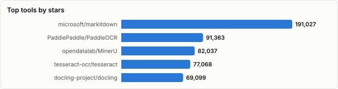
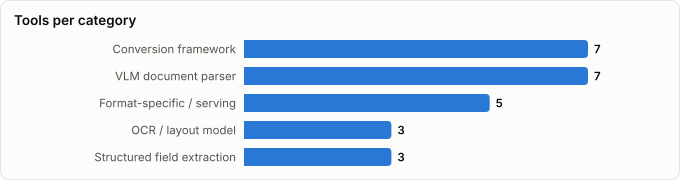

# Document Extraction Frameworks — Landscape & Task Rankings

> Derived from **kaiser-data**'s 2,398 starred repos (snapshot `2026-10-19T11:27:31.266Z`), cross-referenced with the repo-similarity graph (2,398 nodes / 8,025 edges, 39 communities). Task rankings are additionally backed by external benchmarks (OmniDocBench, opendataloader-bench) — see Methodology.
>
> Generated 2026-10-19 by `scripts/reports/document_extraction.py` (regenerate any time — no API cost).

## Executive summary

- **26 document-extraction tools** in your stars (**723,588★** combined), organized along the extraction pipeline:
  - **Conversion framework** (7): `markitdown`, `MinerU`, `docling`, `marker`, `unstructured`, `xberg`, `semtools`
  - **OCR / layout model** (3): `PaddleOCR`, `tesseract`, `DocLayout-YOLO`
  - **VLM document parser** (8): `DeepSeek-OCR`, `olmocr`, `zerox`, `nougat`, `dots.ocr`, `Dolphin`, `MonkeyOCR`, `DeepSeek-OCR-2`
  - **Structured field extraction** (3): `langextract`, `ade-python`, `instructor-js`
  - **Format-specific / serving** (5): `python-docx`, `marker-api`, `docling-mcp`, `PdfItDown`, `pdf-redactor`
- Mental model — extraction is a pipeline: **detect layout → OCR/parse elements → reconstruct structure (tables/formulas/reading order) → export markdown/JSON → extract typed fields**. Frameworks bundle the first four stages; field extractors sit on top.
- The field is mid-disruption: **single-VLM parsers** (`DeepSeek-OCR`, `dots.ocr`, `Dolphin`, `MonkeyOCR`) are replacing multi-model pipelines, and on OmniDocBench the best open models now beat GPT/Gemini-class generalists at parsing.
- Second trend: **token economics**. `DeepSeek-OCR`'s optical compression (~10× fewer vision tokens per page) and `olmocr`'s throughput focus optimize for LLM-corpus cost, not just accuracy.
- No single winner — the *task rankings* below are the point of this report: the best tool for table-heavy finance PDFs (`docling`) is not the best for CJK layouts (`MinerU`) or office-file bulk conversion (`markitdown`).

## The extraction pipeline at a glance

| Stage | What happens | Tools in your stars |
|---|---|---|
| **Layout detection** | Find blocks: text, tables, figures, formulas | `DocLayout-YOLO` (also built into every framework) |
| **OCR / recognition** | Pixels → characters | `PaddleOCR`, `tesseract`, all VLM parsers |
| **Structure reconstruction** | Tables, formulas, reading order | `docling` (TableFormer), `MinerU`, `marker`, `Dolphin`, `MonkeyOCR` |
| **Export** | Markdown / JSON / HTML for LLMs | `markitdown`, `xberg`, `unstructured`, `semtools`, `zerox`, `olmocr`, `nougat`, `dots.ocr`, `DeepSeek-OCR` |
| **Field extraction** | Typed, schema'd values out of parsed text | `langextract`, `ade-python`, `instructor-js` |
| **Serving / glue** | APIs, MCP, format utilities | `marker-api`, `docling-mcp`, `python-docx`, `pdf-redactor`, `PdfItDown` |

## Master comparison

Sorted by stars. `Health`/`Lifecycle` are the dataset's computed metrics; `Activity` is derived from days-since-push + 90-day commits.

| Tool | Category | Lang | License | ★ Stars | Lifecycle | Health | Activity | Last push | Age | Contrib(90d) |
|---|---|---|---|---|---|---|---|---|---|---|
| [microsoft/markitdown](https://github.com/microsoft/markitdown) | Conversion framework | Python | MIT | 191,027 (▲1,674) | Hot | 93 | very active | 15d ago | 1.9y | 49 |
| [PaddlePaddle/PaddleOCR](https://github.com/PaddlePaddle/PaddleOCR) | OCR / layout model | Python | Apache-2.0 | 91,363 (▲478) | Mature | 61 | active | 1mo ago | 6.5y | 2 |
| [opendatalab/MinerU](https://github.com/opendatalab/MinerU) | Conversion framework | Python | NOASSERTION | 82,037 (▲630) | Mature | 80 | very active | 0d ago | 2.6y | 2 |
| [tesseract-ocr/tesseract](https://github.com/tesseract-ocr/tesseract) | OCR / layout model | C++ | Apache-2.0 | 77,068 (▲177) | Classic | 65 | very active | 0d ago | 12.2y | 17 |
| [docling-project/docling](https://github.com/docling-project/docling) | Conversion framework | Python | MIT | 69,099 (▲465) | Mature | 97 | very active | 0d ago | 2.3y | 45 |
| [datalab-to/marker](https://github.com/datalab-to/marker) | Conversion framework | Python | Apache-2.0 | 40,538 (▲186) | Mature | 50 | active | 5d ago | 3.0y | 1 |
| [google/langextract](https://github.com/google/langextract) | Structured field extraction | Python | Apache-2.0 | 38,975 (▲41) | Hot | 69 | very active | 2d ago | 1.3y | 7 |
| [deepseek-ai/DeepSeek-OCR](https://github.com/deepseek-ai/DeepSeek-OCR) | VLM document parser | Python | MIT | 24,032 (▲107) | Declining | 9 | stale | 8mo ago | 1.0y | 0 |
| [allenai/olmocr](https://github.com/allenai/olmocr) | VLM document parser | Python | Apache-2.0 | 19,752 (▲22) | Declining | 36 | stale | 6mo ago | 2.1y | 0 |
| [Unstructured-IO/unstructured](https://github.com/Unstructured-IO/unstructured) | Conversion framework | HTML | Apache-2.0 | 15,575 (▲18) | Classic | 94 | very active | 3d ago | 4.1y | 29 |
| [getomni-ai/zerox](https://github.com/getomni-ai/zerox) | VLM document parser | TypeScript | MIT | 12,247 (▼8) | Abandoned | 3 | stale | 1.4y ago | 2.2y | 0 |
| [facebookresearch/nougat](https://github.com/facebookresearch/nougat) | VLM document parser | Python | MIT | 10,087 (▲8) | Abandoned | 5 | stale | 1.7y ago | 3.4y | 0 |
| [xberg-io/xberg](https://github.com/xberg-io/xberg) | Conversion framework | Rust | MIT | 9,427 (▲27) | Hot | 80 | very active | 0d ago | 1.7y | 3 |
| [studio-dots-ai/dots.ocr](https://github.com/studio-dots-ai/dots.ocr) | VLM document parser | Python | MIT | 9,177 (▲9) | Declining | 17 | stale | 6mo ago | 1.2y | 0 |
| [bytedance/Dolphin](https://github.com/bytedance/Dolphin) | VLM document parser | Python | NOASSERTION | 9,066 (▲1) | Declining | 18 | stale | 6mo ago | 1.4y | 0 |
| [Yuliang-Liu/MonkeyOCR](https://github.com/Yuliang-Liu/MonkeyOCR) | VLM document parser | Python | Apache-2.0 | 6,652 (▲1) | Declining | 32 | slowing | 3mo ago | 1.4y | 0 |
| [python-openxml/python-docx](https://github.com/python-openxml/python-docx) | Format-specific / serving | Python | MIT | 5,747 (▲8) | Mature | 31 | slowing | 2mo ago | 13.0y | 0 |
| [deepseek-ai/DeepSeek-OCR-2](https://github.com/deepseek-ai/DeepSeek-OCR-2) | VLM document parser | Python | Apache-2.0 | 3,482 (▲21) | Declining | 9 | stale | 8mo ago | 8mo | 0 |
| [opendatalab/DocLayout-YOLO](https://github.com/opendatalab/DocLayout-YOLO) | OCR / layout model | Python | AGPL-3.0 | 2,294 (▲3) | Abandoned | 7 | stale | 1.5y ago | 2.0y | 0 |
| [run-llama/semtools](https://github.com/run-llama/semtools) | Conversion framework | Rust | MIT | 1,878 (▲5) | Declining | 31 | stale | 7mo ago | 1.2y | 0 |
| [landing-ai/ade-python](https://github.com/landing-ai/ade-python) | Structured field extraction | Python | Apache-2.0 | 1,038 (▲4) | Hot | 67 | very active | 17d ago | 1.1y | 4 |
| [adithya-s-k/marker-api](https://github.com/adithya-s-k/marker-api) | Format-specific / serving | Python | GPL-3.0 | 984 | Abandoned | 2 | stale | 2.0y ago | 2.4y | 0 |
| [567-labs/instructor-js](https://github.com/567-labs/instructor-js) | Structured field extraction | TypeScript | MIT | 802 | Abandoned | 7 | stale | 1.7y ago | 2.8y | 0 |
| [docling-project/docling-mcp](https://github.com/docling-project/docling-mcp) | Format-specific / serving | Python | MIT | 776 (▲7) | Mature | 69 | very active | 5d ago | 1.6y | 5 |
| [AstraBert/PdfItDown](https://github.com/AstraBert/PdfItDown) | Format-specific / serving | Rust | MIT | 252 (▲2) | Declining | 46 | slowing | 3mo ago | 1.8y | 0 |
| [JoshData/pdf-redactor](https://github.com/JoshData/pdf-redactor) | Format-specific / serving | Python | CC0-1.0 | 213 | Abandoned | 2 | stale | 2.4y ago | 10.0y | 0 |

## Task rankings — which framework for which job

Ranked picks per task. Dataset metrics say who's *healthy*; external benchmarks say who's *accurate* — both feed these rankings (evidence noted per row, sources in Methodology).

| Task | 🥇 First pick | 🥈 Second | 🥉 Third | Evidence / note |
|---|---|---|---|---|
| **PDF → Markdown for RAG ingestion (general)** | `docling` — best accuracy of the free frameworks | `marker` — close second, faster with a GPU | `MinerU` — strong but heavier | opendataloader-bench (200 PDFs): docling 0.877 > marker 0.861 > MinerU 0.831. |
| **Complex layouts, CJK & multilingual docs** | `MinerU` — nothing else close for Chinese/Japanese/Korean layout | `dots.ocr` — one compact VLM, 100+ languages | `PaddleOCR` — PaddleOCR-VL tops OmniDocBench composite | OmniDocBench v1.5: PaddleOCR-VL 94.5, MinerU2.5 90.7, dots.ocr 88.4. |
| **Tables & financial documents** | `docling` — TableFormer — the table-structure specialist | `MinerU` — robust table + layout models | `marker` — good table fidelity, JSON output | Docling is the consensus pick when documents are table-heavy. |
| **Scientific papers & formulas** | `MinerU` — formula → LaTeX built in | `marker` — strong math handling via Surya | `nougat` — the pioneer — only for legacy pipelines | Nougat defined the task but is unmaintained; MinerU/marker superseded it. |
| **Scanned documents & handwriting** | `DeepSeek-OCR` — VLM robustness + handwriting | `PaddleOCR` — classic pick, 80+ languages | `tesseract` — fine for clean printed scans only | VLM parsers degrade gracefully on noise where classic OCR breaks. |
| **Office documents (DOCX/PPTX/XLSX) at speed** | `markitdown` — instant, dependency-light | `xberg` — Rust-core speed, 97+ formats, no GPU | `docling` — when you also need layout fidelity | Native-format parsing needs no vision models — lightweight tools win. |
| **Enterprise ETL across many formats** | `unstructured` — 25+ formats, chunking, connectors | `xberg` — self-hosted polyglot core, REST/MCP | `docling` — IBM backing, growing connector set | Pick by ops model: managed pipeline vs. embedded library. |
| **Structured field extraction (invoices, entities, forms)** | `langextract` — grounded extraction with source offsets | `zerox` — simplest path via hosted vision models | `ade-python` — schema-driven agentic extraction | Parse-then-extract beats end-to-end when you need auditable provenance. |
| **Building LLM training corpora at scale** | `olmocr` — purpose-built for dataset linearization | `DeepSeek-OCR` — 10× token compression cuts corpus cost | `MinerU` — the OpenDataLab production pipeline | Throughput and token economics dominate accuracy deltas at corpus scale. |
| **Agent / CLI integration** | `docling-mcp` — document conversion as MCP tools | `semtools` — parse + semantic search on the command line | `marker-api` — marker behind a REST endpoint | Serving wrappers matter more than parser choice for agent workflows. |

## By category

### Conversion framework

_End-to-end document → markdown/JSON systems — the layer most people mean by 'document extraction'. Differ mainly in accuracy/speed trade-off, format breadth, and GPU appetite._

- **[microsoft/markitdown](https://github.com/microsoft/markitdown)** · 191,027★ · Python · Hot  
  Microsoft's lightweight anything→Markdown converter — speed and format coverage over layout fidelity.  
  topics: langchain, openai, autogen-extension, autogen, markdown, microsoft-office, pdf
- **[opendatalab/MinerU](https://github.com/opendatalab/MinerU)** · 82,037★ · Python · Mature  
  PDF/Office → LLM-ready markdown/JSON; the reference for complex layouts and CJK documents (MinerU2.5 VLM).  
  topics: extract-data, layout-analysis, ocr, parser, pdf, pdf-converter, python, document-analysis
- **[docling-project/docling](https://github.com/docling-project/docling)** · 69,099★ · Python · Mature  
  IBM's document toolkit — TableFormer table structure, PDF/DOCX/PPTX/HTML/audio, first-class LlamaIndex/LangChain integration.  
  topics: ai, convert, documents, pdf, tables, document-parser, document-parsing, docx
- **[datalab-to/marker](https://github.com/datalab-to/marker)** · 40,538★ · Python · Mature  
  Fast, accurate PDF → markdown + JSON; GPU-accelerated (Surya models), strong structure fidelity.  
  topics: —
- **[Unstructured-IO/unstructured](https://github.com/Unstructured-IO/unstructured)** · 15,575★ · HTML · Classic  
  Open-source ETL for 25+ file formats → clean structured elements; the enterprise-pipeline pick.  
  topics: deep-learning, document-parsing, machine-learning, nlp, ocr, information-retrieval, data-pipelines, ml
- **[xberg-io/xberg](https://github.com/xberg-io/xberg)** · 9,427★ · Rust · Hot  
  Polyglot document-intelligence framework with a Rust core (ex-Kreuzberg) — 97+ formats, CPU-only, library/CLI/REST/MCP.  
  topics: text-extraction, document-intelligence, metadata-extraction, pdf-extraction, pdfium, python, rag, table-extraction
- **[run-llama/semtools](https://github.com/run-llama/semtools)** · 1,878★ · Rust · Declining  
  LlamaIndex's CLI: document parsing + semantic search as composable command-line tools.  
  topics: cli, embeddings, parser, rust, search, semantic, semantic-search, static-embedding

### OCR / layout model

_The classic recognition layer: character recognition and layout detection as standalone engines/models, used inside the frameworks above._

- **[PaddlePaddle/PaddleOCR](https://github.com/PaddlePaddle/PaddleOCR)** · 91,363★ · Python · Mature  
  The dominant OCR toolkit (80+ languages) + PP-Structure pipelines; its PaddleOCR-VL models top OmniDocBench.  
  topics: ocr, chineseocr, pdf2markdown, pp-ocr, pp-structure, document-parsing, document-translation, kie
- **[tesseract-ocr/tesseract](https://github.com/tesseract-ocr/tesseract)** · 77,068★ · C++ · Classic  
  The veteran C++ OCR engine — battle-tested baseline for clean printed scans, zero GPU.  
  topics: tesseract, tesseract-ocr, ocr, lstm, machine-learning, ocr-engine, hacktoberfest
- **[opendatalab/DocLayout-YOLO](https://github.com/opendatalab/DocLayout-YOLO)** · 2,294★ · Python · Abandoned  
  YOLO-v10-based layout detection — best standalone layout mAP on OmniDocBench component tests.  
  topics: —

### VLM document parser

_The disruption: one vision-language model reads the page end-to-end. Compact open models now beat closed generalist VLMs on document parsing benchmarks._

- **[deepseek-ai/DeepSeek-OCR](https://github.com/deepseek-ai/DeepSeek-OCR)** · 24,032★ · Python · Declining  
  Contexts optical compression — ~10× fewer vision tokens per page at ≥90% decoding accuracy; built for LLM-scale corpora.  
  topics: —
- **[allenai/olmocr](https://github.com/allenai/olmocr)** · 19,752★ · Python · Declining  
  AllenAI's toolkit for linearizing PDFs into LLM training data — throughput-oriented, permissively licensed.  
  topics: —
- **[getomni-ai/zerox](https://github.com/getomni-ai/zerox)** · 12,247★ · TypeScript · Abandoned  
  OCR by delegation: renders pages and asks a hosted vision model (GPT/Claude/Gemini) — zero local models.  
  topics: ocr, pdf
- **[facebookresearch/nougat](https://github.com/facebookresearch/nougat)** · 10,087★ · Python · Abandoned  
  Meta's neural OCR for academic PDFs (math → LaTeX) — historically important, now effectively unmaintained.  
  topics: —
- **[studio-dots-ai/dots.ocr](https://github.com/studio-dots-ai/dots.ocr)** · 9,177★ · Python · Declining  
  Multilingual layout + parsing in a single compact VLM (~3B); 88.4 on OmniDocBench v1.5.  
  topics: —
- **[bytedance/Dolphin](https://github.com/bytedance/Dolphin)** · 9,066★ · Python · Declining  
  ByteDance's ACL-2025 parser — heterogeneous anchor prompting (layout first, parallel element parsing second).  
  topics: document-analysis, layout-analysis, ocr, parser, pdf, pdf-converter, pdf-parser, python
- **[Yuliang-Liu/MonkeyOCR](https://github.com/Yuliang-Liu/MonkeyOCR)** · 6,652★ · Python · Declining  
  Lightweight structure-recognition-relation model; MonkeyOCR-pro-3B beat Gemini/GPT-4o-class models on OmniDocBench.  
  topics: —
- **[deepseek-ai/DeepSeek-OCR-2](https://github.com/deepseek-ai/DeepSeek-OCR-2)** · 3,482★ · Python · Declining  
  Second iteration ('Visual Causal Flow') — 91.1 on OmniDocBench v1.5, ahead of most open VLM parsers.  
  topics: —

### Structured field extraction

_Post-parsing: pull typed, schema-validated values (entities, invoice fields, dates) out of the recovered text — with provenance._

- **[google/langextract](https://github.com/google/langextract)** · 38,975★ · Python · Hot  
  Google's library for LLM extraction of structured info with precise source grounding (char-level offsets).  
  topics: llm, nlp, python, gemini-ai, information-extration, large-language-models, structured-data, gemini
- **[landing-ai/ade-python](https://github.com/landing-ai/ade-python)** · 1,038★ · Python · Hot  
  LandingAI's Agentic Document Extraction client — schema-driven field extraction from visually complex docs.  
  topics: —
- **[567-labs/instructor-js](https://github.com/567-labs/instructor-js)** · 802★ · TypeScript · Abandoned  
  Schema-first structured outputs for LLMs (instructor's JS port) — the validation layer after parsing.  
  topics: llm, openai, zod

### Format-specific / serving

_Utilities and wrappers: format-native readers/writers, redaction, and API/MCP layers that put parsers behind an endpoint._

- **[python-openxml/python-docx](https://github.com/python-openxml/python-docx)** · 5,747★ · Python · Mature  
  The standard library for reading and writing Word .docx programmatically.  
  topics: —
- **[adithya-s-k/marker-api](https://github.com/adithya-s-k/marker-api)** · 984★ · Python · Abandoned  
  Deployable REST API wrapping marker — PDF→markdown as a service.  
  topics: fastapi, marker, pdf-converter, pdf-files, pdf-parser, pdf-parsing, api, rest-api
- **[docling-project/docling-mcp](https://github.com/docling-project/docling-mcp)** · 776★ · Python · Mature  
  Docling exposed as MCP tools — document conversion for agent workflows.  
  topics: —
- **[AstraBert/PdfItDown](https://github.com/AstraBert/PdfItDown)** · 252★ · Rust · Declining  
  The inverse direction: convert anything → PDF (normalization before extraction).  
  topics: csv, docx, html, json, markdown, package, pdf, pdf-conversion
- **[JoshData/pdf-redactor](https://github.com/JoshData/pdf-redactor)** · 213★ · Python · Abandoned  
  General-purpose PDF text-layer redaction for Python.  
  topics: —

## Spotlight: the single-VLM takeover

Two years ago document extraction meant a *pipeline of specialist models* (layout detector → OCR → table model → formula model). The 2025–26 wave collapses that into **one vision-language model per page**:

- **Accuracy**: on OmniDocBench v1.5, open parsers now score 88–95 (PaddleOCR-VL 94.5, DeepSeek-OCR-2 91.1, MinerU2.5 90.7, dots.ocr 88.4) — *above* generalist frontier VLMs on the same benchmark.
- **Size**: the winners are ~3B-parameter models (`dots.ocr`, `MonkeyOCR-pro-3B`, `DeepSeek-OCR`) — self-hostable on a single GPU.
- **Token economics**: `DeepSeek-OCR` reframes OCR as *context compression* — 1,000 text tokens → ~100 vision tokens at ~97% fidelity — which matters more than accuracy when feeding million-page corpora to LLMs.
- **Consequence**: classic engines (`tesseract`) and pipeline frameworks keep the CPU-only and clean-scan niches; everything else is converging on VLMs, with the frameworks (`MinerU`, `marker`, `docling`) absorbing them as backends.

## Graph analysis — how they relate

**Community clustering.** These 26 tools span **11 of the graph's 39 communities**.

- **Community 23** (5): `run-llama/semtools`, `getomni-ai/zerox`, `bytedance/Dolphin`, `landing-ai/ade-python`, `adithya-s-k/marker-api`
- **Community 0** (5): `allenai/olmocr`, `studio-dots-ai/dots.ocr`, `Yuliang-Liu/MonkeyOCR`, `python-openxml/python-docx`, `JoshData/pdf-redactor`
- **Community 1** (3): `microsoft/markitdown`, `xberg-io/xberg`, `tesseract-ocr/tesseract`
- **Community 2** (3): `opendatalab/MinerU`, `datalab-to/marker`, `opendatalab/DocLayout-YOLO`
- **Community 4** (3): `docling-project/docling`, `Unstructured-IO/unstructured`, `docling-project/docling-mcp`
- **Community 36** (2): `deepseek-ai/DeepSeek-OCR`, `deepseek-ai/DeepSeek-OCR-2`

**Centrality (PageRank in the full 2,398-repo graph)** — most 'hub-like' extraction tools in your ecosystem:

- `datalab-to/marker` — PageRank 0.0030
- `opendatalab/MinerU` — PageRank 0.0010
- `deepseek-ai/DeepSeek-OCR-2` — PageRank 0.0006
- `google/langextract` — PageRank 0.0004
- `Yuliang-Liu/MonkeyOCR` — PageRank 0.0004
- `microsoft/markitdown` — PageRank 0.0004
- `run-llama/semtools` — PageRank 0.0004
- `AstraBert/PdfItDown` — PageRank 0.0004
- `bytedance/Dolphin` — PageRank 0.0004
- `PaddlePaddle/PaddleOCR` — PageRank 0.0004

**Direct links between extraction tools** (top similarity edges where both endpoints are in this report):

- `datalab-to/marker` ⇄ `opendatalab/MinerU` (w=1.050) — authors: github-actions[bot]
- `docling-project/docling-mcp` ⇄ `docling-project/docling` (w=0.633) — authors: ceberam, github-actions[bot]
- `landing-ai/ade-python` ⇄ `datalab-to/marker` (w=0.550) — authors: github-actions[bot]
- `deepseek-ai/DeepSeek-OCR-2` ⇄ `deepseek-ai/DeepSeek-OCR` (w=0.550)
- `opendatalab/DocLayout-YOLO` ⇄ `opendatalab/MinerU` (w=0.550)
- `bytedance/Dolphin` ⇄ `opendatalab/MinerU` (w=0.521) — topics: document-analysis, layout-analysis, ocr, parser
- `opendatalab/MinerU` ⇄ `docling-project/docling` (w=0.286) — topics: pdf, pdf-converter, docx, pptx; authors: github-actions[bot]
- `Unstructured-IO/unstructured` ⇄ `docling-project/docling` (w=0.234) — topics: document-parsing, pdf-to-text, pdf, pdf-to-json; authors: mittalpk
- `bytedance/Dolphin` ⇄ `getomni-ai/zerox` (w=0.222) — topics: ocr, pdf
- `PaddlePaddle/PaddleOCR` ⇄ `opendatalab/MinerU` (w=0.210) — topics: ocr, ai4science, pdf-extractor-rag, pdf-parser
- `adithya-s-k/marker-api` ⇄ `bytedance/Dolphin` (w=0.183) — topics: pdf-converter, pdf-parser
- `adithya-s-k/marker-api` ⇄ `opendatalab/MinerU` (w=0.141) — topics: pdf-converter, pdf-parser

## Maintenance & risk signal

Bus factor = commit concentration (1 = single-maintainer risk). Pair with lifecycle + activity before adopting.

| Tool | Health | Lifecycle | Activity | Bus factor | Top-author share | Releases |
|---|---|---|---|---|---|---|
| docling-project/docling | 97 | Mature | very active | 9 | 14% | 227 |
| Unstructured-IO/unstructured | 94 | Classic | very active | 5 | 18% | 248 |
| microsoft/markitdown | 93 | Hot | very active | 6 | 30% | 23 |
| opendatalab/MinerU | 80 | Mature | very active | 1 | 93% | 199 |
| xberg-io/xberg | 80 | Hot | very active | 1 | 74% | 126 |
| google/langextract | 69 | Hot | very active | 1 | 77% | 20 |
| docling-project/docling-mcp | 69 | Mature | very active | 1 | 55% | 24 |
| landing-ai/ade-python | 67 | Hot | very active | 1 | 53% | 62 |
| tesseract-ocr/tesseract | 65 | Classic | very active | 1 | 64% | 36 |
| PaddlePaddle/PaddleOCR | 61 | Mature | active | 1 | 50% | 33 |
| datalab-to/marker | 50 | Mature | active | 1 | 100% | 72 |
| AstraBert/PdfItDown | 46 | Declining | slowing | 0 | 0% | 36 |
| allenai/olmocr | 36 | Declining | stale | 0 | 0% | 44 |
| Yuliang-Liu/MonkeyOCR | 32 | Declining | slowing | 0 | 0% | 0 |
| run-llama/semtools | 31 | Declining | stale | 0 | 0% | 17 |
| python-openxml/python-docx | 31 | Mature | slowing | 0 | 0% | 0 |
| bytedance/Dolphin | 18 | Declining | stale | 0 | 0% | 0 |
| studio-dots-ai/dots.ocr | 17 | Declining | stale | 0 | 0% | 0 |
| deepseek-ai/DeepSeek-OCR | 9 | Declining | stale | 0 | 0% | 0 |
| deepseek-ai/DeepSeek-OCR-2 | 9 | Declining | stale | 0 | 0% | 0 |
| opendatalab/DocLayout-YOLO | 7 | Abandoned | stale | 0 | 0% | 0 |
| 567-labs/instructor-js | 7 | Abandoned | stale | 0 | 0% | 18 |
| facebookresearch/nougat | 5 | Abandoned | stale | 0 | 0% | 2 |
| getomni-ai/zerox | 3 | Abandoned | stale | 0 | 0% | 9 |
| JoshData/pdf-redactor | 2 | Abandoned | stale | 0 | 0% | 0 |
| adithya-s-k/marker-api | 2 | Abandoned | stale | 0 | 0% | 0 |

Watch items: `nougat` is effectively frozen (use `MinerU`/`marker` instead); `zerox` reads as abandoned in this snapshot — its hosted-VLM pattern is trivial to reimplement if it stays stale; `marker-api` and `pdf-redactor` are stale single-maintainer wrappers — pin versions or vendor them.

## Adjacent (deliberately not listed as extraction tools)

- **Stirling-Tools/Stirling-PDF** (94,514★) — PDF *manipulation* app (edit/merge/sign, OCR jobs via OCRmyPDF) — a toolbox, not an extraction framework
- **run-llama/llama_index** (52,566★) — positions itself as a 'document agent and OCR platform', but it's covered in the *RAG tooling* report
- **firecrawl/firecrawl** (192,930★) — extraction for the *web* (scraping/crawling), not documents
- **microsoft/OmniParser** (25,530★) — parses GUI *screenshots* for computer-use agents, not documents
- **VectifyAI/PageIndex** (39,276★) — document *retrieval* (vectorless RAG) — see the RAG tooling report
- **tjmlabs/ColiVara** (1,487★) — visual document *retrieval* (ColPali-style), not extraction
- **kba/awesome-ocr** (3,124★) — link collection, not a tool
- **tk04/Marker** (1,194★) — markdown *editor* that happens to share marker's name — no relation

## Methodology & caveats

- **Source**: `data/classified.json` + `public/data/graph.json` for all repo metrics and graph structure. No API calls at generation time; fully reproducible.
- **Selection**: keyword scan (pdf / ocr / document / layout / extract / parsing / docx / markdown-convert) + manual curation into pipeline stages. Retrieval, web scraping, GUI parsing, and PDF-editing apps were routed to adjacent reports or excluded (see above).
- **Task rankings** additionally cite external benchmark evidence gathered 2026-07: [OmniDocBench](https://github.com/opendatalab/OmniDocBench) v1.5 composite scores, the [opendataloader-bench 200-PDF comparison](https://pdfmux.com/blog/pdfmux-vs-pymupdf-vs-marker-vs-docling/), and vendor papers (MinerU2.5, dots.ocr, DeepSeek-OCR, Dolphin). Benchmark numbers are point-in-time and partly vendor-reported — treat rankings as defaults, not verdicts.
- **Metrics** (health, lifecycle, bus_factor) are precomputed at snapshot time and may lag GitHub's current state.
- Re-run after a fresh `classified.json` to refresh stars/activity; benchmark citations are frozen text and need manual review on major model releases.

Tools covered: 26 · Snapshot: 2026-10-19T11:27:31.266Z
