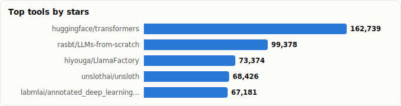
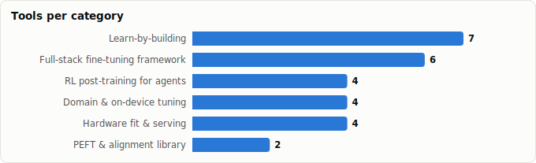

# Fine-Tuning & Post-Training Stack — Which Trainer for Which Task

> Derived from **kaiser-data**'s 1,350 starred repos (snapshot `2026-07-20T08:33:57.852Z`), cross-referenced with the repo-similarity graph (1,350 nodes / 4,379 edges, 28 communities). Task rankings are additionally backed by external 2026 framework comparisons and agent-RL surveys — see Methodology.
>
> Generated 2026-07-20 by `scripts/reports/finetuning_stack.py` (regenerate any time — no API cost).

## Executive summary

- **27 fine-tuning / post-training tools** in your stars (**748,226★** combined), organized along the training ladder:
  - **Full-stack fine-tuning framework** (6): `transformers`, `LlamaFactory`, `unsloth`, `pytorch-lightning`, `PaddleNLP`, `axolotl`
  - **PEFT & alignment library** (2): `peft`, `trl`
  - **RL post-training for agents** (4): `ART`, `OpenClaw-RL`, `Memento`, `OpenEnv`
  - **Learn-by-building** (7): `LLMs-from-scratch`, `annotated_deep_learning_paper_implementations`, `nanoGPT`, `Practical_RL`, `notebooks`, `LLM-engineer-handbook`, `pico-train`
  - **Domain & on-device tuning** (4): `rf-detr`, `mlx-vlm`, `distil-whisper`, `fed-rag`
  - **Hardware fit & serving** (4): `llmfit`, `airllm`, `transformerlab-app`, `lorax`
- Mental model — post-training is a ladder: **check hardware fit → SFT/LoRA on your data → preference alignment (DPO) → RL post-training (GRPO) → serve the tuned artifact**. Most projects stop at rung two; the interesting 2026 action is on rungs three and four.
- The frameworks have **converged on features and now compete on ergonomics**: `unsloth` (speed on one GPU), `LlamaFactory` (zero-code breadth), `axolotl` (reproducible team configs) all do LoRA/QLoRA/DPO/GRPO/vision — the choice is about *how you want to work*, not what's possible.
- Second trend: **RL post-training went agentic.** `trl` shipped GRPO for everyone, `ART` rebuilt it around multi-turn tool-using rollouts, and `OpenEnv` is standardizing the environment side. Meanwhile `Memento` argues the contrarian case: adapt the agent's *memory*, keep the weights frozen.
- No single winner — the *task rankings* below are the point: the best tool for a weekend QLoRA (`unsloth`) is not the best for team SFT (`axolotl`) or for understanding what the optimizer actually does (`nanoGPT`).

## The post-training ladder at a glance

| Rung | What happens | Tools in your stars |
|---|---|---|
| **0 · Hardware fit** | What can this machine train/run? | `llmfit` |
| **1 · Learn the mechanics** | From-scratch training loops, courses, recipes | `LLMs-from-scratch`, `nanoGPT`, `annotated_…_implementations`, `Practical_RL`, `pico-train`, `notebooks` |
| **2 · SFT / LoRA** | Supervised fine-tune on your data | `unsloth`, `LlamaFactory`, `axolotl`, `transformers`, `peft`, `pytorch-lightning`, `PaddleNLP` |
| **3 · Preference alignment** | DPO / reward models | `trl` (+ framework wrappers) |
| **4 · RL post-training** | GRPO on tasks & tool-use rollouts | `ART`, `OpenClaw-RL`, `OpenEnv` |
| **Domain variants** | Vision, speech, RAG, Apple Silicon | `mlx-vlm`, `rf-detr`, `distil-whisper`, `fed-rag` |
| **5 · Serve the artifact** | Adapters & tuned weights in production | `lorax`, `airllm`, `transformerlab-app` |

## Master comparison

Sorted by stars. `Health`/`Lifecycle` are the dataset's computed metrics; `Activity` is derived from days-since-push + 90-day commits.

| Tool | Category | Lang | License | ★ Stars | Lifecycle | Health | Activity | Last push | Age | Contrib(90d) |
|---|---|---|---|---|---|---|---|---|---|---|
| [huggingface/transformers](https://github.com/huggingface/transformers) | Full-stack fine-tuning framework | Python | Apache-2.0 | 162,754 (▲15) | Classic | 99 | very active | 0d ago | 7.7y | 48 |
| [rasbt/LLMs-from-scratch](https://github.com/rasbt/LLMs-from-scratch) | Learn-by-building | Jupyter Notebook | NOASSERTION | 99,415 (▲37) | Mature | 52 | active | 8d ago | 3.0y | 5 |
| [hiyouga/LlamaFactory](https://github.com/hiyouga/LlamaFactory) | Full-stack fine-tuning framework | Python | Apache-2.0 | 73,385 (▲11) | Classic | 84 | very active | 3d ago | 3.1y | 34 |
| [unslothai/unsloth](https://github.com/unslothai/unsloth) | Full-stack fine-tuning framework | Python | Apache-2.0 | 68,445 (▲19) | Mature | 88 | very active | 0d ago | 2.6y | 22 |
| [labmlai/annotated_deep_learning_paper_implementations](https://github.com/labmlai/annotated_deep_learning_paper_implementations) | Learn-by-building | Python | MIT | 67,190 (▲9) | Mature | 23 | slowing | 5mo ago | 5.9y | 0 |
| [karpathy/nanoGPT](https://github.com/karpathy/nanoGPT) | Learn-by-building | Python | MIT | 61,335 (▲14) | Declining | 12 | stale | 8mo ago | 3.6y | 0 |
| [Lightning-AI/pytorch-lightning](https://github.com/Lightning-AI/pytorch-lightning) | Full-stack fine-tuning framework | Python | Apache-2.0 | 31,240 | Classic | 78 | very active | 0d ago | 7.3y | 14 |
| [AlexsJones/llmfit](https://github.com/AlexsJones/llmfit) | Hardware fit & serving | Rust | MIT | 29,811 (▲96) | Hot | 78 | very active | 0d ago | 5mo | 9 |
| [lyogavin/airllm](https://github.com/lyogavin/airllm) | Hardware fit & serving | Jupyter Notebook | Apache-2.0 | 23,755 (▲151) | Mature | 57 | very active | 4d ago | 3.1y | 1 |
| [huggingface/peft](https://github.com/huggingface/peft) | PEFT & alignment library | Python | Apache-2.0 | 21,418 (▲3) | Classic | 86 | very active | 6d ago | 3.7y | 38 |
| [huggingface/trl](https://github.com/huggingface/trl) | PEFT & alignment library | Python | Apache-2.0 | 18,886 (▲6) | Classic | 84 | very active | 0d ago | 6.3y | 14 |
| [PaddlePaddle/PaddleNLP](https://github.com/PaddlePaddle/PaddleNLP) | Full-stack fine-tuning framework | Python | Apache-2.0 | 12,957 (▲1) | Mature | 43 | active | 1mo ago | 5.5y | 1 |
| [axolotl-ai-cloud/axolotl](https://github.com/axolotl-ai-cloud/axolotl) | Full-stack fine-tuning framework | Python | Apache-2.0 | 12,217 (▲2) | Classic | 84 | very active | 3d ago | 3.3y | 15 |
| [OpenPipe/ART](https://github.com/OpenPipe/ART) | RL post-training for agents | Python | Apache-2.0 | 10,495 (▲1) | Hot | 79 | very active | 2d ago | 1.4y | 10 |
| [roboflow/rf-detr](https://github.com/roboflow/rf-detr) | Domain & on-device tuning | Python | Apache-2.0 | 8,611 (▲7) | Hot | 79 | very active | 0d ago | 1.3y | 18 |
| [yandexdataschool/Practical_RL](https://github.com/yandexdataschool/Practical_RL) | Learn-by-building | Jupyter Notebook | Unlicense | 6,544 (▲1) | Mature | 29 | slowing | 3mo ago | 9.5y | 0 |
| [Gen-Verse/OpenClaw-RL](https://github.com/Gen-Verse/OpenClaw-RL) | RL post-training for agents | Python | Apache-2.0 | 5,588 | Rising | 44 | active | 1mo ago | 4mo | 1 |
| [unslothai/notebooks](https://github.com/unslothai/notebooks) | Learn-by-building | Jupyter Notebook | LGPL-3.0 | 5,518 | Hot | 52 | very active | 2d ago | 1.6y | 4 |
| [Blaizzy/mlx-vlm](https://github.com/Blaizzy/mlx-vlm) | Domain & on-device tuning | Python | MIT | 5,177 (▲2) | Mature | 84 | very active | 0d ago | 2.3y | 7 |
| [transformerlab/transformerlab-app](https://github.com/transformerlab/transformerlab-app) | Hardware fit & serving | Python | AGPL-3.0 | 5,162 | Mature | 80 | very active | 1d ago | 2.6y | 4 |
| [SylphAI-Inc/LLM-engineer-handbook](https://github.com/SylphAI-Inc/LLM-engineer-handbook) | Learn-by-building | — | MIT | 4,982 | Declining | 7 | stale | 11mo ago | 1.7y | 0 |
| [huggingface/distil-whisper](https://github.com/huggingface/distil-whisper) | Domain & on-device tuning | Python | MIT | 4,091 | Abandoned | 4 | stale | 1.5y ago | 2.7y | 0 |
| [predibase/lorax](https://github.com/predibase/lorax) | Hardware fit & serving | Python | Apache-2.0 | 3,817 (▲1) | Mature | 38 | active | 1mo ago | 2.8y | 1 |
| [Memento-Teams/Memento](https://github.com/Memento-Teams/Memento) | RL post-training for agents | Python | MIT | 2,531 | Declining | 11 | stale | 9mo ago | 1.1y | 0 |
| [huggingface/OpenEnv](https://github.com/huggingface/OpenEnv) | RL post-training for agents | Python | BSD-3-Clause | 2,434 (▲3) | Hot | 75 | very active | 2d ago | 9mo | 14 |
| [pico-lm/pico-train](https://github.com/pico-lm/pico-train) | Learn-by-building | Python | Apache-2.0 | 318 | Declining | 24 | slowing | 5mo ago | 1.8y | 0 |
| [VectorInstitute/fed-rag](https://github.com/VectorInstitute/fed-rag) | Domain & on-device tuning | Python | Apache-2.0 | 150 | Declining | 35 | active | 28d ago | 1.5y | 0 |

## Task rankings — which stack for which job

Ranked picks per task. Dataset metrics say who's *healthy*; external comparisons say who's *fast or capable* — both feed these rankings (evidence noted per row, sources in Methodology).

| Task | 🥇 First pick | 🥈 Second | 🥉 Third | Evidence / note |
|---|---|---|---|---|
| **LoRA/QLoRA on a single consumer GPU** | `unsloth` — ~2× faster, ~70% less VRAM via Triton kernels | `LlamaFactory` — zero-code; wraps Unsloth kernels, small overhead | `axolotl` — works, but slowest of the three on one GPU | Llama-3.1-8B QLoRA, A100-40GB, identical configs: Unsloth 3.2 h, LLaMA-Factory 3.4 h, Axolotl 5.8 h (2026 round-ups). |
| **Zero-code / GUI fine-tuning** | `LlamaFactory` — LlamaBoard web UI over 100+ LLMs/VLMs | `transformerlab-app` — full train/eval/chat workbench | `unsloth` — Unsloth Studio web UI for train + run | LLaMA-Factory is the consensus no-code pick across 2026 comparisons. |
| **Team-scale SFT (multi-GPU, reproducible)** | `axolotl` — YAML configs, FSDP & DeepSpeed built in | `LlamaFactory` — scales up with a larger method matrix | `pytorch-lightning` — the generic 1→10k-GPU trainer | Axolotl is repeatedly cited as the reproducible multi-GPU default in its free OSS version. |
| **Preference alignment (DPO / reward models)** | `trl` — SFT + RM + DPO + GRPO unified in v1.0 | `LlamaFactory` — DPO/KTO/ORPO behind config flags | `axolotl` — DPO/GRPO via YAML recipes | TRL v1.0 (April 2026) unified the post-training stack; the frameworks wrap its trainers. |
| **RL post-training for tool-using agents (GRPO)** | `ART` — built for multi-turn agent rollouts; vLLM + TRL/Unsloth inside | `trl` — most accessible GRPOTrainer — single GPU, synchronous loop | `OpenEnv` — the environment interface to plug tasks into either | 2026 agent-RL surveys: ART/Unsloth for accessible GRPO; verl/OpenRLHF (not starred) for datacenter-scale async RL. |
| **Understanding LLM training from first principles** | `LLMs-from-scratch` — the structured, book-quality path | `nanoGPT` — smallest real training loop that works | `pico-train` — training with full checkpoint transparency | nanoGPT is frozen by design (no push ~8 months) — that's a feature for learning, a bug for production. |
| **Fine-tuning on Apple Silicon** | `mlx-vlm` — VLM tuning on unified memory, no CUDA | `transformerlab-app` — MLX backend behind a GUI | `LLMs-from-scratch` — runs fine on MPS at teaching scale | MLX ecosystem: a Mistral-7B LoRA adapter trains in <30 min on an M2 16GB (mlx-lm docs, 2026). |
| **Serving fleets of tuned models on small hardware** | `lorax` — 1000s of LoRA adapters batched on one GPU | `airllm` — 70B-class inference on a single 4GB GPU | `llmfit` — plan the hardware fit *before* you train | LoRAX's per-request adapter loading is unmatched at high adapter counts; for a handful of adapters vLLM suffices (see local-vs-infra report). |

## By category

### Full-stack fine-tuning framework

_End-to-end trainers: data in, tuned weights out. Feature parity is near-total in 2026 (LoRA/QLoRA/DPO/GRPO/vision everywhere) — pick by workflow: speed (`unsloth`), zero-code (`LlamaFactory`), YAML reproducibility (`axolotl`)._

- **[huggingface/transformers](https://github.com/huggingface/transformers)** · 162,754★ · Python · Classic  
  The model-definition layer everything above builds on; `Trainer` remains the vanilla baseline.  
  topics: nlp, natural-language-processing, pytorch, pytorch-transformers, transformer, model-hub, pretrained-models, speech-recognition
- **[hiyouga/LlamaFactory](https://github.com/hiyouga/LlamaFactory)** · 73,385★ · Python · Classic  
  Unified efficient fine-tuning of 100+ LLMs & VLMs — the zero-code pick (LlamaBoard web UI, CLI, ACL 2024).  
  topics: fine-tuning, llama, llm, peft, transformers, rlhf, qlora, quantization
- **[unslothai/unsloth](https://github.com/unslothai/unsloth)** · 68,445★ · Python · Mature  
  The single-GPU speed king — custom Triton kernels give ~2× faster training and ~70% less VRAM than stock HF.  
  topics: fine-tuning, llama, llms, mistral, gemma, llama3, unsloth, llm
- **[Lightning-AI/pytorch-lightning](https://github.com/Lightning-AI/pytorch-lightning)** · 31,240★ · Python · Classic  
  Generic training orchestration — pretrain/finetune any model on 1 or 10,000 GPUs with zero code changes.  
  topics: python, deep-learning, artificial-intelligence, ai, pytorch, data-science, machine-learning
- **[PaddlePaddle/PaddleNLP](https://github.com/PaddlePaddle/PaddleNLP)** · 12,957★ · Python · Mature  
  Baidu's LLM/SLM training & serving library — the pick inside the Paddle ecosystem.  
  topics: nlp, embedding, bert, ernie, paddlenlp, pretrained-models, transformers, information-extraction
- **[axolotl-ai-cloud/axolotl](https://github.com/axolotl-ai-cloud/axolotl)** · 12,217★ · Python · Classic  
  YAML-driven, reproducible post-training with FSDP & DeepSpeed out of the box — the team/multi-GPU pick.  
  topics: fine-tuning, llm

### PEFT & alignment library

_The Hugging Face layer the frameworks wrap: `peft` for adapter methods, `trl` for the SFT→DPO→GRPO trainer stack. Use directly when you want control, via a framework when you want convenience._

- **[huggingface/peft](https://github.com/huggingface/peft)** · 21,418★ · Python · Classic  
  State-of-the-art parameter-efficient fine-tuning: LoRA, QLoRA, DoRA, IA³ — the adapter layer under most trainers.  
  topics: adapter, diffusion, llm, parameter-efficient-learning, python, pytorch, transformers, lora
- **[huggingface/trl](https://github.com/huggingface/trl)** · 18,886★ · Python · Classic  
  The post-training reference: SFT, reward modeling, DPO and GRPO unified in one library (v1.0, 2026).  
  topics: —

### RL post-training for agents

_The 2026 frontier: reward multi-step *agent behavior*, not single responses. GRPO made it tractable; the fight is now over rollout infrastructure and environment interfaces._

- **[OpenPipe/ART](https://github.com/OpenPipe/ART)** · 10,495★ · Python · Hot  
  Agent Reinforcement Trainer — GRPO for *multi-turn* tool-using agents; vLLM rollouts + TRL/Unsloth training under the hood.  
  topics: llms, lora, reinforcement-learning, agent, agentic-ai, grpo, rl, qwen
- **[Gen-Verse/OpenClaw-RL](https://github.com/Gen-Verse/OpenClaw-RL)** · 5,588★ · Python · Rising  
  'Train any agent simply by talking' — natural-language-driven agent RL on top of the OpenClaw ecosystem.  
  topics: async, memory-systems, open-claw, openclaw-skills, rlhf, sglang, skill-learning, slime
- **[Memento-Teams/Memento](https://github.com/Memento-Teams/Memento)** · 2,531★ · Python · Declining  
  The counterpoint: fine-tune LLM *agents* without fine-tuning LLMs — case-based memory instead of weight updates.  
  topics: —
- **[huggingface/OpenEnv](https://github.com/huggingface/OpenEnv)** · 2,434★ · Python · Hot  
  Interface library for RL post-training environments — the emerging standard for plugging envs into trainers.  
  topics: —

### Learn-by-building

_Repos whose product is understanding: from-scratch GPTs, annotated papers, RL courses. Several are intentionally frozen — fine for learning, wrong as dependencies._

- **[rasbt/LLMs-from-scratch](https://github.com/rasbt/LLMs-from-scratch)** · 99,415★ · Jupyter Notebook · Mature  
  Implement a ChatGPT-like LLM in PyTorch step by step — the book-quality path from zero to pretraining + finetuning.  
  topics: gpt, large-language-models, llm, python, pytorch, ai, artificial-intelligence, language-model
- **[labmlai/annotated_deep_learning_paper_implementations](https://github.com/labmlai/annotated_deep_learning_paper_implementations)** · 67,190★ · Python · Mature  
  60+ paper implementations with side-by-side notes — transformers, LoRA, RLHF internals, readable.  
  topics: deep-learning, deep-learning-tutorial, pytorch, gan, transformers, reinforcement-learning, optimizers, neural-networks
- **[karpathy/nanoGPT](https://github.com/karpathy/nanoGPT)** · 61,335★ · Python · Declining  
  The simplest, fastest repo for training/finetuning mid-sized GPTs — frozen by design, still the canonical teaching codebase.  
  topics: —
- **[yandexdataschool/Practical_RL](https://github.com/yandexdataschool/Practical_RL)** · 6,544★ · Jupyter Notebook · Mature  
  A course in reinforcement learning in the wild — the RL foundations under DPO/GRPO.  
  topics: reinforcement-learning, course-materials, deep-learning, deep-reinforcement-learning, git-course, mooc, tensorflow, pytorch
- **[unslothai/notebooks](https://github.com/unslothai/notebooks)** · 5,518★ · Jupyter Notebook · Hot  
  250+ ready-to-run fine-tuning & RL notebooks (text, vision, audio, TTS, embeddings) — the recipe box.  
  topics: unsloth
- **[SylphAI-Inc/LLM-engineer-handbook](https://github.com/SylphAI-Inc/LLM-engineer-handbook)** · 4,982★ · — · Declining  
  Curated map of training/serving/fine-tuning resources — orientation, not code.  
  topics: —
- **[pico-lm/pico-train](https://github.com/pico-lm/pico-train)** · 318★ · Python · Declining  
  Minimalistic framework for *transparently* training LMs — every checkpoint + activation logged for research.  
  topics: —

### Domain & on-device tuning

_Fine-tuning beyond cloud-GPU text LLMs: vision models, speech distillation, RAG systems, and Apple-Silicon-native training._

- **[roboflow/rf-detr](https://github.com/roboflow/rf-detr)** · 8,611★ · Python · Hot  
  Real-time detection/segmentation architecture built to be fine-tuned on custom vision datasets.  
  topics: computer-vision, detr, machine-learning, object-detection, rf-detr, instance-segmentation, sota
- **[Blaizzy/mlx-vlm](https://github.com/Blaizzy/mlx-vlm)** · 5,177★ · Python · Mature  
  Fine-tune and run vision-language models natively on Apple Silicon via MLX — unified memory instead of CUDA.  
  topics: llava, llm, mlx, vision-transformer, apple-silicon, idefics, local-ai, paligemma
- **[huggingface/distil-whisper](https://github.com/huggingface/distil-whisper)** · 4,091★ · Python · Abandoned  
  Knowledge distillation applied: Whisper 6× faster / 50% smaller within 1% WER — the distillation reference recipe.  
  topics: audio, speech-recognition, whisper
- **[VectorInstitute/fed-rag](https://github.com/VectorInstitute/fed-rag)** · 150★ · Python · Declining  
  Fine-tune RAG systems end-to-end (retriever + generator), including federated setups.  
  topics: deep-learning, federated-learning, llms, machine-learning, rag

### Hardware fit & serving

_Before and after the training run: planning what fits, and serving the tuned adapters/weights — including the many-adapters and tiny-GPU cases._

- **[AlexsJones/llmfit](https://github.com/AlexsJones/llmfit)** · 29,811★ · Rust · Hot  
  One command to find which models your hardware can run or train — the planning step before any tuning run.  
  topics: llm, skill, localai, gguf, mlx, unsloth
- **[lyogavin/airllm](https://github.com/lyogavin/airllm)** · 23,755★ · Jupyter Notebook · Mature  
  Layer-by-layer offloading: 70B-class inference on a single 4GB GPU — run what you tuned on tiny hardware.  
  topics: chinese-nlp, finetune, generative-ai, instruct-gpt, instruction-set, llama, llm, lora
- **[transformerlab/transformerlab-app](https://github.com/transformerlab/transformerlab-app)** · 5,162★ · Python · Mature  
  Open research workbench GUI: train, tune, evaluate and chat with models locally (CUDA + MLX backends).  
  topics: electron, llama, llms, lora, rlhf, transformers, mlx, diffusion
- **[predibase/lorax](https://github.com/predibase/lorax)** · 3,817★ · Python · Mature  
  Multi-LoRA inference server — dynamically batch 1000s of fine-tuned adapters on one GPU.  
  topics: fine-tuning, gpt, llama, llm, llm-inference, llm-serving, llmops, lora

## Spotlight: SFT → DPO → GRPO — post-training became a ladder

Fine-tuning in 2024 meant one thing: LoRA on instruction data. The 2026 stack is a **ladder of increasingly behavioral objectives**, and your stars cover every rung:

- **SFT commoditized.** `unsloth`, `LlamaFactory` and `axolotl` reached feature parity (all: LoRA/QLoRA, full FT, DPO, GRPO, VLMs). Differentiation moved to kernels (`unsloth`: ~2× faster, ~70% less VRAM on one GPU) and workflow (zero-code UI vs YAML).
- **Alignment standardized.** `trl` v1.0 unified SFT, reward modeling, DPO and GRPO into one library — every framework above now wraps its trainers rather than reimplementing them.
- **The agent turn.** Single-turn GRPO trains chatbots; agents need credit assignment across *multi-turn tool-use rollouts*. That's `ART`'s pitch (vLLM-powered rollouts, TRL/Unsloth training), `OpenEnv`'s environment interface, and `OpenClaw-RL`'s train-by-talking layer.
- **The contrarian rung.** `Memento` fine-tunes the agent's episodic *memory* instead of its weights — worth knowing before you spend GPU-weeks: sometimes the cheapest post-training is no training.
- **What's deliberately absent**: datacenter-scale async RL (verl, OpenRLHF) isn't in your stars — if you outgrow `ART`/`trl` scale, that's the next ecosystem to evaluate.

## Graph analysis — how they relate

**Community clustering.** These 27 tools span **9 of the graph's 28 communities**.

- **Community 22** (12): `hiyouga/LlamaFactory`, `unslothai/unsloth`, `axolotl-ai-cloud/axolotl`, `huggingface/transformers`, `huggingface/peft`, `huggingface/trl`, `huggingface/OpenEnv`, `unslothai/notebooks`, `Blaizzy/mlx-vlm`, `huggingface/distil-whisper`, `lyogavin/airllm`, `predibase/lorax`
- **Community 16** (6): `Lightning-AI/pytorch-lightning`, `PaddlePaddle/PaddleNLP`, `rasbt/LLMs-from-scratch`, `labmlai/annotated_deep_learning_paper_implementations`, `yandexdataschool/Practical_RL`, `roboflow/rf-detr`
- **Community 14** (2): `Gen-Verse/OpenClaw-RL`, `transformerlab/transformerlab-app`
- **Community 0** (2): `Memento-Teams/Memento`, `pico-lm/pico-train`

**Centrality (PageRank in the full 1,350-repo graph)** — most 'hub-like' training tools in your ecosystem:

- `Lightning-AI/pytorch-lightning` — PageRank 0.0033
- `huggingface/peft` — PageRank 0.0017
- `huggingface/trl` — PageRank 0.0016
- `axolotl-ai-cloud/axolotl` — PageRank 0.0015
- `huggingface/transformers` — PageRank 0.0014
- `huggingface/OpenEnv` — PageRank 0.0010
- `roboflow/rf-detr` — PageRank 0.0010
- `predibase/lorax` — PageRank 0.0010
- `AlexsJones/llmfit` — PageRank 0.0010
- `transformerlab/transformerlab-app` — PageRank 0.0009

**Direct links between training tools** (top similarity edges where both endpoints are in this report):

- `unslothai/notebooks` ⇄ `unslothai/unsloth` (w=0.814) — topics: unsloth; authors: danielhanchen, Etherll, shimmyshimmer
- `huggingface/trl` ⇄ `huggingface/OpenEnv` (w=0.790) — authors: sergiopaniego, dependabot[bot], mishig25
- `huggingface/peft` ⇄ `huggingface/transformers` (w=0.713) — topics: llm, python, pytorch; authors: kaixuanliu, jiqing-feng
- `huggingface/peft` ⇄ `huggingface/trl` (w=0.672) — authors: dependabot[bot], Strongich, mishig25
- `huggingface/trl` ⇄ `huggingface/transformers` (w=0.652) — authors: albertvillanova, kashif, michaelbenayoun
- `huggingface/distil-whisper` ⇄ `huggingface/transformers` (w=0.650) — topics: audio, speech-recognition
- `huggingface/peft` ⇄ `huggingface/OpenEnv` (w=0.630) — authors: dependabot[bot], mishig25
- `huggingface/distil-whisper` ⇄ `huggingface/peft` (w=0.550)
- `huggingface/distil-whisper` ⇄ `huggingface/trl` (w=0.550)
- `axolotl-ai-cloud/axolotl` ⇄ `predibase/lorax` (w=0.365) — topics: fine-tuning, llm; authors: Anai-Guo
- `huggingface/peft` ⇄ `predibase/lorax` (w=0.362) — topics: llm, pytorch, transformers, lora
- `hiyouga/LlamaFactory` ⇄ `predibase/lorax` (w=0.349) — topics: fine-tuning, llama, llm, transformers; authors: Anai-Guo
- `hiyouga/LlamaFactory` ⇄ `unslothai/unsloth` (w=0.344) — topics: fine-tuning, llama, llm, qwen; authors: lxcxjxhx
- `huggingface/peft` ⇄ `axolotl-ai-cloud/axolotl` (w=0.328) — topics: llm, fine-tuning; authors: dependabot[bot], lxcxjxhx
- `rasbt/LLMs-from-scratch` ⇄ `Lightning-AI/pytorch-lightning` (w=0.300) — topics: python, pytorch, ai, artificial-intelligence
- …and 5 more.

## Maintenance & risk signal

Bus factor = commit concentration (1 = single-maintainer risk). Pair with lifecycle + activity before adopting.

| Tool | Health | Lifecycle | Activity | Bus factor | Top-author share | Releases |
|---|---|---|---|---|---|---|
| huggingface/transformers | 99 | Classic | very active | 9 | 9% | 268 |
| unslothai/unsloth | 88 | Mature | very active | 3 | 20% | 43 |
| huggingface/peft | 86 | Classic | very active | 3 | 36% | 32 |
| hiyouga/LlamaFactory | 84 | Classic | very active | 7 | 12% | 36 |
| axolotl-ai-cloud/axolotl | 84 | Classic | very active | 2 | 41% | 32 |
| huggingface/trl | 84 | Classic | very active | 2 | 40% | 89 |
| Blaizzy/mlx-vlm | 84 | Mature | very active | 2 | 40% | 69 |
| transformerlab/transformerlab-app | 80 | Mature | very active | 1 | 84% | 114 |
| OpenPipe/ART | 79 | Hot | very active | 2 | 43% | 58 |
| roboflow/rf-detr | 79 | Hot | very active | 1 | 64% | 24 |
| Lightning-AI/pytorch-lightning | 78 | Classic | very active | 2 | 37% | 174 |
| AlexsJones/llmfit | 78 | Hot | very active | 1 | 74% | 122 |
| huggingface/OpenEnv | 75 | Hot | very active | 1 | 56% | 7 |
| lyogavin/airllm | 57 | Mature | very active | 1 | 100% | 2 |
| rasbt/LLMs-from-scratch | 52 | Mature | active | 1 | 64% | 0 |
| unslothai/notebooks | 52 | Hot | very active | 1 | 69% | 0 |
| Gen-Verse/OpenClaw-RL | 44 | Rising | active | 1 | 100% | 0 |
| PaddlePaddle/PaddleNLP | 43 | Mature | active | 1 | 100% | 49 |
| predibase/lorax | 38 | Mature | active | 1 | 100% | 21 |
| VectorInstitute/fed-rag | 35 | Declining | active | 0 | 0% | 35 |
| yandexdataschool/Practical_RL | 29 | Mature | slowing | 0 | 0% | 2 |
| pico-lm/pico-train | 24 | Declining | slowing | 0 | 0% | 1 |
| labmlai/annotated_deep_learning_paper_implementations | 23 | Mature | slowing | 0 | 0% | 0 |
| karpathy/nanoGPT | 12 | Declining | stale | 0 | 0% | 0 |
| Memento-Teams/Memento | 11 | Declining | stale | 0 | 0% | 0 |
| SylphAI-Inc/LLM-engineer-handbook | 7 | Declining | stale | 0 | 0% | 0 |
| huggingface/distil-whisper | 4 | Abandoned | stale | 0 | 0% | 0 |

Watch items: `nanoGPT` and most learn-by-building repos read as frozen — expected and fine for their purpose, but don't depend on them. `distil-whisper` is abandoned in this snapshot (the *technique* lives on in papers and Whisper forks). `Memento` has gone quiet since its paper. `lorax` is slowing (single-maintainer, ~2 months between pushes) — if adapter serving is on your critical path, benchmark vLLM's multi-LoRA as the fallback. `PaddleNLP` is healthy mainly inside the Paddle ecosystem.

## Which one should you use?

- **One consumer GPU, weekend project** → `unsloth` (fastest, least VRAM), recipes from `unslothai/notebooks`.
- **You want a UI, not YAML** → `LlamaFactory` (LlamaBoard) or `transformerlab-app` (research workbench).
- **Team runs, reproducible configs, multi-GPU** → `axolotl`.
- **You're aligning, not just tuning** → `trl` directly (SFT→DPO→GRPO), frameworks when convenient.
- **Training an *agent*, not a chatbot** → `ART` (+ `OpenEnv` for environments); read `Memento` first to check whether memory beats weights for your case.
- **You want to *understand* it** → `LLMs-from-scratch` cover to cover, then `nanoGPT`, then `pico-train` for introspection.
- **Mac-only hardware** → `mlx-vlm` and the MLX ecosystem.
- **After training** → `lorax` for many adapters, `airllm` for big models on tiny GPUs, `llmfit` *before* all of this to plan the fit.

## Adjacent (deliberately not listed as training tools)

- **vllm-project/vllm** (86,682★) — the serving standard for *finished* models — covered in the local-vs-infra-stack report
- **ollama/ollama** (176,491★) — local inference runtime, not a trainer — see local-vs-infra-stack
- **flyteorg/flyte** (7,145★) — general ML/data orchestration — schedules training, doesn't implement it
- **beam-cloud/beta9** (1,709★) — serverless GPU substrate *where* you train, not *how*
- **zai-org/GLM-V** (2,356★) — open model weights trained with scalable RL — a result of this stack, not a tool in it
- **openai/CLIP** (34,033★) — landmark pretraining research, effectively frozen — read it, don't build on the repo
- **NVIDIA/physicsnemo** (3,067★) — training framework for physics/simulation models, out of LLM post-training scope
- **facebookresearch/BenchMARL** (642★) — multi-agent RL *benchmarking* research, not LLM post-training
- **microsoft/generative-ai-for-beginners** (113,260★) — general GenAI curriculum — broader than training

## Methodology & caveats

- **Source**: `data/classified.json` + `public/data/graph.json` for all repo metrics and graph structure. No API calls at generation time; fully reproducible.
- **Selection**: keyword scan (fine-tune / lora / peft / post-train / rlhf / grpo / dpo / pretrain / distill) + manual curation into ladder stages. Serving runtimes, orchestrators, and model-weight repos were routed to adjacent reports or excluded (see above).
- **Task rankings** additionally cite external evidence gathered 2026-07: the [Spheron](https://www.spheron.network/blog/axolotl-vs-unsloth-vs-torchtune/) and [index.dev](https://www.index.dev/skill-vs-skill/ai-axolotl-vs-llama-factory-vs-unsloth) framework comparisons (A100/RTX-4070 timings), the [Turing Post agent-RL tools survey](https://www.turingpost.com/p/agent-rl-training-tools), Hugging Face's [async-RL landscape post](https://huggingface.co/blog/async-rl-training-landscape), the [OpenPipe ART announcement](https://openpipe.ai/blog/art-trainer-a-new-rl-trainer-for-agents), and MLX ecosystem docs. Timings are point-in-time and partly vendor-reported — treat rankings as defaults, not verdicts.
- **Metrics** (health, lifecycle, bus_factor) are precomputed at snapshot time and may lag GitHub's current state.
- Re-run after a fresh `classified.json` to refresh stars/activity; benchmark citations are frozen text and need manual review when major releases land.

Tools covered: 27 · Snapshot: 2026-07-20T08:33:57.852Z
