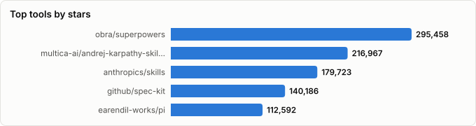
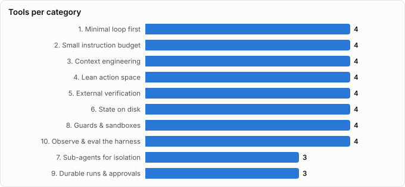

# Harness Engineering — Ten Methods That Make an Agent Harness Good

> Derived from **kaiser-data**'s 2,304 starred repos (snapshot `2026-10-05T13:01:39.533Z`), cross-referenced with the repo-similarity graph (2,304 nodes / 7,632 edges, 40 communities). Evidence frozen 2026-10-01.
>
> Generated 2026-10-05 by `scripts/reports/harness_engineering.py` (regenerate any time — no API cost).

## Executive summary

- The **agent-harnesses** report asks *which* harness approach to pick. This one asks *how to make any harness good* — ten methods, in the order you'd apply them, each backed by published evidence and mapped to **37 repos** in your stars (**1,712,941★**) that implement it.
- **The through-line: the harness should do less, and verify more.** The 2026 evidence consistently rewards *subtraction* (fewer tools, shorter instructions, elided context) and *external ground truth* (tests, browsers, hooks), and punishes self-assessment and unenforced prose.
- **Three highest-leverage moves**, if you do nothing else:
  1. **External verification** — self-grading loops claimed progress 100% of the time while 56% of cycles made none (Park & Choi, 2026).
  2. **Lean action space** — code-against-tools cut one workflow from ~150k to ~2k tokens (Anthropic); removing 80% of tools took one agent from 80% to 100% success (Vercel).
  3. **Context management** — the single most important component as budgets shrink, mostly by preventing overflow failures (Fan et al., 176 configs).
- **Measure your own harness.** Component effects are model- and budget-dependent, and almost no public harness repos log whether their rules fire.

## The ten methods

| # | Method | The rule | Evidence |
|---|---|---|---|
| 1 | **Minimal loop first** | Start from the smallest loop that works, and add a harness component only in response to an observed failure — never on the assumption the model can't cope. | Practitioner consensus in 2026 (HumanLayer, marmelab survey). Fan et al. (176 configurations, 4 models) found a bash-only action space gives capable models *substantially lower cost* at equal performance; heavy scaffolding mostly helps weaker models. |
| 2 | **Small instruction budget** | Keep the always-loaded instruction file short and hand-written (~60–100 lines); push everything else into skills or docs that load on demand. | HumanLayer recommends <60 lines; OpenAI's harness write-up (via marmelab) lists context crowding, importance dilution, decay and untestability as failure modes of large instruction files. marmelab reports machine-generated context files *reduced* success and raised cost 20%+; human-written ones gained only ~4%. |
| 3 | **Context engineering** | Treat the context window as the scarcest resource: keep the prefix stable for KV-cache hits, make history append-only, elide bulky tool output with rules *before* resorting to LLM summarization, and make compression restorable. | Fan et al.: context management matters most as budgets shrink, and rule-based elision before summarization works best — mainly by preventing overflow failures. Manus: KV-cache hit rate is the key production metric (cached input ~10× cheaper); keep URLs/paths so dropped content can be re-fetched. |
| 4 | **Lean action space** | Fewer, sharper tools. Prefer CLIs the model already knows over wide MCP surfaces, load tool definitions on demand, and let the agent write code against tools so intermediate data never enters context. | Anthropic's *code execution with MCP* (Nov 2025): a Drive→Salesforce workflow fell from ~150k to ~2k tokens (−98.7%). Vercel (as reported by marmelab) removed 80% of an agent's tools: success 80%→100%, latency 724s→141s. HumanLayer swapped the Linear MCP server for a small CLI + examples. |
| 5 | **External verification** | Give the agent back-pressure it cannot talk its way past: type checks, tests, linters, a browser on the real app. Swallow success output; surface only errors, with the fix written into the message. | Park & Choi (2026): self-evaluating loops claimed improvement 100% of the time while 56% of cycles made zero or negative progress (the 'progress mirage'); LLM judges accepted 44% of real regressions. The mirage vanished on tasks with an externally verifiable boundary. |
| 6 | **State on disk** | Persist the plan, feature list and progress to files (JSON beats markdown for anything the agent must not rewrite), commit often, and let each fresh session re-orient from those artifacts. | Anthropic's long-running harness (Nov 2025): an initializer agent writes a feature list + progress file + git repo; each coding session picks one item, verifies it, updates the files. JSON was edited inappropriately less often than markdown. Manus keeps a live todo.md to hold goals in recent attention. |
| 7 | **Sub-agents for isolation** | Use sub-agents to *isolate context*, not to role-play: give them a bounded task (explore, trace, research) and have them return a condensed answer with `file:line` citations. Keep handoff chains short. | HumanLayer: sub-agents keep the parent in the 'smart zone' and can run on cheaper models. marmelab collects counter-evidence on *reviewer* agents (one study: −8pp on a 41% baseline) and Microsoft's finding that >4 handoffs almost always failed. |
| 8 | **Guards & sandboxes** | Enforce rules with code, not prose: pre-execution hooks, permission gates, and an isolated sandbox per agent. Scan third-party skills and MCP servers before trust. | marmelab cites an analysis of 481 public CLAUDE.md files where only 4–16% of written security rules had any detectable enforcement, and reports action-by-action approval beating pre-written permission rules by 20+pp at blocking bad actions. HumanLayer warns skill registries have shipped malicious skills. |
| 9 | **Durable runs & approvals** | Make long runs survivable: checkpoint, retry and resume instead of restarting; put human approval at the plan and at irreversible actions rather than everywhere. | Follows from methods 6 and 8: durable state lets a crashed or rate-limited run resume, and approval at the irreversible step is where action-by-action review pays off. Evidence here is architectural rather than benchmarked. |
| 10 | **Observe & eval the harness** | Trace what the harness actually does (which rules fire, hook blocks, iterations, tokens), evaluate harness changes on a frozen task set with both should-fire and should-not-fire cases, and record why every control exists so it can be removed when models improve. | marmelab's survey: only 5 of 391 harness repos logged skill activations or blocks, and only one published before/after measurements for its rules. Fan et al. show component effects are model- and budget-dependent — so measure on *your* model. |

## Best repo per method

Top three from your stars for applying each method. ⚠ marks picks the snapshot reads as declining/abandoned.

| Method | 🥇 First pick | 🥈 Second | 🥉 Third |
|---|---|---|---|
| **1. Minimal loop first** | `pi` — smallest complete loop to fork | `claude-code-system-prompts` — read a mature harness's prompts | `SWE-agent` — ACI design as a research reference |
| **2. Small instruction budget** | `agents.md` — the portable short contract _(⚠ declining)_ | `skills` — canonical progressive-disclosure format | `superpowers` — methodology packaged as skills |
| **3. Context engineering** | `context-mode` — keeps raw tool output out of context | `rtk` — drop-in shell-output filter | `headroom` — compresses logs/files/RAG chunks |
| **4. Lean action space** | `jcodemunch-mcp` — symbol-level reads, not whole files | `serena` — LSP-backed retrieval + edits | `agent-browser` — compact agent-first CLI |
| **5. External verification** | `playwright-mcp` — agent checks the running app | `ultracite` — fast deterministic lint gate | `open-code-review` — review pass on every diff |
| **6. State on disk** | `planning-with-files` — plan/progress files out of the box | `spec-kit` — spec as the durable source of truth | `ralph` — fresh-context loop over a PRD _(⚠ declining)_ |
| **7. Sub-agents for isolation** | `deepagents` — isolation built into the SDK | `awesome-claude-code-subagents` — patterns to copy | `oh-my-claudecode` — delegation inside Claude Code |
| **8. Guards & sandboxes** | `cc-safety-net` — blocks destructive commands pre-exec | `container-use` — one container per agent | `SkillSpector` — vet skills before loading |
| **9. Durable runs & approvals** | `open-multi-agent` — durable approvals + run records | `trigger.dev` — retries/resume for long jobs | `plannotator` — human approves the plan |
| **10. Observe & eval the harness** | `langfuse` — traces + evals, self-hostable | `harbor` — frozen task-set evals | `codeburn` — token/cost per agent, local |

## Master comparison

Sorted by stars. `Health`/`Lifecycle` are the dataset's computed metrics; `Activity` is derived from days-since-push + 90-day commits.

| Tool | Method | Lang | License | ★ Stars | Lifecycle | Health | Activity | Last push | Age | Contrib(90d) |
|---|---|---|---|---|---|---|---|---|---|---|
| [obra/superpowers](https://github.com/obra/superpowers) | 2. Small instruction budget | Shell | MIT | 295,458 (▲4,081) | Hot | 73 | very active | 8d ago | 12mo | 5 |
| [multica-ai/andrej-karpathy-skills](https://github.com/multica-ai/andrej-karpathy-skills) | 2. Small instruction budget | — | — | 216,967 (▲1,911) | Declining | 21 | slowing | 5mo ago | 8mo | 0 |
| [anthropics/skills](https://github.com/anthropics/skills) | 2. Small instruction budget | Python | — | 179,723 (▲1,678) | Mature | 50 | active | 2d ago | 1.0y | 5 |
| [github/spec-kit](https://github.com/github/spec-kit) | 6. State on disk | Python | MIT | 140,186 (▲1,361) | Hot | 84 | very active | 2d ago | 1.1y | 27 |
| [earendil-works/pi](https://github.com/earendil-works/pi) | 1. Minimal loop first | TypeScript | MIT | 112,592 (▲3,333) | Hot | 80 | very active | 0d ago | 1.2y | 14 |
| [rtk-ai/rtk](https://github.com/rtk-ai/rtk) | 3. Context engineering | Rust | Apache-2.0 | 82,410 (▲723) | Hot | 75 | very active | 0d ago | 8mo | 12 |
| [headroomlabs-ai/headroom](https://github.com/headroomlabs-ai/headroom) | 3. Context engineering | Python | Apache-2.0 | 74,440 (▲683) | Hot | 98 | very active | 0d ago | 9mo | 46 |
| [upstash/context7](https://github.com/upstash/context7) | 4. Lean action space | TypeScript | MIT | 62,701 (▲287) | Hot | 79 | very active | 0d ago | 1.5y | 8 |
| [alibaba/open-code-review](https://github.com/alibaba/open-code-review) | 5. External verification | Go | Apache-2.0 | 43,802 (▲2,772) | Hot | 98 | very active | 0d ago | 4mo | 45 |
| [vercel-labs/agent-browser](https://github.com/vercel-labs/agent-browser) | 4. Lean action space | Rust | Apache-2.0 | 43,528 (▲350) | Hot | 77 | very active | 2d ago | 8mo | 8 |
| [Yeachan-Heo/oh-my-claudecode](https://github.com/Yeachan-Heo/oh-my-claudecode) | 7. Sub-agents for isolation | TypeScript | MIT | 39,585 (▲237) | Hot | 85 | very active | 0d ago | 8mo | 7 |
| [microsoft/playwright-mcp](https://github.com/microsoft/playwright-mcp) | 5. External verification | TypeScript | Apache-2.0 | 37,827 (▲271) | Hot | 73 | very active | 7d ago | 1.5y | 8 |
| [langfuse/langfuse](https://github.com/langfuse/langfuse) | 10. Observe & eval the harness | TypeScript | NOASSERTION | 35,396 (▲363) | Classic | 94 | very active | 0d ago | 3.4y | 21 |
| [oraios/serena](https://github.com/oraios/serena) | 4. Lean action space | Python | NOASSERTION | 30,000 (▲212) | Hot | 79 | very active | 0d ago | 1.5y | 18 |
| [langchain-ai/deepagents](https://github.com/langchain-ai/deepagents) | 7. Sub-agents for isolation | Python | MIT | 29,948 (▲188) | Hot | 84 | very active | 0d ago | 1.2y | 12 |
| [OthmanAdi/planning-with-files](https://github.com/OthmanAdi/planning-with-files) | 6. State on disk | Shell | MIT | 27,287 (▲175) | Hot | 79 | very active | 4d ago | 9mo | 6 |
| [promptfoo/promptfoo](https://github.com/promptfoo/promptfoo) | 10. Observe & eval the harness | TypeScript | MIT | 25,717 (▲278) | Classic | 84 | very active | 0d ago | 3.4y | 12 |
| [VoltAgent/awesome-claude-code-subagents](https://github.com/VoltAgent/awesome-claude-code-subagents) | 7. Sub-agents for isolation | Shell | MIT | 25,507 (▲193) | Hot | 58 | very active | 0d ago | 1.2y | 6 |
| [mksglu/context-mode](https://github.com/mksglu/context-mode) | 3. Context engineering | TypeScript | NOASSERTION | 25,441 (▲1,390) | Rising | 77 | very active | 0d ago | 7mo | 1 |
| [agentsmd/agents.md](https://github.com/agentsmd/agents.md) | 2. Small instruction budget | TypeScript | MIT | 24,772 (▲164) | Declining | 38 | active | 25d ago | 1.1y | 2 |
| [snarktank/ralph](https://github.com/snarktank/ralph) | 6. State on disk | TypeScript | MIT | 21,909 (▲54) | Declining | 13 | stale | 8mo ago | 9mo | 0 |
| [SWE-agent/SWE-agent](https://github.com/SWE-agent/SWE-agent) | 1. Minimal loop first | Python | MIT | 20,486 (▲84) | Mature | 49 | active | 7d ago | 2.5y | 2 |
| [NVIDIA/SkillSpector](https://github.com/NVIDIA/SkillSpector) | 8. Guards & sandboxes | Python | Apache-2.0 | 19,423 (▲1,167) | Hot | 83 | very active | 0d ago | 6mo | 14 |
| [triggerdotdev/trigger.dev](https://github.com/triggerdotdev/trigger.dev) | 9. Durable runs & approvals | TypeScript | Apache-2.0 | 16,467 (▲63) | Classic | 82 | very active | 0d ago | 3.8y | 17 |
| [Piebald-AI/claude-code-system-prompts](https://github.com/Piebald-AI/claude-code-system-prompts) | 1. Minimal loop first | JavaScript | MIT | 12,832 (▲68) | Rising | 77 | very active | 2d ago | 10mo | 2 |
| [cobusgreyling/loop-engineering](https://github.com/cobusgreyling/loop-engineering) | 6. State on disk | TypeScript | MIT | 11,421 (▲112) | Hot | 68 | very active | 0d ago | 3mo | 12 |
| [getagentseal/codeburn](https://github.com/getagentseal/codeburn) | 10. Observe & eval the harness | TypeScript | MIT | 11,341 (▲113) | Hot | 84 | very active | 0d ago | 5mo | 14 |
| [modem-dev/hunk](https://github.com/modem-dev/hunk) | 5. External verification | TypeScript | MIT | 9,508 (▲122) | Hot | 76 | very active | 1d ago | 6mo | 14 |
| [backnotprop/plannotator](https://github.com/backnotprop/plannotator) | 9. Durable runs & approvals | TypeScript | Apache-2.0 | 9,145 (▲231) | Hot | 79 | very active | 0d ago | 9mo | 11 |
| [open-multi-agent/open-multi-agent](https://github.com/open-multi-agent/open-multi-agent) | 9. Durable runs & approvals | TypeScript | MIT | 6,978 (▲25) | Hot | 79 | very active | 2d ago | 6mo | 10 |
| [harbor-framework/harbor](https://github.com/harbor-framework/harbor) | 10. Observe & eval the harness | Python | Apache-2.0 | 5,831 (▲235) | Hot | 94 | very active | 0d ago | 1.2y | 38 |
| [dagger/container-use](https://github.com/dagger/container-use) | 8. Guards & sandboxes | Go | Apache-2.0 | 4,055 (▲10) | Mature | 45 | active | 14d ago | 1.4y | 2 |
| [haydenbleasel/ultracite](https://github.com/haydenbleasel/ultracite) | 5. External verification | TypeScript | MIT | 3,305 (▲9) | Classic | 80 | very active | 0d ago | 4.6y | 5 |
| [jgravelle/jcodemunch-mcp](https://github.com/jgravelle/jcodemunch-mcp) | 4. Lean action space | Python | NOASSERTION | 2,730 (▲19) | Hot | 80 | very active | 0d ago | 7mo | 3 |
| [alexgreensh/token-optimizer](https://github.com/alexgreensh/token-optimizer) | 3. Context engineering | Python | NOASSERTION | 2,492 (▲123) | Hot | 80 | very active | 1d ago | 7mo | 3 |
| [kenryu42/cc-safety-net](https://github.com/kenryu42/cc-safety-net) | 8. Guards & sandboxes | TypeScript | MIT | 1,574 (▲19) | Rising | 80 | very active | 0d ago | 9mo | 2 |
| [Nicolepcx/harness_engineering](https://github.com/Nicolepcx/harness_engineering) | 1. Minimal loop first | Jupyter Notebook | — | 157 (▲4) | Declining | 40 | active | 1mo ago | 2mo | 1 |

## By method

### 1. Minimal loop first

**Rule.** Start from the smallest loop that works, and add a harness component only in response to an observed failure — never on the assumption the model can't cope.

**Evidence.** Practitioner consensus in 2026 (HumanLayer, marmelab survey). Fan et al. (176 configurations, 4 models) found a bash-only action space gives capable models *substantially lower cost* at equal performance; heavy scaffolding mostly helps weaker models.

- **[earendil-works/pi](https://github.com/earendil-works/pi)** · 112,592★ · TypeScript · Hot  
  Unified LLM API + small agent loop + TUI — a readable baseline to grow a harness from.  
  topics: —
- **[SWE-agent/SWE-agent](https://github.com/SWE-agent/SWE-agent)** · 20,486★ · Python · Mature  
  The project that named the *agent-computer interface* — proof that interface design moves scores.  
  topics: agent, ai, developer-tools, llm, agent-based-model, lms, cybersecurity
- **[Piebald-AI/claude-code-system-prompts](https://github.com/Piebald-AI/claude-code-system-prompts)** · 12,832★ · JavaScript · Rising  
  Every part of Claude Code's system prompt, tool descriptions and sub-agent prompts — a production harness to read.  
  topics: claude-code, claude-code-system-prompts, system-prompts
- **[Nicolepcx/harness_engineering](https://github.com/Nicolepcx/harness_engineering)** · 157★ · Jupyter Notebook · Declining  
  Code for the O'Reilly *Harness Engineering* book — worked examples of each harness layer.  
  topics: ai, ai-agent, ai-agents, ai-governance, ai-security, harness, harness-ai, harness-design

### 2. Small instruction budget

**Rule.** Keep the always-loaded instruction file short and hand-written (~60–100 lines); push everything else into skills or docs that load on demand.

**Evidence.** HumanLayer recommends <60 lines; OpenAI's harness write-up (via marmelab) lists context crowding, importance dilution, decay and untestability as failure modes of large instruction files. marmelab reports machine-generated context files *reduced* success and raised cost 20%+; human-written ones gained only ~4%.

- **[obra/superpowers](https://github.com/obra/superpowers)** · 295,458★ · Shell · Hot  
  Skills + methodology (TDD, plans, review) delivered as progressively-disclosed skills.  
  topics: ai, brainstorming, coding, obra, sdlc, skills, superpowers, subagent-driven-development
- **[multica-ai/andrej-karpathy-skills](https://github.com/multica-ai/andrej-karpathy-skills)** · 216,967★ · — · Declining  
  A single short CLAUDE.md of behavioural rules — the minimal-instructions end of the spectrum.  
  topics: —
- **[anthropics/skills](https://github.com/anthropics/skills)** · 179,723★ · Python · Mature  
  Reference Agent Skills: knowledge loaded on demand, not pinned in every turn.  
  topics: agent-skills
- **[agentsmd/agents.md](https://github.com/agentsmd/agents.md)** · 24,772★ · TypeScript · Declining  
  AGENTS.md — one short, portable repo contract instead of a sprawling prompt.  
  topics: —

### 3. Context engineering

**Rule.** Treat the context window as the scarcest resource: keep the prefix stable for KV-cache hits, make history append-only, elide bulky tool output with rules *before* resorting to LLM summarization, and make compression restorable.

**Evidence.** Fan et al.: context management matters most as budgets shrink, and rule-based elision before summarization works best — mainly by preventing overflow failures. Manus: KV-cache hit rate is the key production metric (cached input ~10× cheaper); keep URLs/paths so dropped content can be re-fetched.

- **[rtk-ai/rtk](https://github.com/rtk-ai/rtk)** · 82,410★ · Rust · Hot  
  CLI proxy that filters and condenses shell output for coding agents.  
  topics: agentic-coding, ai-coding, anthropic, claude-code, cli, command-line-tool, cost-reduction, developer-tools
- **[headroomlabs-ai/headroom](https://github.com/headroomlabs-ai/headroom)** · 74,440★ · Python · Hot  
  Compresses tool outputs, logs, files and RAG chunks before they reach the model.  
  topics: agent, ai, anthropic, compression, context-engineering, context-window, fastapi, langchain
- **[mksglu/context-mode](https://github.com/mksglu/context-mode)** · 25,441★ · TypeScript · Rising  
  Sandboxes tool output out of the context window (claims ~98% reduction).  
  topics: claude, claude-code, claude-code-plugins, mcp, skills, codex, copilot, opencode
- **[alexgreensh/token-optimizer](https://github.com/alexgreensh/token-optimizer)** · 2,492★ · Python · Hot  
  Finds 'ghost tokens' and helps sessions survive compaction without quality decay.  
  topics: agentskills, claude-code, token-optimization, claude-code-skill, context-window, token-usage, ghost-tokens, context-engineering

### 4. Lean action space

**Rule.** Fewer, sharper tools. Prefer CLIs the model already knows over wide MCP surfaces, load tool definitions on demand, and let the agent write code against tools so intermediate data never enters context.

**Evidence.** Anthropic's *code execution with MCP* (Nov 2025): a Drive→Salesforce workflow fell from ~150k to ~2k tokens (−98.7%). Vercel (as reported by marmelab) removed 80% of an agent's tools: success 80%→100%, latency 724s→141s. HumanLayer swapped the Linear MCP server for a small CLI + examples.

- **[upstash/context7](https://github.com/upstash/context7)** · 62,701★ · TypeScript · Hot  
  Fetches current, version-specific docs on demand instead of stuffing them into prompts.  
  topics: llm, mcp, mcp-server, vibe-coding
- **[vercel-labs/agent-browser](https://github.com/vercel-labs/agent-browser)** · 43,528★ · Rust · Hot  
  Browser automation as a compact CLI built for agents rather than a large MCP surface.  
  topics: —
- **[oraios/serena](https://github.com/oraios/serena)** · 30,000★ · Python · Hot  
  Semantic (LSP-backed) retrieval and editing tools — fewer, sharper code tools.  
  topics: agent, ai, vibe-coding, mcp-server, ai-coding, language-server, programming, claude
- **[jgravelle/jcodemunch-mcp](https://github.com/jgravelle/jcodemunch-mcp)** · 2,730★ · Python · Hot  
  Symbol-level code retrieval — return the function, not the file.  
  topics: claude, claude-code, ai-coding, ast, code-intelligence, context-window, cursor, developer-tools

### 5. External verification

**Rule.** Give the agent back-pressure it cannot talk its way past: type checks, tests, linters, a browser on the real app. Swallow success output; surface only errors, with the fix written into the message.

**Evidence.** Park & Choi (2026): self-evaluating loops claimed improvement 100% of the time while 56% of cycles made zero or negative progress (the 'progress mirage'); LLM judges accepted 44% of real regressions. The mirage vanished on tasks with an externally verifiable boundary.

- **[alibaba/open-code-review](https://github.com/alibaba/open-code-review)** · 43,802★ · Go · Hot  
  Hybrid deterministic + LLM code review run against the agent's diff.  
  topics: agent, code-review, code-review-assistant, harness, repository-level-context, agent-skills
- **[microsoft/playwright-mcp](https://github.com/microsoft/playwright-mcp)** · 37,827★ · TypeScript · Hot  
  Lets the agent drive the real app and check its own UI changes.  
  topics: mcp, playwright
- **[modem-dev/hunk](https://github.com/modem-dev/hunk)** · 9,508★ · TypeScript · Hot  
  Review-first terminal diff viewer — keeps a human verifying what the agent changed.  
  topics: cli, code-review, diff, git, tui, agents, jj, jujutsu
- **[haydenbleasel/ultracite](https://github.com/haydenbleasel/ultracite)** · 3,305★ · TypeScript · Classic  
  Zero-config lint/format — cheap, deterministic back-pressure inside the loop.  
  topics: biome, formatter, linter, cursor, mcp, vscode, windsurf, zed

### 6. State on disk

**Rule.** Persist the plan, feature list and progress to files (JSON beats markdown for anything the agent must not rewrite), commit often, and let each fresh session re-orient from those artifacts.

**Evidence.** Anthropic's long-running harness (Nov 2025): an initializer agent writes a feature list + progress file + git repo; each coding session picks one item, verifies it, updates the files. JSON was edited inappropriately less often than markdown. Manus keeps a live todo.md to hold goals in recent attention.

- **[github/spec-kit](https://github.com/github/spec-kit)** · 140,186★ · Python · Hot  
  Spec-driven development: the spec on disk steers each session.  
  topics: ai, copilot, development, engineering, prd, spec, spec-driven
- **[OthmanAdi/planning-with-files](https://github.com/OthmanAdi/planning-with-files)** · 27,287★ · Shell · Hot  
  Plans and progress persisted to files — crash-proof, resumable long tasks.  
  topics: claude, claude-code, claude-skills, manus, agent-skills, planning, autonomous-agents, codex
- **[snarktank/ralph](https://github.com/snarktank/ralph)** · 21,909★ · TypeScript · Declining  
  Fresh-context loop that re-reads a PRD and progress file until every item is done.  
  topics: —
- **[cobusgreyling/loop-engineering](https://github.com/cobusgreyling/loop-engineering)** · 11,421★ · TypeScript · Hot  
  Patterns and starters for designing the iteration itself.  
  topics: agentic-ai, ai-agents, claude-code, codex, devops-automation, github-actions, grok, llm

### 7. Sub-agents for isolation

**Rule.** Use sub-agents to *isolate context*, not to role-play: give them a bounded task (explore, trace, research) and have them return a condensed answer with `file:line` citations. Keep handoff chains short.

**Evidence.** HumanLayer: sub-agents keep the parent in the 'smart zone' and can run on cheaper models. marmelab collects counter-evidence on *reviewer* agents (one study: −8pp on a 41% baseline) and Microsoft's finding that >4 handoffs almost always failed.

- **[Yeachan-Heo/oh-my-claudecode](https://github.com/Yeachan-Heo/oh-my-claudecode)** · 39,585★ · TypeScript · Hot  
  Multi-agent orchestration inside Claude Code — delegation via sub-agents.  
  topics: agentic-coding, ai-agents, claude, claude-code, oh-my-opencode, opencode, vibe-coding, automation
- **[langchain-ai/deepagents](https://github.com/langchain-ai/deepagents)** · 29,948★ · Python · Hot  
  Planning + filesystem + sub-agents with isolated context windows, as a library.  
  topics: deepagents, langchain, langgraph, ai, python, typescript, harness, harness-engineering
- **[VoltAgent/awesome-claude-code-subagents](https://github.com/VoltAgent/awesome-claude-code-subagents)** · 25,507★ · Shell · Hot  
  100+ sub-agent definitions — useful as patterns for scoped, condensed returns.  
  topics: ai-agents, claude, claude-ai, claude-subagents, subagents, ai-agent-framework, ai-agent-tools, claude-code-subagents

### 8. Guards & sandboxes

**Rule.** Enforce rules with code, not prose: pre-execution hooks, permission gates, and an isolated sandbox per agent. Scan third-party skills and MCP servers before trust.

**Evidence.** marmelab cites an analysis of 481 public CLAUDE.md files where only 4–16% of written security rules had any detectable enforcement, and reports action-by-action approval beating pre-written permission rules by 20+pp at blocking bad actions. HumanLayer warns skill registries have shipped malicious skills.

- **[NVIDIA/SkillSpector](https://github.com/NVIDIA/SkillSpector)** · 19,423★ · Python · Hot  
  Scans agent skills for malicious or vulnerable patterns before you load them.  
  topics: agent-security, agent-skills, agentic-ai, ai-security, claude-code, mcp, prompt-injection, security-scanner
- **[dagger/container-use](https://github.com/dagger/container-use)** · 4,055★ · Go · Mature  
  Per-agent containerized environments so agents can't trample each other or the host.  
  topics: —
- **[kenryu42/cc-safety-net](https://github.com/kenryu42/cc-safety-net)** · 1,574★ · TypeScript · Rising  
  Pre-execution hook that blocks destructive git and filesystem commands.  
  topics: claude, claude-code, claude-code-plugin, security, codex, pi-extension, ai-agents, ai-safety

### 9. Durable runs & approvals

**Rule.** Make long runs survivable: checkpoint, retry and resume instead of restarting; put human approval at the plan and at irreversible actions rather than everywhere.

**Evidence.** Follows from methods 6 and 8: durable state lets a crashed or rate-limited run resume, and approval at the irreversible step is where action-by-action review pays off. Evidence here is architectural rather than benchmarked.

- **[triggerdotdev/trigger.dev](https://github.com/triggerdotdev/trigger.dev)** · 16,467★ · TypeScript · Classic  
  Durable execution for agents and workflows — retries, resumes, long waits.  
  topics: automation, orchestration, scheduler, background-jobs, nextjs, serverless, ai, ai-agents
- **[backnotprop/plannotator](https://github.com/backnotprop/plannotator)** · 9,145★ · TypeScript · Hot  
  Annotate and approve agent plans and diffs before execution continues.  
  topics: claude-code, opencode, obsidian, pi-mono, plan-mode, codex, agents, code-review
- **[open-multi-agent/open-multi-agent](https://github.com/open-multi-agent/open-multi-agent)** · 6,978★ · TypeScript · Hot  
  Agent runtime with durable approvals and verifiable run records.  
  topics: agent-framework, ai-agents, claude, llm, multi-agent, openai, typescript, anthropic

### 10. Observe & eval the harness

**Rule.** Trace what the harness actually does (which rules fire, hook blocks, iterations, tokens), evaluate harness changes on a frozen task set with both should-fire and should-not-fire cases, and record why every control exists so it can be removed when models improve.

**Evidence.** marmelab's survey: only 5 of 391 harness repos logged skill activations or blocks, and only one published before/after measurements for its rules. Fan et al. show component effects are model- and budget-dependent — so measure on *your* model.

- **[langfuse/langfuse](https://github.com/langfuse/langfuse)** · 35,396★ · TypeScript · Classic  
  Open-source tracing + evals — see which steps, tools and rules actually fire.  
  topics: analytics, llm, llmops, large-language-models, openai, self-hosted, ycombinator, monitoring
- **[promptfoo/promptfoo](https://github.com/promptfoo/promptfoo)** · 25,717★ · TypeScript · Classic  
  Regression tests and red-teaming for prompts and agents in CI.  
  topics: llm, prompt-engineering, prompts, llmops, prompt-testing, testing, rag, evaluation
- **[getagentseal/codeburn](https://github.com/getagentseal/codeburn)** · 11,341★ · TypeScript · Hot  
  Local token/cost tracking across 37 coding agents — measure harness overhead.  
  topics: ai-coding, claude-code, cli, codex, cost-tracking, developer-tools, observability, terminal-ui
- **[harbor-framework/harbor](https://github.com/harbor-framework/harbor)** · 5,831★ · Python · Hot  
  Framework for evaluating and improving agents on frozen task sets.  
  topics: evals, rl-environments, terminal-bench

## What the evidence says does *not* work

| Anti-pattern | Why |
|---|---|
| Auto-generated CLAUDE.md / AGENTS.md | Lowered task success vs. no file and raised cost 20%+ (marmelab survey). |
| Prose security rules without enforcement | 4–16% of written rules had detectable enforcement across 481 CLAUDE.md files. |
| Letting the agent grade its own progress | 100% claimed improvement vs. 56% no-or-negative progress (Park & Choi). |
| Adding a reviewer agent by default | One reported study: −8pp on a 41% baseline; separate generator/evaluator only with external signal. |
| Long specialist handoff chains | >4 handoffs almost always failed in Microsoft's Azure ops agent (via marmelab). |
| Exposing every tool you have | Removing 80% of tools raised success to 100% and cut latency ~5× (Vercel, via marmelab). |
| Timestamps / mutable history in the prompt prefix | Invalidates the KV-cache from that token on — ~10× input cost (Manus). |
| Irreversible summarization | Lost detail can't be recovered; prefer elision that keeps a path/URL (Manus, Fan et al.). |

## Harness scorecard

Ten yes/no checks, one per method. A "no" is where to work next.

| # | Check |
|---|---|
| 1 | Can you name the failure each harness component was added to fix? |
| 2 | Is the always-loaded instruction file under ~100 hand-written lines? |
| 3 | Is the prompt prefix byte-stable across turns, and is bulky tool output elided before it lands? |
| 4 | Could you delete a third of the tools without losing a task? (Try it.) |
| 5 | Does every 'done' claim pass a check the model can't fake — tests, types, a browser? |
| 6 | If the process dies now, can a fresh session resume from files alone? |
| 7 | Do sub-agents return condensed answers with `file:line` refs, in ≤4 hops? |
| 8 | Is every safety rule enforced by a hook or sandbox, not just written down? |
| 9 | Is human approval placed at the plan and at irreversible actions? |
| 10 | Do you have a frozen task set, and before/after numbers for your last harness change? |

## Graph analysis — how they relate

**Community clustering.** These 37 tools span **16 of the graph's 40 communities** — harness methods draw on very different corners of the ecosystem (context tooling, sandboxes, observability, skills).

- **Community 0** (8): `SWE-agent/SWE-agent`, `Nicolepcx/harness_engineering`, `headroomlabs-ai/headroom`, `oraios/serena`, `langchain-ai/deepagents`, `VoltAgent/awesome-claude-code-subagents`, `dagger/container-use`, `open-multi-agent/open-multi-agent`
- **Community 13** (5): `earendil-works/pi`, `mksglu/context-mode`, `alexgreensh/token-optimizer`, `jgravelle/jcodemunch-mcp`, `kenryu42/cc-safety-net`
- **Community 6** (5): `multica-ai/andrej-karpathy-skills`, `rtk-ai/rtk`, `haydenbleasel/ultracite`, `cobusgreyling/loop-engineering`, `triggerdotdev/trigger.dev`
- **Community 4** (3): `agentsmd/agents.md`, `obra/superpowers`, `snarktank/ralph`
- **Community 26** (2): `Piebald-AI/claude-code-system-prompts`, `anthropics/skills`
- **Community 21** (2): `upstash/context7`, `github/spec-kit`
- **Community 5** (2): `OthmanAdi/planning-with-files`, `backnotprop/plannotator`
- **Community 17** (2): `langfuse/langfuse`, `promptfoo/promptfoo`

**Centrality (PageRank in the full 2,304-repo graph)**:

- `mksglu/context-mode` — PageRank 0.0031
- `multica-ai/andrej-karpathy-skills` — PageRank 0.0012
- `langchain-ai/deepagents` — PageRank 0.0012
- `microsoft/playwright-mcp` — PageRank 0.0011
- `kenryu42/cc-safety-net` — PageRank 0.0010
- `jgravelle/jcodemunch-mcp` — PageRank 0.0008
- `NVIDIA/SkillSpector` — PageRank 0.0008
- `open-multi-agent/open-multi-agent` — PageRank 0.0008
- `langfuse/langfuse` — PageRank 0.0005
- `haydenbleasel/ultracite` — PageRank 0.0005

**Direct links between repos in this report** (top similarity edges):

- `mksglu/context-mode` ⇄ `kenryu42/cc-safety-net` (w=1.262) — topics: claude, claude-code, codex, opencode; authors: github-actions[bot]
- `jgravelle/jcodemunch-mcp` ⇄ `mksglu/context-mode` (w=0.879) — topics: claude, claude-code, mcp, mcp-server; authors: github-actions[bot]
- `alexgreensh/token-optimizer` ⇄ `mksglu/context-mode` (w=0.750) — topics: claude-code, claude-code-skill, codex; authors: github-actions[bot]
- `SWE-agent/SWE-agent` ⇄ `dagger/container-use` (w=0.667) — authors: anxkhn
- `open-multi-agent/open-multi-agent` ⇄ `cobusgreyling/loop-engineering` (w=0.387) — topics: ai-agents, claude, llm, anthropic; authors: Iams4kura
- `promptfoo/promptfoo` ⇄ `langfuse/langfuse` (w=0.269) — topics: llm, prompt-engineering, llmops, evaluation; authors: dependabot[bot]
- `cobusgreyling/loop-engineering` ⇄ `Yeachan-Heo/oh-my-claudecode` (w=0.224) — topics: ai-agents, claude-code, automation, claude
- `Nicolepcx/harness_engineering` ⇄ `langchain-ai/deepagents` (w=0.200) — topics: ai, harness, harness-engineering
- `mksglu/context-mode` ⇄ `earendil-works/pi` (w=0.193) — authors: github-actions[bot]
- `alibaba/open-code-review` ⇄ `anthropics/skills` (w=0.167) — topics: agent-skills

## Maintenance & risk signal

Bus factor = commit concentration (1 = single-maintainer risk). Methods outlive tools — if a pick goes stale, the method still applies; swap the repo.

| Tool | Health | Lifecycle | Activity | Bus factor | Top-author share | Releases |
|---|---|---|---|---|---|---|
| headroomlabs-ai/headroom | 98 | Hot | very active | 6 | 17% | 172 |
| alibaba/open-code-review | 98 | Hot | very active | 7 | 15% | 136 |
| langfuse/langfuse | 94 | Classic | very active | 4 | 16% | 705 |
| harbor-framework/harbor | 94 | Hot | very active | 5 | 20% | 29 |
| Yeachan-Heo/oh-my-claudecode | 85 | Hot | very active | 2 | 48% | 254 |
| github/spec-kit | 84 | Hot | very active | 2 | 28% | 228 |
| langchain-ai/deepagents | 84 | Hot | very active | 2 | 33% | 303 |
| getagentseal/codeburn | 84 | Hot | very active | 2 | 45% | 71 |
| promptfoo/promptfoo | 84 | Classic | very active | 2 | 40% | 426 |
| NVIDIA/SkillSpector | 83 | Hot | very active | 2 | 40% | 17 |
| triggerdotdev/trigger.dev | 82 | Classic | very active | 2 | 40% | 688 |
| earendil-works/pi | 80 | Hot | very active | 1 | 51% | 270 |
| alexgreensh/token-optimizer | 80 | Hot | very active | 1 | 97% | 274 |
| jgravelle/jcodemunch-mcp | 80 | Hot | very active | 1 | 97% | 653 |
| haydenbleasel/ultracite | 80 | Classic | very active | 1 | 82% | 390 |
| kenryu42/cc-safety-net | 80 | Rising | very active | 1 | 93% | 65 |
| oraios/serena | 79 | Hot | very active | 1 | 65% | 16 |
| upstash/context7 | 79 | Hot | very active | 1 | 53% | 128 |
| OthmanAdi/planning-with-files | 79 | Hot | very active | 1 | 68% | 115 |
| open-multi-agent/open-multi-agent | 79 | Hot | very active | 1 | 83% | 28 |
| backnotprop/plannotator | 79 | Hot | very active | 1 | 87% | 169 |
| Piebald-AI/claude-code-system-prompts | 77 | Rising | very active | 1 | 99% | 254 |
| mksglu/context-mode | 77 | Rising | very active | 1 | 100% | 195 |
| vercel-labs/agent-browser | 77 | Hot | very active | 2 | 44% | 111 |
| modem-dev/hunk | 76 | Hot | very active | 1 | 76% | 72 |
| rtk-ai/rtk | 75 | Hot | very active | 1 | 58% | 390 |
| obra/superpowers | 73 | Hot | very active | 1 | 91% | 14 |
| microsoft/playwright-mcp | 73 | Hot | very active | 1 | 57% | 73 |
| cobusgreyling/loop-engineering | 68 | Hot | very active | 1 | 69% | 2 |
| VoltAgent/awesome-claude-code-subagents | 58 | Hot | very active | 1 | 78% | 0 |
| anthropics/skills | 50 | Mature | active | 2 | 36% | 0 |
| SWE-agent/SWE-agent | 49 | Mature | active | 1 | 80% | 10 |
| dagger/container-use | 45 | Mature | active | 1 | 86% | 14 |
| Nicolepcx/harness_engineering | 40 | Declining | active | 1 | 100% | 0 |
| agentsmd/agents.md | 38 | Declining | active | 1 | 67% | 0 |
| multica-ai/andrej-karpathy-skills | 21 | Declining | slowing | 0 | 0% | 0 |
| snarktank/ralph | 13 | Declining | stale | 0 | 0% | 0 |

**Watch items** (snapshot reads declining/abandoned): `Nicolepcx/harness_engineering`, `agentsmd/agents.md`, `multica-ai/andrej-karpathy-skills`, `snarktank/ralph`.

## Where should you start?

| If your harness… | Apply method | Start with |
|---|---|---|
| declares success on work that's broken | 5. External verification | `microsoft/playwright-mcp` + tests behind a hook |
| burns tokens / hits context limits | 3. Context engineering | `mksglu/context-mode` or `rtk-ai/rtk` |
| picks the wrong tool or loops on tool calls | 4. Lean action space | cut tools; `jgravelle/jcodemunch-mcp` for code reads |
| ignores its CLAUDE.md | 2. Small instruction budget | shrink it; move detail into `anthropics/skills`-style skills |
| loses the thread on multi-hour tasks | 6. State on disk | `OthmanAdi/planning-with-files` |
| has done something destructive | 8. Guards & sandboxes | `kenryu42/cc-safety-net` + `dagger/container-use` |
| changed and you can't tell if it got better | 10. Observe & eval | `harbor-framework/harbor` + `langfuse/langfuse` |
| is being designed from scratch | 1. Minimal loop first | fork `earendil-works/pi`; read `Piebald-AI/claude-code-system-prompts` |

## Adjacent (deliberately not listed)

- **affaan-m/ECC** (273,296★) — a full meta-harness *product* — compared in the agent-harnesses report
- **ruvnet/ruflo** (73,892★) — swarm meta-harness — agent-harnesses / agent-orchestration reports
- **dair-ai/Prompt-Engineering-Guide** (78,835★) — prompt-level, not harness-level — see the ai-engineer-stack report
- **guardrails-ai/guardrails** (7,486★) — output guardrails for LLM apps, not agent-loop enforcement — decision-classifiers report
- **topoteretes/cognee** (31,377★) — long-term memory platform — agent-memory / memory-frameworks reports
- **openai/codex** (127,900★) — a coding agent (the thing being harnessed) — ai-coding-tuis report

## Methodology & sources

- **Repo data**: `data/classified.json` + `public/data/graph.json`; deterministic, no API calls at generation time. Selection: keyword scan (context / compaction / tool / sandbox / guard / hook / verification / planning / durable / tracing / eval / harness) then manual curation by *the method a repo helps you apply*. Several repos also appear in the agent-harnesses report under an approach lens.
- **Evidence** was gathered by web research on 2026-10-01 and is frozen in the generator — it does not refresh on rebuild. Numbers are point-in-time; several are vendor- or practitioner-reported, and some (Vercel, Microsoft, the 481-file and reviewer-agent studies, OpenAI's harness write-up) are cited **second-hand via the marmelab survey**, not from the primary source. Re-verify before quoting.
- **Sources:**
  - Fan et al., *An Empirical Study of Harness Design for Coding Agents*, arXiv:2609.20804 (2026-09-17) — https://arxiv.org/abs/2609.20804
  - Park & Choi, *When Do Agent Loops Mistake Stagnation for Progress?*, arXiv:2607.25152 (2026-07-27, rev. 2026-09-29) — https://arxiv.org/abs/2607.25152
  - marmelab, *The State of AI Harness Engineering 2026* (2026-09-24) — https://marmelab.com/blog/2026/09/24/the-state-of-ai-harness-engineering-2026.html
  - HumanLayer, *Skill Issue: Harness Engineering for Coding Agents* (2026-03-12) — https://www.humanlayer.dev/blog/skill-issue-harness-engineering-for-coding-agents
  - Anthropic Engineering, *Code execution with MCP* (Nov 2025) — summarized at https://www.marktechpost.com/2025/11/08/anthropic-turns-mcp-agents-into-code-first-systems-with-code-execution-with-mcp-approach/
  - Anthropic Engineering, *Effective harnesses for long-running agents* (Nov 2025) — summarized at https://www.zenml.io/llmops-database/long-running-agent-harness-for-multi-context-software-development
  - Peak Ji (Manus), *Context Engineering for AI Agents: Lessons from Building Manus* (Jul 2025) — https://medium.com/@peakji/context-engineering-for-ai-agents-lessons-from-building-manus-71883f0a67f2
- **Metrics** (health, lifecycle, bus_factor) are precomputed at snapshot time and may lag GitHub's current state.

Tools covered: 37 · Snapshot: 2026-10-05T13:01:39.533Z
