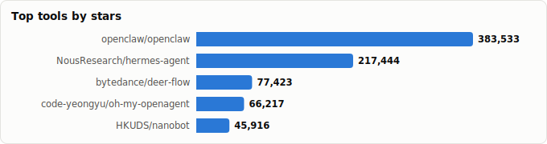

# Hermes Agent vs OpenClaw — Head-to-Head

> Derived from **kaiser-data**'s 1,350 starred repos (snapshot `2026-07-20T08:33:57.852Z`), cross-referenced with the repo-similarity graph.
>
> Generated 2026-07-22 by `scripts/reports/hermes_vs_openclaw.py` (regenerate any time — no API cost).

**[openclaw/openclaw](https://github.com/openclaw/openclaw)** — 🦞 _Your own personal AI assistant. Any OS. Any Platform. The lobster way. 🦞_  
**[NousResearch/hermes-agent](https://github.com/NousResearch/hermes-agent)** — ☤ _The agent that grows with you_

## Verdict

**Default to OpenClaw.** It leads on adoption (383,533★ vs 217,444★), velocity, release cadence and health, and it's the hub the rest of your starred ecosystem plugs into. **Choose Hermes** if you want a Python-first, NousResearch-backed single agent that 'grows with you', or a broader contributor base.

## Side-by-side (🏆 = leads that metric)

| Metric | 🦞 OpenClaw | ☤ Hermes Agent |
|---|---|---|
| Stars | 383,533 🏆 | 217,444 |
| Health score | 79 | 85 🏆 |
| Momentum (est. ★/30d) | 120,898 🏆 | 44,998 |
| Language | TypeScript | Python |
| License | NOASSERTION | MIT |
| Lifecycle | Hot | Hot |
| Age | 7mo | 12mo |
| Last push | 0d ago | 0d ago |
| Commits (90d) | 37,711 🏆 | 11,264 |
| Contributors (90d) | 17 | 33 🏆 |
| Bus factor | 1 | 3 🏆 |
| Top-author share (lower=better) | 72% | 30% 🏆 |
| Releases (total) | 226 🏆 | 21 |
| Forks | 80,562 🏆 | 40,972 |
| Open issues | 3,895 | 7,532 |
| Merged PRs | 17,970 🏆 | 8,370 |

## What the numbers say

- **Adoption & momentum → OpenClaw.** 1.8× the stars and ~2.7× the 30-day momentum. It's also younger (7mo vs 12mo), so it reached a larger base faster.
- **Velocity & release cadence → OpenClaw.** ~3.3× the 90-day commits and **226 releases vs 21** — a far more established, iterative shipping process.
- **Contributor breadth → Hermes.** 33 unique authors in 90 days vs 17 — a wider bench, though its top author carries more (30% vs 72%).
- **Health → OpenClaw** (79 vs 85), and both share bus factor 1 — neither is a one-person project, but neither is deeply decentralised either.
- **Stack split.** OpenClaw is **TypeScript**, Hermes is **Python** — often the deciding factor for what you'll actually extend.

## Ecosystem & graph signal

- **Communities:** OpenClaw is in community 10, Hermes in 9 (different clusters). PageRank — OpenClaw 0.0009 vs Hermes 0.0010.
- **No direct similarity edge** between them in the graph.
- **Hermes explicitly tags the OpenClaw ecosystem** — its topics include `clawdbot`, `moltbot`, `openclaw` — i.e. it positions in/around the same space (interop or competition), not as an unrelated project.
- **The accessory ecosystem orbits OpenClaw**, not Hermes: your stars already include `nanoclaw`, `clawhub`, `ClawRouter`, `opik-openclaw`, `openclaw-supermemory`, `NemoClaw`, `moltworker` — all OpenClaw-specific. That network effect is a real switching cost in OpenClaw's favour.

## The broader field

Where the two sit among the other personal-assistant / agent-harness projects in your stars:

| Project | ★ Stars | Lang | Health | Lifecycle | Momentum (★/30d) | Note |
|---|---|---|---|---|---|---|
| [openclaw/openclaw](https://github.com/openclaw/openclaw) | 383,533 (▲47) | TypeScript | 79 | Hot | 120,898 | **this comparison** — the hub |
| [NousResearch/hermes-agent](https://github.com/NousResearch/hermes-agent) | 217,444 (▲218) | Python | 85 | Hot | 44,998 | **this comparison** — Python challenger |
| [bytedance/deer-flow](https://github.com/bytedance/deer-flow) | 77,423 (▲32) | Python | 84 | Hot | 11,237 | long-horizon SuperAgent harness |
| [code-yeongyu/oh-my-openagent](https://github.com/code-yeongyu/oh-my-openagent) | 66,217 (▲44) | TypeScript | 78 | Hot | 21,660 | agent harness (ex oh-my-opencode) |
| [HKUDS/nanobot](https://github.com/HKUDS/nanobot) | 45,916 (▲23) | Python | 78 | Hot | 20,370 | lightweight agent |
| [zeroclaw-labs/zeroclaw](https://github.com/zeroclaw-labs/zeroclaw) | 32,331 (▲14) | Rust | 89 | Hot | 15,446 | healthiest alternative (Rust) |
| [nanocoai/nanoclaw](https://github.com/nanocoai/nanoclaw) | 30,294 (▲4) | TypeScript | 69 | Hot | 13,389 | containerized secure OpenClaw alt |
| [elizaOS/eliza](https://github.com/elizaOS/eliza) | 18,772 (▲4) | TypeScript | 74 | Mature | 1,330 | agentic OS, always-on agents |
| [RightNow-AI/openfang](https://github.com/RightNow-AI/openfang) | 18,035 (▲2) | Rust | 77 | Hot | 5,954 | open Agent-OS (Rust) |
| [nearai/ironclaw](https://github.com/nearai/ironclaw) | 12,532 (▲4) | Rust | 75 | Hot | 5,626 | privacy/security Agent-OS (Rust) |

## Which should you use?

| Choose… | If you… |
|---|---|
| 🦞 **OpenClaw** | want the largest ecosystem + fastest shipping; rely on the accessory tools (skills, routers, memory) you've already starred; prefer TypeScript; want a broad assistant *platform*. |
| ☤ **Hermes Agent** | are Python-first; value NousResearch's research lineage & community; want a single agent that *learns/grows* over time; prefer a wider contributor base. |
| **Both (A/B them)** | `cc-switch` and `AionUi` (in your stars) run OpenClaw, Hermes, Claude Code & Codex side-by-side — try them on your own tasks before committing. |

## Caveats

- **Snapshot-bound.** All figures are the May-2026 dataset; this space moves weekly and momentum especially can flip fast.
- **Stars ≠ fit.** Adoption and velocity don't decide *your* use case — language, extension model, and the specific tasks matter more. Treat this as a starting point.
- Metrics (health, momentum, bus_factor) are precomputed by the analyzer pipeline.

Snapshot: 2026-07-20T08:33:57.852Z · regenerate via scripts/reports/hermes_vs_openclaw.py
