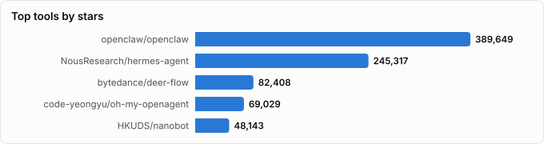

# Hermes Agent vs OpenClaw — Head-to-Head

> Derived from **kaiser-data**'s 1,399 starred repos (snapshot `2026-07-27T09:02:42.013Z`), cross-referenced with the repo-similarity graph.
>
> Generated 2026-07-27 by `scripts/reports/hermes_vs_openclaw.py` (regenerate any time — no API cost).

**[openclaw/openclaw](https://github.com/openclaw/openclaw)** — 🦞 _Your own personal AI assistant. Any OS. Any Platform. The lobster way. 🦞_  
**[NousResearch/hermes-agent](https://github.com/NousResearch/hermes-agent)** — ☤ _The agent that grows with you_

## Verdict

**Default to OpenClaw.** It leads on adoption (384,279★ vs 221,121★), velocity, release cadence and health, and it's the hub the rest of your starred ecosystem plugs into. **Choose Hermes** if you want a Python-first, NousResearch-backed single agent that 'grows with you', or a broader contributor base.

## Side-by-side (🏆 = leads that metric)

| Metric | 🦞 OpenClaw | ☤ Hermes Agent |
|---|---|---|
| Stars | 384,279 🏆 | 221,121 |
| Health score | 79 | 80 🏆 |
| Momentum (est. ★/30d) | 117,661 🏆 | 38,156 |
| Language | TypeScript | Python |
| License | NOASSERTION | MIT |
| Lifecycle | Hot | Hot |
| Age | 8mo | 1.0y |
| Last push | 0d ago | 0d ago |
| Commits (90d) | 34,787 🏆 | 11,896 |
| Contributors (90d) | 16 | 25 🏆 |
| Bus factor | 1 | 2 🏆 |
| Top-author share (lower=better) | 80% | 34% 🏆 |
| Releases (total) | 226 🏆 | 22 |
| Forks | 80,736 🏆 | 42,189 |
| Open issues | 4,121 | 8,180 |
| Merged PRs | 19,365 🏆 | 9,055 |

## What the numbers say

- **Adoption & momentum → OpenClaw.** 1.7× the stars and ~3.1× the 30-day momentum. It's also younger (8mo vs 1.0y), so it reached a larger base faster.
- **Velocity & release cadence → OpenClaw.** ~2.9× the 90-day commits and **226 releases vs 22** — a far more established, iterative shipping process.
- **Contributor breadth → Hermes.** 25 unique authors in 90 days vs 16 — a wider bench, though its top author carries more (34% vs 80%).
- **Health → OpenClaw** (79 vs 80), and both share bus factor 1 — neither is a one-person project, but neither is deeply decentralised either.
- **Stack split.** OpenClaw is **TypeScript**, Hermes is **Python** — often the deciding factor for what you'll actually extend.

## Ecosystem & graph signal

- **Communities:** OpenClaw is in community 1, Hermes in 10 (different clusters). PageRank — OpenClaw 0.0008 vs Hermes 0.0009.
- **No direct similarity edge** between them in the graph.
- **Hermes explicitly tags the OpenClaw ecosystem** — its topics include `clawdbot`, `moltbot`, `openclaw` — i.e. it positions in/around the same space (interop or competition), not as an unrelated project.
- **The accessory ecosystem orbits OpenClaw**, not Hermes: your stars already include `nanoclaw`, `clawhub`, `ClawRouter`, `opik-openclaw`, `openclaw-supermemory`, `NemoClaw`, `moltworker` — all OpenClaw-specific. That network effect is a real switching cost in OpenClaw's favour.

## The broader field

Where the two sit among the other personal-assistant / agent-harness projects in your stars:

| Project | ★ Stars | Lang | Health | Lifecycle | Momentum (★/30d) | Note |
|---|---|---|---|---|---|---|
| [openclaw/openclaw](https://github.com/openclaw/openclaw) | 384,279 (▲746) | TypeScript | 79 | Hot | 117,661 | **this comparison** — the hub |
| [NousResearch/hermes-agent](https://github.com/NousResearch/hermes-agent) | 221,121 (▲3,677) | Python | 80 | Hot | 38,156 | **this comparison** — Python challenger |
| [bytedance/deer-flow](https://github.com/bytedance/deer-flow) | 77,940 (▲517) | Python | 84 | Hot | 11,134 | long-horizon SuperAgent harness |
| [code-yeongyu/oh-my-openagent](https://github.com/code-yeongyu/oh-my-openagent) | 66,645 (▲428) | TypeScript | 78 | Hot | 21,152 | agent harness (ex oh-my-opencode) |
| [HKUDS/nanobot](https://github.com/HKUDS/nanobot) | 46,283 (▲367) | Python | 83 | Hot | 19,715 | lightweight agent |
| [zeroclaw-labs/zeroclaw](https://github.com/zeroclaw-labs/zeroclaw) | 32,406 (▲75) | Rust | 89 | Hot | 14,819 | healthiest alternative (Rust) |
| [nanocoai/nanoclaw](https://github.com/nanocoai/nanoclaw) | 30,380 (▲86) | TypeScript | 74 | Hot | 12,893 | containerized secure OpenClaw alt |
| [elizaOS/eliza](https://github.com/elizaOS/eliza) | 18,815 (▲43) | TypeScript | 74 | Mature | 1,320 | agentic OS, always-on agents |
| [RightNow-AI/openfang](https://github.com/RightNow-AI/openfang) | 18,064 (▲29) | Rust | 76 | Hot | 5,689 | open Agent-OS (Rust) |
| [nearai/ironclaw](https://github.com/nearai/ironclaw) | 12,565 (▲33) | Rust | 80 | Hot | 5,413 | privacy/security Agent-OS (Rust) |

## Which should you use?

| Choose… | If you… |
|---|---|
| 🦞 **OpenClaw** | want the largest ecosystem + fastest shipping; rely on the accessory tools (skills, routers, memory) you've already starred; prefer TypeScript; want a broad assistant *platform*. |
| ☤ **Hermes Agent** | are Python-first; value NousResearch's research lineage & community; want a single agent that *learns/grows* over time; prefer a wider contributor base. |
| **Both (A/B them)** | `cc-switch` and `AionUi` (in your stars) run OpenClaw, Hermes, Claude Code & Codex side-by-side — try them on your own tasks before committing. |

## Caveats

- **Snapshot-bound.** All figures are the May-2026 dataset; this space moves weekly and momentum especially can flip fast.
- **Stars ≠ fit.** Adoption and velocity don't decide *your* use case — language, extension model, and the specific tasks matter more. Treat this as a starting point.
- Metrics (health, momentum, bus_factor) are precomputed by the analyzer pipeline.

Snapshot: 2026-07-27T09:02:42.013Z · regenerate via scripts/reports/hermes_vs_openclaw.py
