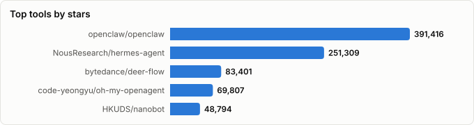

# Hermes Agent vs OpenClaw — Head-to-Head

> Derived from **kaiser-data**'s 2,259 starred repos (snapshot `2026-09-28T12:23:49.424Z`), cross-referenced with the repo-similarity graph.
>
> Generated 2026-09-28 by `scripts/reports/hermes_vs_openclaw.py` (regenerate any time — no API cost).

**[openclaw/openclaw](https://github.com/openclaw/openclaw)** — 🦞 _The AI that really does things. Any OS. Any Platform. The lobster way. 🦞_  
**[NousResearch/hermes-agent](https://github.com/NousResearch/hermes-agent)** — ☤ _The agent that grows with you_

## Verdict

**Default to OpenClaw.** It leads on adoption (390,701★ vs 249,669★), velocity, release cadence and health, and it's the hub the rest of your starred ecosystem plugs into. **Choose Hermes** if you want a Python-first, NousResearch-backed single agent that 'grows with you', or a broader contributor base.

## Side-by-side (🏆 = leads that metric)

| Metric | 🦞 OpenClaw | ☤ Hermes Agent |
|---|---|---|
| Stars | 390,701 🏆 | 249,669 |
| Health score | 79 | 81 🏆 |
| Momentum (est. ★/30d) | 95,111 🏆 | 36,794 |
| Language | TypeScript | Python |
| License | NOASSERTION | MIT |
| Lifecycle | Hot | Hot |
| Age | 10mo | 1.2y |
| Last push | 0d ago | 0d ago |
| Commits (90d) | 38,795 🏆 | 31,830 |
| Contributors (90d) | 5 | 22 🏆 |
| Bus factor | 1 | 2 🏆 |
| Top-author share (lower=better) | 79% | 46% 🏆 |
| Releases (total) | 247 🏆 | 36 |
| Forks | 82,159 🏆 | 53,131 |
| Open issues | 5,696 | 14,105 |
| Merged PRs | 46,870 🏆 | 16,566 |

## What the numbers say

- **Adoption & momentum → OpenClaw.** 1.6× the stars and ~2.6× the 30-day momentum. It's also younger (10mo vs 1.2y), so it reached a larger base faster.
- **Velocity & release cadence → OpenClaw.** ~1.2× the 90-day commits and **247 releases vs 36** — a far more established, iterative shipping process.
- **Contributor breadth → Hermes.** 22 unique authors in 90 days vs 5 — a wider bench, though its top author carries more (46% vs 79%).
- **Health → OpenClaw** (79 vs 81), and both share bus factor 1 — neither is a one-person project, but neither is deeply decentralised either.
- **Stack split.** OpenClaw is **TypeScript**, Hermes is **Python** — often the deciding factor for what you'll actually extend.

## Ecosystem & graph signal

- **Communities:** OpenClaw is in community 34, Hermes in 15 (different clusters). PageRank — OpenClaw 0.0006 vs Hermes 0.0008.
- **No direct similarity edge** between them in the graph.
- **Hermes explicitly tags the OpenClaw ecosystem** — its topics include  — i.e. it positions in/around the same space (interop or competition), not as an unrelated project.
- **The accessory ecosystem orbits OpenClaw**, not Hermes: your stars already include `nanoclaw`, `clawhub`, `ClawRouter`, `opik-openclaw`, `openclaw-supermemory`, `NemoClaw`, `moltworker` — all OpenClaw-specific. That network effect is a real switching cost in OpenClaw's favour.

## The broader field

Where the two sit among the other personal-assistant / agent-harness projects in your stars:

| Project | ★ Stars | Lang | Health | Lifecycle | Momentum (★/30d) | Note |
|---|---|---|---|---|---|---|
| [openclaw/openclaw](https://github.com/openclaw/openclaw) | 390,701 (▲234) | TypeScript | 79 | Hot | 95,111 | **this comparison** — the hub |
| [NousResearch/hermes-agent](https://github.com/NousResearch/hermes-agent) | 249,669 (▲855) | Python | 81 | Hot | 36,794 | **this comparison** — Python challenger |
| [bytedance/deer-flow](https://github.com/bytedance/deer-flow) | 83,139 (▲177) | Python | 87 | Hot | 10,405 | long-horizon SuperAgent harness |
| [code-yeongyu/oh-my-openagent](https://github.com/code-yeongyu/oh-my-openagent) | 69,617 (▲222) | TypeScript | 78 | Rising | 17,436 | agent harness (ex oh-my-opencode) |
| [HKUDS/nanobot](https://github.com/HKUDS/nanobot) | 48,636 (▲75) | Python | 84 | Hot | 15,249 | lightweight agent |
| [zeroclaw-labs/zeroclaw](https://github.com/zeroclaw-labs/zeroclaw) | 32,908 (▲30) | Rust | 83 | Hot | 10,866 | healthiest alternative (Rust) |
| [nanocoai/nanoclaw](https://github.com/nanocoai/nanoclaw) | 30,856 (▲10) | TypeScript | 76 | Hot | 9,648 | containerized secure OpenClaw alt |
| [elizaOS/eliza](https://github.com/elizaOS/eliza) | 19,512 (▲13) | TypeScript | 80 | Mature | 1,263 | agentic OS, always-on agents |
| [RightNow-AI/openfang](https://github.com/RightNow-AI/openfang) | 18,208 (▼2) | Rust | 47 | Declining | 2,534 | open Agent-OS (Rust) |
| [nearai/ironclaw](https://github.com/nearai/ironclaw) | 12,634 (▲2) | Rust | 80 | Hot | 3,994 | privacy/security Agent-OS (Rust) |

## Which should you use?

| Choose… | If you… |
|---|---|
| 🦞 **OpenClaw** | want the largest ecosystem + fastest shipping; rely on the accessory tools (skills, routers, memory) you've already starred; prefer TypeScript; want a broad assistant *platform*. |
| ☤ **Hermes Agent** | are Python-first; value NousResearch's research lineage & community; want a single agent that *learns/grows* over time; prefer a wider contributor base. |
| **Both (A/B them)** | `cc-switch` and `AionUi` (in your stars) run OpenClaw, Hermes, Claude Code & Codex side-by-side — try them on your own tasks before committing. |

## Caveats

- **Snapshot-bound.** All figures are the May-2026 dataset; this space moves weekly and momentum especially can flip fast.
- **Stars ≠ fit.** Adoption and velocity don't decide *your* use case — language, extension model, and the specific tasks matter more. Treat this as a starting point.
- Metrics (health, momentum, bus_factor) are precomputed by the analyzer pipeline.

Snapshot: 2026-09-28T12:23:49.424Z · regenerate via scripts/reports/hermes_vs_openclaw.py
