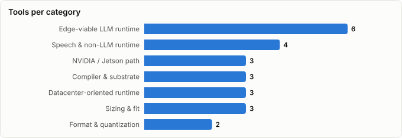

# Inference Engines for the Jetson Orin Nano Super 8GB — What Actually Runs, and What Actually Helps

> Engine roster derived from **kaiser-data**'s 2,087 starred repos (snapshot `2026-09-07T10:42:15.216Z`), cross-referenced with the repo-similarity graph (2,087 nodes / 6,821 edges, 38 communities).
>
> **The throughput numbers in this report are measured, not quoted** — benchmark runs against a real Jetson Orin Nano Super 8GB in **MAXN_SUPER** (25W) mode on 2026-08-23, with the desktop and a voice stack running. Engine verdicts are argued against those numbers. See Methodology.
>
> Generated 2026-09-07 by `scripts/reports/jetson_inference.py` (regenerate any time — no API cost).





## Executive summary

- **The Super is a software unlock, not a different board.** Same silicon as the original Orin Nano 8GB, with JetPack raising it from 40→67 TOPS and **68→102 GB/s** and adding a 25W `MAXN_SUPER` mode. Because LLM decoding is memory-bandwidth-bound, **the 1.5× bandwidth figure — not the 1.7× TOPS headline — is what governs tok/s**. The TOPS number is the one that matters for vision and prefill.
- **Confirm you are actually in `MAXN_SUPER`.** It is the cheapest performance in this entire report: nothing to install, no quality trade-off, and up to ~1.5× on decode if the box is sitting in 15W mode. All measurements below were taken with it already active, so they are Super-mode numbers, not 15W numbers.
- **The honest headline: on this board, engine choice is not your biggest lever.** The measured spread between model tiers (2.6×) and the measured effect of batching embeddings (4×) both exceed what any realistic engine swap would buy. The one intervention that changed *whether the box works at all* was a memory-prep recipe, not a new runtime.
- **Use `llama.cpp`** — directly or through Ollama, which is llama.cpp underneath. It is the only engine that combines SM 8.7 CUDA support, sub-Q4 quantization, and the one property that matters most here: it degrades into slower paths instead of aborting when memory runs out.
- **`TensorRT-LLM` is in your stars and does not target this board.** Jetson support is not in the main branch; it lives in a `v0.12.0-jetson` branch aimed at **AGX Orin**. The NVIDIA path that does reach Orin Nano is TensorRT Edge-LLM. This is the single most actionable correction in the report.
- **`vLLM`, `SGLang` and `LMDeploy` are the wrong machine class.** PagedAttention and continuous batching optimize for many concurrent sequences against plentiful VRAM. Serving one user from an 8 GB unified pool inverts every one of those assumptions.
- **`MLC-LLM` is the one engine genuinely worth benchmarking, and it is now in your stars.** TVM-compiled, architecture-specialized INT4 kernels are the only credible claim to beating llama.cpp on this SKU. The numbers below are the baseline it has to beat — running that benchmark is the open action here, not starring it.
- **Measured ceiling on this box:** **36.8 tok/s** at 0.8B, **18 tok/s** at 3.8B, **14.3 tok/s** at 4.7B. Embedding prefill saturates at **~8.6k tok/s**, but only at batch ≥ 32.
- **Engine coverage is now good at both layers.** 24 engines present (939,878★), with only 4 relevant projects still missing (23,396★). The substrate gap earlier editions flagged is closed: `onnxruntime` (the engine under the ONNX *format*), `ggml` (the substrate of `llama.cpp` and `whisper.cpp`), `tvm` (what MLC compiles through) and `CTranslate2` (the engine under `faster-whisper`) are all held now. What remains missing is stale or off-target rather than structural — see the gap table.

## The constraint that decides everything

Before comparing engines, understand what the hardware does under pressure. The Super unlock raises the ceiling but changes none of the following, and these three properties of an 8 GB Jetson invalidate most desktop-GPU intuition:

1. **The 8 GB is a unified CPU/GPU pool.** There is no separate VRAM to fill. Every megabyte the desktop, the page cache, or another process holds is a megabyte the model cannot have.
2. **CUDA allocations cannot be swap-backed, and on Tegra `cudaMalloc` fails rather than forcing page-cache reclaim.** This is the crux: on a desktop, memory pressure makes things slow. Here it makes them *fail*. A tool reporting several gigabytes "available" can still refuse a 500 MB allocation, because only genuinely **free** memory counts.
3. **Resident cost is far higher than model size.** Measured: a model reporting **916 MB** of device memory left the serving process at **2.9 GB RSS**. CUDA context, KV cache, and memory-mapped weights all land in the same pool. Budget from measured RSS, never from a model tag's size field.

The practical consequence is a counterintuitive ranking: **an engine that is 15% faster but 500 MB hungrier is a worse engine on this board**, because the failure mode is not slowness, it is a hard allocation error. That single fact eliminates the entire datacenter-serving tier.

## Measured baseline — what this box actually does

Generation, measured 2026-08-23 via llama.cpp (through Ollama 0.30.10), with the desktop and a voice stack running and memory-prep applied. Throughput comes from the runtime's own device-side counters, not wall-clock.

| Model | Quant | tok/s | Load | Note |
|---|---|---|---|---|
| `qwen3.5:0.8b` | 0.8B Q8_0 | **36.8** | 8.6 s | The reliable tier — never OOMs, leaves room for a second tenant. |
| `phi4-mini` | 3.8B Q4_K_M | **18.0–18.2** | 9.3 s | Best quality-per-token that still loads without ceremony. |
| `qwen3.5:4b` | 4.7B Q4_K_M + vision | **14.3–14.4** | 11.5 s | Only runs with memory-prep; returns HTTP 500 (cudaMalloc OOM) without it. |

Embedding throughput (texts/sec) for a 137M F16 embedder, by batch size — the table that makes the case for batching:

| Text size | batch 1 | batch 8 | batch 32 | batch 64 |
|---|---|---|---|---|
| query (~18 tok) | 14.8 | 35.2 | 38.8 | **42.4** |
| 128 words (~176 tok) | 6.8 | 20.2 | 29.0 | **33.6** |
| 256 words (~357 tok) | 5.6 | 17.5 | 23.6 | **24.5** |
| 512 words (~699 tok) | 5.1 | 10.6 | 12.1 | **12.3** |

**Read the first column as a warning.** At batch 1 a 357-token chunk runs ~4× below the achievable prefill ceiling, because ~60 ms of per-request overhead dominates. The engine is not the problem there; the calling pattern is.

**One caveat that matters for anyone reproducing this:** compute on this box is rock-steady (~2% spread at batch ≥ 32) while *wall-clock* is not — repeated identical embedding runs shifted by 5× between regimes, with the entire difference in reported load time rather than compute. Quote compute-derived throughput, record whether a model reload was charged, and never trust a single-run wall-clock benchmark here.

## How much headroom is left? A bandwidth roofline

Token generation reads every weight from memory once per token, so decode is **memory-bandwidth-bound**, not compute-bound. That gives a hard ceiling: `tok/s ≤ bandwidth ÷ weight-bytes`. Against the Super's **102 GB/s**:

| Model | Weights | Roofline tok/s | Measured | % of peak BW | % of ~achievable BW |
|---|---|---|---|---|---|
| `qwen3.5:0.8b` | 0.92 GB | 111 | **36.8** | 33% | 41% |
| `phi4-mini` | 2.30 GB | 44 | **18.1** | 41% | 51% |
| `qwen3.5:4b` | 2.64 GB | 39 | **14.3** | 37% | 46% |

The consistency is the interesting part: **33–41% of peak across three very different model sizes**, or roughly 41–51% once you discount peak bandwidth to the 70–85% a real memory subsystem achieves. A single outlier would suggest a model-specific problem; a flat ratio says the box is running at a stable, engine-determined fraction of its memory ceiling.

**What that implies for engine choice.** There is real headroom — but less than the raw gap suggests. Part of it is irreducible: KV-cache reads that grow with context, attention compute, and the desktop and voice stack competing for the same bus during these runs. A realistic ceiling for a better-tuned engine on this board is perhaps **1.2–1.6×**, not the 2–3× a naive reading of the roofline would promise. That is the honest size of the prize for benchmarking MLC-LLM — worth doing, and not a transformation.

It also explains why the datacenter engines are pointless here. vLLM's advantages are about scheduling many concurrent sequences; they do nothing for a single stream that is already waiting on memory.

## Engine verdicts against this hardware

| Engine | Runs on Orin Nano 8GB? | Verdict | Why |
|---|---|---|---|
| **llama.cpp** | ✅ Yes — the reference path | **Use it.** Directly, or via Ollama. | CUDA on SM 8.7, GGUF quantization down to Q4 and below, and — critically — it degrades into slower paths instead of aborting when memory is tight. On a box where `cudaMalloc` fails rather than reclaiming, graceful degradation *is* the feature. |
| **Ollama** | ✅ Yes — currently in place | **Keep it** unless you need the last ~10%. | It is llama.cpp underneath, so the throughput ceiling is the same. You trade a small overhead for model management, keep-alive, quantized KV cache, and an HTTP API. Dropping to raw llama.cpp buys tuning freedom, not a new performance tier. |
| **MLC-LLM** | ✅ Yes — genuinely supported | **The one worth benchmarking.** Not in your stars. | TVM-compiled kernels specialized per model and per GPU arch; NVIDIA's own Orin Nano LLM figures have historically been quoted via the MLC path with INT4. It is the only credible claim to beating llama.cpp on this SKU — and the only way to know is to measure it against the numbers in this report. |
| **TensorRT-LLM** | ⚠️ Not this SKU | **Don't.** Wrong artifact for this board. | Jetson support is not in the main branch; it lives in a separate `v0.12.0-jetson` branch targeting **AGX Orin**, with other Orin devices described as under testing. You star the repo (14,326★); it does not target your hardware. The NVIDIA path that *does* reach Orin Nano is TensorRT Edge-LLM via the Jetson AI Lab tutorials. |
| **TensorRT (core)** | ✅ Yes — for vision, not LLMs | **Use for CNN/vision**, not for text generation. | The classic Jetson win: compile a YOLO or ResNet graph to a TensorRT engine and get a large, reliable speedup. This is where TensorRT earns its reputation on Jetson; LLM decoding is a different problem. |
| **vLLM** | ❌ Effectively no | **Skip.** Wrong machine class. | PagedAttention and continuous batching are optimizations for many concurrent sequences against plentiful VRAM. On an 8 GB unified pool serving one user, they buy nothing and the headroom requirement alone rules it out — published guidance for the 8 GB SKU points to llama.cpp for exactly this reason. |
| **SGLang / LMDeploy** | ❌ Effectively no | **Skip.** | Same class of assumption as vLLM: discrete datacenter GPUs, high concurrency, generous memory. |
| **ONNX Runtime** | ✅ Yes — strong for small models | **Use for speech and embeddings.** | With the CUDA or TensorRT execution provider it is an excellent fit for the sub-1B models that populate an edge pipeline. `sherpa-onnx` (in your stars) is the practical expression of this. |
| **ExecuTorch** | ◐ Emerging | Watch. | PyTorch's edge runtime is maturing quickly but is aimed more squarely at mobile NPUs than at CUDA-capable Jetsons. |
| **BitNet (1-bit)** | ◐ Experimental | Watch — the highest-upside long shot. | If a genuinely useful model ships in ternary weights, an 8 GB box stops being memory-bound. That is a real possibility and not yet a plan. |

## What actually moves throughput, ranked by measured effect

This is the section to act on. Interventions are ordered by the size of the effect actually observed, not by how interesting they are.

| Intervention | Measured effect | Evidence | Effort |
|---|---|---|---|
| **Verify the board is in `MAXN_SUPER` (25W)** | up to ~1.5× decode | The Super unlock is bandwidth: 68 → 102 GB/s. Since decode is bandwidth-bound, a box left in 15W mode gives up most of that. Free, instant, no quality cost — check it before tuning anything else. (The measurements in this report were already taken in MAXN_SUPER.) | None — one command |
| **Apply the memory-prep recipe before loading a large model** | HTTP 500 → working | A 4.7B model that reliably failed with `cudaMalloc failed: out of memory` runs at 14.4 tok/s once page cache is evicted and kept evicted during load. This is the difference between *works* and *does not work* — no engine swap competes with it. | Low — user-space, no root |
| **Batch embedding calls to ≥32** | ≈4× prefill | A 357-token chunk embeds at ~2.0k tok/s at batch 1 and saturates at ~8.6k tok/s at batch ≥32; per-request overhead (~60 ms) dominates below that. Never embed a corpus one text at a time. | Low — caller-side change |
| **Drop a model tier (4B → 0.8B)** | ≈2.6× generation | 36.8 tok/s at 0.8B vs 14.3 tok/s at 4.7B, measured on the same box the same day. Larger than any plausible engine swap. | Low — but costs quality |
| **Benchmark MLC-LLM against the llama.cpp baseline** | Unknown — plausibly 1.2–2× | The only engine with a credible claim to beating llama.cpp on this SKU. Unmeasured here; the numbers in this report are the baseline it must beat. | Medium — new toolchain |
| **Test whether two models can stay resident at once** | Unknown — removes swap thrash | With a one-model-at-a-time limit, an embedder and a generator evict each other continuously and every interleaved call pays a full load cycle. Whether a ~1 GB generator plus a ~0.3 GB embedder fits is the highest-value open experiment on the box. | Low to try, high to trust |
| **Move from Ollama to raw llama.cpp** | Small — maybe ~10% | Same engine underneath. Buys flag-level control (batch size, context, offload split) and loses model management. Do this last, not first. | Medium |
| **Compile vision models to TensorRT** | Large for CNNs | The classic Jetson optimization — but orthogonal to LLM throughput. Relevant only if the pipeline also does detection or classification. | Medium |

Note the shape of that table: **the top three interventions are all free, and none of them is an engine swap.** The engine question only becomes the binding one after memory discipline, batching, and model sizing have been settled.

## The engines in your stars

Sorted by stars. `Health`/`Lifecycle` are the dataset's computed metrics; `Activity` is derived from days-since-push + 90-day commits.

| Engine | Class | Lang | License | ★ Stars | Lifecycle | Health | Activity | Last push | Contrib(90d) |
|---|---|---|---|---|---|---|---|---|---|
| [ollama/ollama](https://github.com/ollama/ollama) | Edge-viable LLM runtime | Go | MIT | 180,367 (▲101) | Classic | 83 | very active | 2d ago | 10 |
| [ggml-org/llama.cpp](https://github.com/ggml-org/llama.cpp) | Edge-viable LLM runtime | C++ | MIT | 127,336 (▲137) | Classic | 99 | very active | 0d ago | 55 |
| [vllm-project/vllm](https://github.com/vllm-project/vllm) | Datacenter-oriented runtime | Python | Apache  2.0 | 91,148 (▲88) | Classic | 99 | very active | 0d ago | 73 |
| [nomic-ai/gpt4all](https://github.com/nomic-ai/gpt4all) | Edge-viable LLM runtime | C++ | MIT | 77,384 (▲5) | Abandoned | 7 | stale | 1.3y ago | 0 |
| [ggml-org/whisper.cpp](https://github.com/ggml-org/whisper.cpp) | Speech & non-LLM runtime | C++ | MIT | 53,488 (▲15) | Classic | 98 | very active | 3d ago | 61 |
| [exo-explore/exo](https://github.com/exo-explore/exo) | Sizing & fit | Python | Apache  2.0 | 47,293 (▲21) | Mature | 65 | active | 13d ago | 3 |
| [microsoft/BitNet](https://github.com/microsoft/BitNet) | Format & quantization | C++ | MIT | 40,228 | Mature | 44 | active | 1mo ago | 3 |
| [sgl-project/sglang](https://github.com/sgl-project/sglang) | Datacenter-oriented runtime | Python | Apache  2.0 | 35,576 (▲57) | Mature | 99 | very active | 0d ago | 52 |
| [AlexsJones/llmfit](https://github.com/AlexsJones/llmfit) | Sizing & fit | Rust | MIT | 34,996 (▲51) | Hot | 93 | very active | 0d ago | 44 |
| [lyogavin/airllm](https://github.com/lyogavin/airllm) | Sizing & fit | Jupyter Notebook | Apache  2.0 | 33,805 (▲50) | Mature | 70 | very active | 0d ago | 1 |
| [mozilla-ai/llamafile](https://github.com/mozilla-ai/llamafile) | Edge-viable LLM runtime | C++ | Other | 25,897 (▲17) | Mature | 65 | very active | 4d ago | 5 |
| [SYSTRAN/faster-whisper](https://github.com/SYSTRAN/faster-whisper) | Speech & non-LLM runtime | Python | MIT | 25,273 (▲14) | Declining | 15 | stale | 9mo ago | 0 |
| [mlc-ai/mlc-llm](https://github.com/mlc-ai/mlc-llm) | Edge-viable LLM runtime | Python | Apache  2.0 | 23,139 (▲2) | Mature | 53 | active | 21d ago | 3 |
| [microsoft/onnxruntime](https://github.com/microsoft/onnxruntime) | Compiler & substrate | C++ | MIT | 21,787 (▲18) | Classic | 99 | very active | 0d ago | 37 |
| [onnx/onnx](https://github.com/onnx/onnx) | Format & quantization | Python | Apache  2.0 | 21,422 (▲3) | Classic | 89 | very active | 1d ago | 28 |
| [ggml-org/ggml](https://github.com/ggml-org/ggml) | Compiler & substrate | C++ | MIT | 15,302 (▲7) | Classic | 94 | very active | 3d ago | 57 |
| [k2-fsa/sherpa-onnx](https://github.com/k2-fsa/sherpa-onnx) | Speech & non-LLM runtime | C++ | Apache  2.0 | 14,647 (▲20) | Classic | 76 | very active | 1d ago | 27 |
| [NVIDIA/TensorRT-LLM](https://github.com/NVIDIA/TensorRT-LLM) | NVIDIA / Jetson path | Python | Other | 14,561 (▲5) | Classic | 99 | very active | 0d ago | 58 |
| [apache/tvm](https://github.com/apache/tvm) | Compiler & substrate | Python | Apache  2.0 | 13,721 (▲3) | Classic | 89 | very active | 1d ago | 23 |
| [NVIDIA/TensorRT](https://github.com/NVIDIA/TensorRT) | NVIDIA / Jetson path | C++ | Apache  2.0 | 13,324 (▲3) | Mature | 67 | active | 13d ago | 3 |
| [LostRuins/koboldcpp](https://github.com/LostRuins/koboldcpp) | Edge-viable LLM runtime | C++ | GNU Affero General Public  v3.0 | 11,626 (▲7) | Classic | 97 | very active | 1d ago | 48 |
| [InternLM/lmdeploy](https://github.com/InternLM/lmdeploy) | Datacenter-oriented runtime | Python | Apache  2.0 | 8,046 (▲2) | Classic | 93 | very active | 0d ago | 25 |
| [dusty-nv/jetson-containers](https://github.com/dusty-nv/jetson-containers) | NVIDIA / Jetson path | Jupyter Notebook | Other | 4,848 (▲3) | Mature | 43 | active | 28d ago | 1 |
| [OpenNMT/CTranslate2](https://github.com/OpenNMT/CTranslate2) | Speech & non-LLM runtime | C++ | MIT | 4,664 (▲1) | Classic | 66 | active | 7d ago | 7 |

**Edge-viable LLM runtime**

- **ollama/ollama** (180,367★) — A management layer over llama.cpp: model pulls, keep-alive, an HTTP API, and quantized KV cache. Costs a little throughput for a lot of operational convenience.
- **ggml-org/llama.cpp** (127,336★) — The engine that actually matters on this box — GGUF, CUDA on SM 8.7, aggressive quantization, and a memory model that degrades gracefully instead of aborting.
- **nomic-ai/gpt4all** (77,384★) — Desktop-oriented local runtime; Declining upstream and adds nothing llama.cpp doesn't already do here.
- **mozilla-ai/llamafile** (25,897★) — Single-file distribution of llama.cpp — useful for shipping a fixed model to a device, less so for a box you already administer.
- **mlc-ai/mlc-llm** (23,139★) — TVM-compiled, arch-specialized kernels with INT4 — the one engine with a credible claim to beating llama.cpp on Orin Nano, and the NVIDIA-quoted path for Jetson LLM figures.
- **LostRuins/koboldcpp** (11,626★) — A llama.cpp distribution with a wider sampler and format range in one binary; occasionally ships Jetson-relevant fixes earlier.

**NVIDIA / Jetson path**

- **NVIDIA/TensorRT-LLM** (14,561★) — The fastest NVIDIA LLM path on supported hardware — but Jetson support lives in a separate branch aimed at AGX Orin, not this SKU. See the verdict table.
- **NVIDIA/TensorRT** (13,324★) — The core inference compiler. On Jetson this is the reliable big win for vision models, and the base of the TensorRT Edge-LLM path that does reach Orin Nano.
- **dusty-nv/jetson-containers** (4,848★) — The single most Jetson-relevant repo in your stars: prebuilt ARM64/CUDA container images that solve the dependency problem which otherwise dominates a JetPack install.

**Compiler & substrate**

- **microsoft/onnxruntime** (21,787★) — The actual runtime behind the ONNX format you already star, with CUDA and TensorRT execution providers. Everything small on this box — STT, TTS, embeddings — can run here.
- **ggml-org/ggml** (15,302★) — The tensor library underneath llama.cpp and whisper.cpp, both of which you star. Where quantization formats and CUDA kernels actually land.
- **apache/tvm** (13,721★) — The compiler MLC-LLM is built on — relevant if you want to understand or tune what MLC produces for SM 8.7.

**Datacenter-oriented runtime**

- **vllm-project/vllm** (91,148★) — PagedAttention and continuous batching win when VRAM is plentiful and concurrency is high — the opposite of this box's profile.
- **sgl-project/sglang** (35,576★) — RadixAttention and structured generation at serving scale; same headroom assumptions as vLLM.
- **InternLM/lmdeploy** (8,046★) — TurboMind engine with strong quantized serving, but targets discrete datacenter GPUs.

**Speech & non-LLM runtime**

- **ggml-org/whisper.cpp** (53,488★) — GGML Whisper — the STT half of an edge pipeline, and a direct competitor for the same unified memory.
- **SYSTRAN/faster-whisper** (25,273★) — Whisper on CTranslate2; typically faster than whisper.cpp on CUDA, at the cost of a heavier Python dependency chain.
- **k2-fsa/sherpa-onnx** (14,647★) — ONNX Runtime STT/TTS with genuinely small footprints — the right shape for a box where every 300 MB is contested.
- **OpenNMT/CTranslate2** (4,664★) — The engine underneath `faster-whisper`, which you already star — quantized transformer inference with a small footprint.

**Format & quantization**

- **microsoft/BitNet** (40,228★) — 1-bit LLM inference. The most interesting long-shot for 8 GB: if a useful model fits in ternary weights, the memory constraint changes shape entirely.
- **onnx/onnx** (21,422★) — The interchange format underneath the ONNX Runtime path; a format, not an engine.

**Sizing & fit**

- **exo-explore/exo** (47,293★) — Cluster several devices into one pool — the escape hatch when 8 GB is simply the wrong number.
- **AlexsJones/llmfit** (34,996★) — 'One command to find what runs on your hardware' — the fit question this report exists to answer, as a tool.
- **lyogavin/airllm** (33,805★) — Layer-streaming to run 70B on 4 GB. Technically remarkable, and far too slow to be a serving answer here.

## The gap — inference projects missing from your stars

4 repos, **23,396★** combined. Metrics read from the GitHub API on **2026-08-23** and frozen into the generator — they are *not* dataset metrics and do **not** refresh when the pipeline re-runs.

| Repo | ★ | Lang | License | Freshness | Why it matters on Jetson | Verdict |
|---|---|---|---|---|---|---|
| [dusty-nv/jetson-inference](https://github.com/dusty-nv/jetson-inference) | 8,967 | C++ | MIT | ⚠ pushed 2025-10-16 — ~10mo | The classic Jetson vision tutorial stack (detection, segmentation, TensorRT). Still the best on-ramp for the vision half, but no longer actively pushed. | Star for reference; note the staleness. |
| [pytorch/executorch](https://github.com/pytorch/executorch) | 4,941 | Python | NOASSERTION | pushed same-day | PyTorch's edge runtime — very active, aimed more at mobile NPUs than CUDA Jetsons, but the direction of travel for on-device PyTorch. | Watch. |
| [NVIDIA-AI-IOT/torch2trt](https://github.com/NVIDIA-AI-IOT/torch2trt) | 4,877 | Python | MIT | ⚠ pushed 2024-08-17 — ~2y stale | PyTorch→TensorRT converter that was the standard Jetson shortcut. Two years without a push is disqualifying for new work. | **Skip** — use TensorRT or ONNX Runtime directly. |
| [turboderp-org/exllamav2](https://github.com/turboderp-org/exllamav2) | 4,611 | Python | MIT | ⚠ pushed 2026-03-04 — ~6mo | EXL2 quantization, excellent on discrete consumer GPUs; not a Jetson target and slowing. | Skip. |

**Priority shortlist** — 0 repos, each closing a structural hole rather than adding a variant of something you already have:


## Which engine should you use?

```
What are you running?
│
├─ Text generation ──────► llama.cpp (via Ollama, or direct)
│                          Benchmark MLC-LLM against the numbers above
│                          before concluding llama.cpp is the ceiling.
│
├─ Embeddings ───────────► same runtime, but BATCH ≥ 32.
│                          Batch size matters ~4x more than engine choice.
│
├─ Speech (STT/TTS) ─────► sherpa-onnx / ONNX Runtime, or whisper.cpp
│                          Small footprints matter more than peak speed —
│                          they compete with the LLM for the same 8 GB.
│
├─ Vision (detect/classify) ─► TensorRT. This is the classic Jetson win,
│                          and it is orthogonal to LLM throughput.
│
└─ Dependency hell ──────► jetson-containers (already in your stars).
                           On JetPack, the build problem usually costs
                           more time than the inference problem.
```

**The recommended stack, stated plainly:** `llama.cpp` for generation, ONNX Runtime or `sherpa-onnx` for speech, `TensorRT` for vision, all installed via `jetson-containers` rather than fought with by hand — and the memory-prep discipline applied before any large load. Then, and only then, benchmark `MLC-LLM` to find out whether the generation tier can be beaten.

**What not to do:** don't reach for `vLLM` because it is the fastest engine in benchmarks run on datacenter GPUs, and don't invest in `TensorRT-LLM` for text generation on this board — it is not built for it.

## Graph analysis

**Community clustering.** These 24 engines span **9 of the graph's 38 communities**.

- **Community 10** (7): `ggml-org/llama.cpp`, `mozilla-ai/llamafile`, `ggml-org/whisper.cpp`, `SYSTRAN/faster-whisper`, `LostRuins/koboldcpp`, `OpenNMT/CTranslate2`, `ggml-org/ggml`
- **Community 19** (4): `nomic-ai/gpt4all`, `InternLM/lmdeploy`, `lyogavin/airllm`, `mlc-ai/mlc-llm`
- **Community 21** (3): `ollama/ollama`, `vllm-project/vllm`, `sgl-project/sglang`
- **Community 20** (3): `dusty-nv/jetson-containers`, `microsoft/BitNet`, `microsoft/onnxruntime`
- **Community 16** (2): `NVIDIA/TensorRT-LLM`, `NVIDIA/TensorRT`
- **Community 30** (2): `AlexsJones/llmfit`, `exo-explore/exo`

**Centrality (PageRank in the full 2,087-repo graph)**:

- `ggml-org/ggml` — PageRank 0.0012
- `ggml-org/whisper.cpp` — PageRank 0.0010
- `NVIDIA/TensorRT` — PageRank 0.0009
- `NVIDIA/TensorRT-LLM` — PageRank 0.0008
- `vllm-project/vllm` — PageRank 0.0008
- `microsoft/onnxruntime` — PageRank 0.0007
- `ggml-org/llama.cpp` — PageRank 0.0007
- `apache/tvm` — PageRank 0.0006
- `onnx/onnx` — PageRank 0.0006
- `SYSTRAN/faster-whisper` — PageRank 0.0005

**Direct links between these engines:**

- `ggml-org/ggml` ⇄ `ggml-org/whisper.cpp` (w=2.419)
- `ggml-org/ggml` ⇄ `ggml-org/llama.cpp` (w=1.315)
- `ggml-org/whisper.cpp` ⇄ `ggml-org/llama.cpp` (w=1.279)
- `ggml-org/whisper.cpp` ⇄ `SYSTRAN/faster-whisper` (w=0.750) — topics: openai, speech-to-text, transformer, whisper
- `LostRuins/koboldcpp` ⇄ `ggml-org/whisper.cpp` (w=0.585)
- `microsoft/onnxruntime` ⇄ `microsoft/BitNet` (w=0.550)
- `LostRuins/koboldcpp` ⇄ `ggml-org/llama.cpp` (w=0.545) — topics: ggml
- `LostRuins/koboldcpp` ⇄ `ggml-org/ggml` (w=0.492)
- `microsoft/onnxruntime` ⇄ `onnx/onnx` (w=0.438) — topics: deep-learning, onnx, machine-learning, pytorch
- `vllm-project/vllm` ⇄ `sgl-project/sglang` (w=0.407) — topics: llm, transformer, inference, llama
- `sgl-project/sglang` ⇄ `ollama/ollama` (w=0.269) — topics: llama, llm, deepseek, gpt-oss
- `OpenNMT/CTranslate2` ⇄ `mozilla-ai/llamafile` (w=0.232)
- …and 3 more.

## Maintenance & risk signal

| Engine | Health | Lifecycle | Activity | Bus factor | Top-author share | Releases |
|---|---|---|---|---|---|---|
| ggml-org/llama.cpp | 99 | Classic | very active | 10 | 9% | 7111 |
| vllm-project/vllm | 99 | Classic | very active | 23 | 6% | 104 |
| sgl-project/sglang | 99 | Mature | very active | 8 | 15% | 60 |
| NVIDIA/TensorRT-LLM | 99 | Classic | very active | 15 | 7% | 88 |
| microsoft/onnxruntime | 99 | Classic | very active | 6 | 16% | 80 |
| ggml-org/whisper.cpp | 98 | Classic | very active | 15 | 12% | 40 |
| LostRuins/koboldcpp | 97 | Classic | very active | 6 | 15% | 133 |
| ggml-org/ggml | 94 | Classic | very active | 13 | 15% | 35 |
| InternLM/lmdeploy | 93 | Classic | very active | 4 | 23% | 70 |
| AlexsJones/llmfit | 93 | Hot | very active | 4 | 20% | 132 |
| onnx/onnx | 89 | Classic | very active | 4 | 16% | 38 |
| apache/tvm | 89 | Classic | very active | 3 | 21% | 31 |
| ollama/ollama | 83 | Classic | very active | 2 | 39% | 251 |
| k2-fsa/sherpa-onnx | 76 | Classic | very active | 1 | 54% | 191 |
| lyogavin/airllm | 70 | Mature | very active | 1 | 100% | 6 |
| NVIDIA/TensorRT | 67 | Mature | active | 2 | 33% | 71 |
| OpenNMT/CTranslate2 | 66 | Classic | active | 1 | 57% | 131 |
| mozilla-ai/llamafile | 65 | Mature | very active | 1 | 69% | 42 |
| exo-explore/exo | 65 | Mature | active | 2 | 33% | 16 |
| mlc-ai/mlc-llm | 53 | Mature | active | 2 | 43% | 1 |
| microsoft/BitNet | 44 | Mature | active | 1 | 79% | 0 |
| dusty-nv/jetson-containers | 43 | Mature | active | 1 | 100% | 0 |
| SYSTRAN/faster-whisper | 15 | Declining | stale | 0 | 0% | 21 |
| nomic-ai/gpt4all | 7 | Abandoned | stale | 0 | 0% | 38 |

Watch items: `nomic-ai/gpt4all` is Declining and adds nothing here. Outside the dataset, `NVIDIA-AI-IOT/torch2trt` (~2 years without a push) and `dusty-nv/jetson-inference` (~10 months) are both widely-cited Jetson resources that have gone quiet — treat tutorials built on them as dated. `turboderp-org/exllamav2` is also slowing, though it was never a Jetson target.

## Adjacent (deliberately not counted as inference engines)

- **huggingface/transformers** (164,940★) — The reference implementation, not a serving engine — too heavy to serve from on 8 GB.
- **deepspeedai/DeepSpeed** (43,070★) — Training-scale optimization; irrelevant to single-board inference.
- **openvinotoolkit/openvino** (10,809★) — Excellent engine, wrong vendor — Intel CPU/GPU/NPU, not Tegra CUDA.
- **ultralytics/yolov5** (57,973★) — A model family, not an engine; it is however the classic TensorRT-on-Jetson workload.
- **hiyouga/LlamaFactory** (74,616★) — Fine-tuning — see the `finetuning-stack` report.
- **BerriAI/litellm** (58,199★) — A gateway in front of engines, covered by `ai-engineer-stack`.

## Methodology & caveats

- **Hardware.** This report is about the **Jetson Orin Nano 8GB** (Ampere, SM 8.7). The original Jetson Nano is a different, much weaker board that never shipped with 8 GB — almost nothing here transfers to it.
- **The throughput figures are first-party measurements**, taken 2026-08-23 against a real Orin Nano 8GB with the desktop environment and a voice pipeline running — i.e. under realistic contention, not on an idle box. Generation throughput comes from the runtime's own device-side token counters; embedding figures are compute-derived. A quieter box would score higher; the numbers are deliberately not best-case.
- **What is *not* measured here:** MLC-LLM, ONNX Runtime, and raw llama.cpp without Ollama were **not** benchmarked on this box. Their verdicts above are reasoned from architecture and published support status, and are explicitly weaker evidence than the measured rows. The MLC-LLM recommendation is a recommendation *to measure*, not a claim that it wins.
- **TensorRT-LLM support status** comes from the project's own Jetson branch arrangement — Jetson builds living in a `v0.12.0-jetson` branch aimed at AGX Orin, with main-branch Jetson support absent ([discussion](https://github.com/NVIDIA/TensorRT-LLM/discussions/10054), [Jetson AI Lab](https://www.jetson-ai-lab.com/tensorrt_llm)). Re-check before acting: this is exactly the kind of status that changes between releases.
- **Third-party comparisons** were consulted for cross-checking only ([ProventusNova](https://proventusnova.com/blog/llm-inference-jetson-orin-llamacpp-ollama), [Jetson AI Lab](https://www.jetson-ai-lab.com/tensorrt_llm)). Where published figures for 7B-class models on this SKU disagree with the measurements here, the measurements win — several public benchmarks appear to run on an idle headless box and do not survive contention.
- **Deliberately omitted:** host addresses, service topology, and configuration specific to one machine. This report is published publicly; only throughput figures and generalizable hardware behaviour belong in it.
- **The roofline is an estimate, not a measurement.** It assumes one full read of the weights per token at the vendor's 102 GB/s peak, and ignores KV-cache traffic, attention compute, and the contention present during these runs. Weight sizes come from measured device memory where available and from nominal quantization bits-per-parameter otherwise. Treat the percentages as a consistency check on where the box sits, not as a precise efficiency figure.
- **Board identification.** Specs for the Super (67 TOPS, 102 GB/s, 7W/15W/25W) are NVIDIA's published figures for the Orin Nano Super Developer Kit; the uplift from 40 TOPS / 68 GB/s is a software unlock on identical hardware, not a new board.
- **The gap table does not refresh** with the pipeline; its metrics and the frozen citations need a manual pass.

<sub>Engines covered: 24 · Missing catalogued: 4 · Measurements: 2026-08-23 · Snapshot: 2026-09-07T10:42:15.216Z</sub>
