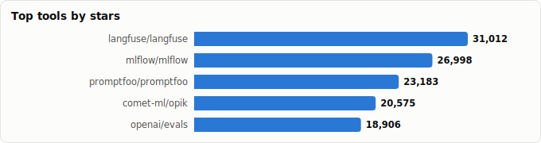
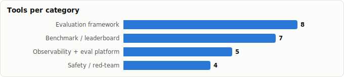

# LLM Evaluation Tooling — Landscape Report

> Derived from **kaiser-data**'s 1,350 starred repos (snapshot `2026-07-20T08:33:57.852Z`), cross-referenced with the repo-similarity graph (1,350 nodes / 4,379 edges, 28 communities).
>
> Generated 2026-07-22 by `scripts/reports/llm_evaluation.py` (regenerate any time — no API cost).

## Executive summary

- **24 evaluation-focused tools** found in your stars (**195,209★** combined), spanning four categories:
  - **Observability + eval platform** (5): `langfuse`, `mlflow`, `opik`, `openllmetry`, `opik-openclaw`
  - **Evaluation framework** (8): `promptfoo`, `evals`, `deepeval`, `phoenix`, `trulens`, `openevals`, `agentevals`, `rhesis`
  - **Benchmark / leaderboard** (7): `lm-evaluation-harness`, `lighteval`, `guidellm`, `skill`, `LiveBench`, `Open-Financial-LLMs-Leaderboard`, `RACE`
  - **Safety / red-team** (4): `garak`, `deepteam`, `uqlm`, `LettuceDetect`
- The field splits cleanly into **online** evaluation (tracing/observability in production) and **offline** evaluation (datasets, metrics, benchmarks before ship). Platforms increasingly do both.
- Evaluation method has converged on **LLM-as-a-judge** (deepeval, openevals) alongside classic reference metrics, plus a fast-growing **safety/red-team** wing (garak, deepteam) and **hallucination detection** (uqlm, LettuceDetect).
- Python dominates (20/24); the lone TypeScript-first platform is Langfuse.

## Master comparison

Sorted by stars. `Health`/`Lifecycle` are the dataset's computed metrics; `Activity` is derived from days-since-push + 90-day commits.

| Tool | Category | Lang | License | ★ Stars | Lifecycle | Health | Activity | Last push | Age | Contrib(90d) |
|---|---|---|---|---|---|---|---|---|---|---|
| [langfuse/langfuse](https://github.com/langfuse/langfuse) | Observability + eval platform | TypeScript | NOASSERTION | 31,458 (▲30) | Classic | 89 | very active | 0d ago | 3.2y | 14 |
| [mlflow/mlflow](https://github.com/mlflow/mlflow) | Observability + eval platform | Python | Apache-2.0 | 27,110 (▲8) | Classic | 92 | very active | 0d ago | 8.1y | 36 |
| [promptfoo/promptfoo](https://github.com/promptfoo/promptfoo) | Evaluation framework | TypeScript | MIT | 23,429 (▲18) | Classic | 89 | very active | 0d ago | 3.2y | 22 |
| [comet-ml/opik](https://github.com/comet-ml/opik) | Observability + eval platform | Python | Apache-2.0 | 20,714 (▲11) | Classic | 94 | very active | 0d ago | 3.2y | 22 |
| [openai/evals](https://github.com/openai/evals) | Evaluation framework | Python | NOASSERTION | 18,950 (▲5) | Mature | 27 | slowing | 3mo ago | 3.5y | 0 |
| [confident-ai/deepeval](https://github.com/confident-ai/deepeval) | Evaluation framework | Python | Apache-2.0 | 16,960 (▲10) | Mature | 73 | very active | 4d ago | 2.9y | 18 |
| [EleutherAI/lm-evaluation-harness](https://github.com/EleutherAI/lm-evaluation-harness) | Benchmark / leaderboard | Python | MIT | 13,339 (▲2) | Classic | 81 | very active | 7d ago | 5.9y | 29 |
| [Arize-ai/phoenix](https://github.com/Arize-ai/phoenix) | Evaluation framework | Python | NOASSERTION | 10,634 (▲8) | Classic | 79 | very active | 0d ago | 3.7y | 11 |
| [NVIDIA/garak](https://github.com/NVIDIA/garak) | Safety / red-team | Python | Apache-2.0 | 8,506 (▲2) | Classic | 82 | very active | 6d ago | 3.2y | 22 |
| [traceloop/openllmetry](https://github.com/traceloop/openllmetry) | Observability + eval platform | Python | Apache-2.0 | 7,312 (▲1) | Mature | 70 | very active | 7d ago | 2.9y | 6 |
| [truera/trulens](https://github.com/truera/trulens) | Evaluation framework | Python | MIT | 3,448 (▲1) | Classic | 82 | very active | 9d ago | 5.7y | 16 |
| [huggingface/lighteval](https://github.com/huggingface/lighteval) | Benchmark / leaderboard | Python | MIT | 2,486 (▲3) | Mature | 59 | active | 21d ago | 2.5y | 5 |
| [confident-ai/deepteam](https://github.com/confident-ai/deepteam) | Safety / red-team | Python | Apache-2.0 | 2,267 (▲8) | Hot | 59 | very active | 12d ago | 1.4y | 4 |
| [vllm-project/guidellm](https://github.com/vllm-project/guidellm) | Benchmark / leaderboard | Python | Apache-2.0 | 1,409 | Mature | 83 | very active | 0d ago | 2.1y | 15 |
| [pinchbench/skill](https://github.com/pinchbench/skill) | Benchmark / leaderboard | Python | MIT | 1,285 | Hot | 75 | very active | 18d ago | 5mo | 5 |
| [LiveBench/LiveBench](https://github.com/LiveBench/LiveBench) | Benchmark / leaderboard | Python | NOASSERTION | 1,245 (▲2) | Mature | 60 | very active | 3d ago | 2.1y | 3 |
| [cvs-health/uqlm](https://github.com/cvs-health/uqlm) | Safety / red-team | Python | Apache-2.0 | 1,186 | Hot | 72 | very active | 11d ago | 1.3y | 4 |
| [langchain-ai/openevals](https://github.com/langchain-ai/openevals) | Evaluation framework | Python | MIT | 1,123 (▲1) | Mature | 66 | very active | 18d ago | 1.4y | 2 |
| [comet-ml/opik-openclaw](https://github.com/comet-ml/opik-openclaw) | Observability + eval platform | TypeScript | Apache-2.0 | 683 | Hot | 72 | very active | 7d ago | 4mo | 6 |
| [langchain-ai/agentevals](https://github.com/langchain-ai/agentevals) | Evaluation framework | Python | MIT | 652 | Mature | 60 | very active | 6d ago | 1.4y | 4 |
| [KRLabsOrg/LettuceDetect](https://github.com/KRLabsOrg/LettuceDetect) | Safety / red-team | Python | MIT | 585 | Hot | 68 | very active | 5d ago | 1.5y | 10 |
| [rhesis-ai/rhesis](https://github.com/rhesis-ai/rhesis) | Evaluation framework | Python | NOASSERTION | 381 | Hot | 83 | very active | 0d ago | 1.8y | 11 |
| [finos-labs/Open-Financial-LLMs-Leaderboard](https://github.com/finos-labs/Open-Financial-LLMs-Leaderboard) | Benchmark / leaderboard | JavaScript | — | 33 | Declining | 12 | stale | 7mo ago | 1.9y | 0 |
| [jszheng21/RACE](https://github.com/jszheng21/RACE) | Benchmark / leaderboard | Python | Apache-2.0 | 14 | Abandoned | 10 | stale | 1.8y ago | 2.0y | 0 |

## By category

### Observability + eval platform

_Capture traces from live LLM apps, attach scores, manage prompts & datasets. Online-first, but most now run offline eval suites too._

- **[langfuse/langfuse](https://github.com/langfuse/langfuse)** · 31,458★ · TypeScript · Classic  
  LLM observability, metrics, evals, prompt management, datasets & playground; the most-adopted OSS platform here.  
  topics: analytics, llm, llmops, large-language-models, openai, self-hosted, ycombinator, monitoring
- **[mlflow/mlflow](https://github.com/mlflow/mlflow)** · 27,110★ · Python · Classic  
  Broad AI engineering platform; LLM tracing + evaluate + experiment tracking on top of classic MLOps.  
  topics: machine-learning, ai, ml, mlflow, apache-spark, model-management, agentops, agents
- **[comet-ml/opik](https://github.com/comet-ml/opik)** · 20,714★ · Python · Classic  
  Debug / evaluate / monitor LLM, RAG & agentic apps with tracing + automated scoring.  
  topics: open-source, langchain, openai, playground, prompt-engineering, llama-index, llm, llm-evaluation
- **[traceloop/openllmetry](https://github.com/traceloop/openllmetry)** · 7,312★ · Python · Mature  
  OpenTelemetry-native GenAI observability; standards-based traces & metrics.  
  topics: llmops, observability, open-telemetry, metrics, monitoring, opentelemetry, datascience, ml
- **[comet-ml/opik-openclaw](https://github.com/comet-ml/opik-openclaw)** · 683★ · TypeScript · Hot  
  Opik plugin that exports OpenClaw agent traces (cost/tokens/errors) for monitoring.  
  topics: clawdbot, evaluation, moltbot, observability, openclaw, testing

### Evaluation framework

_Libraries to score outputs offline — reference metrics + LLM-as-a-judge — wired into CI like unit tests._

- **[promptfoo/promptfoo](https://github.com/promptfoo/promptfoo)** · 23,429★ · TypeScript · Classic  
  Declarative prompt/eval testing + red-teaming CLI; config-driven test matrices in CI.  
  topics: llm, prompt-engineering, prompts, llmops, prompt-testing, testing, rag, evaluation
- **[openai/evals](https://github.com/openai/evals)** · 18,950★ · Python · Mature  
  OpenAI's eval registry/framework — write & share evals against a standard harness.  
  topics: —
- **[confident-ai/deepeval](https://github.com/confident-ai/deepeval)** · 16,960★ · Python · Mature  
  'The LLM eval framework' — pytest-style unit tests with metrics (faithfulness, relevancy, G-Eval/LLM-as-judge).  
  topics: evaluation-metrics, evaluation-framework, llm-evaluation, llm-evaluation-framework, llm-evaluation-metrics, python
- **[Arize-ai/phoenix](https://github.com/Arize-ai/phoenix)** · 10,634★ · Python · Classic  
  Open-source LLM tracing + eval; notebook-friendly, OTel-based.  
  topics: llmops, ai-monitoring, ai-observability, llm-eval, aiengineering, datasets, agents, llms
- **[truera/trulens](https://github.com/truera/trulens)** · 3,448★ · Python · Classic  
  Feedback-function evaluation — programmatic scorers for groundedness/relevance.  
  topics: machine-learning, neural-networks, explainable-ml, llmops, ai-monitoring, ai-observability, evals, llm-evaluation
- **[langchain-ai/openevals](https://github.com/langchain-ai/openevals)** · 1,123★ · Python · Mature  
  Readymade evaluators (prebuilt prompts + scorers) for LLM apps.  
  topics: —
- **[langchain-ai/agentevals](https://github.com/langchain-ai/agentevals)** · 652★ · Python · Mature  
  Evaluators specialized for agent *trajectories* (tool-call sequences, not just final output).  
  topics: —
- **[rhesis-ai/rhesis](https://github.com/rhesis-ai/rhesis)** · 381★ · Python · Hot  
  Testing platform that lets engineers + PMs + domain experts generate and run test suites.  
  topics: llm-evaluation, open-source, quality-assessment, responsible-ai, test-execution, test-generation, test-management, generative-ai

### Benchmark / leaderboard

_Fixed task sets that rank models/agents. Watch for contamination (LiveBench is explicitly designed against it)._

- **[EleutherAI/lm-evaluation-harness](https://github.com/EleutherAI/lm-evaluation-harness)** · 13,339★ · Python · Classic  
  The de-facto academic harness — 100+ standardized benchmarks behind the HF leaderboard.  
  topics: evaluation-framework, language-model, transformer
- **[huggingface/lighteval](https://github.com/huggingface/lighteval)** · 2,486★ · Python · Mature  
  Hugging Face's lightweight, all-in-one eval suite for fast benchmark runs.  
  topics: evaluation, evaluation-framework, evaluation-metrics, huggingface
- **[vllm-project/guidellm](https://github.com/vllm-project/guidellm)** · 1,409★ · Python · Mature  
  Performance/inference benchmark: evaluate LLM *deployments* for real-world throughput/latency.  
  topics: —
- **[pinchbench/skill](https://github.com/pinchbench/skill)** · 1,285★ · Python · Hot  
  Benchmarks LLMs as OpenClaw *coding agents* on real tasks.  
  topics: —
- **[LiveBench/LiveBench](https://github.com/LiveBench/LiveBench)** · 1,245★ · Python · Mature  
  Challenging, contamination-free benchmark refreshed over time to resist training-set leakage.  
  topics: —
- **[finos-labs/Open-Financial-LLMs-Leaderboard](https://github.com/finos-labs/Open-Financial-LLMs-Leaderboard)** · 33★ · JavaScript · Declining  
  Domain leaderboard ranking LLMs on financial tasks.  
  topics: —
- **[jszheng21/RACE](https://github.com/jszheng21/RACE)** · 14★ · Python · Abandoned  
  Multi-dimensional code-generation benchmark (Readability, Maintainability, Correctness, Efficiency).  
  topics: benchmark, code-generation, multidimensional, llm

### Safety / red-team

_Adversarial testing, vulnerability scanning, and hallucination / uncertainty detection — evaluating *failure modes* rather than task accuracy._

- **[NVIDIA/garak](https://github.com/NVIDIA/garak)** · 8,506★ · Python · Classic  
  LLM vulnerability scanner — probes for jailbreaks, prompt injection, toxicity, data leakage.  
  topics: ai, llm-evaluation, llm-security, security-scanners, vulnerability-assessment
- **[confident-ai/deepteam](https://github.com/confident-ai/deepteam)** · 2,267★ · Python · Hot  
  Framework to red-team LLMs & LLM systems (adversarial attack suites, from the DeepEval team).  
  topics: llm-guardrails, llm-red-teaming, llm-safety, python, llm-seecurity
- **[cvs-health/uqlm](https://github.com/cvs-health/uqlm)** · 1,186★ · Python · Hot  
  Uncertainty quantification for LLMs; UQ-based hallucination detection.  
  topics: ai-evaluation, ai-safety, hallucination, hallucination-detection, hallucination-evaluation, hallucination-mitigation, llm, llm-evaluation
- **[KRLabsOrg/LettuceDetect](https://github.com/KRLabsOrg/LettuceDetect)** · 585★ · Python · Hot  
  Lightweight hallucination-detection framework for RAG outputs.  
  topics: bert, hallucination-detection, hallucination-evaluation, information-extraction, nlp, python, pytorch, token-classification

## Online vs. offline evaluation

| | What it measures | Tools in your stars |
|---|---|---|
| **Online** (production) | Live traces, cost/latency, drift, real-user feedback | `langfuse`, `mlflow`, `opik`, `openllmetry`, `opik-openclaw` |
| **Offline** (pre-ship) | Metric scores on datasets, regression gates in CI | `deepeval`, `openevals`, `agentevals`, `rhesis` |
| **Comparative** (ranking) | Model/agent leaderboards on fixed tasks | `LiveBench`, `pinchbench`, `guidellm`, `RACE`, `Open-Financial-LLMs-Leaderboard` |
| **Adversarial** (safety) | Jailbreaks, injection, hallucination, uncertainty | `garak`, `deepteam`, `uqlm`, `LettuceDetect` |

## Graph analysis — how they relate

**Community clustering.** These 24 tools span **9 of the graph's 28 communities** — evaluation tooling co-locates with the broader LLM-app / agent-infra clusters rather than forming an isolated island.

- **Community 22** (7): `confident-ai/deepeval`, `vllm-project/guidellm`, `jszheng21/RACE`, `EleutherAI/lm-evaluation-harness`, `huggingface/lighteval`, `confident-ai/deepteam`, `cvs-health/uqlm`
- **Community 10** (6): `langfuse/langfuse`, `mlflow/mlflow`, `comet-ml/opik`, `comet-ml/opik-openclaw`, `rhesis-ai/rhesis`, `promptfoo/promptfoo`
- **Community 5** (2): `langchain-ai/openevals`, `langchain-ai/agentevals`
- **Community 16** (2): `openai/evals`, `KRLabsOrg/LettuceDetect`
- **Community 20** (2): `Arize-ai/phoenix`, `truera/trulens`
- **Community 0** (2): `LiveBench/LiveBench`, `pinchbench/skill`

**Centrality (PageRank in the full 1,071-repo graph)** — how 'hub-like' each tool is within your starred ecosystem:

- `comet-ml/opik` — PageRank 0.0014
- `NVIDIA/garak` — PageRank 0.0013
- `langchain-ai/openevals` — PageRank 0.0012
- `comet-ml/opik-openclaw` — PageRank 0.0011
- `huggingface/lighteval` — PageRank 0.0010
- `langchain-ai/agentevals` — PageRank 0.0010
- `openai/evals` — PageRank 0.0010
- `confident-ai/deepeval` — PageRank 0.0008

**Direct links between eval tools** (similarity edges where both endpoints are in this report):

- `langchain-ai/agentevals` ⇄ `langchain-ai/openevals` (w=1.550) — authors: jkennedyvz, dependabot[bot]
- `confident-ai/deepteam` ⇄ `confident-ai/deepeval` (w=0.966) — topics: python; authors: A-Vamshi, penguine-ip, kritinv
- `comet-ml/opik-openclaw` ⇄ `comet-ml/opik` (w=0.709) — topics: evaluation; authors: YarivHashaiComet, dependabot[bot]
- `langfuse/langfuse` ⇄ `comet-ml/opik` (w=0.524) — topics: llm, llmops, openai, open-source
- `truera/trulens` ⇄ `Arize-ai/phoenix` (w=0.445) — topics: llmops, ai-monitoring, ai-observability, evals; authors: dependabot[bot]
- `mlflow/mlflow` ⇄ `comet-ml/opik` (w=0.342) — topics: evaluation, langchain, llm-evaluation, llmops
- `huggingface/lighteval` ⇄ `confident-ai/deepeval` (w=0.300) — topics: evaluation-framework, evaluation-metrics
- `langfuse/langfuse` ⇄ `mlflow/mlflow` (w=0.276) — topics: llmops, openai, observability, open-source
- `Arize-ai/phoenix` ⇄ `mlflow/mlflow` (w=0.264) — topics: llmops, agents, prompt-engineering, llm-evaluation
- `promptfoo/promptfoo` ⇄ `comet-ml/opik` (w=0.239) — topics: llm, prompt-engineering, llmops, evaluation; authors: dependabot[bot]
- `EleutherAI/lm-evaluation-harness` ⇄ `confident-ai/deepeval` (w=0.218) — topics: evaluation-framework; authors: bongho
- `huggingface/lighteval` ⇄ `EleutherAI/lm-evaluation-harness` (w=0.217) — topics: evaluation-framework
- `promptfoo/promptfoo` ⇄ `comet-ml/opik-openclaw` (w=0.215) — topics: testing, evaluation; authors: dependabot[bot]
- `promptfoo/promptfoo` ⇄ `langfuse/langfuse` (w=0.206) — topics: llm, prompt-engineering, llmops, evaluation
- `rhesis-ai/rhesis` ⇄ `comet-ml/opik` (w=0.193) — topics: llm-evaluation, open-source, llmops
- `rhesis-ai/rhesis` ⇄ `confident-ai/deepeval` (w=0.183) — topics: llm-evaluation, llm-evaluation-framework
- `cvs-health/uqlm` ⇄ `KRLabsOrg/LettuceDetect` (w=0.150) — topics: hallucination-detection, hallucination-evaluation
- `cvs-health/uqlm` ⇄ `comet-ml/opik` (w=0.130) — topics: llm, llm-evaluation

## Maintenance & risk signal

Bus factor = commit concentration (1 = single-maintainer risk). Pair with lifecycle + activity before adopting.

| Tool | Health | Lifecycle | Activity | Bus factor | Top-author share | Releases |
|---|---|---|---|---|---|---|
| comet-ml/opik | 94 | Classic | very active | 4 | 24% | 527 |
| mlflow/mlflow | 92 | Classic | very active | 4 | 23% | 171 |
| langfuse/langfuse | 89 | Classic | very active | 3 | 30% | 624 |
| promptfoo/promptfoo | 89 | Classic | very active | 3 | 29% | 419 |
| rhesis-ai/rhesis | 83 | Hot | very active | 2 | 26% | 144 |
| vllm-project/guidellm | 83 | Mature | very active | 2 | 35% | 15 |
| truera/trulens | 82 | Classic | very active | 3 | 23% | 119 |
| NVIDIA/garak | 82 | Classic | very active | 2 | 45% | 31 |
| EleutherAI/lm-evaluation-harness | 81 | Classic | very active | 4 | 26% | 18 |
| Arize-ai/phoenix | 79 | Classic | very active | 1 | 68% | 753 |
| pinchbench/skill | 75 | Hot | very active | 1 | 88% | 14 |
| confident-ai/deepeval | 73 | Mature | very active | 1 | 52% | 57 |
| comet-ml/opik-openclaw | 72 | Hot | very active | 1 | 67% | 25 |
| cvs-health/uqlm | 72 | Hot | very active | 1 | 69% | 41 |
| traceloop/openllmetry | 70 | Mature | very active | 1 | 75% | 260 |
| KRLabsOrg/LettuceDetect | 68 | Hot | very active | 1 | 81% | 12 |
| langchain-ai/openevals | 66 | Mature | very active | 1 | 53% | 41 |
| langchain-ai/agentevals | 60 | Mature | very active | 2 | 41% | 12 |
| LiveBench/LiveBench | 60 | Mature | very active | 1 | 63% | 0 |
| huggingface/lighteval | 59 | Mature | active | 1 | 61% | 15 |
| confident-ai/deepteam | 59 | Hot | very active | 1 | 59% | 3 |
| openai/evals | 27 | Mature | slowing | 0 | 0% | 0 |
| finos-labs/Open-Financial-LLMs-Leaderboard | 12 | Declining | stale | 0 | 0% | 0 |
| jszheng21/RACE | 10 | Abandoned | stale | 0 | 0% | 0 |

## Which one should you use?

| If you want… | Start with | Why |
|---|---|---|
| End-to-end observability + evals for a production app | `langfuse/langfuse` | Most-starred OSS platform here; tracing + evals + prompt mgmt + datasets, TS-friendly. |
| Offline eval as CI unit tests (LLM-as-judge) | `confident-ai/deepeval` | Pytest-style metrics (faithfulness, relevancy, G-Eval); largest dedicated framework. |
| To evaluate agent *trajectories*, not just answers | `langchain-ai/agentevals` | Scores tool-call sequences / multi-step behavior. |
| Standards-based tracing (vendor-neutral) | `traceloop/openllmetry` | Built on OpenTelemetry; plugs into existing observability stacks. |
| To red-team / security-scan a model | `NVIDIA/garak` + `confident-ai/deepteam` | garak = vulnerability scanner; deepteam = adversarial attack framework. |
| Hallucination / uncertainty detection | `cvs-health/uqlm` or `KRLabsOrg/LettuceDetect` | UQ-based detection; LettuceDetect targets RAG outputs specifically. |
| A contamination-resistant model leaderboard | `LiveBench/LiveBench` | Refreshed tasks designed to resist training-set leakage. |
| To benchmark coding agents | `pinchbench/skill` | Runs LLMs as coding agents on real tasks. |

## Notably absent from your stars

Several widely-used evaluation tools are **not** in this dataset — worth knowing when treating the above as a complete picture:

- **explodinggradients/ragas** — the standard RAG eval metric library (you hold the fork `vibrantlabsai/ragas`)
- **stanford-crfm/helm** — holistic benchmark from Stanford

## Methodology & caveats

- **Source**: `data/classified.json` + `public/data/graph.json`. No external calls; fully reproducible via the generator script.
- **Selection**: keyword scan (eval/benchmark/leaderboard/red-team/guardrail/observability/hallucination + LLM/agent signals) across name/description/topics/README, then manual curation. Adjacent-but-excluded: RAG engines, vector DBs, LLM gateways (e.g. `litellm`), and agent frameworks that merely *embed* an eval module.
- **Metrics** (health, lifecycle, bus_factor) are precomputed at snapshot time and may lag GitHub's current state.
- Re-run after a fresh `classified.json` to refresh stars/activity.

Tools covered: 24 · Snapshot: 2026-07-20T08:33:57.852Z
