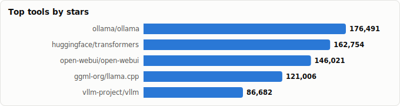
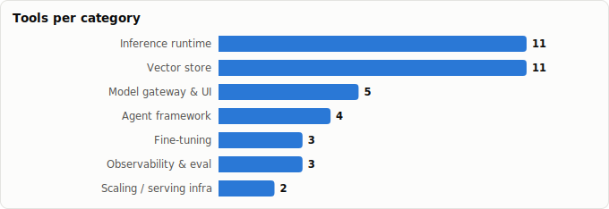

# Local vs High-Infra AI Stack — A Deployment-Tier Comparison

> Derived from **kaiser-data**'s 1,243 starred repos (snapshot `2026-06-11T21:58:33.384Z`), cross-referenced with the repo-similarity graph (1,243 nodes / 4,017 edges, 31 communities).
>
> Generated 2026-07-08 by `scripts/reports/local_vs_infra_stack.py` (regenerate any time — no API cost).

## Executive summary

- **39 stack tools** in your stars (**1,701,243★** combined), mapped to every layer of a self-hosted AI stack and tagged by deployment tier:
  - 🟢 **Local / edge** (15) — laptop, single consumer GPU, on-device, zero ops
  - 🟡 **Scales both** (16) — same tool, local *or* cluster, config-dependent
  - 🔴 **High-infra** (8) — multi-GPU / datacenter / high-QPS / k8s
- **The core split is the inference runtime.** Local tier optimizes for *one* of you on *one* box (`ollama`, `llama.cpp`, `llamafile`); high-infra optimizes for *throughput across many GPUs* (`vllm`, `sglang`, `lmdeploy`). Everything else (gateway, vector store, agent logic) is mostly the same code with a different deployment target.
- **Don't pick a runtime per tool — pick a tier, then fill each layer.** The two reference stacks below do exactly that.
- **The 🟡 'scales both' tools are the safe bets** when you'll start local and grow: `litellm` (gateway), `pgvector`/`qdrant`/`chroma` (store), `transformers`/`peft`, the agent frameworks, and `langfuse`/`phoenix` all migrate without a rewrite.

## The two reference stacks

Same job at every layer — different tier. Pick a column and go.

| Layer | 🟢 Fully-local stack | 🔴 High-infra stack |
|---|---|---|
| **Inference runtime** | `ollama/ollama` | `vllm-project/vllm` |
| **Scaling infra** | `— (single node)` | `skypilot-org/skypilot` |
| **Cost optimization** | `GGUF quant (llama.cpp)` | `vllm-project/llm-compressor` |
| **Gateway / UI** | `open-webui/open-webui` | `BerriAI/litellm` |
| **Vector store** | `lancedb / pgvector` | `milvus-io/milvus (or clustered qdrant)` |
| **Fine-tuning** | `unslothai/unsloth` | `axolotl-ai-cloud/axolotl` |
| **Agent logic** | `pydantic/pydantic-ai` | `pydantic/pydantic-ai (same)` |
| **Observability** | `promptfoo/promptfoo` | `langfuse/langfuse` |

**Reading it:** the agent logic and observability *code* is identical across columns — only the runtime, scaling, store, and trainer change as you move from one box to a fleet.

## The stack, layer by layer

### Inference runtime

_Where the model actually executes. This is the layer where the local/high-infra distinction is sharpest._

| Tool | Tier | ★ Stars | Lang | Lifecycle | What it's for |
|---|---|---|---|---|---|
| [ollama/ollama](https://github.com/ollama/ollama) | 🟢 Local | 173,893 | Go | Mature | The zero-config local default — `ollama run`, model registry, OpenAI-compatible API. Laptop-to-server, but single-node. |
| [ggml-org/llama.cpp](https://github.com/ggml-org/llama.cpp) | 🟢 Local | 116,094 | C++ | Classic | The CPU/edge engine under everything — GGUF quantization, runs on a Raspberry Pi to a Mac; the embeddable substrate. |
| [nomic-ai/gpt4all](https://github.com/nomic-ai/gpt4all) | 🟢 Local | 77,353 | C++ | Declining | Desktop-first local LLM app + bindings; privacy-focused, runs on plain CPUs. |
| [mudler/LocalAI](https://github.com/mudler/LocalAI) | 🟢 Local | 46,792 | Go | Classic | Self-hosted, OpenAI-drop-in engine for LLM/TTS/STT/image on commodity hardware — the all-in-one local server. |
| [mozilla-ai/llamafile](https://github.com/mozilla-ai/llamafile) | 🟢 Local | 24,890 | C++ | Mature | One file = one runnable model. Maximum portability for shipping a local model with no install. |
| [microsoft/Foundry-Local](https://github.com/microsoft/Foundry-Local) | 🟢 Local | 2,361 | C++ | Hot | Microsoft's on-device runtime — offline LLM + Whisper, hardware-accelerated where available. |
| [huggingface/transformers](https://github.com/huggingface/transformers) | 🟡 Both | 161,513 | Python | Classic | The model-definition library every runtime builds on; runs a notebook locally or a training cluster — the common denominator. |
| [exo-explore/exo](https://github.com/exo-explore/exo) | 🟡 Both | 45,297 | Python | Hot | Stitches a *cluster out of your local devices* (phones, Macs, PCs) to run big models — distributed but home-grown. |
| [vllm-project/vllm](https://github.com/vllm-project/vllm) | 🔴 Infra | 82,581 | Python | Classic | The production serving standard — PagedAttention, continuous batching, tensor/pipeline parallelism for high QPS on GPU fleets. |
| [sgl-project/sglang](https://github.com/sgl-project/sglang) | 🔴 Infra | 28,913 | Python | Mature | High-throughput serving with RadixAttention prefix caching — excels at structured/agentic workloads at scale. |
| [InternLM/lmdeploy](https://github.com/InternLM/lmdeploy) | 🔴 Infra | 7,894 | Python | Mature | Toolkit for compressing + serving LLMs at scale (TurboMind engine); quantization-aware high-throughput inference. |

### Scaling / serving infra

_How you get a runtime onto many machines, cheaply. Only relevant once you outgrow a single node._

| Tool | Tier | ★ Stars | Lang | Lifecycle | What it's for |
|---|---|---|---|---|---|
| [skypilot-org/skypilot](https://github.com/skypilot-org/skypilot) | 🔴 Infra | 10,078 | Python | Classic | Run/serve LLMs across any cloud or k8s with cost-aware scheduling & spot recovery — the multi-cloud orchestration layer. |
| [vllm-project/llm-compressor](https://github.com/vllm-project/llm-compressor) | 🔴 Infra | 3,388 | Python | Hot | Quantize/sparsify models (GPTQ/AWQ/SmoothQuant) so they serve cheaper on vLLM — the cost-optimization step. |

### Model gateway & UI

_What sits in front of the model(s) — a chat UI for one user, or a proxy that fans out across providers for a whole org._

| Tool | Tier | ★ Stars | Lang | Lifecycle | What it's for |
|---|---|---|---|---|---|
| [open-webui/open-webui](https://github.com/open-webui/open-webui) | 🟢 Local | 141,111 | Python | Mature | The self-hosted ChatGPT-style UI for local models (pairs with Ollama) — RAG, users, tools, fully offline. |
| [Mintplex-Labs/anything-llm](https://github.com/Mintplex-Labs/anything-llm) | 🟢 Local | 61,453 | JavaScript | Classic | All-in-one desktop/self-host app: chat + RAG + agents over local or API models. |
| [janhq/jan](https://github.com/janhq/jan) | 🟢 Local | 42,977 | TypeScript | Mature | Open-source desktop ChatGPT alternative that runs models 100% on your machine. |
| [BerriAI/litellm](https://github.com/BerriAI/litellm) | 🟡 Both | 50,082 | Python | Mature | One OpenAI-compatible API over 100+ providers + a self-hostable proxy with keys/budgets/routing — local or enterprise gateway. |
| [Portkey-AI/gateway](https://github.com/Portkey-AI/gateway) | 🟡 Both | 12,039 | TypeScript | Mature | Fast AI gateway with routing, fallbacks, caching, and guardrails — drop in front of any tier. |

### Vector store

_Where embeddings live for RAG. Many of these span tiers — start embedded, cluster later._

| Tool | Tier | ★ Stars | Lang | Lifecycle | What it's for |
|---|---|---|---|---|---|
| [facebookresearch/faiss](https://github.com/facebookresearch/faiss) | 🟢 Local | 40,266 | C++ | Classic | The in-process ANN library — no server, embed it in your app; the index inside many of the DBs below. |
| [neuml/txtai](https://github.com/neuml/txtai) | 🟢 Local | 12,650 | Python | Mature | All-in-one embeddings DB + RAG + workflows in one local package. |
| [lancedb/lancedb](https://github.com/lancedb/lancedb) | 🟢 Local | 10,579 | HTML | Classic | Embedded, serverless vector DB (Lance columnar format) — zero-ops local RAG that still handles large on-disk sets. |
| [alibaba/zvec](https://github.com/alibaba/zvec) | 🟢 Local | 9,776 | C++ | Hot | Lightweight, lightning-fast in-process vector database for embedded use. |
| [redis/redis](https://github.com/redis/redis) | 🟡 Both | 74,829 | C | Classic | The in-memory store you already run, now with vector search — local cache to HA cluster. |
| [qdrant/qdrant](https://github.com/qdrant/qdrant) | 🟡 Both | 32,039 | Rust | Classic | Rust vector DB — single-binary local, but clusters with sharding/replication for billions of vectors. |
| [chroma-core/chroma](https://github.com/chroma-core/chroma) | 🟡 Both | 28,387 | Rust | Classic | AI-native store that runs embedded for prototyping and client/server for production — the easy on-ramp. |
| [pgvector/pgvector](https://github.com/pgvector/pgvector) | 🟡 Both | 21,711 | C | Classic | Vector search inside the Postgres you already run — scales from a laptop to a managed cluster with no new infra. |
| [marqo-ai/marqo](https://github.com/marqo-ai/marqo) | 🟡 Both | 5,020 | Python | Classic | End-to-end vector search that bundles embedding inference; deploys local or distributed. |
| [milvus-io/milvus](https://github.com/milvus-io/milvus) | 🔴 Infra | 44,729 | Go | Classic | The billion-scale, distributed OSS vector DB — heavy ops footprint, built for datacenter scale. |
| [weaviate/weaviate](https://github.com/weaviate/weaviate) | 🔴 Infra | 16,313 | Go | Classic | Cloud-native vector DB with hybrid search & modules — designed for clustered, multi-tenant deployments. |

### Fine-tuning

_Adapting a model. LoRA on one GPU vs. multi-node full fine-tunes._

| Tool | Tier | ★ Stars | Lang | Lifecycle | What it's for |
|---|---|---|---|---|---|
| [unslothai/unsloth](https://github.com/unslothai/unsloth) | 🟢 Local | 66,258 | Python | Mature | 2× faster, lower-VRAM fine-tuning — train a LoRA on a single consumer GPU (even Colab). |
| [huggingface/peft](https://github.com/huggingface/peft) | 🟡 Both | 21,267 | Python | Classic | Parameter-efficient fine-tuning (LoRA/QLoRA/adapters) — one consumer GPU or a multi-node run. |
| [axolotl-ai-cloud/axolotl](https://github.com/axolotl-ai-cloud/axolotl) | 🔴 Infra | 12,035 | Python | Classic | Config-driven fine-tuning that scales to multi-GPU/multi-node (DeepSpeed/FSDP) — the cluster-grade trainer. |

### Agent framework

_The orchestration logic — deliberately tier-agnostic; it targets whatever endpoint you give it._

| Tool | Tier | ★ Stars | Lang | Lifecycle | What it's for |
|---|---|---|---|---|---|
| [crewAIInc/crewAI](https://github.com/crewAIInc/crewAI) | 🟡 Both | 53,280 | Python | Mature | Role-based multi-agent framework — runs against any model backend, local or hosted. |
| [run-llama/llama_index](https://github.com/run-llama/llama_index) | 🟡 Both | 50,083 | Python | Classic | Data/agent framework — point it at a local Ollama or a cloud endpoint; tier-agnostic. |
| [langchain-ai/langgraph](https://github.com/langchain-ai/langgraph) | 🟡 Both | 34,458 | Python | Mature | Graph/stateful agent runtime — the orchestration logic is independent of where the model runs. |
| [pydantic/pydantic-ai](https://github.com/pydantic/pydantic-ai) | 🟡 Both | 17,703 | Python | Hot | Type-safe agent framework; model-agnostic, so the same code targets either tier. |

### Observability & eval

_Tracing, metrics, and evals. Most self-host locally and also offer managed cloud._

| Tool | Tier | ★ Stars | Lang | Lifecycle | What it's for |
|---|---|---|---|---|---|
| [promptfoo/promptfoo](https://github.com/promptfoo/promptfoo) | 🟢 Local | 22,122 | TypeScript | Classic | CLI-first prompt/model eval that runs entirely on your machine in CI — no backend needed. |
| [langfuse/langfuse](https://github.com/langfuse/langfuse) | 🟡 Both | 28,929 | TypeScript | Classic | Self-hostable LLM tracing/eval/metrics — runs in Docker locally or as managed cloud. |
| [Arize-ai/phoenix](https://github.com/Arize-ai/phoenix) | 🟡 Both | 10,100 | Python | Classic | Open-source LLM observability you can run locally; OTel-native tracing + evals. |

## Which tier should you use?

| Your situation | Tier | Runtime to start with |
|---|---|---|
| Laptop / Mac, privacy, one user | 🟢 Local | `ollama` (+ `open-webui`) |
| Single consumer GPU (e.g. 1×4090) | 🟢 Local | `ollama` or `llama.cpp` w/ GGUF |
| CPU-only / edge / air-gapped | 🟢 Local | `llama.cpp` / `llamafile` / `LocalAI` |
| Prototype now, scale later | 🟡 Both | `vllm` behind `litellm`; `pgvector` store |
| Many users, steady traffic | 🔴 Infra | `vllm` (continuous batching) |
| Agentic / structured-output at scale | 🔴 Infra | `sglang` (RadixAttention) |
| Multi-cloud / spot-GPU cost control | 🔴 Infra | `vllm` orchestrated by `skypilot` |
| Pool several home devices | 🟡 Both | `exo-explore/exo` |

## Master comparison (operational metrics)

Sorted by tier then stars. `Health`/`Lifecycle` are the dataset's computed metrics; `Activity` is derived from days-since-push + 90-day commits.

| Tool | Layer | Tier | Lang | License | ★ Stars | Lifecycle | Health | Activity | Last push | Contrib(90d) |
|---|---|---|---|---|---|---|---|---|---|---|
| [ollama](https://github.com/ollama/ollama) | Inference runtime | Local | Go | MIT | 173,893 | Mature | 88 | very active | 0d ago | 12 |
| [open-webui](https://github.com/open-webui/open-webui) | Model gateway & UI | Local | Python | NOASSERTION | 141,111 | Mature | 80 | very active | 1d ago | 17 |
| [llama.cpp](https://github.com/ggml-org/llama.cpp) | Inference runtime | Local | C++ | MIT | 116,094 | Classic | 99 | very active | 0d ago | 53 |
| [gpt4all](https://github.com/nomic-ai/gpt4all) | Inference runtime | Local | C++ | MIT | 77,353 | Declining | 7 | stale | 1.0y ago | 0 |
| [unsloth](https://github.com/unslothai/unsloth) | Fine-tuning | Local | Python | Apache-2.0 | 66,258 | Mature | 82 | very active | 0d ago | 25 |
| [anything-llm](https://github.com/Mintplex-Labs/anything-llm) | Model gateway & UI | Local | JavaScript | MIT | 61,453 | Classic | 79 | very active | 0d ago | 17 |
| [LocalAI](https://github.com/mudler/LocalAI) | Inference runtime | Local | Go | MIT | 46,792 | Classic | 79 | very active | 0d ago | 11 |
| [jan](https://github.com/janhq/jan) | Model gateway & UI | Local | TypeScript | NOASSERTION | 42,977 | Mature | 79 | very active | 1d ago | 3 |
| [faiss](https://github.com/facebookresearch/faiss) | Vector store | Local | C++ | MIT | 40,266 | Classic | 88 | very active | 0d ago | 33 |
| [llamafile](https://github.com/mozilla-ai/llamafile) | Inference runtime | Local | C++ | NOASSERTION | 24,890 | Mature | 63 | very active | 2d ago | 7 |
| [promptfoo](https://github.com/promptfoo/promptfoo) | Observability & eval | Local | TypeScript | MIT | 22,122 | Classic | 84 | very active | 0d ago | 15 |
| [txtai](https://github.com/neuml/txtai) | Vector store | Local | Python | Apache-2.0 | 12,650 | Mature | 78 | very active | 0d ago | 1 |
| [lancedb](https://github.com/lancedb/lancedb) | Vector store | Local | HTML | Apache-2.0 | 10,579 | Classic | 96 | very active | 0d ago | 29 |
| [zvec](https://github.com/alibaba/zvec) | Vector store | Local | C++ | Apache-2.0 | 9,776 | Hot | 87 | very active | 1d ago | 15 |
| [Foundry-Local](https://github.com/microsoft/Foundry-Local) | Inference runtime | Local | C++ | NOASSERTION | 2,361 | Hot | 94 | very active | 0d ago | 17 |
| [transformers](https://github.com/huggingface/transformers) | Inference runtime | Both | Python | Apache-2.0 | 161,513 | Classic | 99 | very active | 0d ago | 46 |
| [redis](https://github.com/redis/redis) | Vector store | Both | C | NOASSERTION | 74,829 | Classic | 97 | very active | 2d ago | 42 |
| [crewAI](https://github.com/crewAIInc/crewAI) | Agent framework | Both | Python | MIT | 53,280 | Mature | 85 | very active | 0d ago | 12 |
| [llama_index](https://github.com/run-llama/llama_index) | Agent framework | Both | Python | MIT | 50,083 | Classic | 100 | very active | 0d ago | 49 |
| [litellm](https://github.com/BerriAI/litellm) | Model gateway & UI | Both | Python | NOASSERTION | 50,082 | Mature | 89 | very active | 0d ago | 10 |
| [exo](https://github.com/exo-explore/exo) | Inference runtime | Both | Python | Apache-2.0 | 45,297 | Hot | 88 | very active | 0d ago | 18 |
| [langgraph](https://github.com/langchain-ai/langgraph) | Agent framework | Both | Python | MIT | 34,458 | Mature | 83 | very active | 0d ago | 11 |
| [qdrant](https://github.com/qdrant/qdrant) | Vector store | Both | Rust | Apache-2.0 | 32,039 | Classic | 93 | very active | 0d ago | 16 |
| [langfuse](https://github.com/langfuse/langfuse) | Observability & eval | Both | TypeScript | NOASSERTION | 28,929 | Classic | 89 | very active | 0d ago | 18 |
| [chroma](https://github.com/chroma-core/chroma) | Vector store | Both | Rust | Apache-2.0 | 28,387 | Classic | 83 | very active | 1d ago | 8 |
| [pgvector](https://github.com/pgvector/pgvector) | Vector store | Both | C | NOASSERTION | 21,711 | Classic | 56 | very active | 1d ago | 3 |
| [peft](https://github.com/huggingface/peft) | Fine-tuning | Both | Python | Apache-2.0 | 21,267 | Classic | 83 | very active | 0d ago | 33 |
| [pydantic-ai](https://github.com/pydantic/pydantic-ai) | Agent framework | Both | Python | MIT | 17,703 | Hot | 93 | very active | 0d ago | 37 |
| [gateway](https://github.com/Portkey-AI/gateway) | Model gateway & UI | Both | TypeScript | MIT | 12,039 | Mature | 65 | active | 17d ago | 3 |
| [phoenix](https://github.com/Arize-ai/phoenix) | Observability & eval | Both | Python | NOASSERTION | 10,100 | Classic | 84 | very active | 0d ago | 15 |
| [marqo](https://github.com/marqo-ai/marqo) | Vector store | Both | Python | Apache-2.0 | 5,020 | Classic | 68 | very active | 3d ago | 3 |
| [vllm](https://github.com/vllm-project/vllm) | Inference runtime | Infra | Python | Apache-2.0 | 82,581 | Classic | 99 | very active | 0d ago | 76 |
| [milvus](https://github.com/milvus-io/milvus) | Vector store | Infra | Go | Apache-2.0 | 44,729 | Classic | 100 | very active | 0d ago | 30 |
| [sglang](https://github.com/sgl-project/sglang) | Inference runtime | Infra | Python | Apache-2.0 | 28,913 | Mature | 99 | very active | 0d ago | 61 |
| [weaviate](https://github.com/weaviate/weaviate) | Vector store | Infra | Go | BSD-3-Clause | 16,313 | Classic | 84 | very active | 0d ago | 11 |
| [axolotl](https://github.com/axolotl-ai-cloud/axolotl) | Fine-tuning | Infra | Python | Apache-2.0 | 12,035 | Classic | 84 | very active | 0d ago | 18 |
| [skypilot](https://github.com/skypilot-org/skypilot) | Scaling / serving infra | Infra | Python | Apache-2.0 | 10,078 | Classic | 95 | very active | 0d ago | 23 |
| [lmdeploy](https://github.com/InternLM/lmdeploy) | Inference runtime | Infra | Python | Apache-2.0 | 7,894 | Mature | 88 | very active | 0d ago | 12 |
| [llm-compressor](https://github.com/vllm-project/llm-compressor) | Scaling / serving infra | Infra | Python | Apache-2.0 | 3,388 | Hot | 89 | very active | 0d ago | 24 |

## Graph analysis — how the stack hangs together

**Community clustering.** These 39 tools span **15 of the graph's 31 communities** — the stack cuts across the inference, RAG/vector, and agent neighborhoods rather than forming one cluster.

- **Community 5** (8): `ollama/ollama`, `vllm-project/vllm`, `sgl-project/sglang`, `InternLM/lmdeploy`, `huggingface/transformers`, `vllm-project/llm-compressor`, `unslothai/unsloth`, `huggingface/peft`
- **Community 17** (6): `lancedb/lancedb`, `pgvector/pgvector`, `alibaba/zvec`, `qdrant/qdrant`, `weaviate/weaviate`, `milvus-io/milvus`
- **Community 20** (5): `BerriAI/litellm`, `Portkey-AI/gateway`, `langfuse/langfuse`, `Arize-ai/phoenix`, `promptfoo/promptfoo`
- **Community 1** (3): `nomic-ai/gpt4all`, `chroma-core/chroma`, `crewAIInc/crewAI`
- **Community 6** (3): `skypilot-org/skypilot`, `facebookresearch/faiss`, `marqo-ai/marqo`
- **Community 7** (3): `open-webui/open-webui`, `langchain-ai/langgraph`, `pydantic/pydantic-ai`
- **Community 13** (2): `mozilla-ai/llamafile`, `microsoft/Foundry-Local`
- **Community 3** (2): `Mintplex-Labs/anything-llm`, `neuml/txtai`

**Centrality (PageRank in the full 1,243-repo graph)** — the 'hub' tools your other stars cluster around:

- `langchain-ai/langgraph` — PageRank 0.0028 (🟡 Both)
- `huggingface/peft` — PageRank 0.0018 (🟡 Both)
- `crewAIInc/crewAI` — PageRank 0.0017 (🟡 Both)
- `huggingface/transformers` — PageRank 0.0013 (🟡 Both)
- `vllm-project/vllm` — PageRank 0.0013 (🔴 Infra)
- `neuml/txtai` — PageRank 0.0012 (🟢 Local)
- `axolotl-ai-cloud/axolotl` — PageRank 0.0012 (🔴 Infra)
- `lancedb/lancedb` — PageRank 0.0012 (🟢 Local)
- `weaviate/weaviate` — PageRank 0.0012 (🔴 Infra)
- `chroma-core/chroma` — PageRank 0.0010 (🟡 Both)

**Direct links between stack tools** (top similarity edges where both endpoints are in this report):

- `huggingface/peft` ⇄ `huggingface/transformers` (w=0.860) — topics: llm, python, pytorch; authors: dependabot[bot], kaixuanliu, jiqing-feng
- `vllm-project/llm-compressor` ⇄ `vllm-project/vllm` (w=0.550)
- `weaviate/weaviate` ⇄ `qdrant/qdrant` (w=0.429) — topics: search-engine, vector-search, vector-search-engine, vector-database
- `vllm-project/vllm` ⇄ `sgl-project/sglang` (w=0.422) — topics: llm, transformer, inference, llama; authors: mmangkad
- `unslothai/unsloth` ⇄ `ollama/ollama` (w=0.417) — topics: llama, llms, mistral, gemma
- `lancedb/lancedb` ⇄ `weaviate/weaviate` (w=0.400) — topics: approximate-nearest-neighbor-search, image-search, nearest-neighbor-search, recommender-system
- `BerriAI/litellm` ⇄ `Portkey-AI/gateway` (w=0.381) — topics: langchain, llm, llmops, openai
- `crewAIInc/crewAI` ⇄ `chroma-core/chroma` (w=0.375) — topics: agents, ai, ai-agents
- `lancedb/lancedb` ⇄ `qdrant/qdrant` (w=0.318) — topics: image-search, nearest-neighbor-search, recommender-system, search-engine; authors: dependabot[bot]
- `lancedb/lancedb` ⇄ `alibaba/zvec` (w=0.282) — topics: search-engine, semantic-search, similarity-search, vector-database; authors: dependabot[bot]
- `Arize-ai/phoenix` ⇄ `promptfoo/promptfoo` (w=0.276) — topics: llmops, llm-eval, prompt-engineering, llm-evaluation; authors: bymle, dependabot[bot]
- `sgl-project/sglang` ⇄ `ollama/ollama` (w=0.269) — topics: llama, llm, deepseek, gpt-oss
- `lancedb/lancedb` ⇄ `pgvector/pgvector` (w=0.250) — topics: approximate-nearest-neighbor-search, nearest-neighbor-search
- `huggingface/transformers` ⇄ `sgl-project/sglang` (w=0.244) — topics: transformer, deepseek, glm, llm
- `sgl-project/sglang` ⇄ `unslothai/unsloth` (w=0.244) — topics: llama, llm, deepseek, gpt-oss
- …and 8 more.

## Maintenance & risk signal

Bus factor = commit concentration (1 = single-maintainer risk). For infra you'll depend on, weight health + activity heavily.

| Tool | Tier | Health | Lifecycle | Activity | Bus factor | Top-author share | Releases |
|---|---|---|---|---|---|---|---|
| milvus | Infra | 100 | Classic | very active | 8 | 8% | 164 |
| llama_index | Both | 100 | Classic | very active | 7 | 25% | 494 |
| llama.cpp | Local | 99 | Classic | very active | 9 | 12% | 6318 |
| vllm | Infra | 99 | Classic | very active | 26 | 6% | 96 |
| sglang | Infra | 99 | Mature | very active | 13 | 8% | 52 |
| transformers | Both | 99 | Classic | very active | 7 | 18% | 261 |
| redis | Both | 97 | Classic | very active | 7 | 17% | 132 |
| lancedb | Local | 96 | Classic | very active | 5 | 14% | 442 |
| skypilot | Infra | 95 | Classic | very active | 4 | 19% | 39 |
| Foundry-Local | Local | 94 | Hot | very active | 4 | 25% | 18 |
| qdrant | Both | 93 | Classic | very active | 4 | 18% | 114 |
| pydantic-ai | Both | 93 | Hot | very active | 4 | 32% | 269 |
| llm-compressor | Infra | 89 | Hot | very active | 3 | 24% | 25 |
| litellm | Both | 89 | Mature | very active | 3 | 19% | 1356 |
| langfuse | Both | 89 | Classic | very active | 3 | 21% | 575 |
| ollama | Local | 88 | Mature | very active | 3 | 32% | 223 |
| lmdeploy | Infra | 88 | Mature | very active | 3 | 29% | 65 |
| exo | Both | 88 | Hot | very active | 3 | 29% | 16 |
| faiss | Local | 88 | Classic | very active | 3 | 21% | 26 |
| zvec | Local | 87 | Hot | very active | 3 | 23% | 7 |
| crewAI | Both | 85 | Mature | very active | 2 | 49% | 201 |
| weaviate | Infra | 84 | Classic | very active | 2 | 48% | 545 |
| axolotl | Infra | 84 | Classic | very active | 2 | 42% | 31 |
| phoenix | Both | 84 | Classic | very active | 2 | 41% | 715 |
| promptfoo | Local | 84 | Classic | very active | 2 | 31% | 414 |
| chroma | Both | 83 | Classic | very active | 2 | 39% | 137 |
| peft | Both | 83 | Classic | very active | 2 | 44% | 32 |
| langgraph | Both | 83 | Mature | very active | 2 | 43% | 546 |
| unsloth | Local | 82 | Mature | very active | 2 | 48% | 39 |
| open-webui | Local | 80 | Mature | very active | 1 | 56% | 163 |
| LocalAI | Local | 79 | Classic | very active | 1 | 79% | 118 |
| jan | Local | 79 | Mature | very active | 1 | 96% | 102 |
| anything-llm | Local | 79 | Classic | very active | 1 | 63% | 30 |
| txtai | Local | 78 | Mature | very active | 1 | 100% | 64 |
| marqo | Both | 68 | Classic | very active | 1 | 71% | 113 |
| gateway | Both | 65 | Mature | active | 1 | 64% | 81 |
| llamafile | Local | 63 | Mature | very active | 1 | 73% | 40 |
| pgvector | Both | 56 | Classic | very active | 1 | 83% | 0 |
| gpt4all | Local | 7 | Declining | stale | 0 | 0% | 38 |

## Adjacent (covered elsewhere)

- **ggml-org/whisper.cpp** (50,646★) — speech runtime — covered in the *voice-agents* report
- **comet-ml/opik** (19,579★) — eval/observability — see the *LLM-evaluation* report
- **confident-ai/deepeval** (16,110★) — eval framework — see the *LLM-evaluation* report
- **langchain-ai/langchain** (139,060★) — broad agent toolkit — see the *agent-orchestration* report
- **microsoft/autogen** (58,879★) — multi-agent framework — see the *agent-orchestration* report

## Methodology & caveats

- **Source**: `data/classified.json` + `public/data/graph.json`. No external calls; fully reproducible.
- **Tiering** is an editorial judgment about each tool's *sweet spot*, not a hard limit — many 🟢 tools can be pushed onto servers and some 🔴 tools run (slowly) on a laptop. The tag reflects what the project is *optimized and typically used* for.
- **Selection**: keyword scan (inference / serving / vllm / ollama / vector db / gateway / fine-tune / quantize) + manual curation into stack layers. Speech runtimes, pure eval frameworks, and broad agent toolkits were routed to adjacent reports.
- **Metrics** (health, lifecycle, bus_factor) are precomputed at snapshot time and may lag GitHub's current state.
- Re-run after a fresh `classified.json` to refresh stars/activity.

Tools covered: 39 · Tiers: 15 local / 16 both / 8 infra · Snapshot: 2026-06-11T21:58:33.384Z
