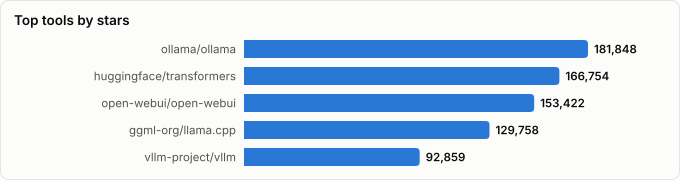
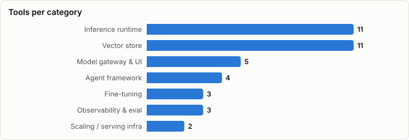

# Local vs High-Infra AI Stack — A Deployment-Tier Comparison

> Derived from **kaiser-data**'s 2,304 starred repos (snapshot `2026-10-05T13:01:39.533Z`), cross-referenced with the repo-similarity graph (2,304 nodes / 7,632 edges, 40 communities).
>
> Generated 2026-10-05 by `scripts/reports/local_vs_infra_stack.py` (regenerate any time — no API cost).

## Executive summary

- **39 stack tools** in your stars (**1,847,574★** combined), mapped to every layer of a self-hosted AI stack and tagged by deployment tier:
  - 🟢 **Local / edge** (15) — laptop, single consumer GPU, on-device, zero ops
  - 🟡 **Scales both** (16) — same tool, local *or* cluster, config-dependent
  - 🔴 **High-infra** (8) — multi-GPU / datacenter / high-QPS / k8s
- **The core split is the inference runtime.** Local tier optimizes for *one* of you on *one* box (`ollama`, `llama.cpp`, `llamafile`); high-infra optimizes for *throughput across many GPUs* (`vllm`, `sglang`, `lmdeploy`). Everything else (gateway, vector store, agent logic) is mostly the same code with a different deployment target.
- **Don't pick a runtime per tool — pick a tier, then fill each layer.** The two reference stacks below do exactly that.
- **The 🟡 'scales both' tools are the safe bets** when you'll start local and grow: `litellm` (gateway), `pgvector`/`qdrant`/`chroma` (store), `transformers`/`peft`, the agent frameworks, and `langfuse`/`phoenix` all migrate without a rewrite.

## The two reference stacks

Same job at every layer — different tier. Pick a column and go.

| Layer | 🟢 Fully-local stack | 🔴 High-infra stack |
|---|---|---|
| **Inference runtime** | `ollama/ollama` | `vllm-project/vllm` |
| **Scaling infra** | `— (single node)` | `skypilot-org/skypilot` |
| **Cost optimization** | `GGUF quant (llama.cpp)` | `vllm-project/llm-compressor` |
| **Gateway / UI** | `open-webui/open-webui` | `BerriAI/litellm` |
| **Vector store** | `lancedb / pgvector` | `milvus-io/milvus (or clustered qdrant)` |
| **Fine-tuning** | `unslothai/unsloth` | `axolotl-ai-cloud/axolotl` |
| **Agent logic** | `pydantic/pydantic-ai` | `pydantic/pydantic-ai (same)` |
| **Observability** | `promptfoo/promptfoo` | `langfuse/langfuse` |

**Reading it:** the agent logic and observability *code* is identical across columns — only the runtime, scaling, store, and trainer change as you move from one box to a fleet.

## The stack, layer by layer

### Inference runtime

_Where the model actually executes. This is the layer where the local/high-infra distinction is sharpest._

| Tool | Tier | ★ Stars | Lang | Lifecycle | What it's for |
|---|---|---|---|---|---|
| [ollama/ollama](https://github.com/ollama/ollama) | 🟢 Local | 182,220 (▲547) | Go | Classic | The zero-config local default — `ollama run`, model registry, OpenAI-compatible API. Laptop-to-server, but single-node. |
| [ggml-org/llama.cpp](https://github.com/ggml-org/llama.cpp) | 🟢 Local | 130,358 (▲882) | C++ | Classic | The CPU/edge engine under everything — GGUF quantization, runs on a Raspberry Pi to a Mac; the embeddable substrate. |
| [nomic-ai/gpt4all](https://github.com/nomic-ai/gpt4all) | 🟢 Local | 77,384 (▲1) | C++ | Abandoned | Desktop-first local LLM app + bindings; privacy-focused, runs on plain CPUs. |
| [mudler/LocalAI](https://github.com/mudler/LocalAI) | 🟢 Local | 49,394 (▲132) | Go | Classic | Self-hosted, OpenAI-drop-in engine for LLM/TTS/STT/image on commodity hardware — the all-in-one local server. |
| [mozilla-ai/llamafile](https://github.com/mozilla-ai/llamafile) | 🟢 Local | 26,169 (▲114) | C++ | Classic | One file = one runnable model. Maximum portability for shipping a local model with no install. |
| [microsoft/foundry-local](https://github.com/microsoft/foundry-local) | 🟢 Local | 2,574 (▲10) | C++ | Hot | Microsoft's on-device runtime — offline LLM + Whisper, hardware-accelerated where available. |
| [huggingface/transformers](https://github.com/huggingface/transformers) | 🟡 Both | 166,966 (▲337) | Python | Classic | The model-definition library every runtime builds on; runs a notebook locally or a training cluster — the common denominator. |
| [exo-explore/exo](https://github.com/exo-explore/exo) | 🟡 Both | 47,744 (▲107) | Python | Mature | Stitches a *cluster out of your local devices* (phones, Macs, PCs) to run big models — distributed but home-grown. |
| [vllm-project/vllm](https://github.com/vllm-project/vllm) | 🔴 Infra | 93,206 (▲545) | Python | Classic | The production serving standard — PagedAttention, continuous batching, tensor/pipeline parallelism for high QPS on GPU fleets. |
| [sgl-project/sglang](https://github.com/sgl-project/sglang) | 🔴 Infra | 36,791 (▲370) | Python | Mature | High-throughput serving with RadixAttention prefix caching — excels at structured/agentic workloads at scale. |
| [InternLM/lmdeploy](https://github.com/InternLM/lmdeploy) | 🔴 Infra | 8,103 (▲7) | Python | Classic | Toolkit for compressing + serving LLMs at scale (TurboMind engine); quantization-aware high-throughput inference. |

### Scaling / serving infra

_How you get a runtime onto many machines, cheaply. Only relevant once you outgrow a single node._

| Tool | Tier | ★ Stars | Lang | Lifecycle | What it's for |
|---|---|---|---|---|---|
| [skypilot-org/skypilot](https://github.com/skypilot-org/skypilot) | 🔴 Infra | 10,676 (▲18) | Python | Classic | Run/serve LLMs across any cloud or k8s with cost-aware scheduling & spot recovery — the multi-cloud orchestration layer. |
| [vllm-project/llm-compressor](https://github.com/vllm-project/llm-compressor) | 🔴 Infra | 3,845 (▲24) | Python | Mature | Quantize/sparsify models (GPTQ/AWQ/SmoothQuant) so they serve cheaper on vLLM — the cost-optimization step. |

### Model gateway & UI

_What sits in front of the model(s) — a chat UI for one user, or a proxy that fans out across providers for a whole org._

| Tool | Tier | ★ Stars | Lang | Lifecycle | What it's for |
|---|---|---|---|---|---|
| [open-webui/open-webui](https://github.com/open-webui/open-webui) | 🟢 Local | 153,984 (▲861) | Python | Mature | The self-hosted ChatGPT-style UI for local models (pairs with Ollama) — RAG, users, tools, fully offline. |
| [Mintplex-Labs/anything-llm](https://github.com/Mintplex-Labs/anything-llm) | 🟢 Local | 66,715 (▲266) | JavaScript | Classic | All-in-one desktop/self-host app: chat + RAG + agents over local or API models. |
| [janhq/jan](https://github.com/janhq/jan) | 🟢 Local | 44,797 (▲151) | Rust | Classic | Open-source desktop ChatGPT alternative that runs models 100% on your machine. |
| [BerriAI/litellm](https://github.com/BerriAI/litellm) | 🟡 Both | 60,147 (▲549) | Python | Classic | One OpenAI-compatible API over 100+ providers + a self-hostable proxy with keys/budgets/routing — local or enterprise gateway. |
| [Portkey-AI/gateway](https://github.com/Portkey-AI/gateway) | 🟡 Both | 13,123 (▲42) | TypeScript | Mature | Fast AI gateway with routing, fallbacks, caching, and guardrails — drop in front of any tier. |

### Vector store

_Where embeddings live for RAG. Many of these span tiers — start embedded, cluster later._

| Tool | Tier | ★ Stars | Lang | Lifecycle | What it's for |
|---|---|---|---|---|---|
| [facebookresearch/faiss](https://github.com/facebookresearch/faiss) | 🟢 Local | 41,079 (▲101) | C++ | Classic | The in-process ANN library — no server, embed it in your app; the index inside many of the DBs below. |
| [alibaba/zvec](https://github.com/alibaba/zvec) | 🟢 Local | 16,060 (▲56) | C++ | Hot | Lightweight, lightning-fast in-process vector database for embedded use. |
| [neuml/txtai](https://github.com/neuml/txtai) | 🟢 Local | 12,990 (▲12) | Python | Classic | All-in-one embeddings DB + RAG + workflows in one local package. |
| [lancedb/lancedb](https://github.com/lancedb/lancedb) | 🟢 Local | 11,601 (▲75) | Rust | Classic | Embedded, serverless vector DB (Lance columnar format) — zero-ops local RAG that still handles large on-disk sets. |
| [redis/redis](https://github.com/redis/redis) | 🟡 Both | 76,596 (▲127) | C | Classic | The in-memory store you already run, now with vector search — local cache to HA cluster. |
| [qdrant/qdrant](https://github.com/qdrant/qdrant) | 🟡 Both | 34,934 (▲125) | Rust | Classic | Rust vector DB — single-binary local, but clusters with sharding/replication for billions of vectors. |
| [chroma-core/chroma](https://github.com/chroma-core/chroma) | 🟡 Both | 29,441 (▲71) | Rust | Classic | AI-native store that runs embedded for prototyping and client/server for production — the easy on-ramp. |
| [pgvector/pgvector](https://github.com/pgvector/pgvector) | 🟡 Both | 23,246 (▲91) | C | Classic | Vector search inside the Postgres you already run — scales from a laptop to a managed cluster with no new infra. |
| [marqo-ai/marqo](https://github.com/marqo-ai/marqo) | 🟡 Both | 5,032 (▲1) | Python | Mature | End-to-end vector search that bundles embedding inference; deploys local or distributed. |
| [milvus-io/milvus](https://github.com/milvus-io/milvus) | 🔴 Infra | 46,317 (▲64) | Go | Classic | The billion-scale, distributed OSS vector DB — heavy ops footprint, built for datacenter scale. |
| [weaviate/weaviate](https://github.com/weaviate/weaviate) | 🔴 Infra | 16,863 (▲18) | Go | Classic | Cloud-native vector DB with hybrid search & modules — designed for clustered, multi-tenant deployments. |

### Fine-tuning

_Adapting a model. LoRA on one GPU vs. multi-node full fine-tunes._

| Tool | Tier | ★ Stars | Lang | Lifecycle | What it's for |
|---|---|---|---|---|---|
| [unslothai/unsloth](https://github.com/unslothai/unsloth) | 🟢 Local | 77,213 (▲470) | Python | Mature | 2× faster, lower-VRAM fine-tuning — train a LoRA on a single consumer GPU (even Colab). |
| [huggingface/peft](https://github.com/huggingface/peft) | 🟡 Both | 21,751 (▲25) | Python | Classic | Parameter-efficient fine-tuning (LoRA/QLoRA/adapters) — one consumer GPU or a multi-node run. |
| [axolotl-ai-cloud/axolotl](https://github.com/axolotl-ai-cloud/axolotl) | 🔴 Infra | 12,520 (▲20) | Python | Classic | Config-driven fine-tuning that scales to multi-GPU/multi-node (DeepSpeed/FSDP) — the cluster-grade trainer. |

### Agent framework

_The orchestration logic — deliberately tier-agnostic; it targets whatever endpoint you give it._

| Tool | Tier | ★ Stars | Lang | Lifecycle | What it's for |
|---|---|---|---|---|---|
| [crewAIInc/crewAI](https://github.com/crewAIInc/crewAI) | 🟡 Both | 59,356 (▲351) | Python | Mature | Role-based multi-agent framework — runs against any model backend, local or hosted. |
| [run-llama/llama_index](https://github.com/run-llama/llama_index) | 🟡 Both | 52,410 (▲98) | Python | Classic | Data/agent framework — point it at a local Ollama or a cloud endpoint; tier-agnostic. |
| [langchain-ai/langgraph](https://github.com/langchain-ai/langgraph) | 🟡 Both | 42,730 (▲476) | Python | Classic | Graph/stateful agent runtime — the orchestration logic is independent of where the model runs. |
| [pydantic/pydantic-ai](https://github.com/pydantic/pydantic-ai) | 🟡 Both | 20,413 (▲248) | Python | Mature | Type-safe agent framework; model-agnostic, so the same code targets either tier. |

### Observability & eval

_Tracing, metrics, and evals. Most self-host locally and also offer managed cloud._

| Tool | Tier | ★ Stars | Lang | Lifecycle | What it's for |
|---|---|---|---|---|---|
| [promptfoo/promptfoo](https://github.com/promptfoo/promptfoo) | 🟢 Local | 25,717 (▲278) | TypeScript | Classic | CLI-first prompt/model eval that runs entirely on your machine in CI — no backend needed. |
| [langfuse/langfuse](https://github.com/langfuse/langfuse) | 🟡 Both | 35,396 (▲363) | TypeScript | Classic | Self-hostable LLM tracing/eval/metrics — runs in Docker locally or as managed cloud. |
| [Arize-ai/phoenix](https://github.com/Arize-ai/phoenix) | 🟡 Both | 11,713 (▲104) | Python | Classic | Open-source LLM observability you can run locally; OTel-native tracing + evals. |

## Which tier should you use?

| Your situation | Tier | Runtime to start with |
|---|---|---|
| Laptop / Mac, privacy, one user | 🟢 Local | `ollama` (+ `open-webui`) |
| Single consumer GPU (e.g. 1×4090) | 🟢 Local | `ollama` or `llama.cpp` w/ GGUF |
| CPU-only / edge / air-gapped | 🟢 Local | `llama.cpp` / `llamafile` / `LocalAI` |
| Prototype now, scale later | 🟡 Both | `vllm` behind `litellm`; `pgvector` store |
| Many users, steady traffic | 🔴 Infra | `vllm` (continuous batching) |
| Agentic / structured-output at scale | 🔴 Infra | `sglang` (RadixAttention) |
| Multi-cloud / spot-GPU cost control | 🔴 Infra | `vllm` orchestrated by `skypilot` |
| Pool several home devices | 🟡 Both | `exo-explore/exo` |

## Master comparison (operational metrics)

Sorted by tier then stars. `Health`/`Lifecycle` are the dataset's computed metrics; `Activity` is derived from days-since-push + 90-day commits.

| Tool | Layer | Tier | Lang | License | ★ Stars | Lifecycle | Health | Activity | Last push | Contrib(90d) |
|---|---|---|---|---|---|---|---|---|---|---|
| [ollama](https://github.com/ollama/ollama) | Inference runtime | Local | Go | MIT | 182,220 (▲547) | Classic | 83 | very active | 1d ago | 8 |
| [open-webui](https://github.com/open-webui/open-webui) | Model gateway & UI | Local | Python | NOASSERTION | 153,984 (▲861) | Mature | 85 | very active | 0d ago | 6 |
| [llama.cpp](https://github.com/ggml-org/llama.cpp) | Inference runtime | Local | C++ | MIT | 130,358 (▲882) | Classic | 99 | very active | 0d ago | 47 |
| [gpt4all](https://github.com/nomic-ai/gpt4all) | Inference runtime | Local | C++ | MIT | 77,384 (▲1) | Abandoned | 7 | stale | 1.4y ago | 0 |
| [unsloth](https://github.com/unslothai/unsloth) | Fine-tuning | Local | Python | Apache-2.0 | 77,213 (▲470) | Mature | 98 | very active | 0d ago | 53 |
| [anything-llm](https://github.com/Mintplex-Labs/anything-llm) | Model gateway & UI | Local | JavaScript | MIT | 66,715 (▲266) | Classic | 84 | very active | 1d ago | 22 |
| [LocalAI](https://github.com/mudler/LocalAI) | Inference runtime | Local | Go | MIT | 49,394 (▲132) | Classic | 79 | very active | 0d ago | 9 |
| [jan](https://github.com/janhq/jan) | Model gateway & UI | Local | Rust | NOASSERTION | 44,797 (▲151) | Classic | 79 | very active | 0d ago | 7 |
| [faiss](https://github.com/facebookresearch/faiss) | Vector store | Local | C++ | MIT | 41,079 (▲101) | Classic | 99 | very active | 2d ago | 46 |
| [llamafile](https://github.com/mozilla-ai/llamafile) | Inference runtime | Local | C++ | NOASSERTION | 26,169 (▲114) | Classic | 67 | very active | 4d ago | 7 |
| [promptfoo](https://github.com/promptfoo/promptfoo) | Observability & eval | Local | TypeScript | MIT | 25,717 (▲278) | Classic | 84 | very active | 0d ago | 12 |
| [zvec](https://github.com/alibaba/zvec) | Vector store | Local | C++ | Apache-2.0 | 16,060 (▲56) | Hot | 93 | very active | 6d ago | 16 |
| [txtai](https://github.com/neuml/txtai) | Vector store | Local | Python | Apache-2.0 | 12,990 (▲12) | Classic | 90 | very active | 0d ago | 24 |
| [lancedb](https://github.com/lancedb/lancedb) | Vector store | Local | Rust | Apache-2.0 | 11,601 (▲75) | Classic | 92 | very active | 0d ago | 30 |
| [foundry-local](https://github.com/microsoft/foundry-local) | Inference runtime | Local | C++ | NOASSERTION | 2,574 (▲10) | Hot | 83 | very active | 0d ago | 19 |
| [transformers](https://github.com/huggingface/transformers) | Inference runtime | Both | Python | Apache-2.0 | 166,966 (▲337) | Classic | 100 | very active | 0d ago | 50 |
| [redis](https://github.com/redis/redis) | Vector store | Both | C | NOASSERTION | 76,596 (▲127) | Classic | 96 | very active | 5d ago | 44 |
| [litellm](https://github.com/BerriAI/litellm) | Model gateway & UI | Both | Python | NOASSERTION | 60,147 (▲549) | Classic | 79 | very active | 0d ago | 12 |
| [crewAI](https://github.com/crewAIInc/crewAI) | Agent framework | Both | Python | MIT | 59,356 (▲351) | Mature | 89 | very active | 0d ago | 38 |
| [llama_index](https://github.com/run-llama/llama_index) | Agent framework | Both | Python | MIT | 52,410 (▲98) | Classic | 98 | very active | 4d ago | 56 |
| [exo](https://github.com/exo-explore/exo) | Inference runtime | Both | Python | Apache-2.0 | 47,744 (▲107) | Mature | 59 | active | 1d ago | 1 |
| [langgraph](https://github.com/langchain-ai/langgraph) | Agent framework | Both | Python | MIT | 42,730 (▲476) | Classic | 76 | very active | 0d ago | 14 |
| [langfuse](https://github.com/langfuse/langfuse) | Observability & eval | Both | TypeScript | NOASSERTION | 35,396 (▲363) | Classic | 94 | very active | 0d ago | 21 |
| [qdrant](https://github.com/qdrant/qdrant) | Vector store | Both | Rust | Apache-2.0 | 34,934 (▲125) | Classic | 88 | very active | 0d ago | 17 |
| [chroma](https://github.com/chroma-core/chroma) | Vector store | Both | Rust | Apache-2.0 | 29,441 (▲71) | Classic | 83 | very active | 1d ago | 9 |
| [pgvector](https://github.com/pgvector/pgvector) | Vector store | Both | C | NOASSERTION | 23,246 (▲91) | Classic | 64 | very active | 4d ago | 3 |
| [peft](https://github.com/huggingface/peft) | Fine-tuning | Both | Python | Apache-2.0 | 21,751 (▲25) | Classic | 99 | very active | 3d ago | 38 |
| [pydantic-ai](https://github.com/pydantic/pydantic-ai) | Agent framework | Both | Python | MIT | 20,413 (▲248) | Mature | 77 | very active | 0d ago | 6 |
| [gateway](https://github.com/Portkey-AI/gateway) | Model gateway & UI | Both | TypeScript | MIT | 13,123 (▲42) | Mature | 42 | slowing | 4mo ago | 0 |
| [phoenix](https://github.com/Arize-ai/phoenix) | Observability & eval | Both | Python | NOASSERTION | 11,713 (▲104) | Classic | 83 | very active | 1d ago | 21 |
| [marqo](https://github.com/marqo-ai/marqo) | Vector store | Both | Python | Apache-2.0 | 5,032 (▲1) | Mature | 46 | active | 1mo ago | 0 |
| [vllm](https://github.com/vllm-project/vllm) | Inference runtime | Infra | Python | Apache-2.0 | 93,206 (▲545) | Classic | 99 | very active | 0d ago | 79 |
| [milvus](https://github.com/milvus-io/milvus) | Vector store | Infra | Go | Apache-2.0 | 46,317 (▲64) | Classic | 99 | very active | 0d ago | 36 |
| [sglang](https://github.com/sgl-project/sglang) | Inference runtime | Infra | Python | Apache-2.0 | 36,791 (▲370) | Mature | 99 | very active | 0d ago | 46 |
| [weaviate](https://github.com/weaviate/weaviate) | Vector store | Infra | Go | NOASSERTION | 16,863 (▲18) | Classic | 83 | very active | 0d ago | 10 |
| [axolotl](https://github.com/axolotl-ai-cloud/axolotl) | Fine-tuning | Infra | Python | Apache-2.0 | 12,520 (▲20) | Classic | 79 | very active | 0d ago | 21 |
| [skypilot](https://github.com/skypilot-org/skypilot) | Scaling / serving infra | Infra | Python | Apache-2.0 | 10,676 (▲18) | Classic | 95 | very active | 0d ago | 17 |
| [lmdeploy](https://github.com/InternLM/lmdeploy) | Inference runtime | Infra | Python | Apache-2.0 | 8,103 (▲7) | Classic | 92 | very active | 7d ago | 25 |
| [llm-compressor](https://github.com/vllm-project/llm-compressor) | Scaling / serving infra | Infra | Python | Apache-2.0 | 3,845 (▲24) | Mature | 84 | very active | 2d ago | 30 |

## Graph analysis — how the stack hangs together

**Community clustering.** These 39 tools span **12 of the graph's 40 communities** — the stack cuts across the inference, RAG/vector, and agent neighborhoods rather than forming one cluster.

- **Community 18** (9): `ollama/ollama`, `nomic-ai/gpt4all`, `vllm-project/vllm`, `sgl-project/sglang`, `InternLM/lmdeploy`, `huggingface/transformers`, `vllm-project/llm-compressor`, `huggingface/peft`, `axolotl-ai-cloud/axolotl`
- **Community 0** (6): `open-webui/open-webui`, `Mintplex-Labs/anything-llm`, `chroma-core/chroma`, `neuml/txtai`, `langchain-ai/langgraph`, `crewAIInc/crewAI`
- **Community 24** (6): `lancedb/lancedb`, `pgvector/pgvector`, `alibaba/zvec`, `qdrant/qdrant`, `weaviate/weaviate`, `milvus-io/milvus`
- **Community 27** (5): `ggml-org/llama.cpp`, `janhq/jan`, `redis/redis`, `marqo-ai/marqo`, `unslothai/unsloth`
- **Community 17** (5): `BerriAI/litellm`, `Portkey-AI/gateway`, `langfuse/langfuse`, `Arize-ai/phoenix`, `promptfoo/promptfoo`
- **Community 14** (2): `mozilla-ai/llamafile`, `facebookresearch/faiss`

**Centrality (PageRank in the full 2,304-repo graph)** — the 'hub' tools your other stars cluster around:

- `langchain-ai/langgraph` — PageRank 0.0013 (🟡 Both)
- `qdrant/qdrant` — PageRank 0.0009 (🟡 Both)
- `axolotl-ai-cloud/axolotl` — PageRank 0.0008 (🔴 Infra)
- `crewAIInc/crewAI` — PageRank 0.0008 (🟡 Both)
- `neuml/txtai` — PageRank 0.0007 (🟢 Local)
- `huggingface/peft` — PageRank 0.0007 (🟡 Both)
- `huggingface/transformers` — PageRank 0.0007 (🟡 Both)
- `chroma-core/chroma` — PageRank 0.0007 (🟡 Both)
- `vllm-project/vllm` — PageRank 0.0006 (🔴 Infra)
- `run-llama/llama_index` — PageRank 0.0006 (🟡 Both)

**Direct links between stack tools** (top similarity edges where both endpoints are in this report):

- `huggingface/peft` ⇄ `huggingface/transformers` (w=0.761) — topics: llm, python, pytorch; authors: qgallouedec, albertvillanova, jiqing-feng
- `vllm-project/llm-compressor` ⇄ `vllm-project/vllm` (w=0.550)
- `weaviate/weaviate` ⇄ `qdrant/qdrant` (w=0.429) — topics: search-engine, vector-search, vector-search-engine, vector-database
- `crewAIInc/crewAI` ⇄ `chroma-core/chroma` (w=0.418) — topics: agents, ai, ai-agents; authors: Ghraven
- `vllm-project/vllm` ⇄ `sgl-project/sglang` (w=0.407) — topics: llm, transformer, inference, llama
- `lancedb/lancedb` ⇄ `weaviate/weaviate` (w=0.400) — topics: approximate-nearest-neighbor-search, image-search, nearest-neighbor-search, recommender-system
- `InternLM/lmdeploy` ⇄ `axolotl-ai-cloud/axolotl` (w=0.377) — topics: llm; authors: simpleqt, Anai-Guo, li-lizhe
- `lancedb/lancedb` ⇄ `qdrant/qdrant` (w=0.366) — topics: image-search, nearest-neighbor-search, recommender-system, search-engine; authors: dependabot[bot]
- `huggingface/peft` ⇄ `axolotl-ai-cloud/axolotl` (w=0.357) — topics: llm, fine-tuning; authors: li-lizhe, simpleqt, dependabot[bot]
- `BerriAI/litellm` ⇄ `Portkey-AI/gateway` (w=0.348) — topics: langchain, llm, llmops, openai
- `promptfoo/promptfoo` ⇄ `langfuse/langfuse` (w=0.269) — topics: llm, prompt-engineering, llmops, evaluation; authors: dependabot[bot]
- `sgl-project/sglang` ⇄ `ollama/ollama` (w=0.269) — topics: llama, llm, deepseek, gpt-oss
- `unslothai/unsloth` ⇄ `open-webui/open-webui` (w=0.257) — topics: llms, llm, openai, self-hosted
- `lancedb/lancedb` ⇄ `alibaba/zvec` (w=0.255) — topics: search-engine, semantic-search, similarity-search, vector-database; authors: dependabot[bot]
- `lancedb/lancedb` ⇄ `pgvector/pgvector` (w=0.250) — topics: approximate-nearest-neighbor-search, nearest-neighbor-search
- …and 4 more.

## Maintenance & risk signal

Bus factor = commit concentration (1 = single-maintainer risk). For infra you'll depend on, weight health + activity heavily.

| Tool | Tier | Health | Lifecycle | Activity | Bus factor | Top-author share | Releases |
|---|---|---|---|---|---|---|---|
| transformers | Both | 100 | Classic | very active | 9 | 13% | 274 |
| llama.cpp | Local | 99 | Classic | very active | 8 | 10% | 7525 |
| vllm | Infra | 99 | Classic | very active | 29 | 5% | 107 |
| sglang | Infra | 99 | Mature | very active | 9 | 8% | 62 |
| faiss | Local | 99 | Classic | very active | 6 | 22% | 29 |
| milvus | Infra | 99 | Classic | very active | 8 | 10% | 176 |
| peft | Both | 99 | Classic | very active | 5 | 19% | 36 |
| unsloth | Local | 98 | Mature | very active | 10 | 17% | 72 |
| llama_index | Both | 98 | Classic | very active | 11 | 14% | 497 |
| redis | Both | 96 | Classic | very active | 8 | 17% | 155 |
| skypilot | Infra | 95 | Classic | very active | 4 | 20% | 44 |
| langfuse | Both | 94 | Classic | very active | 4 | 16% | 705 |
| zvec | Local | 93 | Hot | very active | 4 | 17% | 11 |
| lmdeploy | Infra | 92 | Classic | very active | 4 | 24% | 71 |
| lancedb | Local | 92 | Classic | very active | 4 | 18% | 516 |
| txtai | Local | 90 | Classic | very active | 3 | 36% | 67 |
| crewAI | Both | 89 | Mature | very active | 3 | 23% | 237 |
| qdrant | Both | 88 | Classic | very active | 3 | 30% | 117 |
| open-webui | Local | 85 | Mature | very active | 2 | 47% | 171 |
| llm-compressor | Infra | 84 | Mature | very active | 2 | 40% | 33 |
| anything-llm | Local | 84 | Classic | very active | 2 | 38% | 37 |
| promptfoo | Local | 84 | Classic | very active | 2 | 40% | 426 |
| ollama | Local | 83 | Classic | very active | 2 | 28% | 258 |
| foundry-local | Local | 83 | Hot | very active | 2 | 31% | 24 |
| chroma | Both | 83 | Classic | very active | 2 | 36% | 137 |
| weaviate | Infra | 83 | Classic | very active | 2 | 43% | 593 |
| phoenix | Both | 83 | Classic | very active | 2 | 41% | 855 |
| LocalAI | Local | 79 | Classic | very active | 1 | 55% | 138 |
| litellm | Both | 79 | Classic | very active | 1 | 66% | 1491 |
| jan | Local | 79 | Classic | very active | 1 | 72% | 104 |
| axolotl | Infra | 79 | Classic | very active | 1 | 50% | 34 |
| pydantic-ai | Both | 77 | Mature | very active | 1 | 52% | 339 |
| langgraph | Both | 76 | Classic | very active | 1 | 61% | 565 |
| llamafile | Local | 67 | Classic | very active | 1 | 59% | 43 |
| pgvector | Both | 64 | Classic | very active | 1 | 98% | 0 |
| exo | Both | 59 | Mature | active | 1 | 100% | 16 |
| marqo | Both | 46 | Mature | active | 0 | 0% | 113 |
| gateway | Both | 42 | Mature | slowing | 0 | 0% | 81 |
| gpt4all | Local | 7 | Abandoned | stale | 0 | 0% | 38 |

## Adjacent (covered elsewhere)

- **ggml-org/whisper.cpp** (54,144★) — speech runtime — covered in the *voice-agents* report
- **comet-ml/opik** (22,385★) — eval/observability — see the *LLM-evaluation* report
- **confident-ai/deepeval** (18,636★) — eval framework — see the *LLM-evaluation* report
- **langchain-ai/langchain** (147,462★) — broad agent toolkit — see the *agent-orchestration* report
- **microsoft/autogen** (61,256★) — multi-agent framework — see the *agent-orchestration* report

## Methodology & caveats

- **Source**: `data/classified.json` + `public/data/graph.json`. No external calls; fully reproducible.
- **Tiering** is an editorial judgment about each tool's *sweet spot*, not a hard limit — many 🟢 tools can be pushed onto servers and some 🔴 tools run (slowly) on a laptop. The tag reflects what the project is *optimized and typically used* for.
- **Selection**: keyword scan (inference / serving / vllm / ollama / vector db / gateway / fine-tune / quantize) + manual curation into stack layers. Speech runtimes, pure eval frameworks, and broad agent toolkits were routed to adjacent reports.
- **Metrics** (health, lifecycle, bus_factor) are precomputed at snapshot time and may lag GitHub's current state.
- Re-run after a fresh `classified.json` to refresh stars/activity.

Tools covered: 39 · Tiers: 15 local / 16 both / 8 infra · Snapshot: 2026-10-05T13:01:39.533Z
