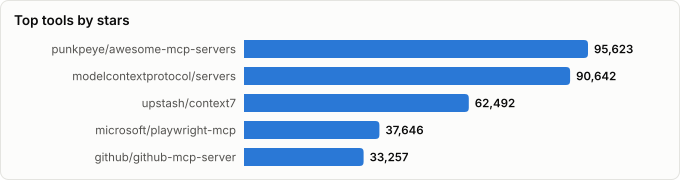
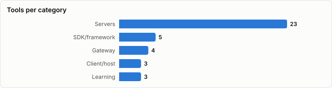

# MCP (Model Context Protocol) Tooling — Landscape Report

> Derived from **kaiser-data**'s 2,304 starred repos (snapshot `2026-10-05T13:01:39.533Z`), cross-referenced with the repo-similarity graph (2,304 nodes / 7,632 edges, 40 communities).
>
> Generated 2026-10-05 by `scripts/reports/mcp_tooling.py` (regenerate any time — no API cost).

> **What is MCP?** The Model Context Protocol is an open standard (Anthropic, late 2024) that lets LLM apps talk to external tools/data through a uniform interface — the 'USB-C port' for AI. **Servers** expose capabilities; **clients/hosts** (Claude Desktop, Cursor, editors) consume them; **gateways** govern them at scale.

## Executive summary

- **38 MCP projects** in your stars (**578,174★** combined) — spanning the whole stack: SDKs, clients, gateways, and **23 domain servers**.
- The architecture has three roles — and your stars cover all of them:
  - **Build** (SDKs/frameworks): `servers`, `fastmcp`, `typescript-sdk`, `fastapi_mcp`, `mcp-use`
  - **Consume** (clients/hosts): `inspector`, `witsy`, `mcphub.nvim`
  - **Govern** (gateways/control planes): `mcp-toolbox`, `open-connector`, `klavis`, `gate22`
- **Official vendor servers dominate the top** — GitHub, Microsoft (Playwright), Google (mcp-toolbox), Neo4j, Sentry, SonarSource all ship first-party MCP servers, a strong signal the protocol has crossed into mainstream adoption.
- TypeScript is the lingua franca of MCP servers; Python leads the SDK/framework layer (fastmcp, fastapi_mcp).

## The MCP stack at a glance

| Role | What it does | Tools in your stars |
|---|---|---|
| **SDK / framework** | Build servers/clients | `fastmcp`, `mcp-use`, `fastapi_mcp` |
| **Client / host** | Apps that consume servers | `mcphub.nvim`, `witsy` |
| **Gateway / control plane** | Route, secure & govern servers | `klavis`, `gate22`, `mcp-toolbox` |
| **Servers** | Expose a capability to agents | 23 across browser, DB, dev-tools, code-intel, docs, game engines |
| **Learning** | Lists & curricula | `awesome-mcp-servers` (×2), `mcp-for-beginners` |

## Master comparison

Sorted by stars. `Health`/`Lifecycle` are the dataset's computed metrics; `Activity` is derived from days-since-push + 90-day commits.

| Project | Category | Lang | License | ★ Stars | Lifecycle | Health | Activity | Last push | Age | Contrib(90d) |
|---|---|---|---|---|---|---|---|---|---|---|
| [punkpeye/awesome-mcp-servers](https://github.com/punkpeye/awesome-mcp-servers) | Learning / reference | — | MIT | 95,829 (▲325) | Hot | 59 | very active | 8d ago | 1.8y | 31 |
| [modelcontextprotocol/servers](https://github.com/modelcontextprotocol/servers) | SDK / framework | TypeScript | NOASSERTION | 91,012 (▲428) | Hot | 94 | very active | 0d ago | 1.9y | 31 |
| [upstash/context7](https://github.com/upstash/context7) | Server · code intelligence | TypeScript | MIT | 62,701 (▲287) | Hot | 79 | very active | 0d ago | 1.5y | 8 |
| [microsoft/playwright-mcp](https://github.com/microsoft/playwright-mcp) | Server · browser/web | TypeScript | Apache-2.0 | 37,827 (▲271) | Hot | 73 | very active | 7d ago | 1.5y | 8 |
| [github/github-mcp-server](https://github.com/github/github-mcp-server) | Server · dev-tooling | Go | MIT | 33,376 (▲189) | Hot | 78 | very active | 0d ago | 1.6y | 23 |
| [oraios/serena](https://github.com/oraios/serena) | Server · code intelligence | Python | NOASSERTION | 30,000 (▲212) | Hot | 79 | very active | 0d ago | 1.5y | 18 |
| [PrefectHQ/fastmcp](https://github.com/PrefectHQ/fastmcp) | SDK / framework | Python | Apache-2.0 | 27,981 (▲86) | Hot | 83 | very active | 0d ago | 1.8y | 31 |
| [mksglu/context-mode](https://github.com/mksglu/context-mode) | Server · code intelligence | TypeScript | NOASSERTION | 25,441 (▲1,390) | Rising | 77 | very active | 0d ago | 7mo | 1 |
| [czlonkowski/n8n-mcp](https://github.com/czlonkowski/n8n-mcp) | Server · dev-tooling | TypeScript | MIT | 23,035 (▲42) | Mature | 79 | very active | 0d ago | 1.3y | 2 |
| [microsoft/mcp-for-beginners](https://github.com/microsoft/mcp-for-beginners) | Learning / reference | Jupyter Notebook | MIT | 17,396 (▲98) | Hot | 65 | very active | 4d ago | 1.5y | 3 |
| [googleapis/mcp-toolbox](https://github.com/googleapis/mcp-toolbox) | Gateway / control plane | Go | Apache-2.0 | 16,585 (▲99) | Mature | 98 | very active | 0d ago | 2.3y | 29 |
| [modelcontextprotocol/typescript-sdk](https://github.com/modelcontextprotocol/typescript-sdk) | SDK / framework | TypeScript | NOASSERTION | 13,519 (▲67) | Mature | 80 | very active | 0d ago | 2.0y | 29 |
| [hangwin/mcp-chrome](https://github.com/hangwin/mcp-chrome) | Server · browser/web | TypeScript | MIT | 12,464 (▲10) | Declining | 12 | stale | 9mo ago | 1.3y | 0 |
| [tadata-org/fastapi_mcp](https://github.com/tadata-org/fastapi_mcp) | SDK / framework | Python | MIT | 12,016 (▲9) | Declining | 8 | stale | 10mo ago | 1.6y | 0 |
| [modelcontextprotocol/inspector](https://github.com/modelcontextprotocol/inspector) | Client / host | TypeScript | NOASSERTION | 11,021 (▲67) | Mature | 79 | very active | 0d ago | 2.0y | 2 |
| [mcp-use/mcp-use](https://github.com/mcp-use/mcp-use) | SDK / framework | TypeScript | MIT | 10,719 (▲44) | Hot | 89 | very active | 0d ago | 1.5y | 17 |
| [mobile-next/mobile-mcp](https://github.com/mobile-next/mobile-mcp) | Server · game/platform | TypeScript | Apache-2.0 | 8,670 (▲1,777) | Hot | 77 | very active | 1d ago | 1.5y | 7 |
| [Coding-Solo/godot-mcp](https://github.com/Coding-Solo/godot-mcp) | Server · game/platform | JavaScript | MIT | 5,946 (▲123) | Declining | 20 | slowing | 5mo ago | 1.6y | 0 |
| [oomol-lab/open-connector](https://github.com/oomol-lab/open-connector) | Gateway / control plane | TypeScript | Apache-2.0 | 5,941 (▲43) | Hot | 95 | very active | 0d ago | 3mo | 27 |
| [Klavis-AI/klavis](https://github.com/Klavis-AI/klavis) | Gateway / control plane | Python | Apache-2.0 | 5,805 (▼7) | Declining | 39 | slowing | 4mo ago | 1.5y | 0 |
| [wong2/awesome-mcp-servers](https://github.com/wong2/awesome-mcp-servers) | Learning / reference | — | MIT | 4,346 (▲22) | Declining | 34 | slowing | 2mo ago | 1.9y | 1 |
| [yvgude/lean-ctx](https://github.com/yvgude/lean-ctx) | Server · code intelligence | Rust | Apache-2.0 | 3,862 (▲28) | Rising | 80 | very active | 0d ago | 6mo | 1 |
| [bytebase/dbhub](https://github.com/bytebase/dbhub) | Server · database/data | TypeScript | MIT | 3,600 (▲35) | Hot | 78 | very active | 3d ago | 1.6y | 12 |
| [blazickjp/arxiv-mcp-server](https://github.com/blazickjp/arxiv-mcp-server) | Server · docs/research | Python | Apache-2.0 | 3,190 (▲17) | Hot | 78 | very active | 0d ago | 1.8y | 5 |
| [hi-godot/godot-ai](https://github.com/hi-godot/godot-ai) | Server · game/platform | GDScript | MIT | 2,793 (▲198) | Hot | 80 | very active | 1d ago | 5mo | 7 |
| [brightdata/brightdata-mcp](https://github.com/brightdata/brightdata-mcp) | Server · browser/web | JavaScript | MIT | 2,660 (▲4) | Mature | 70 | active | 18d ago | 1.5y | 4 |
| [Kochava-Studios/witsy](https://github.com/Kochava-Studios/witsy) | Client / host | TypeScript | AGPL-3.0 | 2,036 (▲6) | Mature | 40 | slowing | 5mo ago | 2.4y | 0 |
| [CoderGamester/mcp-unity](https://github.com/CoderGamester/mcp-unity) | Server · game/platform | C# | MIT | 1,919 (▲9) | Mature | 57 | active | 1mo ago | 1.6y | 4 |
| [ravitemer/mcphub.nvim](https://github.com/ravitemer/mcphub.nvim) | Client / host | Lua | MIT | 1,784 | Declining | 17 | stale | 8mo ago | 1.6y | 0 |
| [shaneholloman/mcp-knowledge-graph](https://github.com/shaneholloman/mcp-knowledge-graph) | Server · code intelligence | JavaScript | MIT | 890 | Declining | 40 | slowing | 4mo ago | 1.8y | 0 |
| [SonarSource/sonarqube-mcp-server](https://github.com/SonarSource/sonarqube-mcp-server) | Server · dev-tooling | Java | NOASSERTION | 657 (▲3) | Hot | 83 | very active | 0d ago | 1.4y | 17 |
| [hustcc/mcp-mermaid](https://github.com/hustcc/mcp-mermaid) | Server · docs/research | TypeScript | MIT | 641 (▲3) | Declining | 31 | slowing | 4mo ago | 1.4y | 0 |
| [youichi-uda/godot-mcp-pro](https://github.com/youichi-uda/godot-mcp-pro) | Server · game/platform | GDScript | NOASSERTION | 617 (▲10) | Rising | 66 | active | 11d ago | 7mo | 3 |
| [reading-plus-ai/mcp-server-data-exploration](https://github.com/reading-plus-ai/mcp-server-data-exploration) | Server · database/data | Python | MIT | 545 (▲1) | Abandoned | 1 | stale | 1.5y ago | 1.8y | 0 |
| [tugcantopaloglu/godot-mcp](https://github.com/tugcantopaloglu/godot-mcp) | Server · game/platform | JavaScript | MIT | 475 (▲10) | Rising | 48 | slowing | 2mo ago | 7mo | 2 |
| [VectifyAI/pageindex-mcp](https://github.com/VectifyAI/pageindex-mcp) | Server · docs/research | TypeScript | MIT | 399 (▲8) | Mature | 59 | slowing | 2mo ago | 1.1y | 2 |
| [neo4j/mcp](https://github.com/neo4j/mcp) | Server · database/data | Go | NOASSERTION | 296 | Hot | 78 | very active | 0d ago | 1.1y | 5 |
| [aipotheosis-labs/gate22](https://github.com/aipotheosis-labs/gate22) | Gateway / control plane | TypeScript | Apache-2.0 | 180 (▲2) | Declining | 19 | stale | 9mo ago | 1.1y | 0 |

## By category

### SDK / framework

_The layer you reach for to *author* an MCP server or client._

- **[modelcontextprotocol/servers](https://github.com/modelcontextprotocol/servers)** · 91,012★ · TypeScript · Hot  
  Official reference-server monorepo — canonical examples for filesystem, git, fetch, etc.  
  topics: —
- **[PrefectHQ/fastmcp](https://github.com/PrefectHQ/fastmcp)** · 27,981★ · Python · Hot  
  The fast, Pythonic way to build MCP servers & clients; the de-facto Python framework.  
  topics: model-context-protocol, fastmcp, mcp, agents, llms, mcp-clients, mcp-servers, mcp-tools
- **[modelcontextprotocol/typescript-sdk](https://github.com/modelcontextprotocol/typescript-sdk)** · 13,519★ · TypeScript · Mature  
  Official TypeScript SDK for building MCP servers & clients.  
  topics: typescript, mcp, mcp-server, mcp-client
- **[tadata-org/fastapi_mcp](https://github.com/tadata-org/fastapi_mcp)** · 12,016★ · Python · Declining  
  Expose existing FastAPI endpoints as MCP tools, with auth — zero-rewrite server creation.  
  topics: ai, claude, cursor, fastapi, llm, mcp, mcp-server, mcp-servers
- **[mcp-use/mcp-use](https://github.com/mcp-use/mcp-use)** · 10,719★ · TypeScript · Hot  
  Fullstack MCP framework — build MCP apps for ChatGPT/Claude and MCP servers for agents.  
  topics: mcp, model-context-protocol, apps-sdk, mcp-apps, mcp-inspector, mcp-servers, mcp-ui, agentic-framework

### Client / host

_Apps/editors that connect to servers and surface their tools to the user._

- **[modelcontextprotocol/inspector](https://github.com/modelcontextprotocol/inspector)** · 11,021★ · TypeScript · Mature  
  Official visual debugger/inspector for testing MCP servers.  
  topics: tool, debug, mcp, cli, tui, web
- **[Kochava-Studios/witsy](https://github.com/Kochava-Studios/witsy)** · 2,036★ · TypeScript · Mature  
  Desktop AI assistant doubling as a universal MCP client.  
  topics: anthropic, genai, groq, ollama, ollama-gui, openai, electron-app, electronjs
- **[ravitemer/mcphub.nvim](https://github.com/ravitemer/mcphub.nvim)** · 1,784★ · Lua · Declining  
  MCP client for Neovim — integrates MCP servers into the editing workflow.  
  topics: avante, chatgpt, chatplugin, claude-ai, llm, mcp, mcp-client, mcp-hub

### Gateway / control plane

_Front many servers behind one endpoint; add auth, routing, and policy — the enterprise-readiness layer._

- **[googleapis/mcp-toolbox](https://github.com/googleapis/mcp-toolbox)** · 16,585★ · Go · Mature  
  Google's open MCP server for databases — one gateway fronting many DBs.  
  topics: genai, mcp, agent, ai, database, llm, server, agents
- **[oomol-lab/open-connector](https://github.com/oomol-lab/open-connector)** · 5,941★ · TypeScript · Hot  
  Open-source auth gateway connecting 1000+ SaaS providers to agents via MCP, SDK & HTTP.  
  topics: agent-tools, ai-agents, api-gateway, automation, cli, cloudflare-workers, connectors, integration-platform
- **[Klavis-AI/klavis](https://github.com/Klavis-AI/klavis)** · 5,805★ · Python · Declining  
  MCP integration platform so agents use tools reliably at scale.  
  topics: ai, discord, llm, mcp, mcp-client, mcp-server, open-source, agents
- **[aipotheosis-labs/gate22](https://github.com/aipotheosis-labs/gate22)** · 180★ · TypeScript · Declining  
  Open-source MCP gateway & control plane to govern which tools agents may use.  
  topics: agents, ai, ai-agents, control-plane, gateway, guardrails, llm, mcp

### Server · browser/web

_Give agents a browser or the open web._

- **[microsoft/playwright-mcp](https://github.com/microsoft/playwright-mcp)** · 37,827★ · TypeScript · Hot  
  Microsoft's Playwright MCP server — drive a real browser from an agent.  
  topics: mcp, playwright
- **[hangwin/mcp-chrome](https://github.com/hangwin/mcp-chrome)** · 12,464★ · TypeScript · Declining  
  Chrome-extension-based MCP server exposing the user's actual browser.  
  topics: —
- **[brightdata/brightdata-mcp](https://github.com/brightdata/brightdata-mcp)** · 2,660★ · JavaScript · Mature  
  All-in-one MCP server for public web data access / scraping at scale.  
  topics: llm, mcp, modelcontextprotocol, scraping, ai-agents, ai-integrations, anti-bot-detection, browser-automation

### Server · database/data

_Expose databases and datasets as agent-queryable tools._

- **[bytebase/dbhub](https://github.com/bytebase/dbhub)** · 3,600★ · TypeScript · Hot  
  Zero-dependency, token-efficient database MCP server (Postgres, MySQL, SQL Server, …).  
  topics: ai, anthropic, claude, database, mcp, mcp-server, claude-ai, mysql
- **[reading-plus-ai/mcp-server-data-exploration](https://github.com/reading-plus-ai/mcp-server-data-exploration)** · 545★ · Python · Abandoned  
  MCP server for interactive data exploration.  
  topics: —
- **[neo4j/mcp](https://github.com/neo4j/mcp)** · 296★ · Go · Hot  
  Neo4j's official MCP server for graph-database access.  
  topics: —

### Server · dev-tooling

_Wire agents into the software-delivery toolchain (VCS, CI, quality, errors)._

- **[github/github-mcp-server](https://github.com/github/github-mcp-server)** · 33,376★ · Go · Hot  
  GitHub's official MCP server — issues, PRs, repos as agent tools.  
  topics: github, mcp, mcp-server
- **[czlonkowski/n8n-mcp](https://github.com/czlonkowski/n8n-mcp)** · 23,035★ · TypeScript · Mature  
  MCP server that helps agents build n8n workflows.  
  topics: mcp, mcp-server, n8n, workflows
- **[SonarSource/sonarqube-mcp-server](https://github.com/SonarSource/sonarqube-mcp-server)** · 657★ · Java · Hot  
  Official SonarQube MCP server — code quality & security in agents.  
  topics: agent, ai, mcp, mcp-server, sonarqube, code-quality, security, static-analysis

### Server · code intelligence

_Feed agents accurate code/library context — the antidote to hallucinated APIs._

- **[upstash/context7](https://github.com/upstash/context7)** · 62,701★ · TypeScript · Hot  
  Up-to-date library docs piped to LLMs/editors via MCP — kills version drift.  
  topics: llm, mcp, mcp-server, vibe-coding
- **[oraios/serena](https://github.com/oraios/serena)** · 30,000★ · Python · Hot  
  Powerful MCP coding toolkit — semantic retrieval & editing (LSP-backed).  
  topics: agent, ai, vibe-coding, mcp-server, ai-coding, language-server, programming, claude
- **[mksglu/context-mode](https://github.com/mksglu/context-mode)** · 25,441★ · TypeScript · Rising  
  Context-window optimization for coding agents; sandboxes tool output (~98% reduction).  
  topics: claude, claude-code, claude-code-plugins, mcp, skills, codex, copilot, opencode
- **[yvgude/lean-ctx](https://github.com/yvgude/lean-ctx)** · 3,862★ · Rust · Rising  
  Cognitive context layer — 51+ MCP tools, multiple read modes for agentic systems.  
  topics: ai, cursor, llm, mcp, rust, token-optimization, agentic-coding, claude-code
- **[shaneholloman/mcp-knowledge-graph](https://github.com/shaneholloman/mcp-knowledge-graph)** · 890★ · JavaScript · Declining  
  Persistent memory for Claude via a local knowledge graph (also in the memory report).  
  topics: ai-memory, claude-ai, knowledge-graph, mcp, memory-server, typescript

### Server · docs/research

_Documents, papers, and diagram generation._

- **[blazickjp/arxiv-mcp-server](https://github.com/blazickjp/arxiv-mcp-server)** · 3,190★ · Python · Hot  
  Search & analyze arXiv papers through MCP.  
  topics: ai, claude-ai, gpt, mcp-server, arxiv, papers, research, llm
- **[hustcc/mcp-mermaid](https://github.com/hustcc/mcp-mermaid)** · 641★ · TypeScript · Declining  
  Generate Mermaid diagrams/charts dynamically via MCP.  
  topics: mcp, mcp-server, mermaid, mermaidjs
- **[VectifyAI/pageindex-mcp](https://github.com/VectifyAI/pageindex-mcp)** · 399★ · TypeScript · Mature  
  MCP front-end to PageIndex's vectorless reasoning-based RAG.  
  topics: —

### Server · game/platform

_Drive game engines and mobile/desktop platforms._

- **[mobile-next/mobile-mcp](https://github.com/mobile-next/mobile-mcp)** · 8,670★ · TypeScript · Hot  
  MCP server for mobile automation/scraping (iOS, Android, emulators).  
  topics: android, ios, mcp, mobile, agent, emulator, physical, real
- **[Coding-Solo/godot-mcp](https://github.com/Coding-Solo/godot-mcp)** · 5,946★ · JavaScript · Declining  
  MCP server to drive the Godot game engine (launch editor, run scenes).  
  topics: ai, godot, mcp
- **[hi-godot/godot-ai](https://github.com/hi-godot/godot-ai)** · 2,793★ · GDScript · Hot  
  Production-grade MCP server and AI tools for the Godot engine.  
  topics: ai, game-development, godot, godot-plugin, mcp
- **[CoderGamester/mcp-unity](https://github.com/CoderGamester/mcp-unity)** · 1,919★ · C# · Mature  
  MCP plugin connecting agents (Cursor/Claude) to the Unity editor.  
  topics: cursor, unity, unity-package, mcp, copilot, game-development, model-context-protocol, openai
- **[youichi-uda/godot-mcp-pro](https://github.com/youichi-uda/godot-mcp-pro)** · 617★ · GDScript · Rising  
  162 MCP tools for AI-powered Godot 4 development — scene, animation, 3D, physics.  
  topics: ai, claude, cursor, game-development, godot, godot-engine, mcp, model-context-protocol
- **[tugcantopaloglu/godot-mcp](https://github.com/tugcantopaloglu/godot-mcp)** · 475★ · JavaScript · Rising  
  Full Godot 4.x engine control via MCP: 157 tools for AI-driven game development.  
  topics: game-development, gdscript, godot, mcp, model-context-protocol, ai, automation, godot-engine

### Learning / reference

_Where the ecosystem is catalogued and taught._

- **[punkpeye/awesome-mcp-servers](https://github.com/punkpeye/awesome-mcp-servers)** · 95,829★ · — · Hot  
  The flagship awesome-list of MCP servers (88k★).  
  topics: ai, mcp
- **[microsoft/mcp-for-beginners](https://github.com/microsoft/mcp-for-beginners)** · 17,396★ · Jupyter Notebook · Hot  
  Microsoft's open curriculum teaching MCP fundamentals.  
  topics: csharp, java, javascript, mcp, mcp-client, mcp-security, mcp-server, model
- **[wong2/awesome-mcp-servers](https://github.com/wong2/awesome-mcp-servers)** · 4,346★ · — · Declining  
  Curated list of MCP servers.  
  topics: —

## Spotlight: official vendor servers

A maturity signal — major vendors shipping **first-party** MCP servers in your stars:

- **Upstash** — [upstash/context7](https://github.com/upstash/context7) · 62,701★ · health 79
- **Microsoft** — [microsoft/playwright-mcp](https://github.com/microsoft/playwright-mcp) · 37,827★ · health 73
- **GitHub** — [github/github-mcp-server](https://github.com/github/github-mcp-server) · 33,376★ · health 78
- **Microsoft (edu)** — [microsoft/mcp-for-beginners](https://github.com/microsoft/mcp-for-beginners) · 17,396★ · health 65
- **Google** — [googleapis/mcp-toolbox](https://github.com/googleapis/mcp-toolbox) · 16,585★ · health 98
- **SonarSource** — [SonarSource/sonarqube-mcp-server](https://github.com/SonarSource/sonarqube-mcp-server) · 657★ · health 83
- **Neo4j** — [neo4j/mcp](https://github.com/neo4j/mcp) · 296★ · health 78

## Graph analysis — how they relate

**Community clustering.** These 38 projects span **13 of the graph's 40 communities** — MCP tooling is woven through the whole agent-infra landscape rather than sitting in one bucket.

- **Community 21** (16): `PrefectHQ/fastmcp`, `mcp-use/mcp-use`, `ravitemer/mcphub.nvim`, `github/github-mcp-server`, `czlonkowski/n8n-mcp`, `upstash/context7`, `shaneholloman/mcp-knowledge-graph`, `modelcontextprotocol/servers`, `modelcontextprotocol/typescript-sdk`, `modelcontextprotocol/inspector`, `hustcc/mcp-mermaid`, `Coding-Solo/godot-mcp`, `hi-godot/godot-ai`, `youichi-uda/godot-mcp-pro`, `tugcantopaloglu/godot-mcp`, `punkpeye/awesome-mcp-servers`
- **Community 0** (5): `Kochava-Studios/witsy`, `Klavis-AI/klavis`, `aipotheosis-labs/gate22`, `brightdata/brightdata-mcp`, `oraios/serena`
- **Community 6** (5): `oomol-lab/open-connector`, `bytebase/dbhub`, `yvgude/lean-ctx`, `blazickjp/arxiv-mcp-server`, `wong2/awesome-mcp-servers`
- **Community 9** (2): `microsoft/playwright-mcp`, `microsoft/mcp-for-beginners`
- **Community 13** (2): `mksglu/context-mode`, `CoderGamester/mcp-unity`

**Centrality (PageRank in the full 1,071-repo graph)** — most 'hub-like' MCP projects in your ecosystem:

- `mksglu/context-mode` — PageRank 0.0031
- `modelcontextprotocol/typescript-sdk` — PageRank 0.0018
- `microsoft/playwright-mcp` — PageRank 0.0011
- `microsoft/mcp-for-beginners` — PageRank 0.0009
- `github/github-mcp-server` — PageRank 0.0008
- `blazickjp/arxiv-mcp-server` — PageRank 0.0008
- `punkpeye/awesome-mcp-servers` — PageRank 0.0008
- `Coding-Solo/godot-mcp` — PageRank 0.0007
- `SonarSource/sonarqube-mcp-server` — PageRank 0.0007
- `hi-godot/godot-ai` — PageRank 0.0006

**Direct links between MCP projects** (top similarity edges where both endpoints are in this report):

- `Coding-Solo/godot-mcp` ⇄ `punkpeye/awesome-mcp-servers` (w=0.667) — topics: ai, mcp
- `modelcontextprotocol/typescript-sdk` ⇄ `modelcontextprotocol/inspector` (w=0.661) — topics: mcp
- `modelcontextprotocol/inspector` ⇄ `modelcontextprotocol/servers` (w=0.613) — authors: cliffhall
- `hi-godot/godot-ai` ⇄ `Coding-Solo/godot-mcp` (w=0.600) — topics: ai, godot, mcp
- `modelcontextprotocol/typescript-sdk` ⇄ `upstash/context7` (w=0.498) — topics: mcp, mcp-server; authors: github-actions[bot], KKonstantinov
- `github/github-mcp-server` ⇄ `upstash/context7` (w=0.467) — topics: mcp, mcp-server; authors: github-actions[bot]
- `youichi-uda/godot-mcp-pro` ⇄ `hi-godot/godot-ai` (w=0.435) — topics: ai, game-development, godot, mcp
- `hi-godot/godot-ai` ⇄ `punkpeye/awesome-mcp-servers` (w=0.400) — topics: ai, mcp
- `hustcc/mcp-mermaid` ⇄ `github/github-mcp-server` (w=0.400) — topics: mcp, mcp-server
- `czlonkowski/n8n-mcp` ⇄ `github/github-mcp-server` (w=0.400) — topics: mcp, mcp-server
- `youichi-uda/godot-mcp-pro` ⇄ `tugcantopaloglu/godot-mcp` (w=0.389) — topics: ai, game-development, godot, godot-engine
- `modelcontextprotocol/typescript-sdk` ⇄ `hustcc/mcp-mermaid` (w=0.383) — topics: mcp, mcp-server
- `modelcontextprotocol/typescript-sdk` ⇄ `czlonkowski/n8n-mcp` (w=0.383) — topics: mcp, mcp-server
- `Klavis-AI/klavis` ⇄ `aipotheosis-labs/gate22` (w=0.333) — topics: ai, llm, mcp, open-source
- `mksglu/context-mode` ⇄ `mcp-use/mcp-use` (w=0.311) — topics: claude-code, mcp, skills, mcp-server; authors: github-actions[bot]
- …and 11 more.

## Maintenance & risk signal

Bus factor = commit concentration (1 = single-maintainer risk). MCP servers are often weekend projects — check this before wiring one into production agents.

| Project | Health | Lifecycle | Activity | Bus factor | Top-author share | Releases |
|---|---|---|---|---|---|---|
| googleapis/mcp-toolbox | 98 | Mature | very active | 6 | 15% | 53 |
| oomol-lab/open-connector | 95 | Hot | very active | 4 | 17% | 23 |
| modelcontextprotocol/servers | 94 | Hot | very active | 5 | 18% | 28 |
| mcp-use/mcp-use | 89 | Hot | very active | 3 | 25% | 1569 |
| PrefectHQ/fastmcp | 83 | Hot | very active | 2 | 40% | 129 |
| SonarSource/sonarqube-mcp-server | 83 | Hot | very active | 3 | 31% | 40 |
| yvgude/lean-ctx | 80 | Rising | very active | 1 | 100% | 252 |
| modelcontextprotocol/typescript-sdk | 80 | Mature | very active | 2 | 32% | 193 |
| hi-godot/godot-ai | 80 | Hot | very active | 1 | 78% | 113 |
| czlonkowski/n8n-mcp | 79 | Mature | very active | 1 | 99% | 292 |
| oraios/serena | 79 | Hot | very active | 1 | 65% | 16 |
| upstash/context7 | 79 | Hot | very active | 1 | 53% | 128 |
| modelcontextprotocol/inspector | 79 | Mature | very active | 1 | 74% | 67 |
| bytebase/dbhub | 78 | Hot | very active | 1 | 70% | 14 |
| neo4j/mcp | 78 | Hot | very active | 2 | 40% | 29 |
| github/github-mcp-server | 78 | Hot | very active | 1 | 52% | 82 |
| blazickjp/arxiv-mcp-server | 78 | Hot | very active | 1 | 94% | 12 |
| mksglu/context-mode | 77 | Rising | very active | 1 | 100% | 195 |
| mobile-next/mobile-mcp | 77 | Hot | very active | 1 | 93% | 58 |
| microsoft/playwright-mcp | 73 | Hot | very active | 1 | 57% | 73 |
| brightdata/brightdata-mcp | 70 | Mature | active | 2 | 42% | 14 |
| youichi-uda/godot-mcp-pro | 66 | Rising | active | 1 | 80% | 21 |
| microsoft/mcp-for-beginners | 65 | Hot | very active | 1 | 60% | 0 |
| VectifyAI/pageindex-mcp | 59 | Mature | slowing | 1 | 83% | 20 |
| punkpeye/awesome-mcp-servers | 59 | Hot | very active | 1 | 59% | 0 |
| CoderGamester/mcp-unity | 57 | Mature | active | 1 | 75% | 10 |
| tugcantopaloglu/godot-mcp | 48 | Rising | slowing | 1 | 91% | 3 |
| Kochava-Studios/witsy | 40 | Mature | slowing | 0 | 0% | 173 |
| shaneholloman/mcp-knowledge-graph | 40 | Declining | slowing | 0 | 0% | 8 |
| Klavis-AI/klavis | 39 | Declining | slowing | 0 | 0% | 79 |
| wong2/awesome-mcp-servers | 34 | Declining | slowing | 1 | 100% | 0 |
| hustcc/mcp-mermaid | 31 | Declining | slowing | 0 | 0% | 6 |
| Coding-Solo/godot-mcp | 20 | Declining | slowing | 0 | 0% | 0 |
| aipotheosis-labs/gate22 | 19 | Declining | stale | 0 | 0% | 8 |
| ravitemer/mcphub.nvim | 17 | Declining | stale | 0 | 0% | 59 |
| hangwin/mcp-chrome | 12 | Declining | stale | 0 | 0% | 7 |
| tadata-org/fastapi_mcp | 8 | Declining | stale | 0 | 0% | 10 |
| reading-plus-ai/mcp-server-data-exploration | 1 | Abandoned | stale | 0 | 0% | 0 |

⚠️ **Adopt with caution** (low health and/or declining): `reading-plus-ai/mcp-server-data-exploration`, `tadata-org/fastapi_mcp`, `hangwin/mcp-chrome`, `ravitemer/mcphub.nvim`, `aipotheosis-labs/gate22`, `Coding-Solo/godot-mcp`, `hustcc/mcp-mermaid`, `wong2/awesome-mcp-servers`, `Klavis-AI/klavis`, `Kochava-Studios/witsy`, `shaneholloman/mcp-knowledge-graph`.

## Which one should you use?

| If you want… | Start with | Why |
|---|---|---|
| To build an MCP server in Python | `PrefectHQ/fastmcp` | The standard Pythonic framework; health 84, very active. |
| To expose an existing FastAPI app as MCP | `tadata-org/fastapi_mcp` | No rewrite — but note declining health (25); verify before relying on it. |
| A fullstack/TS way to build MCP apps | `mcp-use/mcp-use` | Build both servers and ChatGPT/Claude MCP apps. |
| To give an agent a real browser | `microsoft/playwright-mcp` | First-party Microsoft server; most-starred browser MCP here. |
| Database access for agents | `googleapis/mcp-toolbox` or `bytebase/dbhub` | Google's multi-DB gateway (health 92) or a zero-dep single server. |
| GitHub as agent tools | `github/github-mcp-server` | Official, Go, health 88 — issues/PRs/repos out of the box. |
| Accurate, current library docs in your editor | `upstash/context7` | 56k★; pipes up-to-date docs to LLMs, killing version drift. |
| Semantic code editing for a coding agent | `oraios/serena` | LSP-backed semantic retrieval & editing toolkit; health 84. |
| To govern which tools agents can use | `aipotheosis-labs/gate22` or `Klavis-AI/klavis` | Gateway/control-plane layer for policy & scale. |

## Methodology & caveats

- **Source**: `data/classified.json` + `public/data/graph.json`. No external calls; fully reproducible.
- **Selection**: word-boundary scan for `mcp` / 'model context protocol' across name/description/topics/README, then manual curation into roles + server domains. Many repos *mention* MCP support (agents, IDEs, gateways like litellm/Portkey) but aren't MCP-specific tools — those were excluded to keep the list about MCP itself.
- **Metrics** (health, lifecycle, bus_factor) are precomputed at snapshot time and may lag GitHub's current state. MCP moves *very* fast — treat ages/stars as a May-2026 snapshot.
- Re-run after a fresh `classified.json` to refresh.

### Retired from the scored set

Archived upstream, so they no longer appear in this report's tables — `sample.mjs` excludes archived repos. Metrics are frozen at the date shown and are not refreshed.

| Project | Category | Why it left | Metrics as of |
|---|---|---|---|
| [`browserbase/mcp-server-browserbase`](https://github.com/browserbase/mcp-server-browserbase) | Server · browser/web | Archived upstream; last in the dataset 2026-07-20. Let LLMs control a cloud browser via Browserbase + Stagehand. | 2026-07-20 |
| [`storybookjs/mcp`](https://github.com/storybookjs/mcp) | Server · dev-tooling | Archived upstream 2026-09; last in the dataset 2026-09-06. Storybook's MCP server for component-driven workflows. | 2026-09-06 |

Projects covered: 38 (23 servers) · Snapshot: 2026-10-05T13:01:39.533Z
