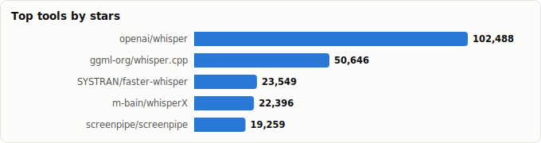
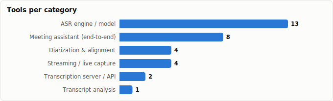

# Meeting Transcription & Conversation Analysis — Field Guide

> Derived from **kaiser-data**'s 1,350 starred repos (snapshot `2026-07-20T08:33:57.852Z`), cross-referenced with the repo-similarity graph (1,350 nodes / 4,379 edges, 28 communities).
>
> Generated 2026-07-22 by `scripts/reports/meeting_transcription.py` (regenerate any time — no API cost).






## TL;DR — which repo should you use?

| Your situation | Pick | Why it wins |
|---|---|---|
| **Just want meetings transcribed + summarized, locally, today** | `Zackriya-Solutions/meetily` | The most complete self-hosted meeting notetaker: live transcription (Parakeet/Whisper), speaker diarization, and Ollama summaries — 100% on-device, macOS & Windows. |
| **Best transcript quality for *analysis* (who said what, when)** | `m-bain/whisperX` | Whisper + word-level alignment + pyannote diarization in one pipeline — the gold standard speaker-attributed transcript that every downstream analysis needs. |
| **Batch-transcribe a backlog of recordings on your own server** | `rishikanthc/Scriberr` (app) on `SYSTRAN/faster-whisper` (engine) | Docker web UI with diarization + summaries; faster-whisper gives ~4× realtime throughput. |
| **Live captions / monitor a meeting as it happens** | `collabora/WhisperLive` or `KoljaB/RealtimeSTT` (+ `juanmc2005/diart` for live speakers) | Streaming websocket transcription with VAD; diart adds real-time 'who is speaking now'. |
| **Maximum accuracy or throughput (GPU server)** | `NVIDIA-NeMo/Speech` (Canary / Parakeet) | Canary tops the Open ASR leaderboard; Parakeet transcribes at >2000× realtime. |
| **Analyze transcripts at scale (calls, voice agents)** | `DrDroidLab/voicesummary` | Purpose-built transcript database: extraction, labelling, classification, call analytics. |
| **Qualitative research interviews** | `kaixxx/noScribe` | Diarized transcripts plus an editor designed for coding/analyzing interview data. |

**The one-line verdict:** for *using* — **meetily**; for *building* — **whisperX** (quality pipeline) on **faster-whisper** (speed), with **pyannote** doing the speaker math underneath nearly everything.

## Executive summary

- **32 transcription/analysis projects** in your stars (**449,117★** combined), organized along the meeting pipeline:
  - **Meeting assistant (end-to-end)** (8): `meetily`, `screenpipe`, `vibe`, `ecoute`, `whishper`, `Scriberr`, `noScribe`, `transcriptionstream`
  - **ASR engine / model** (13): `whisper`, `whisper.cpp`, `faster-whisper`, `FunASR`, `Speech`, `kaldi`, `vosk-api`, `speechbrain`, `espnet`, `moonshine`, `SenseVoice`, `distil-whisper`, `delayed-streams-modeling`
  - **Diarization & alignment** (4): `whisperX`, `pyannote-audio`, `whisper-diarization`, `diart`
  - **Streaming / live capture** (4): `sherpa-onnx`, `RealtimeSTT`, `silero-vad`, `WhisperLive`
  - **Transcription server / API** (2): `speaches`, `whisper-asr-webservice`
  - **Transcript analysis** (1): `voicesummary`
- **Mental model** — a meeting stack is a pipeline: **capture → VAD → ASR (transcribe) → diarize/align (who said what, when) → summarize/analyze**. The apps bundle it; everything else is a building block you compose.
- **Diarization is the moat.** Raw ASR is commoditized (a dozen great engines below); the hard part of *meeting* transcription is speaker attribution — which is why `pyannote-audio` sits underneath whisperX, Scriberr, noScribe, and most of the apps.
- **Whisper is the center of gravity, but no longer alone.** NVIDIA's Parakeet/Canary (NeMo) beat it on speed/accuracy, Moonshine beats it on-device, FunASR/SenseVoice lead for Chinese + emotion signals, and Kyutai/sherpa-onnx own true streaming.
- **Analysis is the thin layer.** Once transcripts exist, only `voicesummary` (call analytics) and `noScribe` (qualitative coding) go beyond summarization — the conversation-intelligence layer is where open source is still thinnest.

## The meeting pipeline at a glance

| Stage | What happens | Tools in your stars |
|---|---|---|
| **Capture** | Tap mic + system audio (both sides of the call) | `meetily`, `screenpipe`, `ecoute`, `vibe` |
| **VAD** | Detect speech vs. silence, segment the stream | `silero-vad`, built into `RealtimeSTT`, `sherpa-onnx` |
| **ASR — transcribe** | Audio → text (batch or streaming) | `whisper`, `faster-whisper`, `whisper.cpp`, `distil-whisper`, `moonshine`, `NeMo`, `FunASR`, `SenseVoice`, `vosk`, `kaldi`, `espnet`, `speechbrain`, `kyutai` |
| **Diarize / align** | Who said what, with word-level timestamps | `pyannote-audio`, `whisperX`, `whisper-diarization`, `diart` |
| **Serve** | Expose transcription as an API | `speaches`, `whisper-asr-webservice`, `WhisperLive` |
| **Summarize / analyze** | Notes, action items, labels, analytics | `meetily`, `Scriberr`, `transcriptionstream` (LLM summaries); `voicesummary`, `noScribe` (deeper analysis) |

## Master comparison

Sorted by stars. `Health`/`Lifecycle` are the dataset's computed metrics; `Activity` is derived from days-since-push + 90-day commits.

| Tool | Category | Lang | License | ★ Stars | Lifecycle | Health | Activity | Last push | Age | Contrib(90d) |
|---|---|---|---|---|---|---|---|---|---|---|
| [openai/whisper](https://github.com/openai/whisper) | ASR engine / model | Python | MIT | 105,272 (▲19) | Mature | 27 | slowing | 3mo ago | 3.8y | 0 |
| [ggml-org/whisper.cpp](https://github.com/ggml-org/whisper.cpp) | ASR engine / model | C++ | MIT | 51,885 (▲10) | Classic | 94 | very active | 9d ago | 3.8y | 48 |
| [Zackriya-Solutions/meetily](https://github.com/Zackriya-Solutions/meetily) | Meeting assistant (end-to-end) | Rust | MIT | 25,677 (▲70) | Hot | 63 | active | 1mo ago | 1.6y | 5 |
| [SYSTRAN/faster-whisper](https://github.com/SYSTRAN/faster-whisper) | ASR engine / model | Python | MIT | 24,392 (▲13) | Declining | 21 | stale | 8mo ago | 3.4y | 0 |
| [m-bain/whisperX](https://github.com/m-bain/whisperX) | Diarization & alignment | Python | BSD-2-Clause | 23,151 (▲4) | Classic | 71 | active | 7d ago | 3.6y | 5 |
| [screenpipe/screenpipe](https://github.com/screenpipe/screenpipe) | Meeting assistant (end-to-end) | Rust | NOASSERTION | 20,328 (▲20) | Mature | 85 | very active | 1d ago | 2.1y | 10 |
| [modelscope/FunASR](https://github.com/modelscope/FunASR) | ASR engine / model | Python | MIT | 19,351 (▲15) | Classic | 80 | very active | 0d ago | 3.7y | 6 |
| [NVIDIA-NeMo/Speech](https://github.com/NVIDIA-NeMo/Speech) | ASR engine / model | Python | Apache-2.0 | 17,793 (▲3) | Classic | 100 | very active | 0d ago | 7.0y | 32 |
| [kaldi-asr/kaldi](https://github.com/kaldi-asr/kaldi) | ASR engine / model | Shell | NOASSERTION | 15,431 | Declining | 14 | stale | 10mo ago | 11.3y | 0 |
| [alphacep/vosk-api](https://github.com/alphacep/vosk-api) | ASR engine / model | Jupyter Notebook | Apache-2.0 | 14,960 (▲2) | Mature | 44 | active | 18d ago | 6.9y | 2 |
| [k2-fsa/sherpa-onnx](https://github.com/k2-fsa/sherpa-onnx) | Streaming / live capture | C++ | Apache-2.0 | 13,663 (▲12) | Classic | 75 | very active | 0d ago | 3.9y | 24 |
| [speechbrain/speechbrain](https://github.com/speechbrain/speechbrain) | ASR engine / model | Python | Apache-2.0 | 11,697 (▲2) | Mature | 58 | active | 1mo ago | 6.2y | 5 |
| [pyannote/pyannote-audio](https://github.com/pyannote/pyannote-audio) | Diarization & alignment | Jupyter Notebook | MIT | 10,297 (▲3) | Classic | 68 | active | 3d ago | 10.4y | 5 |
| [KoljaB/RealtimeSTT](https://github.com/KoljaB/RealtimeSTT) | Streaming / live capture | Python | MIT | 9,993 (▲1) | Mature | 59 | active | 1mo ago | 2.9y | 3 |
| [espnet/espnet](https://github.com/espnet/espnet) | ASR engine / model | Python | Apache-2.0 | 9,896 | Classic | 75 | very active | 0d ago | 8.6y | 12 |
| [snakers4/silero-vad](https://github.com/snakers4/silero-vad) | Streaming / live capture | Python | MIT | 9,625 (▲5) | Classic | 61 | active | 4d ago | 5.7y | 4 |
| [moonshine-ai/moonshine](https://github.com/moonshine-ai/moonshine) | ASR engine / model | C++ | NOASSERTION | 9,384 (▲76) | Hot | 79 | very active | 4d ago | 1.8y | 3 |
| [FunAudioLLM/SenseVoice](https://github.com/FunAudioLLM/SenseVoice) | ASR engine / model | C | MIT | 8,897 (▲7) | Mature | 68 | very active | 1d ago | 2.0y | 4 |
| [thewh1teagle/vibe](https://github.com/thewh1teagle/vibe) | Meeting assistant (end-to-end) | TypeScript | MIT | 6,810 (▲3) | Mature | 72 | very active | 2d ago | 2.5y | 2 |
| [SevaSk/ecoute](https://github.com/SevaSk/ecoute) | Meeting assistant (end-to-end) | Python | MIT | 6,046 | Mature | 25 | slowing | 3mo ago | 3.2y | 0 |
| [MahmoudAshraf97/whisper-diarization](https://github.com/MahmoudAshraf97/whisper-diarization) | Diarization & alignment | Jupyter Notebook | BSD-2-Clause | 5,600 | Mature | 26 | slowing | 4mo ago | 3.5y | 0 |
| [collabora/WhisperLive](https://github.com/collabora/WhisperLive) | Streaming / live capture | Python | MIT | 4,140 (▲2) | Classic | 68 | very active | 3d ago | 3.2y | 8 |
| [huggingface/distil-whisper](https://github.com/huggingface/distil-whisper) | ASR engine / model | Python | MIT | 4,091 | Abandoned | 4 | stale | 1.5y ago | 2.7y | 0 |
| [speaches-ai/speaches](https://github.com/speaches-ai/speaches) | Transcription server / API | Python | MIT | 3,524 (▲2) | Mature | 51 | active | 4d ago | 2.2y | 0 |
| [ahmetoner/whisper-asr-webservice](https://github.com/ahmetoner/whisper-asr-webservice) | Transcription server / API | Python | MIT | 3,304 | Declining | 16 | stale | 7mo ago | 3.8y | 0 |
| [pluja/whishper](https://github.com/pluja/whishper) | Meeting assistant (end-to-end) | Svelte | AGPL-3.0 | 3,045 | Declining | 6 | stale | 11mo ago | 2.9y | 0 |
| [kyutai-labs/delayed-streams-modeling](https://github.com/kyutai-labs/delayed-streams-modeling) | ASR engine / model | Python | Apache-2.0 | 2,980 (▲1) | Declining | 22 | slowing | 5mo ago | 1.1y | 0 |
| [rishikanthc/Scriberr](https://github.com/rishikanthc/Scriberr) | Meeting assistant (end-to-end) | Go | MIT | 2,846 (▼1) | Mature | 61 | active | 1mo ago | 1.8y | 3 |
| [kaixxx/noScribe](https://github.com/kaixxx/noScribe) | Meeting assistant (end-to-end) | Python | GPL-3.0 | 2,062 | Mature | 52 | active | 1d ago | 3.2y | 3 |
| [juanmc2005/diart](https://github.com/juanmc2005/diart) | Diarization & alignment | Python | MIT | 2,002 (▲1) | Mature | 35 | active | 1mo ago | 4.9y | 0 |
| [transcriptionstream/transcriptionstream](https://github.com/transcriptionstream/transcriptionstream) | Meeting assistant (end-to-end) | Python | GPL-3.0 | 944 | Declining | 24 | stale | 6mo ago | 2.7y | 0 |
| [DrDroidLab/voicesummary](https://github.com/DrDroidLab/voicesummary) | Transcript analysis | Python | MIT | 31 | Declining | 14 | stale | 8mo ago | 11mo | 0 |

## By category

### Meeting assistant (end-to-end)

_The bundled pipeline — capture, transcribe, diarize, summarize in one app. Pick one of these if you want a product, not a project._

- **[Zackriya-Solutions/meetily](https://github.com/Zackriya-Solutions/meetily)** · 25,677★ · Rust · Hot  
  Privacy-first local meeting notetaker (macOS/Win) — live Parakeet/Whisper transcription, speaker diarization, Ollama summaries; 100% on-device.  
  <sub>topics: meeting-minutes, meeting-notes, llm, mac, windows, rust, whisper, whisper-cpp</sub>
- **[screenpipe/screenpipe](https://github.com/screenpipe/screenpipe)** · 20,328★ · Rust · Mature  
  24/7 local screen + mic capture with transcription — a rolling, searchable record of everything said on your machine.  
  <sub>topics: ai, computer-vision, llm, machine-learning, multimodal, agents, agi, audio-recording</sub>
- **[thewh1teagle/vibe](https://github.com/thewh1teagle/vibe)** · 6,810★ · TypeScript · Mature  
  Polished cross-platform desktop app for offline transcription (Whisper) with batch, subtitles, and diarization.  
  <sub>topics: ai, cross-platform, desktop, openai, rust, transcribe, whisper</sub>
- **[SevaSk/ecoute](https://github.com/SevaSk/ecoute)** · 6,046★ · Python · Mature  
  Live meeting listener — real-time transcription of mic + speaker audio with GPT-suggested responses as the call happens.  
  <sub>topics: gpt-35-turbo, whisper-ai, windows</sub>
- **[pluja/whishper](https://github.com/pluja/whishper)** · 3,045★ · Svelte · Declining  
  Self-hosted transcription suite with web UI — transcribe, translate, edit, and export subtitles, fully offline.  
  <sub>topics: ai, audio-to-text, golang, subtitles, sveltekit, transcription, whisper, ui</sub>
- **[rishikanthc/Scriberr](https://github.com/rishikanthc/Scriberr)** · 2,846★ · Go · Mature  
  Self-hosted (Docker) team transcription service — upload recordings, get diarized transcripts + optional local-LLM summaries.  
  <sub>topics: ai, audio, transcript, transcription</sub>
- **[kaixxx/noScribe](https://github.com/kaixxx/noScribe)** · 2,062★ · Python · Mature  
  Transcription built for qualitative researchers — diarized interview transcripts with an editor designed for coding/analysis.  
  <sub>topics: audio-transcription, interview, pyannote, qualitative-research, transcription, faster-whisper</sub>
- **[transcriptionstream/transcriptionstream](https://github.com/transcriptionstream/transcriptionstream)** · 944★ · Python · Declining  
  Turnkey self-hosted drop-folder: transcription + diarization + Ollama summarization as one service.  
  <sub>topics: automation, diarization, llm, speaker-diarization, speech-recognition, transcription, whisper, ollama</sub>

### ASR engine / model

_The transcribers. Raw word-error-rate is near-parity at the top; choose by deployment target (CPU/GPU/edge), language coverage, and streaming support._

- **[openai/whisper](https://github.com/openai/whisper)** · 105,272★ · Python · Mature  
  The reference open ASR model — robust multilingual transcription; the baseline every meeting tool builds on.  
  <sub>topics: —</sub>
- **[ggml-org/whisper.cpp](https://github.com/ggml-org/whisper.cpp)** · 51,885★ · C++ · Classic  
  C/C++ Whisper — runs on CPU/edge with no Python; powers many of the desktop meeting apps above.  
  <sub>topics: openai, speech-to-text, transformer, whisper, inference, speech-recognition</sub>
- **[SYSTRAN/faster-whisper](https://github.com/SYSTRAN/faster-whisper)** · 24,392★ · Python · Declining  
  CTranslate2 Whisper — ~4× faster, lower memory; the production server-side transcription default.  
  <sub>topics: deep-learning, inference, quantization, speech-recognition, speech-to-text, transformer, whisper, openai</sub>
- **[modelscope/FunASR](https://github.com/modelscope/FunASR)** · 19,351★ · Python · Classic  
  Alibaba's production ASR toolkit — streaming + offline models with punctuation, timestamps, and speaker labels (Paraformer).  
  <sub>topics: pytorch, speech-recognition, paraformer, punctuation, speaker-diarization, voice-activity-detection, asr, multilingual-asr</sub>
- **[NVIDIA-NeMo/Speech](https://github.com/NVIDIA-NeMo/Speech)** · 17,793★ · Python · Classic  
  NVIDIA's speech stack — Parakeet (fastest open ASR) and Canary (top of the Open ASR leaderboard) live here, plus diarization recipes.  
  <sub>topics: machine-translation, speaker-recognition, asr, tts, generative-ai, deeplearning, neural-networks, speaker-diariazation</sub>
- **[kaldi-asr/kaldi](https://github.com/kaldi-asr/kaldi)** · 15,431★ · Shell · Declining  
  The classic ASR research toolkit — the foundation Vosk and a generation of speech systems were built on.  
  <sub>topics: kaldi, c-plus-plus, cuda, shell, speech-recognition, speech-to-text, speaker-verification, speaker-id</sub>
- **[alphacep/vosk-api](https://github.com/alphacep/vosk-api)** · 14,960★ · Jupyter Notebook · Mature  
  Offline ASR for 20+ languages with tiny (~50MB) models — bindings for ~10 languages; runs on a Raspberry Pi.  
  <sub>topics: speech-recognition, asr, voice-recognition, speech-to-text, android, ios, raspberry-pi, deep-learning</sub>
- **[speechbrain/speechbrain](https://github.com/speechbrain/speechbrain)** · 11,697★ · Python · Mature  
  PyTorch conversational-AI toolkit — ASR, speaker ID, diarization, enhancement; strong for custom pipelines.  
  <sub>topics: speech-recognition, speech-toolkit, speaker-recognition, speech-to-text, speech-enhancement, speech-separation, audio, audio-processing</sub>
- **[espnet/espnet](https://github.com/espnet/espnet)** · 9,896★ · Python · Classic  
  End-to-end speech toolkit (ASR/TTS/translation/diarization) — research breadth across 100+ recipes.  
  <sub>topics: deep-learning, end-to-end, chainer, pytorch, kaldi, speech-recognition, speech-synthesis, speech-translation</sub>
- **[moonshine-ai/moonshine](https://github.com/moonshine-ai/moonshine)** · 9,384★ · C++ · Hot  
  Edge-first ASR beating Whisper at 5–15× speed on short segments — built for live, on-device captioning.  
  <sub>topics: intent-recognition, stt, tts, voice, voice-recognition</sub>
- **[FunAudioLLM/SenseVoice](https://github.com/FunAudioLLM/SenseVoice)** · 8,897★ · C · Mature  
  Multilingual ASR with emotion recognition and audio-event detection — transcription plus conversational tone signals.  
  <sub>topics: asr, speech-recognition, speech-to-text, cross-lingual, pytorch, speech-emotion-recognition, multilingual, audio-analysis</sub>
- **[huggingface/distil-whisper](https://github.com/huggingface/distil-whisper)** · 4,091★ · Python · Abandoned  
  Distilled Whisper — ~6× faster, 49% smaller, within ~1% WER; batch-transcribe long meetings cheaply.  
  <sub>topics: audio, speech-recognition, whisper</sub>
- **[kyutai-labs/delayed-streams-modeling](https://github.com/kyutai-labs/delayed-streams-modeling)** · 2,980★ · Python · Declining  
  Kyutai's streaming STT — word-level timestamps over live streams with seconds-level latency.  
  <sub>topics: —</sub>

### Diarization & alignment

_Who said what, when — the part that turns a wall of text into an analyzable conversation. Hardest stage, fewest options, pyannote underneath most._

- **[m-bain/whisperX](https://github.com/m-bain/whisperX)** · 23,151★ · Python · Classic  
  Whisper + forced alignment (word-level timestamps) + pyannote diarization — the best single pipeline for 'who said what, when'.  
  <sub>topics: asr, speech, speech-recognition, speech-to-text, whisper</sub>
- **[pyannote/pyannote-audio](https://github.com/pyannote/pyannote-audio)** · 10,297★ · Jupyter Notebook · Classic  
  THE open speaker-diarization toolkit — state-of-the-art pipelines for 'who spoke when'; the de-facto standard.  
  <sub>topics: pytorch, speech-processing, speaker-diarization, speech-activity-detection, speaker-change-detection, speaker-embedding, voice-activity-detection, pretrained-models</sub>
- **[MahmoudAshraf97/whisper-diarization](https://github.com/MahmoudAshraf97/whisper-diarization)** · 5,600★ · Jupyter Notebook · Mature  
  Ready-made faster-whisper + NeMo MSDD diarization pipeline — speaker-labeled transcripts with one command.  
  <sub>topics: asr, speaker-diarization, speech, speech-recognition, speech-to-text, whisper</sub>
- **[juanmc2005/diart](https://github.com/juanmc2005/diart)** · 2,002★ · Python · Mature  
  Real-time speaker diarization — streaming 'who is speaking now' for live meeting monitoring.  
  <sub>topics: speaker-diarization, streaming-audio, real-time, speaker-embedding, deep-learning, transcription, voice-activity-detection</sub>

### Streaming / live capture

_Live transcription needs VAD, chunking, and endpointing — these own the real-time path._

- **[k2-fsa/sherpa-onnx](https://github.com/k2-fsa/sherpa-onnx)** · 13,663★ · C++ · Classic  
  On-device streaming ASR + diarization + VAD via ONNX — 10 languages of bindings, runs from RPi to server, no internet.  
  <sub>topics: asr, onnx, windows, linux, macos, cpp, android, ios</sub>
- **[KoljaB/RealtimeSTT](https://github.com/KoljaB/RealtimeSTT)** · 9,993★ · Python · Mature  
  Low-latency streaming STT with built-in VAD and wake-word — the easiest way to wire live mic → text.  
  <sub>topics: python, realtime, speech-to-text</sub>
- **[snakers4/silero-vad](https://github.com/snakers4/silero-vad)** · 9,625★ · Python · Classic  
  The standard pre-trained voice-activity detector — <1ms per chunk; gates every serious live pipeline.  
  <sub>topics: voice-detection, voice-recognition, voice-commands, pytorch, onnx, voice-activity-detection, voice-control, onnx-runtime</sub>
- **[collabora/WhisperLive](https://github.com/collabora/WhisperLive)** · 4,140★ · Python · Classic  
  Whisper as a real-time websocket server — stream mic/RTSP audio in, live transcript out.  
  <sub>topics: dictation, obs, openai, text-to-speech, translation, voice-recognition, whisper, tensorrt</sub>

### Transcription server / API

_Self-hosted OpenAI-compatible endpoints — point any Whisper-API client at your own box._

- **[speaches-ai/speaches](https://github.com/speaches-ai/speaches)** · 3,524★ · Python · Mature  
  OpenAI-compatible STT/TTS server on faster-whisper — drop-in self-hosted replacement for the Whisper API.  
  <sub>topics: docker, docker-compose, faster-whisper, openai-api, openai-whisper-translation, whisper, whisper-ai, openai-whisper</sub>
- **[ahmetoner/whisper-asr-webservice](https://github.com/ahmetoner/whisper-asr-webservice)** · 3,304★ · Python · Declining  
  Dockerized Whisper ASR webservice — the long-standing self-hosted transcription endpoint.  
  <sub>topics: automatic-speech-recognition, speech-recognition, speech-to-text, openai-whisper, docker, asr, speech</sub>

### Transcript analysis

_After the words land: extraction, labelling, classification, analytics. The thinnest open-source layer — most stacks stop at summarization._

- **[DrDroidLab/voicesummary](https://github.com/DrDroidLab/voicesummary)** · 31★ · Python · Declining  
  Open AI database for voice/call transcripts — extraction, labelling, classification, and call analytics.  
  <sub>topics: ai, database, livekit, llm, retell, vapi, voice-agents, voice-ai</sub>

## Three reference stacks

**1. Zero-effort local notetaker** — install and forget:
```
meetily  (capture + Parakeet/Whisper ASR + diarization + Ollama summaries)
```

**2. Best-quality analysis pipeline** — for transcripts you'll actually mine:
```
recording → faster-whisper (ASR)
          → whisperX (word-level alignment + pyannote diarization)
          → voicesummary / your LLM (extraction, labels, analytics)
```

**3. Live monitoring** — captions and speaker tracking while the meeting runs:
```
mic/system audio → silero-vad → WhisperLive or RealtimeSTT (streaming ASR)
                 → diart (live 'who is speaking')
                 → ecoute-style LLM pass for live suggestions
```

## Graph analysis — how they relate

**Community clustering.** These 32 tools span **9 of the graph's 28 communities**.

- **Community 6** (19): `Zackriya-Solutions/meetily`, `SevaSk/ecoute`, `pluja/whishper`, `kaixxx/noScribe`, `transcriptionstream/transcriptionstream`, `ggml-org/whisper.cpp`, `SYSTRAN/faster-whisper`, `modelscope/FunASR`, `FunAudioLLM/SenseVoice`, `alphacep/vosk-api`, `kaldi-asr/kaldi`, `speechbrain/speechbrain`, `pyannote/pyannote-audio`, `m-bain/whisperX`, `MahmoudAshraf97/whisper-diarization`, `juanmc2005/diart`, `collabora/WhisperLive`, `speaches-ai/speaches`, `ahmetoner/whisper-asr-webservice`
- **Community 5** (3): `screenpipe/screenpipe`, `NVIDIA-NeMo/Speech`, `DrDroidLab/voicesummary`
- **Community 16** (3): `openai/whisper`, `espnet/espnet`, `snakers4/silero-vad`
- **Community 20** (2): `thewh1teagle/vibe`, `moonshine-ai/moonshine`

**Centrality (PageRank in the full 1,350-repo graph)** — most 'hub-like' transcription tools in your ecosystem:

- `m-bain/whisperX` — PageRank 0.0026
- `MahmoudAshraf97/whisper-diarization` — PageRank 0.0025
- `pyannote/pyannote-audio` — PageRank 0.0016
- `alphacep/vosk-api` — PageRank 0.0015
- `ggml-org/whisper.cpp` — PageRank 0.0012
- `ahmetoner/whisper-asr-webservice` — PageRank 0.0011
- `FunAudioLLM/SenseVoice` — PageRank 0.0010
- `openai/whisper` — PageRank 0.0010
- `KoljaB/RealtimeSTT` — PageRank 0.0009
- `huggingface/distil-whisper` — PageRank 0.0009

**Direct links between these tools** (top similarity edges where both endpoints are in this report):

- `MahmoudAshraf97/whisper-diarization` ⇄ `m-bain/whisperX` (w=0.833) — topics: asr, speech, speech-recognition, speech-to-text
- `ggml-org/whisper.cpp` ⇄ `SYSTRAN/faster-whisper` (w=0.750) — topics: openai, speech-to-text, transformer, whisper
- `ahmetoner/whisper-asr-webservice` ⇄ `m-bain/whisperX` (w=0.550) — topics: speech-recognition, speech-to-text, asr, speech
- `FunAudioLLM/SenseVoice` ⇄ `modelscope/FunASR` (w=0.472) — topics: asr, speech-recognition, speech-to-text, pytorch; authors: LauraGPT
- `ahmetoner/whisper-asr-webservice` ⇄ `MahmoudAshraf97/whisper-diarization` (w=0.444) — topics: speech-recognition, speech-to-text, asr, speech
- `speechbrain/speechbrain` ⇄ `m-bain/whisperX` (w=0.409) — topics: speech-recognition, speech-to-text, asr; authors: deekshaNVIDIA
- `ggml-org/whisper.cpp` ⇄ `m-bain/whisperX` (w=0.375) — topics: speech-to-text, whisper, speech-recognition
- `m-bain/whisperX` ⇄ `SYSTRAN/faster-whisper` (w=0.350) — topics: speech-recognition, speech-to-text, whisper
- `speechbrain/speechbrain` ⇄ `espnet/espnet` (w=0.291) — topics: speech-recognition, speech-enhancement, speech-separation, spoken-language-understanding
- `MahmoudAshraf97/whisper-diarization` ⇄ `SYSTRAN/faster-whisper` (w=0.273) — topics: speech-recognition, speech-to-text, whisper
- `kaldi-asr/kaldi` ⇄ `m-bain/whisperX` (w=0.273) — topics: speech-recognition, speech-to-text, speech
- `MahmoudAshraf97/whisper-diarization` ⇄ `kaldi-asr/kaldi` (w=0.250) — topics: speech, speech-recognition, speech-to-text
- `transcriptionstream/transcriptionstream` ⇄ `huggingface/distil-whisper` (w=0.232) — topics: speech-recognition, whisper
- `transcriptionstream/transcriptionstream` ⇄ `MahmoudAshraf97/whisper-diarization` (w=0.231) — topics: speaker-diarization, speech-recognition, whisper
- `ahmetoner/whisper-asr-webservice` ⇄ `kaldi-asr/kaldi` (w=0.231) — topics: speech-recognition, speech-to-text, speech
- …and 27 more.

## Maintenance & risk signal

Bus factor = commit concentration (1 = single-maintainer risk). Several of the desktop apps are passion projects — check before betting a workflow on them.

| Tool | Health | Lifecycle | Activity | Bus factor | Top-author share | Releases |
|---|---|---|---|---|---|---|
| NVIDIA-NeMo/Speech | 100 | Classic | very active | 7 | 15% | 86 |
| ggml-org/whisper.cpp | 94 | Classic | very active | 9 | 9% | 37 |
| screenpipe/screenpipe | 85 | Mature | very active | 2 | 31% | 415 |
| modelscope/FunASR | 80 | Classic | very active | 1 | 95% | 28 |
| moonshine-ai/moonshine | 79 | Hot | very active | 1 | 98% | 16 |
| espnet/espnet | 75 | Classic | very active | 1 | 52% | 60 |
| k2-fsa/sherpa-onnx | 75 | Classic | very active | 1 | 69% | 185 |
| thewh1teagle/vibe | 72 | Mature | very active | 1 | 97% | 75 |
| m-bain/whisperX | 71 | Classic | active | 2 | 38% | 44 |
| FunAudioLLM/SenseVoice | 68 | Mature | very active | 1 | 91% | 5 |
| pyannote/pyannote-audio | 68 | Classic | active | 1 | 69% | 18 |
| collabora/WhisperLive | 68 | Classic | very active | 2 | 34% | 20 |
| Zackriya-Solutions/meetily | 63 | Hot | active | 1 | 62% | 11 |
| rishikanthc/Scriberr | 61 | Mature | active | 1 | 50% | 16 |
| snakers4/silero-vad | 61 | Classic | active | 1 | 58% | 12 |
| KoljaB/RealtimeSTT | 59 | Mature | active | 1 | 93% | 42 |
| speechbrain/speechbrain | 58 | Mature | active | 3 | 20% | 15 |
| kaixxx/noScribe | 52 | Mature | active | 1 | 67% | 8 |
| speaches-ai/speaches | 51 | Mature | active | 0 | 0% | 9 |
| alphacep/vosk-api | 44 | Mature | active | 1 | 67% | 20 |
| juanmc2005/diart | 35 | Mature | active | 0 | 0% | 13 |
| openai/whisper | 27 | Mature | slowing | 0 | 0% | 13 |
| MahmoudAshraf97/whisper-diarization | 26 | Mature | slowing | 0 | 0% | 0 |
| SevaSk/ecoute | 25 | Mature | slowing | 0 | 0% | 0 |
| transcriptionstream/transcriptionstream | 24 | Declining | stale | 0 | 0% | 0 |
| kyutai-labs/delayed-streams-modeling | 22 | Declining | slowing | 0 | 0% | 0 |
| SYSTRAN/faster-whisper | 21 | Declining | stale | 0 | 0% | 21 |
| ahmetoner/whisper-asr-webservice | 16 | Declining | stale | 0 | 0% | 26 |
| kaldi-asr/kaldi | 14 | Declining | stale | 0 | 0% | 0 |
| DrDroidLab/voicesummary | 14 | Declining | stale | 0 | 0% | 2 |
| pluja/whishper | 6 | Declining | stale | 0 | 0% | 21 |
| huggingface/distil-whisper | 4 | Abandoned | stale | 0 | 0% | 0 |

## Adjacent (deliberately not listed here)

- **pipecat-ai/pipecat** (13,589★) — realtime voice-*agent* framework — building bots that talk, not transcribing meetings (see voice-agents report)
- **livekit/agents** (11,435★) — voice-agent framework with transcription as a component — see voice-agents report
- **TEN-framework/ten-framework** (10,917★) — conversational voice-AI agent framework — see voice-agents report
- **Macoron/whisper.unity** (749★) — whisper.cpp in Unity — game/XR captioning, not meetings
- **kaiser-data/claude-code-langfuse-tracing** (2★) — transcript observability for *Claude Code sessions*, not audio conversations
- **coqui-ai/TTS** (45,782★) — text-to-*speech* — the other direction; see voice-agents report

## Methodology & caveats

- **Source**: `data/classified.json` + `public/data/graph.json`. No external calls; fully reproducible.
- **Selection**: gap analysis against the 2026 open-source transcription landscape (25 repos newly starred for this report) + keyword scan (transcribe / diarization / asr / speech-to-text / meeting / vad) + manual curation into the meeting pipeline. Voice-*agent* frameworks and TTS were routed to the voice-agents report.
- **Metrics** (health, lifecycle, bus_factor) are precomputed at snapshot time and may lag GitHub's current state.
- Re-run after a fresh `classified.json` to refresh stars/activity.

<sub>Tools covered: 32 · Snapshot: 2026-07-20T08:33:57.852Z</sub>
