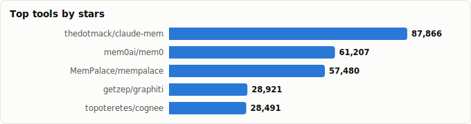
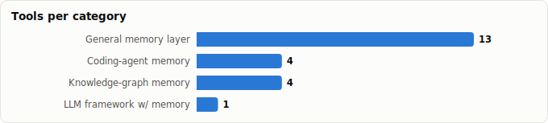

# Memory Frameworks for LLMs & Agents — Comparative Report

> Derived from **kaiser-data**'s 1,243 starred repos (snapshot `2026-06-11T21:58:33.384Z`), cross-referenced with the repo-similarity graph (1,243 nodes / 4,017 edges, 32 communities).
>
> Generated 2026-07-19 by `scripts/reports/memory_frameworks.py` (regenerate any time — no API cost).

## Executive summary

- **21 dedicated memory frameworks** identified across your stars, plus **5 storage substrates** (vector/graph DBs) they build on.
- Combined reach: **354,652★**. The space is overwhelmingly **Python** (11/21 projects).
- Four sub-categories emerge: **general memory layers**, **coding-agent/session memory**, **knowledge-graph memory**, and frameworks that **bundle a memory module**.
- The dominant architectural split is **vector-recall vs. knowledge-graph** memory — with a clear trend toward *temporal knowledge graphs* (graphiti) and *local-first* designs (OpenChronicle, ctx, TencentDB-Agent-Memory).

## Master comparison

Sorted by stars. `Health` and `Momentum` come from the dataset's computed metrics; `Activity` is derived from days-since-push + 90-day commits.

| Project | Category | Lang | License | ★ Stars | Lifecycle | Health | Activity | Last push | Age | Contrib(90d) |
|---|---|---|---|---|---|---|---|---|---|---|
| [thedotmack/claude-mem](https://github.com/thedotmack/claude-mem) | Coding-agent memory | JavaScript | Apache-2.0 | 81,818 | Hot | 80 | very active | 0d ago | 9mo | 18 |
| [mem0ai/mem0](https://github.com/mem0ai/mem0) | General memory layer | Python | Apache-2.0 | 58,361 | Mature | 94 | very active | 0d ago | 3.0y | 30 |
| [MemPalace/mempalace](https://github.com/MemPalace/mempalace) | General memory layer | Python | MIT | 55,384 | Hot | 76 | very active | 1d ago | 2mo | 14 |
| [getzep/graphiti](https://github.com/getzep/graphiti) | General memory layer | Python | Apache-2.0 | 27,306 | Hot | 77 | very active | 0d ago | 1.8y | 10 |
| [gastownhall/beads](https://github.com/gastownhall/beads) | Coding-agent memory | Go | MIT | 24,471 | Hot | 83 | very active | 0d ago | 8mo | 8 |
| [letta-ai/letta](https://github.com/letta-ai/letta) | General memory layer | Python | Apache-2.0 | 23,270 | Mature | 82 | very active | 28d ago | 2.7y | 12 |
| [topoteretes/cognee](https://github.com/topoteretes/cognee) | General memory layer | Python | Apache-2.0 | 17,792 | Mature | 80 | very active | 0d ago | 2.8y | 6 |
| [memvid/memvid](https://github.com/memvid/memvid) | General memory layer | Rust | Apache-2.0 | 15,642 | Mature | 64 | active | 15d ago | 1.0y | 3 |
| [MemoriLabs/Memori](https://github.com/MemoriLabs/Memori) | General memory layer | Python | NOASSERTION | 15,268 | Hot | 84 | very active | 1d ago | 10mo | 13 |
| [andrewyng/context-hub](https://github.com/andrewyng/context-hub) | Coding-agent memory | JavaScript | MIT | 13,556 | Hot | 61 | very active | 11d ago | 7mo | 11 |
| [plastic-labs/honcho](https://github.com/plastic-labs/honcho) | General memory layer | Python | AGPL-3.0 | 5,071 | Mature | 68 | very active | 0d ago | 2.8y | 27 |
| [campfirein/byterover-cli](https://github.com/campfirein/byterover-cli) | Coding-agent memory | TypeScript | NOASSERTION | 4,844 | Hot | 84 | very active | 8d ago | 11mo | 8 |
| [memodb-io/Acontext](https://github.com/memodb-io/Acontext) | General memory layer | JavaScript | Apache-2.0 | 3,524 | Hot | 78 | very active | 2d ago | 11mo | 4 |
| [Einsia/OpenChronicle](https://github.com/Einsia/OpenChronicle) | General memory layer | Python | MIT | 2,778 | Hot | 53 | active | 1mo ago | 1mo | 9 |
| [trustgraph-ai/trustgraph](https://github.com/trustgraph-ai/trustgraph) | Knowledge-graph memory | Python | Apache-2.0 | 2,160 | Hot | 62 | very active | 1d ago | 1.9y | 8 |
| [semantica-agi/semantica](https://github.com/semantica-agi/semantica) | Knowledge-graph memory | Python | MIT | 1,210 | Hot | 79 | very active | 0d ago | 11mo | 5 |
| [shaneholloman/mcp-knowledge-graph](https://github.com/shaneholloman/mcp-knowledge-graph) | Knowledge-graph memory | JavaScript | MIT | 864 | Declining | 62 | active | 13d ago | 1.5y | 1 |
| [supermemoryai/openclaw-supermemory](https://github.com/supermemoryai/openclaw-supermemory) | General memory layer | TypeScript | — | 791 | Hot | 61 | very active | 2d ago | 4mo | 11 |
| [zmedelis/bosquet](https://github.com/zmedelis/bosquet) | LLM framework w/ memory | Clojure | EPL-1.0 | 373 | Mature | 47 | active | 18d ago | 3.4y | 2 |
| [needle-ai/needle-mcp](https://github.com/needle-ai/needle-mcp) | Knowledge-graph memory | Python | MIT | 100 | Declining | 13 | stale | 10mo ago | 1.5y | 0 |
| [ActiveMemory/ctx](https://github.com/ActiveMemory/ctx) | General memory layer | HTML | NOASSERTION | 69 | Rising | 76 | very active | 1d ago | 4mo | 2 |

## By category

### General memory layer

_Drop-in memory APIs for any agent: store interactions/facts, retrieve relevant context on demand. The crowded, fast-moving core of the space._

- **[mem0ai/mem0](https://github.com/mem0ai/mem0)** · 58,361★ · Python · Mature  
  Universal, LLM-agnostic memory API; extract+store+retrieve facts across sessions.  
  topics: ai, chatgpt, llm, python, chatbots, rag, application, long-term-memory
- **[MemPalace/mempalace](https://github.com/MemPalace/mempalace)** · 55,384★ · Python · Hot  
  Benchmark-focused open-source memory system.  
  topics: ai, chromadb, llm, mcp, memory, python
- **[getzep/graphiti](https://github.com/getzep/graphiti)** · 27,306★ · Python · Hot  
  Temporal knowledge graph engine behind Zep; bi-temporal edges, real-time incremental updates.  
  topics: agents, graph, llms, rag
- **[letta-ai/letta](https://github.com/letta-ai/letta)** · 23,270★ · Python · Mature  
  Ex-MemGPT — the project that coined 'agent memory'; self-editing memory + a stateful agent server.  
  topics: llm, llm-agent, ai, ai-agents
- **[topoteretes/cognee](https://github.com/topoteretes/cognee)** · 17,792★ · Python · Mature  
  'Memory control plane' — ECL (extract-cognify-load) pipelines into a knowledge graph + vector store.  
  topics: ai, cognitive-architecture, vector-database, ai-agents, graph-database, ai-memory, cognitive-memory, knowledge
- **[memvid/memvid](https://github.com/memvid/memvid)** · 15,642★ · Rust · Mature  
  Serverless single-file memory layer; replaces RAG pipelines with a portable artifact.  
  topics: ai, context, embedded, faiss, knowledge-base, knowledge-graph, llm, machine-learning
- **[MemoriLabs/Memori](https://github.com/MemoriLabs/Memori)** · 15,268★ · Python · Hot  
  Agent-native memory infra; turns execution & conversations into structured recall.  
  topics: agent, ai, long-short-term-memory, memory, python, rag, aiagent, chatgpt
- **[plastic-labs/honcho](https://github.com/plastic-labs/honcho)** · 5,071★ · Python · Mature  
  Memory library for stateful agents; user-modeling / theory-of-mind oriented.  
  topics: ai, llm, memory, personalization, embeddings, rag, agent-memory, ai-agents
- **[memodb-io/Acontext](https://github.com/memodb-io/Acontext)** · 3,524★ · JavaScript · Hot  
  Treats agent 'skills' as a memory layer.  
  topics: agent, context-engineering, data-platform, self-learning, agent-development-kit, ai-agent, llm, memory
- **[Einsia/OpenChronicle](https://github.com/Einsia/OpenChronicle)** · 2,778★ · Python · Hot  
  Local-first memory for any tool-capable LLM agent.  
  topics: —
- **[supermemoryai/openclaw-supermemory](https://github.com/supermemoryai/openclaw-supermemory)** · 791★ · TypeScript · Hot  
  Long-term memory & recall, packaged for OpenClaw agents.  
  topics: ai-memory, clawd, clawdbot, memory, moltbot, openai, openclaw
- **[ActiveMemory/ctx](https://github.com/ActiveMemory/ctx)** · 69★ · HTML · Rising  
  Single-binary, local-first 'convergent' memory for humans + machines.  
  topics: agent-infrastructure, ai-collaboration, ai-tooling, context-management, developer-tools, documentation, human-in-the-loop, knowledge-management

### Coding-agent memory

_Memory specialized for coding assistants (Claude Code, Cursor, OpenClaw): persist project context, decisions, and history across sessions._

- **[thedotmack/claude-mem](https://github.com/thedotmack/claude-mem)** · 81,818★ · JavaScript · Hot  
  Persistent context across sessions; captures everything an agent does and re-injects it.  
  topics: ai, ai-agents, ai-memory, anthropic, artificial-intelligence, claude, claude-agent-sdk, claude-agents
- **[gastownhall/beads](https://github.com/gastownhall/beads)** · 24,471★ · Go · Hot  
  Distributed graph issue-tracker as durable agent memory (Dolt-backed).  
  topics: agents, claude-code, coding
- **[andrewyng/context-hub](https://github.com/andrewyng/context-hub)** · 13,556★ · JavaScript · Hot  
  Curated, versioned docs so agents stop hallucinating APIs / forgetting.  
  topics: —
- **[campfirein/byterover-cli](https://github.com/campfirein/byterover-cli)** · 4,844★ · TypeScript · Hot  
  Portable memory layer for autonomous coding agents (formerly Cipher).  
  topics: agent, llm, mcp, memory, vibe-coding, ai, autonomous-agents, cli

### Knowledge-graph memory

_Memory as a structured graph/ontology rather than a vector blob — better provenance, reasoning, and explainability._

- **[trustgraph-ai/trustgraph](https://github.com/trustgraph-ai/trustgraph)** · 2,160★ · Python · Hot  
  Agent runtime platform powered by context graphs + ontology.  
  topics: open-source, ai-infra, ai-tools, ontology, agent, graph, rdf, sparql
- **[semantica-agi/semantica](https://github.com/semantica-agi/semantica)** · 1,210★ · Python · Hot  
  AI-native KG framework: semantic retrieval, ontology reasoning, provenance.  
  topics: ai-agents, graphrag, knowledge-engineering, rag, semantic-layer, agentic-ai, semantic-web, context-management
- **[shaneholloman/mcp-knowledge-graph](https://github.com/shaneholloman/mcp-knowledge-graph)** · 864★ · JavaScript · Declining  
  MCP server giving Claude persistent memory via a local knowledge graph.  
  topics: ai-memory, claude-ai, knowledge-graph, mcp, memory-server, typescript
- **[needle-ai/needle-mcp](https://github.com/needle-ai/needle-mcp)** · 100★ · Python · Declining  
  MCP server: long-term memory for LLMs via managed RAG.  
  topics: ai, mcp, modelcontextprotocol, rag, semantic-search

### LLM framework w/ memory

_Broader LLMOps toolkits that ship memory as one module._

- **[zmedelis/bosquet](https://github.com/zmedelis/bosquet)** · 373★ · Clojure · Mature  
  Clojure LLMOps toolkit; prompt composition + agents + LLM memory.  
  topics: clojure, gpt, prompt-engineering, llmops, ai

## Graph analysis — how they relate

**Community clustering.** The 21 frameworks fall into **8 of the graph's 32 communities** — meaning memory tooling does *not* form one tight cluster but is spread across the AI-infra landscape (each tends to cluster with its neighbors: vector DBs, agent frameworks, or MCP tooling).

- **Community 13** (7): `mem0ai/mem0`, `topoteretes/cognee`, `MemoriLabs/Memori`, `memvid/memvid`, `plastic-labs/honcho`, `memodb-io/Acontext`, `trustgraph-ai/trustgraph`
- **Community 1** (5): `letta-ai/letta`, `getzep/graphiti`, `MemPalace/mempalace`, `needle-ai/needle-mcp`, `zmedelis/bosquet`
- **Community 7** (2): `ActiveMemory/ctx`, `semantica-agi/semantica`
- **Community 19** (2): `thedotmack/claude-mem`, `gastownhall/beads`
- **Community 10** (2): `campfirein/byterover-cli`, `andrewyng/context-hub`

**Centrality (PageRank in the full 1,071-repo graph).** Higher = more connected to the rest of your starred ecosystem (a proxy for how 'hub-like' the project is):

- `letta-ai/letta` — PageRank 0.0018
- `getzep/graphiti` — PageRank 0.0014
- `ActiveMemory/ctx` — PageRank 0.0012
- `MemPalace/mempalace` — PageRank 0.0012
- `mem0ai/mem0` — PageRank 0.0009
- `plastic-labs/honcho` — PageRank 0.0008
- `needle-ai/needle-mcp` — PageRank 0.0008
- `andrewyng/context-hub` — PageRank 0.0008

**Direct links between memory frameworks** (similarity edges where both endpoints are in this report):

- `MemoriLabs/Memori` ⇄ `mem0ai/mem0` (w=0.370) — topics: ai, memory, python, rag
- `plastic-labs/honcho` ⇄ `mem0ai/mem0` (w=0.358) — topics: ai, llm, memory, rag
- `plastic-labs/honcho` ⇄ `MemoriLabs/Memori` (w=0.350) — topics: ai, llm, memory, rag
- `letta-ai/letta` ⇄ `MemPalace/mempalace` (w=0.300) — topics: llm, ai
- `MemPalace/mempalace` ⇄ `campfirein/byterover-cli` (w=0.267) — topics: ai, llm, mcp, memory
- `plastic-labs/honcho` ⇄ `topoteretes/cognee` (w=0.232) — topics: ai, agent-memory, ai-agents, ai-memory
- `plastic-labs/honcho` ⇄ `thedotmack/claude-mem` (w=0.212) — topics: ai, embeddings, rag, ai-agents
- `trustgraph-ai/trustgraph` ⇄ `topoteretes/cognee` (w=0.197) — topics: open-source, context-engineering, knowledge-graph, agent-memory

## Maintenance & risk signal

Bus factor = how concentrated commits are in one author (1 = single-maintainer risk). Use alongside lifecycle + activity before adopting.

| Project | Health | Lifecycle | Activity | Bus factor | Top-author share | Releases |
|---|---|---|---|---|---|---|
| mem0ai/mem0 | 94 | Mature | very active | 4 | 30% | 335 |
| MemoriLabs/Memori | 84 | Hot | very active | 2 | 39% | 38 |
| campfirein/byterover-cli | 84 | Hot | very active | 2 | 27% | 27 |
| gastownhall/beads | 83 | Hot | very active | 2 | 45% | 91 |
| letta-ai/letta | 82 | Mature | very active | 2 | 30% | 177 |
| topoteretes/cognee | 80 | Mature | very active | 1 | 52% | 114 |
| thedotmack/claude-mem | 80 | Hot | very active | 1 | 74% | 281 |
| semantica-agi/semantica | 79 | Hot | very active | 1 | 68% | 17 |
| memodb-io/Acontext | 78 | Hot | very active | 1 | 74% | 279 |
| getzep/graphiti | 77 | Hot | very active | 2 | 47% | 196 |
| MemPalace/mempalace | 76 | Hot | very active | 1 | 66% | 10 |
| ActiveMemory/ctx | 76 | Rising | very active | 1 | 98% | 7 |
| plastic-labs/honcho | 68 | Mature | very active | 3 | 19% | 0 |
| memvid/memvid | 64 | Mature | active | 1 | 75% | 12 |
| trustgraph-ai/trustgraph | 62 | Hot | very active | 1 | 79% | 0 |
| shaneholloman/mcp-knowledge-graph | 62 | Declining | active | 1 | 100% | 8 |
| supermemoryai/openclaw-supermemory | 61 | Hot | very active | 2 | 49% | 0 |
| andrewyng/context-hub | 61 | Hot | very active | 1 | 74% | 1 |
| Einsia/OpenChronicle | 53 | Hot | active | 2 | 32% | 0 |
| zmedelis/bosquet | 47 | Mature | active | 1 | 50% | 14 |
| needle-ai/needle-mcp | 13 | Declining | stale | 0 | 0% | 0 |

## Which one should you use?

| If you want… | Start with | Why |
|---|---|---|
| A batteries-included, widely-adopted memory API | `mem0ai/mem0` | Largest mindshare among dedicated layers; LLM-agnostic; well-documented. |
| Temporal / relationship-aware memory (knowledge graph) | `getzep/graphiti` | Bi-temporal KG with real-time incremental updates; strongest graph design. |
| A full 'memory control plane' with pipelines | `topoteretes/cognee` | ECL pipelines + graph + vector; more framework than library. |
| Memory for a coding agent (Claude Code/Cursor) | `thedotmack/claude-mem` | Purpose-built session persistence; by far the most-starred in this niche. |
| Local-first / no-cloud memory | `Einsia/OpenChronicle` or `Tencent/TencentDB-Agent-Memory` | Both emphasize fully-local long-term memory. |
| Provenance / explainable, ontology-driven memory | `trustgraph-ai/trustgraph` / `semantica-agi/semantica` | Context graphs with reasoning + full provenance. |
| Drop-in via MCP (no SDK lock-in) | `shaneholloman/mcp-knowledge-graph` / `needle-ai/needle-mcp` | Expose memory to any MCP-capable client. |

## Memory substrate (storage layer)

Not memory *frameworks*, but the databases these layers typically sit on. Several are also in your stars:

| Store | ★ Stars | Lang | Role |
|---|---|---|---|
| [redis/redis](https://github.com/redis/redis) | 74,829 | C | In-memory data store; common KV/vector backing for memory layers. |
| [facebookresearch/faiss](https://github.com/facebookresearch/faiss) | 40,266 | C++ | Dense-vector similarity search library; embedding index substrate. |
| [chroma-core/chroma](https://github.com/chroma-core/chroma) | 28,387 | Rust | AI-native search/vector DB used as memory storage. |
| [alibaba/zvec](https://github.com/alibaba/zvec) | 9,776 | C++ | Lightweight in-process vector database. |
| [FalkorDB/FalkorDB](https://github.com/FalkorDB/FalkorDB) | 4,547 | C | Fast graph database (GraphBLAS) for graph-shaped memory. |

## Methodology & caveats

- **Source**: `data/classified.json` (full metadata) + `public/data/graph.json` (similarity graph). No external calls; fully reproducible.
- **Selection**: keyword scan across name/description/topics/README for memory + LLM/agent signals, then manual curation into the taxonomy in this script. Generic 'memory-efficient' infra (e.g. vLLM) and pure tutorials/awesome-lists were excluded.
- **Metrics** (health, momentum, lifecycle, bus_factor) are precomputed by the analyzer pipeline at snapshot time and may lag GitHub's current state.
- **The market is young**: many of these launched in the last 12 months; star counts and activity shift fast. Re-run this script after a fresh `classified.json` to refresh.

Frameworks covered: 21 · Snapshot: 2026-06-11T21:58:33.384Z
