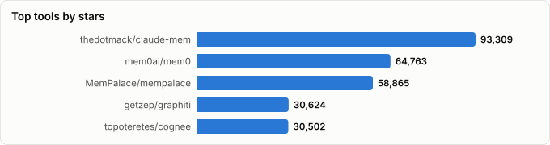
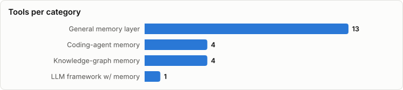

# Memory Frameworks for LLMs & Agents — Comparative Report

> Derived from **kaiser-data**'s 1,861 starred repos (snapshot `2026-08-29T14:32:27.250Z`), cross-referenced with the repo-similarity graph (1,861 nodes / 6,077 edges, 39 communities).
>
> Generated 2026-08-29 by `scripts/reports/memory_frameworks.py` (regenerate any time — no API cost).

## Executive summary

- **22 dedicated memory frameworks** identified across your stars, plus **5 storage substrates** (vector/graph DBs) they build on.
- Combined reach: **432,565★**. The space is overwhelmingly **Python** (10/22 projects).
- Four sub-categories emerge: **general memory layers**, **coding-agent/session memory**, **knowledge-graph memory**, and frameworks that **bundle a memory module**.
- The dominant architectural split is **vector-recall vs. knowledge-graph** memory — with a clear trend toward *temporal knowledge graphs* (graphiti) and *local-first* designs (OpenChronicle, ctx, TencentDB-Agent-Memory).

## Master comparison

Sorted by stars. `Health` and `Momentum` come from the dataset's computed metrics; `Activity` is derived from days-since-push + 90-day commits.

| Project | Category | Lang | License | ★ Stars | Lifecycle | Health | Activity | Last push | Age | Contrib(90d) |
|---|---|---|---|---|---|---|---|---|---|---|
| [thedotmack/claude-mem](https://github.com/thedotmack/claude-mem) | Coding-agent memory | JavaScript | Apache-2.0 | 92,280 | Rising | 79 | very active | 3d ago | 12mo | 2 |
| [mem0ai/mem0](https://github.com/mem0ai/mem0) | General memory layer | Python | Apache-2.0 | 64,203 | Classic | 79 | very active | 2d ago | 3.2y | 25 |
| [MemPalace/mempalace](https://github.com/MemPalace/mempalace) | General memory layer | Python | MIT | 58,685 | Hot | 76 | very active | 2d ago | 4mo | 17 |
| [getzep/graphiti](https://github.com/getzep/graphiti) | General memory layer | Python | Apache-2.0 | 30,357 | Mature | 74 | very active | 2d ago | 2.1y | 23 |
| [topoteretes/cognee](https://github.com/topoteretes/cognee) | General memory layer | Python | Apache-2.0 | 30,299 | Classic | 79 | very active | 2d ago | 3.0y | 7 |
| [gastownhall/beads](https://github.com/gastownhall/beads) | Coding-agent memory | Go | MIT | 26,654 | Hot | 87 | very active | 2d ago | 10mo | 17 |
| [TencentCloud/TencentDB-Agent-Memory](https://github.com/TencentCloud/TencentDB-Agent-Memory) | General memory layer | TypeScript | NOASSERTION | 24,872 | Rising | 71 | very active | 2d ago | 4mo | 9 |
| [letta-ai/letta](https://github.com/letta-ai/letta) | General memory layer | — | Apache-2.0 | 24,470 | Mature | 66 | active | 6d ago | 2.9y | 2 |
| [memvid/memvid](https://github.com/memvid/memvid) | General memory layer | Rust | Apache-2.0 | 16,456 | Declining | 57 | active | 1mo ago | 1.3y | 1 |
| [MemoriLabs/Memori](https://github.com/MemoriLabs/Memori) | General memory layer | Python | NOASSERTION | 16,254 | Mature | 74 | very active | 8d ago | 1.1y | 7 |
| [andrewyng/context-hub](https://github.com/andrewyng/context-hub) | Coding-agent memory | JavaScript | MIT | 13,947 | Rising | 47 | slowing | 3mo ago | 10mo | 1 |
| [semantica-agi/semantica](https://github.com/semantica-agi/semantica) | Knowledge-graph memory | Python | MIT | 11,043 | Hot | 84 | very active | 2d ago | 1.2y | 21 |
| [plastic-labs/honcho](https://github.com/plastic-labs/honcho) | General memory layer | Python | AGPL-3.0 | 6,888 | Mature | 76 | very active | 2d ago | 3.0y | 23 |
| [campfirein/byterover-cli](https://github.com/campfirein/byterover-cli) | Coding-agent memory | TypeScript | NOASSERTION | 4,950 | Mature | 61 | slowing | 2mo ago | 1.2y | 3 |
| [memodb-io/Acontext](https://github.com/memodb-io/Acontext) | General memory layer | JavaScript | Apache-2.0 | 3,676 | Declining | 49 | active | 1mo ago | 1.1y | 0 |
| [Einsia/OpenChronicle](https://github.com/Einsia/OpenChronicle) | General memory layer | Python | MIT | 2,670 | Declining | 23 | slowing | 3mo ago | 4mo | 0 |
| [trustgraph-ai/trustgraph](https://github.com/trustgraph-ai/trustgraph) | Knowledge-graph memory | Python | Apache-2.0 | 2,620 | Mature | 63 | very active | 5d ago | 2.1y | 11 |
| [shaneholloman/mcp-knowledge-graph](https://github.com/shaneholloman/mcp-knowledge-graph) | Knowledge-graph memory | JavaScript | MIT | 886 | Declining | 43 | slowing | 3mo ago | 1.7y | 0 |
| [supermemoryai/openclaw-supermemory](https://github.com/supermemoryai/openclaw-supermemory) | General memory layer | TypeScript | — | 798 | Mature | 48 | slowing | 2mo ago | 7mo | 6 |
| [zmedelis/bosquet](https://github.com/zmedelis/bosquet) | LLM framework w/ memory | Clojure | EPL-1.0 | 379 | Mature | 33 | slowing | 3mo ago | 3.7y | 0 |
| [needle-ai/needle-mcp](https://github.com/needle-ai/needle-mcp) | Knowledge-graph memory | Python | MIT | 102 | Abandoned | 10 | stale | 1.1y ago | 1.7y | 0 |
| [ActiveMemory/ctx](https://github.com/ActiveMemory/ctx) | General memory layer | HTML | NOASSERTION | 76 | Hot | 76 | very active | 3d ago | 7mo | 5 |

## By category

### General memory layer

_Drop-in memory APIs for any agent: store interactions/facts, retrieve relevant context on demand. The crowded, fast-moving core of the space._

- **[mem0ai/mem0](https://github.com/mem0ai/mem0)** · 64,203★ · Python · Classic  
  Universal, LLM-agnostic memory API; extract+store+retrieve facts across sessions.  
  topics: ai, chatgpt, llm, python, chatbots, rag, application, long-term-memory
- **[MemPalace/mempalace](https://github.com/MemPalace/mempalace)** · 58,685★ · Python · Hot  
  Benchmark-focused open-source memory system.  
  topics: ai, chromadb, llm, mcp, memory, python
- **[getzep/graphiti](https://github.com/getzep/graphiti)** · 30,357★ · Python · Mature  
  Temporal knowledge graph engine behind Zep; bi-temporal edges, real-time incremental updates.  
  topics: agents, graph, llms, rag
- **[topoteretes/cognee](https://github.com/topoteretes/cognee)** · 30,299★ · Python · Classic  
  'Memory control plane' — ECL (extract-cognify-load) pipelines into a knowledge graph + vector store.  
  topics: ai, cognitive-architecture, vector-database, ai-agents, graph-database, ai-memory, cognitive-memory, knowledge
- **[TencentCloud/TencentDB-Agent-Memory](https://github.com/TencentCloud/TencentDB-Agent-Memory)** · 24,872★ · TypeScript · Rising  
  Fully-local long-term memory via a 4-tier progressive pipeline.  
  topics: agent, llm, memory, openclaw-plugin, ai-agent, embedding, local-first, long-term-memory
- **[letta-ai/letta](https://github.com/letta-ai/letta)** · 24,470★ · — · Mature  
  Ex-MemGPT — the project that coined 'agent memory'; self-editing memory + a stateful agent server.  
  topics: llm, llm-agent, ai, ai-agents
- **[memvid/memvid](https://github.com/memvid/memvid)** · 16,456★ · Rust · Declining  
  Serverless single-file memory layer; replaces RAG pipelines with a portable artifact.  
  topics: ai, context, embedded, faiss, knowledge-base, knowledge-graph, llm, machine-learning
- **[MemoriLabs/Memori](https://github.com/MemoriLabs/Memori)** · 16,254★ · Python · Mature  
  Agent-native memory infra; turns execution & conversations into structured recall.  
  topics: agent, ai, long-short-term-memory, memory, python, rag, state-management, memory-management
- **[plastic-labs/honcho](https://github.com/plastic-labs/honcho)** · 6,888★ · Python · Mature  
  Memory library for stateful agents; user-modeling / theory-of-mind oriented.  
  topics: ai, llm, memory, personalization, embeddings, rag, agent-memory, ai-agents
- **[memodb-io/Acontext](https://github.com/memodb-io/Acontext)** · 3,676★ · JavaScript · Declining  
  Treats agent 'skills' as a memory layer.  
  topics: agent, context-engineering, data-platform, self-learning, agent-development-kit, ai-agent, llm, memory
- **[Einsia/OpenChronicle](https://github.com/Einsia/OpenChronicle)** · 2,670★ · Python · Declining  
  Local-first memory for any tool-capable LLM agent.  
  topics: —
- **[supermemoryai/openclaw-supermemory](https://github.com/supermemoryai/openclaw-supermemory)** · 798★ · TypeScript · Mature  
  Long-term memory & recall, packaged for OpenClaw agents.  
  topics: ai-memory, clawd, clawdbot, memory, moltbot, openai, openclaw
- **[ActiveMemory/ctx](https://github.com/ActiveMemory/ctx)** · 76★ · HTML · Hot  
  Single-binary, local-first 'convergent' memory for humans + machines.  
  topics: agent-infrastructure, ai-collaboration, ai-tooling, context-management, developer-tools, documentation, human-in-the-loop, knowledge-management

### Coding-agent memory

_Memory specialized for coding assistants (Claude Code, Cursor, OpenClaw): persist project context, decisions, and history across sessions._

- **[thedotmack/claude-mem](https://github.com/thedotmack/claude-mem)** · 92,280★ · JavaScript · Rising  
  Persistent context across sessions; captures everything an agent does and re-injects it.  
  topics: ai, ai-agents, ai-memory, anthropic, artificial-intelligence, claude, claude-agent-sdk, claude-agents
- **[gastownhall/beads](https://github.com/gastownhall/beads)** · 26,654★ · Go · Hot  
  Distributed graph issue-tracker as durable agent memory (Dolt-backed).  
  topics: agents, claude-code, coding
- **[andrewyng/context-hub](https://github.com/andrewyng/context-hub)** · 13,947★ · JavaScript · Rising  
  Curated, versioned docs so agents stop hallucinating APIs / forgetting.  
  topics: —
- **[campfirein/byterover-cli](https://github.com/campfirein/byterover-cli)** · 4,950★ · TypeScript · Mature  
  Portable memory layer for autonomous coding agents (formerly Cipher).  
  topics: agent, llm, mcp, memory, vibe-coding, ai, autonomous-agents, cli

### Knowledge-graph memory

_Memory as a structured graph/ontology rather than a vector blob — better provenance, reasoning, and explainability._

- **[semantica-agi/semantica](https://github.com/semantica-agi/semantica)** · 11,043★ · Python · Hot  
  AI-native KG framework: semantic retrieval, ontology reasoning, provenance.  
  topics: ai, ai-governance, artificial-intelligence, context-engineering, context-graphs, decision-intelligence, explainable-ai, generative-ai
- **[trustgraph-ai/trustgraph](https://github.com/trustgraph-ai/trustgraph)** · 2,620★ · Python · Mature  
  Agent runtime platform powered by context graphs + ontology.  
  topics: open-source, ontology, agent, graph, rdf, sparql, context, knowledge-graph
- **[shaneholloman/mcp-knowledge-graph](https://github.com/shaneholloman/mcp-knowledge-graph)** · 886★ · JavaScript · Declining  
  MCP server giving Claude persistent memory via a local knowledge graph.  
  topics: ai-memory, claude-ai, knowledge-graph, mcp, memory-server, typescript
- **[needle-ai/needle-mcp](https://github.com/needle-ai/needle-mcp)** · 102★ · Python · Abandoned  
  MCP server: long-term memory for LLMs via managed RAG.  
  topics: ai, mcp, modelcontextprotocol, rag, semantic-search

### LLM framework w/ memory

_Broader LLMOps toolkits that ship memory as one module._

- **[zmedelis/bosquet](https://github.com/zmedelis/bosquet)** · 379★ · Clojure · Mature  
  Clojure LLMOps toolkit; prompt composition + agents + LLM memory.  
  topics: clojure, gpt, prompt-engineering, llmops, ai

## Graph analysis — how they relate

**Community clustering.** The 22 frameworks fall into **10 of the graph's 39 communities** — meaning memory tooling does *not* form one tight cluster but is spread across the AI-infra landscape (each tends to cluster with its neighbors: vector DBs, agent frameworks, or MCP tooling).

- **Community 18** (6): `mem0ai/mem0`, `topoteretes/cognee`, `MemoriLabs/Memori`, `plastic-labs/honcho`, `memodb-io/Acontext`, `MemPalace/mempalace`
- **Community 9** (4): `letta-ai/letta`, `getzep/graphiti`, `TencentCloud/TencentDB-Agent-Memory`, `zmedelis/bosquet`
- **Community 7** (3): `memvid/memvid`, `trustgraph-ai/trustgraph`, `semantica-agi/semantica`
- **Community 0** (2): `Einsia/OpenChronicle`, `andrewyng/context-hub`
- **Community 12** (2): `shaneholloman/mcp-knowledge-graph`, `needle-ai/needle-mcp`

**Centrality (PageRank in the full 1,071-repo graph).** Higher = more connected to the rest of your starred ecosystem (a proxy for how 'hub-like' the project is):

- `letta-ai/letta` — PageRank 0.0012
- `MemPalace/mempalace` — PageRank 0.0010
- `plastic-labs/honcho` — PageRank 0.0008
- `supermemoryai/openclaw-supermemory` — PageRank 0.0008
- `topoteretes/cognee` — PageRank 0.0006
- `needle-ai/needle-mcp` — PageRank 0.0005
- `semantica-agi/semantica` — PageRank 0.0005
- `mem0ai/mem0` — PageRank 0.0005

**Direct links between memory frameworks** (similarity edges where both endpoints are in this report):

- `plastic-labs/honcho` ⇄ `MemoriLabs/Memori` (w=0.360) — topics: ai, llm, memory, rag
- `plastic-labs/honcho` ⇄ `mem0ai/mem0` (w=0.358) — topics: ai, llm, memory, rag
- `MemoriLabs/Memori` ⇄ `mem0ai/mem0` (w=0.330) — topics: ai, memory, python, rag
- `plastic-labs/honcho` ⇄ `topoteretes/cognee` (w=0.232) — topics: ai, agent-memory, ai-agents, ai-memory
- `plastic-labs/honcho` ⇄ `thedotmack/claude-mem` (w=0.212) — topics: ai, embeddings, rag, ai-agents
- `TencentCloud/TencentDB-Agent-Memory` ⇄ `memodb-io/Acontext` (w=0.200) — topics: agent, llm, memory, ai-agent
- `trustgraph-ai/trustgraph` ⇄ `semantica-agi/semantica` (w=0.164) — topics: ontology, knowledge-graph, explainable-ai, context-engineering

## Maintenance & risk signal

Bus factor = how concentrated commits are in one author (1 = single-maintainer risk). Use alongside lifecycle + activity before adopting.

| Project | Health | Lifecycle | Activity | Bus factor | Top-author share | Releases |
|---|---|---|---|---|---|---|
| gastownhall/beads | 87 | Hot | very active | 3 | 24% | 97 |
| semantica-agi/semantica | 84 | Hot | very active | 2 | 49% | 21 |
| mem0ai/mem0 | 79 | Classic | very active | 1 | 52% | 393 |
| topoteretes/cognee | 79 | Classic | very active | 1 | 76% | 146 |
| thedotmack/claude-mem | 79 | Rising | very active | 1 | 99% | 310 |
| plastic-labs/honcho | 76 | Mature | very active | 4 | 18% | 0 |
| MemPalace/mempalace | 76 | Hot | very active | 1 | 75% | 16 |
| ActiveMemory/ctx | 76 | Hot | very active | 1 | 70% | 7 |
| getzep/graphiti | 74 | Mature | very active | 1 | 55% | 197 |
| MemoriLabs/Memori | 74 | Mature | very active | 2 | 35% | 38 |
| TencentCloud/TencentDB-Agent-Memory | 71 | Rising | very active | 2 | 32% | 14 |
| letta-ai/letta | 66 | Mature | active | 1 | 63% | 177 |
| trustgraph-ai/trustgraph | 63 | Mature | very active | 1 | 64% | 0 |
| campfirein/byterover-cli | 61 | Mature | slowing | 1 | 56% | 27 |
| memvid/memvid | 57 | Declining | active | 1 | 100% | 12 |
| memodb-io/Acontext | 49 | Declining | active | 0 | 0% | 279 |
| supermemoryai/openclaw-supermemory | 48 | Mature | slowing | 2 | 33% | 0 |
| andrewyng/context-hub | 47 | Rising | slowing | 1 | 100% | 1 |
| shaneholloman/mcp-knowledge-graph | 43 | Declining | slowing | 0 | 0% | 8 |
| zmedelis/bosquet | 33 | Mature | slowing | 0 | 0% | 14 |
| Einsia/OpenChronicle | 23 | Declining | slowing | 0 | 0% | 0 |
| needle-ai/needle-mcp | 10 | Abandoned | stale | 0 | 0% | 0 |

## Which one should you use?

| If you want… | Start with | Why |
|---|---|---|
| A batteries-included, widely-adopted memory API | `mem0ai/mem0` | Largest mindshare among dedicated layers; LLM-agnostic; well-documented. |
| Temporal / relationship-aware memory (knowledge graph) | `getzep/graphiti` | Bi-temporal KG with real-time incremental updates; strongest graph design. |
| A full 'memory control plane' with pipelines | `topoteretes/cognee` | ECL pipelines + graph + vector; more framework than library. |
| Memory for a coding agent (Claude Code/Cursor) | `thedotmack/claude-mem` | Purpose-built session persistence; by far the most-starred in this niche. |
| Local-first / no-cloud memory | `Einsia/OpenChronicle` or `TencentCloud/TencentDB-Agent-Memory` | Both emphasize fully-local long-term memory. |
| Provenance / explainable, ontology-driven memory | `trustgraph-ai/trustgraph` / `semantica-agi/semantica` | Context graphs with reasoning + full provenance. |
| Drop-in via MCP (no SDK lock-in) | `shaneholloman/mcp-knowledge-graph` / `needle-ai/needle-mcp` | Expose memory to any MCP-capable client. |

## Memory substrate (storage layer)

Not memory *frameworks*, but the databases these layers typically sit on. Several are also in your stars:

| Store | ★ Stars | Lang | Role |
|---|---|---|---|
| [redis/redis](https://github.com/redis/redis) | 76,125 | C | In-memory data store; common KV/vector backing for memory layers. |
| [facebookresearch/faiss](https://github.com/facebookresearch/faiss) | 40,812 | C++ | Dense-vector similarity search library; embedding index substrate. |
| [chroma-core/chroma](https://github.com/chroma-core/chroma) | 29,166 | Rust | AI-native search/vector DB used as memory storage. |
| [alibaba/zvec](https://github.com/alibaba/zvec) | 15,528 | C++ | Lightweight in-process vector database. |
| [FalkorDB/FalkorDB](https://github.com/FalkorDB/FalkorDB) | 5,666 | Rust | Fast graph database (GraphBLAS) for graph-shaped memory. |

## Methodology & caveats

- **Source**: `data/classified.json` (full metadata) + `public/data/graph.json` (similarity graph). No external calls; fully reproducible.
- **Selection**: keyword scan across name/description/topics/README for memory + LLM/agent signals, then manual curation into the taxonomy in this script. Generic 'memory-efficient' infra (e.g. vLLM) and pure tutorials/awesome-lists were excluded.
- **Metrics** (health, momentum, lifecycle, bus_factor) are precomputed by the analyzer pipeline at snapshot time and may lag GitHub's current state.
- **The market is young**: many of these launched in the last 12 months; star counts and activity shift fast. Re-run this script after a fresh `classified.json` to refresh.

Frameworks covered: 22 · Snapshot: 2026-08-29T14:32:27.250Z
