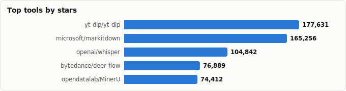
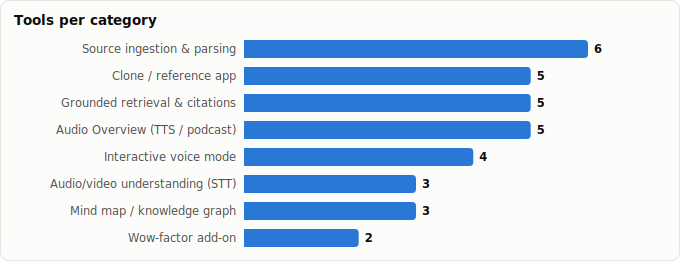

# Build Your Own NotebookLM — The Repo Stack for a Source-Grounded Notebook Clone

> Derived from **kaiser-data**'s 1,350 starred repos (snapshot `2026-07-20T08:33:57.852Z`), cross-referenced with the repo-similarity graph (1,350 nodes / 4,379 edges, 28 communities).
>
> Generated 2026-07-20 by `scripts/reports/notebooklm_stack.py` (regenerate any time — no API cost).

## Executive summary

- **Goal**: everything needed to build (and demo) your own NotebookLM — a source-grounded notebook with cited answers, an *Audio Overview* podcast generator, live voice interaction, and a mind-map view — from **34 repos already in your stars** (**1,323,839★** combined).
  - **Clone / reference app** (5): `anything-llm`, `open-notebook`, `DeepTutor`, `notebooklm-py`, `Dot`
  - **Source ingestion & parsing** (6): `yt-dlp`, `markitdown`, `MinerU`, `docling`, `unstructured`, `reader`
  - **Grounded retrieval & citations** (6): `llama_index`, `LightRAG`, `PageIndex`, `LEANN`, `lancedb`, `chonkie`
  - **Audio Overview (TTS / podcast)** (5): `TTS`, `VoxCPM`, `chatterbox`, `supertonic`, `Qwen3-TTS`
  - **Audio/video understanding (STT)** (3): `whisper`, `faster-whisper`, `whisperX`
  - **Interactive voice mode** (4): `pipecat`, `agents`, `RealtimeSTT`, `fastrtc`
  - **Mind map / knowledge graph** (3): `graphrag`, `graphiti`, `cognee`
  - **Wow-factor add-on** (2): `deer-flow`, `screenpipe`
- The signature NotebookLM feature — the two-host **Audio Overview** — is fully reproducible with open TTS (`chatterbox`, `VoxCPM`) plus an LLM-written dialogue script; `open-notebook` proves the end-to-end shape already exists in OSS.
- Your unfair advantages over the real NotebookLM: **fully local/private** operation (`LEANN` + `supertonic` + `faster-whisper`), **clickable second-accurate audio citations** (`whisperX` word timestamps), **interruptible live podcasts** (`pipecat`), and **ambient source capture** (`screenpipe`).

## Anatomy of a NotebookLM clone

| NotebookLM feature | What it needs | Tools in your stars |
|---|---|---|
| **Add sources** (PDF, docs, URLs, YouTube, audio) | parse anything → clean text | `markitdown`, `docling`, `MinerU`, `unstructured`, `reader`, `yt-dlp` |
| **Grounded chat with citations** | retrieval that keeps provenance | `llama_index`, `LightRAG`, `PageIndex`, `LEANN`, `chonkie`, `lancedb` |
| **Audio Overview** (podcast) | dialogue script → two distinct voices | `chatterbox`, `VoxCPM`, `Qwen3-TTS`, `TTS`, `supertonic` |
| **Audio/video sources** | transcribe + timestamp + diarize | `whisper`, `faster-whisper`, `whisperX` |
| **Interactive mode** (join the conversation) | realtime duplex voice | `pipecat`, `agents` (LiveKit), `fastrtc`, `RealtimeSTT` |
| **Mind map** | entity/topic graph over sources | `graphiti`, `graphrag`, `cognee` |
| **Beyond NotebookLM** | the demo-day differentiators | `deer-flow`, `screenpipe` |

## Master comparison

Sorted by stars. `Health`/`Lifecycle` are the dataset's computed metrics; `Activity` is derived from days-since-push + 90-day commits.

| Tool | Category | Lang | License | ★ Stars | Lifecycle | Health | Activity | Last push | Age | Contrib(90d) |
|---|---|---|---|---|---|---|---|---|---|---|
| [yt-dlp/yt-dlp](https://github.com/yt-dlp/yt-dlp) | Source ingestion & parsing | Python | Unlicense | 179,007 (▲77) | Classic | 87 | very active | 6d ago | 5.7y | 34 |
| [microsoft/markitdown](https://github.com/microsoft/markitdown) | Source ingestion & parsing | Python | MIT | 167,484 (▲167) | Declining | 51 | active | 3d ago | 1.7y | 2 |
| [openai/whisper](https://github.com/openai/whisper) | Audio/video understanding (STT) | Python | MIT | 105,272 (▲19) | Mature | 27 | slowing | 3mo ago | 3.8y | 0 |
| [bytedance/deer-flow](https://github.com/bytedance/deer-flow) | Wow-factor add-on | Python | MIT | 77,423 (▲32) | Hot | 84 | very active | 0d ago | 1.2y | 34 |
| [opendatalab/MinerU](https://github.com/opendatalab/MinerU) | Source ingestion & parsing | Python | NOASSERTION | 75,161 (▲54) | Mature | 80 | very active | 3d ago | 2.4y | 1 |
| [Mintplex-Labs/anything-llm](https://github.com/Mintplex-Labs/anything-llm) | Clone / reference app | JavaScript | MIT | 63,590 (▲26) | Classic | 79 | very active | 2d ago | 3.1y | 6 |
| [docling-project/docling](https://github.com/docling-project/docling) | Source ingestion & parsing | Python | MIT | 63,487 (▲26) | Mature | 95 | very active | 0d ago | 2.0y | 33 |
| [run-llama/llama_index](https://github.com/run-llama/llama_index) | Grounded retrieval & citations | Python | MIT | 50,953 (▲10) | Classic | 99 | very active | 4d ago | 3.7y | 48 |
| [coqui-ai/TTS](https://github.com/coqui-ai/TTS) | Audio Overview (TTS / podcast) | Python | MPL-2.0 | 45,782 (▲2) | Abandoned | 10 | stale | 1.9y ago | 6.2y | 0 |
| [HKUDS/LightRAG](https://github.com/HKUDS/LightRAG) | Grounded retrieval & citations | Python | MIT | 37,870 (▲28) | Hot | 79 | very active | 0d ago | 1.8y | 4 |
| [lfnovo/open-notebook](https://github.com/lfnovo/open-notebook) | Clone / reference app | TypeScript | MIT | 35,768 (▲18) | Hot | 78 | very active | 0d ago | 1.7y | 9 |
| [microsoft/graphrag](https://github.com/microsoft/graphrag) | Mind map / knowledge graph | Python | MIT | 34,522 (▲11) | Mature | 69 | active | 0d ago | 2.3y | 4 |
| [VectifyAI/PageIndex](https://github.com/VectifyAI/PageIndex) | Grounded retrieval & citations | Python | MIT | 34,121 (▲11) | Hot | 63 | very active | 1d ago | 1.3y | 7 |
| [OpenBMB/VoxCPM](https://github.com/OpenBMB/VoxCPM) | Audio Overview (TTS / podcast) | Python | Apache-2.0 | 33,838 (▲54) | Hot | 79 | very active | 12d ago | 10mo | 11 |
| [getzep/graphiti](https://github.com/getzep/graphiti) | Mind map / knowledge graph | Python | Apache-2.0 | 28,947 (▲26) | Hot | 76 | very active | 2d ago | 1.9y | 10 |
| [topoteretes/cognee](https://github.com/topoteretes/cognee) | Mind map / knowledge graph | Python | Apache-2.0 | 28,551 (▲60) | Mature | 77 | very active | 0d ago | 2.9y | 10 |
| [HKUDS/DeepTutor](https://github.com/HKUDS/DeepTutor) | Clone / reference app | Python | Apache-2.0 | 28,137 (▲233) | Hot | 78 | very active | 1d ago | 6mo | 19 |
| [resemble-ai/chatterbox](https://github.com/resemble-ai/chatterbox) | Audio Overview (TTS / podcast) | Python | MIT | 25,585 (▲7) | Declining | 36 | active | 1mo ago | 1.2y | 2 |
| [SYSTRAN/faster-whisper](https://github.com/SYSTRAN/faster-whisper) | Audio/video understanding (STT) | Python | MIT | 24,392 (▲13) | Declining | 21 | stale | 8mo ago | 3.4y | 0 |
| [m-bain/whisperX](https://github.com/m-bain/whisperX) | Audio/video understanding (STT) | Python | BSD-2-Clause | 23,151 (▲4) | Classic | 71 | active | 7d ago | 3.6y | 5 |
| [screenpipe/screenpipe](https://github.com/screenpipe/screenpipe) | Wow-factor add-on | Rust | NOASSERTION | 20,328 (▲20) | Mature | 85 | very active | 1d ago | 2.1y | 10 |
| [teng-lin/notebooklm-py](https://github.com/teng-lin/notebooklm-py) | Clone / reference app | Python | MIT | 17,978 (▲13) | Hot | 79 | very active | 0d ago | 6mo | 4 |
| [Unstructured-IO/unstructured](https://github.com/Unstructured-IO/unstructured) | Source ingestion & parsing | HTML | Apache-2.0 | 15,165 (▲4) | Classic | 69 | very active | 0d ago | 3.8y | 9 |
| [pipecat-ai/pipecat](https://github.com/pipecat-ai/pipecat) | Interactive voice mode | Python | BSD-2-Clause | 13,589 (▲15) | Mature | 84 | very active | 2d ago | 2.6y | 8 |
| [supertone-inc/supertonic](https://github.com/supertone-inc/supertonic) | Audio Overview (TTS / podcast) | Swift | MIT | 13,432 (▲16) | Rising | 53 | active | 20d ago | 8mo | 6 |
| [StarTrail-org/LEANN](https://github.com/StarTrail-org/LEANN) | Grounded retrieval & citations | Python | MIT | 12,712 | Hot | 82 | very active | 1d ago | 1.1y | 17 |
| [QwenLM/Qwen3-TTS](https://github.com/QwenLM/Qwen3-TTS) | Audio Overview (TTS / podcast) | Python | Apache-2.0 | 12,484 (▲4) | Declining | 27 | slowing | 4mo ago | 6mo | 0 |
| [jina-ai/reader](https://github.com/jina-ai/reader) | Source ingestion & parsing | TypeScript | Apache-2.0 | 11,698 (▲4) | Mature | 50 | active | 1mo ago | 2.3y | 1 |
| [livekit/agents](https://github.com/livekit/agents) | Interactive voice mode | Python | Apache-2.0 | 11,435 (▲6) | Mature | 94 | very active | 0d ago | 2.8y | 35 |
| [lancedb/lancedb](https://github.com/lancedb/lancedb) | Grounded retrieval & citations | HTML | Apache-2.0 | 10,935 (▲3) | Classic | 91 | very active | 2d ago | 3.4y | 28 |
| [KoljaB/RealtimeSTT](https://github.com/KoljaB/RealtimeSTT) | Interactive voice mode | Python | MIT | 9,993 (▲1) | Mature | 59 | active | 1mo ago | 2.9y | 3 |
| [gradio-app/fastrtc](https://github.com/gradio-app/fastrtc) | Interactive voice mode | JavaScript | MIT | 4,616 | Declining | 29 | stale | 6mo ago | 1.8y | 0 |
| [feyninc/chonkie](https://github.com/feyninc/chonkie) | Grounded retrieval & citations | Python | MIT | 4,523 (▲3) | Hot | 78 | very active | 3d ago | 1.3y | 4 |
| [alexpinel/Dot](https://github.com/alexpinel/Dot) | Clone / reference app | JavaScript | GPL-3.0 | 1,910 | Abandoned | 1 | stale | 1.6y ago | 2.3y | 0 |

## By category

### Clone / reference app

_Working implementations of the notebook-LLM shape. Read their source before designing yours — `open-notebook` in particular is the map._

- **[Mintplex-Labs/anything-llm](https://github.com/Mintplex-Labs/anything-llm)** · 63,590★ · JavaScript · Classic  
  All-in-one private 'chat with your documents' app — the closest mature product shape to a notebook LLM.  
  topics: rag, localai, vector-database, llm, ai-agents, multimodal, no-code, agent-harness
- **[lfnovo/open-notebook](https://github.com/lfnovo/open-notebook)** · 35,768★ · TypeScript · Hot  
  An actual OSS NotebookLM implementation — notebooks, sources, podcast generation. Study it before writing a line.  
  topics: assistant, learning, note-taking, notebook, notes-app, self-learning
- **[HKUDS/DeepTutor](https://github.com/HKUDS/DeepTutor)** · 28,137★ · Python · Hot  
  Agent-native personalized tutoring over documents — a 'NotebookLM as teacher' angle worth stealing.  
  topics: ai-tutor, deepresearch, interactive-learning, large-language-models, multi-agent-systems, rag, ai-agents, clawdbot
- **[teng-lin/notebooklm-py](https://github.com/teng-lin/notebooklm-py)** · 17,978★ · Python · Hot  
  Unofficial Python API for the real NotebookLM — benchmark your clone against the original programmatically.  
  topics: api, claude, python, sdk, skills, google-notebooklm, notebooklm, notebooklm-api
- **[alexpinel/Dot](https://github.com/alexpinel/Dot)** · 1,910★ · JavaScript · Abandoned  
  Tiny fully-local docs+RAG+TTS desktop app — proof the whole loop runs on one laptop.  
  topics: embeddings, llm, local, rag, standalone, standalone-app, document-chat, faiss

### Source ingestion & parsing

_The 'add source' button. NotebookLM's magic starts with accepting *anything*; these tools normalize PDFs, Office docs, URLs, and media into clean text._

- **[yt-dlp/yt-dlp](https://github.com/yt-dlp/yt-dlp)** · 179,007★ · Python · Classic  
  The YouTube/audio/video downloader — feeds media sources into your STT stage.  
  topics: youtube-dl, python, sponsorblock, yt-dlp, youtube-downloader, cli, downloader
- **[microsoft/markitdown](https://github.com/microsoft/markitdown)** · 167,484★ · Python · Declining  
  One converter for Office/PDF/anything → Markdown; the fastest path to 'add any source'.  
  topics: langchain, openai, autogen-extension, autogen, markdown, microsoft-office, pdf
- **[opendatalab/MinerU](https://github.com/opendatalab/MinerU)** · 75,161★ · Python · Mature  
  Heavy-duty PDF/Office → LLM-ready markdown/JSON with layout understanding for hard documents.  
  topics: extract-data, layout-analysis, ocr, parser, pdf, pdf-converter, python, document-analysis
- **[docling-project/docling](https://github.com/docling-project/docling)** · 63,487★ · Python · Mature  
  IBM's document conversion for gen-AI — tables, layout, OCR; the quality choice for PDF sources.  
  topics: ai, convert, documents, pdf, tables, document-parser, document-parsing, docx
- **[Unstructured-IO/unstructured](https://github.com/Unstructured-IO/unstructured)** · 15,165★ · HTML · Classic  
  Production ETL for messy documents → clean, chunk-ready elements.  
  topics: deep-learning, document-parsing, machine-learning, nlp, ocr, information-retrieval, data-pipelines, ml
- **[jina-ai/reader](https://github.com/jina-ai/reader)** · 11,698★ · TypeScript · Mature  
  Any URL → LLM-friendly text via r.jina.ai — instant 'add a website as source'.  
  topics: llm, proxy

### Grounded retrieval & citations

_The core contract of a notebook LLM: answers cite the exact source passage. Retrieval must preserve provenance, not just find relevant chunks._

- **[run-llama/llama_index](https://github.com/run-llama/llama_index)** · 50,953★ · Python · Classic  
  Document-agent framework with citation query engines — the reference toolkit for source-grounded answers.  
  topics: agents, application, data, fine-tuning, framework, llamaindex, llm, rag
- **[HKUDS/LightRAG](https://github.com/HKUDS/LightRAG)** · 37,870★ · Python · Hot  
  Fast GraphRAG over chunks — multi-hop answers across sources, still simple to run.  
  topics: knowledge-graph, large-language-models, retrieval-augmented-generation, genai, graphrag, llm, rag, gpt
- **[VectifyAI/PageIndex](https://github.com/VectifyAI/PageIndex)** · 34,121★ · Python · Hot  
  Vectorless reasoning-based retrieval over a document tree — page-level citations fall out naturally.  
  topics: agentic-ai, agents, ai, ai-agents, context-engineering, llm, rag, reasoning
- **[StarTrail-org/LEANN](https://github.com/StarTrail-org/LEANN)** · 12,712★ · Python · Hot  
  ~97% smaller index — the trick that makes a fully-local notebook on a laptop plausible.  
  topics: ai, faiss, langchain, llama-index, llm, localstorage, offline-first, ollama
- **[lancedb/lancedb](https://github.com/lancedb/lancedb)** · 10,935★ · HTML · Classic  
  Embedded serverless vector DB — zero-ops storage that ships inside your app.  
  topics: approximate-nearest-neighbor-search, image-search, nearest-neighbor-search, recommender-system, search-engine, semantic-search, similarity-search, vector-database
- **[feyninc/chonkie](https://github.com/feyninc/chonkie)** · 4,523★ · Python · Hot  
  Lightweight chunking with many strategies — the quality lever for retrieval and citation granularity.  
  topics: rag, chonkie, chunker, chunking-algorithm, retrieval-systems, semantic-chunker, similarity-search, text-splitter

### Audio Overview (TTS / podcast)

_The feature that made NotebookLM famous. An LLM writes a two-host dialogue from the sources; TTS renders each host with a distinct voice._

- **[coqui-ai/TTS](https://github.com/coqui-ai/TTS)** · 45,782★ · Python · Abandoned  
  Battle-tested TTS toolkit (XTTS voice cloning) — huge ecosystem, but check the maintenance signal below.  
  topics: python, text-to-speech, deep-learning, speech, pytorch, tts, vocoder, tacotron
- **[OpenBMB/VoxCPM](https://github.com/OpenBMB/VoxCPM)** · 33,838★ · Python · Hot  
  Tokenizer-free multilingual TTS with creative voice design — distinctive hosts nobody else's demo has.  
  topics: audio, deeplearning, minicpm, python, pytorch, speech, speech-synthesis, text-to-speech
- **[resemble-ai/chatterbox](https://github.com/resemble-ai/chatterbox)** · 25,585★ · Python · Declining  
  SoTA open TTS with emotion control — the two-host podcast voice pair.  
  topics: —
- **[supertone-inc/supertonic](https://github.com/supertone-inc/supertonic)** · 13,432★ · Swift · Rising  
  Lightning-fast on-device TTS via ONNX — podcast generation without a GPU server.  
  topics: cpp, csharp, go, ios, java, lightweight, nodejs, on-device
- **[QwenLM/Qwen3-TTS](https://github.com/QwenLM/Qwen3-TTS)** · 12,484★ · Python · Declining  
  Open TTS model series from Qwen — strong multilingual coverage for non-English Audio Overviews.  
  topics: —

### Audio/video understanding (STT)

_Podcasts, lectures, and YouTube links as *input* sources — plus word-level timestamps so audio can be cited like a page number._

- **[openai/whisper](https://github.com/openai/whisper)** · 105,272★ · Python · Mature  
  The reference open speech recognition — turns audio/video sources into searchable text.  
  topics: —
- **[SYSTRAN/faster-whisper](https://github.com/SYSTRAN/faster-whisper)** · 24,392★ · Python · Declining  
  CTranslate2 Whisper, ~4x faster — the practical engine for bulk source transcription.  
  topics: deep-learning, inference, quantization, speech-recognition, speech-to-text, transformer, whisper, openai
- **[m-bain/whisperX](https://github.com/m-bain/whisperX)** · 23,151★ · Python · Classic  
  Word-level timestamps + diarization — the ingredient for clickable, second-accurate audio citations.  
  topics: asr, speech, speech-recognition, speech-to-text, whisper

### Interactive voice mode

_NotebookLM lets you 'join' the audio overview. These realtime voice frameworks make interruption and follow-up questions feel live._

- **[pipecat-ai/pipecat](https://github.com/pipecat-ai/pipecat)** · 13,589★ · Python · Mature  
  Voice/multimodal conversation pipelines — the frame for 'interrupt the podcast and ask a question'.  
  topics: ai, real-time, voice, voice-assistant, chatbot-framework, chatbots
- **[livekit/agents](https://github.com/livekit/agents)** · 11,435★ · Python · Mature  
  Realtime voice agents on WebRTC — production-grade live rooms for your notebook.  
  topics: ai, real-time, voice, video, agents, openai
- **[KoljaB/RealtimeSTT](https://github.com/KoljaB/RealtimeSTT)** · 9,993★ · Python · Mature  
  Low-latency streaming STT with voice-activity detection — makes barge-in feel instant.  
  topics: python, realtime, speech-to-text
- **[gradio-app/fastrtc](https://github.com/gradio-app/fastrtc)** · 4,616★ · JavaScript · Declining  
  Realtime audio/video streams in a few lines of Python — the fastest demo path to live voice.  
  topics: artificial-intelligence, llm, python, real-time, speech-to-text, text-to-speech, hacktoberfest, hacktoberfest2025

### Mind map / knowledge graph

_NotebookLM renders mind maps of your sources; a knowledge graph over extracted entities gives you the same view — and a navigable one._

- **[microsoft/graphrag](https://github.com/microsoft/graphrag)** · 34,522★ · Python · Mature  
  Entity graph + community summaries over a corpus — auto-generated topic maps per notebook.  
  topics: graphrag, rag, llm, llms, gpt, gpt-4, gpt4
- **[getzep/graphiti](https://github.com/getzep/graphiti)** · 28,947★ · Python · Hot  
  Real-time knowledge graphs over your sources — the live mind-map data structure.  
  topics: agents, graph, llms, rag
- **[topoteretes/cognee](https://github.com/topoteretes/cognee)** · 28,551★ · Python · Mature  
  AI memory platform building a queryable graph — notebook memory that persists across sessions.  
  topics: ai, cognitive-architecture, vector-database, ai-agents, graph-database, ai-memory, cognitive-memory, knowledge

### Wow-factor add-on

_Add-ons the original doesn't have — the reason a jury remembers *your* clone._

- **[bytedance/deer-flow](https://github.com/bytedance/deer-flow)** · 77,423★ · Python · Hot  
  Deep-research superagent that already ships podcast creation — 'research the web, then generate the episode'.  
  topics: agent, agentic, agentic-framework, agentic-workflow, ai, ai-agents, deep-research, langchain
- **[screenpipe/screenpipe](https://github.com/screenpipe/screenpipe)** · 20,328★ · Rust · Mature  
  Records everything you see/say/hear — ambient auto-captured sources no cloud NotebookLM can offer.  
  topics: ai, computer-vision, llm, machine-learning, multimodal, agents, agi, audio-recording

## Demo blueprints — three stacks, pick your ambition

Each blueprint is a minimal, coherent pipeline; every tool is in the tables above.

### Weekend prototype

**Ingest** `markitdown` → **Retrieve** `LightRAG` → **Store** `lancedb` → **Audio Overview** `chatterbox` → **UI / voice** `fastrtc`

### Show-stopper demo

**Ingest** `docling` → **Cited answers** `PageIndex` → **Audio sources** `whisperX` → **Podcast voices** `VoxCPM` → **Join-the-podcast** `pipecat` → **Mind map** `graphiti`

### Fully local / private

**Ingest** `markitdown` → **Tiny index** `LEANN` → **STT** `faster-whisper` → **On-device TTS** `supertonic` → **Reference** `Dot`

- **Weekend prototype** — one converter, one RAG engine, one embedded store, one TTS, one UI library. Upload a PDF, chat with citations, press *Generate Audio Overview*, get a two-host episode. All Python, no infra.
- **Show-stopper demo** — the three moments that land: (1) click a citation in an *audio* source and playback jumps to the exact second (`whisperX` word timestamps); (2) *interrupt the generated podcast mid-sentence* and ask a follow-up — the hosts answer from your sources (`pipecat` duplex voice); (3) the mind map (`graphiti`) reorganizes live as sources are added.
- **Fully local / private** — the anti-cloud pitch: `LEANN`'s ~97% smaller index plus on-device ONNX TTS and `faster-whisper` means the entire notebook — sources, index, podcast — never leaves the laptop. `Dot` proves the packaging as a desktop app.

## Graph analysis — how they relate

**Community clustering.** These 34 tools span **15 of the graph's 28 communities**.

- **Community 14** (4): `lfnovo/open-notebook`, `feyninc/chonkie`, `KoljaB/RealtimeSTT`, `topoteretes/cognee`
- **Community 8** (4): `Mintplex-Labs/anything-llm`, `alexpinel/Dot`, `VectifyAI/PageIndex`, `StarTrail-org/LEANN`
- **Community 16** (4): `OpenBMB/VoxCPM`, `coqui-ai/TTS`, `openai/whisper`, `gradio-app/fastrtc`
- **Community 9** (3): `HKUDS/DeepTutor`, `teng-lin/notebooklm-py`, `HKUDS/LightRAG`
- **Community 2** (3): `docling-project/docling`, `run-llama/llama_index`, `supertone-inc/supertonic`
- **Community 21** (2): `microsoft/markitdown`, `microsoft/graphrag`
- **Community 17** (2): `opendatalab/MinerU`, `bytedance/deer-flow`
- **Community 12** (2): `Unstructured-IO/unstructured`, `yt-dlp/yt-dlp`
- **Community 6** (2): `SYSTRAN/faster-whisper`, `m-bain/whisperX`
- **Community 20** (2): `pipecat-ai/pipecat`, `livekit/agents`
- **Community 5** (2): `getzep/graphiti`, `screenpipe/screenpipe`

**Centrality (PageRank in the full 1,350-repo graph)** — most 'hub-like' picks in your ecosystem:

- `m-bain/whisperX` — PageRank 0.0026
- `VectifyAI/PageIndex` — PageRank 0.0021
- `HKUDS/LightRAG` — PageRank 0.0020
- `StarTrail-org/LEANN` — PageRank 0.0013
- `getzep/graphiti` — PageRank 0.0011
- `lancedb/lancedb` — PageRank 0.0011
- `bytedance/deer-flow` — PageRank 0.0011
- `feyninc/chonkie` — PageRank 0.0010
- `OpenBMB/VoxCPM` — PageRank 0.0010
- `openai/whisper` — PageRank 0.0010

**Direct links between stack picks** (top similarity edges where both endpoints are in this report):

- `teng-lin/notebooklm-py` ⇄ `HKUDS/LightRAG` (w=0.717) — authors: dependabot[bot], claude
- `HKUDS/DeepTutor` ⇄ `HKUDS/LightRAG` (w=0.675) — topics: large-language-models, rag
- `m-bain/whisperX` ⇄ `teng-lin/notebooklm-py` (w=0.621) — authors: claude, dependabot[bot]
- `VectifyAI/PageIndex` ⇄ `HKUDS/LightRAG` (w=0.417) — topics: llm, rag, retrieval-augmented-generation; authors: dependabot[bot]
- `livekit/agents` ⇄ `pipecat-ai/pipecat` (w=0.383) — topics: ai, real-time, voice
- `OpenBMB/VoxCPM` ⇄ `coqui-ai/TTS` (w=0.370) — topics: python, pytorch, speech, speech-synthesis
- `m-bain/whisperX` ⇄ `SYSTRAN/faster-whisper` (w=0.350) — topics: speech-recognition, speech-to-text, whisper
- `opendatalab/MinerU` ⇄ `docling-project/docling` (w=0.242) — topics: pdf, pdf-converter, docx, pptx
- `KoljaB/RealtimeSTT` ⇄ `gradio-app/fastrtc` (w=0.222) — topics: python, speech-to-text
- `VectifyAI/PageIndex` ⇄ `Mintplex-Labs/anything-llm` (w=0.217) — topics: agentic-ai, ai-agents, llm, rag
- `Unstructured-IO/unstructured` ⇄ `docling-project/docling` (w=0.207) — topics: document-parsing, pdf-to-text, pdf, pdf-to-json
- `VectifyAI/PageIndex` ⇄ `topoteretes/cognee` (w=0.198) — topics: ai, ai-agents, context-engineering, vector-database
- `supertone-inc/supertonic` ⇄ `OpenBMB/VoxCPM` (w=0.172) — topics: python, text-to-speech, tts, multilingual
- `StarTrail-org/LEANN` ⇄ `alexpinel/Dot` (w=0.148) — topics: faiss, langchain, llm, rag

## Maintenance & risk signal

Bus factor = commit concentration (1 = single-maintainer risk). Pair with lifecycle + activity before adopting — TTS projects in particular have a history of going quiet.

| Tool | Health | Lifecycle | Activity | Bus factor | Top-author share | Releases |
|---|---|---|---|---|---|---|
| run-llama/llama_index | 99 | Classic | very active | 8 | 20% | 495 |
| docling-project/docling | 95 | Mature | very active | 5 | 13% | 195 |
| livekit/agents | 94 | Mature | very active | 4 | 18% | 364 |
| lancedb/lancedb | 91 | Classic | very active | 4 | 20% | 464 |
| yt-dlp/yt-dlp | 87 | Classic | very active | 3 | 26% | 135 |
| screenpipe/screenpipe | 85 | Mature | very active | 2 | 31% | 415 |
| pipecat-ai/pipecat | 84 | Mature | very active | 2 | 30% | 114 |
| bytedance/deer-flow | 84 | Hot | very active | 5 | 20% | 1 |
| StarTrail-org/LEANN | 82 | Hot | very active | 3 | 38% | 29 |
| opendatalab/MinerU | 80 | Mature | very active | 1 | 100% | 181 |
| Mintplex-Labs/anything-llm | 79 | Classic | very active | 1 | 72% | 33 |
| teng-lin/notebooklm-py | 79 | Hot | very active | 1 | 94% | 25 |
| HKUDS/LightRAG | 79 | Hot | very active | 1 | 83% | 78 |
| OpenBMB/VoxCPM | 79 | Hot | very active | 3 | 29% | 14 |
| lfnovo/open-notebook | 78 | Hot | very active | 1 | 79% | 41 |
| HKUDS/DeepTutor | 78 | Hot | very active | 1 | 71% | 56 |
| feyninc/chonkie | 78 | Hot | very active | 1 | 84% | 45 |
| topoteretes/cognee | 77 | Mature | very active | 1 | 61% | 127 |
| getzep/graphiti | 76 | Hot | very active | 2 | 30% | 196 |
| m-bain/whisperX | 71 | Classic | active | 2 | 38% | 44 |
| Unstructured-IO/unstructured | 69 | Classic | very active | 1 | 52% | 234 |
| microsoft/graphrag | 69 | Mature | active | 1 | 50% | 41 |
| VectifyAI/PageIndex | 63 | Hot | very active | 2 | 40% | 2 |
| KoljaB/RealtimeSTT | 59 | Mature | active | 1 | 93% | 42 |
| supertone-inc/supertonic | 53 | Rising | active | 2 | 40% | 1 |
| microsoft/markitdown | 51 | Declining | active | 1 | 50% | 19 |
| jina-ai/reader | 50 | Mature | active | 1 | 100% | 0 |
| resemble-ai/chatterbox | 36 | Declining | active | 1 | 50% | 1 |
| gradio-app/fastrtc | 29 | Declining | stale | 0 | 0% | 22 |
| QwenLM/Qwen3-TTS | 27 | Declining | slowing | 0 | 0% | 0 |
| openai/whisper | 27 | Mature | slowing | 0 | 0% | 13 |
| SYSTRAN/faster-whisper | 21 | Declining | stale | 0 | 0% | 21 |
| coqui-ai/TTS | 10 | Abandoned | stale | 0 | 0% | 98 |
| alexpinel/Dot | 1 | Abandoned | stale | 0 | 0% | 4 |

## Which one should you use?

| If you want… | Start with | Why |
|---|---|---|
| A working reference before you build | `lfnovo/open-notebook` | OSS NotebookLM implementation — the feature map and the pitfalls, already solved once. |
| One 'add any source' button | `microsoft/markitdown` | Single dependency converts Office/PDF/HTML to Markdown; upgrade to `docling`/`MinerU` for hard PDFs. |
| Cited answers with page-level provenance | `VectifyAI/PageIndex` | Vectorless tree retrieval keeps document structure — citations point at real pages. |
| Multi-hop questions across many sources | `HKUDS/LightRAG` | GraphRAG index over chunks; still light enough for a demo box. |
| The two-host podcast voices | `resemble-ai/chatterbox` (or `OpenBMB/VoxCPM`) | SoTA open TTS with emotion control; VoxCPM adds creative voice *design*. |
| Audio sources you can cite by the second | `m-bain/whisperX` | Word-level timestamps + diarization — click a citation, playback jumps there. |
| 'Join the conversation' live | `pipecat-ai/pipecat` | Duplex voice pipelines with interruption handling; `fastrtc` if you want it in 20 lines. |
| The mind-map view | `getzep/graphiti` | Real-time knowledge graph that updates as sources arrive. |
| Everything offline on a laptop | `StarTrail-org/LEANN` + `supertone-inc/supertonic` | Tiny index + on-device ONNX TTS — the private-notebook pitch NotebookLM can't make. |
| A demo nobody else has | `screenpipe/screenpipe` | Ambient screen/audio capture auto-feeds your notebook — sources add themselves. |

## Adjacent (deliberately not listed as stack picks)

- **infiniflow/ragflow** (85,442★) — batteries-included RAG *engine* — covered in the RAG-tooling report; too opinionated to embed in your own app shell
- **open-webui/open-webui** (146,021★) — general chat UI over Ollama/OpenAI — a chat product, not a source-grounded notebook
- **qdrant/qdrant** (33,423★) — excellent vector DB, but a server to operate — `lancedb` keeps the demo self-contained (see RAG report for the full DB landscape)
- **jamiepine/voicebox** (43,676★) — voice *studio* app — covered in the voice-agents report
- **Zackriya-Solutions/meetily** (25,677★) — meeting assistant — covered in the meeting-transcription report
- **suno-ai/bark** (39,202★) — generative audio pioneer, now largely superseded by the TTS picks above
- **NirDiamant/RAG_Techniques** (28,719★) — tutorial collection — great study material, not a dependency

## Methodology & caveats

- **Source**: `data/classified.json` + `public/data/graph.json`. No external calls; fully reproducible.
- **Selection**: keyword scan (notebook / notebooklm / podcast / tts / speech / pdf / document / parse / rag / retrieval / knowledge graph / voice / transcri…) + manual curation into the NotebookLM feature anatomy. Vector-DB, voice-agent, and meeting-transcription landscapes have their own reports; overlaps were routed there (see above).
- **Metrics** (health, lifecycle, bus_factor) are precomputed at snapshot time and may lag GitHub's current state.
- Re-run after a fresh `classified.json` to refresh stars/activity.

Tools covered: 34 · Snapshot: 2026-07-20T08:33:57.852Z
