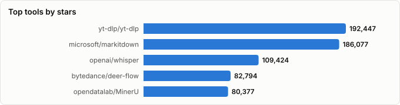
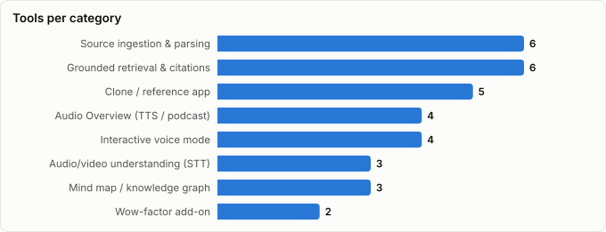

# Build Your Own NotebookLM — The Repo Stack for a Source-Grounded Notebook Clone

> Derived from **kaiser-data**'s 2,243 starred repos (snapshot `2026-09-25T10:37:19.717Z`), cross-referenced with the repo-similarity graph (2,243 nodes / 7,393 edges, 35 communities).
>
> Generated 2026-09-25 by `scripts/reports/notebooklm_stack.py` (regenerate any time — no API cost).

## Executive summary

- **Goal**: everything needed to build (and demo) your own NotebookLM — a source-grounded notebook with cited answers, an *Audio Overview* podcast generator, live voice interaction, and a mind-map view — from **33 repos already in your stars** (**1,412,712★** combined).
  - **Clone / reference app** (5): `anything-llm`, `DeepTutor`, `open-notebook`, `notebooklm-py`, `Dot`
  - **Source ingestion & parsing** (6): `yt-dlp`, `markitdown`, `MinerU`, `docling`, `unstructured`, `reader`
  - **Grounded retrieval & citations** (6): `llama_index`, `LightRAG`, `PageIndex`, `LEANN`, `lancedb`, `chonkie`
  - **Audio Overview (TTS / podcast)** (4): `TTS`, `VoxCPM`, `chatterbox`, `Qwen3-TTS`
  - **Audio/video understanding (STT)** (3): `whisper`, `faster-whisper`, `whisperX`
  - **Interactive voice mode** (4): `pipecat`, `agents`, `RealtimeSTT`, `fastrtc`
  - **Mind map / knowledge graph** (3): `graphrag`, `graphiti`, `cognee`
  - **Wow-factor add-on** (2): `deer-flow`, `screenpipe`
- The signature NotebookLM feature — the two-host **Audio Overview** — is fully reproducible with open TTS (`chatterbox`, `VoxCPM`) plus an LLM-written dialogue script; `open-notebook` proves the end-to-end shape already exists in OSS.
- Your unfair advantages over the real NotebookLM: **fully local/private** operation (`LEANN` + `supertonic` + `faster-whisper`), **clickable second-accurate audio citations** (`whisperX` word timestamps), **interruptible live podcasts** (`pipecat`), and **ambient source capture** (`screenpipe`).
- **Cost**: a commercial-ready clone runs **~$15–25/mo + pennies of usage** — Gemini Flash-Lite answers, Groq-hosted Whisper STT at $0.04/hr, and Gemini's *native two-host* TTS for the Audio Overview — or **$0** entirely on free tiers to prototype. The full free-vs-paid service menu and three ready-to-build stacks are below.

## Anatomy of a NotebookLM clone

| NotebookLM feature | What it needs | Tools in your stars |
|---|---|---|
| **Add sources** (PDF, docs, URLs, YouTube, audio) | parse anything → clean text | `markitdown`, `docling`, `MinerU`, `unstructured`, `reader`, `yt-dlp` |
| **Grounded chat with citations** | retrieval that keeps provenance | `llama_index`, `LightRAG`, `PageIndex`, `LEANN`, `chonkie`, `lancedb` |
| **Audio Overview** (podcast) | dialogue script → two distinct voices | `chatterbox`, `VoxCPM`, `Qwen3-TTS`, `TTS`, `supertonic` |
| **Audio/video sources** | transcribe + timestamp + diarize | `whisper`, `faster-whisper`, `whisperX` |
| **Interactive mode** (join the conversation) | realtime duplex voice | `pipecat`, `agents` (LiveKit), `fastrtc`, `RealtimeSTT` |
| **Mind map** | entity/topic graph over sources | `graphiti`, `graphrag`, `cognee` |
| **Beyond NotebookLM** | the demo-day differentiators | `deer-flow`, `screenpipe` |

## Master comparison

Sorted by stars. `Health`/`Lifecycle` are the dataset's computed metrics; `Activity` is derived from days-since-push + 90-day commits.

| Tool | Category | Lang | License | ★ Stars | Lifecycle | Health | Activity | Last push | Age | Contrib(90d) |
|---|---|---|---|---|---|---|---|---|---|---|
| [yt-dlp/yt-dlp](https://github.com/yt-dlp/yt-dlp) | Source ingestion & parsing | Python | Unlicense | 193,494 (▲1,047) | Classic | 81 | very active | 9d ago | 5.9y | 25 |
| [microsoft/markitdown](https://github.com/microsoft/markitdown) | Source ingestion & parsing | Python | MIT | 186,955 (▲878) | Hot | 93 | very active | 4d ago | 1.9y | 53 |
| [openai/whisper](https://github.com/openai/whisper) | Audio/video understanding (STT) | Python | MIT | 109,572 (▲148) | Mature | 47 | active | 25d ago | 4.0y | 3 |
| [bytedance/deer-flow](https://github.com/bytedance/deer-flow) | Wow-factor add-on | Python | MIT | 82,962 (▲168) | Hot | 87 | very active | 0d ago | 1.4y | 51 |
| [opendatalab/MinerU](https://github.com/opendatalab/MinerU) | Source ingestion & parsing | Python | NOASSERTION | 80,639 (▲262) | Mature | 80 | very active | 1d ago | 2.6y | 3 |
| [docling-project/docling](https://github.com/docling-project/docling) | Source ingestion & parsing | Python | MIT | 67,929 (▲438) | Mature | 96 | very active | 0d ago | 2.2y | 44 |
| [Mintplex-Labs/anything-llm](https://github.com/Mintplex-Labs/anything-llm) | Clone / reference app | JavaScript | MIT | 66,449 (▲155) | Classic | 84 | very active | 0d ago | 3.3y | 23 |
| [run-llama/llama_index](https://github.com/run-llama/llama_index) | Grounded retrieval & citations | Python | MIT | 52,312 (▲55) | Classic | 99 | very active | 0d ago | 3.9y | 60 |
| [coqui-ai/TTS](https://github.com/coqui-ai/TTS) | Audio Overview (TTS / podcast) | Python | MPL-2.0 | 46,062 (▲25) | Abandoned | 10 | stale | 2.1y ago | 6.4y | 0 |
| [HKUDS/DeepTutor](https://github.com/HKUDS/DeepTutor) | Clone / reference app | Python | Apache-2.0 | 40,278 (▲166) | Rising | 78 | very active | 1d ago | 9mo | 1 |
| [HKUDS/LightRAG](https://github.com/HKUDS/LightRAG) | Grounded retrieval & citations | Python | MIT | 39,849 (▲53) | Hot | 79 | very active | 0d ago | 2.0y | 13 |
| [lfnovo/open-notebook](https://github.com/lfnovo/open-notebook) | Clone / reference app | TypeScript | MIT | 39,479 (▲166) | Hot | 78 | very active | 5d ago | 1.9y | 21 |
| [OpenBMB/VoxCPM](https://github.com/OpenBMB/VoxCPM) | Audio Overview (TTS / podcast) | Python | Apache-2.0 | 37,967 (▲128) | Mature | 67 | active | 23d ago | 1.0y | 5 |
| [microsoft/graphrag](https://github.com/microsoft/graphrag) | Mind map / knowledge graph | Python | MIT | 36,097 (▲47) | Mature | 72 | very active | 1d ago | 2.5y | 4 |
| [VectifyAI/PageIndex](https://github.com/VectifyAI/PageIndex) | Grounded retrieval & citations | Python | MIT | 35,845 (▲58) | Hot | 77 | very active | 1d ago | 1.5y | 4 |
| [getzep/graphiti](https://github.com/getzep/graphiti) | Mind map / knowledge graph | Python | Apache-2.0 | 31,149 (▲102) | Mature | 74 | very active | 0d ago | 2.1y | 27 |
| [topoteretes/cognee](https://github.com/topoteretes/cognee) | Mind map / knowledge graph | Python | Apache-2.0 | 30,973 (▲93) | Classic | 83 | very active | 0d ago | 3.1y | 10 |
| [resemble-ai/chatterbox](https://github.com/resemble-ai/chatterbox) | Audio Overview (TTS / podcast) | Python | MIT | 26,550 (▲49) | Declining | 33 | slowing | 2mo ago | 1.4y | 1 |
| [SYSTRAN/faster-whisper](https://github.com/SYSTRAN/faster-whisper) | Audio/video understanding (STT) | Python | MIT | 25,555 (▲59) | Declining | 13 | stale | 10mo ago | 3.6y | 0 |
| [m-bain/whisperX](https://github.com/m-bain/whisperX) | Audio/video understanding (STT) | Python | BSD-2-Clause | 24,233 (▲71) | Mature | 58 | active | 26d ago | 3.8y | 1 |
| [screenpipe/screenpipe](https://github.com/screenpipe/screenpipe) | Wow-factor add-on | Rust | NOASSERTION | 21,696 (▲46) | Mature | 85 | very active | 0d ago | 2.3y | 6 |
| [teng-lin/notebooklm-py](https://github.com/teng-lin/notebooklm-py) | Clone / reference app | Python | MIT | 19,462 (▲53) | Hot | 80 | very active | 0d ago | 8mo | 3 |
| [pipecat-ai/pipecat](https://github.com/pipecat-ai/pipecat) | Interactive voice mode | Python | BSD-2-Clause | 15,849 (▲127) | Mature | 84 | very active | 0d ago | 2.7y | 8 |
| [Unstructured-IO/unstructured](https://github.com/Unstructured-IO/unstructured) | Source ingestion & parsing | HTML | Apache-2.0 | 15,485 (▲23) | Classic | 86 | very active | 0d ago | 4.0y | 15 |
| [livekit/agents](https://github.com/livekit/agents) | Interactive voice mode | Python | Apache-2.0 | 14,349 (▲53) | Mature | 99 | very active | 0d ago | 2.9y | 48 |
| [QwenLM/Qwen3-TTS](https://github.com/QwenLM/Qwen3-TTS) | Audio Overview (TTS / podcast) | Python | Apache-2.0 | 13,537 (▲56) | Declining | 23 | stale | 6mo ago | 8mo | 0 |
| [StarTrail-org/LEANN](https://github.com/StarTrail-org/LEANN) | Grounded retrieval & citations | Python | MIT | 12,961 (▲14) | Mature | 75 | very active | 2d ago | 1.3y | 15 |
| [jina-ai/reader](https://github.com/jina-ai/reader) | Source ingestion & parsing | TypeScript | Apache-2.0 | 12,043 (▲17) | Mature | 28 | slowing | 4mo ago | 2.5y | 0 |
| [lancedb/lancedb](https://github.com/lancedb/lancedb) | Grounded retrieval & citations | Rust | Apache-2.0 | 11,526 (▲41) | Classic | 92 | very active | 0d ago | 3.6y | 23 |
| [KoljaB/RealtimeSTT](https://github.com/KoljaB/RealtimeSTT) | Interactive voice mode | Python | MIT | 10,145 (▲7) | Classic | 66 | very active | 8d ago | 3.1y | 3 |
| [feyninc/chonkie](https://github.com/feyninc/chonkie) | Grounded retrieval & citations | Python | MIT | 4,770 (▲5) | Hot | 72 | very active | 7d ago | 1.5y | 4 |
| [gradio-app/fastrtc](https://github.com/gradio-app/fastrtc) | Interactive voice mode | JavaScript | MIT | 4,628 (▲2) | Declining | 18 | stale | 8mo ago | 2.0y | 0 |
| [alexpinel/Dot](https://github.com/alexpinel/Dot) | Clone / reference app | JavaScript | GPL-3.0 | 1,912 (▼2) | Abandoned | 1 | stale | 1.8y ago | 2.5y | 0 |

## By category

### Clone / reference app

_Working implementations of the notebook-LLM shape. Read their source before designing yours — `open-notebook` in particular is the map._

- **[Mintplex-Labs/anything-llm](https://github.com/Mintplex-Labs/anything-llm)** · 66,449★ · JavaScript · Classic  
  All-in-one private 'chat with your documents' app — the closest mature product shape to a notebook LLM.  
  topics: rag, localai, vector-database, llm, ai-agents, multimodal, agent-harness, agentic-ai
- **[HKUDS/DeepTutor](https://github.com/HKUDS/DeepTutor)** · 40,278★ · Python · Rising  
  Agent-native personalized tutoring over documents — a 'NotebookLM as teacher' angle worth stealing.  
  topics: ai-tutor, deepresearch, interactive-learning, multi-agent-systems, rag, ai-agents, cli-tool, clawbot
- **[lfnovo/open-notebook](https://github.com/lfnovo/open-notebook)** · 39,479★ · TypeScript · Hot  
  An actual OSS NotebookLM implementation — notebooks, sources, podcast generation. Study it before writing a line.  
  topics: assistant, learning, note-taking, notebook, notes-app, self-learning
- **[teng-lin/notebooklm-py](https://github.com/teng-lin/notebooklm-py)** · 19,462★ · Python · Hot  
  Unofficial Python API for the real NotebookLM — benchmark your clone against the original programmatically.  
  topics: python, sdk, skills, google-notebooklm, notebooklm, notebooklm-api, python-api, agentic-skill
- **[alexpinel/Dot](https://github.com/alexpinel/Dot)** · 1,912★ · JavaScript · Abandoned  
  Tiny fully-local docs+RAG+TTS desktop app — proof the whole loop runs on one laptop.  
  topics: embeddings, llm, local, rag, standalone, standalone-app, document-chat, faiss

### Source ingestion & parsing

_The 'add source' button. NotebookLM's magic starts with accepting *anything*; these tools normalize PDFs, Office docs, URLs, and media into clean text._

- **[yt-dlp/yt-dlp](https://github.com/yt-dlp/yt-dlp)** · 193,494★ · Python · Classic  
  The YouTube/audio/video downloader — feeds media sources into your STT stage.  
  topics: youtube-dl, python, sponsorblock, yt-dlp, youtube-downloader, cli, downloader
- **[microsoft/markitdown](https://github.com/microsoft/markitdown)** · 186,955★ · Python · Hot  
  One converter for Office/PDF/anything → Markdown; the fastest path to 'add any source'.  
  topics: langchain, openai, autogen-extension, autogen, markdown, microsoft-office, pdf
- **[opendatalab/MinerU](https://github.com/opendatalab/MinerU)** · 80,639★ · Python · Mature  
  Heavy-duty PDF/Office → LLM-ready markdown/JSON with layout understanding for hard documents.  
  topics: extract-data, layout-analysis, ocr, parser, pdf, pdf-converter, python, document-analysis
- **[docling-project/docling](https://github.com/docling-project/docling)** · 67,929★ · Python · Mature  
  IBM's document conversion for gen-AI — tables, layout, OCR; the quality choice for PDF sources.  
  topics: ai, convert, documents, pdf, tables, document-parser, document-parsing, docx
- **[Unstructured-IO/unstructured](https://github.com/Unstructured-IO/unstructured)** · 15,485★ · HTML · Classic  
  Production ETL for messy documents → clean, chunk-ready elements.  
  topics: deep-learning, document-parsing, machine-learning, nlp, ocr, information-retrieval, data-pipelines, ml
- **[jina-ai/reader](https://github.com/jina-ai/reader)** · 12,043★ · TypeScript · Mature  
  Any URL → LLM-friendly text via r.jina.ai — instant 'add a website as source'.  
  topics: llm, proxy

### Grounded retrieval & citations

_The core contract of a notebook LLM: answers cite the exact source passage. Retrieval must preserve provenance, not just find relevant chunks._

- **[run-llama/llama_index](https://github.com/run-llama/llama_index)** · 52,312★ · Python · Classic  
  Document-agent framework with citation query engines — the reference toolkit for source-grounded answers.  
  topics: agents, application, data, fine-tuning, framework, llamaindex, llm, rag
- **[HKUDS/LightRAG](https://github.com/HKUDS/LightRAG)** · 39,849★ · Python · Hot  
  Fast GraphRAG over chunks — multi-hop answers across sources, still simple to run.  
  topics: knowledge-graph, large-language-models, retrieval-augmented-generation, genai, graphrag, llm, rag, gpt
- **[VectifyAI/PageIndex](https://github.com/VectifyAI/PageIndex)** · 35,845★ · Python · Hot  
  Vectorless reasoning-based retrieval over a document tree — page-level citations fall out naturally.  
  topics: agentic-ai, agents, ai, ai-agents, context-engineering, llm, rag, reasoning
- **[StarTrail-org/LEANN](https://github.com/StarTrail-org/LEANN)** · 12,961★ · Python · Mature  
  ~97% smaller index — the trick that makes a fully-local notebook on a laptop plausible.  
  topics: ai, faiss, langchain, llama-index, llm, localstorage, offline-first, ollama
- **[lancedb/lancedb](https://github.com/lancedb/lancedb)** · 11,526★ · Rust · Classic  
  Embedded serverless vector DB — zero-ops storage that ships inside your app.  
  topics: approximate-nearest-neighbor-search, image-search, nearest-neighbor-search, recommender-system, search-engine, semantic-search, similarity-search, vector-database
- **[feyninc/chonkie](https://github.com/feyninc/chonkie)** · 4,770★ · Python · Hot  
  Lightweight chunking with many strategies — the quality lever for retrieval and citation granularity.  
  topics: rag, chonkie, chunker, chunking-algorithm, retrieval-systems, semantic-chunker, similarity-search, text-splitter

### Audio Overview (TTS / podcast)

_The feature that made NotebookLM famous. An LLM writes a two-host dialogue from the sources; TTS renders each host with a distinct voice._

- **[coqui-ai/TTS](https://github.com/coqui-ai/TTS)** · 46,062★ · Python · Abandoned  
  Battle-tested TTS toolkit (XTTS voice cloning) — huge ecosystem, but check the maintenance signal below.  
  topics: python, text-to-speech, deep-learning, speech, pytorch, tts, vocoder, tacotron
- **[OpenBMB/VoxCPM](https://github.com/OpenBMB/VoxCPM)** · 37,967★ · Python · Mature  
  Tokenizer-free multilingual TTS with creative voice design — distinctive hosts nobody else's demo has.  
  topics: audio, deeplearning, minicpm, python, pytorch, speech, speech-synthesis, text-to-speech
- **[resemble-ai/chatterbox](https://github.com/resemble-ai/chatterbox)** · 26,550★ · Python · Declining  
  SoTA open TTS with emotion control — the two-host podcast voice pair.  
  topics: —
- **[QwenLM/Qwen3-TTS](https://github.com/QwenLM/Qwen3-TTS)** · 13,537★ · Python · Declining  
  Open TTS model series from Qwen — strong multilingual coverage for non-English Audio Overviews.  
  topics: —

### Audio/video understanding (STT)

_Podcasts, lectures, and YouTube links as *input* sources — plus word-level timestamps so audio can be cited like a page number._

- **[openai/whisper](https://github.com/openai/whisper)** · 109,572★ · Python · Mature  
  The reference open speech recognition — turns audio/video sources into searchable text.  
  topics: —
- **[SYSTRAN/faster-whisper](https://github.com/SYSTRAN/faster-whisper)** · 25,555★ · Python · Declining  
  CTranslate2 Whisper, ~4x faster — the practical engine for bulk source transcription.  
  topics: deep-learning, inference, quantization, speech-recognition, speech-to-text, transformer, whisper, openai
- **[m-bain/whisperX](https://github.com/m-bain/whisperX)** · 24,233★ · Python · Mature  
  Word-level timestamps + diarization — the ingredient for clickable, second-accurate audio citations.  
  topics: asr, speech, speech-recognition, speech-to-text, whisper

### Interactive voice mode

_NotebookLM lets you 'join' the audio overview. These realtime voice frameworks make interruption and follow-up questions feel live._

- **[pipecat-ai/pipecat](https://github.com/pipecat-ai/pipecat)** · 15,849★ · Python · Mature  
  Voice/multimodal conversation pipelines — the frame for 'interrupt the podcast and ask a question'.  
  topics: ai, real-time, voice, voice-assistant, chatbot-framework, chatbots
- **[livekit/agents](https://github.com/livekit/agents)** · 14,349★ · Python · Mature  
  Realtime voice agents on WebRTC — production-grade live rooms for your notebook.  
  topics: ai, real-time, voice, video, agents, openai
- **[KoljaB/RealtimeSTT](https://github.com/KoljaB/RealtimeSTT)** · 10,145★ · Python · Classic  
  Low-latency streaming STT with voice-activity detection — makes barge-in feel instant.  
  topics: python, realtime, speech-to-text
- **[gradio-app/fastrtc](https://github.com/gradio-app/fastrtc)** · 4,628★ · JavaScript · Declining  
  Realtime audio/video streams in a few lines of Python — the fastest demo path to live voice.  
  topics: artificial-intelligence, llm, python, real-time, speech-to-text, text-to-speech, hacktoberfest, hacktoberfest2025

### Mind map / knowledge graph

_NotebookLM renders mind maps of your sources; a knowledge graph over extracted entities gives you the same view — and a navigable one._

- **[microsoft/graphrag](https://github.com/microsoft/graphrag)** · 36,097★ · Python · Mature  
  Entity graph + community summaries over a corpus — auto-generated topic maps per notebook.  
  topics: graphrag, rag, llm, llms, gpt, gpt-4, gpt4
- **[getzep/graphiti](https://github.com/getzep/graphiti)** · 31,149★ · Python · Mature  
  Real-time knowledge graphs over your sources — the live mind-map data structure.  
  topics: agents, graph, llms, rag
- **[topoteretes/cognee](https://github.com/topoteretes/cognee)** · 30,973★ · Python · Classic  
  AI memory platform building a queryable graph — notebook memory that persists across sessions.  
  topics: ai, cognitive-architecture, vector-database, ai-agents, graph-database, ai-memory, cognitive-memory, knowledge

### Wow-factor add-on

_Add-ons the original doesn't have — the reason a jury remembers *your* clone._

- **[bytedance/deer-flow](https://github.com/bytedance/deer-flow)** · 82,962★ · Python · Hot  
  Deep-research superagent that already ships podcast creation — 'research the web, then generate the episode'.  
  topics: agent, agentic, agentic-framework, agentic-workflow, ai, ai-agents, deep-research, langchain
- **[screenpipe/screenpipe](https://github.com/screenpipe/screenpipe)** · 21,696★ · Rust · Mature  
  Records everything you see/say/hear — ambient auto-captured sources no cloud NotebookLM can offer.  
  topics: ai, computer-vision, llm, machine-learning, multimodal, agents, agi, audio-recording

## Demo blueprints — three stacks, pick your ambition

Each blueprint is a minimal, coherent pipeline; every tool is in the tables above.

### Weekend prototype

**Ingest** `markitdown` → **Retrieve** `LightRAG` → **Store** `lancedb` → **Audio Overview** `chatterbox` → **UI / voice** `fastrtc`

### Show-stopper demo

**Ingest** `docling` → **Cited answers** `PageIndex` → **Audio sources** `whisperX` → **Podcast voices** `VoxCPM` → **Join-the-podcast** `pipecat` → **Mind map** `graphiti`

### Fully local / private

**Ingest** `markitdown` → **Tiny index** `LEANN` → **STT** `faster-whisper` → **On-device TTS** `neutts` → **Reference** `Dot`

- **Weekend prototype** — one converter, one RAG engine, one embedded store, one TTS, one UI library. Upload a PDF, chat with citations, press *Generate Audio Overview*, get a two-host episode. All Python, no infra.
- **Show-stopper demo** — the three moments that land: (1) click a citation in an *audio* source and playback jumps to the exact second (`whisperX` word timestamps); (2) *interrupt the generated podcast mid-sentence* and ask a follow-up — the hosts answer from your sources (`pipecat` duplex voice); (3) the mind map (`graphiti`) reorganizes live as sources are added.
- **Fully local / private** — the anti-cloud pitch: `LEANN`'s ~97% smaller index plus on-device ONNX TTS and `faster-whisper` means the entire notebook — sources, index, podcast — never leaves the laptop. `Dot` proves the packaging as a desktop app.

## Managed services — free tier vs. paid

The repos above are the *engine*; most builders wire each stage to a managed API to skip the ops. Below is the cheapest-viable menu per layer — **free tiers first, then the cheapest paid rate**. Every layer also has a `$0` self-hosted option (the OSS repos above). Prices are frozen research retrieved 2026-07-23 (see Methodology); `†` = aggregator-sourced (re-verify before budgeting), `⚠` = a free-tier catch that bites a shipped product.

### LLM — answers + podcast-script generation (per 1M tokens)

| Service | Free tier | Paid (cheapest) | Note |
|---|---|---|---|
| Google Gemini 2.5 Flash-Lite | Yes — free tier (rate-limited) | $0.10 in / $0.40 out | Cheapest quality tier with a real free tier — the default pick for high-volume script generation |
| Google Gemini 2.5 Flash | Yes — free tier | $0.30 / $2.50 | Higher quality, large context when answers need it |
| OpenAI GPT-5.4 nano | No API free tier | $0.20 / $1.25 | Cheapest OpenAI tier |
| Anthropic Claude Haiku 4.5 | No API free tier | $1.00 / $5.00 | Best instruction-following in the cheap tier — strong grounded RAG answers |
| Groq (Llama 3.3 70B) | Yes — free, no card (rate-limited) | ~$0.59 / $0.79 † | Fastest inference (LPU, 500+ tok/s) — low-latency chat |
| DeepSeek V4-Flash | No standing free tier | ~$0.14 / $0.28 † | Very cheap, 1M context, aggressive context-cache discounts |
| OpenRouter | Yes — `:free` model variants ($0 in/out) | passthrough at list price | One key across 28+ free models — ideal fallback router |

### Embeddings — vector search (per 1M tokens)

| Service | Free tier | Paid (cheapest) | Note |
|---|---|---|---|
| Local bge / nomic (via Ollama) | $0 (self-hosted) | $0 | No API cost, no rate limits, full privacy — you pay only in compute |
| Jina embeddings v3 | 10M free tokens (non-commercial) | $0.02 | Cheapest hosted rate; strong price/perf |
| Voyage voyage-4-lite | 200M free tokens | $0.02 | High retrieval quality; the 200M free allotment is the standout |
| OpenAI text-embedding-3-small | No | $0.02 (batch $0.01) | 1536-dim, solid default, input-only billing |
| Cohere Embed v4 | Trial key only (1k calls/mo) | $0.12 † | Multimodal text+image, multilingual |
| Google Gemini embeddings | Yes — free tier | $0.15 † | Top MTEB quality; free tier attractive for prototypes |

### Vector database — storage + similarity search

| Service | Free tier | Paid (cheapest) | Note |
|---|---|---|---|
| LanceDB / Chroma (embedded) | $0 (in-process, no server) | $0 | Zero infra — ships inside the app; ideal for single-node/desktop RAG |
| Zilliz Cloud (Milvus) | Free ~1M 768-dim vectors, 5 GB | $4 / 1M vCU † | Largest free vector allotment; serverless scales to zero |
| Qdrant Cloud | Free-forever 1-node cluster (1 GB) | ~$30–57/mo † | Free tier genuinely usable for small prod; fast Rust engine |
| Pinecone (serverless) | Starter: 2 GB, ~300k–1.5M vectors | usage-based, no monthly min | Fully serverless, zero-ops; free tier has no latency SLA |
| Supabase (pgvector) | Free 500 MB (pauses when idle) | $25/mo Pro | pgvector included free; folds DB+auth+storage into one backend |
| Weaviate Cloud | Sandbox — 14-day auto-expiry ⚠ | $45/mo min † | Strong hybrid search, but sandbox expiry rules it out of a durable free stack |

### Speech-to-text — audio/video sources → text (per hour of audio)

| Service | Free tier | Paid (cheapest) | Note |
|---|---|---|---|
| faster-whisper (self-host) | $0 (own GPU) | $0 | Word timestamps; add pyannote/whisperX for diarization |
| Groq (hosted Whisper Turbo) | Yes — free, no card (rate-limited) | $0.04/hr | ~6–9× cheaper than rivals; no built-in diarization |
| Google STT (Dynamic Batch) | 60 min/mo free + $300 credit | ~$0.24/hr † | Word timestamps + diarization supported |
| AssemblyAI | $50 free credits (~238 hr) | $0.15/hr + $0.02 diarization | Diarization out of the box — the value pick when you need speaker labels |
| Deepgram Nova-3 | $200 free credit, no card | ~$0.26/hr batch † | Timestamps + diarization; confirm batch vs. streaming rate on live page |
| OpenAI Whisper API | No free tier | $0.36/hr (whisper-1) | Word timestamps; no native diarization |

### Text-to-speech — the two-host Audio Overview (per 1M characters)

| Service | Free tier | Paid (cheapest) | Note |
|---|---|---|---|
| Kokoro / Chatterbox / XTTS (self-host) | $0 (own GPU) | $0 | Kokoro punches far above its size; XTTS does multi-speaker + cloning |
| Google Gemini 2.5 Flash TTS | Yes — free tier | token-based (~$40/1M chars †) | The ONLY listed API with native two-host multi-speaker — exactly NotebookLM's Audio Overview |
| OpenAI TTS (tts-1) | No free tier | $15/1M chars | Good quality; one voice per request — stitch turns yourself |
| Deepgram Aura-2 | Shares $200 credit | $30/1M chars | Fast, real-time; single speaker |
| ElevenLabs | 10k chars/mo — NON-COMMERCIAL + attribution ⚠ | Starter $5/mo (~$167/1M) | Best-in-class voice quality; Starter is the entry point that grants a commercial license |
| Cartesia (Sonic) | 20k credits/mo — non-commercial ⚠ | usage-based to $299/mo | Very low latency; free tier can't be monetized |

### Hosting — web app + (optional) serverless GPU

| Service | Free tier | Paid (cheapest) | Note |
|---|---|---|---|
| Hugging Face Spaces | Free CPU + community ZeroGPU quota | PRO $9/mo | Demo the whole app + open model on one free host |
| Render | Permanent free web + free Postgres | ~$7/mo | Only major PaaS with a real always-on free tier (spins down when idle) |
| Vercel | Hobby — NON-COMMERCIAL only ⚠ | Pro $20/user/mo | Hobby prohibits commercial use; Pro to ship |
| Netlify | Credit-based (300 credits/mo) | usage-based | Model recently shifted to credits — verify current value |
| Beam (serverless GPU) | $30/mo free credits | A100 80GB $1.30/hr · H100 $1.74/hr | Cheapest listed GPU; pay-per-ms, no cold-start charge |
| Modal (serverless GPU) | $30/mo free credits, no card | H100 ~$3.95/hr · A100 ~$2.5–2.8/hr | Scale-to-zero; up to $25k startup credits |

## The payable stack — fast, low-cost, feature-rich

Three concrete builds, cheapest first. Each pairs the OSS repos with the leanest managed services; **costs are rough monthly estimates at demo / early-user volume** (per-use API spend is extra but typically pennies at this scale).

### Free prototype — $0 / mo

_Everything on free tiers. Non-commercial limits and rate caps apply — perfect for building and demoing, not for shipping revenue._

| Layer | Pick |
|---|---|
| **LLM** | Gemini 2.5 Flash-Lite (free tier) |
| **Embeddings** | Gemini embeddings (free) or Voyage (200M free tokens) |
| **Vector DB** | Qdrant free cluster / Zilliz free (~1M vectors) |
| **STT** | Groq Whisper Turbo (free, rate-limited) |
| **TTS (2-host)** | Gemini 2.5 Flash TTS (native multi-speaker, free tier) |
| **Host** | Render free / HF Spaces free |
| **OSS glue** | `open-notebook` · `markitdown` · `LightRAG` · `whisperX` |
| **Est. cost** | **$0 / mo** |

### Low-cost commercial stack  ⭐ recommended — ~$15–25 / mo + usage

_The fast, cheap, feature-rich answer: cited RAG plus a native two-host Audio Overview, commercial-licensed, at coffee-money cost + pennies of per-use API spend._

| Layer | Pick |
|---|---|
| **LLM** | Gemini 2.5 Flash-Lite ($0.10/$0.40) |
| **Embeddings** | Voyage voyage-4-lite / Jina v3 ($0.02/1M) — or local `bge` ($0) |
| **Vector DB** | Zilliz serverless ($4/1M vCU, scale-to-zero) — or `lancedb` embedded ($0) |
| **STT** | Groq Whisper Turbo ($0.04/hr) |
| **TTS (2-host)** | Gemini 2.5 Flash TTS (native 2-host) — or ElevenLabs Starter $5/mo for premium voices |
| **Host** | Render $7/mo (or HF Spaces PRO $9/mo) |
| **OSS glue** | `open-notebook` · `docling`/`markitdown` · `PageIndex` (cited) · `whisperX` (timestamped citations) |
| **Est. cost** | **~$15–25 / mo + usage** |

### Private / near-zero-marginal — ~$0–30 / mo

_All-open, self-hosted models; managed API spend optional. The anti-cloud pitch — sources, index, and podcast never leave your infra._

| Layer | Pick |
|---|---|
| **LLM** | Local via Ollama, or a cheap API fallback |
| **Embeddings** | `bge` / `nomic` via Ollama ($0) |
| **Vector DB** | `lancedb` / Chroma (embedded, $0) |
| **STT** | `faster-whisper` (self-host, $0) |
| **TTS (2-host)** | `chatterbox` / Kokoro / Coqui `XTTS` (self-host, $0) |
| **GPU** | Beam or Modal serverless ($30/mo free credits; A100 ~$1.30–2.80/hr) |
| **OSS glue** | `Dot` · `LEANN` (tiny index) · `supertonic` · `faster-whisper` |
| **Est. cost** | **~$0–30 / mo** |

**Cost gotchas that bite a shipped product:**

- **ElevenLabs & Cartesia free tiers are non-commercial + attribution-required** — you need at least ElevenLabs Starter ($5/mo) to monetize. Or use **Gemini 2.5 Flash TTS**, the only listed API with *native two-host* generation matching the Audio Overview.
- **Vercel Hobby prohibits commercial use**; **Render** is the only major PaaS with a real always-on free tier. Netlify moved to a credit-based free tier — check the current value.
- **Groq STT has no built-in diarization** — add self-hosted `whisperX`/pyannote for speaker labels, or step up to AssemblyAI ($0.15 + $0.02/hr).
- Free vector tiers expire or pause: **Weaviate sandbox = 14 days**, **Supabase pauses after ~1 week idle**. **Qdrant** and **Zilliz** free tiers are the durable choices.
- The cheapest *marginal* cost is all-open on your own GPU: **Beam/Modal $30/mo free credits** cover a low-volume clone at essentially $0 until traffic grows.

## Graph analysis — how they relate

**Community clustering.** These 33 tools span **15 of the graph's 35 communities**.

- **Community 6** (5): `feyninc/chonkie`, `pipecat-ai/pipecat`, `livekit/agents`, `getzep/graphiti`, `topoteretes/cognee`
- **Community 8** (4): `Mintplex-Labs/anything-llm`, `VectifyAI/PageIndex`, `StarTrail-org/LEANN`, `lancedb/lancedb`
- **Community 13** (3): `teng-lin/notebooklm-py`, `docling-project/docling`, `Unstructured-IO/unstructured`
- **Community 2** (3): `run-llama/llama_index`, `resemble-ai/chatterbox`, `bytedance/deer-flow`
- **Community 10** (3): `OpenBMB/VoxCPM`, `coqui-ai/TTS`, `gradio-app/fastrtc`
- **Community 15** (2): `HKUDS/DeepTutor`, `HKUDS/LightRAG`
- **Community 5** (2): `alexpinel/Dot`, `jina-ai/reader`
- **Community 7** (2): `microsoft/markitdown`, `microsoft/graphrag`
- **Community 20** (2): `openai/whisper`, `KoljaB/RealtimeSTT`
- **Community 4** (2): `SYSTRAN/faster-whisper`, `m-bain/whisperX`

**Centrality (PageRank in the full 2,243-repo graph)** — most 'hub-like' picks in your ecosystem:

- `m-bain/whisperX` — PageRank 0.0019
- `run-llama/llama_index` — PageRank 0.0014
- `VectifyAI/PageIndex` — PageRank 0.0011
- `microsoft/graphrag` — PageRank 0.0009
- `opendatalab/MinerU` — PageRank 0.0008
- `lancedb/lancedb` — PageRank 0.0006
- `jina-ai/reader` — PageRank 0.0006
- `HKUDS/DeepTutor` — PageRank 0.0006
- `StarTrail-org/LEANN` — PageRank 0.0005
- `HKUDS/LightRAG` — PageRank 0.0005

**Direct links between stack picks** (top similarity edges where both endpoints are in this report):

- `HKUDS/DeepTutor` ⇄ `HKUDS/LightRAG` (w=0.603) — topics: rag
- `livekit/agents` ⇄ `pipecat-ai/pipecat` (w=0.420) — topics: ai, real-time, voice; authors: YaoxinHuang
- `OpenBMB/VoxCPM` ⇄ `coqui-ai/TTS` (w=0.370) — topics: python, pytorch, speech, speech-synthesis
- `m-bain/whisperX` ⇄ `SYSTRAN/faster-whisper` (w=0.350) — topics: speech-recognition, speech-to-text, whisper
- `opendatalab/MinerU` ⇄ `docling-project/docling` (w=0.286) — topics: pdf, pdf-converter, docx, pptx; authors: github-actions[bot]
- `VectifyAI/PageIndex` ⇄ `Mintplex-Labs/anything-llm` (w=0.227) — topics: agentic-ai, ai-agents, llm, rag
- `KoljaB/RealtimeSTT` ⇄ `gradio-app/fastrtc` (w=0.222) — topics: python, speech-to-text
- `Unstructured-IO/unstructured` ⇄ `docling-project/docling` (w=0.207) — topics: document-parsing, pdf-to-text, pdf, pdf-to-json
- `VectifyAI/PageIndex` ⇄ `topoteretes/cognee` (w=0.198) — topics: ai, ai-agents, context-engineering, vector-database
- `StarTrail-org/LEANN` ⇄ `alexpinel/Dot` (w=0.148) — topics: faiss, langchain, llm, rag
- `Mintplex-Labs/anything-llm` ⇄ `alexpinel/Dot` (w=0.121) — topics: rag, llm

## Maintenance & risk signal

Bus factor = commit concentration (1 = single-maintainer risk). Pair with lifecycle + activity before adopting — TTS projects in particular have a history of going quiet.

| Tool | Health | Lifecycle | Activity | Bus factor | Top-author share | Releases |
|---|---|---|---|---|---|---|
| run-llama/llama_index | 99 | Classic | very active | 12 | 13% | 497 |
| livekit/agents | 99 | Mature | very active | 7 | 13% | 373 |
| docling-project/docling | 96 | Mature | very active | 10 | 9% | 217 |
| microsoft/markitdown | 93 | Hot | very active | 8 | 26% | 23 |
| lancedb/lancedb | 92 | Classic | very active | 4 | 21% | 515 |
| bytedance/deer-flow | 87 | Hot | very active | 12 | 6% | 2 |
| Unstructured-IO/unstructured | 86 | Classic | very active | 4 | 21% | 241 |
| screenpipe/screenpipe | 85 | Mature | very active | 2 | 36% | 486 |
| Mintplex-Labs/anything-llm | 84 | Classic | very active | 2 | 34% | 36 |
| pipecat-ai/pipecat | 84 | Mature | very active | 2 | 38% | 121 |
| topoteretes/cognee | 83 | Classic | very active | 2 | 42% | 150 |
| yt-dlp/yt-dlp | 81 | Classic | very active | 2 | 39% | 136 |
| teng-lin/notebooklm-py | 80 | Hot | very active | 1 | 95% | 29 |
| opendatalab/MinerU | 80 | Mature | very active | 1 | 87% | 194 |
| HKUDS/LightRAG | 79 | Hot | very active | 1 | 50% | 83 |
| lfnovo/open-notebook | 78 | Hot | very active | 1 | 52% | 42 |
| HKUDS/DeepTutor | 78 | Rising | very active | 1 | 100% | 83 |
| VectifyAI/PageIndex | 77 | Hot | very active | 1 | 51% | 17 |
| StarTrail-org/LEANN | 75 | Mature | very active | 4 | 21% | 29 |
| getzep/graphiti | 74 | Mature | very active | 1 | 55% | 200 |
| feyninc/chonkie | 72 | Hot | very active | 1 | 92% | 45 |
| microsoft/graphrag | 72 | Mature | very active | 1 | 56% | 43 |
| OpenBMB/VoxCPM | 67 | Mature | active | 2 | 42% | 14 |
| KoljaB/RealtimeSTT | 66 | Classic | very active | 1 | 94% | 47 |
| m-bain/whisperX | 58 | Mature | active | 1 | 100% | 44 |
| openai/whisper | 47 | Mature | active | 2 | 33% | 13 |
| resemble-ai/chatterbox | 33 | Declining | slowing | 1 | 100% | 1 |
| jina-ai/reader | 28 | Mature | slowing | 0 | 0% | 0 |
| QwenLM/Qwen3-TTS | 23 | Declining | stale | 0 | 0% | 0 |
| gradio-app/fastrtc | 18 | Declining | stale | 0 | 0% | 22 |
| SYSTRAN/faster-whisper | 13 | Declining | stale | 0 | 0% | 21 |
| coqui-ai/TTS | 10 | Abandoned | stale | 0 | 0% | 98 |
| alexpinel/Dot | 1 | Abandoned | stale | 0 | 0% | 4 |

## Which one should you use?

| If you want… | Start with | Why |
|---|---|---|
| A working reference before you build | `lfnovo/open-notebook` | OSS NotebookLM implementation — the feature map and the pitfalls, already solved once. |
| One 'add any source' button | `microsoft/markitdown` | Single dependency converts Office/PDF/HTML to Markdown; upgrade to `docling`/`MinerU` for hard PDFs. |
| Cited answers with page-level provenance | `VectifyAI/PageIndex` | Vectorless tree retrieval keeps document structure — citations point at real pages. |
| Multi-hop questions across many sources | `HKUDS/LightRAG` | GraphRAG index over chunks; still light enough for a demo box. |
| The two-host podcast voices | `resemble-ai/chatterbox` (or `OpenBMB/VoxCPM`) | SoTA open TTS with emotion control; VoxCPM adds creative voice *design*. |
| Audio sources you can cite by the second | `m-bain/whisperX` | Word-level timestamps + diarization — click a citation, playback jumps there. |
| 'Join the conversation' live | `pipecat-ai/pipecat` | Duplex voice pipelines with interruption handling; `fastrtc` if you want it in 20 lines. |
| The mind-map view | `getzep/graphiti` | Real-time knowledge graph that updates as sources arrive. |
| Everything offline on a laptop | `StarTrail-org/LEANN` + `neuphonic/neutts` | Tiny index + compact on-device TTS — the private-notebook pitch NotebookLM can't make. (`supertonic` filled this slot until it was archived upstream.) |
| A demo nobody else has | `screenpipe/screenpipe` | Ambient screen/audio capture auto-feeds your notebook — sources add themselves. |

## Adjacent (deliberately not listed as stack picks)

- **infiniflow/ragflow** (91,284★) — batteries-included RAG *engine* — covered in the RAG-tooling report; too opinionated to embed in your own app shell
- **open-webui/open-webui** (153,123★) — general chat UI over Ollama/OpenAI — a chat product, not a source-grounded notebook
- **qdrant/qdrant** (34,809★) — excellent vector DB, but a server to operate — `lancedb` keeps the demo self-contained (see RAG report for the full DB landscape)
- **jamiepine/voicebox** (55,653★) — voice *studio* app — covered in the voice-agents report
- **Zackriya-Solutions/meetily** (31,095★) — meeting assistant — covered in the meeting-transcription report
- **suno-ai/bark** (39,274★) — generative audio pioneer, now largely superseded by the TTS picks above
- **NirDiamant/RAG_Techniques** (29,595★) — tutorial collection — great study material, not a dependency

## Methodology & caveats

- **Source**: `data/classified.json` + `public/data/graph.json`. No external calls; fully reproducible.
- **Selection**: keyword scan (notebook / notebooklm / podcast / tts / speech / pdf / document / parse / rag / retrieval / knowledge graph / voice / transcri…) + manual curation into the NotebookLM feature anatomy. Vector-DB, voice-agent, and meeting-transcription landscapes have their own reports; overlaps were routed there (see above).
- **Managed-service pricing** is frozen research retrieved 2026-07-23 via web search across vendor pricing pages and 2026 pricing trackers. Only Gemini, OpenAI, and Claude figures were confirmed against first-party pages; others (`†`) are aggregator-sourced — directionally consistent but re-verify on the vendor's own page before committing a budget, as model names and tiers churn monthly. Sources include ai.google.dev, developers.openai.com, the Anthropic model catalog, qdrant.tech, zilliz.com, elevenlabs.io, deepgram.com, assemblyai.com, beam.cloud, and render.com (all 2026-07). Like the benchmark evidence in sibling reports, these figures are frozen text and do **not** refresh with `build_index.py`.
- **Metrics** (health, lifecycle, bus_factor) are precomputed at snapshot time and may lag GitHub's current state.
- Re-run after a fresh `classified.json` to refresh stars/activity; re-verify service pricing manually on major model/tool releases.

### Retired from the scored set

Archived upstream, so they no longer appear in this report's tables — `sample.mjs` excludes archived repos. Metrics are frozen at the date shown and are not refreshed.

| Project | Category | Why it left | Metrics as of |
|---|---|---|---|
| [`supertone-inc/supertonic`](https://github.com/supertone-inc/supertonic) | Audio Overview (TTS / podcast) | Archived upstream 2026-09 and renamed to `supertone-oss-archive/supertonic`; last in the dataset 2026-09-06. On-device ONNX TTS — still usable, no longer developed. | 2026-09-06 |

Tools covered: 33 · Snapshot: 2026-09-25T10:37:19.717Z
