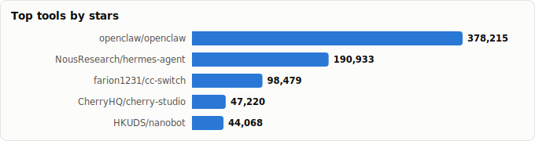
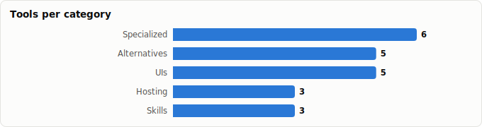

# OpenClaw Ecosystem — What to Use Now

> Derived from **kaiser-data**'s 1,341 starred repos (snapshot `2026-07-19T22:39:07.967Z`), cross-referenced with the repo-similarity graph (1,341 nodes / 4,341 edges, 28 communities).
>
> Generated 2026-07-19 by `scripts/reports/openclaw_ecosystem.py` (regenerate any time — no API cost).

> **What is OpenClaw?** A personal AI assistant (🦞, formerly *Clawdbot* / *Moltbot*) that runs on any OS/platform. It has spawned a fast-moving ecosystem of runtimes, skills, routers, memory layers, dashboards, and specialized agents — this report maps the parts in your stars and flags what's worth adopting **now**.

## Recommended stack (use now)

Opinionated picks — filtered for **healthy + actively maintained** (high health score, recent pushes). See the risk table below for what to avoid.

| Layer | Pick | ★ | Health | Why |
|---|---|---|---|---|
| Core assistant | [openclaw/openclaw](https://github.com/openclaw/openclaw) | 383,486 (▲735) | 79 | The OpenClaw assistant itself — your own personal AI, any OS/platform. Everything else extends this. |
| Secure runtime | [nanocoai/nanoclaw](https://github.com/nanocoai/nanoclaw) | 30,290 (▲75) | 69 | Lightweight OpenClaw alternative that runs in containers for security; WhatsApp/Telegram/Slack connectors. |
| Serverless host | [cloudflare/moltworker](https://github.com/cloudflare/moltworker) | 9,925 (▲9) | 29 | Run OpenClaw on Cloudflare Workers (serverless edge). |
| Skills directory | [openclaw/clawhub](https://github.com/openclaw/clawhub) | 9,180 (▲39) | 80 | The official skill directory for OpenClaw. |
| LLM router | [BlockRunAI/ClawRouter](https://github.com/BlockRunAI/ClawRouter) | 6,660 (▲8) | 77 | Agent-native LLM router for OpenClaw — 41+ models, <1ms routing, on-chain payments. |
| Memory | [TencentCloud/TencentDB-Agent-Memory](https://github.com/TencentCloud/TencentDB-Agent-Memory) | 9,126 (▲408) | 80 | Fully-local long-term memory (4-tier pipeline); ships as an OpenClaw plugin. |
| Observability | [vivekchand/clawmetry](https://github.com/vivekchand/clawmetry) | 390 (▲3) | 79 | Real-time observability dashboard — 'see your agent think' (OpenTelemetry). |
| Desktop hub | [farion1231/cc-switch](https://github.com/farion1231/cc-switch) | 118,938 (▲2,393) | 76 | Cross-platform desktop hub for OpenClaw + Claude Code + Codex + Gemini CLI + Hermes. |

**One-liner:** keep `openclaw/openclaw` as the core; run it via **nanoclaw** (security) or **moltworker** (serverless); add **clawhub** skills, **ClawRouter** routing, and **clawmetry** observability. Want a fresh start? **zeroclaw-labs/zeroclaw** is the highest-health alternative you've starred.

## Master comparison

Sorted by stars. `Health`/`Lifecycle` are the dataset's computed metrics; `Activity` is derived from days-since-push + 90-day commits.

| Project | Category | Lang | ★ Stars | Lifecycle | Health | Activity | Last push | Bus factor |
|---|---|---|---|---|---|---|---|---|
| [openclaw/openclaw](https://github.com/openclaw/openclaw) | Core | TypeScript | 383,486 (▲735) | Hot | 79 | very active | 0d ago | 1 |
| [NousResearch/hermes-agent](https://github.com/NousResearch/hermes-agent) | Alternative agent / OS | Python | 217,226 (▲3,274) | Hot | 80 | very active | 0d ago | 2 |
| [farion1231/cc-switch](https://github.com/farion1231/cc-switch) | Desktop / orchestration | Rust | 118,938 (▲2,393) | Hot | 76 | very active | 1d ago | 1 |
| [CherryHQ/cherry-studio](https://github.com/CherryHQ/cherry-studio) | Desktop / orchestration | TypeScript | 48,762 (▲268) | Mature | 94 | very active | 0d ago | 4 |
| [HKUDS/nanobot](https://github.com/HKUDS/nanobot) | Alternative agent / OS | Python | 45,893 (▲566) | Hot | 78 | very active | 0d ago | 1 |
| [zeroclaw-labs/zeroclaw](https://github.com/zeroclaw-labs/zeroclaw) | Alternative agent / OS | Rust | 32,317 (▲76) | Hot | 94 | very active | 0d ago | 4 |
| [hesamsheikh/awesome-openclaw-usecases](https://github.com/hesamsheikh/awesome-openclaw-usecases) | Skills / directory | — | 31,528 (▲31) | Declining | 25 | slowing | 3mo ago | 0 |
| [iOfficeAI/AionUi](https://github.com/iOfficeAI/AionUi) | Desktop / orchestration | TypeScript | 30,447 (▲506) | Hot | 81 | very active | 1d ago | 2 |
| [nanocoai/nanoclaw](https://github.com/nanocoai/nanoclaw) | Hosting / secure runtime | TypeScript | 30,290 (▲75) | Hot | 69 | very active | 0d ago | 1 |
| [HKUDS/DeepTutor](https://github.com/HKUDS/DeepTutor) | Specialized agent | Python | 27,904 (▲2,377) | Hot | 79 | very active | 1d ago | 1 |
| [NVIDIA/NemoClaw](https://github.com/NVIDIA/NemoClaw) | Hosting / secure runtime | TypeScript | 21,841 (▲82) | Hot | 84 | very active | 0d ago | 5 |
| [RightNow-AI/openfang](https://github.com/RightNow-AI/openfang) | Alternative agent / OS | Rust | 18,033 (▲32) | Hot | 77 | very active | 18d ago | 1 |
| [aiming-lab/AutoResearchClaw](https://github.com/aiming-lab/AutoResearchClaw) | Specialized agent | Python | 13,841 (▲59) | Hot | 73 | very active | 7d ago | 1 |
| [nearai/ironclaw](https://github.com/nearai/ironclaw) | Alternative agent / OS | Rust | 12,528 (▲9) | Hot | 75 | very active | 0d ago | 1 |
| [cloudflare/moltworker](https://github.com/cloudflare/moltworker) | Hosting / secure runtime | TypeScript | 9,925 (▲9) | Declining | 29 | slowing | 2mo ago | 0 |
| [openclaw/clawhub](https://github.com/openclaw/clawhub) | Skills / directory | TypeScript | 9,180 (▲39) | Hot | 80 | very active | 0d ago | 1 |
| [TencentCloud/TencentDB-Agent-Memory](https://github.com/TencentCloud/TencentDB-Agent-Memory) | Memory | TypeScript | 9,126 (▲408) | Hot | 80 | very active | 0d ago | 2 |
| [HKUDS/ClawWork](https://github.com/HKUDS/ClawWork) | Specialized agent | Python | 8,246 (▲18) | Declining | 21 | slowing | 4mo ago | 0 |
| [BlockRunAI/ClawRouter](https://github.com/BlockRunAI/ClawRouter) | Routing | TypeScript | 6,660 (▲8) | Hot | 77 | very active | 1d ago | 1 |
| [Gen-Verse/OpenClaw-RL](https://github.com/Gen-Verse/OpenClaw-RL) | Specialized agent | Python | 5,588 (▲25) | Rising | 45 | active | 1mo ago | 1 |
| [abhi1693/openclaw-mission-control](https://github.com/abhi1693/openclaw-mission-control) | Desktop / orchestration | TypeScript | 4,100 (▲6) | Declining | 27 | slowing | 3mo ago | 0 |
| [crshdn/mission-control](https://github.com/crshdn/mission-control) | Desktop / orchestration | TypeScript | 2,108 (▲10) | Rising | 70 | very active | 13d ago | 1 |
| [pinchbench/skill](https://github.com/pinchbench/skill) | Observability | Python | 1,285 (▲10) | Hot | 75 | very active | 18d ago | 1 |
| [supermemoryai/openclaw-supermemory](https://github.com/supermemoryai/openclaw-supermemory) | Memory | TypeScript | 791 (▲3) | Rising | 60 | very active | 29d ago | 3 |
| [SafeRL-Lab/cheetahclaws](https://github.com/SafeRL-Lab/cheetahclaws) | Specialized agent | Python | 760 (▲3) | Hot | 76 | very active | 5d ago | 1 |
| [comet-ml/opik-openclaw](https://github.com/comet-ml/opik-openclaw) | Observability | TypeScript | 683 (▲13) | Hot | 72 | very active | 7d ago | 1 |
| [hydro13/tandem-browser](https://github.com/hydro13/tandem-browser) | Specialized agent | TypeScript | 569 (▲4) | Rising | 73 | very active | 2d ago | 1 |
| [rohitg00/awesome-openclaw](https://github.com/rohitg00/awesome-openclaw) | Skills / directory | Python | 555 (▲1) | Hot | 54 | active | 1mo ago | 1 |
| [vivekchand/clawmetry](https://github.com/vivekchand/clawmetry) | Observability | Python | 390 (▲3) | Rising | 79 | very active | 0d ago | 1 |

## By category

### Core

_The assistant everything else plugs into._

- **[openclaw/openclaw](https://github.com/openclaw/openclaw)** · 383,486★ · TypeScript · Hot · health 79  
  The OpenClaw assistant itself — your own personal AI, any OS/platform. Everything else extends this.  
  topics: ai, assistant, own-your-data, personal, crustacean, molty, openclaw

### Alternative agent / OS

_Standalone agents/agent-OSes you'd pick *instead of* OpenClaw._

- **[NousResearch/hermes-agent](https://github.com/NousResearch/hermes-agent)** · 217,226★ · Python · Hot · health 80  
  'The agent that grows with you' — large, very active alternative.  
  topics: ai, ai-agent, ai-agents, llm, anthropic, chatgpt, claude, claude-code
- **[HKUDS/nanobot](https://github.com/HKUDS/nanobot)** · 45,893★ · Python · Hot · health 78  
  Lightweight open-source agent for tools, chats & workflows.  
  topics: ai, ai-agent, ai-agents, anthropic, chatgpt, claude, claude-code, codex
- **[zeroclaw-labs/zeroclaw](https://github.com/zeroclaw-labs/zeroclaw)** · 32,317★ · Rust · Hot · health 94  
  Fast, small, fully-autonomous assistant infra (Rust); the healthiest alternative in your stars.  
  topics: agent, agentic, ai, openclaw, infra, ml, os, zeroclaw
- **[RightNow-AI/openfang](https://github.com/RightNow-AI/openfang)** · 18,033★ · Rust · Hot · health 77  
  Open-source 'Agent Operating System' (Rust), MCP-native.  
  topics: agent-framework, ai-agents, llm, mcp, open-source, openclaw, operating-system, rust
- **[nearai/ironclaw](https://github.com/nearai/ironclaw)** · 12,528★ · Rust · Hot · health 75  
  Agent-OS focused on privacy, security & extensibility (Rust/WASM, CodeAct).  
  topics: codeact, openclaw, rlm, rust, wasm

### Hosting / secure runtime

_Where & how to run it safely — containers, edge, managed GPU._

- **[nanocoai/nanoclaw](https://github.com/nanocoai/nanoclaw)** · 30,290★ · TypeScript · Hot · health 69  
  Lightweight OpenClaw alternative that runs in containers for security; WhatsApp/Telegram/Slack connectors.  
  topics: ai-agents, ai-assistant, claude-code, claude-skills, openclaw
- **[NVIDIA/NemoClaw](https://github.com/NVIDIA/NemoClaw)** · 21,841★ · TypeScript · Hot · health 84  
  Run OpenClaw more securely inside NVIDIA OpenShell with managed inference.  
  topics: ai-agents, nvidia, openclaw, openshell, sandboxing, typescript, hermes
- **[cloudflare/moltworker](https://github.com/cloudflare/moltworker)** · 9,925★ · TypeScript · Declining · health 29  
  Run OpenClaw on Cloudflare Workers (serverless edge).  
  topics: ai-agents, cloudflare-workers

### Skills / directory

_Extend capabilities; find what others have built._

- **[hesamsheikh/awesome-openclaw-usecases](https://github.com/hesamsheikh/awesome-openclaw-usecases)** · 31,528★ · — · Declining · health 25  
  Community collection of OpenClaw use cases (large, but check freshness).  
  topics: awesome-list, clawdbot, moltbot, openclaw, openclaw-plugin, openclaw-setup, openclaw-skills, usecase
- **[openclaw/clawhub](https://github.com/openclaw/clawhub)** · 9,180★ · TypeScript · Hot · health 80  
  The official skill directory for OpenClaw.  
  topics: directory, skill
- **[rohitg00/awesome-openclaw](https://github.com/rohitg00/awesome-openclaw)** · 555★ · Python · Hot · health 54  
  Curated awesome-list for the OpenClaw ecosystem.  
  topics: —

### Routing

_Send each request to the right/cheapest model._

- **[BlockRunAI/ClawRouter](https://github.com/BlockRunAI/ClawRouter)** · 6,660★ · TypeScript · Hot · health 77  
  Agent-native LLM router for OpenClaw — 41+ models, <1ms routing, on-chain payments.  
  topics: ai, ai-agents, anthropic, cost-optimization, deepseek, gemini, llm, llm-router

### Memory

_Long-term recall across sessions (see also the Memory report)._

- **[TencentCloud/TencentDB-Agent-Memory](https://github.com/TencentCloud/TencentDB-Agent-Memory)** · 9,126★ · TypeScript · Hot · health 80  
  Fully-local long-term memory (4-tier pipeline); ships as an OpenClaw plugin.  
  topics: agent, llm, memory, openclaw-plugin, ai-agent, embedding, local-first, long-term-memory
- **[supermemoryai/openclaw-supermemory](https://github.com/supermemoryai/openclaw-supermemory)** · 791★ · TypeScript · Rising · health 60  
  Long-term memory & recall packaged specifically for OpenClaw agents.  
  topics: ai-memory, clawd, clawdbot, memory, moltbot, openai, openclaw

### Observability

_See, measure & benchmark what your agent is doing._

- **[pinchbench/skill](https://github.com/pinchbench/skill)** · 1,285★ · Python · Hot · health 75  
  Benchmarks LLMs as OpenClaw coding agents on real tasks.  
  topics: —
- **[comet-ml/opik-openclaw](https://github.com/comet-ml/opik-openclaw)** · 683★ · TypeScript · Hot · health 72  
  Official plugin exporting OpenClaw agent traces (cost/tokens/errors) to Opik.  
  topics: clawdbot, evaluation, moltbot, observability, openclaw, testing
- **[vivekchand/clawmetry](https://github.com/vivekchand/clawmetry)** · 390★ · Python · Rising · health 79  
  Real-time observability dashboard — 'see your agent think' (OpenTelemetry).  
  topics: ai-agent, dashboard, monitoring, observability, openclaw, opentelemetry, python, clawmetry

### Desktop / orchestration

_GUIs and multi-agent control panels._

- **[farion1231/cc-switch](https://github.com/farion1231/cc-switch)** · 118,938★ · Rust · Hot · health 76  
  Cross-platform desktop hub for OpenClaw + Claude Code + Codex + Gemini CLI + Hermes.  
  topics: ai-tools, claude-code, desktop-app, open-source, rust, tauri, typescript, codex
- **[CherryHQ/cherry-studio](https://github.com/CherryHQ/cherry-studio)** · 48,762★ · TypeScript · Mature · health 94  
  AI productivity studio (300+ assistants) with OpenClaw/skills support; highest health here.  
  topics: claude-code, ai-agent, skills, codex, vibe-coding, openclaw, deepseek, awesome-skills
- **[iOfficeAI/AionUi](https://github.com/iOfficeAI/AionUi)** · 30,447★ · TypeScript · Hot · health 81  
  Free local 24/7 cowork app for OpenClaw, Hermes, Claude Code, Codex & more.  
  topics: ai, ai-agent, gemini, gemini-cli, llm, chat, chatbot, office
- **[abhi1693/openclaw-mission-control](https://github.com/abhi1693/openclaw-mission-control)** · 4,100★ · TypeScript · Declining · health 27  
  Agent-orchestration dashboard for OpenClaw (assign tasks, coordinate agents).  
  topics: ai-agents, automation, openclaw, orchestration
- **[crshdn/mission-control](https://github.com/crshdn/mission-control)** · 2,108★ · TypeScript · Rising · health 70  
  Autonomous Product Engine — agents research, build & ship via OpenClaw.  
  topics: aiagent, automation, openclaw

### Specialized agent

_Purpose-built agents on top of OpenClaw (research, tutoring, coding, browser…)._

- **[HKUDS/DeepTutor](https://github.com/HKUDS/DeepTutor)** · 27,904★ · Python · Hot · health 79  
  Agent-native personalized tutoring.  
  topics: ai-tutor, deepresearch, interactive-learning, large-language-models, multi-agent-systems, rag, ai-agents, clawdbot
- **[aiming-lab/AutoResearchClaw](https://github.com/aiming-lab/AutoResearchClaw)** · 13,841★ · Python · Hot · health 73  
  Autonomous, self-evolving research: chat an idea → get a paper. 🦞  
  topics: autonomous-research, citation-verification, llm-agents, multi-agent-debate, openclaw, paper-generation, scientific-discovery, self-evolving
- **[HKUDS/ClawWork](https://github.com/HKUDS/ClawWork)** · 8,246★ · Python · Declining · health 21  
  OpenClaw as an AI coworker (coding focus) — but check freshness.  
  topics: —
- **[Gen-Verse/OpenClaw-RL](https://github.com/Gen-Verse/OpenClaw-RL)** · 5,588★ · Python · Rising · health 45  
  Train any OpenClaw agent simply by talking (RL/skill-learning).  
  topics: async, memory-systems, open-claw, openclaw-skills, rlhf, sglang, skill-learning, slime
- **[SafeRL-Lab/cheetahclaws](https://github.com/SafeRL-Lab/cheetahclaws)** · 760★ · Python · Hot · health 76  
  Fast, production-ready Python-native personal assistant inspired by OpenClaw.  
  topics: agentic-ai, claude, claude-code, memory, python, skills, openclaw
- **[hydro13/tandem-browser](https://github.com/hydro13/tandem-browser)** · 569★ · TypeScript · Rising · health 73  
  AI-human symbiotic browser with OpenClaw integration.  
  topics: ai, browser, chromium, electron, human-ai-collaboration, local-first, openclaw, typescript

## ⚠️ Adopt with caution

Low health and/or not pushed recently — verify before wiring into anything you rely on:

| Project | Health | Lifecycle | Last push | Note |
|---|---|---|---|---|
| [HKUDS/ClawWork](https://github.com/HKUDS/ClawWork) | 21 | Declining | 4mo ago | 138d stale; low health; declining |
| [hesamsheikh/awesome-openclaw-usecases](https://github.com/hesamsheikh/awesome-openclaw-usecases) | 25 | Declining | 3mo ago | 117d stale; low health; declining |
| [abhi1693/openclaw-mission-control](https://github.com/abhi1693/openclaw-mission-control) | 27 | Declining | 3mo ago | 104d stale; low health; declining |
| [cloudflare/moltworker](https://github.com/cloudflare/moltworker) | 29 | Declining | 2mo ago | 72d stale; low health; declining |
| [Gen-Verse/OpenClaw-RL](https://github.com/Gen-Verse/OpenClaw-RL) | 45 | Rising | 1mo ago | 58d stale; low health |

> Note: `openagen/zeroclaw` (1.9k★, 70d stale) is a *different, older* project than the healthy **`zeroclaw-labs/zeroclaw`** (h93) recommended above — don't confuse them.

## Graph analysis — how they relate

**Community clustering.** These 29 projects span **11 of the graph's 28 communities** — the OpenClaw ecosystem is spread across agent-infra rather than forming one isolated cluster.

- **Community 5** (6): `HKUDS/nanobot`, `NousResearch/hermes-agent`, `BlockRunAI/ClawRouter`, `iOfficeAI/AionUi`, `HKUDS/DeepTutor`, `HKUDS/ClawWork`
- **Community 6** (5): `openclaw/openclaw`, `openclaw/clawhub`, `hesamsheikh/awesome-openclaw-usecases`, `supermemoryai/openclaw-supermemory`, `comet-ml/opik-openclaw`
- **Community 8** (4): `nanocoai/nanoclaw`, `vivekchand/clawmetry`, `CherryHQ/cherry-studio`, `SafeRL-Lab/cheetahclaws`
- **Community 2** (3): `rohitg00/awesome-openclaw`, `abhi1693/openclaw-mission-control`, `crshdn/mission-control`
- **Community 7** (2): `zeroclaw-labs/zeroclaw`, `pinchbench/skill`
- **Community 10** (2): `RightNow-AI/openfang`, `farion1231/cc-switch`
- **Community 9** (2): `TencentCloud/TencentDB-Agent-Memory`, `aiming-lab/AutoResearchClaw`
- **Community 16** (2): `Gen-Verse/OpenClaw-RL`, `hydro13/tandem-browser`

**Centrality (PageRank in the full 1,071-repo graph)** — most 'hub-like' OpenClaw projects in your ecosystem:

- `hydro13/tandem-browser` — PageRank 0.0020
- `vivekchand/clawmetry` — PageRank 0.0019
- `HKUDS/nanobot` — PageRank 0.0015
- `RightNow-AI/openfang` — PageRank 0.0014
- `NVIDIA/NemoClaw` — PageRank 0.0013
- `comet-ml/opik-openclaw` — PageRank 0.0011
- `CherryHQ/cherry-studio` — PageRank 0.0010
- `nanocoai/nanoclaw` — PageRank 0.0010
- `NousResearch/hermes-agent` — PageRank 0.0010
- `cloudflare/moltworker` — PageRank 0.0010

**Direct links between OpenClaw projects** (top similarity edges where both endpoints are in this report):

- `openclaw/clawhub` ⇄ `openclaw/openclaw` (w=0.698) — authors: vyctorbrzezowski, steipete
- `HKUDS/nanobot` ⇄ `NousResearch/hermes-agent` (w=0.661) — topics: ai, ai-agent, ai-agents, anthropic
- `HKUDS/nanobot` ⇄ `HKUDS/DeepTutor` (w=0.598) — topics: ai-agents
- `abhi1693/openclaw-mission-control` ⇄ `crshdn/mission-control` (w=0.450) — topics: automation, openclaw
- `comet-ml/opik-openclaw` ⇄ `hydro13/tandem-browser` (w=0.413) — topics: openclaw; authors: dependabot[bot]
- `comet-ml/opik-openclaw` ⇄ `supermemoryai/openclaw-supermemory` (w=0.350) — topics: clawdbot, moltbot, openclaw
- `abhi1693/openclaw-mission-control` ⇄ `nanocoai/nanoclaw` (w=0.336) — topics: ai-agents, openclaw
- `comet-ml/opik-openclaw` ⇄ `openclaw/clawhub` (w=0.317) — authors: vincentkoc, dependabot[bot]
- `CherryHQ/cherry-studio` ⇄ `nanocoai/nanoclaw` (w=0.287) — topics: claude-code, openclaw; authors: github-actions[bot]
- `NousResearch/hermes-agent` ⇄ `iOfficeAI/AionUi` (w=0.286) — topics: ai, ai-agent, llm, claude-code
- `comet-ml/opik-openclaw` ⇄ `hesamsheikh/awesome-openclaw-usecases` (w=0.273) — topics: clawdbot, moltbot, openclaw
- `NVIDIA/NemoClaw` ⇄ `abhi1693/openclaw-mission-control` (w=0.272) — topics: ai-agents, openclaw
- `HKUDS/nanobot` ⇄ `BlockRunAI/ClawRouter` (w=0.261) — topics: ai, ai-agents, anthropic, llm
- `abhi1693/openclaw-mission-control` ⇄ `cloudflare/moltworker` (w=0.250) — topics: ai-agents
- `hesamsheikh/awesome-openclaw-usecases` ⇄ `supermemoryai/openclaw-supermemory` (w=0.250) — topics: clawdbot, moltbot, openclaw
- …and 13 more.

## Methodology & caveats

- **Source**: `data/classified.json` + `public/data/graph.json`. No external calls; fully reproducible.
- **Selection**: scan for `openclaw` / `clawd*` / `moltbot` across name/description/topics/README, then manual curation. Repos that merely *mention* OpenClaw in passing (general agent harnesses, awesome-lists, unrelated tools) were excluded; memory/MCP-centric repos are covered in their own reports and only the OpenClaw-specific ones appear here.
- **Metrics** (health, lifecycle, bus_factor, days_since_push) are precomputed at snapshot time. **OpenClaw moves extremely fast** — treat all ages/stars as a May-2026 snapshot and re-verify before adopting.
- Re-run after a fresh `classified.json` to refresh.

Projects covered: 29 · Snapshot: 2026-07-19T22:39:07.967Z
