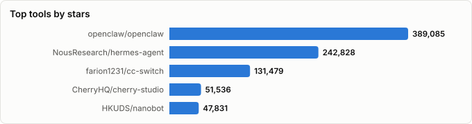
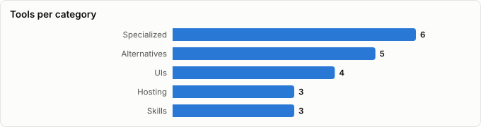

# OpenClaw Ecosystem — What to Use Now

> Derived from **kaiser-data**'s 1,596 starred repos (snapshot `2026-08-11T18:59:16.380Z`), cross-referenced with the repo-similarity graph (1,596 nodes / 5,170 edges, 31 communities).
>
> Generated 2026-08-23 by `scripts/reports/openclaw_ecosystem.py` (regenerate any time — no API cost).

> **What is OpenClaw?** A personal AI assistant (🦞, formerly *Clawdbot* / *Moltbot*) that runs on any OS/platform. It has spawned a fast-moving ecosystem of runtimes, skills, routers, memory layers, dashboards, and specialized agents — this report maps the parts in your stars and flags what's worth adopting **now**.

## Recommended stack (use now)

Opinionated picks — filtered for **healthy + actively maintained** (high health score, recent pushes). See the risk table below for what to avoid.

| Layer | Pick | ★ | Health | Why |
|---|---|---|---|---|
| Core assistant | [openclaw/openclaw](https://github.com/openclaw/openclaw) | 385,469 | 84 | The OpenClaw assistant itself — your own personal AI, any OS/platform. Everything else extends this. |
| Secure runtime | [nanocoai/nanoclaw](https://github.com/nanocoai/nanoclaw) | 30,468 | 76 | Lightweight OpenClaw alternative that runs in containers for security; WhatsApp/Telegram/Slack connectors. |
| Serverless host | [cloudflare/moltworker](https://github.com/cloudflare/moltworker) | 9,931 | 27 | Run OpenClaw on Cloudflare Workers (serverless edge). |
| Skills directory | [openclaw/clawhub](https://github.com/openclaw/clawhub) | 9,277 | 79 | The official skill directory for OpenClaw. |
| LLM router | [BlockRunAI/ClawRouter](https://github.com/BlockRunAI/ClawRouter) | 6,682 | 78 | Agent-native LLM router for OpenClaw — 41+ models, <1ms routing, on-chain payments. |
| Memory | [TencentCloud/TencentDB-Agent-Memory](https://github.com/TencentCloud/TencentDB-Agent-Memory) | 17,450 | 67 | Fully-local long-term memory (4-tier pipeline); ships as an OpenClaw plugin. |
| Observability | [vivekchand/clawmetry](https://github.com/vivekchand/clawmetry) | 392 | 77 | Real-time observability dashboard — 'see your agent think' (OpenTelemetry). |
| Desktop hub | [farion1231/cc-switch](https://github.com/farion1231/cc-switch) | 125,449 | 77 | Cross-platform desktop hub for OpenClaw + Claude Code + Codex + Gemini CLI + Hermes. |

**One-liner:** keep `openclaw/openclaw` as the core; run it via **nanoclaw** (security) or **moltworker** (serverless); add **clawhub** skills, **ClawRouter** routing, and **clawmetry** observability. Want a fresh start? **zeroclaw-labs/zeroclaw** is the highest-health alternative you've starred.

## Master comparison

Sorted by stars. `Health`/`Lifecycle` are the dataset's computed metrics; `Activity` is derived from days-since-push + 90-day commits.

| Project | Category | Lang | ★ Stars | Lifecycle | Health | Activity | Last push | Bus factor |
|---|---|---|---|---|---|---|---|---|
| [openclaw/openclaw](https://github.com/openclaw/openclaw) | Core | TypeScript | 385,469 | Hot | 84 | very active | 4d ago | 2 |
| [NousResearch/hermes-agent](https://github.com/NousResearch/hermes-agent) | Alternative agent / OS | Python | 227,042 | Hot | 85 | very active | 4d ago | 3 |
| [farion1231/cc-switch](https://github.com/farion1231/cc-switch) | Desktop / orchestration | Rust | 125,449 | Hot | 77 | very active | 4d ago | 1 |
| [CherryHQ/cherry-studio](https://github.com/CherryHQ/cherry-studio) | Desktop / orchestration | TypeScript | 50,017 | Mature | 89 | very active | 4d ago | 3 |
| [HKUDS/nanobot](https://github.com/HKUDS/nanobot) | Alternative agent / OS | Python | 46,749 | Hot | 83 | very active | 4d ago | 2 |
| [HKUDS/DeepTutor](https://github.com/HKUDS/DeepTutor) | Specialized agent | Python | 32,938 | Hot | 78 | very active | 4d ago | 1 |
| [zeroclaw-labs/zeroclaw](https://github.com/zeroclaw-labs/zeroclaw) | Alternative agent / OS | Rust | 32,526 | Hot | 83 | very active | 4d ago | 2 |
| [hesamsheikh/awesome-openclaw-usecases](https://github.com/hesamsheikh/awesome-openclaw-usecases) | Skills / directory | — | 31,670 | Declining | 23 | slowing | 4mo ago | 0 |
| [iOfficeAI/AionUi](https://github.com/iOfficeAI/AionUi) | Desktop / orchestration | TypeScript | 31,662 | Hot | 86 | very active | 4d ago | 3 |
| [nanocoai/nanoclaw](https://github.com/nanocoai/nanoclaw) | Hosting / secure runtime | TypeScript | 30,468 | Hot | 76 | very active | 5d ago | 2 |
| [NVIDIA/NemoClaw](https://github.com/NVIDIA/NemoClaw) | Hosting / secure runtime | TypeScript | 22,085 | Hot | 84 | very active | 4d ago | 5 |
| [RightNow-AI/openfang](https://github.com/RightNow-AI/openfang) | Alternative agent / OS | Rust | 18,083 | Rising | 71 | active | 1mo ago | 1 |
| [TencentCloud/TencentDB-Agent-Memory](https://github.com/TencentCloud/TencentDB-Agent-Memory) | Memory | TypeScript | 17,450 | Mature | 67 | active | 5d ago | 2 |
| [aiming-lab/AutoResearchClaw](https://github.com/aiming-lab/AutoResearchClaw) | Specialized agent | Python | 13,975 | Hot | 76 | very active | 29d ago | 2 |
| [nearai/ironclaw](https://github.com/nearai/ironclaw) | Alternative agent / OS | Rust | 12,597 | Hot | 80 | very active | 4d ago | 2 |
| [cloudflare/moltworker](https://github.com/cloudflare/moltworker) | Hosting / secure runtime | TypeScript | 9,931 | Declining | 27 | slowing | 3mo ago | 0 |
| [openclaw/clawhub](https://github.com/openclaw/clawhub) | Skills / directory | TypeScript | 9,277 | Hot | 79 | very active | 4d ago | 1 |
| [HKUDS/ClawWork](https://github.com/HKUDS/ClawWork) | Specialized agent | Python | 8,297 | Declining | 19 | slowing | 5mo ago | 0 |
| [BlockRunAI/ClawRouter](https://github.com/BlockRunAI/ClawRouter) | Routing | TypeScript | 6,682 | Hot | 78 | very active | 4d ago | 1 |
| [Gen-Verse/OpenClaw-RL](https://github.com/Gen-Verse/OpenClaw-RL) | Specialized agent | Python | 5,627 | Declining | 35 | slowing | 2mo ago | 1 |
| [crshdn/mission-control](https://github.com/crshdn/mission-control) | Desktop / orchestration | TypeScript | 2,126 | Rising | 66 | active | 1mo ago | 1 |
| [pinchbench/skill](https://github.com/pinchbench/skill) | Observability | Python | 1,306 | Mature | 62 | active | 1mo ago | 1 |
| [supermemoryai/openclaw-supermemory](https://github.com/supermemoryai/openclaw-supermemory) | Memory | TypeScript | 792 | Rising | 57 | active | 1mo ago | 3 |
| [SafeRL-Lab/cheetahclaws](https://github.com/SafeRL-Lab/cheetahclaws) | Specialized agent | Python | 764 | Hot | 75 | very active | 12d ago | 1 |
| [comet-ml/opik-openclaw](https://github.com/comet-ml/opik-openclaw) | Observability | TypeScript | 711 | Rising | 70 | active | 14d ago | 2 |
| [hydro13/tandem-browser](https://github.com/hydro13/tandem-browser) | Specialized agent | TypeScript | 573 | Rising | 67 | very active | 5d ago | 1 |
| [rohitg00/awesome-openclaw](https://github.com/rohitg00/awesome-openclaw) | Skills / directory | Python | 559 | Hot | 53 | active | 2mo ago | 2 |
| [vivekchand/clawmetry](https://github.com/vivekchand/clawmetry) | Observability | Python | 392 | Hot | 77 | very active | 4d ago | 1 |

## By category

### Core

_The assistant everything else plugs into._

- **[openclaw/openclaw](https://github.com/openclaw/openclaw)** · 385,469★ · TypeScript · Hot · health 84  
  The OpenClaw assistant itself — your own personal AI, any OS/platform. Everything else extends this.  
  topics: ai, assistant, own-your-data, personal, crustacean, molty, openclaw

### Alternative agent / OS

_Standalone agents/agent-OSes you'd pick *instead of* OpenClaw._

- **[NousResearch/hermes-agent](https://github.com/NousResearch/hermes-agent)** · 227,042★ · Python · Hot · health 85  
  'The agent that grows with you' — large, very active alternative.  
  topics: ai, ai-agent, ai-agents, llm, anthropic, chatgpt, claude, claude-code
- **[HKUDS/nanobot](https://github.com/HKUDS/nanobot)** · 46,749★ · Python · Hot · health 83  
  Lightweight open-source agent for tools, chats & workflows.  
  topics: ai-agent, ai-agents, openclaw, agent-framework, chatbot, chatops, discord-bot, llm-agents
- **[zeroclaw-labs/zeroclaw](https://github.com/zeroclaw-labs/zeroclaw)** · 32,526★ · Rust · Hot · health 83  
  Fast, small, fully-autonomous assistant infra (Rust); the healthiest alternative in your stars.  
  topics: agent, agentic, ai, openclaw, infra, ml, os, zeroclaw
- **[RightNow-AI/openfang](https://github.com/RightNow-AI/openfang)** · 18,083★ · Rust · Rising · health 71  
  Open-source 'Agent Operating System' (Rust), MCP-native.  
  topics: agent-framework, ai-agents, llm, mcp, open-source, openclaw, operating-system, rust
- **[nearai/ironclaw](https://github.com/nearai/ironclaw)** · 12,597★ · Rust · Hot · health 80  
  Agent-OS focused on privacy, security & extensibility (Rust/WASM, CodeAct).  
  topics: codeact, openclaw, rlm, rust, wasm

### Hosting / secure runtime

_Where & how to run it safely — containers, edge, managed GPU._

- **[nanocoai/nanoclaw](https://github.com/nanocoai/nanoclaw)** · 30,468★ · TypeScript · Hot · health 76  
  Lightweight OpenClaw alternative that runs in containers for security; WhatsApp/Telegram/Slack connectors.  
  topics: ai-agents, ai-assistant, claude-code, claude-skills, openclaw
- **[NVIDIA/NemoClaw](https://github.com/NVIDIA/NemoClaw)** · 22,085★ · TypeScript · Hot · health 84  
  Run OpenClaw more securely inside NVIDIA OpenShell with managed inference.  
  topics: ai-agents, nvidia, openclaw, openshell, sandboxing, typescript, hermes
- **[cloudflare/moltworker](https://github.com/cloudflare/moltworker)** · 9,931★ · TypeScript · Declining · health 27  
  Run OpenClaw on Cloudflare Workers (serverless edge).  
  topics: ai-agents, cloudflare-workers

### Skills / directory

_Extend capabilities; find what others have built._

- **[hesamsheikh/awesome-openclaw-usecases](https://github.com/hesamsheikh/awesome-openclaw-usecases)** · 31,670★ · — · Declining · health 23  
  Community collection of OpenClaw use cases (large, but check freshness).  
  topics: awesome-list, clawdbot, moltbot, openclaw, openclaw-plugin, openclaw-setup, openclaw-skills, usecase
- **[openclaw/clawhub](https://github.com/openclaw/clawhub)** · 9,277★ · TypeScript · Hot · health 79  
  The official skill directory for OpenClaw.  
  topics: directory, skill
- **[rohitg00/awesome-openclaw](https://github.com/rohitg00/awesome-openclaw)** · 559★ · Python · Hot · health 53  
  Curated awesome-list for the OpenClaw ecosystem.  
  topics: —

### Routing

_Send each request to the right/cheapest model._

- **[BlockRunAI/ClawRouter](https://github.com/BlockRunAI/ClawRouter)** · 6,682★ · TypeScript · Hot · health 78  
  Agent-native LLM router for OpenClaw — 41+ models, <1ms routing, on-chain payments.  
  topics: ai, ai-agents, anthropic, cost-optimization, deepseek, gemini, llm, llm-router

### Memory

_Long-term recall across sessions (see also the Memory report)._

- **[TencentCloud/TencentDB-Agent-Memory](https://github.com/TencentCloud/TencentDB-Agent-Memory)** · 17,450★ · TypeScript · Mature · health 67  
  Fully-local long-term memory (4-tier pipeline); ships as an OpenClaw plugin.  
  topics: agent, llm, memory, openclaw-plugin, ai-agent, embedding, local-first, long-term-memory
- **[supermemoryai/openclaw-supermemory](https://github.com/supermemoryai/openclaw-supermemory)** · 792★ · TypeScript · Rising · health 57  
  Long-term memory & recall packaged specifically for OpenClaw agents.  
  topics: ai-memory, clawd, clawdbot, memory, moltbot, openai, openclaw

### Observability

_See, measure & benchmark what your agent is doing._

- **[pinchbench/skill](https://github.com/pinchbench/skill)** · 1,306★ · Python · Mature · health 62  
  Benchmarks LLMs as OpenClaw coding agents on real tasks.  
  topics: —
- **[comet-ml/opik-openclaw](https://github.com/comet-ml/opik-openclaw)** · 711★ · TypeScript · Rising · health 70  
  Official plugin exporting OpenClaw agent traces (cost/tokens/errors) to Opik.  
  topics: clawdbot, evaluation, moltbot, observability, openclaw, testing, ai-agents, llm-observability
- **[vivekchand/clawmetry](https://github.com/vivekchand/clawmetry)** · 392★ · Python · Hot · health 77  
  Real-time observability dashboard — 'see your agent think' (OpenTelemetry).  
  topics: ai-agent, dashboard, monitoring, observability, openclaw, opentelemetry, python, clawmetry

### Desktop / orchestration

_GUIs and multi-agent control panels._

- **[farion1231/cc-switch](https://github.com/farion1231/cc-switch)** · 125,449★ · Rust · Hot · health 77  
  Cross-platform desktop hub for OpenClaw + Claude Code + Codex + Gemini CLI + Hermes.  
  topics: ai-tools, claude-code, desktop-app, open-source, rust, tauri, typescript, codex
- **[CherryHQ/cherry-studio](https://github.com/CherryHQ/cherry-studio)** · 50,017★ · TypeScript · Mature · health 89  
  AI productivity studio (300+ assistants) with OpenClaw/skills support; highest health here.  
  topics: claude-code, ai-agent, skills, codex, vibe-coding, openclaw, deepseek, awesome-skills
- **[iOfficeAI/AionUi](https://github.com/iOfficeAI/AionUi)** · 31,662★ · TypeScript · Hot · health 86  
  Free local 24/7 cowork app for OpenClaw, Hermes, Claude Code, Codex & more.  
  topics: ai, ai-agent, gemini, gemini-cli, llm, chat, chatbot, office
- **[crshdn/mission-control](https://github.com/crshdn/mission-control)** · 2,126★ · TypeScript · Rising · health 66  
  Autonomous Product Engine — agents research, build & ship via OpenClaw.  
  topics: aiagent, automation, openclaw

### Specialized agent

_Purpose-built agents on top of OpenClaw (research, tutoring, coding, browser…)._

- **[HKUDS/DeepTutor](https://github.com/HKUDS/DeepTutor)** · 32,938★ · Python · Hot · health 78  
  Agent-native personalized tutoring.  
  topics: ai-tutor, deepresearch, interactive-learning, large-language-models, multi-agent-systems, rag, ai-agents, clawdbot
- **[aiming-lab/AutoResearchClaw](https://github.com/aiming-lab/AutoResearchClaw)** · 13,975★ · Python · Hot · health 76  
  Autonomous, self-evolving research: chat an idea → get a paper. 🦞  
  topics: autonomous-research, citation-verification, llm-agents, multi-agent-debate, openclaw, paper-generation, scientific-discovery, self-evolving
- **[HKUDS/ClawWork](https://github.com/HKUDS/ClawWork)** · 8,297★ · Python · Declining · health 19  
  OpenClaw as an AI coworker (coding focus) — but check freshness.  
  topics: —
- **[Gen-Verse/OpenClaw-RL](https://github.com/Gen-Verse/OpenClaw-RL)** · 5,627★ · Python · Declining · health 35  
  Train any OpenClaw agent simply by talking (RL/skill-learning).  
  topics: async, memory-systems, open-claw, openclaw-skills, rlhf, sglang, skill-learning, slime
- **[SafeRL-Lab/cheetahclaws](https://github.com/SafeRL-Lab/cheetahclaws)** · 764★ · Python · Hot · health 75  
  Fast, production-ready Python-native personal assistant inspired by OpenClaw.  
  topics: agentic-ai, claude, claude-code, memory, python, skills, openclaw
- **[hydro13/tandem-browser](https://github.com/hydro13/tandem-browser)** · 573★ · TypeScript · Rising · health 67  
  AI-human symbiotic browser with OpenClaw integration.  
  topics: ai, browser, chromium, electron, human-ai-collaboration, local-first, openclaw, typescript

## ⚠️ Adopt with caution

Low health and/or not pushed recently — verify before wiring into anything you rely on:

| Project | Health | Lifecycle | Last push | Note |
|---|---|---|---|---|
| [HKUDS/ClawWork](https://github.com/HKUDS/ClawWork) | 19 | Declining | 5mo ago | 161d stale; low health; declining |
| [hesamsheikh/awesome-openclaw-usecases](https://github.com/hesamsheikh/awesome-openclaw-usecases) | 23 | Declining | 4mo ago | 140d stale; low health; declining |
| [cloudflare/moltworker](https://github.com/cloudflare/moltworker) | 27 | Declining | 3mo ago | 95d stale; low health; declining |
| [Gen-Verse/OpenClaw-RL](https://github.com/Gen-Verse/OpenClaw-RL) | 35 | Declining | 2mo ago | 81d stale; low health; declining |
| [rohitg00/awesome-openclaw](https://github.com/rohitg00/awesome-openclaw) | 53 | Hot | 2mo ago | 60d stale |
| [supermemoryai/openclaw-supermemory](https://github.com/supermemoryai/openclaw-supermemory) | 57 | Rising | 1mo ago | 52d stale |

> Note: `openagen/zeroclaw` (1.9k★, 70d stale) is a *different, older* project than the healthy **`zeroclaw-labs/zeroclaw`** (h93) recommended above — don't confuse them.

## Graph analysis — how they relate

**Community clustering.** These 28 projects span **15 of the graph's 31 communities** — the OpenClaw ecosystem is spread across agent-infra rather than forming one isolated cluster.

- **Community 14** (5): `nanocoai/nanoclaw`, `farion1231/cc-switch`, `iOfficeAI/AionUi`, `CherryHQ/cherry-studio`, `SafeRL-Lab/cheetahclaws`
- **Community 17** (4): `HKUDS/nanobot`, `aiming-lab/AutoResearchClaw`, `HKUDS/DeepTutor`, `HKUDS/ClawWork`
- **Community 15** (3): `NousResearch/hermes-agent`, `rohitg00/awesome-openclaw`, `BlockRunAI/ClawRouter`
- **Community 7** (3): `hesamsheikh/awesome-openclaw-usecases`, `supermemoryai/openclaw-supermemory`, `comet-ml/opik-openclaw`
- **Community 11** (2): `openclaw/openclaw`, `openclaw/clawhub`
- **Community 13** (2): `Gen-Verse/OpenClaw-RL`, `hydro13/tandem-browser`

**Centrality (PageRank in the full 1,071-repo graph)** — most 'hub-like' OpenClaw projects in your ecosystem:

- `vivekchand/clawmetry` — PageRank 0.0033
- `hydro13/tandem-browser` — PageRank 0.0018
- `cloudflare/moltworker` — PageRank 0.0009
- `nanocoai/nanoclaw` — PageRank 0.0009
- `HKUDS/DeepTutor` — PageRank 0.0008
- `RightNow-AI/openfang` — PageRank 0.0008
- `HKUDS/nanobot` — PageRank 0.0008
- `NousResearch/hermes-agent` — PageRank 0.0008
- `openclaw/openclaw` — PageRank 0.0007
- `CherryHQ/cherry-studio` — PageRank 0.0007

**Direct links between OpenClaw projects** (top similarity edges where both endpoints are in this report):

- `openclaw/clawhub` ⇄ `openclaw/openclaw` (w=0.757) — authors: vyctorbrzezowski, vincentkoc, steipete
- `HKUDS/nanobot` ⇄ `HKUDS/DeepTutor` (w=0.677) — topics: ai-agents; authors: santhreal, MVS-source
- `CherryHQ/cherry-studio` ⇄ `nanocoai/nanoclaw` (w=0.291) — topics: claude-code, openclaw; authors: github-actions[bot]
- `NousResearch/hermes-agent` ⇄ `iOfficeAI/AionUi` (w=0.286) — topics: ai, ai-agent, llm, claude-code
- `comet-ml/opik-openclaw` ⇄ `supermemoryai/openclaw-supermemory` (w=0.281) — topics: clawdbot, moltbot, openclaw
- `hesamsheikh/awesome-openclaw-usecases` ⇄ `supermemoryai/openclaw-supermemory` (w=0.250) — topics: clawdbot, moltbot, openclaw
- `iOfficeAI/AionUi` ⇄ `CherryHQ/cherry-studio` (w=0.250) — topics: ai-agent, claude-code, codex, skills
- `RightNow-AI/openfang` ⇄ `nearai/ironclaw` (w=0.232) — topics: openclaw, rust
- `BlockRunAI/ClawRouter` ⇄ `openclaw/openclaw` (w=0.219) — topics: ai, openclaw; authors: steipete
- `farion1231/cc-switch` ⇄ `RightNow-AI/openfang` (w=0.217) — topics: open-source, rust, mcp, openclaw
- `comet-ml/opik-openclaw` ⇄ `nanocoai/nanoclaw` (w=0.217) — topics: openclaw, ai-agents
- `comet-ml/opik-openclaw` ⇄ `hesamsheikh/awesome-openclaw-usecases` (w=0.214) — topics: clawdbot, moltbot, openclaw
- `hydro13/tandem-browser` ⇄ `zeroclaw-labs/zeroclaw` (w=0.214) — topics: ai, openclaw; authors: dependabot[bot]
- `NousResearch/hermes-agent` ⇄ `supermemoryai/openclaw-supermemory` (w=0.211) — topics: clawdbot, moltbot, openai, openclaw
- `farion1231/cc-switch` ⇄ `CherryHQ/cherry-studio` (w=0.200) — topics: claude-code, codex, skills, openclaw
- …and 6 more.

## Methodology & caveats

- **Source**: `data/classified.json` + `public/data/graph.json`. No external calls; fully reproducible.
- **Selection**: scan for `openclaw` / `clawd*` / `moltbot` across name/description/topics/README, then manual curation. Repos that merely *mention* OpenClaw in passing (general agent harnesses, awesome-lists, unrelated tools) were excluded; memory/MCP-centric repos are covered in their own reports and only the OpenClaw-specific ones appear here.
- **Metrics** (health, lifecycle, bus_factor, days_since_push) are precomputed at snapshot time. **OpenClaw moves extremely fast** — treat all ages/stars as a May-2026 snapshot and re-verify before adopting.
- Re-run after a fresh `classified.json` to refresh.

Projects covered: 28 · Snapshot: 2026-08-11T18:59:16.380Z
