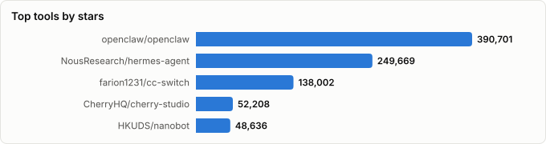
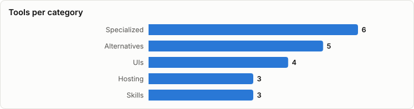

# OpenClaw Ecosystem — What to Use Now

> Derived from **kaiser-data**'s 2,304 starred repos (snapshot `2026-10-05T13:01:39.533Z`), cross-referenced with the repo-similarity graph (2,304 nodes / 7,632 edges, 40 communities).
>
> Generated 2026-10-05 by `scripts/reports/openclaw_ecosystem.py` (regenerate any time — no API cost).

> **What is OpenClaw?** A personal AI assistant (🦞, formerly *Clawdbot* / *Moltbot*) that runs on any OS/platform. It has spawned a fast-moving ecosystem of runtimes, skills, routers, memory layers, dashboards, and specialized agents — this report maps the parts in your stars and flags what's worth adopting **now**.

## Recommended stack (use now)

Opinionated picks — filtered for **healthy + actively maintained** (high health score, recent pushes). See the risk table below for what to avoid.

| Layer | Pick | ★ | Health | Why |
|---|---|---|---|---|
| Core assistant | [openclaw/openclaw](https://github.com/openclaw/openclaw) | 391,416 (▲949) | 79 | The OpenClaw assistant itself — your own personal AI, any OS/platform. Everything else extends this. |
| Secure runtime | [nanocoai/nanoclaw](https://github.com/nanocoai/nanoclaw) | 30,872 (▲26) | 77 | Lightweight OpenClaw alternative that runs in containers for security; WhatsApp/Telegram/Slack connectors. |
| Serverless host | [cloudflare/moltworker](https://github.com/cloudflare/moltworker) | 9,952 (▼6) | 23 | Run OpenClaw on Cloudflare Workers (serverless edge). |
| Skills directory | [openclaw/clawhub](https://github.com/openclaw/clawhub) | 9,486 (▲33) | 80 | The official skill directory for OpenClaw. |
| LLM router | [BlockRunAI/ClawRouter](https://github.com/BlockRunAI/ClawRouter) | 6,612 (▼2) | 80 | Agent-native LLM router for OpenClaw — 41+ models, <1ms routing, on-chain payments. |
| Memory | [TencentCloud/TencentDB-Agent-Memory](https://github.com/TencentCloud/TencentDB-Agent-Memory) | 27,692 (▲428) | 89 | Fully-local long-term memory (4-tier pipeline); ships as an OpenClaw plugin. |
| Observability | [vivekchand/clawmetry](https://github.com/vivekchand/clawmetry) | 424 (▲4) | 80 | Real-time observability dashboard — 'see your agent think' (OpenTelemetry). |
| Desktop hub | [farion1231/cc-switch](https://github.com/farion1231/cc-switch) | 140,188 (▲3,512) | 76 | Cross-platform desktop hub for OpenClaw + Claude Code + Codex + Gemini CLI + Hermes. |

**One-liner:** keep `openclaw/openclaw` as the core; run it via **nanoclaw** (security) or **moltworker** (serverless); add **clawhub** skills, **ClawRouter** routing, and **clawmetry** observability. Want a fresh start? **zeroclaw-labs/zeroclaw** is the highest-health alternative you've starred.

## Master comparison

Sorted by stars. `Health`/`Lifecycle` are the dataset's computed metrics; `Activity` is derived from days-since-push + 90-day commits.

| Project | Category | Lang | ★ Stars | Lifecycle | Health | Activity | Last push | Bus factor |
|---|---|---|---|---|---|---|---|---|
| [openclaw/openclaw](https://github.com/openclaw/openclaw) | Core | TypeScript | 391,416 (▲949) | Hot | 79 | very active | 0d ago | 1 |
| [NousResearch/hermes-agent](https://github.com/NousResearch/hermes-agent) | Alternative agent / OS | Python | 251,309 (▲2,495) | Hot | 86 | very active | 0d ago | 3 |
| [farion1231/cc-switch](https://github.com/farion1231/cc-switch) | Desktop / orchestration | Rust | 140,188 (▲3,512) | Hot | 76 | very active | 0d ago | 1 |
| [CherryHQ/cherry-studio](https://github.com/CherryHQ/cherry-studio) | Desktop / orchestration | TypeScript | 52,369 (▲230) | Mature | 94 | very active | 0d ago | 4 |
| [HKUDS/nanobot](https://github.com/HKUDS/nanobot) | Alternative agent / OS | Python | 48,794 (▲233) | Hot | 79 | very active | 0d ago | 1 |
| [HKUDS/DeepTutor](https://github.com/HKUDS/DeepTutor) | Specialized agent | Python | 40,810 (▲532) | Rising | 78 | very active | 1d ago | 1 |
| [iOfficeAI/AionUi](https://github.com/iOfficeAI/AionUi) | Desktop / orchestration | TypeScript | 33,319 (▲206) | Hot | 78 | very active | 26d ago | 2 |
| [zeroclaw-labs/zeroclaw](https://github.com/zeroclaw-labs/zeroclaw) | Alternative agent / OS | Rust | 32,931 (▲53) | Hot | 83 | very active | 0d ago | 2 |
| [hesamsheikh/awesome-openclaw-usecases](https://github.com/hesamsheikh/awesome-openclaw-usecases) | Skills / directory | — | 31,675 (▼1) | Declining | 19 | stale | 6mo ago | 0 |
| [nanocoai/nanoclaw](https://github.com/nanocoai/nanoclaw) | Hosting / secure runtime | TypeScript | 30,872 (▲26) | Hot | 77 | very active | 0d ago | 1 |
| [TencentCloud/TencentDB-Agent-Memory](https://github.com/TencentCloud/TencentDB-Agent-Memory) | Memory | TypeScript | 27,692 (▲428) | Hot | 89 | very active | 6d ago | 5 |
| [NVIDIA/NemoClaw](https://github.com/NVIDIA/NemoClaw) | Hosting / secure runtime | TypeScript | 22,660 (▲122) | Hot | 71 | very active | 0d ago | 2 |
| [RightNow-AI/openfang](https://github.com/RightNow-AI/openfang) | Alternative agent / OS | Rust | 18,205 (▼5) | Declining | 46 | slowing | 3mo ago | 0 |
| [aiming-lab/AutoResearchClaw](https://github.com/aiming-lab/AutoResearchClaw) | Specialized agent | Python | 14,575 (▲48) | Hot | 68 | active | 1mo ago | 1 |
| [nearai/ironclaw](https://github.com/nearai/ironclaw) | Alternative agent / OS | Rust | 12,639 (▲7) | Hot | 80 | very active | 1d ago | 2 |
| [cloudflare/moltworker](https://github.com/cloudflare/moltworker) | Hosting / secure runtime | TypeScript | 9,952 (▼6) | Declining | 23 | slowing | 4mo ago | 0 |
| [openclaw/clawhub](https://github.com/openclaw/clawhub) | Skills / directory | TypeScript | 9,486 (▲33) | Hot | 80 | very active | 0d ago | 1 |
| [HKUDS/ClawWork](https://github.com/HKUDS/ClawWork) | Specialized agent | Python | 8,548 (▼7) | Declining | 15 | stale | 7mo ago | 0 |
| [BlockRunAI/ClawRouter](https://github.com/BlockRunAI/ClawRouter) | Routing | TypeScript | 6,612 (▼2) | Hot | 80 | very active | 0d ago | 1 |
| [Gen-Verse/OpenClaw-RL](https://github.com/Gen-Verse/OpenClaw-RL) | Specialized agent | Python | 5,711 (▲12) | Declining | 21 | slowing | 4mo ago | 0 |
| [crshdn/mission-control](https://github.com/crshdn/mission-control) | Desktop / orchestration | TypeScript | 2,147 (▲4) | Declining | 52 | active | 19d ago | 0 |
| [pinchbench/skill](https://github.com/pinchbench/skill) | Observability | Python | 1,357 (▲7) | Declining | 46 | slowing | 3mo ago | 0 |
| [supermemoryai/openclaw-supermemory](https://github.com/supermemoryai/openclaw-supermemory) | Memory | TypeScript | 797 (▲2) | Mature | 48 | active | 3d ago | 1 |
| [SAIL-Research-Lab/cheetahclaws](https://github.com/SAIL-Research-Lab/cheetahclaws) | Specialized agent | Python | 783 (▲3) | Hot | 70 | very active | 15d ago | 1 |
| [comet-ml/opik-openclaw](https://github.com/comet-ml/opik-openclaw) | Observability | TypeScript | 724 | Declining | 60 | active | 3d ago | 1 |
| [hydro13/tandem-browser](https://github.com/hydro13/tandem-browser) | Specialized agent | TypeScript | 615 (▲4) | Rising | 68 | very active | 3d ago | 1 |
| [rohitg00/awesome-openclaw](https://github.com/rohitg00/awesome-openclaw) | Skills / directory | Python | 562 | Declining | 22 | slowing | 3mo ago | 0 |
| [vivekchand/clawmetry](https://github.com/vivekchand/clawmetry) | Observability | Python | 424 (▲4) | Hot | 80 | very active | 0d ago | 1 |

## By category

### Core

_The assistant everything else plugs into._

- **[openclaw/openclaw](https://github.com/openclaw/openclaw)** · 391,416★ · TypeScript · Hot · health 79  
  The OpenClaw assistant itself — your own personal AI, any OS/platform. Everything else extends this.  
  topics: ai, assistant, own-your-data, personal, crustacean, molty, openclaw

### Alternative agent / OS

_Standalone agents/agent-OSes you'd pick *instead of* OpenClaw._

- **[NousResearch/hermes-agent](https://github.com/NousResearch/hermes-agent)** · 251,309★ · Python · Hot · health 86  
  'The agent that grows with you' — large, very active alternative.  
  topics: ai, ai-agent, ai-agents, llm, anthropic, chatgpt, claude, claude-code
- **[HKUDS/nanobot](https://github.com/HKUDS/nanobot)** · 48,794★ · Python · Hot · health 79  
  Lightweight open-source agent for tools, chats & workflows.  
  topics: ai-agent, ai-agents, openclaw, agent-framework, chatbot, chatops, discord-bot, llm-agents
- **[zeroclaw-labs/zeroclaw](https://github.com/zeroclaw-labs/zeroclaw)** · 32,931★ · Rust · Hot · health 83  
  Fast, small, fully-autonomous assistant infra (Rust); the healthiest alternative in your stars.  
  topics: agent, agentic, ai, openclaw, infra, ml, os, zeroclaw
- **[RightNow-AI/openfang](https://github.com/RightNow-AI/openfang)** · 18,205★ · Rust · Declining · health 46  
  Open-source 'Agent Operating System' (Rust), MCP-native.  
  topics: agent-framework, ai-agents, llm, mcp, open-source, openclaw, operating-system, rust
- **[nearai/ironclaw](https://github.com/nearai/ironclaw)** · 12,639★ · Rust · Hot · health 80  
  Agent-OS focused on privacy, security & extensibility (Rust/WASM, CodeAct).  
  topics: codeact, openclaw, rlm, rust, wasm

### Hosting / secure runtime

_Where & how to run it safely — containers, edge, managed GPU._

- **[nanocoai/nanoclaw](https://github.com/nanocoai/nanoclaw)** · 30,872★ · TypeScript · Hot · health 77  
  Lightweight OpenClaw alternative that runs in containers for security; WhatsApp/Telegram/Slack connectors.  
  topics: ai-agents, ai-assistant, claude-code, claude-skills, openclaw
- **[NVIDIA/NemoClaw](https://github.com/NVIDIA/NemoClaw)** · 22,660★ · TypeScript · Hot · health 71  
  Run OpenClaw more securely inside NVIDIA OpenShell with managed inference.  
  topics: ai-agents, nvidia, openclaw, openshell, sandboxing, typescript, hermes, deep-agents
- **[cloudflare/moltworker](https://github.com/cloudflare/moltworker)** · 9,952★ · TypeScript · Declining · health 23  
  Run OpenClaw on Cloudflare Workers (serverless edge).  
  topics: ai-agents, cloudflare-workers

### Skills / directory

_Extend capabilities; find what others have built._

- **[hesamsheikh/awesome-openclaw-usecases](https://github.com/hesamsheikh/awesome-openclaw-usecases)** · 31,675★ · — · Declining · health 19  
  Community collection of OpenClaw use cases (large, but check freshness).  
  topics: awesome-list, clawdbot, moltbot, openclaw, openclaw-plugin, openclaw-setup, openclaw-skills, usecase
- **[openclaw/clawhub](https://github.com/openclaw/clawhub)** · 9,486★ · TypeScript · Hot · health 80  
  The official skill directory for OpenClaw.  
  topics: directory, skill
- **[rohitg00/awesome-openclaw](https://github.com/rohitg00/awesome-openclaw)** · 562★ · Python · Declining · health 22  
  Curated awesome-list for the OpenClaw ecosystem.  
  topics: —

### Routing

_Send each request to the right/cheapest model._

- **[BlockRunAI/ClawRouter](https://github.com/BlockRunAI/ClawRouter)** · 6,612★ · TypeScript · Hot · health 80  
  Agent-native LLM router for OpenClaw — 41+ models, <1ms routing, on-chain payments.  
  topics: ai, ai-agents, anthropic, cost-optimization, deepseek, gemini, llm, llm-router

### Memory

_Long-term recall across sessions (see also the Memory report)._

- **[TencentCloud/TencentDB-Agent-Memory](https://github.com/TencentCloud/TencentDB-Agent-Memory)** · 27,692★ · TypeScript · Hot · health 89  
  Fully-local long-term memory (4-tier pipeline); ships as an OpenClaw plugin.  
  topics: agent, llm, memory, openclaw-plugin, ai-agent, embedding, local-first, long-term-memory
- **[supermemoryai/openclaw-supermemory](https://github.com/supermemoryai/openclaw-supermemory)** · 797★ · TypeScript · Mature · health 48  
  Long-term memory & recall packaged specifically for OpenClaw agents.  
  topics: ai-memory, clawd, clawdbot, memory, moltbot, openai, openclaw

### Observability

_See, measure & benchmark what your agent is doing._

- **[pinchbench/skill](https://github.com/pinchbench/skill)** · 1,357★ · Python · Declining · health 46  
  Benchmarks LLMs as OpenClaw coding agents on real tasks.  
  topics: —
- **[comet-ml/opik-openclaw](https://github.com/comet-ml/opik-openclaw)** · 724★ · TypeScript · Declining · health 60  
  Official plugin exporting OpenClaw agent traces (cost/tokens/errors) to Opik.  
  topics: clawdbot, evaluation, moltbot, observability, openclaw, testing, ai-agents, llm-observability
- **[vivekchand/clawmetry](https://github.com/vivekchand/clawmetry)** · 424★ · Python · Hot · health 80  
  Real-time observability dashboard — 'see your agent think' (OpenTelemetry).  
  topics: ai-agent, monitoring, observability, openclaw, opentelemetry, python, clawmetry, agent-monitoring

### Desktop / orchestration

_GUIs and multi-agent control panels._

- **[farion1231/cc-switch](https://github.com/farion1231/cc-switch)** · 140,188★ · Rust · Hot · health 76  
  Cross-platform desktop hub for OpenClaw + Claude Code + Codex + Gemini CLI + Hermes.  
  topics: ai-tools, claude-code, desktop-app, open-source, rust, tauri, codex, mcp
- **[CherryHQ/cherry-studio](https://github.com/CherryHQ/cherry-studio)** · 52,369★ · TypeScript · Mature · health 94  
  AI productivity studio (300+ assistants) with OpenClaw/skills support; highest health here.  
  topics: claude-code, ai-agent, skills, codex, vibe-coding, deepseek, hermes-agent, agent-skills
- **[iOfficeAI/AionUi](https://github.com/iOfficeAI/AionUi)** · 33,319★ · TypeScript · Hot · health 78  
  Free local 24/7 cowork app for OpenClaw, Hermes, Claude Code, Codex & more.  
  topics: ai, ai-agent, gemini, gemini-cli, llm, chat, chatbot, office
- **[crshdn/mission-control](https://github.com/crshdn/mission-control)** · 2,147★ · TypeScript · Declining · health 52  
  Autonomous Product Engine — agents research, build & ship via OpenClaw.  
  topics: aiagent, automation, openclaw

### Specialized agent

_Purpose-built agents on top of OpenClaw (research, tutoring, coding, browser…)._

- **[HKUDS/DeepTutor](https://github.com/HKUDS/DeepTutor)** · 40,810★ · Python · Rising · health 78  
  Agent-native personalized tutoring.  
  topics: ai-tutor, deepresearch, interactive-learning, multi-agent-systems, rag, ai-agents, cli-tool, clawbot
- **[aiming-lab/AutoResearchClaw](https://github.com/aiming-lab/AutoResearchClaw)** · 14,575★ · Python · Hot · health 68  
  Autonomous, self-evolving research: chat an idea → get a paper. 🦞  
  topics: autonomous-research, citation-verification, llm-agents, multi-agent-debate, openclaw, paper-generation, scientific-discovery, self-evolving
- **[HKUDS/ClawWork](https://github.com/HKUDS/ClawWork)** · 8,548★ · Python · Declining · health 15  
  OpenClaw as an AI coworker (coding focus) — but check freshness.  
  topics: —
- **[Gen-Verse/OpenClaw-RL](https://github.com/Gen-Verse/OpenClaw-RL)** · 5,711★ · Python · Declining · health 21  
  Train any OpenClaw agent simply by talking (RL/skill-learning).  
  topics: async, memory-systems, open-claw, openclaw-skills, rlhf, sglang, skill-learning, slime
- **[SAIL-Research-Lab/cheetahclaws](https://github.com/SAIL-Research-Lab/cheetahclaws)** · 783★ · Python · Hot · health 70  
  Fast, production-ready Python-native personal assistant inspired by OpenClaw.  
  topics: agentic-ai, claude, claude-code, memory, python, skills, openclaw
- **[hydro13/tandem-browser](https://github.com/hydro13/tandem-browser)** · 615★ · TypeScript · Rising · health 68  
  AI-human symbiotic browser with OpenClaw integration.  
  topics: ai, browser, chromium, electron, human-ai-collaboration, local-first, openclaw, typescript

## ⚠️ Adopt with caution

Low health and/or not pushed recently — verify before wiring into anything you rely on:

| Project | Health | Lifecycle | Last push | Note |
|---|---|---|---|---|
| [HKUDS/ClawWork](https://github.com/HKUDS/ClawWork) | 15 | Declining | 7mo ago | 216d stale; low health; declining |
| [hesamsheikh/awesome-openclaw-usecases](https://github.com/hesamsheikh/awesome-openclaw-usecases) | 19 | Declining | 6mo ago | 195d stale; low health; declining |
| [Gen-Verse/OpenClaw-RL](https://github.com/Gen-Verse/OpenClaw-RL) | 21 | Declining | 4mo ago | 135d stale; low health; declining |
| [rohitg00/awesome-openclaw](https://github.com/rohitg00/awesome-openclaw) | 22 | Declining | 3mo ago | 115d stale; low health; declining |
| [cloudflare/moltworker](https://github.com/cloudflare/moltworker) | 23 | Declining | 4mo ago | 149d stale; low health; declining |
| [RightNow-AI/openfang](https://github.com/RightNow-AI/openfang) | 46 | Declining | 3mo ago | 95d stale; low health; declining |
| [pinchbench/skill](https://github.com/pinchbench/skill) | 46 | Declining | 3mo ago | 95d stale; low health; declining |
| [supermemoryai/openclaw-supermemory](https://github.com/supermemoryai/openclaw-supermemory) | 48 | Mature | 3d ago | low health |
| [crshdn/mission-control](https://github.com/crshdn/mission-control) | 52 | Declining | 19d ago | declining |
| [comet-ml/opik-openclaw](https://github.com/comet-ml/opik-openclaw) | 60 | Declining | 3d ago | declining |
| [aiming-lab/AutoResearchClaw](https://github.com/aiming-lab/AutoResearchClaw) | 68 | Hot | 1mo ago | 47d stale |

> Note: `openagen/zeroclaw` (1.9k★, 70d stale) is a *different, older* project than the healthy **`zeroclaw-labs/zeroclaw`** (h93) recommended above — don't confuse them.

## Graph analysis — how they relate

**Community clustering.** These 28 projects span **12 of the graph's 40 communities** — the OpenClaw ecosystem is spread across agent-infra rather than forming one isolated cluster.

- **Community 0** (5): `zeroclaw-labs/zeroclaw`, `NousResearch/hermes-agent`, `BlockRunAI/ClawRouter`, `TencentCloud/TencentDB-Agent-Memory`, `aiming-lab/AutoResearchClaw`
- **Community 5** (4): `rohitg00/awesome-openclaw`, `iOfficeAI/AionUi`, `CherryHQ/cherry-studio`, `hydro13/tandem-browser`
- **Community 6** (3): `RightNow-AI/openfang`, `vivekchand/clawmetry`, `farion1231/cc-switch`
- **Community 28** (3): `HKUDS/nanobot`, `HKUDS/DeepTutor`, `HKUDS/ClawWork`
- **Community 17** (3): `hesamsheikh/awesome-openclaw-usecases`, `supermemoryai/openclaw-supermemory`, `comet-ml/opik-openclaw`
- **Community 12** (2): `openclaw/openclaw`, `openclaw/clawhub`
- **Community 16** (2): `nearai/ironclaw`, `Gen-Verse/OpenClaw-RL`
- **Community 20** (2): `nanocoai/nanoclaw`, `crshdn/mission-control`

**Centrality (PageRank in the full 1,071-repo graph)** — most 'hub-like' OpenClaw projects in your ecosystem:

- `vivekchand/clawmetry` — PageRank 0.0021
- `cloudflare/moltworker` — PageRank 0.0007
- `RightNow-AI/openfang` — PageRank 0.0007
- `NousResearch/hermes-agent` — PageRank 0.0006
- `openclaw/openclaw` — PageRank 0.0006
- `HKUDS/DeepTutor` — PageRank 0.0005
- `NVIDIA/NemoClaw` — PageRank 0.0005
- `CherryHQ/cherry-studio` — PageRank 0.0005
- `supermemoryai/openclaw-supermemory` — PageRank 0.0004
- `HKUDS/nanobot` — PageRank 0.0004

**Direct links between OpenClaw projects** (top similarity edges where both endpoints are in this report):

- `openclaw/clawhub` ⇄ `openclaw/openclaw` (w=0.950) — authors: steipete, vincentkoc, roboclaw-bot
- `HKUDS/nanobot` ⇄ `HKUDS/DeepTutor` (w=0.586) — topics: ai-agents
- `comet-ml/opik-openclaw` ⇄ `supermemoryai/openclaw-supermemory` (w=0.281) — topics: clawdbot, moltbot, openclaw
- `hesamsheikh/awesome-openclaw-usecases` ⇄ `supermemoryai/openclaw-supermemory` (w=0.250) — topics: clawdbot, moltbot, openclaw
- `hydro13/tandem-browser` ⇄ `iOfficeAI/AionUi` (w=0.235) — topics: ai, openclaw, claude-code, codex
- `NVIDIA/NemoClaw` ⇄ `nanocoai/nanoclaw` (w=0.232) — topics: ai-agents, openclaw
- `RightNow-AI/openfang` ⇄ `nearai/ironclaw` (w=0.232) — topics: openclaw, rust
- `farion1231/cc-switch` ⇄ `RightNow-AI/openfang` (w=0.217) — topics: open-source, rust, mcp, openclaw
- `comet-ml/opik-openclaw` ⇄ `nanocoai/nanoclaw` (w=0.217) — topics: openclaw, ai-agents
- `comet-ml/opik-openclaw` ⇄ `hesamsheikh/awesome-openclaw-usecases` (w=0.214) — topics: clawdbot, moltbot, openclaw
- `crshdn/mission-control` ⇄ `nanocoai/nanoclaw` (w=0.193) — topics: openclaw
- `farion1231/cc-switch` ⇄ `iOfficeAI/AionUi` (w=0.176) — topics: claude-code, codex, opencode, skills
- `crshdn/mission-control` ⇄ `supermemoryai/openclaw-supermemory` (w=0.161) — topics: openclaw
- `crshdn/mission-control` ⇄ `openclaw/openclaw` (w=0.161) — topics: openclaw

## Methodology & caveats

- **Source**: `data/classified.json` + `public/data/graph.json`. No external calls; fully reproducible.
- **Selection**: scan for `openclaw` / `clawd*` / `moltbot` across name/description/topics/README, then manual curation. Repos that merely *mention* OpenClaw in passing (general agent harnesses, awesome-lists, unrelated tools) were excluded; memory/MCP-centric repos are covered in their own reports and only the OpenClaw-specific ones appear here.
- **Metrics** (health, lifecycle, bus_factor, days_since_push) are precomputed at snapshot time. **OpenClaw moves extremely fast** — treat all ages/stars as a May-2026 snapshot and re-verify before adopting.
- Re-run after a fresh `classified.json` to refresh.

### Retired from the scored set

Archived upstream, so they no longer appear in this report's tables — `sample.mjs` excludes archived repos. Metrics are frozen at the date shown and are not refreshed.

| Project | Category | Why it left | Metrics as of |
|---|---|---|---|
| [`abhi1693/openclaw-mission-control`](https://github.com/abhi1693/openclaw-mission-control) | Desktop / orchestration | Archived upstream; last in the dataset 2026-07-27. Agent-orchestration dashboard for OpenClaw (assign tasks, coordinate agents). | 2026-07-27 |

Projects covered: 28 · Snapshot: 2026-10-05T13:01:39.533Z
