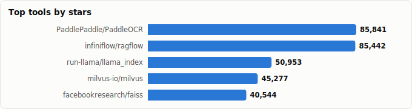
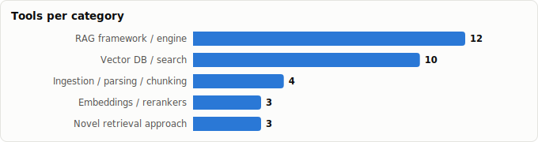

# RAG (Retrieval-Augmented Generation) Tooling — Landscape Report

> Derived from **kaiser-data**'s 1,327 starred repos (snapshot `2026-07-13T08:42:30.177Z`), cross-referenced with the repo-similarity graph (1,327 nodes / 4,302 edges, 27 communities).
>
> Generated 2026-07-13 by `scripts/reports/rag_tooling.py` (regenerate any time — no API cost).

## Executive summary

- **29 RAG tools** in your stars (**687,895★** combined) — the largest AI category here — organized along the RAG pipeline:
  - **RAG framework / engine** (12): `ragflow`, `llama_index`, `LightRAG`, `graphrag`, `haystack`, `RAG-Anything`, `llmware`, `txtai`, `airweave`, `AdalFlow`, `GraphRAG-SDK`, `RAGLight`
  - **Vector DB / search** (10): `milvus`, `faiss`, `qdrant`, `chroma`, `pgvector`, `weaviate`, `zvec`, `lancedb`, `marqo`, `FalkorDB`
  - **Ingestion / parsing / chunking** (2): `PaddleOCR`, `unstructured`
  - **Embeddings / rerankers** (3): `sentence-transformers`, `colpali`, `sie`
  - **Novel retrieval approach** (2): `PageIndex`, `claude-context`
- Mental model — RAG is a pipeline: **ingest/parse → chunk → embed → store/index → retrieve/rerank → generate**. Each category above owns one stage; the frameworks stitch them together.
- Two clear trends: **GraphRAG** (graph-structured retrieval — `LightRAG`, `GraphRAG-SDK`, `FalkorDB`) and **post-vector** retrieval that questions the embed-everything default (`PageIndex` vectorless, `LEANN` 97% storage savings).
- Python dominates the frameworks; the vector-DB layer is mostly systems languages (Rust/Go/C/C++) for performance.

## The RAG pipeline at a glance

| Stage | What happens | Tools in your stars |
|---|---|---|
| **Ingest / parse** | PDFs, images, HTML → clean text/elements | `unstructured`, `PaddleOCR` |
| **Chunk** | Split documents into retrievable units | `chonkie`, `chonkiejs` |
| **Embed / rerank** | Encode chunks & queries; reorder hits | `sentence-transformers`, `colpali`, `sie` |
| **Store / index** | Persist vectors/graphs for ANN search | `qdrant`, `chroma`, `weaviate`, `pgvector`, `zvec`, `faiss`, `FalkorDB` |
| **Retrieve / generate** | Orchestrate retrieval + LLM answer | `ragflow`, `llama_index`, `haystack`, `LightRAG`, `RAG-Anything`, `llmware`, `AdalFlow`, `airweave`, `RAGLight`, `GraphRAG-SDK` |
| **Rethink** | Approaches that change the pipeline itself | `PageIndex` (vectorless), `LEANN` (tiny storage), `claude-context` (code) |

## Master comparison

Sorted by stars. `Health`/`Lifecycle` are the dataset's computed metrics; `Activity` is derived from days-since-push + 90-day commits.

| Tool | Category | Lang | License | ★ Stars | Lifecycle | Health | Activity | Last push | Age | Contrib(90d) |
|---|---|---|---|---|---|---|---|---|---|---|
| [PaddlePaddle/PaddleOCR](https://github.com/PaddlePaddle/PaddleOCR) | Ingestion / parsing / chunking | Python | Apache-2.0 | 85,345 (▲3,484) | Classic | 79 | very active | 17d ago | 6.2y | 19 |
| [infiniflow/ragflow](https://github.com/infiniflow/ragflow) | RAG framework / engine | Go | Apache-2.0 | 84,922 (▲2,446) | Mature | 97 | very active | 0d ago | 2.6y | 23 |
| [run-llama/llama_index](https://github.com/run-llama/llama_index) | RAG framework / engine | Python | MIT | 50,813 (▲730) | Classic | 99 | very active | 2d ago | 3.7y | 47 |
| [milvus-io/milvus](https://github.com/milvus-io/milvus) | Vector DB / search | Go | Apache-2.0 | 45,205 (▲476) | Classic | 100 | very active | 0d ago | 6.8y | 29 |
| [facebookresearch/faiss](https://github.com/facebookresearch/faiss) | Vector DB / search | C++ | MIT | 40,500 (▲234) | Classic | 94 | very active | 2d ago | 9.4y | 35 |
| [HKUDS/LightRAG](https://github.com/HKUDS/LightRAG) | RAG framework / engine | Python | MIT | 37,604 (▲1,144) | Hot | 79 | very active | 0d ago | 1.8y | 6 |
| [microsoft/graphrag](https://github.com/microsoft/graphrag) | RAG framework / engine | Python | MIT | 34,396 (▲735) | Mature | 66 | active | 2d ago | 2.3y | 2 |
| [VectifyAI/PageIndex](https://github.com/VectifyAI/PageIndex) | Novel retrieval approach | Python | MIT | 33,980 (▲1,053) | Mature | 55 | very active | 3d ago | 1.3y | 6 |
| [qdrant/qdrant](https://github.com/qdrant/qdrant) | Vector DB / search | Rust | Apache-2.0 | 33,231 (▲1,192) | Classic | 93 | very active | 1d ago | 6.1y | 16 |
| [chroma-core/chroma](https://github.com/chroma-core/chroma) | Vector DB / search | Rust | Apache-2.0 | 28,777 (▲390) | Classic | 83 | very active | 1d ago | 3.8y | 8 |
| [deepset-ai/haystack](https://github.com/deepset-ai/haystack) | RAG framework / engine | MDX | Apache-2.0 | 25,880 (▲342) | Classic | 90 | very active | 0d ago | 6.7y | 20 |
| [HKUDS/RAG-Anything](https://github.com/HKUDS/RAG-Anything) | RAG framework / engine | Python | MIT | 22,168 (▲964) | Hot | 70 | very active | 4d ago | 1.1y | 18 |
| [pgvector/pgvector](https://github.com/pgvector/pgvector) | Vector DB / search | C | NOASSERTION | 22,168 (▲457) | Classic | 63 | very active | 2d ago | 5.2y | 4 |
| [huggingface/sentence-transformers](https://github.com/huggingface/sentence-transformers) | Embeddings / rerankers | Python | Apache-2.0 | 18,904 (▲104) | Classic | 72 | very active | 4d ago | 7.0y | 23 |
| [weaviate/weaviate](https://github.com/weaviate/weaviate) | Vector DB / search | Go | BSD-3-Clause | 16,587 (▲274) | Classic | 79 | very active | 0d ago | 10.3y | 10 |
| [Unstructured-IO/unstructured](https://github.com/Unstructured-IO/unstructured) | Ingestion / parsing / chunking | HTML | Apache-2.0 | 15,125 (▲236) | Classic | 69 | very active | 0d ago | 3.8y | 8 |
| [alibaba/zvec](https://github.com/alibaba/zvec) | Vector DB / search | C++ | Apache-2.0 | 14,835 (▲5,059) | Hot | 88 | very active | 0d ago | 7mo | 15 |
| [llmware-ai/llmware](https://github.com/llmware-ai/llmware) | RAG framework / engine | Python | Apache-2.0 | 14,814 (▼31) | Mature | 51 | active | 1mo ago | 2.8y | 1 |
| [neuml/txtai](https://github.com/neuml/txtai) | RAG framework / engine | Python | Apache-2.0 | 12,720 (▲70) | Classic | 76 | very active | 11d ago | 5.9y | 3 |
| [zilliztech/claude-context](https://github.com/zilliztech/claude-context) | Novel retrieval approach | TypeScript | MIT | 12,126 (▲308) | Hot | 59 | very active | 21d ago | 1.1y | 18 |
| [lancedb/lancedb](https://github.com/lancedb/lancedb) | Vector DB / search | HTML | Apache-2.0 | 10,880 (▲301) | Classic | 96 | very active | 2d ago | 3.4y | 30 |
| [airweave-ai/airweave](https://github.com/airweave-ai/airweave) | RAG framework / engine | Python | MIT | 6,479 (▲43) | Hot | 71 | active | 1mo ago | 1.6y | 6 |
| [marqo-ai/marqo](https://github.com/marqo-ai/marqo) | Vector DB / search | Python | Apache-2.0 | 5,015 (▼5) | Mature | 49 | active | 2d ago | 4.0y | 0 |
| [FalkorDB/FalkorDB](https://github.com/FalkorDB/FalkorDB) | Vector DB / search | C | NOASSERTION | 4,757 (▲210) | Mature | 82 | very active | 1d ago | 3.0y | 11 |
| [SylphAI-Inc/AdalFlow](https://github.com/SylphAI-Inc/AdalFlow) | RAG framework / engine | Python | MIT | 4,179 (▲11) | Mature | 53 | active | 1mo ago | 2.2y | 2 |
| [illuin-tech/colpali](https://github.com/illuin-tech/colpali) | Embeddings / rerankers | Python | MIT | 2,700 (▲34) | Mature | 62 | active | 6d ago | 2.1y | 4 |
| [superlinked/sie](https://github.com/superlinked/sie) | Embeddings / rerankers | Python | Apache-2.0 | 2,146 (▲104) | Mature | 78 | very active | 1d ago | 2.7y | 5 |
| [FalkorDB/GraphRAG-SDK](https://github.com/FalkorDB/GraphRAG-SDK) | RAG framework / engine | Python | Apache-2.0 | 969 (▲34) | Mature | 77 | very active | 1d ago | 2.5y | 3 |
| [Bessouat40/RAGLight](https://github.com/Bessouat40/RAGLight) | RAG framework / engine | Python | MIT | 670 (▲5) | Declining | 59 | active | 18d ago | 1.6y | 1 |

## By category

### RAG framework / engine

_End-to-end systems that orchestrate the whole pipeline. Engines (ragflow) are batteries-included apps; libraries (llama_index, haystack) are composable toolkits._

- **[infiniflow/ragflow](https://github.com/infiniflow/ragflow)** · 84,922★ · Go · Mature  
  Leading OSS RAG engine; deep document understanding + template-based chunking, batteries included.  
  topics: ai, ai-agents, context-engine, llm-apps, rag, retrieval-augmented-generation, agentic-ai, agentic-retrieval
- **[run-llama/llama_index](https://github.com/run-llama/llama_index)** · 50,813★ · Python · Classic  
  The 'document agent' framework — data connectors, indices, query engines; foundational RAG toolkit.  
  topics: agents, application, data, fine-tuning, framework, llamaindex, llm, rag
- **[HKUDS/LightRAG](https://github.com/HKUDS/LightRAG)** · 37,604★ · Python · Hot  
  Simple & fast RAG that builds a graph index over chunks (GraphRAG-style) for better multi-hop recall.  
  topics: knowledge-graph, large-language-models, retrieval-augmented-generation, genai, graphrag, llm, rag, gpt
- **[microsoft/graphrag](https://github.com/microsoft/graphrag)** · 34,396★ · Python · Mature  
  Microsoft's reference GraphRAG — LLM-built entity graph + community summaries over a corpus.  
  topics: graphrag, rag, llm, llms, gpt, gpt-4, gpt4
- **[deepset-ai/haystack](https://github.com/deepset-ai/haystack)** · 25,880★ · MDX · Classic  
  Pipeline-oriented orchestration for production RAG / context-engineered LLM apps.  
  topics: nlp, question-answering, pytorch, semantic-search, information-retrieval, summarization, transformers, machine-learning
- **[HKUDS/RAG-Anything](https://github.com/HKUDS/RAG-Anything)** · 22,168★ · Python · Hot  
  All-in-one multimodal RAG over text, tables, images, equations.  
  topics: multi-modal-rag, retrieval-augmented-generation
- **[llmware-ai/llmware](https://github.com/llmware-ai/llmware)** · 14,814★ · Python · Mature  
  Enterprise RAG with small, specialized models; private-deployment focus.  
  topics: parsing, retrieval-augmented-generation, agents, generative-ai-tools, llamacpp, llm, small-specialized-models, onnx
- **[neuml/txtai](https://github.com/neuml/txtai)** · 12,720★ · Python · Classic  
  All-in-one embeddings DB + RAG + workflows in one package.  
  topics: python, search, nlp, semantic-search, vector-search, txtai, llm, vector-database
- **[airweave-ai/airweave](https://github.com/airweave-ai/airweave)** · 6,479★ · Python · Hot  
  Context-retrieval layer that syncs apps/DBs into agent-queryable knowledge.  
  topics: llm, rag, search, agent-infrastructure, ai, ai-agents, ai-infrastructure, api
- **[SylphAI-Inc/AdalFlow](https://github.com/SylphAI-Inc/AdalFlow)** · 4,179★ · Python · Mature  
  Library to build & *auto-optimize* LLM/RAG apps (prompt + retriever tuning).  
  topics: agent, framework, llm, rag, generative-ai, machine-learning, nlp, python
- **[FalkorDB/GraphRAG-SDK](https://github.com/FalkorDB/GraphRAG-SDK)** · 969★ · Python · Mature  
  SDK to build GraphRAG apps on FalkorDB at scale.  
  topics: falkordb, graphrag, knowledge-graph, rag, graph-database, open-source, sdk, genai
- **[Bessouat40/RAGLight](https://github.com/Bessouat40/RAGLight)** · 670★ · Python · Declining  
  Lightweight modular RAG framework for quick pipelines.  
  topics: data-science, framework, huggingface, ollama, retrieval-augmented-generation, vector-database, artificial-intelligence, rag

### Vector DB / search

_Where embeddings live and approximate-nearest-neighbour search happens. Choice often comes down to scale, hybrid search, and ops footprint._

- **[milvus-io/milvus](https://github.com/milvus-io/milvus)** · 45,205★ · Go · Classic  
  Largest-scale OSS vector database — distributed, billion-vector ANN search.  
  topics: anns, nearest-neighbor-search, faiss, vector-search, image-search, hnsw, vector-database, embedding-database
- **[facebookresearch/faiss](https://github.com/facebookresearch/faiss)** · 40,500★ · C++ · Classic  
  Foundational dense-vector similarity-search library; the index under many DBs.  
  topics: —
- **[qdrant/qdrant](https://github.com/qdrant/qdrant)** · 33,231★ · Rust · Classic  
  High-performance, massive-scale vector DB & search engine (Rust).  
  topics: neural-network, search-engine, knn-algorithm, hnsw, vector-search, nearest-neighbor-search, image-search, embeddings-similarity
- **[chroma-core/chroma](https://github.com/chroma-core/chroma)** · 28,777★ · Rust · Classic  
  AI-native search/vector DB; popular default for prototyping RAG.  
  topics: database, rust, rust-lang, ai, agents, ai-agents
- **[pgvector/pgvector](https://github.com/pgvector/pgvector)** · 22,168★ · C · Classic  
  Vector similarity search as a Postgres extension — RAG without new infra.  
  topics: nearest-neighbor-search, approximate-nearest-neighbor-search
- **[weaviate/weaviate](https://github.com/weaviate/weaviate)** · 16,587★ · Go · Classic  
  Vector DB storing objects + vectors with hybrid (keyword+vector) search.  
  topics: search-engine, semantic-search, semantic-search-engine, vector-search, vector-search-engine, vector-database, approximate-nearest-neighbor-search, image-search
- **[alibaba/zvec](https://github.com/alibaba/zvec)** · 14,835★ · C++ · Hot  
  Lightweight, lightning-fast in-process vector database.  
  topics: rag, agent-skills, embedded, faiss, hnsw, llm-memory, search-engine, semantic-search
- **[lancedb/lancedb](https://github.com/lancedb/lancedb)** · 10,880★ · HTML · Classic  
  Embedded, serverless vector DB (columnar/Lance format); zero-ops local RAG.  
  topics: approximate-nearest-neighbor-search, image-search, nearest-neighbor-search, recommender-system, search-engine, semantic-search, similarity-search, vector-database
- **[marqo-ai/marqo](https://github.com/marqo-ai/marqo)** · 5,015★ · Python · Mature  
  End-to-end vector search that bundles embedding inference (text + image).  
  topics: multi-modal, search-engine, machine-learning, ecommerce
- **[FalkorDB/FalkorDB](https://github.com/FalkorDB/FalkorDB)** · 4,757★ · C · Mature  
  Fast graph database (GraphBLAS) — substrate for graph-shaped retrieval.  
  topics: graph-database, knowledge-graph, database-as-a-service, cloud-database, database, developer-tools, devtools, realtime-database

### Ingestion / parsing / chunking

_The unglamorous-but-decisive front of the pipeline: garbage chunks in → garbage retrieval out._

- **[PaddlePaddle/PaddleOCR](https://github.com/PaddlePaddle/PaddleOCR)** · 85,345★ · Python · Classic  
  Powerful OCR — turns PDFs/images into structured text for the RAG ingest stage.  
  topics: ocr, chineseocr, pdf2markdown, pp-ocr, pp-structure, document-parsing, document-translation, kie
- **[Unstructured-IO/unstructured](https://github.com/Unstructured-IO/unstructured)** · 15,125★ · HTML · Classic  
  ETL that turns PDFs/docs/HTML into clean, chunk-ready structured elements.  
  topics: deep-learning, document-parsing, machine-learning, nlp, ocr, information-retrieval, data-pipelines, ml

### Embeddings / rerankers

_The models that turn text (or page images) into vectors and reorder candidate hits for precision._

- **[huggingface/sentence-transformers](https://github.com/huggingface/sentence-transformers)** · 18,904★ · Python · Classic  
  SoTA embeddings, retrieval & reranking models — the encoder layer of RAG.  
  topics: —
- **[illuin-tech/colpali](https://github.com/illuin-tech/colpali)** · 2,700★ · Python · Mature  
  Vision embeddings (ColPali/ColQwen) for document retrieval straight from page images.  
  topics: colpali, information-retrieval, retrieval-augmented-generation, vision-language-model, colqwen2, colsmol
- **[superlinked/sie](https://github.com/superlinked/sie)** · 2,146★ · Python · Mature  
  Inference engine/server for embeddings & rerankers in production retrieval.  
  topics: embeddings, vector-search, data-pipeline, deep-learning, information-retrieval, llm, ml, mlops

### Novel retrieval approach

_Projects challenging the embed-everything-into-a-vector-DB default — vectorless, storage-frugal, or domain-specialized retrieval._

- **[VectifyAI/PageIndex](https://github.com/VectifyAI/PageIndex)** · 33,980★ · Python · Mature  
  Vectorless, reasoning-based RAG — builds a document index/tree, navigates with the LLM.  
  topics: agentic-ai, agents, ai, ai-agents, context-engineering, llm, rag, reasoning
- **[zilliztech/claude-context](https://github.com/zilliztech/claude-context)** · 12,126★ · TypeScript · Hot  
  Code-search MCP that makes an entire codebase the retrievable context for coding agents.  
  topics: agent, agentic-rag, ai-coding, code-search, cursor, embedding, mcp, nodejs

## Spotlight: GraphRAG

A cross-cutting trend — instead of a flat vector store, build a **knowledge graph** over chunks so retrieval can follow relationships (better for multi-hop questions). In your stars:

- **[microsoft/graphrag](https://github.com/microsoft/graphrag)** · 34,396★ — Microsoft's reference GraphRAG — LLM-built entity graph + community summaries over a corpus.
- **[HKUDS/LightRAG](https://github.com/HKUDS/LightRAG)** · 37,604★ — Simple & fast RAG that builds a graph index over chunks (GraphRAG-style) for better multi-hop recall.
- **[FalkorDB/GraphRAG-SDK](https://github.com/FalkorDB/GraphRAG-SDK)** · 969★ — SDK to build GraphRAG apps on FalkorDB at scale.
- **[FalkorDB/FalkorDB](https://github.com/FalkorDB/FalkorDB)** · 4,757★ — Fast graph database (GraphBLAS) — substrate for graph-shaped retrieval.

## Graph analysis — how they relate

**Community clustering.** These 29 tools span **10 of the graph's 27 communities**.

- **Community 11** (14): `infiniflow/ragflow`, `deepset-ai/haystack`, `llmware-ai/llmware`, `SylphAI-Inc/AdalFlow`, `airweave-ai/airweave`, `Bessouat40/RAGLight`, `qdrant/qdrant`, `weaviate/weaviate`, `pgvector/pgvector`, `alibaba/zvec`, `milvus-io/milvus`, `lancedb/lancedb`, `neuml/txtai`, `VectifyAI/PageIndex`
- **Community 9** (3): `HKUDS/LightRAG`, `HKUDS/RAG-Anything`, `illuin-tech/colpali`
- **Community 12** (3): `facebookresearch/faiss`, `marqo-ai/marqo`, `PaddlePaddle/PaddleOCR`
- **Community 20** (2): `FalkorDB/GraphRAG-SDK`, `FalkorDB/FalkorDB`
- **Community 4** (2): `Unstructured-IO/unstructured`, `superlinked/sie`

**Centrality (PageRank in the full 1,071-repo graph)** — most 'hub-like' RAG tools in your ecosystem:

- `VectifyAI/PageIndex` — PageRank 0.0024
- `FalkorDB/GraphRAG-SDK` — PageRank 0.0020
- `chroma-core/chroma` — PageRank 0.0014
- `neuml/txtai` — PageRank 0.0013
- `HKUDS/LightRAG` — PageRank 0.0012
- `superlinked/sie` — PageRank 0.0012
- `weaviate/weaviate` — PageRank 0.0011
- `microsoft/graphrag` — PageRank 0.0011
- `lancedb/lancedb` — PageRank 0.0010
- `FalkorDB/FalkorDB` — PageRank 0.0009

**Direct links between RAG tools** (top similarity edges where both endpoints are in this report):

- `FalkorDB/GraphRAG-SDK` ⇄ `FalkorDB/FalkorDB` (w=0.854) — topics: graphrag, knowledge-graph, graph-database; authors: dependabot[bot]
- `HKUDS/RAG-Anything` ⇄ `HKUDS/LightRAG` (w=0.737) — topics: retrieval-augmented-generation; authors: danielaskdd
- `FalkorDB/GraphRAG-SDK` ⇄ `HKUDS/LightRAG` (w=0.685) — topics: graphrag, knowledge-graph, rag, genai; authors: dependabot[bot]
- `weaviate/weaviate` ⇄ `qdrant/qdrant` (w=0.429) — topics: search-engine, vector-search, vector-search-engine, vector-database
- `FalkorDB/GraphRAG-SDK` ⇄ `VectifyAI/PageIndex` (w=0.405) — topics: rag, llm; authors: dependabot[bot]
- `lancedb/lancedb` ⇄ `weaviate/weaviate` (w=0.400) — topics: approximate-nearest-neighbor-search, image-search, nearest-neighbor-search, recommender-system
- `VectifyAI/PageIndex` ⇄ `HKUDS/LightRAG` (w=0.398) — topics: llm, rag, retrieval-augmented-generation; authors: dependabot[bot]
- `neuml/txtai` ⇄ `VectifyAI/PageIndex` (w=0.383) — topics: llm, vector-database, information-retrieval, retrieval-augmented-generation
- `neuml/txtai` ⇄ `deepset-ai/haystack` (w=0.379) — topics: python, nlp, semantic-search, llm
- `SylphAI-Inc/AdalFlow` ⇄ `deepset-ai/haystack` (w=0.379) — topics: agent, llm, rag, generative-ai
- `VectifyAI/PageIndex` ⇄ `infiniflow/ragflow` (w=0.366) — topics: agentic-ai, ai, ai-agents, rag; authors: dependabot[bot]
- `VectifyAI/PageIndex` ⇄ `airweave-ai/airweave` (w=0.330) — topics: ai, ai-agents, llm, rag
- `lancedb/lancedb` ⇄ `qdrant/qdrant` (w=0.317) — topics: image-search, nearest-neighbor-search, recommender-system, search-engine; authors: dependabot[bot]
- `VectifyAI/PageIndex` ⇄ `deepset-ai/haystack` (w=0.311) — topics: agents, ai, llm, rag; authors: dependabot[bot]
- `neuml/txtai` ⇄ `airweave-ai/airweave` (w=0.300) — topics: search, semantic-search, llm, information-retrieval
- …and 13 more.

## Maintenance & risk signal

Bus factor = commit concentration (1 = single-maintainer risk). Pair with lifecycle + activity before adopting.

| Tool | Health | Lifecycle | Activity | Bus factor | Top-author share | Releases |
|---|---|---|---|---|---|---|
| milvus-io/milvus | 100 | Classic | very active | 7 | 13% | 165 |
| run-llama/llama_index | 99 | Classic | very active | 8 | 20% | 495 |
| infiniflow/ragflow | 97 | Mature | very active | 5 | 17% | 52 |
| lancedb/lancedb | 96 | Classic | very active | 5 | 18% | 462 |
| facebookresearch/faiss | 94 | Classic | very active | 4 | 16% | 27 |
| qdrant/qdrant | 93 | Classic | very active | 4 | 18% | 114 |
| deepset-ai/haystack | 90 | Classic | very active | 3 | 26% | 235 |
| alibaba/zvec | 88 | Hot | very active | 3 | 32% | 9 |
| chroma-core/chroma | 83 | Classic | very active | 2 | 31% | 137 |
| FalkorDB/FalkorDB | 82 | Mature | very active | 3 | 26% | 76 |
| HKUDS/LightRAG | 79 | Hot | very active | 1 | 77% | 77 |
| weaviate/weaviate | 79 | Classic | very active | 1 | 56% | 556 |
| PaddlePaddle/PaddleOCR | 79 | Classic | very active | 2 | 37% | 33 |
| superlinked/sie | 78 | Mature | very active | 2 | 37% | 33 |
| FalkorDB/GraphRAG-SDK | 77 | Mature | very active | 1 | 82% | 30 |
| neuml/txtai | 76 | Classic | very active | 1 | 97% | 65 |
| huggingface/sentence-transformers | 72 | Classic | very active | 1 | 52% | 67 |
| airweave-ai/airweave | 71 | Hot | active | 2 | 30% | 470 |
| HKUDS/RAG-Anything | 70 | Hot | very active | 1 | 54% | 19 |
| Unstructured-IO/unstructured | 69 | Classic | very active | 1 | 57% | 234 |
| microsoft/graphrag | 66 | Mature | active | 1 | 86% | 40 |
| pgvector/pgvector | 63 | Classic | very active | 1 | 94% | 0 |
| illuin-tech/colpali | 62 | Mature | active | 1 | 50% | 22 |
| Bessouat40/RAGLight | 59 | Declining | active | 1 | 100% | 45 |
| zilliztech/claude-context | 59 | Hot | very active | 2 | 40% | 0 |
| VectifyAI/PageIndex | 55 | Mature | very active | 1 | 73% | 2 |
| SylphAI-Inc/AdalFlow | 53 | Mature | active | 1 | 60% | 7 |
| llmware-ai/llmware | 51 | Mature | active | 1 | 100% | 3 |
| marqo-ai/marqo | 49 | Mature | active | 0 | 0% | 113 |

## Which one should you use?

| If you want… | Start with | Why |
|---|---|---|
| A batteries-included RAG app over your docs | `infiniflow/ragflow` | Most-starred engine here (health 96); strong document parsing + chunking out of the box. |
| A composable toolkit to build custom RAG | `run-llama/llama_index` or `deepset-ai/haystack` | Mature libraries; connectors, indices, and pipeline primitives. |
| Graph-structured / multi-hop retrieval | `HKUDS/LightRAG` | Fast GraphRAG; builds an entity graph over chunks. |
| A production vector store at scale | `qdrant/qdrant` | High-performance Rust vector DB; health 88, widely deployed. |
| RAG with zero new infrastructure | `pgvector/pgvector` | Adds vector search to the Postgres you already run. |
| Best document parsing for ingestion | `Unstructured-IO/unstructured` (+ `PaddleOCR`) | Turns messy PDFs/HTML into clean, chunkable elements; OCR for scanned docs. |
| Good chunking without heavy deps | `chonkie-inc/chonkie` | Lightweight, many strategies; JS port available. |
| To skip vector DBs entirely | `VectifyAI/PageIndex` | Vectorless, reasoning-based retrieval over a document tree. |
| Tiny-footprint / on-device RAG | `yichuan-w/LEANN` | ~97% storage savings vs. a conventional vector index. |

## Adjacent (deliberately not listed as RAG tools)

- **langchain-ai/langchain** (141,640★) — general agent/LLM framework — RAG is one use case, too broad to list as RAG-specific
- **topoteretes/cognee** (27,704★) — covered in the *memory frameworks* report (graph memory, RAG-adjacent)
- **memvid/memvid** (15,750★) — covered in the *memory frameworks* report
- **NirDiamant/RAG_Techniques** (28,512★) — excellent *tutorial* collection, not a tool/library
- **KRLabsOrg/LettuceDetect** (584★) — RAG *evaluation* (hallucination detection) — see the LLM-evaluation report

## Methodology & caveats

- **Source**: `data/classified.json` + `public/data/graph.json`. No external calls; fully reproducible.
- **Selection**: keyword scan (rag / retrieval-augmented / graphrag / vector db / embedding / rerank / chunk / semantic-search) + manual curation into pipeline stages. Tutorials, general agent frameworks, and memory-layer projects were routed to adjacent reports or excluded (see above).
- **Metrics** (health, lifecycle, bus_factor) are precomputed at snapshot time and may lag GitHub's current state.
- Re-run after a fresh `classified.json` to refresh stars/activity.

Tools covered: 29 · Snapshot: 2026-07-13T08:42:30.177Z
