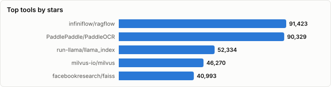
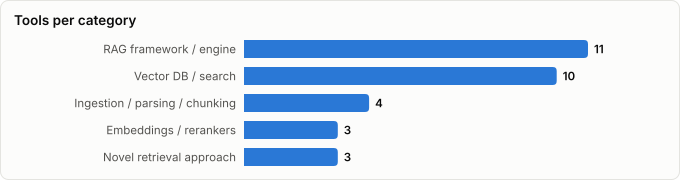

# RAG (Retrieval-Augmented Generation) Tooling — Landscape Report

> Derived from **kaiser-data**'s 2,304 starred repos (snapshot `2026-10-05T13:01:39.533Z`), cross-referenced with the repo-similarity graph (2,304 nodes / 7,632 edges, 40 communities).
>
> Generated 2026-10-05 by `scripts/reports/rag_tooling.py` (regenerate any time — no API cost).

## Executive summary

- **31 RAG tools** in your stars (**736,829★** combined) — the largest AI category here — organized along the RAG pipeline:
  - **RAG framework / engine** (11): `ragflow`, `llama_index`, `LightRAG`, `graphrag`, `haystack`, `RAG-Anything`, `llmware`, `txtai`, `AdalFlow`, `GraphRAG-SDK`, `RAGLight`
  - **Vector DB / search** (10): `milvus`, `faiss`, `qdrant`, `chroma`, `pgvector`, `weaviate`, `zvec`, `lancedb`, `FalkorDB`, `marqo`
  - **Ingestion / parsing / chunking** (4): `PaddleOCR`, `unstructured`, `chonkie`, `chonkiejs`
  - **Embeddings / rerankers** (3): `sentence-transformers`, `sie`, `colpali`
  - **Novel retrieval approach** (3): `PageIndex`, `LEANN`, `claude-context`
- Mental model — RAG is a pipeline: **ingest/parse → chunk → embed → store/index → retrieve/rerank → generate**. Each category above owns one stage; the frameworks stitch them together.
- Two clear trends: **GraphRAG** (graph-structured retrieval — `LightRAG`, `GraphRAG-SDK`, `FalkorDB`) and **post-vector** retrieval that questions the embed-everything default (`PageIndex` vectorless, `LEANN` 97% storage savings).
- Python dominates the frameworks; the vector-DB layer is mostly systems languages (Rust/Go/C/C++) for performance.

## The RAG pipeline at a glance

| Stage | What happens | Tools in your stars |
|---|---|---|
| **Ingest / parse** | PDFs, images, HTML → clean text/elements | `unstructured`, `PaddleOCR` |
| **Chunk** | Split documents into retrievable units | `chonkie`, `chonkiejs` |
| **Embed / rerank** | Encode chunks & queries; reorder hits | `sentence-transformers`, `colpali`, `sie` |
| **Store / index** | Persist vectors/graphs for ANN search | `qdrant`, `chroma`, `weaviate`, `pgvector`, `zvec`, `faiss`, `FalkorDB` |
| **Retrieve / generate** | Orchestrate retrieval + LLM answer | `ragflow`, `llama_index`, `haystack`, `LightRAG`, `RAG-Anything`, `llmware`, `AdalFlow`, `airweave`, `RAGLight`, `GraphRAG-SDK` |
| **Rethink** | Approaches that change the pipeline itself | `PageIndex` (vectorless), `LEANN` (tiny storage), `claude-context` (code) |

## Master comparison

Sorted by stars. `Health`/`Lifecycle` are the dataset's computed metrics; `Activity` is derived from days-since-push + 90-day commits.

| Tool | Category | Lang | License | ★ Stars | Lifecycle | Health | Activity | Last push | Age | Contrib(90d) |
|---|---|---|---|---|---|---|---|---|---|---|
| [infiniflow/ragflow](https://github.com/infiniflow/ragflow) | RAG framework / engine | Go | Apache-2.0 | 91,689 (▲405) | Mature | 93 | very active | 1d ago | 2.8y | 18 |
| [PaddlePaddle/PaddleOCR](https://github.com/PaddlePaddle/PaddleOCR) | Ingestion / parsing / chunking | Python | Apache-2.0 | 90,626 (▲432) | Mature | 63 | active | 19d ago | 6.4y | 2 |
| [run-llama/llama_index](https://github.com/run-llama/llama_index) | RAG framework / engine | Python | MIT | 52,410 (▲98) | Classic | 98 | very active | 4d ago | 3.9y | 56 |
| [milvus-io/milvus](https://github.com/milvus-io/milvus) | Vector DB / search | Go | Apache-2.0 | 46,317 (▲64) | Classic | 99 | very active | 0d ago | 7.1y | 36 |
| [facebookresearch/faiss](https://github.com/facebookresearch/faiss) | Vector DB / search | C++ | MIT | 41,079 (▲101) | Classic | 99 | very active | 2d ago | 9.7y | 46 |
| [HKUDS/LightRAG](https://github.com/HKUDS/LightRAG) | RAG framework / engine | Python | MIT | 39,981 (▲132) | Mature | 78 | very active | 2d ago | 2.0y | 11 |
| [VectifyAI/PageIndex](https://github.com/VectifyAI/PageIndex) | Novel retrieval approach | Python | MIT | 38,669 (▲2,824) | Hot | 77 | very active | 0d ago | 1.5y | 4 |
| [microsoft/graphrag](https://github.com/microsoft/graphrag) | RAG framework / engine | Python | MIT | 36,226 (▲129) | Mature | 72 | very active | 0d ago | 2.5y | 4 |
| [qdrant/qdrant](https://github.com/qdrant/qdrant) | Vector DB / search | Rust | Apache-2.0 | 34,934 (▲125) | Classic | 88 | very active | 0d ago | 6.4y | 17 |
| [chroma-core/chroma](https://github.com/chroma-core/chroma) | Vector DB / search | Rust | Apache-2.0 | 29,441 (▲71) | Classic | 83 | very active | 1d ago | 4.0y | 9 |
| [deepset-ai/haystack](https://github.com/deepset-ai/haystack) | RAG framework / engine | Python | Apache-2.0 | 26,660 (▲66) | Classic | 90 | very active | 0d ago | 6.9y | 32 |
| [HKUDS/RAG-Anything](https://github.com/HKUDS/RAG-Anything) | RAG framework / engine | Python | MIT | 23,479 (▲61) | Hot | 75 | very active | 0d ago | 1.3y | 17 |
| [pgvector/pgvector](https://github.com/pgvector/pgvector) | Vector DB / search | C | NOASSERTION | 23,246 (▲91) | Classic | 64 | very active | 4d ago | 5.5y | 3 |
| [huggingface/sentence-transformers](https://github.com/huggingface/sentence-transformers) | Embeddings / rerankers | Python | Apache-2.0 | 19,150 (▲29) | Classic | 80 | very active | 4d ago | 7.2y | 31 |
| [weaviate/weaviate](https://github.com/weaviate/weaviate) | Vector DB / search | Go | NOASSERTION | 16,863 (▲18) | Classic | 83 | very active | 0d ago | 10.5y | 10 |
| [alibaba/zvec](https://github.com/alibaba/zvec) | Vector DB / search | C++ | Apache-2.0 | 16,060 (▲56) | Hot | 93 | very active | 6d ago | 10mo | 16 |
| [Unstructured-IO/unstructured](https://github.com/Unstructured-IO/unstructured) | Ingestion / parsing / chunking | HTML | Apache-2.0 | 15,526 (▲41) | Classic | 82 | very active | 0d ago | 4.0y | 17 |
| [llmware-ai/llmware](https://github.com/llmware-ai/llmware) | RAG framework / engine | Python | Apache-2.0 | 14,824 (▼5) | Mature | 56 | active | 4d ago | 3.0y | 1 |
| [StarTrail-org/LEANN](https://github.com/StarTrail-org/LEANN) | Novel retrieval approach | Python | MIT | 13,008 (▲47) | Hot | 83 | very active | 6d ago | 1.3y | 18 |
| [neuml/txtai](https://github.com/neuml/txtai) | RAG framework / engine | Python | Apache-2.0 | 12,990 (▲12) | Classic | 90 | very active | 0d ago | 6.2y | 24 |
| [zilliztech/claude-context](https://github.com/zilliztech/claude-context) | Novel retrieval approach | TypeScript | MIT | 12,585 (▲18) | Declining | 36 | slowing | 2mo ago | 1.3y | 2 |
| [lancedb/lancedb](https://github.com/lancedb/lancedb) | Vector DB / search | Rust | Apache-2.0 | 11,601 (▲75) | Classic | 92 | very active | 0d ago | 3.6y | 30 |
| [FalkorDB/FalkorDB](https://github.com/FalkorDB/FalkorDB) | Vector DB / search | Rust | NOASSERTION | 7,199 (▲903) | Classic | 81 | very active | 0d ago | 3.2y | 7 |
| [marqo-ai/marqo](https://github.com/marqo-ai/marqo) | Vector DB / search | Python | Apache-2.0 | 5,032 (▲1) | Mature | 46 | active | 1mo ago | 4.2y | 0 |
| [feyninc/chonkie](https://github.com/feyninc/chonkie) | Ingestion / parsing / chunking | Python | MIT | 4,783 (▲13) | Mature | 68 | active | 2d ago | 1.5y | 4 |
| [SylphAI-Inc/AdalFlow](https://github.com/SylphAI-Inc/AdalFlow) | RAG framework / engine | Python | MIT | 4,223 (▲8) | Mature | 25 | slowing | 4mo ago | 2.5y | 0 |
| [superlinked/sie](https://github.com/superlinked/sie) | Embeddings / rerankers | Python | Apache-2.0 | 3,360 (▲42) | Mature | 74 | very active | 0d ago | 2.9y | 3 |
| [illuin-tech/colpali](https://github.com/illuin-tech/colpali) | Embeddings / rerankers | Python | MIT | 2,822 (▲5) | Mature | 63 | active | 14d ago | 2.3y | 3 |
| [FalkorDB/GraphRAG-SDK](https://github.com/FalkorDB/GraphRAG-SDK) | RAG framework / engine | Python | Apache-2.0 | 1,006 (▲5) | Mature | 77 | very active | 0d ago | 2.7y | 4 |
| [Bessouat40/RAGLight](https://github.com/Bessouat40/RAGLight) | RAG framework / engine | Python | MIT | 672 (▲1) | Mature | 58 | active | 1mo ago | 1.8y | 1 |
| [feyninc/chonkiejs](https://github.com/feyninc/chonkiejs) | Ingestion / parsing / chunking | TypeScript | MIT | 368 | Mature | 62 | active | 2d ago | 1.4y | 1 |

## By category

### RAG framework / engine

_End-to-end systems that orchestrate the whole pipeline. Engines (ragflow) are batteries-included apps; libraries (llama_index, haystack) are composable toolkits._

- **[infiniflow/ragflow](https://github.com/infiniflow/ragflow)** · 91,689★ · Go · Mature  
  Leading OSS RAG engine; deep document understanding + template-based chunking, batteries included.  
  topics: ai, ai-agents, context-engine, rag, retrieval-augmented-generation, agentic-ai, agentic-retrieval, agentic-search
- **[run-llama/llama_index](https://github.com/run-llama/llama_index)** · 52,410★ · Python · Classic  
  The 'document agent' framework — data connectors, indices, query engines; foundational RAG toolkit.  
  topics: agents, application, data, fine-tuning, framework, llamaindex, llm, rag
- **[HKUDS/LightRAG](https://github.com/HKUDS/LightRAG)** · 39,981★ · Python · Mature  
  Simple & fast RAG that builds a graph index over chunks (GraphRAG-style) for better multi-hop recall.  
  topics: knowledge-graph, large-language-models, retrieval-augmented-generation, genai, graphrag, llm, rag, gpt
- **[microsoft/graphrag](https://github.com/microsoft/graphrag)** · 36,226★ · Python · Mature  
  Microsoft's reference GraphRAG — LLM-built entity graph + community summaries over a corpus.  
  topics: graphrag, rag, llm, llms, gpt, gpt-4, gpt4
- **[deepset-ai/haystack](https://github.com/deepset-ai/haystack)** · 26,660★ · Python · Classic  
  Pipeline-oriented orchestration for production RAG / context-engineered LLM apps.  
  topics: semantic-search, information-retrieval, ai, python, large-language-models, generative-ai, llm, rag
- **[HKUDS/RAG-Anything](https://github.com/HKUDS/RAG-Anything)** · 23,479★ · Python · Hot  
  All-in-one multimodal RAG over text, tables, images, equations.  
  topics: multi-modal-rag, retrieval-augmented-generation
- **[llmware-ai/llmware](https://github.com/llmware-ai/llmware)** · 14,824★ · Python · Mature  
  Enterprise RAG with small, specialized models; private-deployment focus.  
  topics: parsing, retrieval-augmented-generation, agents, generative-ai-tools, llamacpp, llm, small-specialized-models, onnx
- **[neuml/txtai](https://github.com/neuml/txtai)** · 12,990★ · Python · Classic  
  All-in-one embeddings DB + RAG + workflows in one package.  
  topics: python, search, nlp, semantic-search, vector-search, txtai, llm, vector-database
- **[SylphAI-Inc/AdalFlow](https://github.com/SylphAI-Inc/AdalFlow)** · 4,223★ · Python · Mature  
  Library to build & *auto-optimize* LLM/RAG apps (prompt + retriever tuning).  
  topics: agent, framework, llm, rag, generative-ai, machine-learning, nlp, python
- **[FalkorDB/GraphRAG-SDK](https://github.com/FalkorDB/GraphRAG-SDK)** · 1,006★ · Python · Mature  
  SDK to build GraphRAG apps on FalkorDB at scale.  
  topics: falkordb, graphrag, knowledge-graph, rag, graph-database, open-source, sdk, genai
- **[Bessouat40/RAGLight](https://github.com/Bessouat40/RAGLight)** · 672★ · Python · Mature  
  Lightweight modular RAG framework for quick pipelines.  
  topics: data-science, framework, huggingface, ollama, retrieval-augmented-generation, vector-database, artificial-intelligence, rag

### Vector DB / search

_Where embeddings live and approximate-nearest-neighbour search happens. Choice often comes down to scale, hybrid search, and ops footprint._

- **[milvus-io/milvus](https://github.com/milvus-io/milvus)** · 46,317★ · Go · Classic  
  Largest-scale OSS vector database — distributed, billion-vector ANN search.  
  topics: anns, nearest-neighbor-search, faiss, vector-search, image-search, hnsw, vector-database, embedding-database
- **[facebookresearch/faiss](https://github.com/facebookresearch/faiss)** · 41,079★ · C++ · Classic  
  Foundational dense-vector similarity-search library; the index under many DBs.  
  topics: —
- **[qdrant/qdrant](https://github.com/qdrant/qdrant)** · 34,934★ · Rust · Classic  
  High-performance, massive-scale vector DB & search engine (Rust).  
  topics: neural-network, search-engine, knn-algorithm, hnsw, vector-search, nearest-neighbor-search, image-search, embeddings-similarity
- **[chroma-core/chroma](https://github.com/chroma-core/chroma)** · 29,441★ · Rust · Classic  
  AI-native search/vector DB; popular default for prototyping RAG.  
  topics: database, rust, rust-lang, ai, agents, ai-agents
- **[pgvector/pgvector](https://github.com/pgvector/pgvector)** · 23,246★ · C · Classic  
  Vector similarity search as a Postgres extension — RAG without new infra.  
  topics: nearest-neighbor-search, approximate-nearest-neighbor-search
- **[weaviate/weaviate](https://github.com/weaviate/weaviate)** · 16,863★ · Go · Classic  
  Vector DB storing objects + vectors with hybrid (keyword+vector) search.  
  topics: search-engine, semantic-search, semantic-search-engine, vector-search, vector-search-engine, vector-database, approximate-nearest-neighbor-search, image-search
- **[alibaba/zvec](https://github.com/alibaba/zvec)** · 16,060★ · C++ · Hot  
  Lightweight, lightning-fast in-process vector database.  
  topics: rag, agent-skills, embedded, faiss, hnsw, llm-memory, search-engine, semantic-search
- **[lancedb/lancedb](https://github.com/lancedb/lancedb)** · 11,601★ · Rust · Classic  
  Embedded, serverless vector DB (columnar/Lance format); zero-ops local RAG.  
  topics: approximate-nearest-neighbor-search, image-search, nearest-neighbor-search, recommender-system, search-engine, semantic-search, similarity-search, vector-database
- **[FalkorDB/FalkorDB](https://github.com/FalkorDB/FalkorDB)** · 7,199★ · Rust · Classic  
  Fast graph database (GraphBLAS) — substrate for graph-shaped retrieval.  
  topics: graph-database, knowledge-graph, database-as-a-service, cloud-database, database, developer-tools, devtools, realtime-database
- **[marqo-ai/marqo](https://github.com/marqo-ai/marqo)** · 5,032★ · Python · Mature  
  End-to-end vector search that bundles embedding inference (text + image).  
  topics: multi-modal, search-engine, machine-learning, ecommerce

### Ingestion / parsing / chunking

_The unglamorous-but-decisive front of the pipeline: garbage chunks in → garbage retrieval out._

- **[PaddlePaddle/PaddleOCR](https://github.com/PaddlePaddle/PaddleOCR)** · 90,626★ · Python · Mature  
  Powerful OCR — turns PDFs/images into structured text for the RAG ingest stage.  
  topics: ocr, chineseocr, pdf2markdown, pp-ocr, pp-structure, document-parsing, document-translation, kie
- **[Unstructured-IO/unstructured](https://github.com/Unstructured-IO/unstructured)** · 15,526★ · HTML · Classic  
  ETL that turns PDFs/docs/HTML into clean, chunk-ready structured elements.  
  topics: deep-learning, document-parsing, machine-learning, nlp, ocr, information-retrieval, data-pipelines, ml
- **[feyninc/chonkie](https://github.com/feyninc/chonkie)** · 4,783★ · Python · Mature  
  Lightweight, fast chunking library (the 🦛) — many strategies, minimal deps.  
  topics: rag, chonkie, chunker, chunking-algorithm, retrieval-systems, semantic-chunker, similarity-search, text-splitter
- **[feyninc/chonkiejs](https://github.com/feyninc/chonkiejs)** · 368★ · TypeScript · Mature  
  TypeScript port of Chonkie for JS/TS RAG pipelines.  
  topics: typescript, ai, splitting-algorithms, chunker, rag, retrieval-systems, chunking-algorithm, text-splitter

### Embeddings / rerankers

_The models that turn text (or page images) into vectors and reorder candidate hits for precision._

- **[huggingface/sentence-transformers](https://github.com/huggingface/sentence-transformers)** · 19,150★ · Python · Classic  
  SoTA embeddings, retrieval & reranking models — the encoder layer of RAG.  
  topics: —
- **[superlinked/sie](https://github.com/superlinked/sie)** · 3,360★ · Python · Mature  
  Inference engine/server for embeddings & rerankers in production retrieval.  
  topics: embeddings, vector-search, data-pipeline, deep-learning, information-retrieval, llm, ml, mlops
- **[illuin-tech/colpali](https://github.com/illuin-tech/colpali)** · 2,822★ · Python · Mature  
  Vision embeddings (ColPali/ColQwen) for document retrieval straight from page images.  
  topics: colpali, information-retrieval, retrieval-augmented-generation, vision-language-model, colqwen2, colsmol

### Novel retrieval approach

_Projects challenging the embed-everything-into-a-vector-DB default — vectorless, storage-frugal, or domain-specialized retrieval._

- **[VectifyAI/PageIndex](https://github.com/VectifyAI/PageIndex)** · 38,669★ · Python · Hot  
  Vectorless, reasoning-based RAG — builds a document index/tree, navigates with the LLM.  
  topics: agentic-ai, agents, ai, ai-agents, context-engineering, llm, rag, reasoning
- **[StarTrail-org/LEANN](https://github.com/StarTrail-org/LEANN)** · 13,008★ · Python · Hot  
  Storage-frugal RAG: ~97% storage savings while keeping fast, accurate retrieval.  
  topics: ai, faiss, langchain, llama-index, llm, localstorage, offline-first, ollama
- **[zilliztech/claude-context](https://github.com/zilliztech/claude-context)** · 12,585★ · TypeScript · Declining  
  Code-search MCP that makes an entire codebase the retrievable context for coding agents.  
  topics: agent, agentic-rag, ai-coding, code-search, cursor, embedding, mcp, nodejs

## Spotlight: GraphRAG

A cross-cutting trend — instead of a flat vector store, build a **knowledge graph** over chunks so retrieval can follow relationships (better for multi-hop questions). In your stars:

- **[microsoft/graphrag](https://github.com/microsoft/graphrag)** · 36,226★ — Microsoft's reference GraphRAG — LLM-built entity graph + community summaries over a corpus.
- **[HKUDS/LightRAG](https://github.com/HKUDS/LightRAG)** · 39,981★ — Simple & fast RAG that builds a graph index over chunks (GraphRAG-style) for better multi-hop recall.
- **[FalkorDB/GraphRAG-SDK](https://github.com/FalkorDB/GraphRAG-SDK)** · 1,006★ — SDK to build GraphRAG apps on FalkorDB at scale.
- **[FalkorDB/FalkorDB](https://github.com/FalkorDB/FalkorDB)** · 7,199★ — Fast graph database (GraphBLAS) — substrate for graph-shaped retrieval.

## Graph analysis — how they relate

**Community clustering.** These 31 tools span **10 of the graph's 40 communities**.

- **Community 0** (10): `deepset-ai/haystack`, `llmware-ai/llmware`, `Bessouat40/RAGLight`, `chroma-core/chroma`, `neuml/txtai`, `feyninc/chonkie`, `feyninc/chonkiejs`, `VectifyAI/PageIndex`, `StarTrail-org/LEANN`, `zilliztech/claude-context`
- **Community 24** (7): `infiniflow/ragflow`, `qdrant/qdrant`, `weaviate/weaviate`, `pgvector/pgvector`, `alibaba/zvec`, `milvus-io/milvus`, `lancedb/lancedb`
- **Community 28** (2): `HKUDS/LightRAG`, `HKUDS/RAG-Anything`
- **Community 9** (2): `SylphAI-Inc/AdalFlow`, `microsoft/graphrag`
- **Community 5** (2): `FalkorDB/GraphRAG-SDK`, `FalkorDB/FalkorDB`
- **Community 14** (2): `facebookresearch/faiss`, `superlinked/sie`
- **Community 7** (2): `Unstructured-IO/unstructured`, `illuin-tech/colpali`
- **Community 18** (2): `PaddlePaddle/PaddleOCR`, `huggingface/sentence-transformers`

**Centrality (PageRank in the full 1,071-repo graph)** — most 'hub-like' RAG tools in your ecosystem:

- `VectifyAI/PageIndex` — PageRank 0.0010
- `deepset-ai/haystack` — PageRank 0.0009
- `qdrant/qdrant` — PageRank 0.0009
- `microsoft/graphrag` — PageRank 0.0009
- `neuml/txtai` — PageRank 0.0007
- `chroma-core/chroma` — PageRank 0.0007
- `run-llama/llama_index` — PageRank 0.0006
- `FalkorDB/GraphRAG-SDK` — PageRank 0.0006
- `FalkorDB/FalkorDB` — PageRank 0.0006
- `HKUDS/LightRAG` — PageRank 0.0006

**Direct links between RAG tools** (top similarity edges where both endpoints are in this report):

- `feyninc/chonkiejs` ⇄ `feyninc/chonkie` (w=1.833) — topics: ai, splitting-algorithms, chunker, rag; authors: chonk-lain
- `FalkorDB/GraphRAG-SDK` ⇄ `FalkorDB/FalkorDB` (w=1.144) — topics: graphrag, knowledge-graph, graph-database; authors: gkorland, dependabot[bot]
- `HKUDS/RAG-Anything` ⇄ `HKUDS/LightRAG` (w=0.633) — topics: retrieval-augmented-generation
- `neuml/txtai` ⇄ `deepset-ai/haystack` (w=0.537) — topics: python, semantic-search, llm, large-language-models; authors: LimbC-C, serhiizghama, MohammadHijjawi97
- `VectifyAI/PageIndex` ⇄ `deepset-ai/haystack` (w=0.441) — topics: agentic-ai, agents, ai, ai-agents
- `weaviate/weaviate` ⇄ `qdrant/qdrant` (w=0.429) — topics: search-engine, vector-search, vector-search-engine, vector-database
- `lancedb/lancedb` ⇄ `weaviate/weaviate` (w=0.400) — topics: approximate-nearest-neighbor-search, image-search, nearest-neighbor-search, recommender-system
- `neuml/txtai` ⇄ `StarTrail-org/LEANN` (w=0.391) — topics: python, vector-search, llm, vector-database; authors: serhiizghama, Lesereingrape
- `neuml/txtai` ⇄ `VectifyAI/PageIndex` (w=0.383) — topics: llm, vector-database, information-retrieval, retrieval-augmented-generation
- `lancedb/lancedb` ⇄ `qdrant/qdrant` (w=0.366) — topics: image-search, nearest-neighbor-search, recommender-system, search-engine; authors: dependabot[bot]
- `neuml/txtai` ⇄ `superlinked/sie` (w=0.300) — topics: python, nlp, semantic-search, vector-search
- `StarTrail-org/LEANN` ⇄ `deepset-ai/haystack` (w=0.295) — topics: ai, llm, python, rag; authors: Lesereingrape, serhiizghama
- `VectifyAI/PageIndex` ⇄ `infiniflow/ragflow` (w=0.286) — topics: agentic-ai, ai, ai-agents, context-engineering
- `SylphAI-Inc/AdalFlow` ⇄ `deepset-ai/haystack` (w=0.262) — topics: framework, llm, rag, generative-ai
- `lancedb/lancedb` ⇄ `alibaba/zvec` (w=0.255) — topics: search-engine, semantic-search, similarity-search, vector-database; authors: dependabot[bot]
- …and 9 more.

## Maintenance & risk signal

Bus factor = commit concentration (1 = single-maintainer risk). Pair with lifecycle + activity before adopting.

| Tool | Health | Lifecycle | Activity | Bus factor | Top-author share | Releases |
|---|---|---|---|---|---|---|
| facebookresearch/faiss | 99 | Classic | very active | 6 | 22% | 29 |
| milvus-io/milvus | 99 | Classic | very active | 8 | 10% | 176 |
| run-llama/llama_index | 98 | Classic | very active | 11 | 14% | 497 |
| infiniflow/ragflow | 93 | Mature | very active | 4 | 21% | 56 |
| alibaba/zvec | 93 | Hot | very active | 4 | 17% | 11 |
| lancedb/lancedb | 92 | Classic | very active | 4 | 18% | 516 |
| deepset-ai/haystack | 90 | Classic | very active | 3 | 36% | 247 |
| neuml/txtai | 90 | Classic | very active | 3 | 36% | 67 |
| qdrant/qdrant | 88 | Classic | very active | 3 | 30% | 117 |
| chroma-core/chroma | 83 | Classic | very active | 2 | 36% | 137 |
| weaviate/weaviate | 83 | Classic | very active | 2 | 43% | 593 |
| StarTrail-org/LEANN | 83 | Hot | very active | 5 | 18% | 30 |
| Unstructured-IO/unstructured | 82 | Classic | very active | 3 | 30% | 243 |
| FalkorDB/FalkorDB | 81 | Classic | very active | 2 | 44% | 87 |
| huggingface/sentence-transformers | 80 | Classic | very active | 2 | 45% | 72 |
| HKUDS/LightRAG | 78 | Mature | very active | 1 | 60% | 83 |
| FalkorDB/GraphRAG-SDK | 77 | Mature | very active | 1 | 70% | 31 |
| VectifyAI/PageIndex | 77 | Hot | very active | 1 | 51% | 19 |
| HKUDS/RAG-Anything | 75 | Hot | very active | 3 | 25% | 21 |
| superlinked/sie | 74 | Mature | very active | 1 | 76% | 53 |
| microsoft/graphrag | 72 | Mature | very active | 1 | 56% | 43 |
| feyninc/chonkie | 68 | Mature | active | 1 | 78% | 45 |
| pgvector/pgvector | 64 | Classic | very active | 1 | 98% | 0 |
| PaddlePaddle/PaddleOCR | 63 | Mature | active | 1 | 50% | 33 |
| illuin-tech/colpali | 63 | Mature | active | 1 | 63% | 23 |
| feyninc/chonkiejs | 62 | Mature | active | 1 | 100% | 8 |
| Bessouat40/RAGLight | 58 | Mature | active | 1 | 100% | 45 |
| llmware-ai/llmware | 56 | Mature | active | 1 | 100% | 4 |
| marqo-ai/marqo | 46 | Mature | active | 0 | 0% | 113 |
| zilliztech/claude-context | 36 | Declining | slowing | 1 | 67% | 0 |
| SylphAI-Inc/AdalFlow | 25 | Mature | slowing | 0 | 0% | 7 |

## Which one should you use?

| If you want… | Start with | Why |
|---|---|---|
| A batteries-included RAG app over your docs | `infiniflow/ragflow` | Most-starred engine here (health 96); strong document parsing + chunking out of the box. |
| A composable toolkit to build custom RAG | `run-llama/llama_index` or `deepset-ai/haystack` | Mature libraries; connectors, indices, and pipeline primitives. |
| Graph-structured / multi-hop retrieval | `HKUDS/LightRAG` | Fast GraphRAG; builds an entity graph over chunks. |
| A production vector store at scale | `qdrant/qdrant` | High-performance Rust vector DB; health 88, widely deployed. |
| RAG with zero new infrastructure | `pgvector/pgvector` | Adds vector search to the Postgres you already run. |
| Best document parsing for ingestion | `Unstructured-IO/unstructured` (+ `PaddleOCR`) | Turns messy PDFs/HTML into clean, chunkable elements; OCR for scanned docs. |
| Good chunking without heavy deps | `feyninc/chonkie` | Lightweight, many strategies; JS port available. |
| To skip vector DBs entirely | `VectifyAI/PageIndex` | Vectorless, reasoning-based retrieval over a document tree. |
| Tiny-footprint / on-device RAG | `StarTrail-org/LEANN` | ~97% storage savings vs. a conventional vector index. |

## Adjacent (deliberately not listed as RAG tools)

- **langchain-ai/langchain** (147,462★) — general agent/LLM framework — RAG is one use case, too broad to list as RAG-specific
- **topoteretes/cognee** (31,377★) — covered in the *memory frameworks* report (graph memory, RAG-adjacent)
- **memvid/memvid** (16,573★) — covered in the *memory frameworks* report
- **NirDiamant/RAG_Techniques** (29,669★) — excellent *tutorial* collection, not a tool/library
- **KRLabsOrg/LettuceDetect** (613★) — RAG *evaluation* (hallucination detection) — see the LLM-evaluation report

## Build something with this stack

Ready-to-paste build prompts generated from this report's stack — the tools above, wired into a brief an LLM can act on.

- **Retrieval-evaluation harness** — A retrieval-evaluation harness that scores recall@k and MRR against a fixed question set, with a keyword-only baseline so every number has a floor.  
  `prompts/rag-eval-harness.md`

## Methodology & caveats

- **Source**: `data/classified.json` + `public/data/graph.json`. No external calls; fully reproducible.
- **Selection**: keyword scan (rag / retrieval-augmented / graphrag / vector db / embedding / rerank / chunk / semantic-search) + manual curation into pipeline stages. Tutorials, general agent frameworks, and memory-layer projects were routed to adjacent reports or excluded (see above).
- **Metrics** (health, lifecycle, bus_factor) are precomputed at snapshot time and may lag GitHub's current state.
- Re-run after a fresh `classified.json` to refresh stars/activity.

### Retired from the scored set

Archived upstream, so they no longer appear in this report's tables — `sample.mjs` excludes archived repos. Metrics are frozen at the date shown and are not refreshed.

| Project | Category | Why it left | Metrics as of |
|---|---|---|---|
| [`airweave-ai/airweave`](https://github.com/airweave-ai/airweave) | RAG framework / engine | Archived upstream; last in the dataset 2026-08-28. Context-retrieval layer that syncs apps/DBs into agent-queryable knowledge. | 2026-08-28 |

Tools covered: 31 · Snapshot: 2026-10-05T13:01:39.533Z
