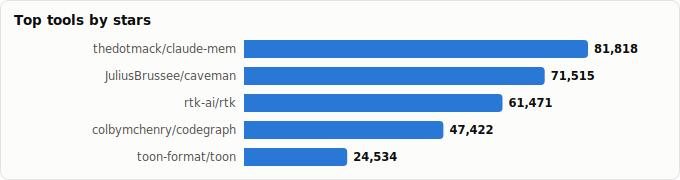
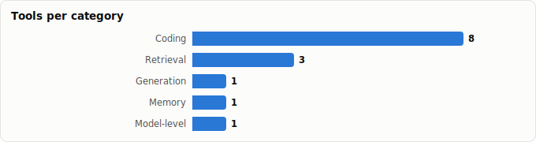

# Token-Savings & Context-Efficiency Tooling

> Derived from **kaiser-data**'s 1,327 starred repos (snapshot `2026-07-13T08:42:30.177Z`), cross-referenced with the repo-similarity graph (1,327 nodes / 4,302 edges, 27 communities).
>
> Generated 2026-07-13 by `scripts/reports/token_savings.py` (regenerate any time — no API cost).

> **Read this first:** the right token-saver depends on **what you're spending tokens on** — reading code, generating structured output, retrieving documents, or carrying long-session memory. So this report is organized **by workload**, not by tool type. Tools at different layers mostly **compose** rather than compete. All **% figures are the projects' own claims** on the May-2026 snapshot — not independently benchmarked here.

## Executive summary

- **14 token-savings tools** in your stars (**399,891★**), organized by workload:
  - **Coding agents & codebases** (8): `caveman`, `rtk`, `codegraph`, `context-mode`, `codeburn`, `semble`, `lean-ctx`, `FastCode`
  - **Generation & structured prompting** (1): `toon`
  - **Retrieval, RAG & documents** (3): `DeepSeek-OCR`, `dbhub`, `blockify-agentic-data-optimization`
  - **Long-running agents & memory** (1): `claude-mem`
  - **Model & inference level** (1): `llm-compressor`
- **Your collection skews hard to coding** — 8 of 14 tools. The big coding sink is *reading the codebase*, so the highest-leverage picks index/search code (`semble`, `codegraph`) or tame tool output (`context-mode`).
- **Different workload, different layer:** generation savings live in the *prompt/format* (`toon`); retrieval savings in *what you fetch* (`dbhub`, `blockify`); long agents in *session memory* (`claude-mem`); and model-level compression (`llm-compressor`) is a separate concern entirely (cheaper inference, not fewer prompt tokens).
- **The one integration-free win:** `rtk` (a CLI proxy) claims 60–90% with no per-agent setup — and it's the most-starred here (70,662★).
- **Measure first:** `codeburn` shows where tokens actually go before you optimize.

## Comparison by workload

### Coding agents & codebases

| Tool | ★ | Health | Activity | Mechanism | Claimed saving |
|---|---|---|---|---|---|
| [JuliusBrussee/caveman](https://github.com/JuliusBrussee/caveman) | 88,727 (▲17,212) | 73 | very active | Prompt-style skill | ~65% |
| [rtk-ai/rtk](https://github.com/rtk-ai/rtk) | 70,662 (▲9,191) | 78 | very active | Wire-level proxy | 60–90% on dev cmds |
| [colbymchenry/codegraph](https://github.com/colbymchenry/codegraph) | 59,541 (▲12,119) | 78 | very active | Code index/graph | ~70% |
| [mksglu/context-mode](https://github.com/mksglu/context-mode) | 18,861 (▲1,715) | 79 | very active | Tool-output sandbox | 98% on tool output |
| [getagentseal/codeburn](https://github.com/getagentseal/codeburn) | 8,636 (▲757) | 78 | very active | Measurement / observability | — (measures) |
| [MinishLab/semble](https://github.com/MinishLab/semble) | 5,595 (▲525) | 78 | very active | Semantic code search | ~98% vs grep+read |
| [yvgude/lean-ctx](https://github.com/yvgude/lean-ctx) | 3,229 (▲598) | 80 | very active | Context layer | qualitative |
| [HKUDS/FastCode](https://github.com/HKUDS/FastCode) | 2,251 (▲82) | 45 | active | Code understanding | qualitative |

### Generation & structured prompting

| Tool | ★ | Health | Activity | Mechanism | Claimed saving |
|---|---|---|---|---|---|
| [toon-format/toon](https://github.com/toon-format/toon) | 24,844 (▲310) | 70 | active | Compact data format | ~30–50% on structured data |

### Retrieval, RAG & documents

| Tool | ★ | Health | Activity | Mechanism | Claimed saving |
|---|---|---|---|---|---|
| [deepseek-ai/DeepSeek-OCR](https://github.com/deepseek-ai/DeepSeek-OCR) | 23,562 (▲288) | 17 | slowing | Optical context compression | research |
| [bytebase/dbhub](https://github.com/bytebase/dbhub) | 3,149 (▲196) | 62 | very active | Token-efficient DB access | qualitative |
| [iternal-technologies-partners/blockify-agentic-data-optimization](https://github.com/iternal-technologies-partners/blockify-agentic-data-optimization) | 286 (▲77) | 37 | slowing | Data optimization (RAG) | qualitative |

### Long-running agents & memory

| Tool | ★ | Health | Activity | Mechanism | Claimed saving |
|---|---|---|---|---|---|
| [thedotmack/claude-mem](https://github.com/thedotmack/claude-mem) | 87,012 (▲5,194) | 79 | very active | Session compression | qualitative |

### Model & inference level

| Tool | ★ | Health | Activity | Mechanism | Claimed saving |
|---|---|---|---|---|---|
| [vllm-project/llm-compressor](https://github.com/vllm-project/llm-compressor) | 3,536 (▲148) | 84 | very active | Model weight compression | n/a (inference, not prompt) |

## Details

### Coding agents & codebases

_Claude Code, Codex, Cursor, OpenCode, Hermes — the biggest token sink for most users, dominated by reading/searching source and tool output._

- **[JuliusBrussee/caveman](https://github.com/JuliusBrussee/caveman)** · 88,727★ · JavaScript · Hot · health 73 · _Prompt-style skill_ · **~65%**  
  Claude Code skill that trims tokens by emitting terse 'caveman' output — cheap to try, trades readability.  
  topics: ai, anthropic, caveman, claude, claude-code, llm
- **[rtk-ai/rtk](https://github.com/rtk-ai/rtk)** · 70,662★ · Rust · Hot · health 78 · _Wire-level proxy_ · **60–90% on dev cmds**  
  CLI proxy that intercepts common dev commands; integration-free 'install once, save everywhere'.  
  topics: agentic-coding, ai-coding, anthropic, claude-code, cli, command-line-tool
- **[colbymchenry/codegraph](https://github.com/colbymchenry/codegraph)** · 59,541★ · TypeScript · Hot · health 78 · _Code index/graph_ · **~70%**  
  Pre-indexed code knowledge graph for Claude Code/Codex/Cursor/OpenCode/Hermes — query instead of read.  
  topics: —
- **[mksglu/context-mode](https://github.com/mksglu/context-mode)** · 18,861★ · TypeScript · Hot · health 79 · _Tool-output sandbox_ · **98% on tool output**  
  Sandboxes/truncates tool output in the context window; 15 platforms.  
  topics: claude, claude-code, claude-code-plugins, mcp, skills, codex
- **[getagentseal/codeburn](https://github.com/getagentseal/codeburn)** · 8,636★ · TypeScript · Hot · health 78 · _Measurement / observability_ · **— (measures)**  
  TUI dashboard showing where your Claude Code/Codex/Cursor tokens go. Measure before you optimize.  
  topics: ai-coding, claude-code, cli, codex, cost-tracking, developer-tools
- **[MinishLab/semble](https://github.com/MinishLab/semble)** · 5,595★ · Python · Hot · health 78 · _Semantic code search_ · **~98% vs grep+read**  
  Fast, accurate code search for agents — replaces the grep+read pattern that dominates coding context.  
  topics: agents, code-search, embeddings, mcp, mcp-server, model-context-protocol
- **[yvgude/lean-ctx](https://github.com/yvgude/lean-ctx)** · 3,229★ · Rust · Hot · health 80 · _Context layer_ · **qualitative**  
  Cognitive context layer: 51+ MCP tools, multiple read modes, surgical reads (also in the MCP report).  
  topics: ai, cursor, llm, mcp, rust, token-optimization
- **[HKUDS/FastCode](https://github.com/HKUDS/FastCode)** · 2,251★ · Python · Declining · health 45 · _Code understanding_ · **qualitative**  
  Accelerates/streamlines code understanding — but low health and stale; verify first.  
  topics: —

### Generation & structured prompting

_When you feed data into prompts or ask for structured output — savings come from a tighter serialization format._

- **[toon-format/toon](https://github.com/toon-format/toon)** · 24,844★ · TypeScript · Hot · health 70 · _Compact data format_ · **~30–50% on structured data**  
  Token-Oriented Object Notation — schema-aware, human-readable replacement for JSON when you feed data into prompts or ask for structured output. Cross-cutting, but lives at the generation/prompt layer.  
  topics: data-format, llm, serialization, tokenization

### Retrieval, RAG & documents

_When tokens go to fetched context — keep what you retrieve small and dense._

- **[deepseek-ai/DeepSeek-OCR](https://github.com/deepseek-ai/DeepSeek-OCR)** · 23,562★ · Python · Declining · health 17 · _Optical context compression_ · **research**  
  'Contexts Optical Compression' — renders document context to images to fit more in window; low health & stale.  
  topics: —
- **[bytebase/dbhub](https://github.com/bytebase/dbhub)** · 3,149★ · TypeScript · Hot · health 62 · _Token-efficient DB access_ · **qualitative**  
  Zero-dependency, token-efficient database MCP server (Postgres/MySQL/SQL Server/…) — keeps query results lean.  
  topics: ai, anthropic, claude, database, mcp, mcp-server
- **[iternal-technologies-partners/blockify-agentic-data-optimization](https://github.com/iternal-technologies-partners/blockify-agentic-data-optimization)** · 286★ · Python · Declining · health 37 · _Data optimization (RAG)_ · **qualitative**  
  Replaces naive chunking with dense 'blocks' so retrieved context is smaller; declining/low health.  
  topics: —

### Long-running agents & memory

_Multi-session work where re-sending history is the cost — compress and persist instead._

- **[thedotmack/claude-mem](https://github.com/thedotmack/claude-mem)** · 87,012★ · JavaScript · Rising · health 79 · _Session compression_ · **qualitative**  
  Compresses & persists session context across runs so long projects don't re-pay for history (also in the Memory report).  
  topics: ai, ai-agents, ai-memory, anthropic, artificial-intelligence, claude

### Model & inference level

_A different layer: shrink the *model* for cheaper inference (doesn't reduce your prompt tokens)._

- **[vllm-project/llm-compressor](https://github.com/vllm-project/llm-compressor)** · 3,536★ · Python · Mature · health 84 · _Model weight compression_ · **n/a (inference, not prompt)**  
  Compresses model *weights* for cheaper/faster inference — a different layer than prompt-token savings; included for contrast.  
  topics: compression, quantization

## How to stack them

Because they hit different layers, a strong setup combines several:

| Your token sink | Reach for | Layer |
|---|---|---|
| Reading source code | `MinishLab/semble` or `colbymchenry/codegraph` | retrieval |
| Noisy tool / command output | `mksglu/context-mode` | tool output |
| Everything, no integration | `rtk-ai/rtk` | wire (proxy) |
| Structured data in prompts | `toon-format/toon` | format |
| Database queries | `bytebase/dbhub` | data access |
| Long multi-session work | `thedotmack/claude-mem` | session memory |
| Don't know yet | `getagentseal/codeburn` | measurement |

## Recommendations

**For coding agents (most people):**
1. `rtk-ai/rtk` — best general, integration-free reduction (60–90%, 70,662★, health 78).
2. `MinishLab/semble` (sharpest claim) or `colbymchenry/codegraph` (most adopted) — kill the read-the-codebase cost.
3. `mksglu/context-mode` — pair on top to tame tool output.

**General add-ons:**
- `toon-format/toon` if you feed structured data into prompts (format-level, composes with everything).
- `getagentseal/codeburn` first if you want evidence on where to focus.

## ⚠️ Adopt with caution

Low health and/or stale — verify before relying on:

| Tool | Workload | Health | Lifecycle | Last push |
|---|---|---|---|---|
| [deepseek-ai/DeepSeek-OCR](https://github.com/deepseek-ai/DeepSeek-OCR) | Retrieval, RAG & documents | 17 | Declining | 5mo ago |
| [iternal-technologies-partners/blockify-agentic-data-optimization](https://github.com/iternal-technologies-partners/blockify-agentic-data-optimization) | Retrieval, RAG & documents | 37 | Declining | 2mo ago |
| [HKUDS/FastCode](https://github.com/HKUDS/FastCode) | Coding agents & codebases | 45 | Declining | 7d ago |

## Graph analysis — how they relate

**Community clustering.** These 14 tools span **7 of the graph's 27 communities** — token-savings is a cross-cutting concern, not a single cluster.

- **Community 2** (5): `rtk-ai/rtk`, `getagentseal/codeburn`, `yvgude/lean-ctx`, `JuliusBrussee/caveman`, `thedotmack/claude-mem`
- **Community 5** (2): `colbymchenry/codegraph`, `mksglu/context-mode`
- **Community 14** (2): `MinishLab/semble`, `bytebase/dbhub`
- **Community 19** (2): `toon-format/toon`, `vllm-project/llm-compressor`

**Centrality (PageRank in the full 1,071-repo graph):**

- `mksglu/context-mode` — PageRank 0.0014
- `yvgude/lean-ctx` — PageRank 0.0010
- `JuliusBrussee/caveman` — PageRank 0.0010
- `rtk-ai/rtk` — PageRank 0.0008
- `vllm-project/llm-compressor` — PageRank 0.0008
- `deepseek-ai/DeepSeek-OCR` — PageRank 0.0007
- `bytebase/dbhub` — PageRank 0.0006
- `HKUDS/FastCode` — PageRank 0.0006

**Direct links between these tools** (similarity edges where both endpoints are in this report):

- `JuliusBrussee/caveman` ⇄ `mksglu/context-mode` (w=0.379) — topics: claude, claude-code; authors: github-actions[bot], ousamabenyounes
- `yvgude/lean-ctx` ⇄ `rtk-ai/rtk` (w=0.330) — topics: llm, rust, token-optimization, agentic-coding
- `getagentseal/codeburn` ⇄ `rtk-ai/rtk` (w=0.211) — topics: ai-coding, claude-code, cli, developer-tools
- `JuliusBrussee/caveman` ⇄ `thedotmack/claude-mem` (w=0.204) — topics: ai, anthropic, claude, claude-code

## Methodology & caveats

- **Source**: `data/classified.json` + `public/data/graph.json`. No external calls; fully reproducible.
- **Selection**: scan for token / context-window / compression signals (and explicit `NN% fewer/less` claims) across name/description/topics/README, then manual curation into Coding vs General and by mechanism.
- **% savings are vendor-claimed**, measured on the projects' own workloads — not verified here. Real savings depend heavily on *your* usage pattern.
- **Metrics** (health, lifecycle, days_since_push) are precomputed at snapshot time and may lag GitHub. Re-run after a fresh `classified.json` to refresh.

Tools covered: 14 across 5 workloads · Snapshot: 2026-07-13T08:42:30.177Z
