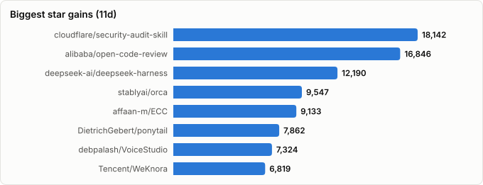

# Trending Now — What's Actually Moving in Your Stars

> Derived from **kaiser-data**'s 1,596 starred repos (snapshot `2026-08-11T18:59:16.380Z`), cross-referenced with the repo-similarity graph (1,596 nodes / 5,170 edges, 31 communities).
>
> Generated 2026-08-11 by `scripts/reports/trending_now.py` (regenerate any time — no API cost).

## Executive summary

- **This is the only report here that measures *change* rather than describing a landscape.** Every other report curates a taxonomy and renders it against the current vintage; this one diffs archived snapshots to show what actually moved.
- **Window**: `2026-07-27` → `2026-08-11` (**15 days**), covering the **1,392 repos** present in both snapshots. Long-run comparisons use `2026-06-11` → `2026-08-11` (**61 days**).
  - The immediately preceding snapshot (`2026-08-07`) is only 4 days before this one — too short to separate signal from noise — so the baseline was widened to the newest snapshot at least 7 days back.
- **1,130 repos gained stars** in the recent window, adding **364,169★** between them.
- **204 repos are new to the dataset** since the last refresh — newly starred, so they have no baseline to diff and are listed separately.
- **Measured, not estimated.** `classified.json` carries a `momentum` field, but it is a lifetime-stars/day proxy (its own source comment calls it "a serviceable proxy"). Everything below is observed snapshot-to-snapshot movement over a known number of days.

## How to read this

| Board | Question it answers | Bias to watch |
|---|---|---|
| **Fastest risers** | What gained the most stars outright? | Favours repos that are already huge — a 1% move on 100k stars beats a doubling at 500. |
| **Breakouts** | What grew fastest *relative to its size*? | Favours small repos; floored at 300★ baseline so noise doesn't win. |
| **Sustained climbers** | What has compounded over the long window? | Smooths out one-off spikes (a HN front page, a launch). |
| **New entrants** | What did you just start following? | Not growth at all — these have no baseline. |
| **Cooling off** | What is still growing, but much slower than it was? | Deceleration usually means a launch spike ending, not a project dying. |

## Fastest risers — absolute (2026-07-27 → 2026-08-11, 15d)

Raw star gain over the window. `Stars/day` normalizes for window length so this stays comparable across refreshes of different spacing.

| # | Repo | Gain | Stars/day | Stars now | Lang | Lifecycle | Activity |
|---|---|---|---|---|---|---|---|
| 1 | [microsoft/AI-For-Beginners](https://github.com/microsoft/AI-For-Beginners) | **+10,212** | 680.8 | 63,137 | Jupyter Notebook | Classic | very active |
| 2 | [DietrichGebert/ponytail](https://github.com/DietrichGebert/ponytail) | **+8,152** | 543.5 | 98,197 | JavaScript | Hot | very active |
| 3 | [TencentCloud/TencentDB-Agent-Memory](https://github.com/TencentCloud/TencentDB-Agent-Memory) | **+8,141** | 542.7 | 17,450 | TypeScript | Mature | active |
| 4 | [Graphify-Labs/graphify](https://github.com/Graphify-Labs/graphify) | **+7,286** | 485.7 | 103,983 | Python | Hot | very active |
| 5 | [ayghri/i-have-adhd](https://github.com/ayghri/i-have-adhd) | **+7,219** | 481.3 | 18,105 | Python | Hot | very active |
| 6 | [obra/superpowers](https://github.com/obra/superpowers) | **+6,878** | 458.5 | 268,683 | Shell | Hot | very active |
| 7 | [earendil-works/pi](https://github.com/earendil-works/pi) | **+6,686** | 445.7 | 85,266 | TypeScript | Hot | very active |
| 8 | [firecrawl/firecrawl](https://github.com/firecrawl/firecrawl) | **+6,193** | 412.9 | 162,852 | TypeScript | Mature | very active |
| 9 | [NousResearch/hermes-agent](https://github.com/NousResearch/hermes-agent) | **+5,921** | 394.7 | 227,042 | Python | Hot | very active |
| 10 | [lyogavin/airllm](https://github.com/lyogavin/airllm) | **+5,791** | 386.1 | 29,885 | Jupyter Notebook | Mature | very active |
| 11 | [codecrafters-io/build-your-own-x](https://github.com/codecrafters-io/build-your-own-x) | **+5,539** | 369.3 | 537,480 | Markdown | Mature | active |
| 12 | [usestrix/strix](https://github.com/usestrix/strix) | **+4,890** | 326.0 | 49,624 | Python | Hot | very active |
| 13 | [affaan-m/ECC](https://github.com/affaan-m/ECC) | **+4,760** | 317.3 | 238,551 | JavaScript | Hot | very active |
| 14 | [anomalyco/opencode](https://github.com/anomalyco/opencode) | **+4,651** | 310.1 | 194,722 | TypeScript | Hot | very active |
| 15 | [1jehuang/jcode](https://github.com/1jehuang/jcode) | **+4,598** | 306.5 | 16,337 | Rust | Rising | very active |
| 16 | [sindresorhus/awesome](https://github.com/sindresorhus/awesome) | **+3,918** | 261.2 | 493,398 | — | Mature | active |
| 17 | [nextlevelbuilder/ui-ux-pro-max-skill](https://github.com/nextlevelbuilder/ui-ux-pro-max-skill) | **+3,904** | 260.3 | 114,470 | Python | Hot | very active |
| 18 | [farion1231/cc-switch](https://github.com/farion1231/cc-switch) | **+3,902** | 260.1 | 125,449 | Rust | Hot | very active |
| 19 | [multica-ai/andrej-karpathy-skills](https://github.com/multica-ai/andrej-karpathy-skills) | **+3,826** | 255.1 | 200,508 | — | Declining | slowing |
| 20 | [microsoft/generative-ai-for-beginners](https://github.com/microsoft/generative-ai-for-beginners) | **+3,376** | 225.1 | 116,923 | Jupyter Notebook | Classic | very active |

## Breakouts — fastest relative growth (≥300★ baseline)

Percent growth over the same 15-day window. The baseline floor keeps small-number noise off the board — a repo going 8★ → 20★ is not a trend.

| # | Repo | Growth | Gain | Stars now | What it is |
|---|---|---|---|---|---|
| 1 | [TencentCloud/TencentDB-Agent-Memory](https://github.com/TencentCloud/TencentDB-Agent-Memory) | **+87%** | +8,141 | 17,450 | TencentDB Agent Memory is a team-level memory hub for AI Agents — turning conversations,… |
| 2 | [ayghri/i-have-adhd](https://github.com/ayghri/i-have-adhd) | **+66%** | +7,219 | 18,105 | A skill to stop your coding agent from burying the answer. ADHD-friendly output. |
| 3 | [semantica-agi/semantica](https://github.com/semantica-agi/semantica) | **+59%** | +855 | 2,294 | Graph-Native Infrastructure for Context and Accountable AI Systems |
| 4 | [1jehuang/jcode](https://github.com/1jehuang/jcode) | **+39%** | +4,598 | 16,337 | The most RAM efficient harness |
| 5 | [oomol-lab/open-connector](https://github.com/oomol-lab/open-connector) | **+31%** | +1,047 | 4,425 | Open-source auth gateway connecting 1000+ SaaS providers to AI agents through SDK, CLI, … |
| 6 | [StarTrail-org/PixelRAG](https://github.com/StarTrail-org/PixelRAG) | **+28%** | +2,022 | 9,337 | The end of web parsing. The beginning of scalable pixel-native search. link: https://pix… |
| 7 | [makerspet/oomwoo](https://github.com/makerspet/oomwoo) | **+24%** | +1,588 | 8,153 | Open-source vacuum robot cleaner |
| 8 | [lyogavin/airllm](https://github.com/lyogavin/airllm) | **+24%** | +5,791 | 29,885 | AirLLM 70B inference with single 4GB GPU |
| 9 | [microsoft/AI-For-Beginners](https://github.com/microsoft/AI-For-Beginners) | **+19%** | +10,212 | 63,137 | 12 Weeks, 24 Lessons, AI for All! |
| 10 | [hi-godot/godot-ai](https://github.com/hi-godot/godot-ai) | **+18%** | +226 | 1,488 | Production-grade MCP server and AI tools for the Godot engine. A Snap to install. Totall… |
| 11 | [matrixorigin/Memoria](https://github.com/matrixorigin/Memoria) | **+18%** | +82 | 549 | Secure memory management for AI Agents • Ensures data integrity • Reduces hallucinations… |
| 12 | [JustVugg/colibri](https://github.com/JustVugg/colibri) | **+17%** | +3,374 | 23,168 | Run frontier MoE models on hardware you already own — pure C, zero deps, experts streame… |
| 13 | [Kruszoneq/macUSB](https://github.com/Kruszoneq/macUSB) | **+16%** | +326 | 2,340 | The all-in-one bootable USB creator for Mac |
| 14 | [localai-org/depth-anything.cpp](https://github.com/localai-org/depth-anything.cpp) | **+15%** | +135 | 1,018 | A from-scratch C++17/ggml port of Depth Anything 3 (ByteDance) |
| 15 | [repowise-dev/repowise](https://github.com/repowise-dev/repowise) | **+14%** | +603 | 4,847 | Codebase intelligence for AI and humans: code health scores, auto-generated docs, git an… |
| 16 | [superlinked/sie](https://github.com/superlinked/sie) | **+14%** | +327 | 2,668 | Open-source inference server and production cluster for all the models your agent needs. |
| 17 | [FalkorDB/FalkorDB](https://github.com/FalkorDB/FalkorDB) | **+12%** | +584 | 5,413 | A super fast Graph Database uses GraphBLAS under the hood for its sparse adjacency matri… |
| 18 | [RightNow-AI/picolm](https://github.com/RightNow-AI/picolm) | **+12%** | +196 | 1,897 | Run a 1-billion parameter LLM on a $10 board with 256MB RAM |
| 19 | [ai-dynamo/aiperf](https://github.com/ai-dynamo/aiperf) | **+11%** | +52 | 523 | AIPerf is a comprehensive benchmarking tool that measures the performance of generative … |
| 20 | [usestrix/strix](https://github.com/usestrix/strix) | **+11%** | +4,890 | 49,624 | Open-source AI penetration testing tool to find and fix your app’s vulnerabilities. |

## Sustained climbers — long run (2026-06-11 → 2026-08-11, 61d)

Averaged over the full snapshot history, so a single viral week doesn't dominate. Repos high here *and* in the recent board are compounding, not spiking.

| # | Repo | Stars/day | Total gain | Stars now | Lang | Health |
|---|---|---|---|---|---|---|
| 1 | [obra/superpowers](https://github.com/obra/superpowers) | **720.5** | +43,949 | 268,683 | Shell | 78 |
| 2 | [NousResearch/hermes-agent](https://github.com/NousResearch/hermes-agent) | **592.0** | +36,109 | 227,042 | Python | 85 |
| 3 | [DeusData/codebase-memory-mcp](https://github.com/DeusData/codebase-memory-mcp) | **569.2** | +34,723 | 38,040 | C | 75 |
| 4 | [firecrawl/firecrawl](https://github.com/firecrawl/firecrawl) | **513.5** | +31,325 | 162,852 | TypeScript | 99 |
| 5 | [msitarzewski/agency-agents](https://github.com/msitarzewski/agency-agents) | **453.1** | +27,639 | 139,092 | Shell | 64 |
| 6 | [multica-ai/andrej-karpathy-skills](https://github.com/multica-ai/andrej-karpathy-skills) | **443.1** | +27,028 | 200,508 | — | 26 |
| 7 | [farion1231/cc-switch](https://github.com/farion1231/cc-switch) | **442.1** | +26,970 | 125,449 | Rust | 77 |
| 8 | [JuliusBrussee/caveman](https://github.com/JuliusBrussee/caveman) | **412.8** | +25,179 | 96,694 | JavaScript | 72 |
| 9 | [affaan-m/ECC](https://github.com/affaan-m/ECC) | **411.8** | +25,117 | 238,551 | JavaScript | 84 |
| 10 | [nextlevelbuilder/ui-ux-pro-max-skill](https://github.com/nextlevelbuilder/ui-ux-pro-max-skill) | **394.0** | +24,032 | 114,470 | Python | 93 |
| 11 | [usestrix/strix](https://github.com/usestrix/strix) | **388.2** | +23,678 | 49,624 | Python | 76 |
| 12 | [earendil-works/pi](https://github.com/earendil-works/pi) | **385.0** | +23,488 | 85,266 | TypeScript | 90 |
| 13 | [codecrafters-io/build-your-own-x](https://github.com/codecrafters-io/build-your-own-x) | **377.9** | +23,051 | 537,480 | Markdown | 50 |
| 14 | [anomalyco/opencode](https://github.com/anomalyco/opencode) | **352.8** | +21,522 | 194,722 | TypeScript | 83 |
| 15 | [microsoft/markitdown](https://github.com/microsoft/markitdown) | **345.3** | +21,064 | 172,207 | Python | 61 |
| 16 | [nexu-io/open-design](https://github.com/nexu-io/open-design) | **343.1** | +20,927 | 84,381 | TypeScript | 87 |
| 17 | [Egonex-AI/Understand-Anything](https://github.com/Egonex-AI/Understand-Anything) | **336.5** | +20,527 | 77,872 | TypeScript | 80 |
| 18 | [jamiepine/voicebox](https://github.com/jamiepine/voicebox) | **326.6** | +19,920 | 49,694 | TypeScript | 87 |
| 19 | [sindresorhus/awesome](https://github.com/sindresorhus/awesome) | **303.6** | +18,517 | 493,398 | — | 51 |
| 20 | [colbymchenry/codegraph](https://github.com/colbymchenry/codegraph) | **293.3** | +17,890 | 65,312 | C | 77 |

## Emerging themes

The boards above are computed; this section is interpretation. Each theme groups movers that are rising for the same underlying reason.

### Skills as the packaging format for agent behaviour

_The single loudest signal in this dataset. A year ago you configured an agent with a prompt; now behaviour ships as a versioned, installable *skill* bundle — and the repos distributing those bundles are growing faster than the agents that consume them. Note what this implies: the moat is moving from the model to the instruction layer._

- **[DietrichGebert/ponytail](https://github.com/DietrichGebert/ponytail)** · 98,197★ · +8,152★ in 15d  
  Makes your AI agent think like the laziest senior dev in the room. The best code is the code you never wrote.
- **[ayghri/i-have-adhd](https://github.com/ayghri/i-have-adhd)** · 18,105★ · +7,219★ in 15d  
  A skill to stop your coding agent from burying the answer. ADHD-friendly output.
- **[obra/superpowers](https://github.com/obra/superpowers)** · 268,683★ · +6,878★ in 15d  
  An agentic skills framework & software development methodology that works.
- **[affaan-m/ECC](https://github.com/affaan-m/ECC)** · 238,551★ · +4,760★ in 15d  
  The agent harness performance optimization system. Skills, instincts, memory, security, and research-first development for Claude Code, Codex, Opencode, Cursor and beyond.
- **[nextlevelbuilder/ui-ux-pro-max-skill](https://github.com/nextlevelbuilder/ui-ux-pro-max-skill)** · 114,470★ · +3,904★ in 15d  
  An AI SKILL that provide design intelligence for building professional UI/UX multiple platforms
- **[multica-ai/andrej-karpathy-skills](https://github.com/multica-ai/andrej-karpathy-skills)** · 200,508★ · +3,826★ in 15d  
  A single CLAUDE.md file to improve Claude Code behavior, derived from Andrej Karpathy's observations on LLM coding pitfalls.
- **[anthropics/skills](https://github.com/anthropics/skills)** · 166,884★ · +2,434★ in 15d  
  Public repository for Agent Skills
- **[garrytan/gstack](https://github.com/garrytan/gstack)** · 126,792★ · +2,139★ in 15d  
  Use Garry Tan's exact Claude Code setup: 23 opinionated tools that serve as CEO, Designer, Eng Manager, Release Manager, Doc Engineer, and QA
- **[msitarzewski/agency-agents](https://github.com/msitarzewski/agency-agents)** · 139,092★ · +2,117★ in 15d  
  A complete AI agency at your fingertips - From frontend wizards to Reddit community ninjas, from whimsy injectors to reality checkers. Each agent is a specialized expert with personality, processes, and proven deliverables.
- **[hesreallyhim/awesome-claude-code](https://github.com/hesreallyhim/awesome-claude-code)** · 51,848★ · +815★ in 15d  
  A hand-picked collection of the finest of resources for the most awesome of agents, Claude Code, the undisputed champion of coding companions, from the unstoppable team at Anthropic PBC. A delectable showcase of top tier skills, ambidextrous agents, scintillating status lines, top notch developer tooling, and also we have plugins
- **[shanraisshan/claude-code-best-practice](https://github.com/shanraisshan/claude-code-best-practice)** · 64,138★ · +585★ in 15d  
  from vibe coding to agentic engineering - practice makes claude perfect

### Giving agents a memory of the codebase

_Retrieval over a codebase is being replaced by *pre-indexed structure* — graphs and persistent stores an agent can consult instead of re-reading files every session. This is the same insight the graph in this repo is built on, and it is now one of the fastest-moving categories in your stars._

- **[TencentCloud/TencentDB-Agent-Memory](https://github.com/TencentCloud/TencentDB-Agent-Memory)** · 17,450★ · +8,141★ in 15d  
  TencentDB Agent Memory is a team-level memory hub for AI Agents — turning conversations, docs, and code into four reusable memory assets (Chat Memory, Skill, LLM-Wiki, Code-Graph) that are governed, shared, and equipped across agents and frameworks.
- **[Graphify-Labs/graphify](https://github.com/Graphify-Labs/graphify)** · 103,983★ · +7,286★ in 15d  
  Turn any codebase, with its docs, SQL schemas, configs, and PDFs, into a queryable knowledge graph. A /graphify skill for Claude Code, Cursor, Codex, and Gemini CLI: local deterministic AST parsing, every edge explained, no vector store.
- **[colbymchenry/codegraph](https://github.com/colbymchenry/codegraph)** · 65,312★ · +2,627★ in 15d  
  Pre-indexed code knowledge graph, auto syncs on code changes, for Claude Code, Codex, Gemini, Cursor, OpenCode, AntiGravity, Kiro, and Hermes Agent — fewer tokens, fewer tool calls, 100% local
- **[DeusData/codebase-memory-mcp](https://github.com/DeusData/codebase-memory-mcp)** · 38,040★ · +2,312★ in 15d  
  High-performance code intelligence MCP server. Indexes codebases into a persistent knowledge graph — average repo in milliseconds. 158 languages, sub-ms queries, 99% fewer tokens. Single static binary, zero dependencies.
- **[Egonex-AI/Understand-Anything](https://github.com/Egonex-AI/Understand-Anything)** · 77,872★ · +1,546★ in 15d  
  Graphs that teach > graphs that impress. Turn any code into an interactive knowledge graph you can explore, search, and ask questions about. Works with Claude Code, Codex, Cursor, Copilot, Gemini CLI, and more.
- **[thedotmack/claude-mem](https://github.com/thedotmack/claude-mem)** · 89,998★ · +1,328★ in 15d  
  Persistent Context Across Sessions for Every Agent –  Captures everything your agent does during sessions, compresses it with AI, and injects relevant context back into future sessions. Works with Claude Code, OpenClaw, Codex, Gemini, Hermes, Copilot, OpenCode + More
- **[langchain-ai/openwiki](https://github.com/langchain-ai/openwiki)** · 14,515★ · +1,179★ in 15d  
  OpenWiki is a CLI that writes and maintains agent documentation for your codebase.
- **[semantica-agi/semantica](https://github.com/semantica-agi/semantica)** · 2,294★ · +855★ in 15d  
  Graph-Native Infrastructure for Context and Accountable AI Systems
- **[repowise-dev/repowise](https://github.com/repowise-dev/repowise)** · 4,847★ · +603★ in 15d  
  Codebase intelligence for AI and humans: code health scores, auto-generated docs, git analytics, dead code detection, and architectural decisions via MCP.
- **[topoteretes/cognee](https://github.com/topoteretes/cognee)** · 29,847★ · +441★ in 15d  
  Cognee is the open-source AI memory platform for agents. Give your AI agents persistent long-term memory across sessions with a self-hosted knowledge graph engine.
- **[zilliztech/claude-context](https://github.com/zilliztech/claude-context)** · 12,307★ · +104★ in 15d  
  Code search MCP for Claude Code. Make entire codebase the context for any coding agent.

### Frontier models on hardware you already own

_The counter-current to everything above: instead of making API calls cheaper, remove them. Big mixture-of-experts models are being squeezed onto consumer machines, and the repos doing it are among the fastest relative movers in the dataset._

- **[lyogavin/airllm](https://github.com/lyogavin/airllm)** · 29,885★ · +5,791★ in 15d  
  AirLLM 70B inference with single 4GB GPU
- **[JustVugg/colibri](https://github.com/JustVugg/colibri)** · 23,168★ · +3,374★ in 15d  
  Run frontier MoE models on hardware you already own — pure C, zero deps, experts streamed from disk. Tiny engine, immense model. 🐦
- **[ggml-org/llama.cpp](https://github.com/ggml-org/llama.cpp)** · 123,011★ · +1,282★ in 15d  
  LLM inference in C/C++
- **[Mesh-LLM/mesh-llm](https://github.com/Mesh-LLM/mesh-llm)** · 3,072★ · +150★ in 15d  
  Distributed AI/LLM for the people. Share compute privately or publicly to power your agents and chat.
- **[microsoft/foundry-local](https://github.com/microsoft/foundry-local)** · 2,495★ · +40★ in 15d  
  —

### Token economics became a product category

_Context windows got bigger and people started paying for them. These repos exist purely to make agents cheaper to run — compressing tool output, trimming prompts, proxying calls. That a compression layer can add tens of thousands of stars in weeks says the cost pressure is real, not theoretical._

- **[JustVugg/colibri](https://github.com/JustVugg/colibri)** · 23,168★ · +3,374★ in 15d  
  Run frontier MoE models on hardware you already own — pure C, zero deps, experts streamed from disk. Tiny engine, immense model. 🐦
- **[JuliusBrussee/caveman](https://github.com/JuliusBrussee/caveman)** · 96,694★ · +3,365★ in 15d  
  🪨 why use many token when few token do trick — Claude Code skill that cuts 65% of tokens by talking like caveman
- **[headroomlabs-ai/headroom](https://github.com/headroomlabs-ai/headroom)** · 65,384★ · +2,710★ in 15d  
  Compress tool outputs, logs, files, and RAG chunks before they reach the LLM. 20% fewer tokens for coding agents, 60-95% fewer tokens for JSON, same answers. Library, proxy, MCP server.
- **[Alishahryar1/free-claude-code](https://github.com/Alishahryar1/free-claude-code)** · 44,770★ · +2,323★ in 15d  
  Use Claude Code, Codex and Pi for free from your terminal, app, IDE, or phone like OpenClaw (voice supported)
- **[rtk-ai/rtk](https://github.com/rtk-ai/rtk)** · 75,183★ · +1,775★ in 15d  
  CLI proxy that reduces LLM token consumption by 60-90% on common dev commands. Single Rust binary, zero dependencies

### The coding-agent harness field is still splitting, not consolidating

_Terminal coding agents keep multiplying rather than converging on a winner, and a second layer has appeared above them: switchers, meta-harnesses, and orchestrators whose job is to manage the agents themselves._

- **[earendil-works/pi](https://github.com/earendil-works/pi)** · 85,266★ · +6,686★ in 15d  
  AI agent toolkit: unified LLM API, agent loop, TUI, coding agent CLI
- **[NousResearch/hermes-agent](https://github.com/NousResearch/hermes-agent)** · 227,042★ · +5,921★ in 15d  
  The agent that grows with you
- **[anomalyco/opencode](https://github.com/anomalyco/opencode)** · 194,722★ · +4,651★ in 15d  
  The open source coding agent.
- **[1jehuang/jcode](https://github.com/1jehuang/jcode)** · 16,337★ · +4,598★ in 15d  
  The most RAM efficient harness
- **[farion1231/cc-switch](https://github.com/farion1231/cc-switch)** · 125,449★ · +3,902★ in 15d  
  A cross-platform desktop All-in-One assistant for Claude Code, Codex, OpenCode, OpenClaw, Grok Build & Hermes Agent. Only official website: ccswitch.io
- **[openai/codex](https://github.com/openai/codex)** · 104,648★ · +2,888★ in 15d  
  Lightweight coding agent that runs in your terminal
- **[multica-ai/multica](https://github.com/multica-ai/multica)** · 44,689★ · +2,523★ in 15d  
  Assign issues to Claude Code, Codex, Cursor, and 17 more coding agents like teammates — open-source and self-hostable.
- **[bytedance/deer-flow](https://github.com/bytedance/deer-flow)** · 79,512★ · +1,572★ in 15d  
  An open-source long-horizon SuperAgent harness that researches, codes, and creates. With the help of sandboxes, memories, tools, skill, subagents and message gateway, it handles different levels of tasks that could take minutes to hours.
- **[anthropics/claude-code](https://github.com/anthropics/claude-code)** · 140,599★ · +1,351★ in 15d  
  Claude Code is an agentic coding tool that lives in your terminal, understands your codebase, and helps you code faster by executing routine tasks, explaining complex code, and handling git workflows - all through natural language commands.
- **[getpaseo/paseo](https://github.com/getpaseo/paseo)** · 12,640★ · +1,171★ in 15d  
  Orchestrate multiple coding agents from desktop and mobile
- **[OpenHands/OpenHands](https://github.com/OpenHands/OpenHands)** · 83,392★ · +1,137★ in 15d  
  🙌 OpenHands: AI-Driven Development
- **[ruvnet/ruflo](https://github.com/ruvnet/ruflo)** · 67,279★ · +1,090★ in 15d  
  🌊 The original agent meta-harness. Deploy intelligent multi-player swarms, coordinate autonomous workflows, and build conversational AI systems. Features adaptive memory, self-learning intelligence, RAG integration, and native Claude Code / Codex / Hermes and many more Integrated
- **[paperclipai/paperclip](https://github.com/paperclipai/paperclip)** · 75,827★ · +984★ in 15d  
  The open-source app everyone uses to manage agents at work
- **[code-yeongyu/oh-my-openagent](https://github.com/code-yeongyu/oh-my-openagent)** · 67,452★ · +807★ in 15d  
  omo/lazycodex: The coding agent for tokenmaxxers;the one and only agent harness for complex codebases. For your Codex, for your OpenCode
- **[vercel/eve](https://github.com/vercel/eve)** · 4,450★ · +351★ in 15d  
  The Open Framework for Building Agents

### Agents are leaving the terminal for specific jobs

_The generalist assistant is being joined by vertical agents pointed at one domain — pentesting, trading, tutoring, job hunting, video. These grow on usefulness to a specific audience rather than on developer-tool hype._

- **[usestrix/strix](https://github.com/usestrix/strix)** · 49,624★ · +4,890★ in 15d  
  Open-source AI penetration testing tool to find and fix your app’s vulnerabilities.
- **[jamiepine/voicebox](https://github.com/jamiepine/voicebox)** · 49,694★ · +2,726★ in 15d  
  The open-source AI voice studio. Clone, dictate, create.
- **[HKUDS/DeepTutor](https://github.com/HKUDS/DeepTutor)** · 32,938★ · +2,658★ in 15d  
  DeepTutor: Lifelong Personalized Tutoring. https://deeptutor.info/.
- **[HKUDS/Vibe-Trading](https://github.com/HKUDS/Vibe-Trading)** · 30,230★ · +2,304★ in 15d  
  "Vibe-Trading: Your Personal Trading Agent"
- **[heygen-com/hyperframes](https://github.com/heygen-com/hyperframes)** · 39,941★ · +2,023★ in 15d  
  Write HTML. Render video. Built for agents.
- **[Zackriya-Solutions/meetily](https://github.com/Zackriya-Solutions/meetily)** · 28,439★ · +1,543★ in 15d  
  Privacy first, AI meeting assistant with 4x faster Parakeet/Whisper live transcription, speaker diarization, and Ollama summarization built on Rust. 100% local processing. no cloud required. Meetily (Meetly Ai - https://meetily.ai) is the #1 Self-hosted, Open-source Ai meeting note taker for macOS & Windows. Understand How to write meeting minutes
- **[santifer/career-ops](https://github.com/santifer/career-ops)** · 63,159★ · +1,406★ in 15d  
  Open-source AI job search: scan job portals, evaluate listings with a structured A-F rubric into a 1.0-5.0 score, tailor your CV, track applications — runs locally in your AI coding CLI (Claude Code, Codex, OpenCode, Antigravity…)
- **[TauricResearch/TradingAgents](https://github.com/TauricResearch/TradingAgents)** · 96,073★ · +1,384★ in 15d  
  TradingAgents: Multi-Agents LLM Financial Trading Framework
- **[browser-use/browser-use](https://github.com/browser-use/browser-use)** · 108,197★ · +1,244★ in 15d  
  🌐 Make websites accessible for AI agents. Automate tasks online with ease.
- **[Canner/WrenAI](https://github.com/Canner/WrenAI)** · 17,179★ · +516★ in 15d  
  GenBI (Generative BI) for AI agents, an open-source, governed text-to-SQL through an open context layer that turns natural-language questions into trusted dashboards, charts, and SQL across 20+ data sources, such as BigQuery, Snowflake, PostgreSQL, ClickHouse, Amazon Redshift, Databricks and more.

### Design and spec as agent-readable artifacts

_If an agent writes the code, the leverage moves upstream to the spec and the design system. These repos turn intent into something an agent can consume directly._

- **[nextlevelbuilder/ui-ux-pro-max-skill](https://github.com/nextlevelbuilder/ui-ux-pro-max-skill)** · 114,470★ · +3,904★ in 15d  
  An AI SKILL that provide design intelligence for building professional UI/UX multiple platforms
- **[nexu-io/open-design](https://github.com/nexu-io/open-design)** · 84,381★ · +2,550★ in 15d  
  🎨 The open-source Claude Design alternative. 🖥️ Local-first desktop app. 🖼️ Your coding agent becomes the design engine: prototypes, landing pages, dashboards, slides, images & video — real files, HTML/PDF/PPTX/MP4 export. 🤖 Claude Code / Codex / Cursor / Gemini / OpenCode / Qwen & 20+ CLIs via BYOK.
- **[VoltAgent/awesome-design-md](https://github.com/VoltAgent/awesome-design-md)** · 107,184★ · +2,413★ in 15d  
  A collection of DESIGN.md files analysis by popular brand design systems. Drop one into your project and let coding agents generate a matching UI.
- **[github/spec-kit](https://github.com/github/spec-kit)** · 125,772★ · +1,760★ in 15d  
  💫 Toolkit to help you get started with Spec-Driven Development

## New entrants — newly starred since the last refresh

These joined the dataset during this window, so they have no baseline to diff. They are what *you* just found interesting, which is its own kind of trend signal.

| Repo | Stars | Lang | Lifecycle | What it is |
|---|---|---|---|---|
| [excalidraw/excalidraw](https://github.com/excalidraw/excalidraw) | 129,346 | TypeScript | Classic | Virtual whiteboard for sketching hand-drawn like diagrams |
| [d3/d3](https://github.com/d3/d3) | 113,436 | Shell | Mature | Bring data to life with SVG, Canvas and HTML. :bar_chart::chart_with_upwards_trend::… |
| [OpenCut-app/OpenCut](https://github.com/OpenCut-app/OpenCut) | 81,508 | TypeScript | Hot | The open-source CapCut alternative |
| [apache/superset](https://github.com/apache/superset) | 74,220 | Python | Classic | Apache Superset is a Data Visualization and Data Exploration Platform |
| [chartjs/Chart.js](https://github.com/chartjs/Chart.js) | 67,634 | JavaScript | Mature | Simple HTML5 Charts using the <canvas> tag |
| [apache/echarts](https://github.com/apache/echarts) | 67,048 | TypeScript | Classic | Apache ECharts is a powerful, interactive charting and data visualization library fo… |
| [jgraph/drawio-desktop](https://github.com/jgraph/drawio-desktop) | 62,495 | JavaScript | Classic | Official electron build of draw.io |
| [metabase/metabase](https://github.com/metabase/metabase) | 48,666 | Clojure | Classic | The easy-to-use open source Business Intelligence and Embedded Analytics tool that l… |
| [SimplifyJobs/Summer2027-Internships](https://github.com/SimplifyJobs/Summer2027-Internships) | 46,073 | Python | Classic | Summer 2026 software engineering, data science, AI, quant, product management, and h… |
| [calesthio/OpenMontage](https://github.com/calesthio/OpenMontage) | 45,875 | Python | Hot | World's first open-source, agentic video production system. 12 production pipelines,… |
| [diegosouzapw/OmniRoute](https://github.com/diegosouzapw/OmniRoute) | 42,447 | TypeScript | Hot | Never stop coding. Free MIT AI gateway: one endpoint, 290+ providers (90+ free), 500… |
| [aseprite/aseprite](https://github.com/aseprite/aseprite) | 38,586 | C++ | Classic | Animated sprite editor & pixel art tool (Windows, macOS, Linux) |
| [iced-rs/iced](https://github.com/iced-rs/iced) | 31,181 | Rust | Classic | A cross-platform GUI library for Rust, inspired by Elm |
| [MadsLorentzen/ai-job-search](https://github.com/MadsLorentzen/ai-job-search) | 30,684 | TypeScript | Hot | The job search that runs on your machine. AI job application framework built on Clau… |
| [ScrapeGraphAI/Scrapegraph-ai](https://github.com/ScrapeGraphAI/Scrapegraph-ai) | 29,186 | Python | Mature | Python scraper based on AI |
| [getredash/redash](https://github.com/getredash/redash) | 28,739 | Python | Classic | Make Your Company Data Driven. Connect to any data source, easily visualize, dashboa… |
| [recharts/recharts](https://github.com/recharts/recharts) | 27,490 | TypeScript | Classic | Redefined chart library built with React and D3 |
| [GraphiteEditor/Graphite](https://github.com/GraphiteEditor/Graphite) | 26,780 | Rust | Classic | Community-built comprehensive 2D content creation appplication for graphic design, d… |
| [herdrdev/herdr](https://github.com/herdrdev/herdr) | 25,579 | Rust | Hot | the runtime your coding agents live on |
| [block/buzz](https://github.com/block/buzz) | 24,879 | Rust | Hot | A hive mind communication platform |
| [plotly/dash](https://github.com/plotly/dash) | 24,373 | Python | Classic | Data Apps & Dashboards for Python. No JavaScript Required. |
| [ssloy/tinyrenderer](https://github.com/ssloy/tinyrenderer) | 24,070 | C++ | Mature | A brief computer graphics / rendering course |
| [processing/p5.js](https://github.com/processing/p5.js) | 23,851 | JavaScript | Classic | p5.js is a client-side JS platform that empowers artists, designers, students, and a… |
| [krayin/laravel-crm](https://github.com/krayin/laravel-crm) | 23,643 | PHP | Classic | Krayin CRM is Free & Open Source CRM Built with Laravel for Customer, Lead, and Sale… |
| [matplotlib/matplotlib](https://github.com/matplotlib/matplotlib) | 23,073 | Python | Classic | matplotlib: plotting with Python |
| [snarktank/ralph](https://github.com/snarktank/ralph) | 21,406 | TypeScript | Declining | Ralph is an autonomous AI agent loop that runs repeatedly until all PRD items are co… |
| [rough-stuff/rough](https://github.com/rough-stuff/rough) | 21,120 | HTML | Abandoned | Create graphics with a hand-drawn, sketchy, appearance |
| [airbnb/visx](https://github.com/airbnb/visx) | 21,000 | TypeScript | Classic | 🐯 visx | visualization components |
| [chidiwilliams/buzz](https://github.com/chidiwilliams/buzz) | 20,832 | Python | Classic | Buzz transcribes and translates audio offline on your personal computer. Powered by … |
| [virgiliojr94/book-to-skill](https://github.com/virgiliojr94/book-to-skill) | 20,433 | Python | Hot | Turn any technical book PDF into a Claude Code skill — ready to study, reference, an… |
| [bokeh/bokeh](https://github.com/bokeh/bokeh) | 20,428 | TypeScript | Classic | Interactive Data Visualization in the browser, from  Python |
| [google/filament](https://github.com/google/filament) | 20,324 | C++ | Classic | Filament is a real-time physically based rendering engine for Android, iOS, Windows,… |
| [lettier/3d-game-shaders-for-beginners](https://github.com/lettier/3d-game-shaders-for-beginners) | 19,797 | C++ | Abandoned | 🎮 A step-by-step guide to implementing SSAO, depth of field, lighting, normal mappin… |
| [QwenLM/Qwen3-VL](https://github.com/QwenLM/Qwen3-VL) | 19,772 | Jupyter Notebook | Declining | Qwen3-VL is the multimodal large language model series developed by Qwen team, Aliba… |
| [react/yoga](https://github.com/react/yoga) | 18,859 | C++ | Classic | Yoga is an embeddable layout engine targeting web standards. |
| [mojs/mojs](https://github.com/mojs/mojs) | 18,750 | CoffeeScript | Mature | The motion graphics toolbelt for the web |
| [plotly/plotly.py](https://github.com/plotly/plotly.py) | 18,731 | Python | Classic | The interactive graphing library for Python :sparkles: |
| [plotly/plotly.js](https://github.com/plotly/plotly.js) | 18,282 | JavaScript | Classic | Open-source JavaScript charting library behind Plotly and Dash |
| [mahmoud/awesome-python-applications](https://github.com/mahmoud/awesome-python-applications) | 17,973 | Jupyter Notebook | Mature | 💿 Free software that works great, and also happens to be open-source Python. |
| [gnachman/iTerm2](https://github.com/gnachman/iTerm2) | 17,912 | Objective-C | Classic | iTerm2 is a terminal emulator for Mac OS X that does amazing things. |
| _…and 164 more_ | | | | |

## Cooling off

Deceleration, not decline. These averaged ≥1★/day across the 61-day long window but are now running below 40% of that rate. Most are still gaining — just far more slowly than they were, which is usually the tail of a launch spike rather than a problem.

| Repo | Long-run ★/day | Recent ★/day | Now at | Last push | Lifecycle |
|---|---|---|---|---|---|
| [BlockRunAI/ClawRouter](https://github.com/BlockRunAI/ClawRouter) | 2.0 | 0.0 | **0%** of prior pace | 4d ago | Hot |
| [https-deeplearning-ai/deeplearning-ai](https://github.com/https-deeplearning-ai/deeplearning-ai) | 2.3 | 0.1 | **6%** of prior pace | 2mo ago | Rising |
| [hexo-ai/sia](https://github.com/hexo-ai/sia) | 14.3 | 1.0 | **7%** of prior pace | 1mo ago | Rising |
| [deeplethe/forkd](https://github.com/deeplethe/forkd) | 9.3 | 0.7 | **7%** of prior pace | 9d ago | Hot |
| [alibaba/zvec](https://github.com/alibaba/zvec) | 92.2 | 8.1 | **9%** of prior pace | 4d ago | Hot |
| [campfirein/byterover-cli](https://github.com/campfirein/byterover-cli) | 1.5 | 0.2 | **14%** of prior pace | 1mo ago | Hot |
| [topoteretes/cognee](https://github.com/topoteretes/cognee) | 197.6 | 29.4 | **15%** of prior pace | 4d ago | Mature |
| [openai/openai-cs-agents-demo](https://github.com/openai/openai-cs-agents-demo) | 2.4 | 0.4 | **16%** of prior pace | 7mo ago | Declining |
| [allenai/olmocr](https://github.com/allenai/olmocr) | 31.0 | 5.3 | **17%** of prior pace | 4mo ago | Declining |
| [Suvink/cut-it-out](https://github.com/Suvink/cut-it-out) | 3.8 | 0.7 | **18%** of prior pace | 8mo ago | Declining |
| [OpenPipe/ART](https://github.com/OpenPipe/ART) | 9.8 | 1.9 | **19%** of prior pace | 4d ago | Hot |
| [StarTrail-org/LEANN](https://github.com/StarTrail-org/LEANN) | 14.2 | 2.7 | **19%** of prior pace | 11d ago | Hot |
| [blockscout/blockscout](https://github.com/blockscout/blockscout) | 1.0 | 0.2 | **20%** of prior pace | 4d ago | Classic |
| [supertone-inc/supertonic](https://github.com/supertone-inc/supertonic) | 35.2 | 6.9 | **20%** of prior pace | 19d ago | Rising |
| [arman-bd/guppylm](https://github.com/arman-bd/guppylm) | 1.3 | 0.3 | **20%** of prior pace | 3mo ago | Declining |

## Graph analysis — where the movement clusters

**Community clustering.** The top 40 risers span **14 of the graph's 31 communities** — the more concentrated they are, the more this looks like one trend rather than broad drift.

- **Community 15** (8): `DietrichGebert/ponytail`, `Graphify-Labs/graphify`, `ayghri/i-have-adhd`, `NousResearch/hermes-agent`, `affaan-m/ECC`, `1jehuang/jcode`, `JuliusBrussee/caveman`, `VoltAgent/awesome-design-md`
- **Community 12** (5): `TencentCloud/TencentDB-Agent-Memory`, `obra/superpowers`, `Shubhamsaboo/awesome-llm-apps`, `jamiepine/voicebox`, `harry0703/MoneyPrinterTurbo`
- **Community 14** (5): `earendil-works/pi`, `farion1231/cc-switch`, `colbymchenry/codegraph`, `nexu-io/open-design`, `anthropics/skills`
- **Community 4** (4): `codecrafters-io/build-your-own-x`, `sindresorhus/awesome`, `DigitalPlatDev/FreeDomain`, `awesome-selfhosted/awesome-selfhosted`
- **Community 20** (3): `microsoft/AI-For-Beginners`, `microsoft/generative-ai-for-beginners`, `microsoft/markitdown`
- **Community 1** (3): `nextlevelbuilder/ui-ux-pro-max-skill`, `multica-ai/andrej-karpathy-skills`, `multica-ai/multica`
- **Community 8** (2): `lyogavin/airllm`, `JustVugg/colibri`
- **Community 27** (2): `usestrix/strix`, `donnemartin/system-design-primer`
- **Community 25** (2): `openai/codex`, `yt-dlp/yt-dlp`
- **Community 19** (2): `tirth8205/code-review-graph`, `tw93/Mole`

**Direct links between risers** (similarity edges where both endpoints are climbing) — co-movement suggests a shared driver:

- `microsoft/generative-ai-for-beginners` ⇄ `microsoft/AI-For-Beginners` (w=1.368) — topics: ai, microsoft-for-beginners; authors: leestott, skytin1004, Copilot
- `multica-ai/multica` ⇄ `multica-ai/andrej-karpathy-skills` (w=0.500)
- `DietrichGebert/ponytail` ⇄ `affaan-m/ECC` (w=0.435) — topics: ai-agents, claude, claude-code, developer-tools
- `DietrichGebert/ponytail` ⇄ `JuliusBrussee/caveman` (w=0.341) — topics: claude, claude-code, llm, prompt-engineering; authors: ousamabenyounes
- `tirth8205/code-review-graph` ⇄ `Graphify-Labs/graphify` (w=0.290) — topics: claude-code, graphrag, knowledge-graph, llm
- `NousResearch/hermes-agent` ⇄ `affaan-m/ECC` (w=0.263) — topics: ai-agents, llm, anthropic, claude
- `ayghri/i-have-adhd` ⇄ `affaan-m/ECC` (w=0.209) — topics: developer-tools, productivity; authors: thejesh23
- `ayghri/i-have-adhd` ⇄ `Graphify-Labs/graphify` (w=0.144) — topics: developer-tools; authors: Souptik96
- `DigitalPlatDev/FreeDomain` ⇄ `codecrafters-io/build-your-own-x` (w=0.083) — topics: free

**What the risers are written in** — language mix of the top 40 movers:

- **Python** — 14
- **TypeScript** — 6
- **—** — 5
- **Jupyter Notebook** — 3
- **JavaScript** — 3
- **Rust** — 3
- **Shell** — 2
- **C** — 2

## Methodology & caveats

- **Source**: `data/snapshots/*.json` diffed against `data/classified.json` + `public/data/graph.json`. No external calls; fully reproducible.
- **Snapshots available**: 2026-06-11, 2026-07-13, 2026-07-19, 2026-07-20, 2026-07-27, 2026-08-07, 2026-08-11 (7 vintages). `build_index.py` archives one per refresh, keyed by the dataset's `generatedAt` date.
- **Windows are uneven.** Snapshots are taken when the data is refreshed, not on a fixed cadence — consecutive vintages here range from 1 day to several weeks apart. The recent window therefore does not always use the immediately preceding snapshot: it uses the newest one at least 7 days back, because a 1-day window amplifies noise far more than it reveals movement. Per-day normalization keeps the boards comparable across refreshes either way.
- **Star counts are a popularity signal, not a quality one.** A launch post, a conference talk, or a newsletter mention moves stars without anything changing in the code.
- **Only repos present in both snapshots are diffed.** Newly starred repos appear under *New entrants* with no growth figure; unstarred repos silently drop out.
- **The theme layer is hand-written** against the computed boards and does not refresh itself. Re-curate it when the movers change shape.
- Re-run after a fresh `classified.json` to refresh every board.

Repos tracked: 1,392 · Window: 2026-07-27 → 2026-08-11 (15d) · Snapshot: 2026-08-11T18:59:16.380Z
