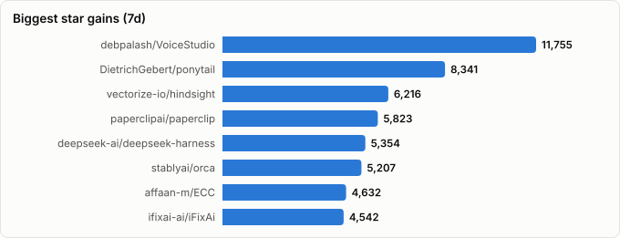

# Trending Now — What's Actually Moving in Your Stars

> Derived from **kaiser-data**'s 2,263 starred repos (snapshot `2026-09-29T15:12:50.430Z`), cross-referenced with the repo-similarity graph (2,263 nodes / 7,463 edges, 38 communities).
>
> Generated 2026-09-29 by `scripts/reports/trending_now.py` (regenerate any time — no API cost).

## Executive summary

- **This is the only report here that measures *change* rather than describing a landscape.** Every other report curates a taxonomy and renders it against the current vintage; this one diffs archived snapshots to show what actually moved.
- **Window**: `2026-09-21` → `2026-09-29` (**8 days**), covering the **2,209 repos** present in both snapshots. Long-run comparisons use `2026-06-11` → `2026-09-29` (**110 days**).
  - The immediately preceding snapshot (`2026-09-28`) is only 1 day before this one — too short to separate signal from noise — so the baseline was widened to the newest snapshot at least 7 days back.
- **1,594 repos gained stars** in the recent window, adding **159,306★** between them.
- **54 repos are new to the dataset** since the last refresh — newly starred, so they have no baseline to diff and are listed separately.
- **Measured, not estimated.** `classified.json` carries a `momentum` field, but it is a lifetime-stars/day proxy (its own source comment calls it "a serviceable proxy"). Everything below is observed snapshot-to-snapshot movement over a known number of days.

## How to read this

| Board | Question it answers | Bias to watch |
|---|---|---|
| **Fastest risers** | What gained the most stars outright? | Favours repos that are already huge — a 1% move on 100k stars beats a doubling at 500. |
| **Breakouts** | What grew fastest *relative to its size*? | Favours small repos; floored at 300★ baseline so noise doesn't win. |
| **Sustained climbers** | What has compounded over the long window? | Smooths out one-off spikes (a HN front page, a launch). |
| **New entrants** | What did you just start following? | Not growth at all — these have no baseline. |
| **Cooling off** | What is still growing, but much slower than it was? | Deceleration usually means a launch spike ending, not a project dying. |

## Fastest risers — absolute (2026-09-21 → 2026-09-29, 8d)

Raw star gain over the window. `Stars/day` normalizes for window length so this stays comparable across refreshes of different spacing.

| # | Repo | Gain | Stars/day | Stars now | Lang | Lifecycle | Activity |
|---|---|---|---|---|---|---|---|
| 1 | [browser-use/jev-ultrafast](https://github.com/browser-use/jev-ultrafast) | **+6,076** | 759.5 | 19,977 | Python | Declining | active |
| 2 | [vectorize-io/hindsight](https://github.com/vectorize-io/hindsight) | **+4,233** | 529.1 | 28,400 | Python | Hot | very active |
| 3 | [stablyai/orca](https://github.com/stablyai/orca) | **+3,659** | 457.4 | 77,810 | TypeScript | Hot | very active |
| 4 | [deepseek-ai/deepseek-harness](https://github.com/deepseek-ai/deepseek-harness) | **+3,641** | 455.1 | 235,536 | TypeScript | Hot | very active |
| 5 | [cloudflare/security-audit-skill](https://github.com/cloudflare/security-audit-skill) | **+2,885** | 360.6 | 21,428 | JavaScript | Rising | active |
| 6 | [affaan-m/ECC](https://github.com/affaan-m/ECC) | **+2,868** | 358.5 | 267,158 | JavaScript | Hot | very active |
| 7 | [rocketride-org/rocketride-server](https://github.com/rocketride-org/rocketride-server) | **+2,786** | 348.2 | 11,313 | Python | Hot | very active |
| 8 | [farion1231/cc-switch](https://github.com/farion1231/cc-switch) | **+2,755** | 344.4 | 136,676 | Rust | Hot | very active |
| 9 | [DietrichGebert/ponytail](https://github.com/DietrichGebert/ponytail) | **+2,270** | 283.8 | 145,686 | JavaScript | Hot | very active |
| 10 | [alibaba/open-code-review](https://github.com/alibaba/open-code-review) | **+2,181** | 272.6 | 41,030 | Go | Hot | very active |
| 11 | [paperclipai/paperclip](https://github.com/paperclipai/paperclip) | **+2,006** | 250.8 | 83,175 | TypeScript | Hot | very active |
| 12 | [obra/superpowers](https://github.com/obra/superpowers) | **+1,866** | 233.2 | 291,377 | Shell | Hot | very active |
| 13 | [rohitg00/ai-engineering-from-scratch](https://github.com/rohitg00/ai-engineering-from-scratch) | **+1,842** | 230.2 | 56,965 | Python | Hot | very active |
| 14 | [sindresorhus/awesome](https://github.com/sindresorhus/awesome) | **+1,766** | 220.8 | 510,178 | — | Mature | active |
| 15 | [firecrawl/firecrawl](https://github.com/firecrawl/firecrawl) | **+1,731** | 216.4 | 184,484 | TypeScript | Mature | very active |
| 16 | [debpalash/VoiceStudio](https://github.com/debpalash/VoiceStudio) | **+1,608** | 201.0 | 35,334 | Python | Hot | very active |
| 17 | [Tencent/WeKnora](https://github.com/Tencent/WeKnora) | **+1,537** | 192.1 | 29,867 | Go | Hot | very active |
| 18 | [ayghri/i-have-adhd](https://github.com/ayghri/i-have-adhd) | **+1,535** | 191.9 | 51,064 | Python | Hot | very active |
| 19 | [Human-Agent-Society/reef](https://github.com/Human-Agent-Society/reef) | **+1,299** | 162.4 | 5,141 | Python | Hot | very active |
| 20 | [diegosouzapw/OmniRoute](https://github.com/diegosouzapw/OmniRoute) | **+1,279** | 159.9 | 70,020 | TypeScript | Hot | very active |

## Breakouts — fastest relative growth (≥300★ baseline)

Percent growth over the same 8-day window. The baseline floor keeps small-number noise off the board — a repo going 8★ → 20★ is not a trend.

| # | Repo | Growth | Gain | Stars now | What it is |
|---|---|---|---|---|---|
| 1 | [mizorewww/laya-coreml](https://github.com/mizorewww/laya-coreml) | **+150%** | +867 | 1,444 | Local Laya typed decisions on Apple Core ML and Neural Engine. Validated ports, ~5 ms sh… |
| 2 | [HarnessRouter/harnessrouter](https://github.com/HarnessRouter/harnessrouter) | **+57%** | +945 | 2,600 | HarnessRouter Community Edition: the self-hosted, Apache-2.0 edition of the unified inte… |
| 3 | [browser-use/jev-ultrafast](https://github.com/browser-use/jev-ultrafast) | **+44%** | +6,076 | 19,977 | Fastest and cheapest web agent |
| 4 | [Human-Agent-Society/reef](https://github.com/Human-Agent-Society/reef) | **+34%** | +1,299 | 5,141 | Continual learning infra for self-improving agents |
| 5 | [rocketride-org/rocketride-server](https://github.com/rocketride-org/rocketride-server) | **+33%** | +2,786 | 11,313 | High-performance AI pipeline engine with a C++ core and 50+ Python-extensible nodes. Bui… |
| 6 | [vectorize-io/hindsight](https://github.com/vectorize-io/hindsight) | **+18%** | +4,233 | 28,400 | Hindsight: Agent Memory That Learns |
| 7 | [cloudflare/security-audit-skill](https://github.com/cloudflare/security-audit-skill) | **+16%** | +2,885 | 21,428 | A coding-agent skill for multi-phase security audits with independently verified, machin… |
| 8 | [google/artemis](https://github.com/google/artemis) | **+14%** | +1,213 | 9,771 | ARTEMIS turns natural-language instructions into reliable Android automation. It automat… |
| 9 | [akitaonrails/ai-memory](https://github.com/akitaonrails/ai-memory) | **+13%** | +995 | 8,372 | Solution for long term memory for agent coding CLIs and to facilitate handoff between di… |
| 10 | [strands-agents/harness-sdk](https://github.com/strands-agents/harness-sdk) | **+13%** | +985 | 8,371 | Build an agent harness and control it end-to-end. Open-source SDK for production AI agen… |
| 11 | [zzet/gortex](https://github.com/zzet/gortex) | **+12%** | +187 | 1,772 | High-performance code-intelligence engine for AI agents and IDE, supports 257 languages,… |
| 12 | [spotify/portal-ai-plugins](https://github.com/spotify/portal-ai-plugins) | **+12%** | +237 | 2,265 | — |
| 13 | [aws/context-ontology-accelerator](https://github.com/aws/context-ontology-accelerator) | **+11%** | +88 | 859 | An open-source, ontology-based semantic context accelerator that enables AI agents to ma… |
| 14 | [NVlabs/SoL-Pi](https://github.com/NVlabs/SoL-Pi) | **+11%** | +293 | 3,058 | SoL-Pi: Scaling Auto-Research Loops for Efficient Agent Harnesses |
| 15 | [serenedb/serenedb](https://github.com/serenedb/serenedb) | **+9%** | +68 | 831 | The First Real-Time Search Analytics Database |
| 16 | [jmiao24/Paper2Agent](https://github.com/jmiao24/Paper2Agent) | **+8%** | +256 | 3,470 | Paper2Agent is a multi-agent AI system that automatically transforms research papers int… |
| 17 | [magnitudedev/magnitude](https://github.com/magnitudedev/magnitude) | **+7%** | +323 | 5,054 | Open source inference engine for the hardware you already own. Profiles your machine, re… |
| 18 | [deeplethe/utopia](https://github.com/deeplethe/utopia) | **+6%** | +610 | 10,164 | World's first open-source enterprise world model. |
| 19 | [nvidia-isaac/video_to_data](https://github.com/nvidia-isaac/video_to_data) | **+6%** | +44 | 747 | Nvidia Isaac Video to Data Pipeline |
| 20 | [FareedKhan-dev/kimi-k3-in-c](https://github.com/FareedKhan-dev/kimi-k3-in-c) | **+6%** | +485 | 8,609 | A 2.78-trillion-parameter Kimi K3 running inference on a single CPU in 8.24 GB of RAM. P… |

## Sustained climbers — long run (2026-06-11 → 2026-09-29, 110d)

Averaged over the full snapshot history, so a single viral week doesn't dominate. Repos high here *and* in the recent board are compounding, not spiking.

| # | Repo | Stars/day | Total gain | Stars now | Lang | Health |
|---|---|---|---|---|---|---|
| 1 | [obra/superpowers](https://github.com/obra/superpowers) | **605.8** | +66,643 | 291,377 | Shell | 75 |
| 2 | [NousResearch/hermes-agent](https://github.com/NousResearch/hermes-agent) | **526.2** | +57,881 | 248,814 | Python | 80 |
| 3 | [affaan-m/ECC](https://github.com/affaan-m/ECC) | **488.4** | +53,724 | 267,158 | JavaScript | 79 |
| 4 | [firecrawl/firecrawl](https://github.com/firecrawl/firecrawl) | **481.4** | +52,957 | 184,484 | TypeScript | 84 |
| 5 | [earendil-works/pi](https://github.com/earendil-works/pi) | **431.6** | +47,481 | 109,259 | TypeScript | 79 |
| 6 | [msitarzewski/agency-agents](https://github.com/msitarzewski/agency-agents) | **392.0** | +43,117 | 154,570 | Shell | 58 |
| 7 | [public-apis/public-apis](https://github.com/public-apis/public-apis) | **383.3** | +42,168 | 483,029 | Python | 64 |
| 8 | [multica-ai/andrej-karpathy-skills](https://github.com/multica-ai/andrej-karpathy-skills) | **378.0** | +41,576 | 215,056 | — | 21 |
| 9 | [DeusData/codebase-memory-mcp](https://github.com/DeusData/codebase-memory-mcp) | **377.7** | +41,547 | 44,864 | C | 75 |
| 10 | [nextlevelbuilder/ui-ux-pro-max-skill](https://github.com/nextlevelbuilder/ui-ux-pro-max-skill) | **364.3** | +40,074 | 130,512 | Python | 95 |
| 11 | [harry0703/MoneyPrinterTurbo](https://github.com/harry0703/MoneyPrinterTurbo) | **359.1** | +39,500 | 125,597 | Python | 84 |
| 12 | [usestrix/strix](https://github.com/usestrix/strix) | **352.4** | +38,761 | 64,707 | Python | 80 |
| 13 | [farion1231/cc-switch](https://github.com/farion1231/cc-switch) | **347.2** | +38,197 | 136,676 | Rust | 81 |
| 14 | [anomalyco/opencode](https://github.com/anomalyco/opencode) | **334.0** | +36,740 | 209,940 | TypeScript | 83 |
| 15 | [JuliusBrussee/caveman](https://github.com/JuliusBrussee/caveman) | **329.6** | +36,255 | 107,770 | Go | 78 |
| 16 | [openai/codex](https://github.com/openai/codex) | **326.6** | +35,929 | 126,387 | Rust | 93 |
| 17 | [microsoft/markitdown](https://github.com/microsoft/markitdown) | **325.6** | +35,812 | 186,955 | Python | 92 |
| 18 | [sindresorhus/awesome](https://github.com/sindresorhus/awesome) | **320.9** | +35,297 | 510,178 | — | 52 |
| 19 | [codecrafters-io/build-your-own-x](https://github.com/codecrafters-io/build-your-own-x) | **318.2** | +35,000 | 549,429 | Markdown | 38 |
| 20 | [nexu-io/open-design](https://github.com/nexu-io/open-design) | **314.3** | +34,576 | 98,030 | TypeScript | 82 |

## Emerging themes

The boards above are computed; this section is interpretation. Each theme groups movers that are rising for the same underlying reason.

### Skills as the packaging format for agent behaviour

_The single loudest signal in this dataset. A year ago you configured an agent with a prompt; now behaviour ships as a versioned, installable *skill* bundle — and the repos distributing those bundles are growing faster than the agents that consume them. Note what this implies: the moat is moving from the model to the instruction layer._

- **[affaan-m/ECC](https://github.com/affaan-m/ECC)** · 267,158★ · +2,868★ in 8d  
  The agent harness performance optimization system. Skills, instincts, memory, security, and research-first development for Claude Code, Codex, Opencode, Cursor and beyond.
- **[DietrichGebert/ponytail](https://github.com/DietrichGebert/ponytail)** · 145,686★ · +2,270★ in 8d  
  Makes your AI agent think like the laziest senior dev in the room. The best code is the code you never wrote.
- **[obra/superpowers](https://github.com/obra/superpowers)** · 291,377★ · +1,866★ in 8d  
  An agentic skills framework & software development methodology that works.
- **[ayghri/i-have-adhd](https://github.com/ayghri/i-have-adhd)** · 51,064★ · +1,535★ in 8d  
  A skill to stop your coding agent from burying the answer. ADHD-friendly output.
- **[nextlevelbuilder/ui-ux-pro-max-skill](https://github.com/nextlevelbuilder/ui-ux-pro-max-skill)** · 130,512★ · +1,051★ in 8d  
  An AI skill that provides design intelligence for building professional UI/UX across multiple platforms.
- **[msitarzewski/agency-agents](https://github.com/msitarzewski/agency-agents)** · 154,570★ · +708★ in 8d  
  A complete AI agency at your fingertips - From frontend wizards to Reddit community ninjas, from whimsy injectors to reality checkers. Each agent is a specialized expert with personality, processes, and proven deliverables.
- **[anthropics/skills](https://github.com/anthropics/skills)** · 178,045★ · +642★ in 8d  
  Public repository for Agent Skills
- **[multica-ai/andrej-karpathy-skills](https://github.com/multica-ai/andrej-karpathy-skills)** · 215,056★ · +623★ in 8d  
  A single CLAUDE.md file to improve Claude Code behavior, derived from Andrej Karpathy's observations on LLM coding pitfalls.
- **[garrytan/gstack](https://github.com/garrytan/gstack)** · 134,161★ · +332★ in 8d  
  Use Garry Tan's exact Claude Code setup: 23 opinionated tools that serve as CEO, Designer, Eng Manager, Release Manager, Doc Engineer, and QA
- **[hesreallyhim/awesome-claude-code](https://github.com/hesreallyhim/awesome-claude-code)** · 54,587★ · +208★ in 8d  
  A hand-picked collection of the finest of resources for the most awesome of agents, Claude Code, the undisputed champion of coding companions, from the unstoppable team at Anthropic PBC. A delectable showcase of top tier skills, ambidextrous agents, scintillating status lines, top notch developer tooling, and also we have plugins
- **[shanraisshan/claude-code-best-practice](https://github.com/shanraisshan/claude-code-best-practice)** · 66,321★ · +164★ in 8d  
  from vibe coding to agentic engineering - practice makes claude perfect

### Giving agents a memory of the codebase

_Retrieval over a codebase is being replaced by *pre-indexed structure* — graphs and persistent stores an agent can consult instead of re-reading files every session. This is the same insight the graph in this repo is built on, and it is now one of the fastest-moving categories in your stars._

- **[Graphify-Labs/graphify](https://github.com/Graphify-Labs/graphify)** · 121,287★ · +1,247★ in 8d  
  Turn any codebase, with its docs, SQL schemas, configs, and PDFs, into a queryable knowledge graph. A /graphify skill for Claude Code, Cursor, Codex, and Gemini CLI: local deterministic AST parsing, every edge explained, no vector store.
- **[DeusData/codebase-memory-mcp](https://github.com/DeusData/codebase-memory-mcp)** · 44,864★ · +919★ in 8d  
  High-performance code intelligence MCP server. Indexes codebases into a persistent knowledge graph — average repo in milliseconds. 158 languages, sub-ms queries, 99% fewer tokens. Single static binary, zero dependencies.
- **[Egonex-AI/Understand-Anything](https://github.com/Egonex-AI/Understand-Anything)** · 84,129★ · +616★ in 8d  
  Graphs that teach > graphs that impress. Turn any code into an interactive knowledge graph you can explore, search, and ask questions about. Works with Claude Code, Codex, Cursor, Copilot, Gemini CLI, and more.
- **[colbymchenry/codegraph](https://github.com/colbymchenry/codegraph)** · 72,059★ · +384★ in 8d  
  Pre-indexed code knowledge graph, auto syncs on code changes, for Claude Code, Codex, Gemini, Cursor, OpenCode, AntiGravity, Kiro, CoPilot, and Hermes Agent — fewer tokens, fewer tool calls, 100% local
- **[thedotmack/claude-mem](https://github.com/thedotmack/claude-mem)** · 94,658★ · +282★ in 8d  
  Persistent Context Across Sessions for Every Agent –  Captures everything your agent does during sessions, compresses it with AI, and injects relevant context back into future sessions. Works with Claude Code, OpenClaw, Codex, Gemini, Hermes, Copilot, OpenCode + More
- **[repowise-dev/repowise](https://github.com/repowise-dev/repowise)** · 7,025★ · +266★ in 8d  
  Codebase intelligence for AI and humans: code health scores, auto-generated docs, git analytics, dead code detection, and architectural decisions via MCP.
- **[TencentCloud/TencentDB-Agent-Memory](https://github.com/TencentCloud/TencentDB-Agent-Memory)** · 27,264★ · +179★ in 8d  
  TencentDB Agent Memory is a team-level memory hub for AI Agents — turning conversations, docs, and code into four reusable memory assets (Chat Memory, Skill, LLM-Wiki, Code-Graph) that are governed, shared, and equipped across agents and frameworks.
- **[semantica-agi/semantica](https://github.com/semantica-agi/semantica)** · 13,458★ · +111★ in 8d  
  Graph-Native Infrastructure for Context and Accountable AI Systems
- **[langchain-ai/openwiki](https://github.com/langchain-ai/openwiki)** · 16,781★ · +95★ in 8d  
  OpenWiki is a CLI that writes and maintains agent documentation for your codebase.
- **[topoteretes/cognee](https://github.com/topoteretes/cognee)** · 30,973★ · +93★ in 8d  
  Cognee is the open-source AI memory platform for agents. Give your AI agents persistent long-term memory across sessions with a self-hosted knowledge graph engine.
- **[zilliztech/claude-context](https://github.com/zilliztech/claude-context)** · 12,567★ · +10★ in 8d  
  Code search MCP for Claude Code. Make entire codebase the context for any coding agent.

### Frontier models on hardware you already own

_The counter-current to everything above: instead of making API calls cheaper, remove them. Big mixture-of-experts models are being squeezed onto consumer machines, and the repos doing it are among the fastest relative movers in the dataset._

- **[JustVugg/colibri](https://github.com/JustVugg/colibri)** · 37,594★ · +907★ in 8d  
  Run frontier MoE models on hardware you already own — pure C, zero deps, experts streamed from disk. Tiny engine, immense model. 🐦
- **[ggml-org/llama.cpp](https://github.com/ggml-org/llama.cpp)** · 129,476★ · +448★ in 8d  
  LLM inference in C/C++
- **[lyogavin/airllm](https://github.com/lyogavin/airllm)** · 34,784★ · +152★ in 8d  
  AirLLM 70B inference with single 4GB GPU
- **[Mesh-LLM/mesh-llm](https://github.com/Mesh-LLM/mesh-llm)** · 3,455★ · +26★ in 8d  
  Distributed AI/LLM for the people. Share compute privately or publicly to power your agents and chat.
- **[microsoft/foundry-local](https://github.com/microsoft/foundry-local)** · 2,564★ · +9★ in 8d  
  —

### Token economics became a product category

_Context windows got bigger and people started paying for them. These repos exist purely to make agents cheaper to run — compressing tool output, trimming prompts, proxying calls. That a compression layer can add tens of thousands of stars in weeks says the cost pressure is real, not theoretical._

- **[JustVugg/colibri](https://github.com/JustVugg/colibri)** · 37,594★ · +907★ in 8d  
  Run frontier MoE models on hardware you already own — pure C, zero deps, experts streamed from disk. Tiny engine, immense model. 🐦
- **[JuliusBrussee/caveman](https://github.com/JuliusBrussee/caveman)** · 107,770★ · +691★ in 8d  
  🪨 why use many token when few token do trick. Viral skill + proxy for coding agents that cuts 65% of tokens by talking like a caveman.
- **[rtk-ai/rtk](https://github.com/rtk-ai/rtk)** · 81,687★ · +460★ in 8d  
  CLI proxy that reduces LLM token consumption by 60-90% on common dev commands. Single Rust binary, zero dependencies
- **[headroomlabs-ai/headroom](https://github.com/headroomlabs-ai/headroom)** · 73,757★ · +418★ in 8d  
  Compress tool outputs, logs, files, and RAG chunks before they reach the LLM. 20% fewer tokens for coding agents, 60-95% fewer tokens for JSON, same answers. Library, proxy, MCP server.
- **[Alishahryar1/free-claude-code](https://github.com/Alishahryar1/free-claude-code)** · 55,909★ · +343★ in 8d  
  Use Claude Code, Codex, Pi, and OpenCode (and 6 other harnesses) for free (1.3B+ free tokens) from your terminal, app, IDE, or phone, and now from the browser with native browser sessions (multi-harness + multi-model) like OpenClaw (voice supported + ToS friendly)

### The coding-agent harness field is still splitting, not consolidating

_Terminal coding agents keep multiplying rather than converging on a winner, and a second layer has appeared above them: switchers, meta-harnesses, and orchestrators whose job is to manage the agents themselves._

- **[farion1231/cc-switch](https://github.com/farion1231/cc-switch)** · 136,676★ · +2,755★ in 8d  
  A cross-platform desktop All-in-One assistant for Claude Code, Codex, OpenCode, OpenClaw, Grok Build & Hermes Agent. Only official website: ccswitch.io
- **[paperclipai/paperclip](https://github.com/paperclipai/paperclip)** · 83,175★ · +2,006★ in 8d  
  The open-source app everyone uses to manage agents at work
- **[earendil-works/pi](https://github.com/earendil-works/pi)** · 109,259★ · +1,270★ in 8d  
  AI agent toolkit: unified LLM API, agent loop, TUI, coding agent CLI
- **[NousResearch/hermes-agent](https://github.com/NousResearch/hermes-agent)** · 248,814★ · +1,187★ in 8d  
  The agent that grows with you
- **[anomalyco/opencode](https://github.com/anomalyco/opencode)** · 209,940★ · +922★ in 8d  
  The open source coding agent.
- **[openai/codex](https://github.com/openai/codex)** · 126,387★ · +724★ in 8d  
  Lightweight coding agent that runs in your terminal
- **[anthropics/claude-code](https://github.com/anthropics/claude-code)** · 148,017★ · +638★ in 8d  
  Claude Code is an agentic coding tool that lives in your terminal, understands your codebase, and helps you code faster by executing routine tasks, explaining complex code, and handling git workflows - all through natural language commands.
- **[getpaseo/paseo](https://github.com/getpaseo/paseo)** · 18,530★ · +573★ in 8d  
  Orchestrate multiple coding agents from desktop and mobile
- **[OpenHands/OpenHands](https://github.com/OpenHands/OpenHands)** · 89,130★ · +433★ in 8d  
  🙌 OpenHands: AI-Driven Development
- **[multica-ai/multica](https://github.com/multica-ai/multica)** · 51,323★ · +344★ in 8d  
  Make humans and AI agents work as one team — open-source and self-hostable.
- **[ruvnet/ruflo](https://github.com/ruvnet/ruflo)** · 73,238★ · +265★ in 8d  
  🌊 The original agent harness. Deploy intelligent multi-player swarms, coordinate autonomous workflows, and build conversational AI systems. Features adaptive memory, self-learning intelligence, federation, vector RAG integration, and native Claude Code / Codex / Hermes and many more Integrated
- **[bytedance/deer-flow](https://github.com/bytedance/deer-flow)** · 82,962★ · +168★ in 8d  
  An open-source long-horizon SuperAgent harness that researches, codes, and creates. With the help of sandboxes, memories, tools, skill, subagents and message gateway, it handles different levels of tasks that could take minutes to hours.
- **[1jehuang/jcode](https://github.com/1jehuang/jcode)** · 20,118★ · +155★ in 8d  
  The most RAM efficient harness
- **[code-yeongyu/oh-my-openagent](https://github.com/code-yeongyu/oh-my-openagent)** · 69,395★ · +149★ in 8d  
  OmO: Just type "mass ulw" keyword with your prompt. Now you are the master of graph engineering.
- **[vercel/eve](https://github.com/vercel/eve)** · 5,360★ · +70★ in 8d  
  The Open Framework for Building Agents

### Agents are leaving the terminal for specific jobs

_The generalist assistant is being joined by vertical agents pointed at one domain — pentesting, trading, tutoring, job hunting, video. These grow on usefulness to a specific audience rather than on developer-tool hype._

- **[heygen-com/hyperframes](https://github.com/heygen-com/hyperframes)** · 52,973★ · +895★ in 8d  
  Write HTML. Render video. Built for agents.
- **[usestrix/strix](https://github.com/usestrix/strix)** · 64,707★ · +764★ in 8d  
  Open-source AI penetration testing tool to find and fix your app’s vulnerabilities.
- **[TauricResearch/TradingAgents](https://github.com/TauricResearch/TradingAgents)** · 108,540★ · +656★ in 8d  
  TradingAgents: Multi-Agents LLM Financial Trading Framework
- **[browser-use/browser-use](https://github.com/browser-use/browser-use)** · 116,236★ · +548★ in 8d  
  Agents that use the browser.
- **[career-ops-hq/career-ops](https://github.com/career-ops-hq/career-ops)** · 72,679★ · +377★ in 8d  
  Open-source AI job search: scan job portals, evaluate listings into a structured A-H report with a global 1-5 score, tailor your CV, track applications — runs locally in your AI coding CLI (Claude Code, Codex, OpenCode, Antigravity…)
- **[jamiepine/voicebox](https://github.com/jamiepine/voicebox)** · 55,653★ · +320★ in 8d  
  The open-source AI voice studio. Clone, dictate, create.
- **[HKUDS/Vibe-Trading](https://github.com/HKUDS/Vibe-Trading)** · 34,012★ · +248★ in 8d  
  "Vibe-Trading: Your Personal Trading Agent"
- **[HKUDS/DeepTutor](https://github.com/HKUDS/DeepTutor)** · 40,278★ · +166★ in 8d  
  DeepTutor: Lifelong Personalized Tutoring. https://deeptutor.info/.
- **[Zackriya-Solutions/meetily](https://github.com/Zackriya-Solutions/meetily)** · 31,095★ · +103★ in 8d  
  Privacy first, AI meeting assistant with 4x faster Parakeet/Whisper live transcription, speaker diarization, and Ollama summarization built on Rust. 100% local processing. no cloud required. Meetily (Meetly Ai - https://meetily.ai) is the #1 Self-hosted, Open-source Ai meeting note taker for macOS & Windows. Understand How to write meeting minutes
- **[Canner/WrenAI](https://github.com/Canner/WrenAI)** · 17,746★ · +41★ in 8d  
  GenBI (Generative BI) for AI agents, an open-source, governed text-to-SQL through an open context layer that turns natural-language questions into trusted dashboards, charts, and SQL across 20+ data sources, such as BigQuery, Snowflake, PostgreSQL, ClickHouse, Amazon Redshift, Databricks and more.

### Design and spec as agent-readable artifacts

_If an agent writes the code, the leverage moves upstream to the spec and the design system. These repos turn intent into something an agent can consume directly._

- **[nextlevelbuilder/ui-ux-pro-max-skill](https://github.com/nextlevelbuilder/ui-ux-pro-max-skill)** · 130,512★ · +1,051★ in 8d  
  An AI skill that provides design intelligence for building professional UI/UX across multiple platforms.
- **[VoltAgent/awesome-design-md](https://github.com/VoltAgent/awesome-design-md)** · 117,818★ · +852★ in 8d  
  A collection of DESIGN.md files analysis by popular brand design systems. Drop one into your project and let coding agents generate a matching UI.
- **[github/spec-kit](https://github.com/github/spec-kit)** · 138,825★ · +686★ in 8d  
  💫 Toolkit to help you get started with Spec-Driven Development
- **[nexu-io/open-design](https://github.com/nexu-io/open-design)** · 98,030★ · +640★ in 8d  
  🎨 Best DeepSeek Harness Design Plugin. The open-source Claude Design alternative. 🖥️ Local-first desktop app. 🖼️ Your coding agent becomes the design engine: prototypes, landing pages, dashboards, slides, images & video — real files, HTML/PDF/PPTX/MP4 export. 🤖 Claude Code / Codex / Cursor / DeepSeek Harness / OpenCode & 20+ CLIs via BYOK.

## New entrants — newly starred since the last refresh

These joined the dataset during this window, so they have no baseline to diff. They are what *you* just found interesting, which is its own kind of trend signal.

| Repo | Stars | Lang | Lifecycle | What it is |
|---|---|---|---|---|
| [omacom/omarchy](https://github.com/omacom/omarchy) | 43,582 | Shell | Hot | Beautiful, Modern & Opinionated Linux |
| [lm-sys/FastChat](https://github.com/lm-sys/FastChat) | 39,551 | Python | Mature | An open platform for training, serving, and evaluating large language models. Releas… |
| [NandhaKishorM/laya](https://github.com/NandhaKishorM/laya) | 28,300 | Python | Rising | Non-autoregressive System 1 decision engine. Typed choice, score and yes/no decision… |
| [run-llama/liteparse](https://github.com/run-llama/liteparse) | 12,620 | Rust | Rising | A fast, helpful, and open-source document parser |
| [katanemo/plano](https://github.com/katanemo/plano) | 7,066 | Rust | Mature | Plano is an AI-native proxy server and data plane for agentic apps. Smart LLM routin… |
| [jaredpalmer/kev](https://github.com/jaredpalmer/kev) | 6,834 | Python | Hot | Jev-like family of decision models built on top of Qwen3.5/3.8 you can train and run… |
| [lm-sys/RouteLLM](https://github.com/lm-sys/RouteLLM) | 5,542 | Python | Abandoned | A framework for serving and evaluating LLM routers - save LLM costs without compromi… |
| [ApodexAI/FrontierAgent](https://github.com/ApodexAI/FrontierAgent) | 4,599 | Python | Hot | 🧩 FrontierAgent, our agent framework, open-sourced alongside it — native command-lin… |
| [TheoLeeCJ/SemIf-OpenJev](https://github.com/TheoLeeCJ/SemIf-OpenJev) | 4,268 | Python | Rising | Semantic ifs from open models, on a 3090 at home. Independent; not affiliated with J… |
| [EverMind-AI/Raven](https://github.com/EverMind-AI/Raven) | 4,067 | Python | Hot | The Harness of Harnesses: a trusted, persistent, self-evolving multi-agent ecosystem… |
| [aurelio-labs/semantic-router](https://github.com/aurelio-labs/semantic-router) | 3,923 | Python | Mature | Superfast AI decision making and intelligent processing of multi-modal data. |
| [huggingface/setfit](https://github.com/huggingface/setfit) | 2,823 | Jupyter Notebook | Mature | Efficient few-shot learning with Sentence Transformers |
| [microsoft/Ontology-Playground](https://github.com/microsoft/Ontology-Playground) | 2,803 | TypeScript | Hot | Free, open-source web app for learning about ontologies and Microsoft Fabric IQ. Exp… |
| [omacom/omarchy-mac](https://github.com/omacom/omarchy-mac) | 1,866 | Shell | Hot | Opinionated Arch/Hyprland Setup for Apple Silicon Macs M1/M2 |
| [GetStream/stream-chat-android](https://github.com/GetStream/stream-chat-android) | 1,665 | Kotlin | Classic | :speech_balloon: Android Chat SDK ➜ Stream Chat API. UI component libraries for chat… |
| [scikit-learn-contrib/MAPIE](https://github.com/scikit-learn-contrib/MAPIE) | 1,595 | Jupyter Notebook | Classic | A scikit-learn-compatible library for estimating prediction intervals and controllin… |
| [goodroot/hyprwhspr](https://github.com/goodroot/hyprwhspr) | 1,222 | Python | Hot | Native speech-to-text for Linux - Fast, accurate, private, and hackable system-wide … |
| [GetStream/stream-chat-flutter](https://github.com/GetStream/stream-chat-flutter) | 1,054 | Dart | Classic | Flutter Chat SDK - Build your own chat app experience using Dart, Flutter and the St… |
| [GetStream/stream-chat-swift](https://github.com/GetStream/stream-chat-swift) | 972 | Swift | Classic | 💬 iOS Chat SDK in Swift - Build your own app chat experience for iOS using the offic… |
| [ontio/ontology](https://github.com/ontio/ontology) | 905 | Go | Mature | Official Go implementation of the Ontology protocol. https://dev-docs.ont.io/#/ |
| [GetStream/stream-chat-react](https://github.com/GetStream/stream-chat-react) | 845 | TypeScript | Classic | React Chat SDK ➜ Stream Chat 💬 |
| [ozekik/awesome-ontology](https://github.com/ozekik/awesome-ontology) | 712 | — | Mature | A curated list of ontology things |
| [YennNing/Awesome-Code-as-Agent-Harness-Papers](https://github.com/YennNing/Awesome-Code-as-Agent-Harness-Papers) | 710 | — | Declining | A curated list of papers and resources based on the survey "Code as Agent Harness" |
| [Knowledgator/GLiClass](https://github.com/Knowledgator/GLiClass) | 534 | Python | Mature | Generalist and Lightweight Model for Text Classification |
| [naw103/foremerge](https://github.com/naw103/foremerge) | 506 | Rust | Rising | Catch intent conflicts before code conflicts. The open-source coordination protocol … |
| [anistark/feluda](https://github.com/anistark/feluda) | 478 | Rust | Hot | Detect license usage restrictions in your project! |
| [run-llama/llama-agents](https://github.com/run-llama/llama-agents) | 452 | Python | Hot | Llama Agents + Workflows are an event-driven, async-first, step-based way to control… |
| [docker/skills](https://github.com/docker/skills) | 425 | Python | Hot | A collection of Docker skills for AI coding agents to help them build, test, debug, … |
| [Zefan-Cai/Open-Jev](https://github.com/Zefan-Cai/Open-Jev) | 325 | Python | Hot | — |
| [ekzhang/openjev-sglang](https://github.com/ekzhang/openjev-sglang) | 323 | Python | Rising | Jev-compatible API endpoint based on open models (prefill-only) |
| [ibm-granite/granite-guardian](https://github.com/ibm-granite/granite-guardian) | 179 | Jupyter Notebook | Mature | The Granite Guardian models are designed to detect risks in prompts and responses. |
| [OpenEnergyPlatform/ontology](https://github.com/OpenEnergyPlatform/ontology) | 168 | Python | Classic | Repository for the Open Energy Ontology (OEO) |
| [daseinlabs/open-jev](https://github.com/daseinlabs/open-jev) | 111 | Python | Rising | Open Jev implementation with custom finetuning |
| [tattle-made/feluda](https://github.com/tattle-made/feluda) | 97 | Python | Mature | A configurable engine for analysing multi-lingual and multi-modal content. |
| [NVIDIA-Medtech/NV-Reason-CXR](https://github.com/NVIDIA-Medtech/NV-Reason-CXR) | 89 | Python | Declining | 🩻 NV-Reason-CXR-3B is a specialized vision-language model designed for medical reaso… |
| [apartresearch/interpretability-starter](https://github.com/apartresearch/interpretability-starter) | 82 | — | Abandoned | 🧠 Starter templates for doing interpretability research |
| [run-llama/llama-parse-py](https://github.com/run-llama/llama-parse-py) | 63 | Python | Hot | Python SDK for OCR and document parsing in the cloud with LlamaParse |
| [PsiACE/dohnuts](https://github.com/PsiACE/dohnuts) | 34 | Python | Mature | Dohnuts builds small multimodal models for direct decisions. -> System One model |
| [ontology-tools/py-horned-owl](https://github.com/ontology-tools/py-horned-owl) | 30 | Rust | Classic | A library for Web Ontology Language in Python created using a bridge from horned-owl… |
| [ankit-aglawe/tinyjev](https://github.com/ankit-aglawe/tinyjev) | 26 | Python | Rising | A tiny jev-like model that answers Choice, Score and Noul questions in one forward p… |
| _…and 14 more_ | | | | |

## Cooling off

Deceleration, not decline. These averaged ≥1★/day across the 110-day long window but are now running below 40% of that rate. Most are still gaining — just far more slowly than they were, which is usually the tail of a launch spike rather than a problem.

| Repo | Long-run ★/day | Recent ★/day | Now at | Last push | Lifecycle |
|---|---|---|---|---|---|
| [Njengah/claude-code-cheat-sheet](https://github.com/Njengah/claude-code-cheat-sheet) | 1.6 | -0.6 | **-40%** of prior pace | 4mo ago | Declining |
| [lllyasviel/FramePack](https://github.com/lllyasviel/FramePack) | 2.3 | -0.6 | **-28%** of prior pace | 11mo ago | Declining |
| [winfunc/opcode](https://github.com/winfunc/opcode) | 3.2 | -0.8 | **-23%** of prior pace | 11d ago | Declining |
| [Avaiga/taipy](https://github.com/Avaiga/taipy) | 1.8 | -0.4 | **-21%** of prior pace | 1mo ago | Mature |
| [dagger/container-use](https://github.com/dagger/container-use) | 1.9 | -0.2 | **-13%** of prior pace | 8d ago | Mature |
| [ZHZisZZ/dllm](https://github.com/ZHZisZZ/dllm) | 1.2 | -0.1 | **-11%** of prior pace | 2mo ago | Declining |
| [microsoft/magentic-ui](https://github.com/microsoft/magentic-ui) | 1.7 | -0.1 | **-7%** of prior pace | 6d ago | Mature |
| [neuphonic/neutts](https://github.com/neuphonic/neutts) | 2.7 | -0.1 | **-5%** of prior pace | 2mo ago | Rising |
| [hexo-ai/sia](https://github.com/hexo-ai/sia) | 8.5 | -0.1 | **-1%** of prior pace | 1mo ago | Rising |
| [algorithmicsuperintelligence/optillm](https://github.com/algorithmicsuperintelligence/optillm) | 1.5 | 0.0 | **0%** of prior pace | 12d ago | Mature |
| [HKUDS/FastCode](https://github.com/HKUDS/FastCode) | 1.1 | 0.0 | **0%** of prior pace | 2mo ago | Declining |
| [sipeed/picoclaw](https://github.com/sipeed/picoclaw) | 5.9 | 0.0 | **0%** of prior pace | 5d ago | Hot |
| [nullclaw/nullclaw](https://github.com/nullclaw/nullclaw) | 3.8 | 0.0 | **0%** of prior pace | 5d ago | Rising |
| [deepseek-ai/DeepSeek-OCR-2](https://github.com/deepseek-ai/DeepSeek-OCR-2) | 4.3 | 0.0 | **0%** of prior pace | 7mo ago | Declining |
| [Suvink/cut-it-out](https://github.com/Suvink/cut-it-out) | 2.3 | 0.0 | **0%** of prior pace | 9mo ago | Declining |

## Graph analysis — where the movement clusters

**Community clustering.** The top 40 risers span **15 of the graph's 38 communities** — the more concentrated they are, the more this looks like one trend rather than broad drift.

- **Community 16** (8): `affaan-m/ECC`, `DietrichGebert/ponytail`, `firecrawl/firecrawl`, `ayghri/i-have-adhd`, `Graphify-Labs/graphify`, `NousResearch/hermes-agent`, `DeusData/codebase-memory-mcp`, `davila7/claude-code-templates`
- **Community 15** (6): `browser-use/jev-ultrafast`, `rocketride-org/rocketride-server`, `obra/superpowers`, `Human-Agent-Society/reef`, `diegosouzapw/OmniRoute`, `strands-agents/harness-sdk`
- **Community 3** (5): `deepseek-ai/deepseek-harness`, `sindresorhus/awesome`, `public-apis/public-apis`, `addyosmani/agent-skills`, `codecrafters-io/build-your-own-x`
- **Community 20** (4): `farion1231/cc-switch`, `paperclipai/paperclip`, `nextlevelbuilder/ui-ux-pro-max-skill`, `HarnessRouter/harnessrouter`
- **Community 11** (3): `debpalash/VoiceStudio`, `akitaonrails/ai-memory`, `JustVugg/colibri`
- **Community 5** (2): `stablyai/orca`, `rohitg00/ai-engineering-from-scratch`
- **Community 10** (2): `alibaba/open-code-review`, `Tencent/WeKnora`
- **Community 2** (2): `earendil-works/pi`, `microsoft/markitdown`
- **Community 31** (2): `can1357/oh-my-pi`, `heygen-com/hyperframes`

**Direct links between risers** (similarity edges where both endpoints are climbing) — co-movement suggests a shared driver:

- `DietrichGebert/ponytail` ⇄ `affaan-m/ECC` (w=0.435) — topics: ai-agents, claude, claude-code, developer-tools
- `DeusData/codebase-memory-mcp` ⇄ `Graphify-Labs/graphify` (w=0.300) — topics: claude-code, code-analysis, developer-tools, knowledge-graph
- `rocketride-org/rocketride-server` ⇄ `strands-agents/harness-sdk` (w=0.282) — topics: ai, mcp, python, sdk; authors: dependabot[bot]
- `alibaba/open-code-review` ⇄ `Tencent/WeKnora` (w=0.201) — topics: agent; authors: dvd233, 58329837+Frank-zhu0404@users.noreply.github.com, po-et
- `ayghri/i-have-adhd` ⇄ `affaan-m/ECC` (w=0.167) — topics: developer-tools, productivity
- `public-apis/public-apis` ⇄ `sindresorhus/awesome` (w=0.125) — topics: resources, lists
- `akitaonrails/ai-memory` ⇄ `debpalash/VoiceStudio` (w=0.111) — authors: kevin9327
- `HarnessRouter/harnessrouter` ⇄ `akitaonrails/ai-memory` (w=0.105) — authors: hiro-nikaitou
- `JustVugg/colibri` ⇄ `debpalash/VoiceStudio` (w=0.069) — authors: kevin9327
- `akitaonrails/ai-memory` ⇄ `JustVugg/colibri` (w=0.067) — authors: kevin9327

**What the risers are written in** — language mix of the top 40 movers:

- **Python** — 17
- **TypeScript** — 9
- **JavaScript** — 4
- **Rust** — 2
- **Go** — 2
- **—** — 2
- **C** — 2
- **Shell** — 1

## Methodology & caveats

- **Source**: `data/snapshots/*.json` diffed against `data/classified.json` + `public/data/graph.json`. No external calls; fully reproducible.
- **Snapshots available**: 2026-06-11, 2026-07-13, 2026-07-19, 2026-07-20, 2026-07-27, 2026-08-07, 2026-08-11, 2026-08-28, 2026-08-29, 2026-08-31, 2026-09-06, 2026-09-07, 2026-09-12, 2026-09-14, 2026-09-21, 2026-09-25, 2026-09-28, 2026-09-29 (18 vintages). `build_index.py` archives one per refresh, keyed by the dataset's `generatedAt` date.
- **Windows are uneven.** Snapshots are taken when the data is refreshed, not on a fixed cadence — consecutive vintages here range from 1 day to several weeks apart. The recent window therefore does not always use the immediately preceding snapshot: it uses the newest one at least 7 days back, because a 1-day window amplifies noise far more than it reveals movement. Per-day normalization keeps the boards comparable across refreshes either way.
- **Star counts are a popularity signal, not a quality one.** A launch post, a conference talk, or a newsletter mention moves stars without anything changing in the code.
- **Only repos present in both snapshots are diffed.** Newly starred repos appear under *New entrants* with no growth figure; unstarred repos silently drop out.
- **The theme layer is hand-written** against the computed boards and does not refresh itself. Re-curate it when the movers change shape.
- Re-run after a fresh `classified.json` to refresh every board.

Repos tracked: 2,209 · Window: 2026-09-21 → 2026-09-29 (8d) · Snapshot: 2026-09-29T15:12:50.430Z
