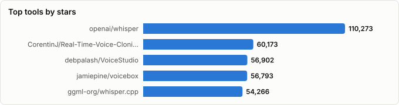
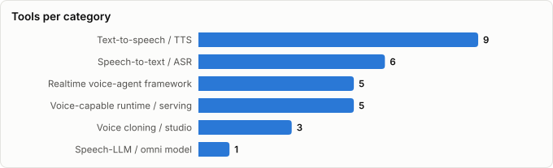

# Voice AI Agents — Landscape Report

> Derived from **kaiser-data**'s 2,346 starred repos (snapshot `2026-10-11T13:10:52.436Z`), cross-referenced with the repo-similarity graph (2,346 nodes / 7,792 edges, 46 communities).
>
> Generated 2026-10-11 by `scripts/reports/voice_agents.py` (regenerate any time — no API cost).

## Executive summary

- **30 voice-AI projects** in your stars (**689,815★** combined), organized along the voice-agent loop:
  - **Realtime voice-agent framework** (5): `pipecat`, `agents`, `ten-framework`, `fastrtc`, `qwen-audio-agent`
  - **Speech-to-text / ASR** (7): `whisper`, `whisper.cpp`, `faster-whisper`, `whisperX`, `RealtimeSTT`, `murmure`, `whisper.unity`
  - **Text-to-speech / TTS** (9): `TTS`, `bark`, `VoxCPM`, `chatterbox`, `Qwen3-TTS`, `neutts`, `RealtimeTTS`, `IMS-Toucan`, `voicebox-pytorch`
  - **Voice cloning / studio** (3): `Real-Time-Voice-Cloning`, `VoiceStudio`, `voicebox`
  - **Speech-LLM / omni model** (1): `Qwen3-Omni`
  - **Voice-capable runtime / serving** (5): `LocalAI`, `cognitive-services-speech-sdk`, `foundry-local`, `Dot`, `picollm`
- **Mental model** — a voice agent is a real-time loop: **capture → VAD/turn-taking → STT (ears) → LLM/agent (brain) → TTS (voice) → stream back**. Latency budget is the whole game: every stage must be streaming, and total round-trip should land under ~800ms to feel conversational.
- **The orchestrators are the agents.** `pipecat`, `livekit/agents`, and `ten-framework` don't transcribe or synthesize themselves — they sequence the stages, handle barge-in (user interrupting the bot), and manage the WebRTC/telephony transport.
- **Two model trends.** (1) *Cascade* stacks (STT→LLM→TTS) still dominate because each piece is swappable and best-of-breed; (2) *omni / speech-native* models like `Qwen3-Omni` collapse the stack into one model for lower latency and richer prosody.
- **Whisper is the gravitational center of the ears.** Four of your STT picks (`whisper`, `whisper.cpp`, `faster-whisper`, `whisperX`) are Whisper or derivatives.

## The voice-agent loop at a glance

| Stage | What happens | Tools in your stars |
|---|---|---|
| **Transport / capture** | Stream mic audio in & speech out (WebRTC/SIP) | `pipecat`, `livekit/agents`, `fastrtc`, `ten-framework` |
| **VAD / turn-taking** | Detect speech, endpointing, barge-in | `RealtimeSTT` (built-in VAD); handled inside the frameworks |
| **STT — ears** | Audio → text, ideally streaming + timestamps | `whisper`, `whisper.cpp`, `faster-whisper`, `whisperX`, `RealtimeSTT` |
| **LLM / agent — brain** | Decide what to say / which tool to call | your LLM + agent frameworks (see agent-orchestration report) |
| **TTS — voice** | Text → natural, low-latency speech | `coqui-TTS`, `chatterbox`, `bark`, `VoxCPM`, `Qwen3-TTS`, `supertonic`, `neutts` |
| **Voice identity** | Clone / design a specific voice | `Real-Time-Voice-Cloning`, `voicebox`, `VoiceStudio` |
| **Collapse the stack** | One speech-native model for all of it | `Qwen3-Omni` |
| **Host it** | Serve the models locally / in cloud | `LocalAI`, `Foundry-Local`, `Azure speech-sdk`, `picollm`, `Dot` |

## Master comparison

Sorted by stars. `Health`/`Lifecycle` are the dataset's computed metrics; `Activity` is derived from days-since-push + 90-day commits.

| Tool | Category | Lang | License | ★ Stars | Lifecycle | Health | Activity | Last push | Age | Contrib(90d) |
|---|---|---|---|---|---|---|---|---|---|---|
| [openai/whisper](https://github.com/openai/whisper) | Speech-to-text / ASR | Python | MIT | 110,273 | Mature | 45 | active | 1mo ago | 4.1y | 3 |
| [CorentinJ/Real-Time-Voice-Cloning](https://github.com/CorentinJ/Real-Time-Voice-Cloning) | Voice cloning / studio | Python | NOASSERTION | 60,173 | Declining | 20 | stale | 7mo ago | 7.4y | 0 |
| [debpalash/VoiceStudio](https://github.com/debpalash/VoiceStudio) | Voice cloning / studio | Python | AGPL-3.0 | 56,902 | Rising | 80 | very active | 1d ago | 6mo | 2 |
| [jamiepine/voicebox](https://github.com/jamiepine/voicebox) | Voice cloning / studio | Python | MIT | 56,793 | Hot | 74 | very active | 4d ago | 8mo | 15 |
| [ggml-org/whisper.cpp](https://github.com/ggml-org/whisper.cpp) | Speech-to-text / ASR | C++ | MIT | 54,266 | Classic | 99 | very active | 5d ago | 4.0y | 52 |
| [mudler/LocalAI](https://github.com/mudler/LocalAI) | Voice-capable runtime / serving | Go | MIT | 49,457 | Classic | 79 | very active | 1d ago | 3.6y | 12 |
| [coqui-ai/TTS](https://github.com/coqui-ai/TTS) | Text-to-speech / TTS | Python | MPL-2.0 | 46,109 | Abandoned | 10 | stale | 2.2y ago | 6.4y | 0 |
| [suno-ai/bark](https://github.com/suno-ai/bark) | Text-to-speech / TTS | Jupyter Notebook | MIT | 39,266 | Abandoned | 5 | stale | 2.1y ago | 3.5y | 0 |
| [OpenBMB/VoxCPM](https://github.com/OpenBMB/VoxCPM) | Text-to-speech / TTS | Python | Apache-2.0 | 38,503 | Mature | 62 | very active | 3d ago | 1.1y | 4 |
| [resemble-ai/chatterbox](https://github.com/resemble-ai/chatterbox) | Text-to-speech / TTS | Python | MIT | 26,829 | Declining | 31 | slowing | 2mo ago | 1.5y | 1 |
| [SYSTRAN/faster-whisper](https://github.com/SYSTRAN/faster-whisper) | Speech-to-text / ASR | Python | MIT | 25,798 | Mature | 63 | active | 1d ago | 3.7y | 6 |
| [m-bain/whisperX](https://github.com/m-bain/whisperX) | Speech-to-text / ASR | Python | BSD-2-Clause | 24,453 | Mature | 66 | active | 15d ago | 3.8y | 3 |
| [pipecat-ai/pipecat](https://github.com/pipecat-ai/pipecat) | Realtime voice-agent framework | Python | BSD-2-Clause | 16,332 | Mature | 79 | very active | 1d ago | 2.8y | 9 |
| [livekit/agents](https://github.com/livekit/agents) | Realtime voice-agent framework | Python | Apache-2.0 | 14,681 | Mature | 99 | very active | 1d ago | 3.0y | 50 |
| [QwenLM/Qwen3-TTS](https://github.com/QwenLM/Qwen3-TTS) | Text-to-speech / TTS | Python | Apache-2.0 | 13,718 | Declining | 22 | stale | 6mo ago | 8mo | 0 |
| [TEN-framework/ten-framework](https://github.com/TEN-framework/ten-framework) | Realtime voice-agent framework | Python | NOASSERTION | 11,158 | Mature | 84 | very active | 1d ago | 2.3y | 19 |
| [KoljaB/RealtimeSTT](https://github.com/KoljaB/RealtimeSTT) | Speech-to-text / ASR | Python | MIT | 10,172 | Classic | 64 | very active | 24d ago | 3.1y | 3 |
| [neuphonic/neutts](https://github.com/neuphonic/neutts) | Text-to-speech / TTS | Python | NOASSERTION | 6,306 | Mature | 45 | slowing | 2mo ago | 1.0y | 2 |
| [gradio-app/fastrtc](https://github.com/gradio-app/fastrtc) | Realtime voice-agent framework | JavaScript | MIT | 4,631 | Declining | 16 | stale | 9mo ago | 2.0y | 0 |
| [KoljaB/RealtimeTTS](https://github.com/KoljaB/RealtimeTTS) | Text-to-speech / TTS | Python | MIT | 4,043 | Classic | 70 | very active | 2d ago | 3.1y | 3 |
| [QwenLM/Qwen3-Omni](https://github.com/QwenLM/Qwen3-Omni) | Speech-LLM / omni model | Jupyter Notebook | Apache-2.0 | 4,041 | Declining | 25 | slowing | 5mo ago | 1.1y | 0 |
| [Azure-Samples/cognitive-services-speech-sdk](https://github.com/Azure-Samples/cognitive-services-speech-sdk) | Voice-capable runtime / serving | C# | MIT | 3,452 | Mature | 57 | active | 11d ago | 8.5y | 5 |
| [QwenAudio/qwen-audio-agent](https://github.com/QwenAudio/qwen-audio-agent) | Realtime voice-agent framework | JavaScript | Apache-2.0 | 2,879 | Hot | 79 | very active | 1d ago | 2mo | 10 |
| [microsoft/foundry-local](https://github.com/microsoft/foundry-local) | Voice-capable runtime / serving | C++ | NOASSERTION | 2,578 | Hot | 83 | very active | 1d ago | 1.5y | 19 |
| [DigitalPhonetics/IMS-Toucan](https://github.com/DigitalPhonetics/IMS-Toucan) | Text-to-speech / TTS | Python | Apache-2.0 | 2,209 | Declining | 18 | stale | 8mo ago | 5.2y | 0 |
| [alexpinel/Dot](https://github.com/alexpinel/Dot) | Voice-capable runtime / serving | JavaScript | GPL-3.0 | 1,915 | Abandoned | 1 | stale | 1.8y ago | 2.6y | 0 |
| [Kieirra/murmure](https://github.com/Kieirra/murmure) | Speech-to-text / ASR | TypeScript | AGPL-3.0 | 1,102 | Hot | 77 | very active | 2d ago | 12mo | 6 |
| [Macoron/whisper.unity](https://github.com/Macoron/whisper.unity) | Speech-to-text / ASR | C# | MIT | 755 | Abandoned | 5 | stale | 1.5y ago | 3.5y | 0 |
| [lucidrains/voicebox-pytorch](https://github.com/lucidrains/voicebox-pytorch) | Text-to-speech / TTS | Python | MIT | 703 | Abandoned | 6 | stale | 2.0y ago | 3.2y | 0 |
| [Picovoice/picollm](https://github.com/Picovoice/picollm) | Voice-capable runtime / serving | Python | Apache-2.0 | 318 | Mature | 58 | active | 4d ago | 2.5y | 2 |

## By category

### Realtime voice-agent framework

_The orchestrators — they own the real-time loop, turn-taking, barge-in, and transport. This is where you actually *build* a voice agent._

- **[pipecat-ai/pipecat](https://github.com/pipecat-ai/pipecat)** · 16,332★ · Python · Mature  
  Open-source framework for voice & multimodal conversational AI; wires STT→LLM→TTS with interruptions, VAD, and pluggable vendors.  
  topics: ai, real-time, voice, voice-assistant, chatbot-framework, chatbots
- **[livekit/agents](https://github.com/livekit/agents)** · 14,681★ · Python · Mature  
  Realtime voice-AI agent framework on LiveKit's WebRTC transport — turn detection, telephony (SIP), and tool calling built in.  
  topics: ai, real-time, voice, video, agents, openai
- **[TEN-framework/ten-framework](https://github.com/TEN-framework/ten-framework)** · 11,158★ · Python · Mature  
  Low-latency framework for conversational voice-AI agents; graph of multimodal extensions for real-time pipelines.  
  topics: ai, multi-modal, real-time, video, voice
- **[gradio-app/fastrtc](https://github.com/gradio-app/fastrtc)** · 4,631★ · JavaScript · Declining  
  Python real-time audio/video (WebRTC) library — the browser transport layer that turns a model into a live voice app.  
  topics: artificial-intelligence, llm, python, real-time, speech-to-text, text-to-speech, hacktoberfest, hacktoberfest2025
- **[QwenAudio/qwen-audio-agent](https://github.com/QwenAudio/qwen-audio-agent)** · 2,879★ · JavaScript · Hot  
  Qwen's realtime voice runtime — keeps an agent talking while it works, with interruption and tool calls in the loop.  
  topics: agent, agentic-ai, voice-agent, voice-ai, voice-chat, acp, ai-coding, claude-code

### Speech-to-text / ASR

_The ears. Streaming + word timestamps + diarization matter more than raw accuracy once you're in a live conversation._

- **[openai/whisper](https://github.com/openai/whisper)** · 110,273★ · Python · Mature  
  The reference open ASR model — robust multilingual transcription via large-scale weak supervision.  
  topics: —
- **[ggml-org/whisper.cpp](https://github.com/ggml-org/whisper.cpp)** · 54,266★ · C++ · Classic  
  C/C++ port of Whisper — runs on CPU/edge/mobile with no Python; the embeddable ASR workhorse.  
  topics: openai, speech-to-text, transformer, whisper, inference, speech-recognition
- **[SYSTRAN/faster-whisper](https://github.com/SYSTRAN/faster-whisper)** · 25,798★ · Python · Mature  
  CTranslate2 reimplementation of Whisper — up to 4× faster, lower memory; the production STT default.  
  topics: deep-learning, inference, quantization, speech-recognition, speech-to-text, transformer, whisper, openai
- **[m-bain/whisperX](https://github.com/m-bain/whisperX)** · 24,453★ · Python · Mature  
  Whisper + word-level timestamps + speaker diarization — adds the 'who said what, when' a transcript agent needs.  
  topics: asr, speech, speech-recognition, speech-to-text, whisper
- **[KoljaB/RealtimeSTT](https://github.com/KoljaB/RealtimeSTT)** · 10,172★ · Python · Classic  
  Low-latency streaming STT with built-in voice-activity detection and wake-word — purpose-built for live voice agents.  
  topics: python, realtime, speech-to-text
- **[Kieirra/murmure](https://github.com/Kieirra/murmure)** · 1,102★ · TypeScript · Hot  
  Fully local cross-platform dictation with LLM post-processing — private speech-to-text as a desktop app.  
  topics: privacy, speech-to-text, asr, asr-model, debian-packages, linux, macos, windows
- **[Macoron/whisper.unity](https://github.com/Macoron/whisper.unity)** · 755★ · C# · Abandoned  
  whisper.cpp bindings for Unity — on-device speech-to-text inside games/XR.  
  topics: asr, stt, speech-to-text, openai, speech-recognition, whisper, unity3d

### Text-to-speech / TTS

_The voice. The trade-off is naturalness vs. latency vs. on-device footprint; streaming (first-audio-chunk time) beats total render time for agents._

- **[coqui-ai/TTS](https://github.com/coqui-ai/TTS)** · 46,109★ · Python · Abandoned  
  Battle-tested deep-learning TTS toolkit — many models, voice cloning, 1000+ languages; the OSS TTS staple.  
  topics: python, text-to-speech, deep-learning, speech, pytorch, tts, vocoder, tacotron
- **[suno-ai/bark](https://github.com/suno-ai/bark)** · 39,266★ · Jupyter Notebook · Abandoned  
  Generative audio model — expressive, prompt-driven speech (laughs, music, SFX), not just plain narration.  
  topics: —
- **[OpenBMB/VoxCPM](https://github.com/OpenBMB/VoxCPM)** · 38,503★ · Python · Mature  
  Tokenizer-free multilingual TTS with creative voice design and strong zero-shot cloning.  
  topics: audio, deeplearning, minicpm, python, pytorch, speech, speech-synthesis, text-to-speech
- **[resemble-ai/chatterbox](https://github.com/resemble-ai/chatterbox)** · 26,829★ · Python · Declining  
  SoTA open-source TTS with emotion/exaggeration control — a credible ElevenLabs-class voice.  
  topics: —
- **[QwenLM/Qwen3-TTS](https://github.com/QwenLM/Qwen3-TTS)** · 13,718★ · Python · Declining  
  Qwen team's open TTS series — high-quality multilingual synthesis from a frontier-model lab.  
  topics: —
- **[neuphonic/neutts](https://github.com/neuphonic/neutts)** · 6,306★ · Python · Mature  
  Compact on-device TTS model focused on natural, low-footprint speech.  
  topics: —
- **[KoljaB/RealtimeTTS](https://github.com/KoljaB/RealtimeTTS)** · 4,043★ · Python · Classic  
  Streaming TTS wrapper over many engines (Coqui, Kokoro, OpenAI, Azure, …) — starts speaking from the first LLM tokens.  
  topics: python, realtime, speech-synthesis, text-to-speech
- **[DigitalPhonetics/IMS-Toucan](https://github.com/DigitalPhonetics/IMS-Toucan)** · 2,209★ · Python · Declining  
  Controllable, fast TTS covering 7000+ languages — breadth-first multilingual synthesis.  
  topics: text-to-speech, toolkit, speech-synthesis, deep-learning, speech-processing, tts, pytorch, speech
- **[lucidrains/voicebox-pytorch](https://github.com/lucidrains/voicebox-pytorch)** · 703★ · Python · Abandoned  
  Clean PyTorch implementation of Meta's Voicebox — non-autoregressive flow-matching TTS research base.  
  topics: artificial-intelligence, deep-learning, text-to-speech

### Voice cloning / studio

_Give the agent a specific identity — clone a reference voice or design a new one. Mind consent/ethics here._

- **[CorentinJ/Real-Time-Voice-Cloning](https://github.com/CorentinJ/Real-Time-Voice-Cloning)** · 60,173★ · Python · Declining  
  The classic 5-second voice-cloning demo (SV2TTS) — the repo that popularized OSS voice cloning.  
  topics: deep-learning, pytorch, tensorflow, tts, voice-cloning, python
- **[debpalash/VoiceStudio](https://github.com/debpalash/VoiceStudio)** · 56,902★ · Python · Rising  
  Local ElevenLabs alternative — voice cloning, design, and generation without the cloud.  
  topics: tts, voice-cloning, voice-generation, voice-ai, ai, cuda, mlx, huggingface
- **[jamiepine/voicebox](https://github.com/jamiepine/voicebox)** · 56,793★ · Python · Hot  
  Open-source AI voice studio — clone, dictate, and create voices through a polished app.  
  topics: ai, voice-clone, qwen3-tts, voice-ai, whisper, qwen3-tts-ui, cuda, mlx

### Speech-LLM / omni model

_The brain that natively hears and speaks — one model instead of a cascade, trading swappability for lower latency and better prosody._

- **[QwenLM/Qwen3-Omni](https://github.com/QwenLM/Qwen3-Omni)** · 4,041★ · Jupyter Notebook · Declining  
  Natively end-to-end omni-modal LLM (text/audio/vision) — collapses STT+LLM+TTS into one speech-native model.  
  topics: —

### Voice-capable runtime / serving

_Where the models actually run — local OpenAI-compatible servers or hosted SDKs that expose STT/TTS endpoints._

- **[mudler/LocalAI](https://github.com/mudler/LocalAI)** · 49,457★ · Go · Classic  
  Drop-in local AI engine exposing OpenAI-compatible TTS/STT/LLM endpoints — self-host the whole voice stack.  
  topics: llama, ai, llm, stable-diffusion, api, tts, musicgen, mamba
- **[Azure-Samples/cognitive-services-speech-sdk](https://github.com/Azure-Samples/cognitive-services-speech-sdk)** · 3,452★ · C# · Mature  
  Reference samples for Azure's hosted Speech SDK — STT/TTS/translation if you prefer a managed cloud.  
  topics: —
- **[microsoft/foundry-local](https://github.com/microsoft/foundry-local)** · 2,578★ · C++ · Hot  
  Microsoft's local model runtime bundling speech-to-text (Whisper) for offline, on-device voice.  
  topics: ai-sdk, chat-completions, foundry-local, gpu-acceleration, local-ai, microsoft, on-device-inference, onnx-runtime
- **[alexpinel/Dot](https://github.com/alexpinel/Dot)** · 1,915★ · JavaScript · Abandoned  
  Self-contained local app combining TTS, RAG, and LLMs — an all-local talking assistant.  
  topics: embeddings, llm, local, rag, standalone, standalone-app, document-chat, faiss
- **[Picovoice/picollm](https://github.com/Picovoice/picollm)** · 318★ · Python · Mature  
  On-device LLM inference from the Picovoice (Porcupine/Cheetah wake-word & STT) voice stack.  
  topics: llm, compression, efficient-inference, gemma, generative-ai, language-model, language-models, large-language-model

## Spotlight: the orchestration frameworks

These are the projects that make something a *voice agent* rather than a model. They sequence ears→brain→voice, cut latency, and — critically — handle **barge-in** so a user can interrupt the bot mid-sentence. Pick the framework first, then slot in STT/TTS.

- **[pipecat-ai/pipecat](https://github.com/pipecat-ai/pipecat)** · 16,332★ · Python — Open-source framework for voice & multimodal conversational AI; wires STT→LLM→TTS with interruptions, VAD, and pluggable vendors.
- **[livekit/agents](https://github.com/livekit/agents)** · 14,681★ · Python — Realtime voice-AI agent framework on LiveKit's WebRTC transport — turn detection, telephony (SIP), and tool calling built in.
- **[TEN-framework/ten-framework](https://github.com/TEN-framework/ten-framework)** · 11,158★ · Python — Low-latency framework for conversational voice-AI agents; graph of multimodal extensions for real-time pipelines.
- **[gradio-app/fastrtc](https://github.com/gradio-app/fastrtc)** · 4,631★ · JavaScript — Python real-time audio/video (WebRTC) library — the browser transport layer that turns a model into a live voice app.

## Graph analysis — how they relate

**Community clustering.** These 30 tools span **12 of the graph's 46 communities** — voice work is spread across the speech-model, agent-framework, and local-runtime neighborhoods rather than forming one tidy cluster.

- **Community 15** (5): `ggml-org/whisper.cpp`, `SYSTRAN/faster-whisper`, `m-bain/whisperX`, `Macoron/whisper.unity`, `alexpinel/Dot`
- **Community 18** (5): `coqui-ai/TTS`, `OpenBMB/VoxCPM`, `DigitalPhonetics/IMS-Toucan`, `lucidrains/voicebox-pytorch`, `CorentinJ/Real-Time-Voice-Cloning`
- **Community 9** (3): `pipecat-ai/pipecat`, `livekit/agents`, `TEN-framework/ten-framework`
- **Community 10** (3): `openai/whisper`, `KoljaB/RealtimeSTT`, `KoljaB/RealtimeTTS`
- **Community 19** (3): `suno-ai/bark`, `microsoft/foundry-local`, `Azure-Samples/cognitive-services-speech-sdk`
- **Community 20** (3): `QwenLM/Qwen3-TTS`, `QwenLM/Qwen3-Omni`, `mudler/LocalAI`
- **Community 2** (2): `resemble-ai/chatterbox`, `neuphonic/neutts`
- **Community 14** (2): `jamiepine/voicebox`, `debpalash/VoiceStudio`

**Centrality (PageRank in the full 2,346-repo graph)** — most 'hub-like' voice tools in your ecosystem:

- `Kieirra/murmure` — PageRank 0.0018
- `m-bain/whisperX` — PageRank 0.0012
- `QwenAudio/qwen-audio-agent` — PageRank 0.0009
- `ggml-org/whisper.cpp` — PageRank 0.0009
- `Picovoice/picollm` — PageRank 0.0008
- `CorentinJ/Real-Time-Voice-Cloning` — PageRank 0.0007
- `Macoron/whisper.unity` — PageRank 0.0007
- `microsoft/foundry-local` — PageRank 0.0007
- `DigitalPhonetics/IMS-Toucan` — PageRank 0.0006
- `mudler/LocalAI` — PageRank 0.0005

**Direct links between voice tools** (top similarity edges where both endpoints are in this report):

- `KoljaB/RealtimeTTS` ⇄ `KoljaB/RealtimeSTT` (w=1.350) — topics: python, realtime; authors: KoljaB
- `ggml-org/whisper.cpp` ⇄ `SYSTRAN/faster-whisper` (w=0.750) — topics: openai, speech-to-text, transformer, whisper
- `livekit/agents` ⇄ `TEN-framework/ten-framework` (w=0.651) — topics: ai, real-time, voice, video; authors: harshitajain165
- `m-bain/whisperX` ⇄ `Macoron/whisper.unity` (w=0.500) — topics: asr, speech-recognition, speech-to-text, whisper
- `ggml-org/whisper.cpp` ⇄ `Macoron/whisper.unity` (w=0.444) — topics: openai, speech-to-text, whisper, speech-recognition
- `TEN-framework/ten-framework` ⇄ `pipecat-ai/pipecat` (w=0.425) — topics: ai, real-time, voice
- `livekit/agents` ⇄ `pipecat-ai/pipecat` (w=0.418) — topics: ai, real-time, voice; authors: dlange-aai
- `OpenBMB/VoxCPM` ⇄ `coqui-ai/TTS` (w=0.370) — topics: python, pytorch, speech, speech-synthesis
- `SYSTRAN/faster-whisper` ⇄ `Macoron/whisper.unity` (w=0.364) — topics: speech-recognition, speech-to-text, whisper, openai
- `m-bain/whisperX` ⇄ `SYSTRAN/faster-whisper` (w=0.350) — topics: speech-recognition, speech-to-text, whisper
- `OpenBMB/VoxCPM` ⇄ `DigitalPhonetics/IMS-Toucan` (w=0.344) — topics: pytorch, speech, speech-synthesis, text-to-speech
- `coqui-ai/TTS` ⇄ `DigitalPhonetics/IMS-Toucan` (w=0.336) — topics: text-to-speech, deep-learning, speech, pytorch
- `CorentinJ/Real-Time-Voice-Cloning` ⇄ `DigitalPhonetics/IMS-Toucan` (w=0.323) — topics: deep-learning, pytorch, tts
- `OpenBMB/VoxCPM` ⇄ `CorentinJ/Real-Time-Voice-Cloning` (w=0.300) — topics: python, pytorch, tts, voice-cloning
- `CorentinJ/Real-Time-Voice-Cloning` ⇄ `coqui-ai/TTS` (w=0.300) — topics: deep-learning, pytorch, tts, voice-cloning
- …and 6 more.

## Maintenance & risk signal

Bus factor = commit concentration (1 = single-maintainer risk). Pair with lifecycle + activity before adopting — voice models in particular churn fast.

| Tool | Health | Lifecycle | Activity | Bus factor | Top-author share | Releases |
|---|---|---|---|---|---|---|
| livekit/agents | 99 | Mature | very active | 9 | 14% | 377 |
| ggml-org/whisper.cpp | 99 | Classic | very active | 10 | 11% | 45 |
| TEN-framework/ten-framework | 84 | Mature | very active | 3 | 30% | 123 |
| microsoft/foundry-local | 83 | Hot | very active | 2 | 31% | 25 |
| debpalash/VoiceStudio | 80 | Rising | very active | 1 | 89% | 42 |
| pipecat-ai/pipecat | 79 | Mature | very active | 2 | 29% | 122 |
| QwenAudio/qwen-audio-agent | 79 | Hot | very active | 1 | 61% | 29 |
| mudler/LocalAI | 79 | Classic | very active | 1 | 60% | 138 |
| Kieirra/murmure | 77 | Hot | very active | 1 | 89% | 14 |
| jamiepine/voicebox | 74 | Hot | very active | 1 | 60% | 25 |
| KoljaB/RealtimeTTS | 70 | Classic | very active | 1 | 95% | 72 |
| m-bain/whisperX | 66 | Mature | active | 2 | 33% | 44 |
| KoljaB/RealtimeSTT | 64 | Classic | very active | 1 | 93% | 47 |
| SYSTRAN/faster-whisper | 63 | Mature | active | 3 | 29% | 21 |
| OpenBMB/VoxCPM | 62 | Mature | very active | 1 | 71% | 14 |
| Picovoice/picollm | 58 | Mature | active | 1 | 87% | 6 |
| Azure-Samples/cognitive-services-speech-sdk | 57 | Mature | active | 2 | 43% | 107 |
| openai/whisper | 45 | Mature | active | 2 | 33% | 13 |
| neuphonic/neutts | 45 | Mature | slowing | 1 | 94% | 0 |
| resemble-ai/chatterbox | 31 | Declining | slowing | 1 | 100% | 1 |
| QwenLM/Qwen3-Omni | 25 | Declining | slowing | 0 | 0% | 0 |
| QwenLM/Qwen3-TTS | 22 | Declining | stale | 0 | 0% | 0 |
| CorentinJ/Real-Time-Voice-Cloning | 20 | Declining | stale | 0 | 0% | 0 |
| DigitalPhonetics/IMS-Toucan | 18 | Declining | stale | 0 | 0% | 14 |
| gradio-app/fastrtc | 16 | Declining | stale | 0 | 0% | 22 |
| coqui-ai/TTS | 10 | Abandoned | stale | 0 | 0% | 98 |
| lucidrains/voicebox-pytorch | 6 | Abandoned | stale | 0 | 0% | 65 |
| Macoron/whisper.unity | 5 | Abandoned | stale | 0 | 0% | 12 |
| suno-ai/bark | 5 | Abandoned | stale | 0 | 0% | 0 |
| alexpinel/Dot | 1 | Abandoned | stale | 0 | 0% | 4 |

## Which one should you use?

| If you want… | Start with | Why |
|---|---|---|
| To build a phone/web voice agent fast | `pipecat-ai/pipecat` or `livekit/agents` | Purpose-built orchestrators with STT/LLM/TTS plugins, barge-in, and SIP/WebRTC transport. |
| Production STT at low cost/latency | `SYSTRAN/faster-whisper` | 4× faster Whisper via CTranslate2; the default server-side ASR. |
| On-device / embedded STT | `ggml-org/whisper.cpp` | No Python, runs on CPU/edge/mobile; pairs with `RealtimeSTT` for streaming + VAD. |
| Transcripts with speakers & timestamps | `m-bain/whisperX` | Word-level alignment + diarization — 'who said what, when'. |
| Best-quality open TTS voice | `resemble-ai/chatterbox` or `coqui-ai/TTS` | SoTA naturalness with emotion control (chatterbox); broad model zoo + cloning (coqui). |
| Fast on-device TTS | `neuphonic/neutts` | Compact, low-footprint synthesis for low-latency offline voice. (`supertonic` held this slot until it was archived upstream — see *Retired from the scored set*.) |
| To clone a specific voice | `VoiceStudio` or `coqui-ai/TTS` | Local ElevenLabs-style cloning — mind consent/ethics. |
| Lowest latency / richest prosody | `QwenLM/Qwen3-Omni` | Speech-native omni model collapses STT+LLM+TTS into one — fewer hops. |
| Self-host the whole stack with one API | `mudler/LocalAI` | OpenAI-compatible TTS/STT/LLM endpoints; swap it under any framework above. |

## Adjacent (deliberately not listed as voice-AI tools)

- **Chainlit/chainlit** (12,508★) — conversational-AI *chat UI* (audio is secondary) — not a voice-pipeline framework
- **mastra-ai/mastra** (28,685★) — general TS agent framework with a TTS module — covered by the agent-orchestration report
- **VoltAgent/voltagent** (10,764★) — general TS agent platform that *can* do TTS — not voice-specific
- **Fosowl/agenticSeek** (27,464★) — autonomous local agent with an optional voice front-end — general agent, not a voice stack
- **mozilla-ai/llamafile** (26,216★) — single-file LLM runner that bundles whisper.cpp — general runtime, see inference reports
- **huggingface/transformers** (167,058★) — hosts most of these speech models, but far too broad to list as a 'voice' tool
- **unslothai/unsloth** (77,697★) — fine-tunes TTS/audio models among many others — a training tool, not a voice agent

## Methodology & caveats

- **Source**: `data/classified.json` + `public/data/graph.json`. No external calls; fully reproducible.
- **Selection**: keyword scan (voice / speech / tts / stt / asr / whisper / transcribe / diarization / vad / wake-word / realtime-voice / conversational) + manual curation into the voice-agent loop. General agent frameworks, chat UIs, and broad training/runtime tools were routed to adjacent reports or excluded (see above).
- **Metrics** (health, lifecycle, bus_factor) are precomputed at snapshot time and may lag GitHub's current state.
- Re-run after a fresh `classified.json` to refresh stars/activity.

### Retired from the scored set

Archived upstream, so they no longer appear in this report's tables — `sample.mjs` excludes archived repos. Metrics are frozen at the date shown and are not refreshed.

| Project | Category | Why it left | Metrics as of |
|---|---|---|---|
| [`supertone-inc/supertonic`](https://github.com/supertone-inc/supertonic) | Text-to-speech / TTS | Archived upstream 2026-09 and renamed to `supertone-oss-archive/supertonic`; last in the dataset 2026-09-06. Lightning-fast on-device multilingual TTS via ONNX — still usable, no longer developed. | 2026-09-06 |

Tools covered: 30 · Snapshot: 2026-10-11T13:10:52.436Z
