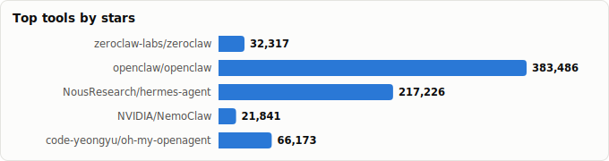
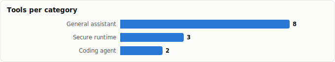

# Which Claw Should I Use? — A Decision Report

> Derived from **kaiser-data**'s 1,341 starred repos (snapshot `2026-07-19T22:39:07.967Z`), cross-referenced with the repo-similarity graph.
>
> Generated 2026-07-19 by `scripts/reports/which_claw.py` (regenerate any time — no API cost).

> **Scope.** This ranks the standalone **claws** — agents/runtimes you'd run *as* your assistant. "Claw" here is a **role, not a name**: functional claws that aren't literally branded *claw* (Hermes, nanobot, eliza, oh-my-openagent) are ranked alongside the named ones and tagged **†**. The accessory ecosystem (skills, routers, memory, observability, dashboards) is covered separately in the **OpenClaw Ecosystem** report; those *complement* a claw rather than replace it.

## TL;DR — two honest answers

**On raw metrics, [`zeroclaw-labs/zeroclaw`](https://github.com/zeroclaw-labs/zeroclaw) wins** (composite 0.817): health 94, bus factor 4, very active. And it's **robust** — it stays #1 under 4 of 6 weighting profiles (see the sensitivity analysis), so that's not an artifact of how I weighted the score. If you want the cleanest, most resilient standalone claw and don't care about the surrounding tooling, take it.

**As a pragmatic default, [`openclaw/openclaw`](https://github.com/openclaw/openclaw) (composite 0.747, #2).** The score above *deliberately excludes the ecosystem network effect* — and that's OpenClaw's real edge: every accessory you've already starred (`clawhub`, `ClawRouter`, `clawmetry`, `opik-openclaw`, `openclaw-supermemory`, `NemoClaw`, `moltworker`) targets OpenClaw, not zeroclaw. That's a genuine switching cost in its favour.

- **TypeScript + crypto fit → OpenClaw.** It's TS (so is most of its accessory line), and the ecosystem leans on-chain — e.g. `ClawRouter` does on-chain payments / agent-native settlement. If you live in the TS and crypto world, that's another argument for the hub.
- **Maximum stability/quality →** [`zeroclaw-labs/zeroclaw`](https://github.com/zeroclaw-labs/zeroclaw) (health 94).
- **Running untrusted tools / need isolation →** [`NVIDIA/NemoClaw`](https://github.com/NVIDIA/NemoClaw) — security-hardened runtime.
- **Mostly coding →** [`code-yeongyu/oh-my-openagent`](https://github.com/code-yeongyu/oh-my-openagent) is the coding-focused claw.
- **Tiny/edge footprint →** `sipeed/picoclaw` and `nullclaw/nullclaw` (minimal builds).

## The ranking

Composite = 25% health + 25% adoption + 20% resilience + 15% maturity + 15% momentum. Adoption & momentum are **log-scaled** (so a 10× star lead or a viral spike becomes a *tier*, not a landslide); maturity blends release cadence + age; a **staleness gate** discounts anything >60 days since last push. Freshness is *not* a weighted term — almost every claw was pushed today, so it doesn't discriminate, and health already encodes recency.

`†` = functional claw (same role, not literally named *claw*).

| # | Claw | Type | Score | ★ Stars | Health | Momentum (★/30d) | Last push | Bus factor | Lang |
|---|---|---|---|---|---|---|---|---|---|
| 🥇 | [zeroclaw-labs/zeroclaw](https://github.com/zeroclaw-labs/zeroclaw) | General assistant | **0.817** | 32,317 (▲76) | 94 | 15,480 | 0d ago | 4 | Rust |
| 🥈 | [openclaw/openclaw](https://github.com/openclaw/openclaw) | General assistant | **0.747** | 383,486 (▲735) | 79 | 121,093 | 0d ago | 1 | TypeScript |
| 🥉 | [NousResearch/hermes-agent](https://github.com/NousResearch/hermes-agent) † | General assistant | **0.737** | 217,226 (▲3,274) | 80 | 45,004 | 0d ago | 2 | Python |
| 4 | [NVIDIA/NemoClaw](https://github.com/NVIDIA/NemoClaw) | Secure runtime | **0.736** | 21,841 (▲82) | 84 | 12,977 | 0d ago | 5 | TypeScript |
| 5 | [code-yeongyu/oh-my-openagent](https://github.com/code-yeongyu/oh-my-openagent) † | Coding agent | **0.687** | 66,173 (▲518) | 78 | 21,684 | 0d ago | 1 | TypeScript |
| 6 | [sipeed/picoclaw](https://github.com/sipeed/picoclaw) | General assistant | **0.675** | 29,689 (▼41) | 85 | 13,461 | 1d ago | 2 | Go |
| 7 | [HKUDS/nanobot](https://github.com/HKUDS/nanobot) † | General assistant | **0.634** | 45,893 (▲566) | 78 | 20,410 | 0d ago | 1 | Python |
| 8 | [RightNow-AI/openfang](https://github.com/RightNow-AI/openfang) | General assistant | **0.623** | 18,033 (▲32) | 77 | 5,971 | 18d ago | 1 | Rust |
| 9 | [elizaOS/eliza](https://github.com/elizaOS/eliza) † | General assistant | **0.598** | 18,768 (▲32) | 74 | 1,330 | 0d ago | 1 | TypeScript |
| 10 | [nearai/ironclaw](https://github.com/nearai/ironclaw) | Secure runtime | **0.595** | 12,528 (▲9) | 75 | 5,638 | 0d ago | 1 | Rust |
| 11 | [ultraworkers/claw-code](https://github.com/ultraworkers/claw-code) | Coding agent | **0.589** | 194,826 (▲78) | 63 | 84,577 | 23d ago | 1 | Rust |
| 12 | [nullclaw/nullclaw](https://github.com/nullclaw/nullclaw) | General assistant | **0.584** | 7,790 (▲42) | 78 | 3,817 | 1d ago | 1 | Zig |
| 13 | [nanocoai/nanoclaw](https://github.com/nanocoai/nanoclaw) | Secure runtime | **0.576** | 30,290 (▲75) | 69 | 13,420 | 0d ago | 1 | TypeScript |

**Where's Hermes?** [`NousResearch/hermes-agent`](https://github.com/NousResearch/hermes-agent) lands **#3** (composite 0.737) — the **strongest functional claw** and it trails OpenClaw (#2). Health 80, bus factor 2 (vs OpenClaw's 1 — more resilient), 217,226★, very active.
It sits just behind [`openclaw/openclaw`](https://github.com/openclaw/openclaw), which edges it on health (79 vs 80) and resilience (bus 1 vs 2). 
The catch: Hermes carries **none** of the OpenClaw accessory ecosystem and is **Python-first** — so it's the natural pick if you'd rather extend in Python than TypeScript, or value NousResearch's lineage over ecosystem lock-in. See the dedicated **Hermes vs OpenClaw** report for the full head-to-head.

Other functional claws (†): `oh-my-openagent` #5, `nanobot` #7, `eliza` #9.

### How the top picks score (component view)

Each column is 0–1 (higher = better); the bar shows the weighted composite.

| Claw | Health | Adoption | Resilience | Maturity | Momentum | Composite |
|---|---|---|---|---|---|---|
| zeroclaw-labs/zeroclaw | 0.94 | 0.81 | 0.80 | 0.64 | 0.82 | **0.817** |
| openclaw/openclaw | 0.79 | 1.00 | 0.20 | 0.73 | 1.00 | **0.747** |
| NousResearch/hermes-agent | 0.80 | 0.96 | 0.40 | 0.54 | 0.92 | **0.737** |
| NVIDIA/NemoClaw | 0.84 | 0.78 | 1.00 | 0.07 | 0.81 | **0.736** |
| code-yeongyu/oh-my-openagent | 0.78 | 0.86 | 0.20 | 0.72 | 0.85 | **0.687** |

## Deeper analysis

### Is this verdict robust, or did the weights decide it?

A single weight vector is easy to rig. So here's the ranking re-run under **six different priority profiles** — from quality-obsessed to pure-hype. If a claw only wins under one contrived weighting, that's a red flag; if it wins across most, the verdict is real.

| Claw | Balanced (this report) | Equal | Quality-first | Adoption-first | Resilience-first | Hype / trajectory | Mean | Spread |
|---|---|---|---|---|---|---|---|---|
| zeroclaw | **1** | **1** | **1** | 3 | **1** | 4 | 1.8 | #1–#4 |
| openclaw | 2 | 2 | 4 | **1** | 5 | **1** | 2.5 | #1–#5 |
| hermes-agent † | 3 | 3 | 3 | 2 | 3 | 2 | 2.7 | #2–#3 |
| NemoClaw | 4 | 4 | 2 | 8 | 2 | 8 | 4.7 | #2–#8 |
| oh-my-openagent † | 5 | 5 | 6 | 4 | 6 | 5 | 5.2 | #4–#6 |
| picoclaw | 6 | 6 | 5 | 6 | 4 | 7 | 5.7 | #4–#7 |
| nanobot † | 7 | 7 | 9 | 7 | 9 | 6 | 7.5 | #6–#9 |
| openfang | 8 | 8 | 7 | 9 | 7 | 10 | 8.2 | #7–#10 |
| claw-code | 11 | 12 | 13 | 5 | 13 | 3 | 9.5 | #3–#13 |
| eliza † | 9 | 9 | 8 | 12 | 8 | 13 | 9.8 | #8–#13 |
| ironclaw | 10 | 10 | 11 | 11 | 10 | 11 | 10.5 | #10–#11 |
| nanoclaw | 13 | 13 | 12 | 10 | 12 | 9 | 11.5 | #9–#13 |
| nullclaw | 12 | 11 | 10 | 13 | 11 | 12 | 11.5 | #10–#13 |

**Read-out.**
- **`zeroclaw` is the robust #1** — first under 4 of 6 profiles, mean rank 1.8, never below #4. The top spot is *not* an artifact of the chosen weights.
- **Hermes is the stability champion of the top tier** — mean 2.7, range #2–#3; it never leaves the podium under any weighting. The most *weighting-proof* pick.
- **OpenClaw is polarising** — #1 under adoption/hype profiles but #5 under quality-first. It's a **scale play** (raw stars + momentum), not a **quality play** (its bus-factor-1 sinks it whenever resilience is weighted).
- **`claw-code` is the most volatile** — #3 under one profile, #13 under others. A weighting-dependent gamble, not a safe default.

### Pareto check: which claws are never the metric-optimal pick?

Ignoring fit and weights entirely: a claw is **dominated** if another claw matches or beats it on *every* generic axis (health, stars, bus factor, releases, momentum, freshness) and beats it on at least one. Dominated claws are never the answer **if you only care about generic quality/scale** — but several survive purely on a niche the axes can't see.

**Pareto-optimal (8):** `zeroclaw`, `openclaw`, `hermes-agent`, `NemoClaw`, `picoclaw`, `openfang`, `claw-code`, `nullclaw`.

**Dominated — only justified by fit, not metrics:**

| Claw | Dominated by | Survives only if you need… |
|---|---|---|
| `oh-my-openagent` | `openclaw` | a TS coding harness for big codebases |
| `nanobot` | `openclaw`, `hermes-agent`, `oh-my-openagent` | a minimal embeddable Python agent |
| `eliza` | `openclaw`, `zeroclaw`, `picoclaw`, `hermes-agent`, `nanobot`, `oh-my-openagent` | autonomous social/web3 swarm bots |
| `ironclaw` | `openclaw`, `zeroclaw`, `openfang`, `oh-my-openagent` | WASM-sandboxed execution of untrusted code |
| `nanoclaw` | `openclaw`, `zeroclaw`, `hermes-agent`, `nanobot`, `oh-my-openagent` | containerised chat-app connectors |

> This is the **same lesson as the use-case table, proven from the other direction**: raw metrics would tell you to ignore these — but each holds a job the metrics don't measure. Dominance ≠ uselessness when the dimensions are generic.

### Graph signal: centrality, clustering & the *real* network effect

In the repo-similarity graph (1,138 nodes / 4,341 edges), the claws **don't form one cluster** — they scatter across **10 of 25 communities**. There is no single 'claw' neighbourhood; these are genuinely different projects that happen to share a role.

- **Centrality (PageRank).** Most hub-like claws: `nanobot` (0.0015), `openfang` (0.0014), `NemoClaw` (0.0013). Note PageRank tracks *similarity* connectivity, not quality — a claw is central when many neighbours resemble it.
- **Closest claw pair:** `nanobot` ⇄ `hermes-agent` (w=0.66) — near-substitutes. The `zeroclaw` ⇄ `openclaw` edge confirms they compete for the same slot.
- **The honest network-effect caveat.** The similarity graph measures shared topics/authors, **not** 'plugs-into' dependency — so it does *not* by itself prove OpenClaw lock-in. The one direct graph signal that does is **`openclaw` ⇄ `clawhub` (its official skill directory) at w=0.70** — the strongest accessory tie of any claw. The broader lock-in argument below rests on real-world integration, which the graph under-counts, not over-counts.

## Where each claw shines

These claws are **not interchangeable** — they target different jobs. Use this to match a claw to *your* scenario; the score above only ranks general fitness.

| Claw | Type | Lang | Shines at | Skip if… |
|---|---|---|---|---|
| [zeroclaw](https://github.com/zeroclaw-labs/zeroclaw) | General assistant | Rust | **Production self-host where quality matters** — 'deploy anywhere, swap anything' infra, fully autonomous, top health & resilience. The connoisseur's pick. | you depend on OpenClaw's accessory ecosystem or want a TS codebase. |
| [openclaw](https://github.com/openclaw/openclaw) | General assistant | TypeScript | Your **default daily driver** — own-your-data personal assistant on any OS, with the deepest plugin/skill/router/memory ecosystem to extend in TypeScript. | you're wary of a single-maintainer core (bus 1), or you prefer Python/Rust. |
| [hermes-agent](https://github.com/NousResearch/hermes-agent) † | General assistant | Python | **Python-first builders** who want an agent that *learns/grows over time*, broad model interop, and NousResearch's research lineage. | you want TS or the OpenClaw plug-in ecosystem (it has neither). |
| [NemoClaw](https://github.com/NVIDIA/NemoClaw) | Secure runtime | TypeScript | **Enterprise GPU / managed inference** — run OpenClaw *or* Hermes more securely inside NVIDIA OpenShell. | you're not on NVIDIA infra or want a simple self-host. |
| [oh-my-openagent](https://github.com/code-yeongyu/oh-my-openagent) † | Coding agent | TypeScript | **Serious software engineering on big codebases** — a TUI/IDE 'pickaxe' agent harness for complex SWE and multi-tool orchestration. | you want a general life/personal assistant rather than a coding harness. |
| [picoclaw](https://github.com/sipeed/picoclaw) | General assistant | Go | **Edge / embedded / SBC** deployments — a tiny, fast, single Go binary to automate mundane tasks cheaply, anywhere. | you need a rich plugin ecosystem or heavy multi-agent orchestration. |
| [nanobot](https://github.com/HKUDS/nanobot) † | General assistant | Python | **Embedding a lightweight agent into your own tools/chats/workflows** — small Python surface, quick to wire in. | you want a full assistant *platform* or strong maintainer resilience (bus 2). |
| [openfang](https://github.com/RightNow-AI/openfang) | General assistant | Rust | **MCP-native Agent-OS** — pick it if Model Context Protocol tooling is your backbone (Rust). | bus factor 1 + ~20d-stale pushes concern you, or you want TS. |
| [eliza](https://github.com/elizaOS/eliza) † | General assistant | TypeScript | **Always-on autonomous social agents** — Discord/Telegram/Slack bots, crypto/web3 agents, swarms, on a mature plugin framework. | you want a personal CLI/desktop assistant, not deployed autonomous bots. |
| [ironclaw](https://github.com/nearai/ironclaw) | Secure runtime | Rust | **Privacy/security-first** agent-OS — sandboxed CodeAct via WASM; good when the agent runs untrusted code and isolation matters. | you want plug-and-play or the largest community/ecosystem. |
| [claw-code](https://github.com/ultraworkers/claw-code) | Coding agent | Rust | **Bleeding-edge fast coding agent** (Rust, built on oh-my-codex) — if you chase the newest and tolerate churn. | you need stability — health 58, **0 releases**, very young. Treat as experimental. |
| [nullclaw](https://github.com/nullclaw/nullclaw) | General assistant | Zig | **Absolute minimal footprint** — the fastest/smallest autonomous infra, written in Zig, for the performance-obsessed self-hoster. | you want ecosystem, plugins, or a larger community (7.6k★, bus 1). |
| [nanoclaw](https://github.com/nanocoai/nanoclaw) | Secure runtime | TypeScript | **Containerized assistant with chat connectors** — WhatsApp/Telegram/Slack/Discord/Gmail, memory + scheduled jobs, on Anthropic's Agents SDK, sandboxed for safety. | you want top health or the full OpenClaw ecosystem. |

## The one thing the score can't measure: network effect

`zeroclaw-labs/zeroclaw` edges out `openclaw/openclaw` on the composite mostly on **health (94 vs 79)** and **bus factor (4 vs 1)** — both real, both in zeroclaw's favour. But the composite scores each claw *in isolation*. It can't see that:

- Your starred ecosystem is built **around OpenClaw** — `clawhub` (skills, the strongest single graph edge at w=0.70), `ClawRouter` (routing, on-chain payments), `clawmetry` / `opik-openclaw` (observability), `openclaw-supermemory` (memory), `NemoClaw` / `moltworker` (hosting). None of that plugs into zeroclaw out of the box. (The graph under-counts this — it sees topic/author similarity, not 'plugs-into' integration — so treat the real lock-in as *stronger* than the edges suggest.)
- OpenClaw is **TypeScript** end-to-end, which matches the rest of that tooling — and the crypto/on-chain bent of the ecosystem (agent-native settlement) is a plus if that's your world.
- zeroclaw is **Rust**: leaner and (per the metrics) cleaner, but you'd be re-building or forgoing the accessory layer.

**Net:** pick `zeroclaw-labs/zeroclaw` if you want a single, self-contained, high-quality claw. Pick `openclaw/openclaw` if you want a *platform* — the ecosystem lock-in is the feature, not the bug.

## Pick by what you care about

| If your priority is… | Use | Why |
|---|---|---|
| **Best on raw metrics** | [`zeroclaw-labs/zeroclaw`](https://github.com/zeroclaw-labs/zeroclaw) | tops the composite (health/resilience/freshness) |
| **Largest ecosystem & accessory support** | [`openclaw/openclaw`](https://github.com/openclaw/openclaw) | the hub every skill/router/memory tool you've starred targets; TS + crypto-friendly |
| **Code quality / least bus-factor risk** | [`NVIDIA/NemoClaw`](https://github.com/NVIDIA/NemoClaw) | highest bus factor (5) — most resilient to a maintainer leaving |
| **Best health score** | [`zeroclaw-labs/zeroclaw`](https://github.com/zeroclaw-labs/zeroclaw) | health 94 — cleanest maintenance signals |
| **Fastest-growing right now** | [`openclaw/openclaw`](https://github.com/openclaw/openclaw) | ~121,093 est. stars/30d |
| **Security / sandboxed execution** | [`NVIDIA/NemoClaw`](https://github.com/NVIDIA/NemoClaw) | hardened/containerized runtime |
| **Coding agent** | [`code-yeongyu/oh-my-openagent`](https://github.com/code-yeongyu/oh-my-openagent) | purpose-built for code |
| **Tiny / edge / self-host cheap** | `sipeed/picoclaw` · `nullclaw/nullclaw` | minimal footprints (Go / Zig) |
| **Most-adopted / most battle-tested** | [`openclaw/openclaw`](https://github.com/openclaw/openclaw) | 383,486★ |

## Watch-outs

- **openclaw/openclaw** — bus factor 1 (single-maintainer risk).
- **code-yeongyu/oh-my-openagent** — bus factor 1 (single-maintainer risk).
- **HKUDS/nanobot** — bus factor 1 (single-maintainer risk).
- **RightNow-AI/openfang** — bus factor 1 (single-maintainer risk).
- **elizaOS/eliza** — bus factor 1 (single-maintainer risk).
- **nearai/ironclaw** — bus factor 1 (single-maintainer risk).
- **ultraworkers/claw-code** — bus factor 1 (single-maintainer risk).
- **nullclaw/nullclaw** — bus factor 1 (single-maintainer risk).
- **nanocoai/nanoclaw** — bus factor 1 (single-maintainer risk).

> Heads-up: `openagen/zeroclaw` (1.9k★, ~79d stale) is an **older, different** project from the healthy **`zeroclaw-labs/zeroclaw`** ranked above — don't confuse them.

## Methodology & caveats

- **Source:** `data/classified.json` + `public/data/graph.json`. No external calls; fully reproducible.
- **Candidate set:** standalone claw agents/runtimes/agent-OSes only. Accessories (skills, routers, memory, observability, dashboards, specialized one-task agents) are excluded by design — see the OpenClaw Ecosystem report for those.
- **Composite weights:** health 25%, adoption 25%, resilience 20%, maturity 15%, momentum 15%. Adoption & momentum are log-scaled; maturity = 60% release-cadence + 40% age (age capped at 730d). A staleness gate multiplies the score down (floor 0.6) beyond 60 days since last push. Freshness is deliberately *not* a weighted term (saturated; redundant with health).
- **Why these weights:** this is an *adoption* decision, so battle-testing (adoption) and survivability (resilience, maturity) are weighted as heavily as raw health, and hype (momentum) is capped at 15% and log-scaled — a 2-month-old repo riding a star spike shouldn't outrank a seasoned, multi-maintainer project.
- **Snapshot-bound.** Claws move weekly; momentum especially can flip fast. Re-run after a fresh `npm run refresh`.

Claws ranked: 13 · Snapshot: 2026-07-19T22:39:07.967Z · regenerate via scripts/reports/which_claw.py
