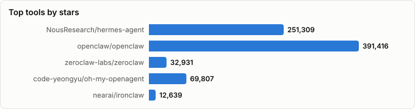
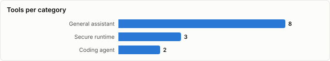

# Which Claw Should I Use? — A Decision Report

> Derived from **kaiser-data**'s 2,304 starred repos (snapshot `2026-10-05T13:01:39.533Z`), cross-referenced with the repo-similarity graph.
>
> Generated 2026-10-05 by `scripts/reports/which_claw.py` (regenerate any time — no API cost).

> **Scope.** This ranks the standalone **claws** — agents/runtimes you'd run *as* your assistant. "Claw" here is a **role, not a name**: functional claws that aren't literally branded *claw* (Hermes, nanobot, eliza, oh-my-openagent) are ranked alongside the named ones and tagged **†**. The accessory ecosystem (skills, routers, memory, observability, dashboards) is covered separately in the **OpenClaw Ecosystem** report; those *complement* a claw rather than replace it.

## TL;DR — two honest answers

**On raw metrics, [`NousResearch/hermes-agent`](https://github.com/NousResearch/hermes-agent) wins** (composite 0.886): health 86, bus factor 3, very active. And it's **robust** — it stays #1 under 4 of 6 weighting profiles (see the sensitivity analysis), so that's not an artifact of how I weighted the score. If you want the cleanest, most resilient standalone claw and don't care about the surrounding tooling, take it.

**As a pragmatic default, [`openclaw/openclaw`](https://github.com/openclaw/openclaw) (composite 0.776, #2).** The score above *deliberately excludes the ecosystem network effect* — and that's OpenClaw's real edge: every accessory you've already starred (`clawhub`, `ClawRouter`, `clawmetry`, `opik-openclaw`, `openclaw-supermemory`, `NemoClaw`, `moltworker`) targets OpenClaw, not zeroclaw. That's a genuine switching cost in its favour.

- **TypeScript + crypto fit → OpenClaw.** It's TS (so is most of its accessory line), and the ecosystem leans on-chain — e.g. `ClawRouter` does on-chain payments / agent-native settlement. If you live in the TS and crypto world, that's another argument for the hub.
- **Maximum stability/quality →** [`NousResearch/hermes-agent`](https://github.com/NousResearch/hermes-agent) (health 86).
- **Running untrusted tools / need isolation →** [`nearai/ironclaw`](https://github.com/nearai/ironclaw) — security-hardened runtime.
- **Mostly coding →** [`code-yeongyu/oh-my-openagent`](https://github.com/code-yeongyu/oh-my-openagent) is the coding-focused claw.
- **Tiny/edge footprint →** `sipeed/picoclaw` and `nullclaw/nullclaw` (minimal builds).

## The ranking

Composite = 25% health + 25% adoption + 20% resilience + 15% maturity + 15% momentum. Adoption & momentum are **log-scaled** (so a 10× star lead or a viral spike becomes a *tier*, not a landslide); maturity blends release cadence + age; a **staleness gate** discounts anything >60 days since last push. Freshness is *not* a weighted term — almost every claw was pushed today, so it doesn't discriminate, and health already encodes recency.

`†` = functional claw (same role, not literally named *claw*).

| # | Claw | Type | Score | ★ Stars | Health | Momentum (★/30d) | Last push | Bus factor | Lang |
|---|---|---|---|---|---|---|---|---|---|
| 🥇 | [NousResearch/hermes-agent](https://github.com/NousResearch/hermes-agent) † | General assistant | **0.886** | 251,309 (▲2,495) | 86 | 36,444 | 0d ago | 3 | Python |
| 🥈 | [openclaw/openclaw](https://github.com/openclaw/openclaw) | General assistant | **0.776** | 391,416 (▲949) | 79 | 93,160 | 0d ago | 1 | TypeScript |
| 🥉 | [zeroclaw-labs/zeroclaw](https://github.com/zeroclaw-labs/zeroclaw) | General assistant | **0.762** | 32,931 (▲53) | 83 | 10,547 | 0d ago | 2 | Rust |
| 4 | [code-yeongyu/oh-my-openagent](https://github.com/code-yeongyu/oh-my-openagent) † | Coding agent | **0.721** | 69,807 (▲412) | 78 | 17,083 | 0d ago | 1 | TypeScript |
| 5 | [nearai/ironclaw](https://github.com/nearai/ironclaw) | Secure runtime | **0.706** | 12,639 (▲7) | 80 | 3,881 | 1d ago | 2 | Rust |
| 6 | [sipeed/picoclaw](https://github.com/sipeed/picoclaw) | General assistant | **0.686** | 30,013 | 70 | 5,928 | 11d ago | 2 | Go |
| 7 | [nullclaw/nullclaw](https://github.com/nullclaw/nullclaw) | General assistant | **0.686** | 8,101 (▼2) | 81 | 2,634 | 0d ago | 2 | Zig |
| 8 | [HKUDS/nanobot](https://github.com/HKUDS/nanobot) † | General assistant | **0.667** | 48,794 (▲233) | 79 | 14,862 | 0d ago | 1 | Python |
| 9 | [elizaOS/eliza](https://github.com/elizaOS/eliza) † | General assistant | **0.657** | 19,538 (▲39) | 80 | 1,254 | 0d ago | 1 | TypeScript |
| 10 | [NVIDIA/NemoClaw](https://github.com/NVIDIA/NemoClaw) | Secure runtime | **0.651** | 22,660 (▲122) | 71 | 8,338 | 0d ago | 2 | TypeScript |
| 11 | [nanocoai/nanoclaw](https://github.com/nanocoai/nanoclaw) | Secure runtime | **0.637** | 30,872 (▲26) | 77 | 9,378 | 0d ago | 1 | TypeScript |
| 12 | [ultraworkers/claw-code](https://github.com/ultraworkers/claw-code) | Coding agent | **0.569** | 195,212 (▼70) | 46 | 31,123 | 1mo ago | 1 | Rust |
| 13 | [RightNow-AI/openfang](https://github.com/RightNow-AI/openfang) | General assistant | **0.415** | 18,205 (▼5) | 46 | 982 | 3mo ago | 0 | Rust |

**Where's Hermes?** [`NousResearch/hermes-agent`](https://github.com/NousResearch/hermes-agent) lands **#1** (composite 0.886) — the **strongest functional claw** and it leads OpenClaw (#2). Health 86, bus factor 3 (vs OpenClaw's 1 — more resilient), 251,309★, very active.
The catch: Hermes carries **none** of the OpenClaw accessory ecosystem and is **Python-first** — so it's the natural pick if you'd rather extend in Python than TypeScript, or value NousResearch's lineage over ecosystem lock-in. See the dedicated **Hermes vs OpenClaw** report for the full head-to-head.

Other functional claws (†): `oh-my-openagent` #4, `nanobot` #8, `eliza` #9.

### How the top picks score (component view)

Each column is 0–1 (higher = better); the bar shows the weighted composite.

| Claw | Health | Adoption | Resilience | Maturity | Momentum | Composite |
|---|---|---|---|---|---|---|
| NousResearch/hermes-agent | 0.86 | 0.97 | 1.00 | 0.61 | 0.92 | **0.886** |
| openclaw/openclaw | 0.79 | 1.00 | 0.33 | 0.75 | 1.00 | **0.776** |
| zeroclaw-labs/zeroclaw | 0.83 | 0.81 | 0.67 | 0.65 | 0.81 | **0.762** |
| code-yeongyu/oh-my-openagent | 0.78 | 0.87 | 0.33 | 0.77 | 0.85 | **0.721** |
| nearai/ironclaw | 0.80 | 0.73 | 0.67 | 0.54 | 0.72 | **0.706** |

## Deeper analysis

### Is this verdict robust, or did the weights decide it?

A single weight vector is easy to rig. So here's the ranking re-run under **six different priority profiles** — from quality-obsessed to pure-hype. If a claw only wins under one contrived weighting, that's a red flag; if it wins across most, the verdict is real.

| Claw | Balanced (this report) | Equal | Quality-first | Adoption-first | Resilience-first | Hype / trajectory | Mean | Spread |
|---|---|---|---|---|---|---|---|---|
| hermes-agent † | **1** | **1** | **1** | **1** | **1** | 2 | 1.2 | #1–#2 |
| openclaw | 2 | 2 | 4 | 2 | 6 | **1** | 2.8 | #1–#6 |
| zeroclaw | 3 | 3 | 2 | 4 | 2 | 6 | 3.3 | #2–#6 |
| oh-my-openagent † | 4 | 4 | 6 | 3 | 7 | 3 | 4.5 | #3–#7 |
| ironclaw | 5 | 5 | 3 | 9 | 3 | 10 | 5.8 | #3–#10 |
| picoclaw | 6 | 6 | 8 | 7 | 5 | 9 | 6.8 | #5–#9 |
| nanobot † | 8 | 8 | 9 | 5 | 10 | 4 | 7.3 | #4–#10 |
| nullclaw | 7 | 7 | 5 | 12 | 4 | 11 | 7.7 | #4–#12 |
| eliza † | 9 | 9 | 7 | 10 | 9 | 12 | 9.3 | #7–#12 |
| nanoclaw | 11 | 11 | 11 | 6 | 11 | 7 | 9.5 | #6–#11 |
| NemoClaw | 10 | 10 | 10 | 11 | 8 | 8 | 9.5 | #8–#11 |
| claw-code | 12 | 12 | 12 | 8 | 12 | 5 | 10.2 | #5–#12 |
| openfang | 13 | 13 | 13 | 13 | 13 | 13 | 13.0 | #13–#13 |

**Read-out.**
- **`hermes-agent` is the robust #1** — first under 5 of 6 profiles, mean rank 1.2, never below #2. The top spot is *not* an artifact of the chosen weights.
- **Hermes is the stability champion of the top tier** — mean 1.2, range #1–#2; it never leaves the podium under any weighting. The most *weighting-proof* pick.
- **OpenClaw is polarising** — #1 under adoption/hype profiles but #6 under quality-first. It's a **scale play** (raw stars + momentum), not a **quality play** (its bus-factor-1 sinks it whenever resilience is weighted).
- **`nullclaw` is the most volatile** — #4 under one profile, #12 under others. A weighting-dependent gamble, not a safe default.

### Pareto check: which claws are never the metric-optimal pick?

Ignoring fit and weights entirely: a claw is **dominated** if another claw matches or beats it on *every* generic axis (health, stars, bus factor, releases, momentum, freshness) and beats it on at least one. Dominated claws are never the answer **if you only care about generic quality/scale** — but several survive purely on a niche the axes can't see.

**Pareto-optimal (8):** `hermes-agent`, `openclaw`, `zeroclaw`, `oh-my-openagent`, `ironclaw`, `picoclaw`, `claw-code`, `openfang`.

**Dominated — only justified by fit, not metrics:**

| Claw | Dominated by | Survives only if you need… |
|---|---|---|
| `nullclaw` | `zeroclaw`, `hermes-agent` | the absolute smallest (Zig) footprint |
| `nanobot` | `openclaw`, `hermes-agent` | a minimal embeddable Python agent |
| `eliza` | `zeroclaw`, `hermes-agent` | autonomous social/web3 swarm bots |
| `NemoClaw` | `zeroclaw`, `hermes-agent` | managed inference on NVIDIA infra |
| `nanoclaw` | `openclaw`, `zeroclaw`, `hermes-agent`, `nanobot`, `oh-my-openagent` | containerised chat-app connectors |

> This is the **same lesson as the use-case table, proven from the other direction**: raw metrics would tell you to ignore these — but each holds a job the metrics don't measure. Dominance ≠ uselessness when the dimensions are generic.

### Graph signal: centrality, clustering & the *real* network effect

In the repo-similarity graph (1,138 nodes / 7,632 edges), the claws **don't form one cluster** — they scatter across **10 of 25 communities**. There is no single 'claw' neighbourhood; these are genuinely different projects that happen to share a role.

- **Centrality (PageRank).** Most hub-like claws: `oh-my-openagent` (0.0008), `openfang` (0.0007), `hermes-agent` (0.0006). Note PageRank tracks *similarity* connectivity, not quality — a claw is central when many neighbours resemble it.
- **Closest claw pair:** `nullclaw` ⇄ `openclaw` (w=0.38) — near-substitutes. The `zeroclaw` ⇄ `openclaw` edge confirms they compete for the same slot.
- **The honest network-effect caveat.** The similarity graph measures shared topics/authors, **not** 'plugs-into' dependency — so it does *not* by itself prove OpenClaw lock-in. The one direct graph signal that does is **`openclaw` ⇄ `clawhub` (its official skill directory) at w=0.95** — the strongest accessory tie of any claw. The broader lock-in argument below rests on real-world integration, which the graph under-counts, not over-counts.

## Where each claw shines

These claws are **not interchangeable** — they target different jobs. Use this to match a claw to *your* scenario; the score above only ranks general fitness.

| Claw | Type | Lang | Shines at | Skip if… |
|---|---|---|---|---|
| [hermes-agent](https://github.com/NousResearch/hermes-agent) † | General assistant | Python | **Python-first builders** who want an agent that *learns/grows over time*, broad model interop, and NousResearch's research lineage. | you want TS or the OpenClaw plug-in ecosystem (it has neither). |
| [openclaw](https://github.com/openclaw/openclaw) | General assistant | TypeScript | Your **default daily driver** — own-your-data personal assistant on any OS, with the deepest plugin/skill/router/memory ecosystem to extend in TypeScript. | you're wary of a single-maintainer core (bus 1), or you prefer Python/Rust. |
| [zeroclaw](https://github.com/zeroclaw-labs/zeroclaw) | General assistant | Rust | **Production self-host where quality matters** — 'deploy anywhere, swap anything' infra, fully autonomous, top health & resilience. The connoisseur's pick. | you depend on OpenClaw's accessory ecosystem or want a TS codebase. |
| [oh-my-openagent](https://github.com/code-yeongyu/oh-my-openagent) † | Coding agent | TypeScript | **Serious software engineering on big codebases** — a TUI/IDE 'pickaxe' agent harness for complex SWE and multi-tool orchestration. | you want a general life/personal assistant rather than a coding harness. |
| [ironclaw](https://github.com/nearai/ironclaw) | Secure runtime | Rust | **Privacy/security-first** agent-OS — sandboxed CodeAct via WASM; good when the agent runs untrusted code and isolation matters. | you want plug-and-play or the largest community/ecosystem. |
| [picoclaw](https://github.com/sipeed/picoclaw) | General assistant | Go | **Edge / embedded / SBC** deployments — a tiny, fast, single Go binary to automate mundane tasks cheaply, anywhere. | you need a rich plugin ecosystem or heavy multi-agent orchestration. |
| [nullclaw](https://github.com/nullclaw/nullclaw) | General assistant | Zig | **Absolute minimal footprint** — the fastest/smallest autonomous infra, written in Zig, for the performance-obsessed self-hoster. | you want ecosystem, plugins, or a larger community (7.6k★, bus 1). |
| [nanobot](https://github.com/HKUDS/nanobot) † | General assistant | Python | **Embedding a lightweight agent into your own tools/chats/workflows** — small Python surface, quick to wire in. | you want a full assistant *platform* or strong maintainer resilience (bus 2). |
| [eliza](https://github.com/elizaOS/eliza) † | General assistant | TypeScript | **Always-on autonomous social agents** — Discord/Telegram/Slack bots, crypto/web3 agents, swarms, on a mature plugin framework. | you want a personal CLI/desktop assistant, not deployed autonomous bots. |
| [NemoClaw](https://github.com/NVIDIA/NemoClaw) | Secure runtime | TypeScript | **Enterprise GPU / managed inference** — run OpenClaw *or* Hermes more securely inside NVIDIA OpenShell. | you're not on NVIDIA infra or want a simple self-host. |
| [nanoclaw](https://github.com/nanocoai/nanoclaw) | Secure runtime | TypeScript | **Containerized assistant with chat connectors** — WhatsApp/Telegram/Slack/Discord/Gmail, memory + scheduled jobs, on Anthropic's Agents SDK, sandboxed for safety. | you want top health or the full OpenClaw ecosystem. |
| [claw-code](https://github.com/ultraworkers/claw-code) | Coding agent | Rust | **Bleeding-edge fast coding agent** (Rust, built on oh-my-codex) — if you chase the newest and tolerate churn. | you need stability — health 58, **0 releases**, very young. Treat as experimental. |
| [openfang](https://github.com/RightNow-AI/openfang) | General assistant | Rust | **MCP-native Agent-OS** — pick it if Model Context Protocol tooling is your backbone (Rust). | bus factor 1 + ~20d-stale pushes concern you, or you want TS. |

## The one thing the score can't measure: network effect

`NousResearch/hermes-agent` edges out `openclaw/openclaw` on the composite mostly on **health (86 vs 79)** and **bus factor (3 vs 1)** — both real, both in zeroclaw's favour. But the composite scores each claw *in isolation*. It can't see that:

- Your starred ecosystem is built **around OpenClaw** — `clawhub` (skills, the strongest single graph edge at w=0.95), `ClawRouter` (routing, on-chain payments), `clawmetry` / `opik-openclaw` (observability), `openclaw-supermemory` (memory), `NemoClaw` / `moltworker` (hosting). None of that plugs into zeroclaw out of the box. (The graph under-counts this — it sees topic/author similarity, not 'plugs-into' integration — so treat the real lock-in as *stronger* than the edges suggest.)
- OpenClaw is **TypeScript** end-to-end, which matches the rest of that tooling — and the crypto/on-chain bent of the ecosystem (agent-native settlement) is a plus if that's your world.
- zeroclaw is **Rust**: leaner and (per the metrics) cleaner, but you'd be re-building or forgoing the accessory layer.

**Net:** pick `NousResearch/hermes-agent` if you want a single, self-contained, high-quality claw. Pick `openclaw/openclaw` if you want a *platform* — the ecosystem lock-in is the feature, not the bug.

## Pick by what you care about

| If your priority is… | Use | Why |
|---|---|---|
| **Best on raw metrics** | [`NousResearch/hermes-agent`](https://github.com/NousResearch/hermes-agent) | tops the composite (health/resilience/freshness) |
| **Largest ecosystem & accessory support** | [`openclaw/openclaw`](https://github.com/openclaw/openclaw) | the hub every skill/router/memory tool you've starred targets; TS + crypto-friendly |
| **Code quality / least bus-factor risk** | [`NousResearch/hermes-agent`](https://github.com/NousResearch/hermes-agent) | highest bus factor (3) — most resilient to a maintainer leaving |
| **Best health score** | [`NousResearch/hermes-agent`](https://github.com/NousResearch/hermes-agent) | health 86 — cleanest maintenance signals |
| **Fastest-growing right now** | [`openclaw/openclaw`](https://github.com/openclaw/openclaw) | ~93,160 est. stars/30d |
| **Security / sandboxed execution** | [`nearai/ironclaw`](https://github.com/nearai/ironclaw) | hardened/containerized runtime |
| **Coding agent** | [`code-yeongyu/oh-my-openagent`](https://github.com/code-yeongyu/oh-my-openagent) | purpose-built for code |
| **Tiny / edge / self-host cheap** | `sipeed/picoclaw` · `nullclaw/nullclaw` | minimal footprints (Go / Zig) |
| **Most-adopted / most battle-tested** | [`openclaw/openclaw`](https://github.com/openclaw/openclaw) | 391,416★ |

## Watch-outs

- **openclaw/openclaw** — bus factor 1 (single-maintainer risk).
- **code-yeongyu/oh-my-openagent** — bus factor 1 (single-maintainer risk).
- **HKUDS/nanobot** — bus factor 1 (single-maintainer risk).
- **elizaOS/eliza** — bus factor 1 (single-maintainer risk).
- **nanocoai/nanoclaw** — bus factor 1 (single-maintainer risk).
- **ultraworkers/claw-code** — health 46; 50d since last push; bus factor 1 (single-maintainer risk).
- **RightNow-AI/openfang** — health 46; 95d since last push; bus factor 0 (single-maintainer risk).

> Heads-up: `openagen/zeroclaw` (1.9k★, ~79d stale) is an **older, different** project from the healthy **`zeroclaw-labs/zeroclaw`** ranked above — don't confuse them.

## Methodology & caveats

- **Source:** `data/classified.json` + `public/data/graph.json`. No external calls; fully reproducible.
- **Candidate set:** standalone claw agents/runtimes/agent-OSes only. Accessories (skills, routers, memory, observability, dashboards, specialized one-task agents) are excluded by design — see the OpenClaw Ecosystem report for those.
- **Composite weights:** health 25%, adoption 25%, resilience 20%, maturity 15%, momentum 15%. Adoption & momentum are log-scaled; maturity = 60% release-cadence + 40% age (age capped at 730d). A staleness gate multiplies the score down (floor 0.6) beyond 60 days since last push. Freshness is deliberately *not* a weighted term (saturated; redundant with health).
- **Why these weights:** this is an *adoption* decision, so battle-testing (adoption) and survivability (resilience, maturity) are weighted as heavily as raw health, and hype (momentum) is capped at 15% and log-scaled — a 2-month-old repo riding a star spike shouldn't outrank a seasoned, multi-maintainer project.
- **Snapshot-bound.** Claws move weekly; momentum especially can flip fast. Re-run after a fresh `npm run refresh`.

Claws ranked: 13 · Snapshot: 2026-10-05T13:01:39.533Z · regenerate via scripts/reports/which_claw.py
