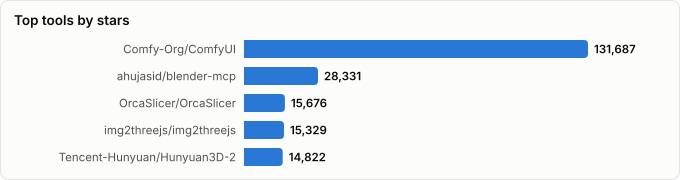
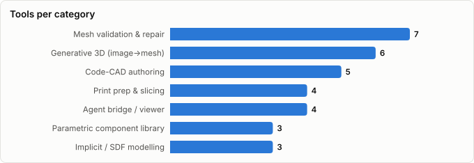

# LLM-Driven 3D Modelling for 3D Printing — Landscape Report

> Derived from **kaiser-data**'s 2,140 starred repos (snapshot `2026-09-12T16:25:05.965Z`), cross-referenced with the repo-similarity graph (2,140 nodes / 7,036 edges, 41 communities).
>
> Generated 2026-09-12 by `scripts/reports/printing_stack.py` (regenerate any time — no API cost).






## Executive summary

- **32 tools** (311,006★ combined) covering the full path from a prompt to g-code, grouped by the stage of the pipeline they own:
  - **Code-CAD authoring** (5): `openscad`, `cadquery`, `build123d`, `modeling-app`, `partmode`
  - **Parametric component library** (3): `BOSL2`, `NopSCADlib`, `cq_warehouse`
  - **Implicit / SDF modelling** (3): `warp`, `sdf`, `libfive`
  - **Generative 3D (image→mesh)** (6): `ComfyUI`, `img2threejs`, `Hunyuan3D-2`, `TRELLIS.2`, `InstantMesh`, `Pixal3D`
  - **Mesh validation & repair** (7): `Open3D`, `instant-meshes`, `meshlab`, `trimesh`, `manifold`, `PyMeshLab`, `pymeshfix`
  - **Print prep & slicing** (4): `OrcaSlicer`, `PrusaSlicer`, `CuraEngine`, `lib3mf`
  - **Agent bridge / viewer** (4): `blender-mcp`, `f3d`, `freecad-mcp`, `meshy-3d-agent`
- **The principle the stack rests on:** chat models are unreliable at emitting mesh geometry and reliable at emitting *code that generates* geometry. Nothing here asks a model for an STL. It writes a script, the script runs, the result is rendered, asserted on, and sliced.
- **Output quality is set by loop tightness, not model choice.** The two stages people skip — rendering the model back to an image the LLM can judge, and asserting on the mesh before slicing — are the two that separate printable output from plausible-looking failures.
- **Looking good and printing are different problems.** The generative tools solve the first and actively work against the second: their meshes are routinely non-manifold, self-intersecting and baseless. The implicit/SDF route sidesteps the whole class of defect by making geometry watertight by construction.
- Authoring is Python and OpenSCAD; the validation, repair and slicing layers are almost entirely C++, which is why they are fast enough to sit inside an automated loop.

## The loop, stage by stage

| Stage | What happens | Tools in your stars |
|---|---|---|
| **Intent** | Prompt, reference images, hard constraints | _the chat model_ |
| **Author** | Emit code, or generate a mesh | `openscad`, `build123d`, `cadquery`, `sdf`, `TRELLIS.2`, `Hunyuan3D-2` |
| **See** | Render back to an image the model can judge | `f3d`, `blender-mcp` |
| **Validate** | Machine-checkable assertions on the mesh | `trimesh`, `manifold`, `Open3D` |
| **Repair** | Make it watertight; fix topology | `pymeshfix`, `PyMeshLab`, `meshlab`, `instant-meshes` |
| **Prep** | Orient, split, hollow, carry materials | `lib3mf`, `blender-mcp`, `freecad-mcp` |
| **Slice** | G-code, and the warnings that come with it | `OrcaSlicer`, `PrusaSlicer`, `CuraEngine` |

Stages **See** and **Validate** are the ones normally missing. Without _See_, the model is authoring blind and iterates on geometry it has never perceived. Without _Validate_, nothing distinguishes a model that will print from one that merely renders.

## Master comparison

Sorted by stars. `Health`/`Lifecycle` are the dataset's computed metrics; `Activity` is derived from days-since-push + 90-day commits. Read the low health scores in this set with care — see *Maintenance & risk* below.

| Tool | Category | Lang | License | ★ Stars | Lifecycle | Health | Activity | Last push | Age | Contrib(90d) |
|---|---|---|---|---|---|---|---|---|---|---|
| [Comfy-Org/ComfyUI](https://github.com/Comfy-Org/ComfyUI) | Generative 3D (image→mesh) | Python | GPL-3.0 | 131,687 | Classic | 85 | very active | 7d ago | 3.7y | 21 |
| [ahujasid/blender-mcp](https://github.com/ahujasid/blender-mcp) | Agent bridge / viewer | Python | MIT | 28,331 | Hot | 58 | very active | 5d ago | 1.5y | 11 |
| [OrcaSlicer/OrcaSlicer](https://github.com/OrcaSlicer/OrcaSlicer) | Print prep & slicing | C++ | AGPL-3.0 | 15,676 | Classic | 83 | very active | 0d ago | 4.2y | 15 |
| [img2threejs/img2threejs](https://github.com/img2threejs/img2threejs) | Generative 3D (image→mesh) | Python | Apache-2.0 | 15,329 | Hot | 68 | very active | 7d ago | 2mo | 3 |
| [Tencent-Hunyuan/Hunyuan3D-2](https://github.com/Tencent-Hunyuan/Hunyuan3D-2) | Generative 3D (image→mesh) | Python | NOASSERTION | 14,822 | Declining | 6 | stale | 10mo ago | 1.6y | 0 |
| [isl-org/Open3D](https://github.com/isl-org/Open3D) | Mesh validation & repair | C++ | NOASSERTION | 13,956 | Classic | 64 | very active | 0d ago | 9.8y | 16 |
| [microsoft/TRELLIS.2](https://github.com/microsoft/TRELLIS.2) | Generative 3D (image→mesh) | Python | MIT | 11,041 | Declining | 26 | slowing | 2mo ago | 9mo | 0 |
| [openscad/openscad](https://github.com/openscad/openscad) | Code-CAD authoring | C++ | NOASSERTION | 10,146 | Classic | 63 | very active | 7d ago | 15.9y | 13 |
| [prusa3d/PrusaSlicer](https://github.com/prusa3d/PrusaSlicer) | Print prep & slicing | C++ | AGPL-3.0 | 9,327 | Classic | 85 | very active | 11d ago | 10.5y | 8 |
| [NVIDIA/warp](https://github.com/NVIDIA/warp) | Implicit / SDF modelling | Python | Apache-2.0 | 7,080 | Classic | 77 | very active | 6d ago | 4.5y | 14 |
| [wjakob/instant-meshes](https://github.com/wjakob/instant-meshes) | Mesh validation & repair | C++ | NOASSERTION | 6,215 | Abandoned | 4 | stale | 4.7y ago | 11.0y | 0 |
| [cnr-isti-vclab/meshlab](https://github.com/cnr-isti-vclab/meshlab) | Mesh validation & repair | C++ | GPL-3.0 | 5,817 | Mature | 43 | active | 18d ago | 9.9y | 1 |
| [CadQuery/cadquery](https://github.com/CadQuery/cadquery) | Code-CAD authoring | Python | NOASSERTION | 5,752 | Classic | 61 | very active | 1d ago | 7.9y | 5 |
| [f3d-app/f3d](https://github.com/f3d-app/f3d) | Agent bridge / viewer | C++ | BSD-3-Clause | 4,669 | Classic | 82 | very active | 8d ago | 6.6y | 14 |
| [TencentARC/InstantMesh](https://github.com/TencentARC/InstantMesh) | Generative 3D (image→mesh) | Python | Apache-2.0 | 4,520 | Abandoned | 4 | stale | 1.7y ago | 2.4y | 0 |
| [mikedh/trimesh](https://github.com/mikedh/trimesh) | Mesh validation & repair | Python | MIT | 3,678 | Classic | 74 | very active | 10d ago | 13.1y | 9 |
| [gumyr/build123d](https://github.com/gumyr/build123d) | Code-CAD authoring | Python | Apache-2.0 | 3,029 | Classic | 67 | very active | 7d ago | 4.2y | 6 |
| [BelfrySCAD/BOSL2](https://github.com/BelfrySCAD/BOSL2) | Parametric component library | OpenSCAD | BSD-2-Clause | 2,361 | Classic | 83 | very active | 2d ago | 7.4y | 5 |
| [elalish/manifold](https://github.com/elalish/manifold) | Mesh validation & repair | C++ | Apache-2.0 | 2,265 | Classic | 82 | very active | 2d ago | 7.5y | 14 |
| [TencentARC/Pixal3D](https://github.com/TencentARC/Pixal3D) | Generative 3D (image→mesh) | Python | MIT | 2,238 | Declining | 40 | active | 11d ago | 4mo | 1 |
| [neka-nat/freecad-mcp](https://github.com/neka-nat/freecad-mcp) | Agent bridge / viewer | Python | MIT | 2,183 | Mature | 59 | very active | 2d ago | 2.8y | 14 |
| [fogleman/sdf](https://github.com/fogleman/sdf) | Implicit / SDF modelling | Python | MIT | 2,001 | Abandoned | 4 | stale | 2.1y ago | 5.6y | 0 |
| [Ultimaker/CuraEngine](https://github.com/Ultimaker/CuraEngine) | Print prep & slicing | C++ | AGPL-3.0 | 1,850 | Classic | 68 | very active | 1d ago | 13.5y | 5 |
| [libfive/libfive](https://github.com/libfive/libfive) | Implicit / SDF modelling | C++ | — | 1,662 | Declining | 11 | stale | 10mo ago | 10.8y | 0 |
| [nophead/NopSCADlib](https://github.com/nophead/NopSCADlib) | Parametric component library | OpenSCAD | GPL-3.0 | 1,633 | Declining | 10 | stale | 11mo ago | 7.3y | 0 |
| [KittyCAD/modeling-app](https://github.com/KittyCAD/modeling-app) | Code-CAD authoring | TypeScript | MIT | 1,294 | Classic | 82 | very active | 0d ago | 3.7y | 12 |
| [cnr-isti-vclab/PyMeshLab](https://github.com/cnr-isti-vclab/PyMeshLab) | Mesh validation & repair | C++ | GPL-3.0 | 975 | Declining | 21 | stale | 7mo ago | 6.2y | 0 |
| [BOMWiki/partmode](https://github.com/BOMWiki/partmode) | Code-CAD authoring | JavaScript | AGPL-3.0 | 521 | Declining | 38 | active | 26d ago | 1mo | 1 |
| [pyvista/pymeshfix](https://github.com/pyvista/pymeshfix) | Mesh validation & repair | C++ | GPL-3.0 | 399 | Mature | 56 | active | 7d ago | 10.0y | 4 |
| [3MFConsortium/lib3mf](https://github.com/3MFConsortium/lib3mf) | Print prep & slicing | C | BSD-2-Clause | 309 | Mature | 41 | active | 3d ago | 11.4y | 0 |
| [gumyr/cq_warehouse](https://github.com/gumyr/cq_warehouse) | Parametric component library | Python | Apache-2.0 | 152 | Abandoned | 6 | stale | 2.6y ago | 5.2y | 0 |
| [meshy-dev/meshy-3d-agent](https://github.com/meshy-dev/meshy-3d-agent) | Agent bridge / viewer | Python | MIT | 88 | Rising | 54 | active | 1mo ago | 5mo | 4 |

## Best tool per task

Rankings combine the dataset's metrics with web research carried out when this generator was written; the evidence column is frozen text and does not refresh with the data.

| Task | 🥇 First pick | 🥈 Second | 🥉 Third | Evidence / note |
|---|---|---|---|---|
| **Functional part that must fit real hardware** | `openscad`<br><sub>+ BOSL2; highest compile-success rate</sub> | `build123d`<br><sub>when you need true fillets and STEP out</sub> | `cadquery`<br><sub>larger ecosystem, more training data</sub> | Text2CAD-Bench (arXiv 2605.18430) found models degrade sharply on raw command sequences versus a Python CAD API; CadQuery-family scripts are the stronger LLM target. |
| **Sculptural piece that must still print** | `sdf`<br><sub>watertight by construction — no repair stage</sub> | `TRELLIS.2`<br><sub>best open visual quality, then repair</sub> | `img2threejs`<br><sub>procedural code from a reference image</sub> | Generative meshes are reported non-manifold with inverted normals and 50k+ unorganised triangles as the normal case; the SDF route avoids the class of defect rather than repairing it. |
| **Turning an AI mesh into something the slicer accepts** | `pymeshfix`<br><sub>one call to a watertight polyhedron</sub> | `instant-meshes`<br><sub>retopology before decimation</sub> | `trimesh`<br><sub>verify the result actually passed</sub> | PyMeshFix implements the MeshFix algorithm: removes singularities, self-intersections and degenerate elements while leaving defect-free regions untouched. |
| **Closing the loop without a human in it** | `f3d`<br><sub>render N cameras headless</sub> | `OrcaSlicer`<br><sub>exit codes + overhang flags as reward</sub> | `blender-mcp`<br><sub>when the fix needs a real modeller</sub> | OrcaSlicer documents a headless CLI with defined exit codes plus --detect-overhang-wall and --make-overhang-printable, which is what makes automated pass/fail possible. |
| **Letting an agent drive an application directly** | `blender-mcp`<br><sub>28k★; mesh, materials, print toolbox</sub> | `freecad-mcp`<br><sub>parametric, leaves a feature tree</sub> | `modeling-app`<br><sub>commercial text-to-CAD + agent</sub> | Zoo shipped the Zookeeper conversational CAD agent with Design Studio v1.1 in Jan 2026, adding engine-level tools to inspect and debug geometry mid-generation. |

## By category

### Code-CAD authoring

_LLMs are unreliable at emitting vertices and good at emitting code. These are the targets that code gets written against — the choice sets your compile-success rate._

- **[openscad/openscad](https://github.com/openscad/openscad)** · 10,146★ · C++ · Classic  
  CSG solid modeller scripted in its own language. The largest CAD corpus any LLM has trained on — generated code compiles more often than for any other target here.  
  <sub>topics: 3d-models, dxf-files, openscad, 3d-graphics, 3d-printing, c-plus-plus, qt5, opengl</sub>
- **[CadQuery/cadquery](https://github.com/CadQuery/cadquery)** · 5,752★ · Python · Classic  
  Python on the OpenCascade B-rep kernel; fluent API, real fillets/chamfers, STEP export. Larger ecosystem than build123d.  
  <sub>topics: python, parametric, cad, 3d, modeling, brep, opencascade, occt</sub>
- **[gumyr/build123d](https://github.com/gumyr/build123d)** · 3,029★ · Python · Classic  
  The cleaner successor API to CadQuery — same OCCT kernel, builder + algebra modes, far more Pythonic to generate.  
  <sub>topics: 3d, brep, cad, cadquery, opencascade, python, 3d-models, 3d-printing</sub>
- **[KittyCAD/modeling-app](https://github.com/KittyCAD/modeling-app)** · 1,294★ · TypeScript · Classic  
  Zoo Design Studio: the KCL language, a native text-to-CAD ML API and the Zookeeper conversational agent on a purpose-built B-rep engine.  
  <sub>topics: electron, playwright, react, tailwind, vitest, wasm</sub>
- **[BOMWiki/partmode](https://github.com/BOMWiki/partmode)** · 521★ · JavaScript · Declining  
  Local-first parametric CAD running in the browser on OpenCascade — a good human review surface for agent-authored geometry.  
  <sub>topics: browser-cad, cad, opencascade, parametric-modeling, webassembly, 3d-modeling, ai-agents, brep</sub>

### Parametric component library

_Grounding. Handing the model a library of correct parts beats asking it to derive involute gear maths or an M3 thread, which it will get subtly and invisibly wrong._

- **[BelfrySCAD/BOSL2](https://github.com/BelfrySCAD/BOSL2)** · 2,361★ · OpenSCAD · Classic  
  Threads, gears, rounding, joiners and attachments for OpenSCAD. The single biggest quality jump available to an LLM authoring loop.  
  <sub>topics: scad, openscad-library, openscad, openscad-framework</sub>
- **[nophead/NopSCADlib](https://github.com/nophead/NopSCADlib)** · 1,633★ · OpenSCAD · Declining  
  Hundreds of real 'vitamins' — fasteners, bearings, extrusions, PSUs — with correct measured dimensions.  
  <sub>topics: openscad, 3d-printing</sub>
- **[gumyr/cq_warehouse](https://github.com/gumyr/cq_warehouse)** · 152★ · Python · Abandoned  
  Bearings, fasteners and thread profiles with real dimensions for CadQuery / build123d.  
  <sub>topics: —</sub>

### Implicit / SDF modelling

_The missing middle between boxy CSG and beautiful-but-broken generative meshes: organic form that is manifold by construction, so the repair stage never happens._

- **[NVIDIA/warp](https://github.com/NVIDIA/warp)** · 7,080★ · Python · Classic  
  Differentiable GPU kernels with marching cubes — the performant route to SDF and volumetric geometry.  
  <sub>topics: differentiable-programming, python, gpu-acceleration, nvidia, gpu, cuda, nvidia-warp</sub>
- **[fogleman/sdf](https://github.com/fogleman/sdf)** · 2,001★ · Python · Abandoned  
  Signed-distance-function modelling in Python. Organic shapes that are watertight by construction — skips the repair stage entirely.  
  <sub>topics: signed-distance-functions, sdf, python, mesh, 3d, 3d-printing, 3d-models</sub>
- **[libfive/libfive](https://github.com/libfive/libfive)** · 1,662★ · C++ · Declining  
  The heavier implicit-geometry kernel; functional representation with interactive meshing.  
  <sub>topics: cad, design, scheme, 3dprinting, guile</sub>

### Generative 3D (image→mesh)

_Where visual impact comes from — and where printability goes to die. Output is routinely non-manifold, self-intersecting, baseless and sub-nozzle in places._

- **[Comfy-Org/ComfyUI](https://github.com/Comfy-Org/ComfyUI)** · 131,687★ · Python · Classic  
  The node graph that actually runs the generators above locally, reproducibly, with the pre/post steps attached.  
  <sub>topics: stable-diffusion, pytorch, ai, python, comfy, comfyui</sub>
- **[img2threejs/img2threejs](https://github.com/img2threejs/img2threejs)** · 15,329★ · Python · Hot  
  Rebuilds a reference image as procedural, quality-gated *code* rather than a mesh — the generative look with code-CAD guarantees.  
  <sub>topics: 3d, ai-agents, claude-code, computer-graphics, generative, image-to-3d, procedural-generation, threejs</sub>
- **[Tencent-Hunyuan/Hunyuan3D-2](https://github.com/Tencent-Hunyuan/Hunyuan3D-2)** · 14,822★ · Python · Declining  
  Open-weight shape + PBR texture generation. Different failure modes to TRELLIS, so useful as a second opinion.  
  <sub>topics: 3d, 3d-aigc, 3d-generation, image-to-3d, text-to-3d, texture-generation, hunyuan3d, diffusion-models</sub>
- **[microsoft/TRELLIS.2](https://github.com/microsoft/TRELLIS.2)** · 11,041★ · Python · Declining  
  Structured-latent 3D generation; the strongest open-weight visual quality for image-to-3D.  
  <sub>topics: —</sub>
- **[TencentARC/InstantMesh](https://github.com/TencentARC/InstantMesh)** · 4,520★ · Python · Abandoned  
  Fast feed-forward single-image-to-3D via multi-view diffusion + sparse-view reconstruction.  
  <sub>topics: —</sub>
- **[TencentARC/Pixal3D](https://github.com/TencentARC/Pixal3D)** · 2,238★ · Python · Declining  
  Pixel-aligned 3D generation from images (SIGGRAPH 2026); tighter fidelity to a reference than diffusion-only paths.  
  <sub>topics: —</sub>

### Mesh validation & repair

_The layer that decides whether a model prints. Assertions first, repair second, retopology third. Everything here is scriptable, which is the point._

- **[isl-org/Open3D](https://github.com/isl-org/Open3D)** · 13,956★ · C++ · Classic  
  Point-cloud and mesh operations — the entry point if geometry comes from scanning rather than generating.  
  <sub>topics: mesh-processing, computer-graphics, opengl, cpp, python, reconstruction, odometry, visualization</sub>
- **[wjakob/instant-meshes](https://github.com/wjakob/instant-meshes)** · 6,215★ · C++ · Abandoned  
  Instant field-aligned retopology. Turns 200k unstructured generative triangles into a clean quad mesh that slices predictably.  
  <sub>topics: —</sub>
- **[cnr-isti-vclab/meshlab](https://github.com/cnr-isti-vclab/meshlab)** · 5,817★ · C++ · Mature  
  The canonical mesh processing and repair application — the interactive surface for diagnosing what went wrong.  
  <sub>topics: 3d, mesh, mesh-processing, 3d-printing, mesh-simplification, triangle-mesh, mesh-editing, mesh-generation</sub>
- **[mikedh/trimesh](https://github.com/mikedh/trimesh)** · 3,678★ · Python · Classic  
  The assert layer. is_watertight, winding consistency, Euler number, volume and bounds — turns 'looks fine' into a pass/fail an agent can loop against.  
  <sub>topics: mesh, triangular-meshes, geometry, python</sub>
- **[elalish/manifold](https://github.com/elalish/manifold)** · 2,265★ · C++ · Classic  
  Guaranteed-manifold boolean kernel — also what modern OpenSCAD uses internally. Booleans that cannot emit broken geometry.  
  <sub>topics: —</sub>
- **[cnr-isti-vclab/PyMeshLab](https://github.com/cnr-isti-vclab/PyMeshLab)** · 975★ · C++ · Declining  
  MeshLab's filter set as a Python API. Without it, none of the repair capability is scriptable.  
  <sub>topics: —</sub>
- **[pyvista/pymeshfix](https://github.com/pyvista/pymeshfix)** · 399★ · C++ · Mature  
  One call turns a generative mesh into a watertight polyhedron: removes singularities, self-intersections and degenerate faces.  
  <sub>topics: mesh-processing, mesh, 3d-reconstruction, 3d</sub>

### Print prep & slicing

_Slicing headlessly and reading the result back is the loop's reward signal: print time, filament, support volume, and hard failures._

- **[OrcaSlicer/OrcaSlicer](https://github.com/OrcaSlicer/OrcaSlicer)** · 15,676★ · C++ · Classic  
  The slicer to automate against: documented CLI, exit codes, and overhang detection/mitigation flags.  
  <sub>topics: 3d-printer, 3d-printing, makers, orca, orcaslicer, slicer</sub>
- **[prusa3d/PrusaSlicer](https://github.com/prusa3d/PrusaSlicer)** · 9,327★ · C++ · Classic  
  The reference slicer every Orca-family fork descends from; same CLI patterns, useful as a cross-check.  
  <sub>topics: —</sub>
- **[Ultimaker/CuraEngine](https://github.com/Ultimaker/CuraEngine)** · 1,850★ · C++ · Classic  
  Headless slicing engine with no GUI attached — the easiest thing to embed directly in a loop.  
  <sub>topics: curaengine, cura, c-plus-plus, gcode-generation, libarcus, gcode, protobuf</sub>
- **[3MFConsortium/lib3mf](https://github.com/3MFConsortium/lib3mf)** · 309★ · C · Mature  
  Reference implementation of 3MF. STL discards colour, materials and per-object settings; 3MF is the only format that carries them.  
  <sub>topics: —</sub>

### Agent bridge / viewer

_The wiring. Bridges hand an agent a real modelling application; the viewer closes the perception gap by turning geometry back into an image the model can judge._

- **[ahujasid/blender-mcp](https://github.com/ahujasid/blender-mcp)** · 28,331★ · Python · Hot  
  Puts Blender under direct agent control — print-toolbox checks, booleans, displacement, decimation.  
  <sub>topics: 3d-modeling, ai, blender, blender-addon, claude, generative-ai, llm, mcp</sub>
- **[f3d-app/f3d](https://github.com/f3d-app/f3d)** · 4,669★ · C++ · Classic  
  Fast CLI 3D viewer that screenshots from arbitrary cameras — the render-back step that gives a vision model eyes.  
  <sub>topics: stl-viewer, gltf-viewer, vtk, 3d-viewer, raytracing, physically-based-rendering, volume-rendering, command-line-tool</sub>
- **[neka-nat/freecad-mcp](https://github.com/neka-nat/freecad-mcp)** · 2,183★ · Python · Mature  
  Parametric GUI CAD under agent control, leaving a feature tree a human can pick up afterwards.  
  <sub>topics: mcp, claude, freecad</sub>
- **[meshy-dev/meshy-3d-agent](https://github.com/meshy-dev/meshy-3d-agent)** · 88★ · Python · Rising  
  Agent skills for a hosted 3D-generation platform; a reference pattern for wiring generation into a tool loop.  
  <sub>topics: 3d-generation, agent-skills, ai, claude-code-skills, claude-skills, cursor-skills, meshy, skill-md</sub>

## Three stacks worth assembling

### 1. Parametric, agent-driven — functional parts

For enclosures, brackets, adapters: anything that has to fit something that already exists.

```
prompt → openscad + BOSL2 → f3d renders 4 cameras → vision critique → re-author
                                     ↓ (on pass)
                       trimesh asserts → OrcaSlicer CLI → g-code + warnings
```

The critique and assert steps both feed back to authoring. Compile success is highest here because OpenSCAD is the best-represented CAD language in training data, and BOSL2 removes the geometry the model would otherwise derive incorrectly.

### 2. Generative, repaired — sculptural work

Highest visual ceiling, longest path to something printable.

```
reference image → ComfyUI[TRELLIS.2 | Hunyuan3D-2] → instant-meshes retopo
     → pymeshfix watertight → trimesh verify → blender-mcp orient/base → slicer
```

Every stage after generation exists to undo a property of generative output. Budget for it: a mesh that renders beautifully will typically fail `is_watertight` on the first try.

### 3. Implicit / SDF — organic form, no repair stage

The route that gets skipped most often and deserves to be tried first for sculptural work.

```
prompt → model writes an SDF (fogleman/sdf) → marching cubes → watertight by construction
     → f3d render → critique → straight to slicer
```

No repair layer, because the class of defect cannot occur. The trade is that form is expressed as maths rather than sculpted — which happens to be a thing language models are good at writing.

## Graph analysis — how they relate

**Community clustering.** These 32 tools span **11 of the graph's 41 communities**.

- **Community 1** (10): `openscad/openscad`, `libfive/libfive`, `cnr-isti-vclab/meshlab`, `cnr-isti-vclab/PyMeshLab`, `wjakob/instant-meshes`, `isl-org/Open3D`, `OrcaSlicer/OrcaSlicer`, `prusa3d/PrusaSlicer`, `Ultimaker/CuraEngine`, `f3d-app/f3d`
- **Community 2** (6): `CadQuery/cadquery`, `gumyr/build123d`, `BOMWiki/partmode`, `gumyr/cq_warehouse`, `fogleman/sdf`, `neka-nat/freecad-mcp`
- **Community 6** (4): `Tencent-Hunyuan/Hunyuan3D-2`, `TencentARC/Pixal3D`, `TencentARC/InstantMesh`, `meshy-dev/meshy-3d-agent`
- **Community 4** (3): `BelfrySCAD/BOSL2`, `nophead/NopSCADlib`, `img2threejs/img2threejs`
- **Community 7** (3): `Comfy-Org/ComfyUI`, `elalish/manifold`, `pyvista/pymeshfix`

**Centrality (PageRank in the full graph)** — the most hub-like tools of this set:

- `neka-nat/freecad-mcp` — PageRank 0.0053
- `CadQuery/cadquery` — PageRank 0.0051
- `gumyr/cq_warehouse` — PageRank 0.0051
- `fogleman/sdf` — PageRank 0.0049
- `KittyCAD/modeling-app` — PageRank 0.0022
- `gumyr/build123d` — PageRank 0.0011
- `NVIDIA/warp` — PageRank 0.0010
- `pyvista/pymeshfix` — PageRank 0.0010
- `isl-org/Open3D` — PageRank 0.0007
- `cnr-isti-vclab/meshlab` — PageRank 0.0007

**Direct links** (similarity edges where both endpoints are in this report):

- `gumyr/cq_warehouse` ⇄ `gumyr/build123d` (w=0.550)
- `cnr-isti-vclab/PyMeshLab` ⇄ `cnr-isti-vclab/meshlab` (w=0.550)
- `TencentARC/InstantMesh` ⇄ `TencentARC/Pixal3D` (w=0.550)
- `CadQuery/cadquery` ⇄ `gumyr/build123d` (w=0.450) — topics: python, cad, 3d, brep
- `fogleman/sdf` ⇄ `gumyr/build123d` (w=0.383) — topics: python, 3d, 3d-printing, 3d-models
- `pyvista/pymeshfix` ⇄ `cnr-isti-vclab/meshlab` (w=0.383) — topics: mesh-processing, mesh, 3d-reconstruction, 3d
- `fogleman/sdf` ⇄ `mikedh/trimesh` (w=0.272) — topics: python, mesh
- `fogleman/sdf` ⇄ `cnr-isti-vclab/meshlab` (w=0.267) — topics: mesh, 3d, 3d-printing, 3d-models
- `nophead/NopSCADlib` ⇄ `BelfrySCAD/BOSL2` (w=0.250) — topics: openscad
- `pyvista/pymeshfix` ⇄ `openscad/openscad` (w=0.231) — topics: 3d; authors: dependabot[bot]
- `Tencent-Hunyuan/Hunyuan3D-2` ⇄ `meshy-dev/meshy-3d-agent` (w=0.226) — topics: 3d-generation, image-to-3d, text-to-3d
- `pyvista/pymeshfix` ⇄ `f3d-app/f3d` (w=0.213) — topics: 3d; authors: dependabot[bot]
- `openscad/openscad` ⇄ `gumyr/build123d` (w=0.200) — topics: 3d-models, 3d-printing, 3d, cad
- `f3d-app/f3d` ⇄ `openscad/openscad` (w=0.189) — topics: 3d, 3d-graphics; authors: dependabot[bot]
- `CadQuery/cadquery` ⇄ `BOMWiki/partmode` (w=0.185) — topics: parametric, cad, 3d, brep
- …and 27 more.

## Maintenance & risk signal

This set breaks the usual reading of health scores, so it is worth stating plainly: **a geometry library with a low health score is often finished rather than dead.** Mesh algorithms and fastener dimensions do not change. Commit velocity is a poor proxy for viability here in a way it is not for, say, an agent framework.

**Low health, but finished — safe to depend on:**

- **`wjakob/instant-meshes`** · health 4 · Abandoned — Research code from the 2015 SIGGRAPH paper. Feature-complete and still the default field-aligned retopology tool; nothing has replaced it.
- **`fogleman/sdf`** · health 4 · Abandoned — A small, complete single-purpose library. The SDF maths does not change.
- **`nophead/NopSCADlib`** · health 10 · Declining — A dimension library. Slow commit rate reflects a stable parts catalogue, not neglect.
- **`gumyr/cq_warehouse`** · health 6 · Abandoned — Same — a fastener and bearing catalogue; churn would be a bad sign.

**Low health for the ordinary reason — treat with care:**

- **`Tencent-Hunyuan/Hunyuan3D-2`** · health 6 · Declining — Pinned to the 2.x line while the upstream family has moved on; treat as a snapshot, not a maintained dependency.
- **`TencentARC/InstantMesh`** · health 4 · Abandoned — No push since Jan 2025 and superseded by TRELLIS.2 on quality. Keep for speed comparisons; do not build on it.
- **`cnr-isti-vclab/PyMeshLab`** · health 21 · Declining — Binding lags the MeshLab application it wraps. Have pymeshfix as a fallback.

Bus factor = commit concentration (1 = single-maintainer risk).

| Tool | Health | Lifecycle | Activity | Bus factor | Top-author share | Releases |
|---|---|---|---|---|---|---|
| Comfy-Org/ComfyUI | 85 | Classic | very active | 3 | 26% | 154 |
| prusa3d/PrusaSlicer | 85 | Classic | very active | 3 | 21% | 185 |
| BelfrySCAD/BOSL2 | 83 | Classic | very active | 2 | 37% | 20 |
| OrcaSlicer/OrcaSlicer | 83 | Classic | very active | 2 | 27% | 79 |
| KittyCAD/modeling-app | 82 | Classic | very active | 2 | 43% | 338 |
| elalish/manifold | 82 | Classic | very active | 3 | 29% | 26 |
| f3d-app/f3d | 82 | Classic | very active | 2 | 36% | 70 |
| NVIDIA/warp | 77 | Classic | very active | 1 | 70% | 54 |
| mikedh/trimesh | 74 | Classic | very active | 1 | 82% | 493 |
| img2threejs/img2threejs | 68 | Hot | very active | 1 | 66% | 7 |
| Ultimaker/CuraEngine | 68 | Classic | very active | 2 | 36% | 5 |
| gumyr/build123d | 67 | Classic | very active | 1 | 58% | 14 |
| isl-org/Open3D | 64 | Classic | very active | 3 | 24% | 23 |
| openscad/openscad | 63 | Classic | very active | 1 | 50% | 11 |
| CadQuery/cadquery | 61 | Classic | very active | 1 | 67% | 18 |
| neka-nat/freecad-mcp | 59 | Mature | very active | 1 | 66% | 0 |
| ahujasid/blender-mcp | 58 | Hot | very active | 1 | 75% | 0 |
| pyvista/pymeshfix | 56 | Mature | active | 1 | 50% | 9 |
| meshy-dev/meshy-3d-agent | 54 | Rising | active | 2 | 45% | 2 |
| cnr-isti-vclab/meshlab | 43 | Mature | active | 1 | 100% | 27 |
| 3MFConsortium/lib3mf | 41 | Mature | active | 0 | 0% | 20 |
| TencentARC/Pixal3D | 40 | Declining | active | 1 | 100% | 0 |
| BOMWiki/partmode | 38 | Declining | active | 1 | 100% | 1 |
| microsoft/TRELLIS.2 | 26 | Declining | slowing | 0 | 0% | 0 |
| cnr-isti-vclab/PyMeshLab | 21 | Declining | stale | 0 | 0% | 24 |
| libfive/libfive | 11 | Declining | stale | 0 | 0% | 0 |
| nophead/NopSCADlib | 10 | Declining | stale | 0 | 0% | 0 |
| gumyr/cq_warehouse | 6 | Abandoned | stale | 0 | 0% | 15 |
| Tencent-Hunyuan/Hunyuan3D-2 | 6 | Declining | stale | 0 | 0% | 0 |
| fogleman/sdf | 4 | Abandoned | stale | 0 | 0% | 0 |
| TencentARC/InstantMesh | 4 | Abandoned | stale | 0 | 0% | 0 |
| wjakob/instant-meshes | 4 | Abandoned | stale | 0 | 0% | 0 |

## Which one should you use?

| If you want… | Start with | Why |
|---|---|---|
| The highest chance that generated code just compiles | `openscad/openscad` + `BelfrySCAD/BOSL2` | Biggest training corpus of any CAD target, and BOSL2 supplies the primitives the model would otherwise derive wrong. |
| Parts with real fillets that export to STEP | `gumyr/build123d` | OCCT B-rep kernel with the most generation-friendly Python API here. |
| Organic shapes without a repair stage | `fogleman/sdf` | Signed distance functions mesh to watertight geometry by construction. |
| Maximum visual impact from a reference image | `microsoft/TRELLIS.2` | Strongest open-weight image-to-3D quality — budget for retopology and repair after it. |
| A single assertion to gate every model | `mikedh/trimesh` | is_watertight plus volume and bounds is 90% of the value for three lines of code. |
| Automated slicing you can read results from | `OrcaSlicer/OrcaSlicer` | Documented CLI, exit codes and overhang detection; health 83 and shipping. |
| Colour or multi-material output | `3MFConsortium/lib3mf` | STL cannot carry it; 3MF can. |
| An agent that operates a real modeller | `ahujasid/blender-mcp` | 28k★ and the broadest capability surface of the bridges here. |

## Constraints to put in the system prompt

A model will not infer these, and stating them removes most unprintable output before the first render. Figures assume a 0.4 mm nozzle on FDM.

| Constraint | Value | Note |
|---|---|---|
| Minimum wall thickness | 0.8–1.2 mm | 2–3 perimeters |
| Unsupported overhang | ≤ 45° | 55° achievable with good part cooling |
| Unsupported bridge | 5–10 mm | longer spans need support |
| Smallest feature | 0.4 mm wide, 0.3 mm deep | below nozzle width it disappears |
| Clearance, loose fit | 0.3 mm | press fit 0.1 mm |
| Minimum hole diameter | 2 mm | holes print ~0.15 mm undersize |
| Bottom-edge chamfer | 0.2 mm | counteracts elephant's foot |
| Resin hollowing | 2 mm wall | plus 2 × 3 mm drain holes |
| Build volume | 256³ mm typical | split beyond, with registration features |

Three rules that matter more than any single number: **require a flat base** — generative models almost never produce one, and it is the most common cause of a failed art print; **state which axis takes load**, because parts are weakest across layer lines; and **split oversized parts with dovetails or pins**, not a bare plane cut — BOSL2 has both.

## Adjacent (deliberately not listed)

- **agmmnn/awesome-blender** (7,281★) — a curated *list*, not a tool — useful for finding the Blender 3D-Print Toolbox, but not part of the stack
- **voxel51/fiftyone** (11,059★) — dataset curation for visual AI; matched on 'voxel' but unrelated to solid modelling
- **CesiumGS/3d-tiles** (2,600★) — geospatial 3D streaming — a different meaning of 3D entirely
- **the3deer/android-3D-model-viewer** (1,553★) — an Android STL/OBJ viewer app, not a modelling or prep tool
- **modelcontextprotocol/servers** (90,105★) — the MCP substrate the bridges build on — covered in the *MCP tooling* report
- **blender/blender** — not starred; reachable via `blender-mcp` and listed there instead

## Build something with this stack

Ready-to-paste build prompts generated from this report's stack — the tools above, wired into a brief an LLM can act on.

- **Tree-stump base for a Pokal** — A naturalistic tree-stump plinth for an existing trophy, sized entirely from measurements of the trophy it carries.  
  <sub>`prompts/stump-base.md`</sub>

## Methodology & caveats

- **Source**: `data/classified.json` + `public/data/graph.json`. No external calls at generation time; fully reproducible.
- **Selection**: keyword scan over `full_name + description + topics + README` for 35 CAD, mesh and printing terms, then a cross-check of 60 curated ecosystem repos for presence, then manual curation into pipeline stages. Name collisions were filtered by description — 'mesh' matches service meshes, 'cura' matches 'accuracy', 'stl' matches Rust and C++ standard-library references.
- **Origin**: this landscape began as a gap audit. At the 2026-09-06 snapshot only 12 of these tools were starred and four of the seven pipeline stages had no coverage at all; the validation, print-prep and slicing layers were entirely absent. Twenty-one repos were added on 2026-09-12 to close those gaps, and this report covers the completed set.
- **Task rankings** are backed by web research carried out at authoring time (Text2CAD-Bench arXiv:2605.18430; OrcaSlicer CLI documentation; PyMeshFix/MeshFix documentation; Zoo Design Studio release notes; open image-to-3D comparisons, September 2026). That text is frozen in the generator and will not refresh with the dataset — re-verify when major releases land.
- **Printing figures** are conventional starting points for FDM at 0.4 mm, not measurements from your printer. Calibrate with test coupons before trusting a tolerance.
- **Metrics** (health, lifecycle, bus_factor) are precomputed at snapshot time and lag GitHub's current state. In this set especially, low health frequently means *finished* — see above.

<sub>Tools covered: 32 · Snapshot: 2026-09-12T16:25:05.965Z</sub>
